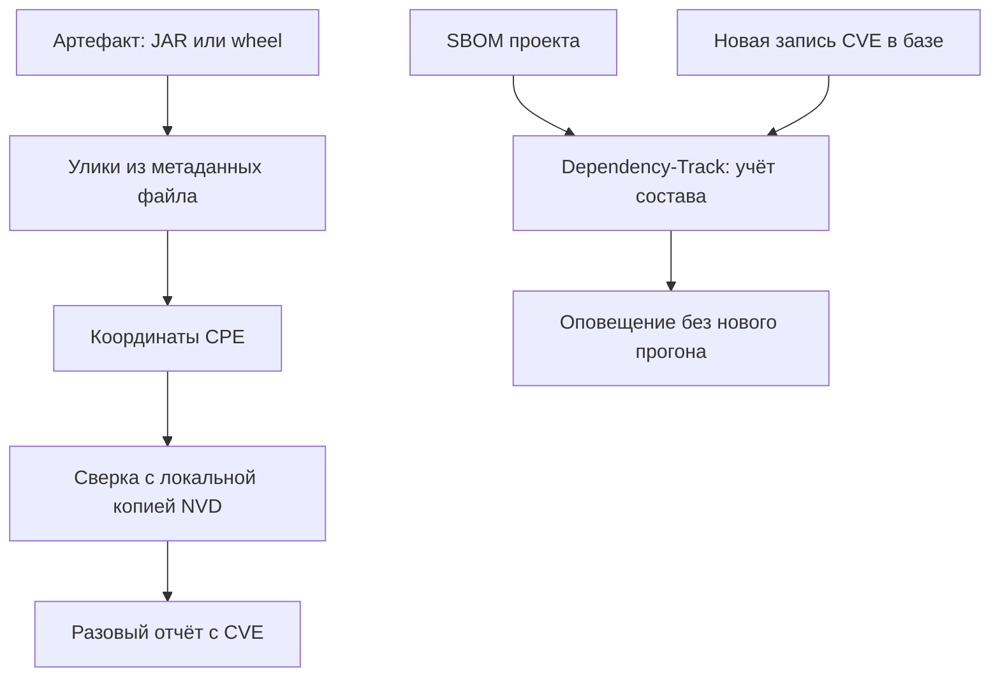

# Dependency-Check и Dependency-Track

Один и тот же проект, один и тот же сканер, два прогона — разница только в
том, что подано на вход:

```text
что подано на скан                      опознано зависимостей   найдено CVE
pom.xml и requirements.txt                                 0             0
log4j-core-2.14.1.jar + log4j-api-2.14.1.jar               2            16
```

Первый прогон честно отработал и вернул пустой отчёт. Второй опознал две
зависимости и нашёл по ним шестнадцать записей об уязвимостях, среди них
`CVE-2021-44228` с баллом 10.0. При этом состав в обоих случаях один:
манифесты первого прогона объявляют ровно тот log4j, который второй прогон
получил настоящими файлами. Значит, пустой отчёт первого прогона означает не
«зависимости чистые», а «сверять было не с чем».

Сканер называется Dependency-Check, и опознаёт он сам артефакт — собранный
файл поставки, — а не объявление о нём. Второй инструмент пары, Dependency-Track, сканирует вообще
не состав: он принимает ведомость состава на учёт и следит за ней во времени.
И вопрос к этой паре на понимание, а не на пересказ: прогон, показавший ноль
находок при тридцати опознанных зависимостях, чище первого или честнее?

## Что такое SCA

Почти любое приложение собрано из чужих библиотек. Каждая из них может нести
известную уязвимость: запись о дефекте опубликована, и любой, кто знает
версию библиотеки, знает и про дефект. SCA (software composition analysis,
анализ состава) — класс инструментов, которые делают с этим две вещи. Сначала
инструмент перечисляет состав проекта, потом сверяет его с базой известных
уязвимостей.

Бытовой пример — отзыв партии товара. Магазин сверяет полки со списком
отозванных партий: совпали производитель, товар и номер партии — товар
снимают с продажи. Полки здесь соответствуют составу проекта, список отзывов
— базе уязвимостей, а номер партии — координатам библиотеки. Ломается
аналогия на свежести: список отзывов приходит раз в неделю, а база
уязвимостей пополняется каждый день, поэтому сверку приходится повторять
снова и снова.

Оба инструмента этой темы — свободные проекты OWASP, и работают они в паре.
Dependency-Check — сканер: он берёт зависимости проекта, опознаёт их и выдаёт
разовый отчёт с номерами CVE. Dependency-Track — сервер учёта: он принимает
SBOM, хранит состав множества проектов и следит за их уязвимостями во времени.
Когда на уже поставленный компонент выходит новая запись, тревогу поднимает
учёт — без очередного прогона сканера.

Разница между ними — разница между «просканировал разово» и «слежу постоянно».
Разовый скан отвечает на вопрос «что не так на день скана». Учёт отвечает на
вопрос «что стало не так после того, как мы собрали релиз». Класс дефекта у
обоих один — опора на компонент с известной уязвимостью (`CWE-1395`). Чинится
он обновлением уязвимого пакета и закреплением его версии, и эта починка
разобрана в `transitive-dependencies`.

**Зачем это в работе AppSec-инженера.** Пару «сканер плюс учёт» любят
представлять как готовое решение: поставил — и состав под контролем. Инженеру
важно знать, где проходит граница. Сканер полезен ровно настолько, насколько
верно он опознал зависимости. Учёт полезен ровно настолько, насколько полны
поданные в него ведомости.

## Как это работает

**Откуда это взялось.** Сначала уязвимости в зависимостях искали руками:
состав проекта сверяли с опубликованными списками CVE. Поток записей рос, и
ручная сверка перестала за ним поспевать. Dependency-Check автоматизировал
сверку состава с базой NVD — национальной базой уязвимостей, где каждая
запись CVE получает описание и балл. А Dependency-Track добавил то, чего
разовому скану не хватало: память во времени. Состав однажды поданного релиза
остаётся под наблюдением и после сборки.

Dependency-Check опознаёт зависимость не по манифесту, а по самому артефакту,
и здесь нужно развести два слова. Манифест — файл объявлений вроде `pom.xml`
или `requirements.txt`: в нём записано, какие библиотеки проект хочет.
Артефакт — собранный файл, который проект реально несёт в поставке: в Java
это пакет `.jar`, в Python — пакет wheel. Манифест говорит о намерении,
артефакт — о факте: объявленное может не собраться, а собранное может
отличаться от объявленного.

Сканер вскрывает артефакт и собирает улики — имена, версии и сведения о
поставщике из метаданных файла. Из улик выводятся координаты пакета в формате
CPE: это стандартное имя вида «поставщик:продукт:версия», по которому запись
в базе адресует конкретный продукт. Эти координаты сканер сверяет со своей
локальной копией базы NVD. Отсюда ключевое поведение инструмента: без
реального артефакта опознавать нечего, потому что улик в манифесте нет.



**Описание схемы.** Верхняя ветвь — путь разового скана: сканер вскрывает
артефакт и собирает улики. Из улик выводятся координаты пакета, они сверяются
с локальной копией базы уязвимостей, и результатом становится отчёт. Нижняя
ветвь — учёт: Dependency-Track принимает SBOM на хранение. Когда в базе
появляется запись об уже поданном компоненте, сервер оповещает сам, без
нового прогона сканера.

Тема — рецепт, поэтому из устройства здесь только то, без чего не прочитать
отчёт. Как читать сами записи CVE и их баллы, разбирает `cve-cvss`. Откуда в
составе берётся транзитивный слой — `transitive-dependencies`. Что такое SBOM,
который потребляет Dependency-Track, — тема `sbom`.

## Что умеет и чего не умеет

**Что умеет.** Dependency-Check опознаёт зависимости по артефактам многих
экосистем и сверяет их с NVD. На выходе — отчёт, где у каждой находки есть
номер CVE, балл и ссылка на источник. Dependency-Track принимает SBOM в
формате CycloneDX, хранит портфель проектов и показывает их уязвимости на
дашборде — общем экране, где виден весь портфель сразу. Главное, чего не даёт
разовый скан, — оповещения о новых записях по уже поданному составу. Разделение
труда здесь жёсткое: сканирует один, помнит другой.

**Чего не умеет.** Первое и главное — опознавать состав из одного манифеста.
Это показывает прогон из вступления: на стенде из `pom.xml` и
`requirements.txt` без единого артефакта сканер нашёл ноль зависимостей,
потому что сверять было нечего. Тот же log4j, поданный настоящими
JAR-файлами, опознан сразу: две зависимости, шестнадцать CVE. Этим
Dependency-Check отличается от сканеров, читающих манифест напрямую, например
от `trivy`. Он сильнее там, где есть собранные артефакты, и слабее на голом
дереве исходников.

Второе ограничение общее для всех сканеров по базе: инструмент не видит
новизну. Свежая закладка, на которую ещё нет записи в NVD, пройдёт мимо
отчёта; такие сценарии разбирает `supply-chain-threats`. Третье касается
второй половины пары. Dependency-Track не сканирует сам, он учитывает
поданное. Мусорная ведомость даст мусорный учёт, и ответственность за её
полноту лежит на том, кто подаёт (`sbom`).

## Как запустить

Dependency-Check 13.0.0 работает в два шага: сначала наполняет локальную базу
NVD, потом сканирует:

```bash
# один раз: наполнить базу NVD (кэшируется в --data)
dependency-check.sh --updateonly --data dc-data
# скан артефактов проекта
dependency-check.sh --scan build/libs --data dc-data --noupdate
```

Первая команда скачивает базу и складывает её в каталог `dc-data`. Без
бесплатного ключа API NVD это занимает десятки минут: база большая, а сервер
ограничивает скорость анонимных запросов. Цена при этом разовая, потому что
база кэшируется и дальше переиспользуется. Ключ `--noupdate` при скане
обязателен, если база уже наполнена: без него каждый прогон снова полезет в
сеть.

Объект скана — каталог с собранными артефактами (JAR, wheel), а не исходники.
Для `pom.xml` или `requirements.txt` без артефактов опознавать почти нечего.
Часть lock-файлов сканер всё же читает: lock-файл вроде `package-lock.json`
фиксирует точные версии всего графа зависимостей, поэтому улики из него
собрать можно.

База — снимок на дату наполнения. Эту дату записывают рядом с отчётом, потому
что покрытие скана отсчитывается от неё. Записей моложе снимка в базе нет, и
скан их не увидит, как бы долго он ни работал.

## Как читать вывод

Находка в отчёте привязана к опознанному файлу:

```text
log4j-core-2.14.1.jar
  CVE-2021-44228  CRITICAL  cvssv3=10.0  source=NVD
  CVE-2021-45046  CRITICAL
  ... всего 10 CVE
```

Читается фрагмент сверху вниз. Сверху стоит артефакт, опознанный по уликам
самого файла. Под ним — найденные записи: номер CVE, уровень критичности,
балл и источник. Поле `source=NVD` важно читать явно: балл взят из конкретной
базы, и у другого источника он мог бы отличаться — это разобрано в
`cve-cvss`.

На стенде `log4j-core` дал десять CVE, `log4j-api` — шесть, вместе
шестнадцать. Тот же состав, поданный манифестом, дал ноль. Отсюда главное
правило чтения: пустой отчёт означает не «уязвимостей нет», а «сверять было
почти не с чем». Отличить одно от другого можно только по числу опознанного,
а не по числу находок.

Что делать с находкой — обновить уязвимый пакет до исправленной версии и
закрепить её. Эта починка разобрана в `transitive-dependencies` и сюда не
переписывается. Dependency-Track ту же находку поставит на учёт, а не покажет
разово. Когда для `log4j-core` выйдет ещё одна запись, сервер оповестит без
повторного скана.

## Границы метода

**Граница первая: нужны артефакты.** Ноль находок на манифесте — не «чисто»,
а «почти нечего опознавать». Закрывается это двумя способами: либо сканом
собранных артефактов, либо сканером, читающим манифест напрямую, например
`trivy`. Путать одно с другим — значит выдавать пустой отчёт за чистый.

**Граница вторая: только известное и только поданное.** Dependency-Check не
видит новых закладок, которых ещё нет в базе. Dependency-Track учитывает лишь
то, что в него загрузили. Оба сильны на потоке известных CVE и слепы к тому,
чего нет в базе или в ведомости. Эта слепота фиксируется в отчёте явно, иначе
незаписанный пропуск новизны прочитается как чистый результат.

**Цена.** Наполнение базы NVD без ключа API — десятки минут и сеть; это
разовая, но заметная цена, а сам скан быстр. Учёт в Dependency-Track требует
поднятого сервера и дисциплины подачи SBOM. Это цена не разовая, а
постоянная: сервер живёт, и ведомости надо подавать при каждой сборке.

## Частая ошибка

Отчёт без находок принимается за чистоту: раз Dependency-Check отработал и
молчит, зависимости чистые. Верно ли это на деле — и по какому числу в том же
отчёте отличают одно от другого?

**Пустой отчёт бывает и от того, что опознавать было нечего.** На стенде из
манифеста без артефактов сканер честно вернул ноль. Причина не в том, что
зависимости безопасны, а в том, что он не нашёл ни одного файла для сверки.
Отличить «чисто» от «не с чем сверять» можно по единственному числу — числу
опознанных зависимостей, а не по числу находок.

Контрпример к обратному выводу — «значит, отчёту верить нельзя». Верить
можно, если читать его вместе с числом опознанного. «Опознано 2 зависимости,
найдено 16 CVE» и «опознано 0 зависимостей» — два разных сообщения. Второе
означает, что скан прошёл не по тому объекту, а не что инструмент бесполезен.

## Чеклист для ревью

1. Проверьте, что скан идёт по собранным артефактам, а не по голым исходникам.
2. Проверьте, что в отчёте видно число опознанных зависимостей, а не только
   число находок.
3. Проверьте, что база NVD наполнена и её дата записана рядом с отчётом.
4. Проверьте, что источник балла CVE в отчёте назван, а не принят за
   абсолютный.
5. Проверьте, что в Dependency-Track подаются полные SBOM, а не только прямые
   зависимости.
6. Проверьте, что пропуск новых закладок зафиксирован явно, а не подан как
   чистый результат.

## Попробуй сам

Прогнать Dependency-Check дважды: по каталогу с манифестом без артефактов и
по каталогу с собранными артефактами того же проекта. Сравнить число
опознанных зависимостей и число находок.

Одна подсказка: Dependency-Check опознаёт по артефакту, а не по манифесту.
Разница между двумя прогонами и есть цена этого свойства.

**Критерий выполнения** наблюдаемый: первый прогон опознаёт ноль зависимостей
и даёт ноль находок, второй опознаёт артефакты и находит по ним CVE. И вы
можете объяснить, почему пустой отчёт первого — не признак чистоты.

## Проверь себя

1. Прочитайте находку из чужого отчёта:

   ```text
   commons-text-1.9.jar
     CVE-2022-42889  CRITICAL  cvssv3=9.8  source=NVD
   ```

   Что здесь опознано, что найдено, откуда взят балл — и что из этого
   проверяется отдельно?
2. Почему Dependency-Check не опознаёт состав из одного манифеста?
3. Dependency-Check отработал без находок. Что это значит?

   А. Зависимости чистые: уязвимостей нет.

   Б. Пока не названо число опознанных зависимостей — ничего: возможно,
      сверять было не с чем.

   В. База NVD устарела: надо обновить её и пересканировать.

4. Не запуская, предскажите, что напечатает этот мини-сканер, читающий
   манифест, и этот же, читающий установленное окружение.

   ```python
   manifest = {"flask": ">=3.0,<4.0"}
   installed = ["flask==3.1.3", "werkzeug==3.1.9", "jinja2==3.1.6",
                "blinker==1.9.0", "itsdangerous==2.2.0",
                "markupsafe==3.0.3"]

   def scan(source):
       return len(source)

   print("по манифесту:", scan(manifest))
   print("по установленному:", scan(installed))
   ```

5. Возврат к теме `sbom`: почему качество учёта в Dependency-Track упирается
   в качество поданных SBOM?
6. Возврат к теме `ssrf-basics`: закладка в библиотеке логирования превращала
   запись в лог в запрос сервера на чужой адрес. Какой контроль из той темы
   ограничил бы урон, даже не зная о дефекте?

<details markdown="1">
<summary>Ответ 1</summary>

1. Опознан артефакт `commons-text-1.9.jar` — по уликам самого файла, а не по
   манифесту. Найдена `CVE-2022-42889`, балл 9.8 взят из NVD — при другом
   источнике он мог бы отличаться. Отдельно проверяется достижимость: балл не
   знает, вызывается ли уязвимый код вашим приложением.

</details>

<details markdown="1">
<summary>Ответ 2</summary>

2. Потому что опознание идёт по уликам самого файла: именам, версиям и
   сведениям о поставщике из метаданных артефакта. В голом манифесте артефакта
   нет — сверять с базой нечего, и прогон честно возвращает ноль.

</details>

<details markdown="1">
<summary>Ответ 3: разбор вариантов</summary>

3. Верный ответ — Б.

   А. На стенде темы из манифеста без артефактов отчёт был пуст при полном
      наборе уязвимых зависимостей: сканер не нашёл ни одного файла для
      сверки. «Чисто» от «не с чем сверять» отличается числом опознанного.

   Б. Пустой отчёт читается вместе с числом опознанных зависимостей: «опознано
      2, найдено 16» и «опознано 0» — разные сообщения.

   В. Устаревшая база возможна, но на голом манифесте и свежая база даст тот
      же ноль. Сначала читается объект скана, потом дата базы.

</details>

<details markdown="1">
<summary>Ответ 4</summary>

4. Напечатает `по манифесту: 1`, затем `по установленному: 6`. Сканер,
   читающий манифест, видит объявленное и молчит про транзитивный слой;
   сканер по установленному видит весь граф. Ответ получен прогоном:
   `python3 scan_demo.py`.

</details>

<details markdown="1">
<summary>Ответ 5</summary>

5. Dependency-Track не сканирует сам, а учитывает поданное: неполный или
   шумный SBOM даёт неполный учёт. Портфель уязвимостей точен ровно настолько,
   насколько верны ведомости, которые в него загрузили.

</details>

<details markdown="1">
<summary>Ответ 6</summary>

6. Контроль исходящих соединений: серверу запрещается ходить на произвольные
   адреса, разрешён список нужных исходов. Закладке тогда некуда стучаться, и
   её полезность резко падает — без единого знания о самом дефекте.

</details>

## Источники

1. OWASP Dependency-Check documentation; реестр `dependency-check-docs`.
   Разделы: опознание зависимостей по уликам артефакта и CPE, наполнение и кэш
   базы NVD, форматы отчёта, ключ `--noupdate`.
   <https://dependency-check.github.io/DependencyCheck/>
2. OWASP Dependency-Track documentation; реестр `dependency-track-docs`.
   Разделы: приём SBOM (CycloneDX), портфель проектов, слежение за
   уязвимостями во времени и оповещения.
   <https://docs.dependencytrack.org/>

Каркас этапа: `cwe-taxonomy`. Наследуется всеми темами и отдельной строкой не
повторяется.

**Скоропортящийся слой.** Версии обоих инструментов, ключи командной строки,
формат отчёта и способ наполнения базы NVD. Устройство — опознание по
артефакту и разделение «скан» и «учёт» — держится дольше.

**Маркеры уверенности.** Dependency-Check 13.0.0 прогнан **лично** 2026-08-25
на базе NVD, наполненной в тот же день: скан `pom.xml` и `requirements.txt`
без артефактов — 0 опознанных зависимостей и 0 находок; скан настоящих JAR
`log4j-core-2.14.1` и `log4j-api-2.14.1` — 2 зависимости, 16 CVE, среди них
`CVE-2021-44228` (CRITICAL, CVSS 10.0, source NVD). Роль и устройство
Dependency-Track — **по документации** проекта, открытой лично 2026-08-25; сам
сервер **не поднимался** — учёт во времени описан по назначению, а не прогнан.
Листинг из вопроса 4 прогнан повторно 2026-10-03, Python 3.14.7; вывод совпал
дословно.
