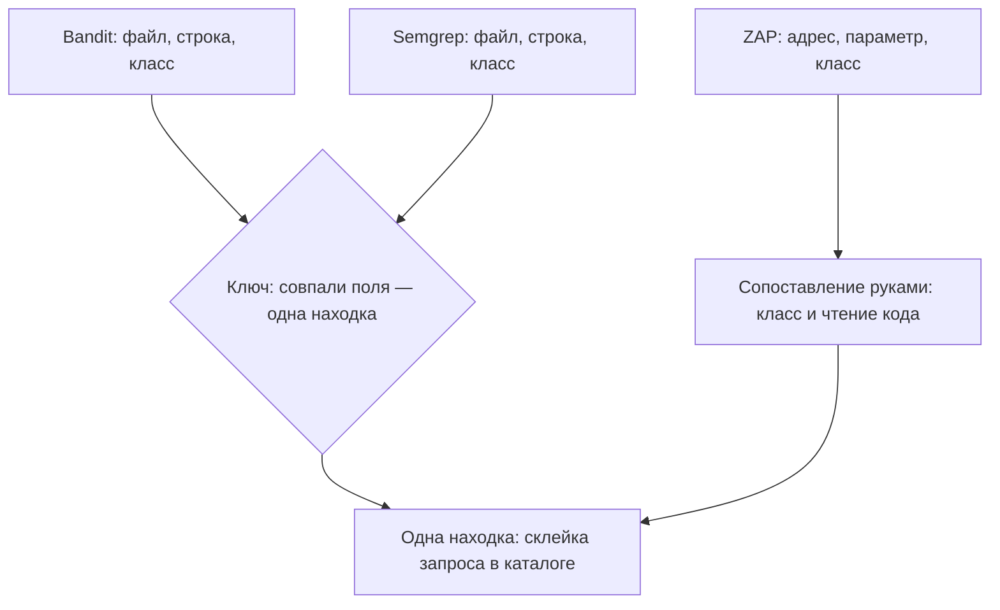

# Дедупликация находок между инструментами

Из прошлых тем у вас уже есть три инструмента: Bandit и Semgrep читают
исходный код, а ZAP проверяет запущенное приложение снаружи. Прогон всех
трёх по магазину «Лавка», стенду из темы `zap-scanning`, даёт четыре
отчёта, и склейка запроса в каталоге товаров встречается в них пять раз:

```text
Bandit 1.9.4        B608                    app.py:210      CWE-89
Semgrep p/default   formatted-sql-query     app.py:211      CWE-89
Semgrep p/default   sqlalchemy-execute-…    app.py:211      CWE-89
Semgrep свой набор  lavka-sql-string-format app.py:211      нет
ZAP 2.17.0          плагин 40018            /catalog?cat=   CWE-89
```

Пять строк — один дефект, и сама склейка с починкой разобрана в
`sqli-basics`. Номер строки у двух статических инструментов различается
на единицу: Bandit показывает место, где запрос собирается, а Semgrep —
где он исполняется. Сканер снаружи не знает ни файла, ни строки: у него
адрес и параметр. Сколько здесь уязвимостей, пять или одна? Ответить
суммой строк нельзя, а как ответить верно — предмет этой темы.

## Что такое дедупликация

Как только инструментов становится два, один и тот же дефект начинает
приходить дважды. Отчёт, где он посчитан пять раз, нельзя ни отдать
разработчику, ни свести в число для доклада наверх. Сведение повторных
записей об одном дефекте в одну находку называется дедупликацией.

Бытовой пример — телефонная книга, где один человек записан трижды:
«Мама», «Мама мобильный» и «Иванова Анна Петровна». Пока записи не
сведены, на вопрос «сколько людей в книге» ответа нет: три записи могут
быть тремя людьми или одним. Соответствие прямое: запись в книге — это
строка отчёта, человек — дефект, сведение — дедупликация. Ломается
аналогия на полях: у всех записей книги поля одинаковые, имя и номер
телефона, а у отчётов разных инструментов общих полей почти нет. Поэтому
сведение отчётов — отдельная работа, а не кнопка «объединить».

Сводят записи по ключу совпадения — набору полей, при совпадении которых
две записи считаются одной находкой. В телефонной книге такой ключ — пара
«имя и номер»: совпали оба, значит записи об одном человеке. В отчётах
кандидатов на поля ключа больше: файл, строка, класс дефекта, адрес,
параметр, имя правила. Какие из них годятся в ключ, а какие только
притворяются им, — предмет разбора ниже.

**Зачем это в работе AppSec-инженера.** Вопрос «сколько у нас
уязвимостей» имеет смысл только после дедупликации. Инженер, который
отвечает на него суммой строк, отвечает неверно. Размер ошибки неизвестен
заранее: он зависит от того, сколько страниц в приложении и сколько
правил сработало на одном месте.

## Как это работает

**Откуда это взялось.** Пока инструмент был один, вопроса не было:
находки жили в его отчёте, и повторный прогон заменял прежний целиком.
Наборов стало несколько, отчёты стали накапливать, и выяснилось, что
«находка» — не то же самое, что «строка отчёта». Отсюда выросли системы
агрегации: хранилища, куда импортируют отчёты разных инструментов и где
находка живёт как объект со своей историей. Открытый представитель таких
систем — DefectDojo; как устроен класс таких систем целиком, разбирает
следующая тема маршрута, `asoc`.

Открытая версия DefectDojo поддерживает четыре алгоритма дедупликации
[^1]. Один сравнивает идентификатор, выданный инструментом. Другой
считает свёртку — хэш, короткий отпечаток значений полей: совпали поля
у двух записей, значит совпал и отпечаток. Третий работает «по одному
или другому», четвёртый — исторический, и его поведение разобрано ниже.
Важно не устройство свёртки, а то, из каких полей её считают: наборы
полей у инструментов разные.

Инструмент статического анализа читает код и знает файл, строку, колонку
и имя правила. У Bandit к этому прибавляются номер теста и класс дефекта:
`B608` объявлен как `CWE-89` прямо в отчёте [^2]. Сканер снаружи кода не
видит: он работает с запущенным приложением через его адреса, поэтому его
поля — адрес, параметр, метод и номер правила. Указатель правил ZAP по
номерам — единственное место, где номер `40018` связан с именем и видом
проверки [^3].

Пересечение двух наборов пусто: ни одно поле не встречается у обоих
классов инструментов. Общим остаётся класс дефекта, и то не всегда. Даже
он записан в отчётах четырьмя разными способами:

```text
Bandit          "issue_cwe": {"id": 89, "link": "…/89.html"}
Semgrep набор   ["CWE-89: Improper Neutralization of Special Elements…"]
Semgrep своё    "metadata": {}
ZAP             "cweid": "89"
```

Bandit кладёт число в отдельное поле, чужой набор Semgrep — строку с
названием класса, ZAP — строку с числом. А своё правило Semgrep не
сообщает класс вовсе: класс живёт в метаданных, полях-описаниях, которые
автор правила заполняет руками, и у правила без метаданных приводить
нечего. Ключ по классу работает только после приведения всех четырёх форм
к одному виду.

Итог механики — на схеме: статические отчёты сводит ключ, а строка
динамического сканера присоединяется к находке ручным сопоставлением.



**Описание схемы.** Схема читается сверху вниз и показывает два пути
сведения. Отчёты Bandit и Semgrep несут однородные поля и сводятся
ключом: совпали файл, строка и класс — записи склеиваются в одну находку.
У ZAP этих полей нет, поэтому его строка присоединяется к находке вручную:
по классу дефекта и по чтению кода.

## Что умеет и чего не умеет

**Что умеет ключ внутри одного инструмента.** Здесь поля однородны, и
совпадение работает. На том же стенде набор `p/default` дал четыре
находки на двух местах. Два правила про склейку запроса сработали на
строке 211, и оба же — на строке 318. Ключ «файл, строка, класс» сводит
четыре строки в две, и это верный ответ: мест действительно два.

**Чего он не умеет между инструментами.** Свести `app.py:210` и
`/catalog?cat=` нечем: у первой записи нет адреса, у второй нет файла.
Исторический алгоритм DefectDojo признаёт это прямо: он сравнивает записи
по эндпоинту, то есть по адресу, под которым находка видна снаружи.
Новая статическая запись обязана содержать все эндпоинты исходной, а у
динамических записей эндпоинты совпадают строго. При пустых пути, строке
и эндпоинтах дедупликация, как правило, не происходит вовсе [^1]. А
сопоставление находок разных инструментов в открытой версии выключено:
оно есть в платной.

**Чего не умеет никакой ключ.** Сказать, что два места — один дефект по
существу. Склейка запроса в каталоге и в API — два разных места одной и
той же ошибки разработчика. Починка одна на оба места, а находок для
любого ключа две: он сравнивает поля, а не смысл.

## Как запустить

Сведение ставится не сложением отчётов, а таблицей: строка на дефект,
колонка на инструмент. Так остаются видны и совпадения, и уникальные
находки каждого метода, а при сложении пропадает и то и другое. Базовых
прогонов три, все на одном и том же коде:

```bash
semgrep --config=p/default --metrics=off --json -o sg.json app.py
bandit -f json -o bandit.json app.py
zap.sh -cmd -dir ./zaphome -autorun "$PWD/plan-active.yaml"
```

Первые две команды разбирают файл `app.py` и пишут отчёт в JSON. Третья
выполняет активный план ZAP; как такой план собирается, разобрано в
`zap-scanning`. Четвёртый отчёт из вступления даёт та же первая команда
со своим набором правил: отличается только значение `--config`. А строки
ZAP про API пришли из отдельного плана — прогона по описанию API,
разобранного в `dast-limits`.

Для стенда из вступления сведённая таблица выглядит так:

| дефект | Bandit | Semgrep | ZAP |
|---|---|---|---|
| склейка запроса в каталоге | `B608`, `app.py:210` | три правила, `app.py:211` | плагин `40018`, `/catalog?cat=` |
| склейка запроса в API | `B608`, `app.py:317` | три правила, `app.py:318` | прогон по описанию API |

«Три правила» в колонке Semgrep — два из набора `p/default` и одно из
своего набора. Ячейка ZAP во второй строке читается точно: обход по
ссылкам до API не дошёл, и находку дал отдельный прогон по описанию.

Дальше по каждой строке отчётов отвечают на два вопроса: какой дефект она
называет и по какому полю её можно узнать в другом отчёте. Второй вопрос
и есть построение ключа. Ответ «ни по какому» законный и самый частый:
строка сканера узнаётся в статических отчётах не полем, а чтением кода.

## Как читать вывод

**Ключ решает больше, чем кажется.** Проверка на том же наборе: в стенд
добавлена новая ручка из четырёх строк, и все прежние находки уехали вниз
по файлу. Полный прогон даёт 9 находок, новая среди них одна. Отделить
новое от старого пробуют четырьмя способами:

```text
ключ (правило, файл, строка)     новых 9   строки уехали, всё выглядит новым
ключ (правило, файл)             новых 0   новый дефект той же пары не виден
ключ по полю fingerprint         новых 0   см. ниже
прогон против базового коммита   новых 1   верно
```

Узкий ключ выдаёт дубли за новое, широкий прячет новое среди старого:
один набор данных, три неверных ответа и один верный. Верный — последний:
прогон против базового коммита сравнивает не номера строк, а множества
находок до и после изменения, то есть снимок основной ветки против
рабочей. Сам приём базовой линии разобран в `triage-false-positives`.

Поэтому ключ для своих отчётов проверяется до выбора двумя вопросами. Что
он сделает с находками после вставки выше по файлу? И что — с двумя
дефектами одного класса в одном файле?

**Поле, которое выглядит ключом и ключом не работает.** В отчёте Semgrep
есть поле `fingerprint`, «отпечаток»: строка-идентификатор, которую
инструмент присваивает находке, чтобы узнавать её между прогонами. Оно
просится в ключ первым. Что случится с отчётом, если взять его в ключ?
В бесплатном прогоне значение поля — одна и та же строка для всех
находок:

```text
"fingerprint": "requires login"
```

Проверено на четырёх разных отчётах, включая прогон промышленным набором
правил. Ключ, построенный на этом поле, сводит все находки в одну.

**Слишком широкий ключ склеивает разные дефекты.** На стенде склейка
запроса есть в двух местах: в каталоге и в API. По нумерации Bandit это
строки 210 и 317, по нумерации Semgrep — 211 и 318; класс у обеих находок
`CWE-89`, файл один. Ключ «файл, класс» объединит их в одну. После
склейки в трекере живёт одна находка-задача. Разработчик починит каталог
и закроет её, а вторая склейка останется в коде, снятая с радаров вместе
с задачей. Именно поэтому строка входит в ключ, несмотря на всю её
неустойчивость.

**Сколько строк на самом деле.** Отчёт ZAP того же стенда под входом —
40 инстансов. Инстанс — одно срабатывание одного правила на одном адресе:
дефект один, а страниц с ним десять — инстансов десять. На одиннадцать
настоящих дефектов, размноженных по страницам, приходятся 30 инстансов;
ещё 4 ложные, 4 информационные и 2 — тот же дефект по неверному адресу.
Сумма строк двух отчётов не значит ничего: она складывает сорок и семь и
получает 47 там, где дефектов тринадцать.

## Границы метода

**Граница первая: строка неустойчива, а без неё ключ слишком широк.**
Любая вставка выше по файлу двигает все строки ниже, и ключ со строкой в
составе считает старые находки новыми. Инструменты обходят это по-разному.
Semgrep сравнивает прогон с прогоном на базовом коммите вместо сравнения
номеров. Базовый отчёт Bandit переживает сдвиг, потому что сверяет не
номер строки. Универсального решения нет.

**Граница вторая: сопоставление между инструментами делается руками.** В
открытой версии системы агрегации его нет, и сводить приходится по классу
дефекта и по здравому смыслу. Это работа человека, и она не
масштабируется: каждый новый инструмент добавляет свой ручной разбор.

**Граница третья: дубль внутри отчёта — не всегда ошибка.** Один дефект,
размноженный по пяти страницам, — это пять мест, где он проявляется, и
разработчику полезно знать их все. Схлопывать такие строки в одну можно
только после того, как показано, что источник у них один.

**Цена.** Свести два отчёта на маленьком стенде — час. На живом проекте
это разовая работа по настройке ключа для каждого инструмента и
постоянная — по разбору того, что ключ не свёл.

## Частая ошибка

Интуиция здесь арифметическая: чтобы получить полную картину, отчёты надо
сложить. Прикидка до ответа: сорок строк одного отчёта плюс семь строк
другого — сколько это дефектов?

**Сложение считает не дефекты, а строки.** Строки у инструментов разной
природы: у одного это место в файле, у другого — адрес с параметром, у
третьего — правило, сработавшее на пяти страницах. На стенде сумма двух
отчётов даёт 47 при тринадцати подставленных дефектах, из которых найдено
десять. Ошибка не в четыре раза, а в неизвестное число раз: коэффициент
зависит от того, сколько страниц в приложении.

Контрпример к обратному выводу — «тогда брать максимум из отчётов».
Списки не содержат друг друга ни в одну сторону. У Semgrep есть два
дефекта в API, до которых обход по ссылкам не дошёл. ZAP поднял их
отдельным прогоном по описанию API, и в сорокастрочном отчёте их нет.
У ZAP — шесть классов, которых нет ни в одном правиле статического
анализа. Максимум — это один из двух списков, и он теряет уникальное
другого: какой ни возьми, потеря неизбежна. Работает только таблица по
дефектам, где каждая строка отчёта отнесена к дефекту руками.

## Чеклист для ревью

1. Проверьте, что число уязвимостей в отчёте получено после сведения, а
   не сложением строк.
2. Проверьте, что для каждого инструмента названо поле, служащее его
   собственным идентификатором находки.
3. Проверьте, что ключ содержит место, а не только класс дефекта.
4. Проверьте, что поле, взятое в ключ, проверено на разных находках, а
   не на одной.
5. Проверьте, что строки, сведённые в одну, действительно про одно место
   в коде.
6. Проверьте, что сопоставление находок разных инструментов помечено как
   ручное, если автоматического нет.

## Попробуй сам

Прогнать по своему коду два инструмента статического анализа и свести их
отчёты в таблицу «дефект — инструмент». Для каждой строки, попавшей в
оба отчёта, выписать поля, по которым её удалось узнать.

Одна подсказка: сравнивайте номера строк не глазами, а печатью пары
«файл, строка» из обоих отчётов — расхождение на единицу иначе не
заметить.

**Критерий выполнения** наблюдаемый. У вас есть таблица, где число строк
меньше суммы находок двух отчётов, и названо поле, по которому произошло
каждое сведение.

## Проверь себя

1. Три строки из трёх отчётов про одну склейку запроса в API:

   ```text
   Bandit 1.9.4        B608              app.py:317   CWE-89
   Semgrep свой набор  lavka-sql-admin   app.py:318   нет
   ZAP 2.17.0          плагин 40018      /admin?tbl=  CWE-89
   ```

   По каким полям они сводятся в одну находку, а по каким — нет?
2. Почему два инструмента статического анализа показывают один дефект на
   соседних строках?
3. Два отчёта по одному стенду: сорок строк и семь строк. Как получить
   полную картину?

   A. Сложить: сорок плюс семь — сорок семь находок.

   B. Свести в таблицу по дефектам: каждую строку отчёта отнести к дефекту.

   C. Взять максимум из двух отчётов.
4. Не запуская, предскажите оба числа, которые напечатает эта проверка
   двух ключей на сдвиге строк.

   ```python
   before = [("B608", "app.py", 210), ("B608", "app.py", 317)]
   after = [("B608", "app.py", 214), ("B608", "app.py", 321)]  # вставка выше

   narrow = set(after) - set(before)  # ключ: правило, файл, строка
   wide = {(r, f) for r, f, _ in after} - {(r, f) for r, f, _ in before}
   print("узкий ключ, новых:", len(narrow))
   print("широкий ключ, новых:", len(wide))
   ```

5. Возврат к теме `dast-limits`: почему списки статического и
   динамического прогона не содержат друг друга?
6. Возврат к теме `sqli-basics`: пять строк четырёх отчётов про одну
   склейку запроса. Чем чинится сам дефект — и почему починка закроет
   все пять строк разом?

<details markdown="1">
<summary>Ответ 1</summary>

1. По классу сводятся две из трёх: `CWE-89` есть у Bandit и у ZAP, а у
   своего правила метаданных нет. По месту — две статические, и то с
   поправкой: номера строк разъехались на единицу. У сканера ни файла, ни
   строки — только адрес и параметр. Общего ключа нет: сводятся они по
   классу плюс чтение кода, и это ручная работа.

</details>

<details markdown="1">
<summary>Ответ 2</summary>

2. Они привязываются к разным точкам одного пути: один — к месту, где
   строка запроса собирается, другой — к месту, где она исполняется.
   Расхождение на единицу в отчётах — норма, а не признак разных дефектов.

</details>

<details markdown="1">
<summary>Ответ 3: разбор вариантов</summary>

3. Верный ответ — B.

   A. Сумма считает строки, а не дефекты: на стенде она даёт 47 при
      тринадцати подставленных. Коэффициент зависит от того, сколько
      страниц в приложении, — то есть ошибка неизвестного размера, а не
      «в четыре раза».

   B. Строка на дефект, колонка на инструмент: так видны и совпадения, и
      уникальные находки каждого метода. Это единственная форма, по
      которой отвечают «сколько у нас уязвимостей».

   C. Списки не содержат друг друга. У Semgrep два дефекта в API,
      которых нет в сорокастрочном отчёте; у ZAP — шесть классов,
      которых нет ни в одном правиле. Максимум — один из двух списков, и
      он теряет уникальное другого.

</details>

<details markdown="1">
<summary>Ответ 4</summary>

4. `узкий ключ, новых: 2` и `широкий ключ, новых: 0`. Со строкой в ключе
   обе старые находки выглядят новыми после любой вставки выше. Без строки
   ключ не различает два дефекта одного класса в одном файле — и новый
   дефект той же пары прячет. Ответ получен прогоном: `python3 keys.py`.

</details>

<details markdown="1">
<summary>Ответ 5</summary>

5. Каждый метод видит своё: статический — то, что записано в коде,
   динамический — то, что проявляется в ответе. Пересечение есть,
   включения нет — поэтому их строки и не совпадают.

</details>

<details markdown="1">
<summary>Ответ 6</summary>

6. Параметрами: текст запроса отделяется от данных, и склейка исчезает
   как форма. Дефект один, и починка одна — все пять строк отчётов про
   него; закрывая место в коде, вы закрываете их все разом.

</details>

## Источники

1. DefectDojo, «About Deduplication»; реестр `defectdojo-dedup`. Разделы:
   четыре алгоритма открытой версии, поля свёртки и всегда включаемое поле
   службы, поведение исторического алгоритма для статических и динамических
   находок, сопоставление между инструментами как возможность платной версии.
   <https://docs.defectdojo.com/triage_findings/finding_deduplication/about_deduplication/>
2. PyCQA, «Bandit — Test Plugins»; реестр `bandit-test-plugins`. Разделы:
   номера тестов и класс дефекта, объявленный для каждого теста.
   <https://bandit.readthedocs.io/en/latest/plugins/index.html>
3. ZAP Dev Team, «Alert Details»; реестр `zap-alerts-index`. Разделы:
   указатель правил по номерам, вид проверки и класс дефекта для номера.
   <https://www.zaproxy.org/docs/alerts/>

Каркас этапа: `cwe-taxonomy`. Наследуется всеми темами и отдельной строкой
не повторяется.

**Скоропортящийся слой.** Версии инструментов, имена полей в отчётах,
состав алгоритмов открытой версии системы агрегации и граница между
открытой и платной версией.

**Маркеры уверенности.** Все отчёты сняты **лично** 2026-08-25 на одном
стенде из 412 строк: Bandit версии 1.9.4 — `B608` на строках 210 и 317;
Semgrep версии 1.174.0 набором `p/default` — четыре находки на строках 211
и 318, своим набором — две; ZAP 2.17.0 — плагин 40018 на `/catalog` и 40
инстансов в прогоне под входом. Значение `requires login` в поле
`fingerprint` проверено на четырёх отчётах разных прогонов. Листинг из
вопроса 4 прогнан повторно 2026-10-03, Python 3.14.7: вывод совпал
дословно. Алгоритмы дедупликации — **по документации** DefectDojo,
открытой лично 2026-08-25; сама система **не разворачивалась**, и
поведение ключей на ней не воспроизводилось.

[^1]: DefectDojo, «About Deduplication», реестр `defectdojo-dedup`.
[^2]: PyCQA, «Bandit — Test Plugins», реестр `bandit-test-plugins`.
[^3]: ZAP, «Alert Details», реестр `zap-alerts-index`.
