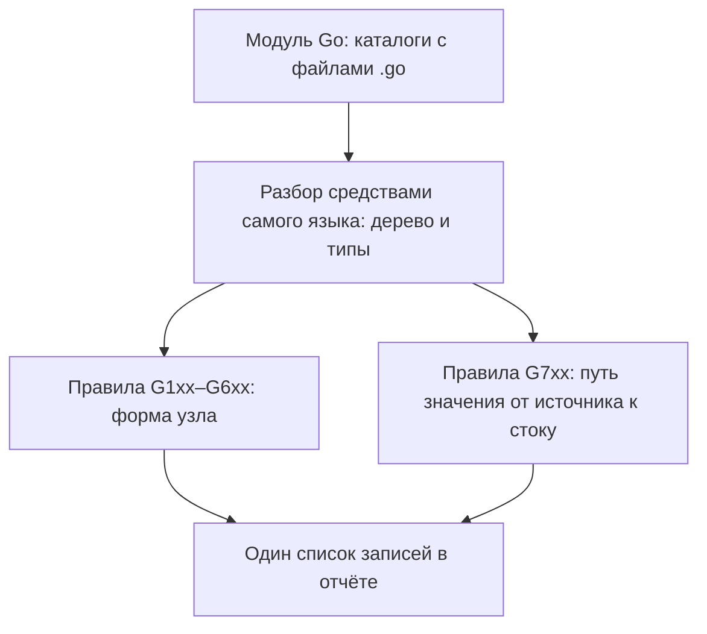

# gosec: статический анализ Go

Отчёт о проверке маленького сервиса на Go начинается с загадки. Файлов в
сервисе шесть, в них специально подставлены четыре дефекта, а записей в
отчёте восемь. Одна выглядит так:

```text
[svc/db.go:13] - G701 (CWE-89): SQL injection via taint analysis
   (Confidence: HIGH, Severity: HIGH)
```

Разница между восемью и четырьмя — не шум и не сбой, а устройство
инструмента. Одно и то же место здесь находят два разных правила: одно по
форме выражения, другое по пути значения. Инструмент называется gosec —
готовый набор проверок для Go из класса SAST: он читает исходный текст, не
запуская программу, а устройство класса разбирает тема `sast-principles`. И
те и другие печатают находки в один список, поэтому разбор начинается не с
чтения, а со сведения дублей — двойников об одном месте.

Как из восьми записей о шести местах собрать список, в котором каждый дефект
назван ровно один раз?

## Что такое gosec

У gosec набор проверок готовый, и каждая проверка называется правилом.
Правило знает одну опасную запись Go, например сборку SQL-запроса склейкой
строк или вызов слабого примитива шифрования. У правила есть номер, и номер —
не счётчик по порядку, а адрес: по первому разряду видно, каким способом
получена находка. Этим способам посвящён следующий раздел.

Соседний инструмент вы уже видели: тема `bandit` разбирает такой же набор
проверок для Python. Разница между ними одна, но важная. Bandit смотрит
только на форму записи, а у gosec есть и вторая семья правил, которая ведёт
значение по коду. Из этого различия вырастает всё дальнейшее: и двойные
записи в отчёте, и разная важность у двух записей об одном месте.

Каждая находка несёт и номер класса дефекта из каталога CWE — общего словаря
слабостей, где CWE-89, например, обозначает SQL-инъекцию. Чем опасен сам
дефект, в этой теме не разбирается: инъекция в запрос — тема `sqli-basics`,
запуск команды — `os-command-injection`, путь к файлу — `path-traversal`,
слабый шифр — `weak-algorithms`.

**Зачем это в работе AppSec-инженера.** Go-сервисы редко проверяются чем-то,
кроме gosec, и отчёт его читают разработчики, а не инженер. Объяснять поэтому
придётся не находки, а устройство. Почему одна строка кода дала две записи,
почему у одной из них важность выше и какая из двух говорит о пути данных.

## Как это работает

**Откуда это взялось.** Первые проверки для Go были списком запрещённых
вызовов: вызов из списка встретился — находка напечатана. На таком списке
инъекции не ловились, потому что вызов `db.Query` законен сам по себе, а
вопрос в том, что ему передали. Ответом стала вторая семья правил, которая
ведёт значение от места входа в программу до самого вызова. Устройство берём
в минимуме, нужном, чтобы прочитать отчёт: тема эта — рецепт, а не разбор
анализатора.

Модуль в Go — дерево каталогов с файлом `go.mod` в корне, а пакет — один
каталог с файлами `.go`. Инструмент разбирает пакет средствами самого языка —
тем же чтением, каким компилятор Go читает исходник. Здесь работает разница между
проверкой орфографии и проверкой грамматики: для первой хватит словаря слов,
для второй нужно знание самого языка. Поэтому прогону нужен рабочий тулчейн —
компилятор Go и его штатные программы. Аналогия ломается на последствии:
проверка грамматики прочитает любой текст, а пакет, который не собирается,
gosec не разберёт вовсе.

Разобранный пакет проходит по списку правил. Правила разрядов `G1xx`–`G6xx`
смотрят на форму узла: вызов функции, импорт пакета, строка привязки адреса.
Правила разряда `G7xx` названы в документации правилами на анализе помеченных
данных [^1].

«Помеченные данные» — это та же метка, которая ведёт значение от источника к
стоку в `sast-principles`. Правило помечает значение у входа в программу и
проверяет, доходит ли оно до опасного вызова. Находки этой семьи подписаны
«via taint analysis», как запись из начала темы.



**Описание схемы.** Схема читается сверху вниз и показывает путь пакета через
прогон. Модуль разбирается средствами самого языка, и дальше по нему проходят
две семьи правил: одна смотрит на форму узла, другая ведёт значение от
источника к стоку. Находки обеих семей попадают в один список и не склеиваются
между собой — отсюда дубли, о которых говорит вся тема.

Устройство обоих способов поиска разобрано в `sast-principles`. Сами дефекты
разобраны в темах `sqli-basics`, `os-command-injection`, `path-traversal` и
`weak-algorithms`. Здесь предмет — инструмент: как его прогнать, как
прочитать напечатанное и где он молчит по устройству.

## Что умеет и чего не умеет

**Что умеет.** Находить известные опасные записи Go: сборку запроса из строк,
запуск внешней команды с переменной внутри, открытие файла по имени из
переменной, вызов слабого примитива шифрования. Ещё он видит привязку сетевой
службы ко всем интерфейсам сразу: такая служба принимает соединения от любой
машины в сети, а не только со своей. Правила `G7xx` при этом отвечают не на
вопрос о форме записи, а на вопрос о пути значения. На стенде темы эта
разница дала двойные записи там, где сработали обе семьи.

**Чего не умеет.** Первое — работать без тулчейна: разбор идёт средствами
языка, и отсутствие команды `go` в пути останавливает прогон. Второе —
сводить дубли самостоятельно. Одно и то же место печатается и правилом по
форме, и правилом на метке, и склеить записи придётся тому, кто читает отчёт.
Третье — знать про проверки, написанные в этом проекте: имя таблицы,
сверенное с замкнутым списком разрешённых, для инструмента неотличимо от
любой другой строки. Четвёртое — любой язык, кроме Go: соседний сервис на
Python в прогон не попадёт, его проверяет `bandit`.

## Как запустить

Прогон — одна команда, и запускается она из корня модуля. Запись `./...`
читается как «этот каталог и всё, что ниже»: прогон идёт по всем пакетам
модуля.

```bash
# gosec 2.28.0, Go 1.27.0. Прогон по всем пакетам модуля.
gosec ./...
```

Версии стоят рядом с командой не для порядка: состав правил меняется от
версии к версии, и отчёт без версии через год не воспроизвести. Ставится
инструмент из репозитория проекта, раздел установки [^1]; дальше считаем,
что команда `gosec` уже доступна.

Фильтр по важности и вычитание отдельных правил задаются ключами [^1].
Важность здесь — оценка последствий класса дефекта, заданная автором правила
заранее, а вычитание убирает правило из прогона целиком, как будто его нет.

```bash
# Только находки высокой важности.
gosec -severity high ./...

# Вычесть названные правила целиком.
gosec -exclude=G401,G501,G204,G304 ./...
```

Ещё два ключа стоит поставить в общий конвейер сразу. Конвейер — это
автоматический прогон проверок на каждое изменение кода, и ключи
`-nosec-require-rules` и `-nosec-require-justification` отвечают в нём за
дисциплину подавлений [^1]. Первый отвергает подавление без имени правила,
второй — без причины; само подавление разбирает раздел «Как читать вывод».

## Как читать вывод

Находка занимает четыре строки, и первая из них несёт почти всё. Разберём ту
самую запись из начала темы, теперь с двумя строками кода, которые отчёт
печатает следом:

```text
[svc/db.go:13] - G701 (CWE-89): SQL injection via taint analysis
   (Confidence: HIGH, Severity: HIGH)
    12: q := fmt.Sprintf("SELECT id FROM orders WHERE id = %s", orderID)
  > 13: return db.Query(q)
```

1. `svc/db.go:13` — файл и строка находки.
2. `G701` — имя правила. Разряд `G7xx` сообщает способ находки: значение
   ведётся от источника к стоку, и слова «via taint analysis» говорят о том
   же.
3. `CWE-89` — класс дефекта по каталогу CWE; здесь это SQL-инъекция из темы
   `sqli-basics`.
4. `Confidence` и `Severity` — уверенность и важность. Смысл тот же, что в
   `bandit`: обе оценки заданы автором правила заранее и говорят о правиле, а
   не об этом коде.
5. Стрелка `>` стоит на стоке — вызове, где значение уходит в запрос. Строкой
   выше напечатан источник: на строке 12 запрос собран склейкой из чужого
   значения.

Читается запись так: на строке 12 значение `orderID` подставлено в текст
запроса, а на строке 13 этот текст ушёл в базу. Как из такой склейки
получается инъекция, разбирает `sqli-basics`; инструменту хватило того, что
путь от сборки до вызова прослежен.

### Дубли и шум на стенде

Стенд темы — шесть файлов, 113 строк кода, четыре подставленных дефекта и
одно чистое место похожей формы. Полный прогон даёт восемь записей на шести
местах:

```text
прогон            записей   мест   настоящих мест   шумных записей
без фильтров            8      6                4                2
-severity high          4      4                4                0
```

Восемь против шести — это дубли. Правила `G702` и `G204` печатаются на одной
строке запуска команды, `G703` и `G304` — на одной строке открытия файла.
Первое в каждой паре нашло путь значения, второе — форму вызова. Четвёртый
дефект стенда — вторая инъекция в том же `db.go`: запрос там собран прямой
склейкой без `fmt.Sprintf`, и о нём одна запись тем же `G701`. Настоящих
записей шесть: две про инъекции и две пары-дубля.

Столбец шумных записей считает две записи про свёртку ключа кэша на слабом
примитиве: `G401` смотрит на вызов, а `G501` — на импорт. Места у них разные,
вызов и импорт стоят на разных строках, поэтому дублем эта пара не считается:
дубль — две записи об одной строке. Дефекта там нет, потому что свёртка ключа
кэша ничего не защищает, но записей о нём две.

Вся таблица прогонов читается через одно различие: записи считает инструмент,
места — тот, кто разбирает отчёт. Проверка на перенос: в новом прогоне
записей стало девять, а мест осталось шесть. Что появилось — новый дефект или
новое правило на старом месте? Правильный ответ — правило: настоящий дефект
добавил бы и седьмое место.

Чистое место стенда — имя таблицы, сверенное с замкнутым множеством
разрешённых перед подстановкой в запрос. Правило `G701` на нём промолчало:
метки на имени таблицы нет. На том же по смыслу коде на Python и `bandit`, и
Semgrep дали находку — сравнение разобрано в `sast-false-positives`.

### Подавление одной находки

Разобранную находку, признанную безопасной, гасят точечно — комментарием с
именем правила и причиной [^1]:

```go
// #nosec G401 -- свёртка ключа кэша, не защита
sum := md5.Sum([]byte(strings.Join(parts, "|")))
```

Комментарий читается так: «эту проверку на этой строке я разобрал, и вот
почему она безопасна». После него прогон печатает `Nosec: 1` и семь записей
вместо восьми. Восьмая при этом осталась: `G501` привязан к строке импорта, а
подавление стоит на строке вызова. Это общее свойство правил разряда `G5xx` и
повод читать разряд имени до того, как ставить комментарий.

О том, что вообще просмотрено, отвечает сводка в конце отчёта. Строка
«Files» считает файлы, «Lines» — строки, «Issues» — записи, «Nosec» —
подавления. Расхождение первой из них с числом файлов модуля значит, что
часть кода в прогон не попала, и это первая из границ метода.

## Границы метода

**Граница первая: только Go и только собираемый Go.** Пакет, который не
собирается, в прогон не попадёт, потому что разбор идёт средствами языка, как
при сборке. Видно это по строке «Files» в сводке: число файлов там меньше
числа файлов в модуле.

**Граница вторая: дубли считаются находками.** Число в строке «Issues» не
равно числу мест. На стенде восемь записей стоят на шести местах, и в
конвейере, где порог задан числом находок, дубли двигают вердикт, не добавляя
ни одного дефекта.

**Цена прогона.** Шесть файлов стенда проверяются за секунды вместе с
разбором пакетов средствами языка. Заметной цена становится на больших
модулях, где ко времени анализа добавляется время загрузки зависимостей.

## Частая ошибка

Первое желание при виде дублей: раз лишние записи — дубли, достаточно вычесть
шумные правила ключом `-exclude`, и отчёт станет чистым. Какое правило из
пары `G702`/`G204` вы бы вычли первым — и что тогда останется без проверки?

**Вычитание правила убирает не дубль, а проверку.** Пары `G702`/`G204` и
`G703`/`G304` не тождественны: правило на метке молчит там, где путь значения
не прослежен, а правило по форме срабатывает на любой переменной. Вычтя
`G204`, получаем тишину на запуске команды в тех местах, где путь gosec не
проследил.

Контрпример к соседнему лекарству — фильтру по важности. На стенде
`-severity high` даёт те же четыре настоящих места, что и полный прогон, и
без единой лишней записи. Работает это не потому, что фильтр умный, а потому,
что здесь все четыре дефекта нашлись правилами на метке, а их важность
высокая. На коде, где путь значения не прослеживается, тот же фильтр даст
ноль находок при трёх дефектах.

## Чеклист для ревью

1. Проверьте, что в отчёте сведены дубли: число мест посчитано отдельно от
   числа записей.
2. Проверьте, что рядом с прогоном по фильтру важности лежит прогон без
   фильтра: фильтр прячет и настоящие места, а не только шум.
3. Проверьте, что каждое подавление названо именем правила и снабжено
   причиной.
4. Проверьте, что подавление стоит на той строке, к которой привязано
   правило: вызов для `G4xx`, импорт для `G5xx`.
5. Проверьте, что версия gosec и версия Go записаны рядом с отчётом: состав
   правил зависит от обеих.
6. Проверьте, что сводка прочитана целиком: строки «Files», «Lines» и
   «Nosec» отвечают на вопрос, что вообще просмотрено.

## Попробуй сам

Прогоните gosec на своём модуле Go дважды: без ключей и с `-severity high`.
Сведите оба отчёта к списку мест, а не записей, и объясните каждое расхождение
между ними.

Одна подсказка: расхождение почти всегда объясняется разрядом имени правила,
поэтому сравнивайте не сообщения, а первые два знака идентификатора.

**Критерий выполнения** наблюдаемый: получен список мест с указанием, каким
правилом каждое найдено, и для каждого места, выпавшего при фильтре, назван
разряд правила, которое его находило.

## Проверь себя

1. Две записи отчёта про одну и ту же свёртку md5:

   ```text
   [svc/cache.go:4] - G501 (CWE-327): Blocklisted import crypto/md5
   [svc/cache.go:15] - G401 (CWE-328): Use of weak cryptographic primitive
   ```

   Почему они стоят на разных строках и где ставить подавление для каждой?

2. Почему число записей в строке «Issues» больше числа мест и чем это ломает
   порог, заданный в конвейере числом находок?

3. В отчёте дубли: одно и то же место печатается дважды, правилом на метке и
   правилом по форме. Как почистить отчёт?

   А. Вычесть из пары правило по форме ключом `-exclude`: дубли исчезнут.

   Б. Свести записи к местам и разбирать места; оба правила оставить.

   В. Поставить `-severity high`: лишние записи уйдут сами.

4. Предскажите, сколько записей напечатает `gosec ./...` по этому модулю и
   сколько мест за ними стоит.

   ```go
   package main

   import (
     "crypto/md5"
     "database/sql"
     "fmt"
   )

   func find(db *sql.DB, id string) {
     q := fmt.Sprintf("SELECT id FROM orders WHERE id = %s", id)
     db.Query(q)
   }

   func key(raw string) [16]byte {
     return md5.Sum([]byte(raw))
   }
   ```

5. Возврат к теме `path-traversal`: находка поставлена на открытие файла по
   имени из переменной. Почему склейка имени с корнем каталога не защищает и
   что защищает?

6. Возврат к теме `sast-principles`: почему инструменту нужен рабочий
   тулчейн, если он не запускает программу?

<details markdown="1">
<summary>Ответ 1</summary>

1. `G501` привязан к узлу импорта и стоит на строке `import`, а `G401` — к
   узлу вызова и стоит на строке вызова. Подавление действует на своей строке,
   поэтому первое гасится комментарием `#nosec G501` на импорте, второе —
   `#nosec G401` на вызове. Разряд имени читается до того, как ставится
   комментарий: `G4xx` — вызов, `G5xx` — импорт.

</details>

<details markdown="1">
<summary>Ответ 2</summary>

2. Потому что одно место находят два правила: одно по форме, другое по пути.
   На стенде темы восемь записей стоят на шести местах. Порог в конвейере,
   заданный числом записей, срабатывает раньше, чем ожидает тот, кто считал
   места: дубли двигают вердикт, не добавляя ни одного дефекта.

</details>

<details markdown="1">
<summary>Ответ 3: разбор вариантов</summary>

3. Верный ответ — Б.

   А. Правила пары не тождественны: правило на метке молчит там, где путь не
      прослежен, а правило по форме срабатывает на любой переменной. Вычтя
      `G204`, получаем тишину на запуске команды в местах, где путь значения
      не прослежен.

   Б. Записи сводятся к местам, и разбираются места. Дубль — это два взгляда
      на одно место, а не лишняя проверка.

   В. На стенде темы `-severity high` дал те же четыре настоящих места без
      лишних записей, но лишь потому, что все четыре нашлись правилами на
      метке. На коде, где путь не прослеживается, тот же фильтр даст ноль
      находок при трёх дефектах.

</details>

<details markdown="1">
<summary>Ответ 4</summary>

4. Четыре записи на четырёх местах, дублей нет. `G201` стоит на сборке
   запроса, строка 10. `G104` — на вызове без обработки ошибки, строка 11.
   Пара про свёртку: `G401` на вызове, строка 15, и `G501` на импорте,
   строка 4. Двойников об одном месте здесь нет: свёртка напечатана дважды,
   но на разных строках, и по правилу темы это два места. Ответ получен
   прогоном: `gosec ./...`, gosec 2.28.0, Go 1.27, на выходе `Issues: 4`.

</details>

<details markdown="1">
<summary>Ответ 5</summary>

5. Склейка не убирает `../` из имени: строка остаётся именем, и обход корня
   жив. Защищает канонизация пути с проверкой префикса уже канонического
   результата: нормализация сама по себе не знает, где граница разрешённого
   каталога.

</details>

<details markdown="1">
<summary>Ответ 6</summary>

6. Потому что разбор идёт средствами самого языка: чтобы построить дерево и
   типы пакета, нужен компилятор. Программа при этом не запускается — нужен
   разбор, а не исполнение.

</details>

## Источники

1. gosec, репозиторий проекта; реестр `gosec-repo`. Разделы: установка,
   перечень правил и разрядов, включая `G7xx` как правила на анализе
   помеченных данных; ключи `-severity`, `-exclude`, `-include`; формат
   комментария подавления `#nosec [RuleList] [-- Justification]` и ключи
   `-nosec-require-rules`, `-nosec-require-justification`.
   <https://github.com/securego/gosec>
2. Secure Go, «About gosec's security rules»; реестр `gosec-rule-guidelines`.
   Разделы: пояснения к правилам `G101`, `G102`, `G103`, `G104`, `G107`,
   `G201`/`G202`, `G304`. Правил разряда `G7xx` на странице нет — их состав
   берётся из репозитория.
   <https://securego.io/docs/rules/rule-intro.html>
3. NIST, «Source Code Security Analysis Tool Functional Specification»,
   SP 500-268 версии 1.1; реестр `nist-sp-500-268`. Разделы: определения
   ложного срабатывания и пропуска.
   <https://www.nist.gov/publications/source-code-security-analysis-tool-functional-specification-version-11>

Каркас этапа: `cwe-taxonomy`. Наследуется всеми темами и отдельной строкой не
повторяется.

**Скоропортящийся слой.** Версия gosec и версия Go, состав правил и их
разрядов, ключи командной строки и вид сводки. Разделение правил на «по форме»
и «по пути значения» держится дольше.

**Маркеры уверенности.** Восемь записей на шести местах, четыре записи при
`-severity high`, молчание `G701` на имени таблицы из замкнутого множества,
`Nosec: 1` и семь записей после точечного подавления, сохранившаяся находка
`G501` на импорте — **проверено лично** 2026-08-25 на gosec 2.28.0 и Go
1.27.0. Состав правил, ключи и формат подавления — **по документации** проекта,
открытой лично 2026-08-25. Пояснения к семи правилам — **по документации**
сайта проекта; правил `G7xx` там нет, и это проверено чтением страницы.
Поведение на больших модулях **не воспроизводилось**: стенд — шесть файлов.
