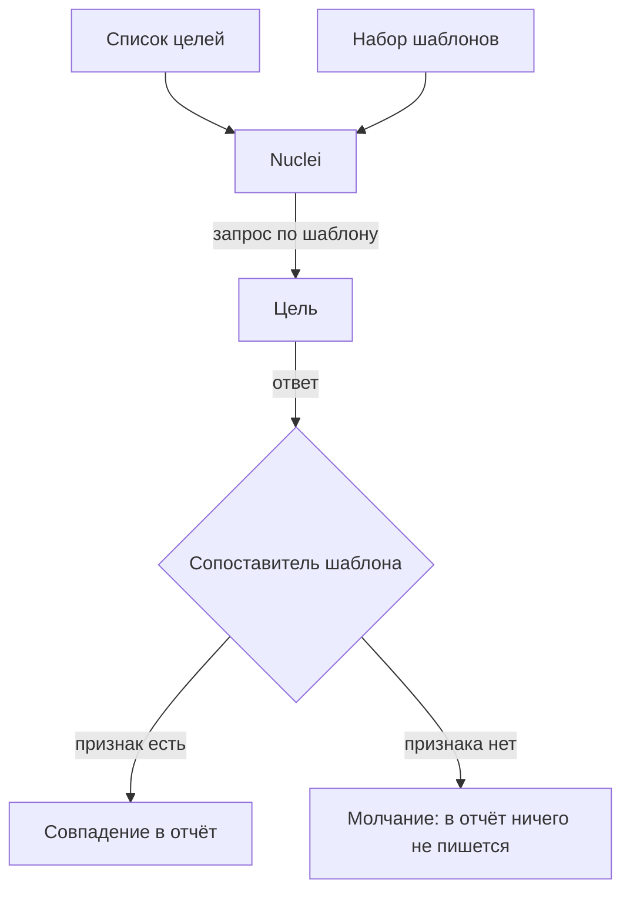

# Nuclei: шаблоны и место в наборе

Стенд «Лавка» из темы `zap-scanning` держит тринадцать подставленных
дефектов: отражённую и хранимую разметку, инъекцию, обход каталога, доступ к
чужому заказу. Активный прогон ZAP нашёл на нём четыре инъекции за 1331
запрос. Прогон Nuclei по тому же стенду — 13 545 запросов за 4 мин 37 с,
в десять раз больше — не нашёл ни одного дефекта. Всё, что он принёс, —
одиннадцать совпадений уровня `info`, то есть «сведение, а не дефект».
Сервер назвал версию Python, и ещё десять раз сработал один шаблон про
отсутствующие заголовки.

Объясняется это устройством: Nuclei — сканер по шаблонам, заготовок вида
«пошли такой запрос, поищи в ответе такой признак». На своё приложение
шаблона не писал никто. Что тогда искал этот прогон на самом деле — и что
означают его одиннадцать совпадений?

## Как устроен шаблон

Шаблон — это проверка, записанная текстом: файл на YAML говорит движку,
какой запрос послать и какой признак поискать в ответе. Бытовой пример —
аптечный экспресс-тест. Капните образец на полоску: проявилась вторая
черта — признак есть. Полоска здесь — шаблон, образец — ответ сервера,
вторая черта — искомый признак. В главном соответствие точное: тест на один
вирус промолчит перед другим, даже если все симптомы налицо, потому что
реагент в полоску зашит один. Ломается аналогия на скорости: новую полоску
разрабатывают месяцами, а шаблон на свежую уязвимость дописывают в общий
набор в день её публикации.

**Откуда это взялось.** Проверки на известные уязвимости писали скриптами:
на каждую опубликованную брешь свой скрипт со своим языком, своим выводом и
своим автором. Ломалось это на обмене: чужой скрипт нельзя было ни
прочитать за минуту, ни прогнать не разбираясь. В ответ проверку свели к
описанию — какой послать запрос и что поискать в ответе — и описание отдали
в общий набор. Туда шаблон на новую уязвимость дописывают в день её
публикации.

Шаблон целиком выглядит так — это минимальный работающий пример. Читается
он по четырём частям. Имя проверки стоит в `id`. Карточка `info` говорит,
что это за проверка и насколько она серьёзна. Блок протокола `http` задаёт
запрос. Список `matchers`, то есть сопоставители, задаёт признак
совпадения.

```yaml
id: lavka-server-banner
info:
  name: Лавка печатает версию сервера
  author: guidebook
  severity: info
  tags: [tech]
http:
  - method: GET
    path: ["{{BaseURL}}/"]
    matchers:
      - type: word
        part: header
        words: ["LavkaHTTP/"]
```

Поле `severity` в карточке — важность находки. Значение `info` здесь
означает «сведение, а не дефект»: такое совпадение говорит «сервер называет
свою версию каждому» — и ничего чинить не требует. Строка `{{BaseURL}}` —
подстановка: на её место встаёт адрес очередной цели, поэтому один шаблон
обслуживает весь прогон. Признак в примере — слово в заголовках ответа.
Всего сопоставителей семь видов: по слову, двоичной строке, выражению, коду
ответа, размеру, вычисляемому условию и пути в XML [^2]. Шаблоны пишут и
под другие протоколы — DNS, TCP, — но большая часть набора проекта — это
шаблоны под HTTP: 11 246 штук в версии 10.4.8.

Прогон устроен как петля по двум спискам — целей и шаблонов:



**Описание схемы.** Схема читается сверху вниз и показывает один прогон.
Два входа — список целей и набор шаблонов — встречаются в движке. На каждую
пару «цель, шаблон» движок шлёт запрос и передаёт ответ сопоставителю
шаблона. У итога два пути: признак есть — совпадение пишется в отчёт;
признака нет — в отчёт не пишется ничего.

Отсюда видны обе границы метода сразу: чего нет в списке целей — не
проверено, а чего нет в наборе шаблонов — не найдено. Вторая граница и есть
предмет этой темы. Ниже она разобрана на живом замере: что принёс прогон по
«Лавке», чего он не принёс и почему это закономерно.

## Что умеет и чего не умеет

**Что умеет.** Быстро проверить много целей на много известных признаков.
Отработать новую опубликованную уязвимость сразу, как только на неё написан
шаблон. Печатать готовую команду `curl`, воспроизводящую находку: её можно
перепроверить руками, не веря сканеру на слово. Проверка множества узлов на
известное — его миссия: список из сотен адресов он обходит теми же
шаблонами.

**Чего не умеет.** Найти дефект, у которого нет шаблона. Тринадцать
дефектов «Лавки» — дефекты её собственного кода, и шаблона на них не
существует: шаблоны пишут на то, что опубликовано и встречается у многих.
Свой перебор параметров — то, чем занимается активный режим в
`zap-scanning`, — появился у Nuclei только в версии 3.2. Оформлен он
отдельными шаблонами фаззинга (так проект называет перебор параметров) под
флагом `-dast`, и в прогоне из вступления их не было. Поэтому итог законен: 13 545 запросов по готовым заготовкам за
4 мин 37 с, одиннадцать совпадений уровня `info` и ни одного дефекта.

В этом и разница двух сканеров. Активный ZAP подставляет полезные нагрузки
в параметры найденных запросов: дефект заранее знать не нужно, нужна точка
входа. Nuclei без `-dast` в параметры не подставляет ничего — он
воспроизводит запросы, уже записанные в шаблонах, и находит только
описанное.

Из замера следует вопрос к своему проекту: шаблон на какой его дефект
написал бы кто-то посторонний? Ответ «ни на какой» означает, что прогон по
одному вашему приложению проверяет известное о его начинке: версии
компонентов и отсутствующие заголовки. Его рабочий вопрос другой: «есть ли
среди этих трёхсот узлов такой, где стоит непропатченная известная штука».
Вопрос «что не так с этим приложением» остаётся активному сканеру и ручному
разбору; границы самого метода разбирает `dast-limits`.

Что означают одиннадцать совпадений прогона. Одно — определение Python:
сервер назвал свою версию в ответе. Десять остальных — срабатывания одного
шаблона про отсутствующие заголовки, по сопоставителю на каждый. Одно из
десяти — заведомо ложное: шаблон пожаловался на отсутствие HSTS по адресу
`http://`. На таком адресе этот заголовок не имеет смысла и браузером
игнорируется (сам заголовок разбирает `security-headers`). Такое срабатывание
воспроизводится на любом стенде без TLS.

**Два умолчания, которые стоит знать до первого прогона.** Первое —
шаблоны с сервером обратной связи: они проверяют дефекты, которых не видно
в ответе. Сервер этот держит сам проект, и сканер знает его адрес заранее.
Шаблон подставляет этот адрес в запрос, уязвимое приложение обратится туда
само, а сканер спросит у сервера, было ли обращение. Бытовой пример —
уведомление о вручении: вы не видите, что творится в чужой квартире, но
почта сообщает вам, что письмо дошло. Почта здесь — сервер обратной связи:
для адресата она чужая, а для отправителя своя. Цена — обращение наружу, и
ключ `-ni` эти шаблоны исключает.

Второе умолчание — снятие мёртвой цели: при тридцати ошибках хоста прогон
исключает её из сканирования. Первый прогон по стенду оборвался на 52 %,
сообщив `found unresponsive permanently`; ключ `-nmhe` это отключает.
Повторный запуск с `-nmhe` дошёл до конца — его числа и стоят во
вступлении.

**Зачем это в работе AppSec-инженера.** Nuclei называют рядом с ZAP, и от
этого кажется, что они взаимозаменяемы. Замер из вступления разводит их
надёжнее объяснений: один инструмент ищет дефект в приложении, другой —
известное в множестве узлов. У двух инструментов два разных вопроса, и
пустой отчёт Nuclei по своему приложению читается ровно одним способом:
«шаблонов про это приложение не существует».

Скажите, не возвращаясь к тексту: почему прогон из вступления не нашёл ни
одного дефекта? Что означают его одиннадцать совпадений? Какой вопрос
Nuclei задаёт списку узлов?

## Источники

1. ProjectDiscovery, «Nuclei Overview»; реестр `nuclei-docs`. Разделы:
   назначение инструмента, работа по списку целей, ключи запуска.
   <https://docs.projectdiscovery.io/opensource/nuclei/overview>
2. ProjectDiscovery, «Templates Introduction»; реестр
   `nuclei-templates-intro`. Разделы: поля `id` и `info`, блок протокола,
   `matchers` семи видов (word, binary, regex, status, size, dsl, xpath),
   `matchers-condition`, `extractors`.
   <https://docs.projectdiscovery.io/templates/introduction>

Каркас этапа: `cwe-taxonomy`. Наследуется всеми темами и отдельной строкой не
повторяется.

**Скоропортящийся слой.** Версия инструмента и набора, число шаблонов, имена
ключей. Устройство шаблона — запрос плюс признак в ответе — и следствие о
слепой зоне держатся.

**Маркеры уверенности.** Прогон сделан **лично** 2026-08-25: Nuclei 3.11.1,
набор шаблонов 10.4.8, 11 246 шаблонов HTTP, 13 545 запросов, 4 мин 37 с, 11
совпадений уровня `info` и ноль дефектов на стенде из тринадцати подставленных.
Обрыв прогона на 52 % при умолчании `-mhe 30` наблюдался **лично**. Устройство
шаблона, виды сопоставителей и режим фаззинга — **по документации** проекта,
открытой лично 2026-08-25. Работа по большим спискам целей **не
воспроизводилась**: миссия сканировала только свой стенд на петле.

[^2]: ProjectDiscovery, «Templates Introduction», реестр `nuclei-templates-intro`.
