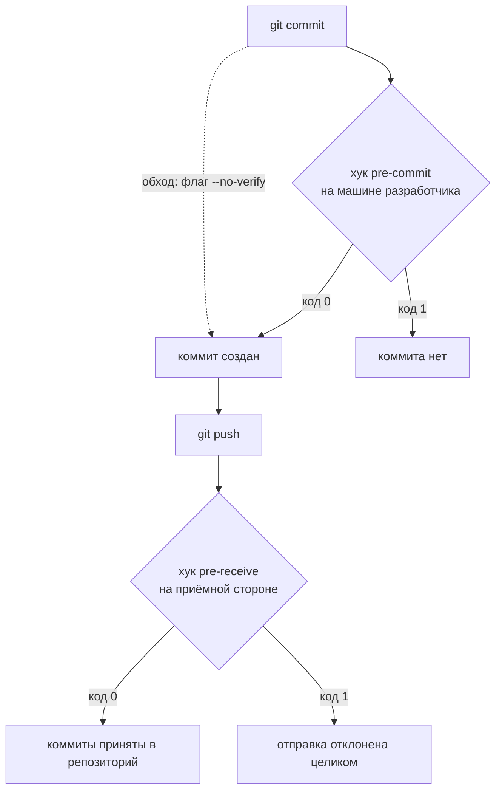

# Pre-commit и серверные проверки на секреты

Две команды, один коммит с секретом внутри. Разработчик добавил в репозиторий
файл с токеном, и проверка на его машине отклонила коммит с кодом 1. Тот же
коммит с одним добавленным флагом создался с кодом 0 — без предупреждения и
без записи. А когда этот коммит попробовали отправить дальше, приёмная сторона
ответила отказом, и тот же флаг её не спас:

```text
$ git push --no-verify origin main
 ! [remote rejected] main -> main (pre-receive hook declined)
```

Разница между этими двумя ответами — предмет темы. Клиентская проверка
подчиняется тому, кто коммитит, и потому она удобство, а не граница:
разработчик узнаёт о секрете за секунду до коммита. Серверная подчиняется
владельцу репозитория, и потому она граница: локальные флаги до неё не
долетают. Чем обход каждой из них виден остальным — и какой из двух оставляет
запись в журнале?

## Хук — программа, которую git вызывает сам

Git хранит историю проекта цепочкой коммитов, и в его работе есть события:
перед созданием коммита, перед отправкой, после принятия. Хук — это программа,
которую git вызывает сам, когда событие наступает. Она кладётся в каталог
`.git/hooks` под именем события: git увидел наступление `pre-commit`, нашёл
программу с таким именем и запустил её. Результат хук сообщает кодом возврата —
числом, которое программа оставляет после себя. Ноль значит «продолжай»,
любое другое число — «отменяй».

Бытовой пример — проверка орфографии в почтовой программе. Она запускается
сама в момент отправки письма, без команды пользователя. Соответствие прямое:
письмо — это коммит, проверка орфографии — хук, а кнопка «отправить без
проверки» — флаг `--no-verify`, который встретится ниже. Ломается аналогия на
второй стороне: у почтовой программы проверка одна, а у git есть зеркальные
события на приёмной стороне, и ими управляет уже не отправитель.

Это деление — хребет темы. Клиентский хук работает на машине разработчика и
подчиняется ему: его можно снять флагом, переменной окружения, а можно и вовсе
не ставить. Серверный хук работает там, куда уходит отправка, и разработчик до
него не достаёт. Поэтому проверку на секреты ставят дважды. Клиентская ловит
честную ошибку за секунду до коммита. Серверная гарантирует, что в репозиторий
не прошло ничего лишнего, — даже с машины, где клиентской проверки не было
вовсе.

**Зачем это в работе AppSec-инженера.** Хук на секреты ставят почти везде, где
вообще ищут секреты, и почти везде считают его защитой. Инженера зовут ровно
тогда, когда секрет прошёл сквозь установленный хук, — и объяснять, почему это
было ожидаемо, приходится задним числом.

## Как это работает

**Откуда это взялось.** Хуки в git появились как способ автоматизировать
рутину: прогнать тесты перед коммитом, проверить оформление сообщения,
отклонить отправку в защищённую ветку. Клиентские хуки при этом намеренно
сделали необязательными. Они лежат в `.git/hooks` и не передаются при
клонировании, иначе клонирование чужого репозитория означало бы запуск чужого
кода на вашей машине. Отключаться они обязаны по той же причине: проверка,
которую нельзя снять, превращает работу с чужим репозиторием в доверие чужой
программе. Раздать хуки команде помогает отдельный слой — конфигурация в корне
репозитория, по которой каждый ставит хук у себя. Свойство «отключается» этот
слой не меняет и менять не пытается.

Тема отвечает на «как настроить», поэтому устройство хуков дано ровно в той
мере, в какой оно влияет на настройку. Клиентский хук `pre-commit` вызывается
перед созданием коммита, и ненулевой код возврата отменяет коммит — его как не
бывало. Серверный хук `pre-receive` вызывается на приёмной стороне один раз за
отправку. На вход он получает строки вида «старая ссылка, новая ссылка, имя
ссылки», по одной на каждую обновляемую ветку. Ненулевой код отклоняет отправку
целиком, даже если секрет лежит в одной ветке из пяти. Разница в том, кто
вызывает: первый исполняет команда разработчика, а вторую — приёмная сторона,
и её поведение разработчик не выбирает.

Сам поиск секрета внутри обоих хуков делает сканер — та же программа и те же
правила, что разобраны в `secret-scanners`. Хук добавляет к сканеру только две
вещи: момент вызова и решение по коду возврата.



**Описание схемы.** Схема читается сверху вниз и показывает два рубежа на пути
коммита. Первый стоит на машине разработчика и решает судьбу коммита;
пунктирная стрелка — обход этого рубежа одним флагом. Второй стоит на приёмной
стороне, перед репозиторием, и обходной стрелки у него нет: флаг `--no-verify`
до этого рубежа не долетает. На вопрос «кто здесь решает» два рубежа отвечают
по-разному, и в этом вся тема.

## Что умеет и чего не умеет

**Что умеет клиентский хук.** Остановить коммит до его создания, то есть до
того, как секрет вообще попадёт в историю, — и тем избавить от всей работы по
`secret-rotation`. Работать быстро: проверяются только подготовленные
изменения — файлы, которые разработчик отметил к этому коммиту командой `git
add`, — а не репозиторий целиком.

**Чего не умеет клиентский хук.** Быть гарантией. Способов пройти мимо
несколько, и все документированные: флаг `--no-verify` у `git commit`,
переменная окружения `SKIP` с именем хука. Наконец, хук можно не установить у
себя вовсе: конфигурация лежит в репозитории, а установка выполняется вручную.
Ни один из этих способов не оставляет следа в репозитории.

**Что умеет серверная проверка.** Отклонить отправку до того, как коммиты
станут частью репозитория. У платформенного варианта — защиты от отправки,
настройки хостинга, которая отклоняет отправку с найденным секретом, — охват
шире командной строки. Она блокирует и коммиты, сделанные в веб-интерфейсе, и
загрузку файлов, и обращения к API.

**Чего не умеет серверная проверка.** Быть незаметной и мгновенной: она
добавляет время к каждой отправке и требует места, где её выполнять. И она не
отменяет обхода вовсе — но делает его **именным и записанным**. У платформенной
защиты обход требует указать причину, и после этого создаётся оповещение в
разделе безопасности, запись в журнале аудита и письмо владельцам. Журнал
аудита — это хроника действий, которую ведёт сам хостинг: кто, когда и что
обошёл; разработчик её не редактирует. Разница с `--no-verify` не в том, что
обойти нельзя, а в том, что обход виден.

## Как запустить

**Клиентский хук.** Сканер на машине разработчика уже стоит — его установка и
правила разобраны в `secret-scanners`. Осталось привязать его к событию git.
Это делает утилита pre-commit: по конфигурации из корня репозитория она ставит
хук в `.git/hooks` каждому, кто её об этом попросит. Сама утилита ставится
одной командой пакетного менеджера Python — `pip install pre-commit`. В
репозитории от утилиты живёт только файл конфигурации, и он общий для всей
команды:

```yaml
# .pre-commit-config.yaml
repos:
  - repo: local
    hooks:
      - id: gitleaks
        name: gitleaks — поиск секретов
        entry: /путь/к/gitleaks
        args: [git, --pre-commit, --staged, --no-banner, --redact]
        language: system
        pass_filenames: false
```

Файл читается по его строкам. Ключ `repo: local` значит, что программа уже
установлена на машине, и собирать для неё окружение не надо — об этом же
говорит `language: system`. Ключ `entry` — путь к сканеру, `args` — как его
вызвать. Подкоманда `git` выбирает режим «проверять репозиторий»: у сканера
есть ещё проверка каталога файлов и проверка потока со стандартного входа.
Флаг `--pre-commit` переводит проверку на текущие различия вместо истории,
а `--staged` сужает их до подготовленных изменений.

Дальше `--no-banner` убирает лишнее из вывода, а `--redact` маскирует
найденные значения. Ключ `pass_filenames: false` отменяет поведение по
умолчанию: pre-commit не передаёт сканеру список файлов, потому что сканер
читает подготовленные изменения из git сам.

Дальше каждый разработчик ставит хук у себя — одной командой, и это ручной шаг,
который никто за него не сделает:

```bash
pre-commit install     # -> pre-commit installed at .git/hooks/pre-commit
```

Флаг `--redact` здесь не косметика. Без него значение секрета попадёт в вывод
терминала и в журналы сборки, то есть утечёт ещё раз — уже из самой проверки.

**Серверная проверка.** Собственный хук кладётся в принимающий репозиторий под
именем `pre-receive`. Читать его стоит по трём планам: отбросить удалённые
ссылки, собрать диапазон приходящих коммитов, прогнать по нему сканер с отказом
при находке:

```bash
#!/usr/bin/env bash
# hooks/pre-receive в принимающем репозитории
while read -r oldrev newrev refname; do
  [ "$newrev" = "0000000000000000000000000000000000000000" ] && continue
  if [ "$oldrev" = "0000000000000000000000000000000000000000" ]; then
    range="$newrev --not --all"      # новая ветка: только свои коммиты
  else
    range="$oldrev..$newrev"
  fi
  gitleaks git . --no-banner --redact --log-opts="$range" || {
    echo "ОТКАЗ: в $refname найдены секреты — push отклонён" >&2
    exit 1
  }
done
```

Три плана видны по строкам. Цикл читает вход по одной строке на обновляемую
ссылку. Сорок нулей — это «ссылки не существует». У удаляемой ветки нет нового
состояния, поэтому её пропускают. У новой ветки нет старого, и её диапазон
собирается иначе: её коммиты минус те, что уже есть в репозитории.
Диапазон `oldrev..newrev` — это ровно те коммиты, которые отправка добавляет.
Последний план прогоняет по диапазону сканер, и при находке хук печатает строку
отказа с именем ссылки и завершается кодом 1. Эту строку вы увидите в
транскрипте отправки — в разделе «Как читать вывод».

Диапазон здесь — весь смысл. Проверять надо приходящие коммиты, а не
репозиторий целиком: иначе каждая отправка будет спотыкаться о старые находки,
и проверку отключат через неделю.

На хостинге тот же результат даёт встроенная защита от отправки, включаемая
настройкой репозитория или организации, — своего кода она не требует.

## Как читать вывод

Прогон на стенде: Gitleaks 8.30.1, pre-commit 4.6.2, git 2.55.0.

### Хук срабатывает

```text
$ git add config.py && git commit -m "настройка бота"
gitleaks — поиск секретов...............................Failed
- hook id: gitleaks
- exit code: 1
WRN leaks found: 1
$ echo $?
1
```

Читается по трём строкам: какой хук, с каким кодом возврата, сколько находок.
Коммита не создано — это и есть результат. Секрет в историю не попал, и работа
по отзыву ключа не понадобится.

### Тот же коммит проходит с одним флагом

```text
$ git commit --no-verify -m "настройка бота"
[main 08fdd61] настройка бота
 1 file changed, 1 insertion(+)
$ echo $?
0
```

Ни предупреждения, ни записи. В репозитории есть коммит с секретом, и по
репозиторию невозможно узнать, что хук был обойдён, — узнать это можно только
следующим прогоном сканера.

Второй документированный способ — переменная окружения с именем хука: её читает
утилита pre-commit и пропускает названный хук. Она честнее в терминале и ровно
так же нема в репозитории:

```text
$ SKIP=gitleaks git commit -m "проба"
gitleaks — поиск секретов..............................Skipped
[main be3a34e] проба
$ echo $?
0
```

### Серверная проверка тот же коммит не принимает

```text
$ git push origin main
remote: ОТКАЗ: в refs/heads/main найдены секреты — push отклонён
 ! [remote rejected] main -> main (pre-receive hook declined)
error: failed to push some refs to '../server.git'
$ echo $?
1
```

Приставку `remote:` git ставит каждой строке, которую напечатала приёмная
сторона: терминал её только доносит. Саму строку отказа печатает `echo` из
листинга хука в разделе «Как запустить» — сравните, она та же самая.
Собственные строки сканера со списком находок из транскрипта опущены. Отказ
пришёл с приёмной стороны, и локальные флаги на него не влияют:

```text
$ git push --no-verify origin main
 ! [remote rejected] main -> main (pre-receive hook declined)
```

Флаг `--no-verify` у `git push` отключает **клиентский** хук `pre-push` —
серверного он не касается. Это самая частая путаница в теме. У одного и того же
флага на разных командах разные адресаты, и ни на одной он не адресован
серверу.

### Чистая отправка проходит

```text
$ git push origin main
 * [new branch]      main -> main
```

Коммиты приняты, ветка создана. Разработчик говорит: «у меня все проверки
прошли». Какая из двух проверок могла при этом не сработать вовсе — и найдётся
ли её след в репозитории?

## Границы метода

**Граница первая: клиентский хук не гарантия, и это не дефект.** Он по замыслу
подчиняется тому, кто его запускает. Считать его защитой — то же самое, что
считать защитой подсказку в редакторе.

**Граница вторая: подготовленные изменения — не история.** Хук смотрит то, что
идёт в коммит. Секрет, уже лежащий в истории, он не найдёт: для этого есть
`secret-history-scan`, и прогон по истории нужен отдельно.

**Граница третья: обход остаётся и на сервере.** Платформенная защита позволяет
провести отправку с указанием причины. Разница с клиентским обходом — в
оповещении, записи в журнале аудита и письме владельцам, то есть в
восстановимости события, а не в его невозможности.

**Граница четвёртая: проверка не покрывает то, чего не знает.** Хук — тот же
сканер, с теми же правилами и теми же пропусками, что разобраны в
`secret-scanners`. Внутренний пароль без узнаваемой формы пройдёт обе проверки,
а чинится сам класс дефекта `CWE-798` в `secrets-in-code`.

**Цена.** Клиентский хук — доли секунды на коммит, и это его главное
достоинство: дорогую проверку разработчики отключат. Серверная — время на
каждую отправку, поэтому диапазон коммитов ограничивают приходящими. Проверка
секретов по всей истории на каждую отправку не выдерживается ни в одном живом
репозитории. Распределение проверок по всем стадиям конвейера сборки — предмет
этапа 3.

## Частая ошибка

Установленный хук приравнивается к границе: хук на секреты стоит — значит,
секреты в репозиторий не попадут. От чего, по-вашему, защищён репозиторий, где
такой хук стоит, — сформулируйте ответ до разбора.

**Клиентский хук отключается одним флагом, и в репозитории не остаётся следа.**
За мнением стоит допущение, что каждый коммит обязан пройти через хук, — но хук
исполняет команда разработчика, и она же решает, вызывать ли его. На стенде это
ровно одна дополнительная команда: коммит, отклонённый хуком с кодом 1,
создаётся с `--no-verify` с кодом 0. Обход не требует прав, не требует знаний и
не отличим потом от обычного коммита. А ещё хук можно не установить вовсе:
конфигурация лежит в репозитории, но `pre-commit install` каждый выполняет сам.

Контрпример к обратному выводу — «значит, клиентские хуки не нужны»: нужны, и
именно из-за цены следующего шага. Секрет, остановленный хуком, стоит секунды;
секрет, доехавший до репозитория, стоит отзыва ключа, разбора журналов
поставщика и оценки срока доступности — эта работа разобрана в
`secret-rotation`. Хук окупается на честных ошибках, которых большинство. Он не
про злой умысел и не про гарантию — гарантию даёт только проверка на той
стороне, которой разработчик не управляет.

## Чеклист для ревью

1. Проверьте, что серверная проверка существует, а не только клиентский хук.
2. Проверьте, что серверная проверка смотрит диапазон приходящих коммитов, а не
   репозиторий целиком.
3. Проверьте, что вывод хука не печатает значение секрета: флаг сокрытия включён.
4. Проверьте, что обходы серверной проверки где-то записываются и кем-то
   просматриваются.
5. Проверьте, что установка клиентского хука проверяется, а не предполагается:
   сам по себе файл конфигурации в репозитории ничего не включает.
6. Проверьте, что версия сканера в хуке зафиксирована и обновляется осознанно.
7. Проверьте, что прогон по всей истории существует отдельно от хука и идёт по
   расписанию.

## Попробуй сам

Поставить в своём репозитории клиентский хук на поиск секретов и убедиться, что
он останавливает коммит. Затем обойти его двумя разными способами. Затем
поднять локальный принимающий репозиторий с хуком `pre-receive` и попробовать
отправить в него тот же коммит.

Одна подсказка: принимающий репозиторий делается командой `git init --bare`.
Это репозиторий без рабочего дерева, чистое хранилище истории: из него не
коммитят, в него только отправляют. Хук в нём должен быть исполняемым —
забытый бит прав выглядит как отсутствие проверки: программу без права на
запуск git молча не вызовет.

**Критерий выполнения** наблюдаемый: у вас есть коммит с выдуманным секретом,
созданный вопреки установленному хуку, и отказ приёмной стороны на попытку его
отправить. Вы можете назвать два способа обойти клиентский хук и объяснить,
почему ни один не действует на серверную проверку.

## Проверь себя

1. Прочитайте серверный хук:

   ```bash
   while read -r oldrev newrev refname; do
     [ -z "${newrev//0/}" ] && continue   # ссылка удалена
     gitleaks git . --no-banner --redact --log-opts="$oldrev..$newrev" || {
       echo "ОТКАЗ: в $refname найдены секреты — push отклонён" >&2
       exit 1
     }
   done
   ```

   По сравнению с версией из темы здесь потеряна одна ветвь. Какая и когда она
   нужна?
2. Почему клиентский хук нельзя считать границей?
3. В репозитории стоит клиентский хук на секреты. От чего он защищает?

   А. От попадания секретов в репозиторий: каждый коммит проходит проверку.

   Б. От честной ошибки: разработчик узнаёт о секрете до коммита; гарантию
      даёт только серверная сторона.

   В. Ни от чего: раз отключается флагом — бесполезен.

4. В репозитории стоит хук `pre-commit`, который печатает находку и выходит с
   кодом 1. Предскажите код возврата обеих команд и что останется в истории.

   ```bash
   git commit -m "настройка бота"
   git commit --no-verify -m "настройка бота"
   ```

5. Возврат к теме `secret-scanners`: почему хук не находит секрет, который уже
   лежит в истории репозитория?
6. Возврат к теме `secrets-in-code`: чем кончается коммит, который хук
   пропустил, если секрет настоящий?

<details markdown="1">
<summary>Ответ 1</summary>

1. Потерян случай новой ветки: при первой отправке ветки `oldrev` нулевой, и
   диапазон `000…0..newrev` не собирается. В полной версии он собирается как
   `newrev --not --all` — только свои коммиты. А вторая строка отбрасывает
   удаление ссылки: там проверять нечего.

</details>

<details markdown="1">
<summary>Ответ 2</summary>

2. Он исполняется командой разработчика на его машине и по замыслу
   отключается: флагом `--no-verify`, переменной `SKIP`, отказом ставить хук
   вовсе. Ни один способ не оставляет следа в репозитории. Граница — это
   проверка, которой разработчик не управляет; клиентскому хуку разработчик
   хозяин, поэтому границей тот не бывает.

</details>

<details markdown="1">
<summary>Ответ 3: разбор вариантов</summary>

3. Верный ответ — Б.

   А. Хук исполняет команда разработчика, и она же решает, вызывать ли его:
      на стенде отклонённый коммит создаётся с `--no-verify` кодом 0, и следов
      нет.

   Б. Секрет, остановленный хуком, стоит секунды; доехавший до репозитория —
      отзыва ключа и разбора журналов. Хук окупается на честных ошибках,
      которых большинство.

   В. Бесполезен он только против злого умысла, а это не его предмет. Гарантию
      даёт проверка на стороне, которой разработчик не управляет, — она и
      ставится рядом.

</details>

<details markdown="1">
<summary>Ответ 4</summary>

4. Первая команда — код 1, коммита нет; вторая — код 0, коммит с секретом в
   истории, и по репозиторию не узнать, что хук был обойдён. Ответ получен
   прогоном: хук на Gitleaks 8.30.1, обе команды из вопроса.

</details>

<details markdown="1">
<summary>Ответ 5</summary>

5. Хук проверяет подготовленные изменения — то, что идёт в создаваемый коммит;
   старые коммиты в этот набор не входят. Для истории нужен отдельный прогон
   по истории, и он ставится по расписанию, а не на каждый коммит.

</details>

<details markdown="1">
<summary>Ответ 6</summary>

6. Ротацией: отзыв ключа у поставщика, новый ключ, проверка журналов, запись
   срока доступности. Удаление строки из кода инцидент не закрывает — ключ уже
   прочитан и скопирован.

</details>

## Источники

1. pre-commit; реестр `pre-commit`. Разделы: формат `.pre-commit-config.yaml`,
   локальные хуки и `language: system`, установка хука командой `pre-commit
   install`, пропуск отдельного хука переменной `SKIP`.
   <https://pre-commit.com/>
2. GitHub, «About push protection»; реестр `gh-push-protection`. Разделы: что
   блокирует защита от отправки (командная строка, веб-интерфейс, загрузка
   файлов, API), два вида защиты и их умолчания, обход с указанием причины и
   что при этом создаётся — оповещение, запись в журнале аудита, письмо
   владельцам.
   <https://docs.github.com/en/code-security/concepts/secret-security/push-protection>

Каркас этапа: `cwe-taxonomy`. Наследуется всеми темами и отдельной строкой не
повторяется.

**Скоропортящийся слой.** Имена флагов и хуков, вид вывода, настройки
платформенной защиты и её умолчания. Устройство — клиентская проверка
подчиняется разработчику, приёмная не подчиняется — не меняется вовсе.

**Маркеры уверенности.** Все четыре состояния воспроизведены **лично**
2026-08-25: хук отклонил коммит с кодом 1, `git commit --no-verify` создал тот же
коммит с кодом 0, серверный `pre-receive` отклонил отправку, и `git push
--no-verify` её тоже не спас; чистая отправка прошла. Стенд — локальный
принимающий репозиторий `git init --bare`, Gitleaks 8.30.1, pre-commit 4.6.2,
git 2.55.0. Переменная `SKIP` как второй способ обхода проверена **лично** тем
же прогоном: хук печатает `Skipped`, коммит создаётся с кодом 0. Механика git
без сканера перепроверена **лично** 2026-10-03 на git 2.55.0 заглушечными
хуками: хук с кодом 1 отменил коммит, `--no-verify` создал его с кодом 0,
`pre-receive` отклонил отправку, и `git push --no-verify` её не спас; строки
вывода, которые печатает сам git, совпали дословно. Ревизией 2026-10-03 листинг
`pre-receive` дополнен строкой отказа, которую хук печатает сам: без неё строка
`remote: ОТКАЗ: …` в транскрипте невоспроизводима. Дополненный листинг прогнан
**лично** тем же числом на git 2.55.0, со заглушкой вместо сканера. Строка
отказа появилась с приставкой `remote:`, отправка отклонена кодом 1, а при
чистой отправке печатаются только строки самого git. Строка `Passed` в старом
транскрипте чистой отправки в этой конфигурации не воспроизводится: её печатает
фреймворк при хуке стадии `pre-push`, который тема не ставит. Той же ревизией
строка убрана из транскрипта. Семантика флагов `--pre-commit` и `--staged` и
режимы сканера (`git`, `dir`, `stdin`) проверены **по документации и
исходнику** Gitleaks, открытым лично 2026-10-03. Состав того, что блокирует
платформенная защита от отправки, и последствия её обхода — **по документации**
GitHub, открытой лично 2026-08-25; сама платформенная защита не запускалась,
стендом служил собственный серверный хук.
