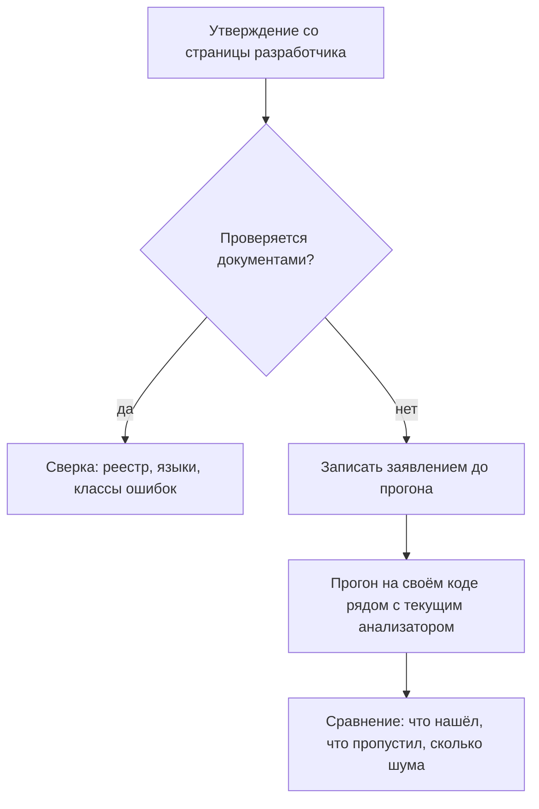

# Отечественные SAST: назначение и место

Дефект разложен по трём файлам: параметр приходит в обработчик, проходит
промежуточный модуль и попадает в текст запроса. Прогон Semgrep молчит:
бесплатная сборка работает внутри одной процедуры и границ функций не
переходит (`sast-principles`). На совещании по итогам звучит предложение:
«возьмём российский анализатор, он заявляет символьное выполнение и связи
между функциями». Заявление попадает ровно в этот случай, но лицензии ни у
кого нет и проверить не на чем. Так эти инструменты и появляются в разговоре
— не после сравнения, а по требованию. Тема — про то, что можно утверждать
без прогона, а что останется заявлением до первого запуска.

## Зачем в конвейере появляется российский анализатор

Повод почти всегда один — Единый реестр российского программного
обеспечения. Это государственный перечень программ, которые формально
признаны российскими: для включения разработчик подтверждает страну создания
и права на код. Перечень завели ради закупок: банк или госучреждение
покупает программы по правилам, где зарубежный инструмент не принимают
независимо от его качества. Запись в реестре работает как пропуск на объект,
а сам режим таких закупок называют импортозамещением.

Бытовое соответствие — допуск на стройку по списку: охрана сверяет не
мастерство электрика, а наличие его фамилии в списке. Ломается аналогия в
самом важном для темы месте: список на входе ничего не говорит о качестве
работы. Реестровая запись подтверждает происхождение программы, а не то, как
хорошо она ищет дефекты.

Требование приходит в разных формах: условие заказчика в договоре,
отраслевое правило, внутренний стандарт компании. Форма меняется, а следствие
одно: состав инструментов решается до всякого сравнения их качества.
Анализатор в конвейере меняется не потому, что новый лучше ловит дефекты, а
потому, что старый не проходит по происхождению.

Место в процессе при этом не меняется. Статический анализ читает исходный
текст до запуска программы. Его соседи — две другие проверки: запросы
к уже работающему приложению снаружи и сверка состава зависимостей с базой
известных уязвимостей. Обе идут дальше по этому этапу, и ни одну анализатор
кода не заменяет: предмет у него другой.

**Зачем это в работе AppSec-инженера.** Вопрос «а чем это отличается от
того, что у нас стоит» задают на первом же совещании, где такой инструмент
называют. Отвечать приходится без прогона: лицензии нет ни у кого из
присутствующих. Единственный честный ответ — развести проверяемые утверждения
и заявления вендора, а для сравнения попросить прогон на своём коде.

## Что умеет и чего не умеет

**Откуда это взялось.** Инструменты выбирали по техническим свойствам, и
список кандидатов был общим для всех. Ломалось это на требованиях к
происхождению программ: часть заказчиков перестала принимать зарубежный
анализатор независимо от его качества. В ответ на рынке появился отдельный
вопрос — не «какой анализатор лучше», а «какой из них можно поставить у
этого заказчика».

По устройству это тот же статический анализ, что разобран в
`sast-principles`: текст разбирается в дерево, строится граф, по нему
распространяется метка. Отличия между такими анализаторами лежат не в
механике, а в заявленных осях и в происхождении. Поэтому и задача здесь —
знать назначение и место в процессе, а не выбирать между ними: выбор без
прогона на своём коде не делается.

Проверяемые утверждения берутся со страниц разработчиков и на них же
проверяются. Первым в разборе стоит Svace от Института системного
программирования РАН — исследовательского института, где этот анализатор и
вырос. Его страница называет больше семидесяти классов ошибок и список
языков: C и C++, C#, Java, Kotlin, Go, Python, Scala и Visual Basic .NET.
Для JavaScript заявлен облегчённый анализ, то есть проверка без полного
разбора устройства программы. Там же стоят номер 4047 в Едином реестре
российского ПО и интеграция с системой сборки: анализатор подключается к
сборке проекта и запускается вместе с ней.

Отдельной строкой страница заявляет символьное выполнение с учётом связей
между функциями. Эти слова стоит разобрать, потому что именно они отвечают на
поломку из начала темы. Обычный запуск программы отвечает на вопрос «что
будет при таком вводе». Символьное выполнение отвечает на другой: «что может
случиться при любом вводе такого вида». Вместо конкретного значения
анализатор несёт по программе символ — например, «какая-то строка из
запроса». Дальше он запоминает, через какие функции и при каких условиях эта
строка проходит.

Бытовое соответствие — проверка формулы на бумаге: вместо подстановки числа
пишут «x» и смотрят, при каких значениях результат выходит за границу.
Ломается аналогия на цене: каждая ветка в коде умножает число путей, которые
приходится рассматривать. Именно по вычислительной цене бесплатная сборка Semgrep от
межпроцедурного анализа отказывается, а заявленные «связи между функциями» —
ровно та ось, которой у неё нет. У Svace там же заявлен веб-интерфейс
просмотра предупреждений: находки разбирают в браузере, помечая истинные и
ложные, как это устроено в `sonarqube`.

Второй продукт — Solar appScreener, анализатор кода российской разработки от
ГК «Солар». На странице продукта названы виды анализа и список поддерживаемых
языков. Это утверждения того же проверяемого вида: они сверяются с самой
страницей, и лицензия для этого не нужна. Что из заявленного сработает на
вашем коде, страница не отвечает — как и у Svace.

Ещё два названия в один ряд с анализаторами не ставятся.
AppSec.Track от AppSec Solutions — не анализатор, а платформа учёта находок.
Она собирает находки из разных инструментов, чтобы их назначали, чинили и
закрывали. Сама дефектов она не ищет. PT Application Inspector от Positive
Technologies устроен иначе: он шире одного анализатора. В одном продукте
собраны статический анализ кода, сверка состава зависимостей и проверка
работающего приложения.

Минимальный собственный пример стоит на границе проверяемого. Дефект из
начала темы разложен по трём файлам, и бесплатная сборка Semgrep на нём
молчит: прогон реальный, сделан на версии 1.174.0. Заявленное символьное
выполнение со связями между функциями закрывает ровно такой случай, и
проверяется оно одним прогоном на этих же файлах. Прогона не было, потому
что лицензии нет, и поэтому утверждение входит в тему как заявление, а не как
факт.

Чего сказать нельзя: ничего о качестве анализа, доле ложных срабатываний и
сравнении с инструментами предыдущих тем. Страница разработчика — не замер,
а описание намерения. Формулировка «не хуже зарубежных аналогов» остаётся
маркетингом, пока рядом нет прогона обоих инструментов на одном и том же
коде.

## Как развести проверяемое и заявление

Разводить их помогает один вопрос: есть чем проверить утверждение без
лицензии? Реестровую запись, список языков и классы ошибок проверяют
документами — реестром и страницей разработчика. Качество анализа и долю
шума документами не проверить: они появляются только из прогона на своём
коде рядом с тем, что уже стоит.

**Описание схемы.** Схема читается сверху вниз. Каждое утверждение со
страницы разработчика проходит один и тот же фильтр. Если оно проверяется
документами, его сверяют с реестром, списком языков и классов ошибок. Если
нет, оно записывается заявлением и ждёт прогона на своём коде рядом с текущим
анализатором. После прогона отчёты сравнивают по трём осям: что нашёл, что
пропустил, сколько шума принёс.

Осталось разобрать последний вопрос: что подтвердил бы прогон на дефекте
из трёх файлов и чего не закрыл бы даже удачный? Подтвердил бы одно — на
этом дефекте заявленный анализ работает. Не закрыл бы главного: один
найденный дефект не говорит о тысяче других. Качество считается по
пропускам и шуму на своём коде, а не по одному попаданию.

## Источники

1. ИСП РАН, «Статический анализатор Svace»; реестр `isp-ras-svace`. Разделы:
   классы ошибок, поддерживаемые языки, номер в Едином реестре российского ПО,
   интеграция с системой сборки, символьное выполнение, веб-интерфейс
   просмотра предупреждений.
   <https://www.ispras.ru/technologies/svace/>
2. ГК «Солар», страница продукта Solar appScreener; реестр
   `solar-appscreener`. Разделы: заявленные виды анализа и поддерживаемые
   языки.
   <https://rt-solar.ru/products/solar_appscreener/>
3. AppSec Solutions, сайт вендора; реестр `appsec-solutions`. Разделы:
   назначение платформы AppSec.Track как средства учёта находок.
   <https://appsec.global/>
4. Positive Technologies, страница продукта PT Application Inspector; реестр
   `pt-application-inspector`. Разделы: состав платформы — статический анализ
   кода с абстрактной интерпретацией, анализ состава зависимостей, проверка
   работающего приложения.
   <https://ptsecurity.com/products/ai/>

Каркас этапа: `cwe-taxonomy`. Наследуется всеми темами и отдельной строкой не
повторяется.

**Скоропортящийся слой.** Состав продуктов, списки языков, номера реестровых
записей и сами страницы разработчиков. Повод, по которому такой инструмент
появляется в конвейере, и его место в процессе держатся дольше.

**Маркеры уверенности.** Молчание бесплатной сборки Semgrep на дефекте,
разложенном по трём файлам, — **проверено лично** 2026-08-25 на Semgrep
1.174.0. Классы ошибок, языки, номер реестровой записи и заявленные свойства
анализа Svace, а также назначение Solar appScreener и AppSec.Track — **по
страницам разработчиков**, открытым лично 2026-08-25. Ни один из названных
инструментов **не запускался**: лицензий нет, и ни одно утверждение об их
качестве в теме не сделано. Страница PT Application Inspector переехала на
канонический адрес и вошла в источники — **проверено лично** 2026-09-03.
