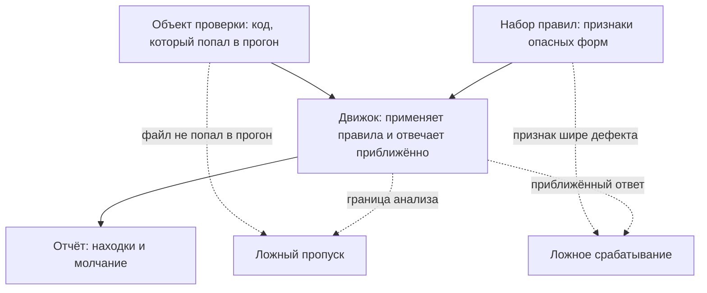

# Ложные срабатывания и ложные пропуски SAST

Одно место в коде, три статических анализатора, три разных вердикта:

```text
bandit   db.py:28  B608 hardcoded_sql_expressions   Conf: Medium
semgrep  db.py:28  sqlalchemy-execute-raw-query     ERROR
gosec    db.go:25  находки нет
```

За этими строками стоит один и тот же чистый код, записанный на двух языках.
Имя таблицы в нём сверяется с коротким списком разрешённых значений и только
потом подставляется в запрос. Дефекта здесь нет, а находки есть. При этом
третий инструмент на таком же коде промолчал.

Расхождение — не случайность и не брак: у каждого из трёх вердиктов есть
причина, которая выводится из устройства анализа. Признак этой причины виден
в самом коде или в самом отчёте. Эта тема — про то, как такой признак
прочитать. Здесь молчание оказалось верным, но тот же список причин отличает
лишнее слово от настоящего дефекта и опасное молчание от честного.

## Две ошибки с именами

Находка там, где дефекта нет, называется ложным срабатыванием. Бытовой
пример — датчик дыма на кухне: он пищит на подгоревшую яичницу, хотя пожара
нет. Зеркальная ошибка — молчание там, где дефект есть; она называется ложным
пропуском, и это тот же датчик, который не пикнул, когда задымилась
проводка. Первая ошибка съедает время разбора, вторая прячет дефект.

Аналогия ломается на вопросе «почему». Датчик не ответит, почему запищал.
Анализатор отвечает: рядом с каждой находкой стоят правило и место в коде,
и причина срабатывания читается по ним. Дальше в теме — только про это
чтение.

Сами инструменты здесь — статические анализаторы кода, SAST: они читают
исходный текст программы и ищут в нём опасные записи, не запуская её.
Метод со всеми следствиями разобран в теме `sast-principles`. Инструменты из
примера в начале темы встретятся дальше по маршруту: bandit смотрит код на
Python, gosec — на Go, Semgrep знает несколько языков. Здесь предмет другой — не
инструменты сами, а две их ошибки.

Обе ошибки — свойство метода, а не признак плохого инструмента. Так они и
записаны в спецификации на анализаторы исходного кода, которую издаёт NIST,
Национальный институт стандартов и технологий США. Спецификация называет
ложные срабатывания и пропуски неизбежными и требует приемлемой доли ложных
срабатываний, а не нулевой [^1]. Нулевой доли не бывает, потому что анализатор судит о
работе программы по её тексту, а текст говорит о поведении не всё.

**Зачем это в работе AppSec-инженера.** Разбор находок съедает всё время,
которое сканер сэкономил. Инженер, который читает каждую находку заново,
разбирает сотню в неделю поштучно. Инженер, который сначала относит находку
к причине, закрывает половину отчёта одним признаком. Второй разговор, ради
которого нужен этот список, — с разработчиком, спрашивающим «почему сканер
это пропустил». Ответ «метод такого не видит по устройству» проверяем,
а ответ «инструмент плохой» разговор заканчивает.

## Как это работает

**Откуда это взялось.** Обе ошибки появились вместе с самим методом и
получили имена раньше, чем инструменты стали массовыми. До спецификации
спор с поставщиками шёл на уровне «у нас точнее», и сравнивать было нечем:
каждый считал ошибки по-своему. Спецификация дала общие имена и общий счёт,
и доля ложных срабатываний стала числом, а не рекламной фразой.

Ошибка рождается в одном из трёх мест: в правиле, в движке или в объекте
проверки. Правило — записанный признак опасной формы кода, например «строка
запроса собрана склейкой»; про вашу программу правило не знает ничего.
Движок — программа, которая применяет набор правил к коду; как он разбирает
текст в дерево и ведёт метку по данным, рассказывает `sast-principles`.
Объект проверки — сам код, и файл в прогон может не попасть вовсе.



**Описание схемы.** Схема читается сверху вниз и показывает три места, где
рождается ошибка. Код и набор правил входят в движок, движок печатает отчёт.
Пунктиром показаны выходы из этой цепочки. Файл, не попавший в прогон, и
граница анализа у движка дают молчание. Слишком широкий признак в правиле и
приближённый ответ движка дают лишнюю находку.

Дальше причины разобраны двумя списками: сначала шум, потом молчание. У
каждой причины есть признак, видимый в самом коде или в самом отчёте,
поэтому разбор находки — проверка по списку, а не размышление с нуля.
Замеры со стенда этой темы стоят у восьми причин из девяти. У последней
причины молчания замера нет: её прогоном не отличить от чистого кода.

### Пять причин шума

1. **Нечувствительность к пути.** Движок объединяет ветки и не разбирает
   условия, при которых исполнение доходит до выражения; эта ось
   чувствительности разобрана в `sast-principles`. Признак: рядом с находкой
   стоит проверка, ранний выход или недостижимый код. Замер: четыре функции
   с одинаковой строкой запроса дали четыре находки, настоящий дефект был
   один.
2. **Правило не про безопасность в этом месте.** Криптографический примитив
   применён не для защиты. Признак: результат работает ключом кэша, именем
   файла или идентификатором, а не подписью или паролем. Замер: на
   инструментарии этого проекта обе находки набора `p/default` оказались
   такими. Первая — свёртка, то есть хеш, на SHA-1 в имени картинки. Вторая —
   открытие адреса из проверяемого документа в самой проверялке ссылок:
   такой вызов — её работа, а не дефект.
3. **Правило не того стека.** Идентификатор правила называет библиотеку,
   которой в коде нет. Признак: имя правила и импорты файла не совпадают.
   Замер: `sqlalchemy-execute-raw-query` сработало на всех трёх строках
   стенда, где запросы идут через голый драйвер `sqlite3`.
4. **Санитайзер, неизвестный правилу.** Санитайзер — своя проверка входа
   перед опасным вызовом: значение проходит дальше, только если оно стоит в
   заранее записанном списке. Про такое сравнение правило не знает, потому
   что оно написано в вашем коде, а не в общей библиотеке. Признак: значение
   проходит через сравнение со списком или приведение к числу — после него
   чужому тексту в значении взяться неоткуда. Замер: имя таблицы, сверяемое
   со списком из двух элементов, помечено дефектом и Semgrep, и bandit.
5. **Дубли.** Одно место, несколько правил: дефект один, а строк в отчёте
   несколько. Признак: совпадают файл и строка. Замер: gosec на восемь
   находок дал шесть мест — пары `G702` и `G204`, `G703` и `G304`.

### Четыре причины молчания

Молчание опаснее шума, потому что его не видно вовсе. Причин у него четыре,
и признак каждой стоит не в отчёте, а рядом с ним: в шапке прогона или в
устройстве кода.

1. **Граница анализа.** Путь значения от входа в программу до опасного
   вызова выходит за пределы, объявленные движком. Признак: вход и вызов
   лежат в разных функциях или файлах. Замер: один и тот же дефект дал одну
   находку в пределах функции и ноль находок разложенным по трём файлам.
   Ведение значения через границы функций — межпроцедурный анализ из
   `sast-principles` — в бесплатной сборке Semgrep не выполняется, и это
   написано в её документации [^2].
2. **Правила нет в наборе.** Правила ходят наборами: набор — список правил
   под задачу, и в реестре Semgrep такие списки называются, например,
   `p/default` и `p/python`. Признак: тот же код на другом наборе
   находится. Замер: набор `p/python` пропустил оба подставленных дефекта
   SQL, `p/default` нашёл оба.
3. **Объект не попал в прогон.** Semgrep по умолчанию смотрит только файлы,
   которые отслеживает git, и молча пропускает остальные; это поведение и
   флаг `--no-git-ignore` разобраны в `sast-principles`. Признак: число
   просмотренных файлов в шапке прогона меньше числа файлов в дереве. Замер:
   стенд вне индекса git дал «Scanning 0 files» и нулевой код возврата —
   отчёт неотличим от чистого.
4. **Значение собирается во время выполнения.** Имя функции склеено из
   строки при запуске, запрос прочитан из базы, ветка выбрана настройкой.
   Признак виден в самом коде: имя или текст запроса не записан в нём
   литералом. В остальном здесь молчание метода: такого он не увидит
   никогда.

## Что умеет и чего не умеет

Список из девяти причин — рабочий инструмент, и у него своя область
применения. Он умеет отвечать на вопрос «почему инструмент так сказал» по
признаку, видимому в коде или отчёте. На этом строится разбор пачки находок
за один проход: сортировка по правилу и файлу, потом причина, потом решение.

Чего список не умеет — отвечать, эксплуатируется ли настоящая находка.
Правило `B608` на строке с запросом говорит, что запрос собран склейкой,
и это правда независимо от того, достижима ли функция снаружи. Оценка
последствий — отдельная работа, и вход у неё не отчёт сканера, а модель
приложения. Как такая находка ведётся дальше в трекере, то есть в системе
учёта, разбирает тема `triage-false-positives`.

## Как запустить

Долю шума нельзя узнать из описания инструмента: она задаётся набором правил
и вашим кодом. Меряется она размеченным прогоном. Разметка — это пометки,
которые ставятся в код до прогона. Рядом с каждым известным дефектом вы
пишете, что он настоящий, а рядом с каждым чистым местом похожей формы —
что оно чистое. Получается задачник с ответами, записанными до решения,
и прогон сверяется с этими ответами.

```bash
# 1. Разметить объект: рядом с каждым подставленным дефектом — комментарий,
#    рядом с каждым чистым местом похожей формы — тоже.
# 2. Прогнать и сохранить вывод целиком.
semgrep --config=p/default --metrics=off --no-git-ignore --json \
        shop/ > out/run.json
# 3. Свести: находка, место, разметка, причина по списку.
```

Три флага здесь несут смысл. `--no-git-ignore` велит смотреть все файлы, а не
только отслеживаемые git: без него замер проверял бы не весь объект.
`--metrics=off` выключает отправку статистики прогона наружу. `--json`
отдаёт машинный отчёт, который дальше сводится в таблицу скриптом, а не
глазами.

Разметка ставится до прогона, а не после. Причина в том, что разметка,
написанная по отчёту, подтверждает отчёт: вы проверяете инструмент им
самим. Разметка до прогона проверяет инструмент вашим знанием о коде.

## Как читать вывод

Вернёмся к трём строкам из начала темы:

```text
bandit   db.py:28  B608 hardcoded_sql_expressions   Conf: Medium
semgrep  db.py:28  sqlalchemy-execute-raw-query     ERROR
gosec    db.go:25  находки нет
```

Строки 28 и 25 — один и тот же чистый код на двух языках. Два инструмента
из трёх назвали его дефектом, третий промолчал. Расхождение объясняется
устройством правила. У gosec правило `G701` построено на распространении
метки — ведении пометки «значение пришло извне» по программе; как метка
ставится и движется, разобрано в `sast-principles`. Метки на имени таблицы
нет, потому что значение извне не приходит: оно записано в самом коде.
Правило `B608` и его аналог в Semgrep смотрят не на метку, а на форму
выражения [^3][^4], и форма здесь — подстановка в строку.

На строке 28 два инструмента сошлись, и оба — на чистом коде. Такое
совпадение не доказывает дефект: оба правила смотрят на форму, поэтому и
ошибаются одинаково. Доказательством было бы совпадение двух разных методов,
а не двух взглядов одним глазом.

Отсюда порядок чтения. Сначала правило: его идентификатор говорит, что оно
проверяет. Потом причина из списка. Потом решение. Для настоящей находки
класса «запрос собран склейкой» решение разобрано в теме `sqli-basics`; для
находки про слабый примитив — в `weak-algorithms`. Ложная находка закрывается
записью о признаке, по которому код признан чистым.

## Границы метода

**Граница первая: причина не всегда одна.** На одной находке сходятся две
причины сразу — например, правило не того стека и нечувствительность к пути.
Список даёт разбор, а не классификацию: цель — понять, что делать, а не
поставить единственную метку.

**Граница вторая: доля шума не переносится между репозиториями.** Число,
полученное на стенде из шести файлов, ничего не говорит о монолите на двести
тысяч строк. Замер повторяется на своём коде, и повторяется после каждой
смены набора правил.

**Цена.** Разметка объекта проверки — час на небольшую сборку, оценка по
стенду этой темы. Дальше сведение отчёта к таблице автоматизируется,
а разбор причин — нет.

## Частая ошибка

Раз ложные срабатывания неизбежны, напрашивается решение: гасить их и вести
аккуратный файл исключений. Чем аккуратнее ведётся файл, тем чище отчёт.
Прикиньте до разбора, что такой файл скажет через год тому, кто решений
не принимал.

**Подавление не отличает ложную находку от неудобной.** Подавление — пометка,
которая велит инструменту больше не печатать находку: комментарий в коде или
строка в файле исключений. Комментарий, гасящий все правила на строке,
снимет и то правило, которое сработает на этой строке через год.
Документация bandit предупреждает об этом и советует называть подавляемый
тест по имени [^3]. Файл исключений растёт быстрее кода, и через год он
отвечает на вопрос «что мы решили» неразличимо для того, кто решения
не принимал.

Контрпример: находка на свёртке ключа кэша подавлена целиком по файлу. Через
полгода в том же файле появляется подпись запроса на том же примитиве. Это
настоящий дефект класса `CWE-327` — применение слабого криптографического
алгоритма по общему каталогу классов дефектов CWE. Отчёт молчит.

## Чеклист для ревью

1. Проверьте, что у каждой закрытой находки записана причина из списка, а не
   слово «ложное».
2. Проверьте, что доля шума измерена на своём коде размеченным прогоном.
3. Проверьте, что разметка объекта проверки сделана до прогона, а не по отчёту.
4. Проверьте, что пропуски проверены отдельно: чистый отчёт сверен с числом
   просмотренных файлов.
5. Проверьте, что подавление названо по идентификатору правила, а не поставлено
   на всю строку или файл.
6. Проверьте, что расхождение двух инструментов на одном месте объяснено
   устройством правила, а не оставлено как «один из них ошибся».

## Попробуй сам

Возьмите свой репозиторий и отметьте в нём пять мест: два настоящих дефекта
и три чистых места похожей формы. Прогоните один инструмент и заполните
таблицу «находка — разметка — причина по списку».

Одна подсказка: чистые места похожей формы искать не надо специально — они
уже есть там, где стоит проверка входа перед опасным вызовом.

**Критерий выполнения** наблюдаемый: у каждой строки таблицы стоит номер
причины из двух списков этой темы, а места без находок объяснены номером
причины молчания.

## Проверь себя

1. Три находки из разных отчётов, признаки стоят в комментариях справа:

   ```text
   bandit   cache.py:12  B324 hashlib                  # md5 для ключа кэша
   semgrep  db.py:28     sqlalchemy-execute-raw-query  # в файле sqlite3
   bandit   util.py:40   B608 hardcoded_sql            # строка после return
   ```

   К какой причине из списка темы относится каждая?
2. Почему gosec промолчал на имени таблицы из замкнутого списка, а bandit —
   нет?
3. В репозитории каталог `gen/` записан в `.gitignore`, а в нём лежит файл с
   явным дефектом:

   ```bash
   semgrep --config rule.yaml --metrics=off gen/
   ```

   Предскажите, что напечатает прогон и какой код возврата он даст.

4. Находка разобрана и признана ложной. Как её закрыть?

   A. Подавить на строке все правила одним комментарием: отчёт станет чистым.

   B. Подавить конкретное правило по имени и записать признак, по которому код
      признан чистым.

   C. Ничего не менять: ложная находка неопасна, а комментарии засоряют код.

5. Возврат к теме `parameterized-queries`: в отчёте находка «запрос собран
   склейкой». По какому признаку в коде вы отличаете истинную такую находку от
   ложной, не запуская ничего?
6. Возврат к теме `sast-principles`: какая ось чувствительности анализа
   отвечает за первую причину шума?

<details markdown="1">
<summary>Ответ 1</summary>

1. Первая — причина «правило не про безопасность в этом месте»: результат
   свёртки — ключ кэша, а не подпись и не пароль. Вторая — «правило не того
   стека»: имя правила называет SQLAlchemy, а импорты файла — `sqlite3`.
   Третья — нечувствительность к пути: строка стоит после `return`, и исполнение
   до неё не доходит никогда.

</details>

<details markdown="1">
<summary>Ответ 2</summary>

2. Правило `G701` построено на распространении метки, а метка на имени таблицы
   не появляется: значение не приходит извне. Правило `B608` смотрит на форму
   выражения: строка собрана подстановкой, и этого для срабатывания достаточно.
   Расхождение двух инструментов на одном месте объясняется устройством правила,
   а не тем, что «один из них ошибся».

</details>

<details markdown="1">
<summary>Ответ 3</summary>

3. Прогон напечатает `Scanning 0 files tracked by git`, ноль находок — и
   вернёт код 0. Отчёт неотличим от честного чистого, хотя дефект в файле
   есть: объект не попал в прогон, третья причина молчания. Ответ
   получен прогоном на Semgrep 1.174.0: `semgrep --config rule.yaml
   --metrics=off gen/; echo $?` печатает `0`. Отличает такой прогон строка о
   числе просмотренных файлов, и читается она всегда.

</details>

<details markdown="1">
<summary>Ответ 4: разбор вариантов</summary>

4. Верный ответ — B.

   A. Подавление на всю строку гасит и то правило, которое сработает здесь
      через год. Контрпример темы: подавленная находка на свёртке ключа кэша,
      а через полгода в том же файле — настоящая подпись на том же примитиве,
      и отчёт молчит.

   B. Документация bandit советует то же: называть подавляемый тест по имени.
      Записанный признак отвечает на вопрос «что мы решили» для того, кто
      решения не принимал.

   C. Незакрытая находка разбирается заново каждым, кто читает отчёт. Ложная
      находка закрывается записью о признаке, а не забвением.

</details>

<details markdown="1">
<summary>Ответ 5</summary>

5. По аргументам опасного вызова. В запросе на параметрах текст — литерал, а
   значения уходят отдельными аргументами вызова и не могут стать частью
   команды: склейки нет, и находка ложная. Истинная находка того же правила —
   там, где текст запроса собран из частей подстановкой.

</details>

<details markdown="1">
<summary>Ответ 6</summary>

6. Чувствительность к пути: анализ объединяет ветки вместо того, чтобы
   разбирать условия, при которых исполнение доходит до выражения. Отказ по
   этой оси и даёт находки на защищённом и недостижимом коде.

</details>

## Источники

1. NIST, «Source Code Security Analysis Tool Functional Specification»,
   SP 500-268 версии 1.1; реестр `nist-sp-500-268`. Разделы: определения
   ложного срабатывания и ложного пропуска, требование приемлемой доли ложных
   срабатываний.
   <https://www.nist.gov/publications/source-code-security-analysis-tool-functional-specification-version-11>
2. Semgrep, «Taint analysis overview»; реестр `semgrep-taint`. Разделы: область
   работы пропагаторов и условия межпроцедурного анализа.
   <https://docs.semgrep.dev/writing-rules/data-flow/taint-mode/overview>
3. Bandit, «Test Plugins»; реестр `bandit-test-plugins`. Разделы: нумерация
   тестов B1xx–B7xx, устройство плагина, поля важности и уверенности в
   возвращаемой находке.
   <https://bandit.readthedocs.io/en/latest/plugins/index.html>
4. gosec, репозиторий проекта; реестр `gosec-repo`. Разделы: перечень правил
   G1xx–G7xx и их назначение, подавление находок.
   <https://github.com/securego/gosec>

Каркас этапа: `cwe-taxonomy`. Наследуется всеми темами и отдельной строкой не
повторяется.

**Скоропортящийся слой.** Идентификаторы правил и их состав в наборах, имена
наборов в реестре Semgrep, поведение конкретных версий bandit и gosec.
Разделение ошибок на ложное срабатывание и пропуск и их причины стабильны.

**Маркеры уверенности.** Четыре находки на четырёх путях, две ложные находки
на инструментарии проекта, срабатывание правила про SQLAlchemy на голом
драйвере, расхождение трёх инструментов на имени таблицы из замкнутого
списка, шесть мест против восьми находок gosec — **проверено лично**
2026-08-25 на Semgrep 1.174.0, bandit 1.9.4, gosec 2.28.0. Час на разметку
небольшой сборки — **оценка** по стенду этой темы. Требование приемлемой доли
ложных срабатываний — **по документации** NIST SP 500-268 v1.1. Совет сужать
подавление до имени теста — **по документации** bandit. Поведение платных
сборок движка **не воспроизводилось**: лицензии нет.

[^1]: NIST SP 500-268 v1.1, реестр `nist-sp-500-268`.
[^2]: Semgrep, «Taint analysis overview», реестр `semgrep-taint`.
[^3]: Bandit, «Test Plugins», реестр `bandit-test-plugins`.
[^4]: gosec, репозиторий проекта, реестр `gosec-repo`.
