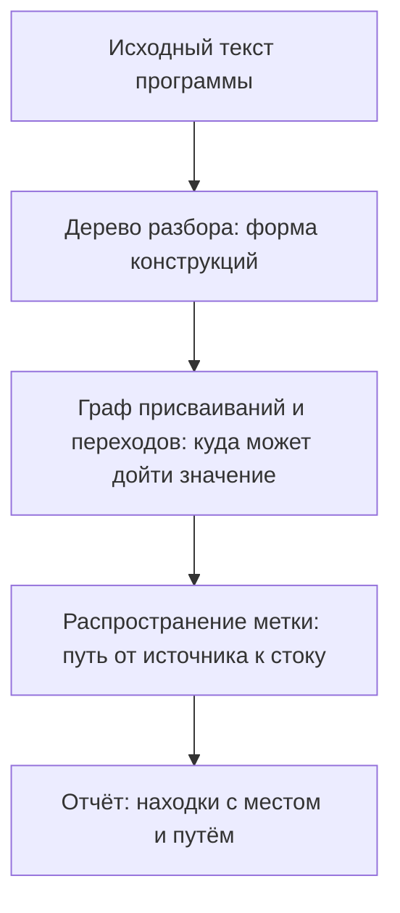
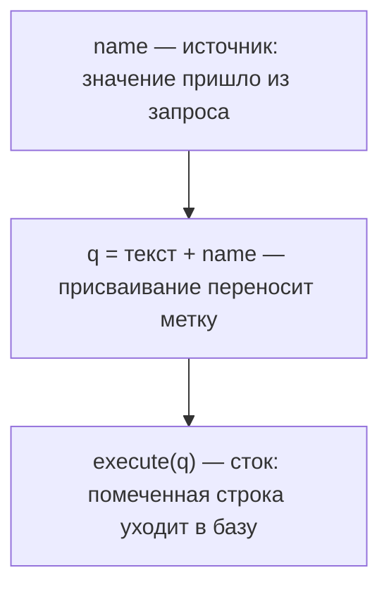

# Как работает SAST: AST, поток данных, taint

Опасный вызов в чужом коде первым побуждением ищут поиском по тексту: взяли
имя функции — и `grep` по репозиторию. Итог знаком каждому, кто так делал:
ворох совпадений, где половина не то. Вот замер на учебном стенде. Один и тот
же дефект записан пятью способами: в одну строку, в четыре, с лишними
пробелами, через промежуточную переменную и с другим именем переменной. Рядом
лежит чистая функция похожей формы:

```text
поиск по тексту 'SELECT * FROM t WHERE'      6 совпадений из 6 мест
поиск по тексту 'execute\(.*\+'              3 совпадения из 5 дефектов
шаблон по дереву $C.execute("..." + $X + "...")   4 из 5 дефектов
распространение метки (mode: taint)          5 из 5
```

Поиск по тексту нашёл все шесть мест: пять дефектов и чистую функцию
впридачу, потому что текст запроса в них одинаковый. Две нижние строки дал
уже статический анализ. Третья строка записана шаблоном на языке правил
Semgrep: записи `$C` и `$X` — метапеременные, они совпадают с любым
выражением, а многоточие — с любым числом пропущенных элементов. Разница в
предмете сравнения: анализ смотрит на форму конструкции и на путь значения,
а символы строки его не интересуют.

Этот способ и называется SAST. Что из вашего кода такой метод найдёт, что
пропустит — и почему оба ответа видны из его устройства раньше первого
прогона?

## Что такое SAST

SAST — это статический анализ исходного кода, static application security
testing. Слово «статический» означает, что программа не запускается:
анализатор читает её текст, как редактор читает рукопись. Уже работающее
приложение проверяет другой метод — DAST (Dynamic Application Security Testing),
динамическую проверку: сканер шлёт запросы приложению снаружи и судит по
ответам. Такой прогон разбирает тема `zap-scanning`, а границы метода —
тема `dast-limits`.

Бытовой пример — приёмка квартиры. Можно изучить чертежи и смету, не заходя
внутрь: это статический взгляд. Чертёж здесь соответствует исходному коду, а
осмотр на месте — запуску программы. По чертежу видно все комнаты, включая
те, куда жильцы не заходят никогда. Ломается аналогия на действии: по чертежу
не узнать, течёт ли кран на самом деле.

Что именно ищет анализатор в тексте. Место, где в программу входят чужие
данные, называется источником: например, параметр веб-запроса. Место, где эти
данные что-то делают, называется стоком: например, вызов, который отправляет
строку в базу. Место, где значение делают безопасным, называется
санитайзером. А сам приём — распространением метки, или taint: источник
помечается, и анализатор следит, куда метка доходит.

Метку можно представить как мел на руках. Источник — это момент, когда
руки испачкались. Сток — чистая доска, куда мел попасть не должен.
Санитайзер — мытьё рук между первым и вторым. Ломается аналогия на том, что
анализатор ничего не трогает: он не ходит по коду, а рассуждает о путях, по
которым мел мог бы дойти.

Инструменты этапа — `semgrep-rules`, `bandit`, `gosec`, `codeql` — стоят на
этом устройстве и добавляют к нему свой язык правил и свой набор проверок.

**Зачем это в работе AppSec-инженера.** Отчёт сканера приходит к инженеру, а
не к разработчику, и первое действие с ним — решить, что из напечатанного
правда. Без модели того, что инструмент вообще способен увидеть, это решение
принимается перебором: открыть каждую находку и подумать. С моделью половина
отчёта закрывается по признаку, потому что правило такого класса на такой
конструкции ошибается всегда. Та же модель отвечает на вопрос разработчика
«почему это не нашли раньше»: пропуск обычно назван в документации самого
движка.

## Подумай, прежде чем читать

1. Один и тот же дефект записан пятью способами. В одну строку, в четыре
   строки, с лишними пробелами, через промежуточную переменную и с другим
   именем этой переменной. Сколько из пяти найдёт поиск по тексту?
2. Сканер разбирает файл целиком, включая ветки, куда тесты не заходят. Почему
   при этом он не может ответить, достижима ли найденная строка?
3. Функция принимает строку и подставляет её в запрос. Что должен знать
   анализатор, чтобы отличить дефект от чистого кода, — и есть ли это знание
   в самом файле?

## Как это работает

**Откуда это взялось.** Первые проверялки кода искали опасные вызовы поиском
по тексту: список функций и регулярное выражение к нему. Ломалось это на
записи. Перенос вызова на другую строку, лишний пробел, промежуточная
переменная — и совпадения нет, хотя код тот же. Обратная беда была той же
природы: имя `execute` встречается и там, где никакого запроса нет.

В ответ разбор перенесли с текста на дерево, а поиск — с совпадения строк на
форму дерева. Следующим шагом к дереву добавили граф переходов и правило
распространения меток. Вопрос сменился: не «есть ли такой вызов», а «доходят
ли до него чужие данные». Формальные требования к такому инструменту NIST
собрал в отдельной спецификации, и там же названы обе его ошибки — ложное
срабатывание и пропуск [^1].

Прогон сканера идёт в три слоя, и каждый следующий отвечает на вопрос,
который предыдущий задать не может:



**Описание схемы.** Схема читается сверху вниз и показывает конвейер одного
прогона. Текст разбирается в дерево, из дерева строится граф, по графу ищется
путь метки, и найденные пути печатаются в отчёт. Ниже каждый слой разобран на
замере из вступления.

### Слой первый: текст в дерево

Первый шаг называется разбором. Строку исходника он превращает в дерево, где
у каждого узла есть тип: вызов, операция сложения, имя, строковый литерал.
Такое дерево называют AST, деревом абстрактного синтаксиса. «Абстрактного» —
потому что из него выброшено всё внешнее: пробелы, переносы, расстановка
скобок.

Бытовой пример — школьный разбор предложения. «Мама мыла раму» раскладывается
на подлежащее, сказуемое и дополнение, и схема не меняется от почерка, полей
и цвета ручки. Почерк здесь — это форматирование кода, а схема предложения —
дерево.

Одна строка стенда — не заглядывая в дерево, найдите в ней место, где чужие
данные попадают в запрос:

```python
conn.execute("SELECT * FROM t WHERE n = '" + name + "'")
```

А это чистая функция того же стенда: текст запроса тот же, но значение едет
в базу отдельным параметром, как в теме `parameterized-queries`:

```python
conn.execute("SELECT * FROM t WHERE n = ?", (name,))
```

Разобранная стандартным разборщиком Python, уязвимая строка выглядит так:

```text
Expr(value=Call(
  func=Attribute(value=Name(id='conn'), attr='execute'),
  args=[BinOp(
    left=BinOp(left=Constant(value="SELECT * FROM t WHERE n = '"),
               op=Add(), right=Name(id='name')),
    op=Add(), right=Constant(value="'"))]))
```

В дереве нет ни пробелов, ни переносов строк, ни имени переменной как части
формы. Имя `name` стоит в узле `Name`, и замена его на `user_name` меняет
значение узла, а не структуру. Поэтому правило, написанное по дереву,
переживает любую переформатировку кода.

Замер на стенде из пяти записей одного дефекта и одной чистой функции:

```text
поиск по тексту 'SELECT * FROM t WHERE'      6 совпадений из 6 мест
поиск по тексту 'execute\(.*\+'              3 совпадения из 5 дефектов
шаблон по дереву $C.execute("..." + $X + "...")   4 из 5 дефектов
```

Первая строка находит и пять дефектов, и чистую функцию с параметром: текст
запроса в них одинаковый. Вторая пропускает запись в четыре строки и запись
через промежуточную переменную. Шаблон по дереву берёт и многострочную
запись, и лишние пробелы, и другое имя переменной. Пятую запись он не берёт,
потому что там конкатенация стоит в присваивании, а вызов получает уже
готовую строку.

### Слой второй: граф и распространение метки

Пятую запись закрывает следующий слой. По дереву анализатор строит граф:
какие присваивания к каким переменным относятся и в каком порядке
выполняются. Это уже не форма текста, а карта движения значений. По этой
карте распространяется метка: правило называет источники и стоки, а движок
ищет путь между ними.



**Описание схемы.** Схема показывает пятую запись стенда, которую шаблон по
дереву не взял. Метка появляется на параметре `name`, переходит через
присваивание в переменную `q` и доходит до вызова. Шаблон смотрел на один
вызов и не видел этого пути, а граф присваиваний видит.

Тот же стенд, то же правило, но записанное через распространение метки от
конкатенации к вызову:

```text
шаблон по дереву                             4 из 5
распространение метки (mode: taint)          5 из 5
```

Пятая запись найдена, потому что путь от конкатенации до вызова проходит
через присваивание, а граф присваивания видит. Ложных срабатываний на чистой
функции не добавилось: там конкатенации нет вовсе.

Разница трёх способов на одном стенде читается целиком. Поиск по тексту
сравнивает символы, шаблон по дереву — форму конструкции, распространение
метки — путь значения. Куда упрётся и третий способ — вопрос следующего
слоя: что будет, если присваивание стоит в одной функции, а вызов в другой?

### Слой третий: чего граф не знает

Граф отвечает, куда значение может дойти. Он не отвечает, дойдёт ли оно туда
на самом деле. Разница видна на четырёх функциях с одной и той же строкой
внутри. Обстоятельства разные: проверка, которая бросает исключение;
присваивание константы; оператор `return` выше по тексту; и ничего из
перечисленного.

```text
def guarded(conn, name):        # проверка isdigit бросает раньше
def constant(conn):             # name = "1", значение известно
def unreachable(conn, name):    # строка стоит после return
def open_path(conn, name):      # ничего не мешает
```

Прогон `p/default`, набора правил по умолчанию из реестра Semgrep, даёт
четыре находки из четырёх мест, а настоящий дефект здесь один — последний.
Три остальных — шум, и природа у
него одна: правило смотрит на форму выражения, а не на условия, при которых
до него доходит исполнение. Это свойство называется нечувствительностью к
пути: условия ветвлений анализатор не разбирает и ветки объединяет.

Такая же граница есть у распространения метки, и она названа в документации
самого движка [^2]. Пропагаторы — это правила, объявляющие, какие
присваивания переносят метку дальше, — и они работают внутри одной
процедуры, а межпроцедурный анализ остаётся платной надстройкой.
Межпроцедурный — значит переходящий границу функции: источник в одном
месте, сток в другом файле. Прогон это подтверждает. Один и тот же дефект —
параметр запроса доходит до `execute` — записан двумя способами: в одной
функции и разложенный по трём файлам через промежуточный модуль.

```text
источник и сток в одной функции      1 находка
те же строки, разнесённые по файлам  0 находок
```

Ноль во второй строке — не ошибка настройки. Это объявленная граница движка,
и знать её нужно до прогона, а не после.

### Чем анализ платит за ответ

У анализатора есть выбор из двух ошибок, и обе он допустить не хочет.
Промолчать там, где дефект есть, называется пропуском. Заговорить там, где
дефекта нет, называется ложным срабатыванием. Убрать сразу обе ошибки
нельзя. Точного ответа на вопрос «дойдёт ли сюда исполнение» не существует:
для произвольной программы он равносилен вопросу, остановится ли она. Это доказанный предел вычислимости, а не слабость конкретного движка.
Поэтому любой работающий анализатор отвечает приближённо, и приближение — то,
чем движки отличаются друг от друга.

Приближение выбирается по четырём осям, и каждая стоит времени прогона.
Чувствительность к потоку — учитывает ли анализ порядок присваиваний или
считает переменную одним значением на всю функцию. Чувствительность к пути —
разбирает ли он условия ветвлений или объединяет ветки. Чувствительность к
контексту — различает ли он вызовы одной и той же функции из разных мест.
Межпроцедурность — переходит ли он границу функции и границу файла.

Отказ по любой из осей даёт свой класс ошибок, и класс этот предсказуем.
Нечувствительность к пути даёт шум на защищённом коде: находка на функции с
проверкой `isdigit` из блока выше — ровно этот случай. Отказ от
межпроцедурности даёт пропуск на разнесённом коде: ноль находок на дефекте,
разложенном по трём файлам, — тоже он. То есть по объявленному устройству
движка список его ошибок пишется заранее, до первого прогона.

Ось выбирается не вкусом, а ценой. Каждая пройденная граница функции умножает
число путей, которые надо рассмотреть. Документация Semgrep прямо называет
цену межфайлового анализа: не меньше четырёх гигабайт памяти на ядро,
рекомендуется восемь [^2]. Бесплатная сборка отказывается от этой оси и
объявляет отказ, а не прячет его.

## Что умеет и чего не умеет

**Что находит.** Всё, что выражается как форма выражения или как путь от
источника к стоку в пределах видимости анализа. Практически это четыре
семейства. Первое — сборка команды или запроса из частей, темы `sqli-basics`
и `os-command-injection`. Второе — путь к файлу из внешних данных, тема
`path-traversal`. Третье — вызов примитива из списка запрещённых. Четвёртое —
отсутствие обязательного аргумента у известного вызова. Основание у метода
одно и сильное: виден весь текст программы, включая ветки, куда никакой тест
не заходит и куда снаружи не достучаться.

**Чего не находит по устройству.** Первое — то, чего в тексте нет. Права на
каталог развёрнутого сервиса, переменная окружения на боевом стенде, версия
библиотеки, подставленная сборкой, — этого в исходнике не написано. Второе —
смысл предметной области. Что цена в заказе не должна быть отрицательной,
известно из требований, а не из кода, поэтому дефекты вида
`business-logic-flaws` метод не видит в принципе. Третье — всё, что
собирается во время выполнения: имя функции, склеенное из строки, запрос,
прочитанный из базы, код, пришедший из конфигурации. Четвёртое — то, что
лежит за объявленной границей анализа: другая функция, другой файл, другой
язык в том же репозитории.

Разница между третьим-четвёртым и первыми двумя важна. Первые два не
закрываются никаким инструментом того же класса: там нет предмета для анализа
текста. Четвёртое закрывается движком помощнее и деньгами, и об этом написано
в документации самого движка. Третье не закрывается ничем: имя функции,
собранное из строки во время выполнения, в тексте не написано.

Отсюда практическое следствие для разговора с разработчиком. «Сканер этого не
нашёл» — не обвинение инструменту, пока не назван класс пропуска. Пропуск по
второй причине означает, что искать надо было ревью и требованиями. Пропуск
по четвёртой означает, что искать надо было тем же инструментом, но с другой
настройкой или другой сборкой. Ответы на вопрос «что делать дальше» у этих
двух случаев противоположные.

## Как запустить

Прогон нужен на своём коде, а не на демонстрационном. Здесь взяты два объекта
проверки: сборка на Python из шести файлов и сборка на Go из шести файлов. В
каждой подставлены дефекты, и рядом с ними лежит чистый код похожей формы.

Первый инструмент — Semgrep, движок, который сравнивает код с набором правил.
Набор правил — это готовая колода шаблонов под конкретные классы дефектов, а
реестр — каталог таких наборов у поставщика. Набор `p/default` берётся из
реестра по имени:

```bash
# Semgrep 1.174.0, набор правил p/default из реестра проекта.
semgrep --config=p/default --metrics=off --jobs 1 shop/
```

Ключ `--metrics=off` выключает отправку статистики прогона наружу.
`--jobs 1` снимает разброс между прогонами и на таком объёме ничего не стоит.
Один ключ придётся добавить почти всегда:

```bash
# Semgrep обходит файлы, не попавшие в git; стенд лежит вне индекса.
semgrep --config=p/default --metrics=off --no-git-ignore shop/
```

Без него прогон печатает «Scanning 0 files tracked by git» и заканчивается с
нулём находок и нулевым кодом возврата. Отличить такой прогон от честного
чистого можно по строке `Targets scanned`, и её стоит читать всегда.

Перед прогоном стоит договориться с собой о трёх вещах, иначе результат не с
чем сравнивать. Первая — что считается объектом проверки: каталог, ветка,
состояние рабочего дерева. Вторая — какой набор правил берётся и откуда он
приходит: из реестра поставщика или из файла в репозитории. Третья — где
сохраняется вывод целиком, а не его последние строки на экране. Прогон,
который не записан, повторить нельзя, а отчёт сканера живёт ровно до
следующей правки кода.

Второй объект — Go, второй инструмент — gosec, сканер из экосистемы Go:

```bash
# gosec 2.28.0, Go 1.27.0; анализатору нужен рабочий тулчейн.
gosec ./...
```

## Как читать вывод

Находка отвечает на четыре вопроса: какое правило сработало, где, насколько
серьёзно и насколько инструмент в этом уверен. Вот настоящий фрагмент отчёта
gosec на сборке Go:

```text
[svc/db.go:13] - G701 (CWE-89): SQL injection via taint analysis
   (Confidence: HIGH, Severity: HIGH)
    12: q := fmt.Sprintf("SELECT id FROM orders WHERE id = %s", orderID)
  > 13: return db.Query(q)
```

`G701` — идентификатор правила, по нему находка ищется в документации и
подавляется в конфигурации. `CWE-89` — класс дефекта в общем каталоге CWE,
где каждой разновидности слабости присвоен номер: этот номер — общий язык с
разработчиком и с трекером. Стрелка стоит на стоке, строка выше — на
источнике значения, и путь между ними — то, что нашёл анализ. `Severity` —
оценка последствий, заданная автором правила заранее, а не измеренная на этом
коде. `Confidence` — оценка того, насколько правило уверено в самой находке.

Эти две оценки читаются по-разному, и путать их дорого. Прогон bandit,
питоновского сканера того же класса, печатает на настоящем дефекте низкую
уверенность, а на чистой функции строкой ниже — среднюю (поле `Conf` в
отчёте сокращено):

```text
B608 hardcoded_sql_expressions  db.py:13  Severity: Medium  Conf: Low
B608 hardcoded_sql_expressions  db.py:28  Severity: Medium  Conf: Medium
```

Строка 13 — подставленный дефект: значение приходит из параметра запроса.
Строка 28 — чистый код: имя таблицы берётся из замкнутого множества и до
запроса проверяется. Сортировка отчёта по уверенности поставила бы шум выше
дефекта. Уверенность здесь — свойство правила и формы кода, а не вероятность
того, что находка настоящая.

Третье поле, которое читается неверно чаще прочих, — путь к файлу. В отчёте
он относительный, и относительный к тому каталогу, из которого запущен
прогон. Один и тот же дефект получает разные адреса в отчёте из корня
репозитория и в отчёте из подкаталога. Сравнение двух прогонов ломается на
этом раньше, чем на содержании. Приводить пути к одному корню стоит до
сравнения, а не после.

Что делать дальше, зависит от класса. Починка не разбирается на этой
странице. Для запроса, собранного склейкой, она в теме `sqli-basics`. Для
команды операционной системы — в `os-command-injection`. Для пути к файлу — в
`path-traversal`. Задача чтения отчёта другая: отделить настоящие находки от
шума и назвать каждой её класс.

## Границы метода

**Граница первая: нет работающего приложения.** Метод не видит ни одного
свойства, которое возникает при развёртывании. Настройки веб-сервера, права
на файлы, состав переменных окружения, поведение балансировщика — всё это вне
текста программы. Закрывается это проверкой работающего приложения снаружи, и
границы уже того метода разобраны в теме `dast-limits`.

**Граница вторая: шум растёт быстрее пользы.** На шести файлах стенда набор
`p/default` дал шесть записей на четырёх местах; ложные из них — две записи,
и обе стоят на одном чистом месте. На собственном инструментарии этого
проекта тот же набор дал две находки, и ложными оказались обе. Объём — 56
файлов всех языков, из них семнадцать на Python. Первая находка — свёртка
содержимого схемы на SHA-1 в кэше картинок. Вторая — открытие адреса из
документа в самой проверялке ссылок. Полезных находок ноль, разбирать
пришлось обе.

**Граница третья: язык и сборка.** Анализатор разбирает то, что умеет
разобрать. Файл на языке, для которого правил нет, в множество целей не
попадает, и в отчёте это видно только числом просмотренных файлов. Отдельная
разновидность того же — код, которого нет в репозитории до сборки:
сгенерированные клиенты, шаблоны, подставленные конфигурацией значения.
Проверить эту границу дешевле всего сравнением: сколько файлов в дереве и
сколько инструмент назвал просмотренными.

**Цена прогона.** Шесть файлов стенда — 2,4 секунды, 56 файлов
инструментария — 3,9 секунды на одном ядре, оценка по одному прогону.
Заметной цена становится не на времени, а на разборе. Минута работы инженера
на каждую находку при сотне находок в неделю — это уже отдельная роль. Способ
её сократить разбирает тема `triage-false-positives`.

## Частая ошибка

Ходовая рамка: доля ложных срабатываний — свойство инструмента, и выбирать
сканер надо по ней. В таком виде вопрос звучит как «какой из них меньше
врёт».

Сначала прогноз, потом замер: если рамка верна, четыре набора правил одного
поставщика на одном файле дадут близкую долю шума — верно?

**Доли ложных срабатываний у инструмента нет: она задаётся набором правил и
кодом, к которому его приложили.** Один и тот же файл, один и тот же движок,
четыре набора правил из реестра того же поставщика:

```text
p/python          2 находки   1 ложная, оба дефекта SQL пропущены
p/default         6 находок   2 ложные, оба дефекта SQL найдены
p/security-audit  1 находка   ложных нет, оба дефекта SQL пропущены
p/owasp-top-ten   2 находки   1 ложная, оба дефекта SQL пропущены
```

Разброс от одной находки до шести на девяноста шести строках. Ни одно из
четырёх чисел не характеризует движок: это характеристика набора правил,
приложенного к этому конкретному коду.

Из этого следует и способ выбирать. Сравнивать наборы правил имеет смысл на
своём коде и с заранее размеченным ответом: сколько подставленных дефектов
найдено и сколько чистых мест названо дефектами. Число, полученное на чужом
наборе примеров, о своём репозитории не говорит ничего.

Контрпример к обратному выводу: набор с наименьшим шумом здесь же и самый
бесполезный. `p/security-audit` не дал ни одного ложного срабатывания и
пропустил два подставленных дефекта SQL из трёх подставленных дефектов.
Выбор по доле шума привёл бы к нему.

## Чеклист для ревью

1. Проверьте, что в отчёте прочитано число просмотренных файлов, а не только
   число находок: прогон по пустому множеству печатает ноль находок.
2. Проверьте, что для каждой находки названы источник и сток, а не только
   строка со срабатыванием.
3. Проверьте, что уверенность правила не читается как вероятность того, что
   находка настоящая.
4. Проверьте, что набор правил назван в отчёте вместе с версией инструмента.
5. Проверьте, что известные границы движка — межпроцедурный анализ, другой
   язык, сборочные артефакты — названы до того, как чистый отчёт объявлен
   успехом.
6. Проверьте, что ложные срабатывания разобраны с указанием признака, по
   которому код признан чистым, а не закрыты одним словом.
7. Проверьте, что число просмотренных файлов сопоставлено с числом файлов в
   дереве: разрыв означает язык без правил или пропущенный каталог.
8. Проверьте, что вывод прогона сохранён целиком, а не пересказан по памяти:
   сравнить два прогона можно только по сохранённым отчётам.

## Попробуй сам

`lab-sast-principles`, каталог `pilot/lab/sast-principles`. Формат
«найди-дефект». Две сборки — на Python и на Go — с подставленными дефектами и
чистым кодом похожей формы. Отчёты двух инструментов лежат сохранёнными,
третий прогоняется своими руками по локальному файлу правил. Ответы сверяются
с разметкой, которая открывается после своей попытки.

**Цель одной фразой:** заполнить таблицу «находка — истинная или ложная —
признак» по всем находкам обоих прогонов. Проверялка лабы должна показать
совпадение с разметкой не ниже, чем на четырнадцати строках из пятнадцати.

Одна подсказка: два инструмента расходятся ровно на одном месте, и расходятся
они не случайно — один смотрит на форму выражения, другой на путь значения.

**Отдельная задача «почини».** Сделать так, чтобы прогон на питоновой сборке
перестал печатать ложное срабатывание на свёртке ключа кэша, не подавляя
правило целиком и не трогая настоящие находки. Решение — в `solution.md`,
открывается после своей попытки.

## Проверь себя

1. Один и тот же дефект записан пятью способами: в одну строку, в четыре, с
   лишними пробелами, через промежуточную переменную и с другим именем
   переменной. Сколько из пяти найдёт поиск по тексту запроса — и почему
   вместе с пятью дефектами найдётся и чистая функция?
2. Сканер разбирает файл целиком, включая ветки, куда тесты не заходят. Почему
   при этом он не может ответить, достижима ли найденная строка?
3. Сработает ли на этой функции правило распространения метки «от параметра
   функции до `execute`» — и будет ли такая находка истинной?

   ```python
   def rename(conn, table):
       if table not in ("orders", "users"):
           raise ValueError(table)
       conn.execute("ALTER TABLE " + table + " RENAME TO t")
   ```

4. Предскажите, что напечатает прогон правила `$C.execute("..." + $X, ...)` по
   этому файлу: сколько находок и на каких строках.

   ```python
   def find_user(conn, uid):
       q = "SELECT * FROM users WHERE id = " + str(uid)
       return conn.execute(q)

   def count_users(conn):
       return conn.execute("SELECT count(*) FROM users")

   def add_user(conn, name):
       return conn.execute("DELETE FROM users WHERE name = " + name)
   ```

5. Четыре набора правил одного движка прогнали по одному файлу: находок от
   одной до шести, доля шума от нуля до трети. Что из этого следует?

   A. Движок врёт в трети случаев, и движок с такой долей надо менять.

   B. Долю задают набор правил и код, поэтому наборы сравнивают на своём коде
      с заранее размеченным ответом.

   C. Надо взять набор с нулём ложных срабатываний: он меньше всего отвлекает
      разработчиков.

6. Возврат к теме `sqli-basics`: почему анализатору не нужно знать содержимое
   переменной, чтобы признать запрос на параметрах чистым?

<details markdown="1">
<summary>Ответ 1</summary>

1. Все пять, и чистая функция впридачу. Поиск по тексту сравнивает символы, а
   строка запроса у дефекта и у чистого кода одинаковая. Разница между ними —
   в способе собрать аргумент вызова, а его в символах строки нет. На стенде
   темы вышло именно так: шесть совпадений из шести мест.

</details>

<details markdown="1">
<summary>Ответ 2</summary>

2. Потому что точный ответ на вопрос «дойдёт ли сюда исполнение» неразрешим в
   общем случае — это задача об остановке. Анализатор отвечает приближённо:
   видит форму выражения и не видит условий, при которых исполнение до него
   доходит. Поэтому находка печатается и на строке после `return`, и под
   проверкой, которая бросает исключение раньше запроса.

</details>

<details markdown="1">
<summary>Ответ 3</summary>

3. Сработает: параметр `table` — источник, вызов — сток, путь лежит в одной
   функции. Находка ложная по существу: имя сверено с замкнутым множеством до
   вызова. Метку это не снимает: её снимает присваивание или объявленный
   санитайзер, а сравнение значение не меняет. Отличить здесь дефект от
   чистого кода может только знание о смысле проверки, а его в тексте для
   движка нет.

</details>

<details markdown="1">
<summary>Ответ 4</summary>

4. Одна находка, на строке 9, — `DELETE` в `add_user`. Дефект в `find_user`
   пропущен: конкатенация стоит в присваивании, а образец описывает аргумент
   вызова. Чистая функция молчит: аргумент — один литерал. Ответ получен
   прогоном: `semgrep --config rule.yaml --metrics=off frag.py`, Semgrep
   1.174.0, на выходе `Findings: 1`. Закрыть такой пропуск — работа режима
   метки из темы `semgrep-rules`.

</details>

<details markdown="1">
<summary>Ответ 5: разбор вариантов</summary>

5. Верный ответ — B.

   A. Одна и та же доля на одном файле не сказала бы про движок ничего. Это
      характеристика пары «набор правил + код», и у одного движка она здесь
      от нуля до трети.

   B. На чужих примерах число о своём репозитории не говорит ничего. Замер
      делается на своём коде с разметкой: сколько подставленных дефектов
      найдено и сколько чистых мест названо дефектами.

   C. Набор без единого ложного срабатывания на стенде темы пропустил оба
      подставленных дефекта SQL: тишина куплена пропусками. Выбор по доле
      шума привёл бы именно к нему.

</details>

<details markdown="1">
<summary>Ответ 6</summary>

6. Потому что при параметрах команда и данные едут в базу разными путями.
   Текст запроса — литерал, значение — отдельным аргументом, и склеиться в
   одну команду они не могут. Анализатору хватает формы вызова: он видит, что
   значение передано отдельно, и содержимое переменной ему не нужно.

</details>

## Источники

1. NIST, «Source Code Security Analysis Tool Functional Specification»,
   SP 500-268 версии 1.1; реестр `nist-sp-500-268`. Разделы: определения
   ложного срабатывания и пропуска, требования к инструменту статического
   анализа исходного кода.
   <https://www.nist.gov/publications/source-code-security-analysis-tool-functional-specification-version-11>
2. Semgrep, «Taint analysis overview»; реестр `semgrep-taint`. Разделы:
   `pattern-sources`, `pattern-sinks`, `pattern-sanitizers`,
   `pattern-propagators`; замечание о том, что пропагаторы работают
   внутрипроцедурно, а межпроцедурный анализ выполняется платными сборками.
   <https://docs.semgrep.dev/writing-rules/data-flow/taint-mode/overview>
3. Semgrep, «Rule pattern syntax»; реестр `semgrep-pattern-syntax`. Разделы:
   метапеременные, многоточие как обозначение пропущенных элементов,
   независимость шаблона от форматирования.
   <https://docs.semgrep.dev/writing-rules/pattern-syntax>
4. gosec, репозиторий проекта; реестр `gosec-repo`. Разделы: список правил и
   их идентификаторы, формат отчёта, поля уверенности и серьёзности.
   <https://github.com/securego/gosec>

Каркас этапа: `cwe-taxonomy`. Наследуется всеми темами и отдельной строкой не
повторяется.

**Скоропортящийся слой.** Версии инструментов, имена наборов правил в реестре
Semgrep, идентификаторы правил gosec и состав ключей командной строки.
Устройство метода — дерево, граф, распространение метки — и обе его ошибки
стабильны.

**Маркеры уверенности.** Числа находок по четырём наборам правил, расхождение
поиска по тексту, шаблона по дереву и распространения метки, четыре
срабатывания на четырёх путях, ноль находок на дефекте, разложенном по
файлам, и две ложные находки на инструментарии этого проекта — **проверено
лично** 2026-08-25 на Semgrep 1.174.0, bandit 1.9.4, gosec 2.28.0, Go 1.27.0,
Python 3.14.7. Время прогона 2,4 и 3,9 секунды — **оценка по одному прогону**
на одном ядре. Границы межпроцедурного анализа и состав операторов режима
метки — **по документации** Semgrep, открытой лично 2026-08-25. Определения
ложного срабатывания и пропуска — **по документации** NIST SP 500-268 v1.1.
Поведение платных сборок движка **не воспроизводилось**: лицензии нет.

[^1]: NIST SP 500-268 v1.1, реестр `nist-sp-500-268`.
[^2]: Semgrep, «Taint analysis overview», реестр `semgrep-taint`.
