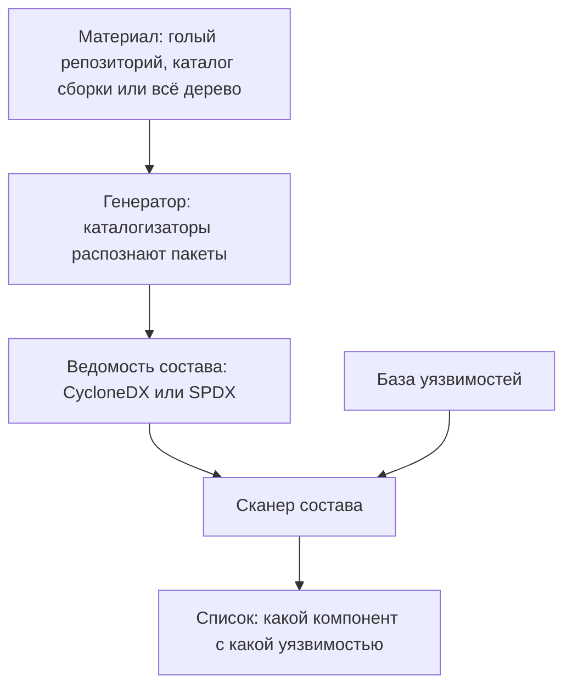

# SBOM: CycloneDX, SPDX и что с ними делать

Один и тот же инструмент, два прогона. Первый — по учебному стенду из двух
файлов зависимостей:

```text
объект: стенд exp/app (requirements.txt + pom.xml)
CycloneDX: 9 компонентов (6 pypi + 3 maven)
SPDX:      те же 9 компонентов, другая схема полей
```

Второй прогон снят по репозиторию этого гайдбука, и он насчитал 3330
компонентов. Почти все они — исполняемые файлы самих сканеров из служебных
каталогов; зависимостей продукта там доли процента. Ведомость честно
перечислила всё, что нашла в дереве, включая то, чего в продукте нет.

Файлы из этих прогонов называются SBOM, ведомостью состава ПО: это
машиночитаемый список пакетов, из которых собран продукт, с версиями и
происхождением каждого. Главное в теме — не формат, а доверие: форматов два,
оба названы в первом прогоне, а ценна ведомость ровно настолько, насколько
верна. Сформулируйте ответ заранее: ведомость вашего продукта насчитала
четыре тысячи компонентов при трёх прямых зависимостях — это полнота или шум,
и как вы это проверите?

## Что такое SBOM

SBOM расшифровывается как software bill of materials: дословно это «ведомость
материалов», а по-русски закрепилось «ведомость состава». Сама идея
заимствована из производства. У собранного изделия,
например у велосипеда, есть спецификация — список всех деталей, из которых оно
собрано. По ней завод отвечает на вопрос «у каких велосипедов стоит
бракованная партия рам», не разбирая ни одного. Соответствие прямое: изделие —
это программный продукт, деталь — пакет, спецификация — ведомость.

Ломается аналогия на происхождении документа. Спецификацию изделия составляет
конструктор по чертежам, и она верна по построению. Ведомость же обычно
снимает инструмент с уже собранного дерева файлов, и её верность приходится
проверять отдельно. Значительная часть этой темы — как раз о такой проверке.

Форматов два, и держат они почти весь рынок. **CycloneDX** вырос внутри OWASP
и заточен под безопасность: состав, зависимости, происхождение и отдельный
раздел под известные уязвимости. **SPDX** старше, вырос из задач
лицензирования и стандартизирован как ISO: он подробнее в правах на компоненты
и в метаданных. Оба описывают одно и то же — компоненты и связи между ними, —
но разными именами полей: версия пакета в CycloneDX называется `version`, а в
SPDX — `versionInfo`.

У каждого компонента в хорошей ведомости есть координаты — `purl`, package
URL. Это одна строка, где записаны экосистема, имя и версия:
`pkg:pypi/flask@0.12.2` читается как «пакет flask версии 0.12.2 из экосистемы
PyPI». Бытовой пример — артикул товара: по нему магазин и склад называют одну
вещь одинаково, хотя на ценнике она подписана по-другому.

Ломается аналогия на единстве. Артикул у каждого магазина свой, а `purl` один
на всю экосистему: его задаёт не продавец пакета, а соглашение. Поэтому одну и
ту же строку читает любой инструмент. Именно `purl` делает ведомость полезной
сканеру: по координатам компонент сопоставляется с базой уязвимостей; как
устроены записи такой базы, разбирает `cve-cvss`. Запись без координат сканеру
ничего не даёт: её не с чем сверить.

**Зачем это в работе AppSec-инженера.** Требование «сдать SBOM» приходит
извне: после громких инцидентов в цепочке поставок, разобранных в
`supply-chain-threats`, ведомость попала в регуляторные запросы, и инженера
просят её сдать. Отдать файл — минутное дело. Отвечать приходится за то, что в
нём правда написано, из чего собран продукт, — а это зависит от того, чем и на
каком материале ведомость сгенерирована.

## Как это работает

**Откуда это взялось.** Состав продукта раньше держался в головах
разработчиков и в файлах зависимостей, разбросанных по репозиторию. Ломалось
это на вопросе «а где у нас уязвимый пакет»: после инцидентов в цепочке
поставок ответ «сию минуту поищем» перестал устраивать. Ведомость превращает
состав в один машиночитаемый документ, который можно сдать заказчику, сверить
с ожиданием и просканировать на уязвимости.

Ведомость не пишут руками — её снимает генератор. В прогонах этой темы
работал syft 1.51.0, свободный генератор, и дальше речь о нём. Генератор
обходит проект и распознаёт пакеты двумя путями [^3]. Первый — манифесты:
файлы, где проект объявляет свои прямые зависимости, например
`requirements.txt` у Python или `pom.xml` у Java. Второй — установленные
метаданные: записи, которые менеджер пакетов оставляет рядом с реально
установленным пакетом.

Разница между путями — как между списком покупок и содержимым сумки: список
говорит, что собирались купить, сумка — что купили на самом деле. Ломается
аналогия на доверии: в чужую сумку могли подложить, а метаданные здесь
оставляет ваш же менеджер пакетов при установке. Поэтому второму пути верят
больше.

За каждую экосистему внутри генератора отвечает каталогизатор. Это часть,
которая знает, как выглядит пакет этой экосистемы: где лежит его манифест и
какие метаданные остаются после установки. Отсюда главное свойство и главное
ограничение генератора. Он видит то, что распознал каталогизатор, и не видит
того, для чего каталогизатора нет.

Материал, который генератор получает на вход, выбирает между этими путями.
Голый репозиторий ведёт по манифестам: установленного в нём ничего нет.
Каталог сборки ведёт по установленным метаданным: менеджер пакетов там уже
отработал. А всё дерево без исключений пускает генератор обоими путями по
всему, что нашлось, — отсюда три тысячи записей из вступления.



**Описание схемы.** Схема читается сверху вниз и показывает путь ведомости.
Генератор снимает состав с одного из трёх материалов, и выбор материала
решает, что в ведомость попадёт. Дальше ведомость идёт сканеру состава: он
сверяет каждый компонент с базой уязвимостей и возвращает список совпадений.
Сам генератор базу не открывает: его работа кончается на ведомости.

Сканеры состава — следующие темы маршрута: `dependency-track` принимает
ведомость на хранение и следит за ней, `trivy` умеет и снять ведомость, и
сверить её. А как из прямых зависимостей вырастает транзитивный граф,
разобрано в `transitive-dependencies`. Здесь важно одно: ведомость фиксирует
срез этого графа, и полнота среза зависит от того, на каком материале он снят.

## Что умеет и чего не умеет

**Что умеет ведомость.** Перечислить компоненты с версиями и, где формат
позволяет, с происхождением (координаты `purl`), связями между ними и
лицензиями. CycloneDX добавляет к этому раздел под уязвимости и оценки — он
изначально про безопасность [^1]. SPDX подробнее в лицензиях и метаданных
отношений [^2]. Оба формата машиночитаемы: ведомость сдаётся заказчику и
подаётся на вход сканеру состава.

**Чего ведомость не умеет.** Ручаться за собственную полноту. Проверено
прогоном: ведомость реального репозитория, снятая по всему каталогу, дала 3330
компонентов — и оказалась почти целиком про вложенные инструменты. Сотни
записей пришли из исполняемых файлов самих сканеров в служебных каталогах, а
настоящих зависимостей продукта там доли процента. Ведомость формально
«полная» и практически бесполезная: она честно перечислила всё, что нашла,
включая то, чего в продукте нет.

Второе, чего генератор не делает по устройству, — не разворачивает
транзитивные зависимости из манифеста. На стенде из одной строки `Flask`
0.12.2 прогон по манифесту показал ровно `Flask`, а пять его транзитивных
пакетов — нет. Причина в материале: в файле их нет, а окружение генератор не
собирал. Тот же проект, снятый по установленному окружению, дал бы их все.
Значит, ведомость по манифесту и ведомость по сборке — разные документы, и
путать их — значит заявлять состав, которого не проверял.

## Как запустить

Оба формата снимаются одним инструментом за один проход. Вот команда прогона
по стенду, syft 1.51.0:

```bash
# syft 1.51.0: один проход, два формата на выходе
syft dir:exp/app -o cyclonedx-json=sbom.cdx.json -o spdx-json=sbom.spdx.json
```

Команда читается по частям. Аргумент `dir:exp/app` — материал съёмки: каталог
`exp/app` со всем его содержимым. Каждый ключ `-o` задаёт один выходной файл и
его формат: `cyclonedx-json=sbom.cdx.json` пишет ведомость словами CycloneDX,
`spdx-json=sbom.spdx.json` — ту же ведомость словами SPDX. Проход по проекту
один, поэтому обе ведомости описывают один и тот же срез.

Вывод команды на чистом стенде:

```text
объект: стенд exp/app (requirements.txt + pom.xml)
CycloneDX: 9 компонентов (6 pypi + 3 maven)
SPDX:      те же 9 компонентов, другая схема полей
```

Стенд объявляет зависимости в двух манифестах, `requirements.txt` и
`pom.xml`. Каталогизатор экосистемы Python распознал шесть пакетов,
каталогизатор экосистемы Java — три. Обе ведомости получили один и тот же
состав, потому что сняты за один проход.

Главное решение при запуске — выбор объекта. Сканировать каталог сборки —
тогда виден установленный граф целиком, с транзитивными пакетами. Сканировать
голый репозиторий — тогда виден только объявленный состав. А сканировать всё
дерево без исключений — значит получить в ведомости служебные каталоги и
вендорные, то есть те, куда проект складывает чужой код целиком. Именно это
дало 3330 записей во втором прогоне из начала темы.

Последнее правило запуска: рядом с файлом фиксируются формат и версия схемы.
Формат виден из имени — `sbom.cdx.json` в команде выше. Версию схемы генератор
пишет внутрь файла: у CycloneDX это поле `specVersion`, у SPDX — `spdxVersion`.
Её стоит продублировать рядом с файлом, например в имени или в сообщении
коммита. Схемы меняются, и ведомость без версии через год не перечитать: поле
в новой схеме может называться иначе, и старый разборщик о нём не узнает.

## Как читать вывод

Вот один компонент из ведомости CycloneDX, сокращённо:

```json
{ "type": "library",
  "name": "flask", "version": "0.12.2",
  "purl": "pkg:pypi/flask@0.12.2" }
```

Поле `type` говорит, что перед нами: библиотека (`library`), приложение
(`application`) или файл (`file`). Поля `name` и `version` — имя и версия.
Поле `purl` — координаты из начала темы: по ним сканер состава сверит
компонент с базой уязвимостей.

Поля SPDX называются иначе: версия — `versionInfo`, а координаты лежат в
списке `externalRefs` под типом `purl`. Запись целиком вы прочитаете в первом
вопросе самопроверки: состав у неё тот же, а слова другие.

Важно и то, чего в записи может не быть. Компонент, распознанный только по
содержимому, — например, безымянный скрипт в дереве — координат не получает:
экосистемы у него нет, и `purl` составить не из чего. Такая запись для сканера
состава невидима: её не с чем сверить, и в списке уязвимых компонентов она не
появится никогда.

Читать ведомость надо с вопроса «на каком материале она снята»: число
компонентов само по себе ничего не говорит. Девять на чистом стенде — это
девять пакетов продукта. Три тысячи на репозитории с вложенными инструментами
— это шум. Полезность меряется не длиной списка, а тем, что каждая запись
отвечает за деталь продукта, а не за случайный файл в дереве. Полезная
ведомость может быть короче бесполезной.

## Границы метода

**Граница первая: полнота зависит от материала.** Ведомость по манифесту не
знает транзитивных пакетов, ведомость по всему дереву тащит лишнее.
Закрывается это не форматом, а дисциплиной генерации: снимать по каталогу
сборки и с исключениями, а результат сверять с ожидаемым числом компонентов.
Каталог сборки — место, где собран артефакт и развёрнуто всё окружение;
артефакт здесь — то, что реально уезжает пользователю: образ, пакет, архив.

**Граница вторая: экосистема без каталогизатора невидима.** Генератор
распознаёт пакеты только тех экосистем, для которых у него есть каталогизатор.
Верна и обратная сторона: распознанное не обязано относиться к продукту.
Исполняемые файлы сканеров из прогона на 3330 записей распознаны честно, но к
составу продукта отношения не имеют.

**Граница третья: ведомость называет состав, но не ищет уязвимости.** Поиск по
этому составу — отдельный шаг, и его делают сканеры состава: `trivy` и
`dependency-track` идут следующими темами маршрута. Ведомость — вход для них,
а не их замена: сдав её, вы узнали, из чего собран продукт, а не чем он болен.

**Цена.** Снять ведомость — секунды; убедиться, что она верна, — дольше,
потому что это означает сверку с тем, из чего продукт собран на самом деле.
Дешёвый шаг здесь — генерация; дорогой и обязательный — проверка.

## Частая ошибка

Само наличие файла убеждает: сгенерировали ведомость — значит, знаем состав
продукта. Так ли это? Прежде чем читать дальше, ответьте себе: что должно
быть у ведомости, чтобы ей можно было верить?

**Ведомость знает ровно то, что нашёл генератор.** Она не гарантирует ни
полноты, ни уместности. На реальном репозитории тот же прогон выдал 3330
компонентов, и подавляющая часть — чужие инструменты в служебных каталогах, а
не продукт. Файл есть, «состав» есть, а доверять ему нельзя. Неверная
ведомость здесь хуже своего отсутствия: на вопрос «из чего собрано» она
отвечает уверенно и неправильно, и ей верят на слово.

Контрпример к обратному выводу — «тогда SBOM бесполезен»: полезен, но как
проверяемый документ, а не как справка на слово. Ведомость, снятая по каталогу
сборки, с исключениями и сверенная по числу компонентов, отвечает на
вопрос «из чего собрано» точно. Разница между бесполезной и ценной ведомостью
— в том, проверили её или приняли на слово, а не в формате.

## Чеклист для ревью

Каждый пункт — вопрос к своей ведомости перед сдачей и к чужой при приёмке.

1. Проверьте, что ведомость снята по каталогу сборки, а не по случайному
   дереву каталогов.
2. Проверьте, что из генерации исключены служебные и вендорные каталоги.
3. Проверьте, что транзитивные зависимости в ведомости присутствуют, а не
   только прямые.
4. Проверьте, что у компонентов есть координаты `purl`: без них сканер
   состава компонент не сверит.
5. Проверьте, что число компонентов сопоставлено с ожидаемым, а не принято на
   веру.
6. Проверьте, что формат ведомости, CycloneDX или SPDX, и версия схемы
   записаны рядом с файлом.

## Попробуй сам

Сгенерируйте ведомость своего проекта в обоих форматах и сравните два
прогона: сначала по голому репозиторию, потом по каталогу сборки. Найдите в
первом хотя бы одну запись, которой не место в составе продукта, и хотя бы
одну зависимость, которую первый прогон пропустил, а второй показал.

Одна подсказка: разница между «по репозиторию» и «по сборке» — это ровно
транзитивный слой и служебные каталоги. И то и другое видно по числу и
составу компонентов.

**Критерий выполнения** наблюдаемый: две ведомости одного проекта различаются
числом компонентов. Вы можете назвать по имени хотя бы одну лишнюю и одну
недостающую запись и объяснить, откуда каждая взялась.

## Проверь себя

1. Прочитайте запись SPDX из чужой ведомости:

   ```json
   { "SPDXID": "SPDXRef-Package-werkzeug",
     "name": "werkzeug", "versionInfo": "3.1.9",
     "externalRefs": [{"referenceType": "purl",
                       "referenceLocator": "pkg:pypi/werkzeug@3.1.9"}] }
   ```

   Найдите в ней имя, версию и координаты пакета и скажите, зачем координаты
   сканеру состава.
2. Почему ведомость по манифесту не показывает транзитивные зависимости, а по
   сборке — показывает?
3. Ведомость сгенерирована и сдана заказчику. Знаем ли мы теперь состав
   продукта?

   A. Да: файл есть, генератор обошёл всё дерево.

   B. Только если она снята по каталогу сборки, с исключениями и сверена по
      числу компонентов.

   C. Нет: ведомость бесполезна, потому что неполна.

4. Не запуская, предскажите, что напечатает этот разбор ведомости.

   ```python
   sbom = {"components": [
       {"name": "flask", "purl": "pkg:pypi/flask@3.1.3"},
       {"name": "deploy.sh"},
       {"name": "werkzeug", "purl": "pkg:pypi/werkzeug@3.1.9"},
   ]}

   no_coords = [c["name"] for c in sbom["components"] if "purl" not in c]
   print(len(sbom["components"]), "компонента,",
         len(no_coords), "без координат:", no_coords)
   ```

5. Возврат к теме `transitive-dependencies`: почему полнота ведомости
   упирается в граф зависимостей, а не в формат?
6. Возврат к теме `app-architecture`: ведомость состава описывает одну часть
   карты приложения. Какую — и что в ней не названо?

<details markdown="1">
<summary>Ответ 1</summary>

1. Имя — `name`, версия — `versionInfo`, координаты — в `externalRefs` под
   типом `purl`: экосистема, имя, версия одной строкой. Сканеру состава нужны
   именно они: по `purl` компонент сопоставляется с базой уязвимостей, а
   запись без координат не с чем сверить.

</details>

<details markdown="1">
<summary>Ответ 2</summary>

2. По манифесту генератор видит только объявленное: транзитивные пакеты в
   файле не названы, а окружение он не собирал. По сборке видны установленные
   пакеты целиком — весь разрешённый граф. Ведомость по манифесту и ведомость
   по сборке — разные документы.

</details>

<details markdown="1">
<summary>Ответ 3: разбор вариантов</summary>

3. Верный ответ — B.

   A. Прогон по всему дереву реального репозитория дал 3330 компонентов, и
      почти все — чужие инструменты в служебных каталогах, а не продукт. Файл
      есть, «состав» есть, а доверять ему нельзя.

   B. Ведомость ценна как проверяемый документ: снятая по каталогу сборки, с
      исключениями и сверенная по числу компонентов, она отвечает на вопрос
      «из чего собрано» точно.

   C. Контрпример темы: разница между бесполезной и ценной ведомостью — не в
      формате, а в том, проверили её или приняли на слово. Отказ от ведомости
      оставляет вопрос «из чего собрано» без машиночитаемого ответа вовсе.

</details>

<details markdown="1">
<summary>Ответ 4</summary>

4. Напечатает `3 компонента, 1 без координат: ['deploy.sh']`. Запись о файле,
   распознанном по содержимому, координат не имеет, и сканер состава её не
   сверит: в уязвимостях она невидима. Ответ получен прогоном:
   `python3 sbom_q.py`.

</details>

<details markdown="1">
<summary>Ответ 5</summary>

5. Ведомость фиксирует срез графа зависимостей: насколько граф раскрыт при
   генерации, настолько полон документ. Формат — CycloneDX или SPDX — лишь
   записывает срез разными словами и полноты не добавляет.

</details>

<details markdown="1">
<summary>Ответ 6</summary>

6. Она описывает код серверного приложения: пакеты, исполняющиеся в его
   процессе. Не названы ни конфигурация, ни узлы вокруг — балансировщик, база,
   очередь: ведомость отвечает «из чего собран код», а не «как устроена
   система».

</details>

## Источники

1. CycloneDX Specification Overview; реестр `cyclonedx-spec`. Разделы: назначение
   формата, состав документа, раздел уязвимостей и происхождения, координаты
   компонентов.
   <https://cyclonedx.org/specification/overview/>
2. SPDX Specifications; реестр `spdx-spec`. Разделы: назначение, состав документа,
   уклон в лицензии и метаданные отношений, стандартизация.
   <https://spdx.dev/use/specifications/>
3. Syft, README; реестр `syft-docs`. Разделы: распознавание пакетов по манифестам
   и установленным метаданным, поддерживаемые экосистемы, форматы вывода
   cyclonedx-json и spdx-json.
   <https://github.com/anchore/syft>

Каркас этапа: `cwe-taxonomy`. Наследуется всеми темами и отдельной строкой не
повторяется.

**Скоропортящийся слой.** Версии схем CycloneDX и SPDX, имя и ключи генератора,
вид его вывода. Устройство — состав как машиночитаемый документ и зависимость
полноты от материала генерации — держится дольше.

**Маркеры уверенности.** Оба формата сняты **лично** 2026-08-25 инструментом
syft 1.51.0: 9 компонентов на чистом стенде `exp/app`, 3330 на всём репозитории с
вложенными инструментами, пропуск пяти транзитивных пакетов `Flask` 0.12.2 при
генерации по манифесту. Назначение и разница форматов — **по** спецификациям CycloneDX и
SPDX, открытым лично 2026-08-25. Второй генератор (cyclonedx-py) дал по манифесту
тот же объявленный состав — сверено, но в маркеры вынесен основной инструмент.
Листинг из вопроса 4 самопроверки прогнан повторно 2026-10-03, Python 3.14.7;
вывод совпал дословно.

[^1]: CycloneDX Specification Overview, реестр `cyclonedx-spec`.
[^2]: SPDX Specifications, реестр `spdx-spec`.
[^3]: Syft, README, реестр `syft-docs`.
