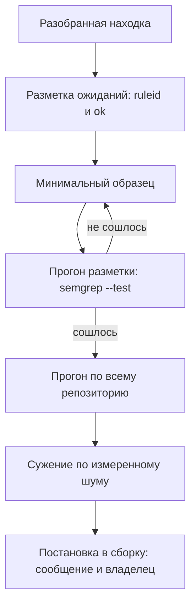

# Свои правила Semgrep под конкретный стек

Правило написано, и первый же прогон его проверки красный:

```text
0/1: 1 unit tests did not pass:
  x sql-string-built
  missed lines: [], incorrect lines: [19]
```

Здесь произошло вот что. Рядом с правилом лежит файл разметки ожиданий: в
нём отмечено, где правило обязано сработать, а где обязано промолчать.
Строка 19 в этом файле — запрос без подстановки вовсе, и над ним стоит
пометка «молчать». Правило на нём сработало, то есть дефект оказался не в
коде, а в самом правиле. И нашёл его не ревьюер, а прогон: расхождения
считает сам Semgrep. Как устроены такая разметка и её прогон, разобрано в
`semgrep-rules`.

Эта тема начинается там, где кончается язык правил: с разобранной находки,
которую готовые наборы не берут. Обёртка над базой, свой клиент HTTP,
договорённость «через эту функцию не ходим» — всё это готовое правило не
знает. Из такой находки получается своё. Вопрос темы один: каким порядком
действий из одной разобранной находки получается правило, которое не выключат
через неделю.

## Зачем писать своё правило

Готовые наборы правил пишутся под общие библиотеки и не знают про ваши.
Обёртка над базой данных, собственный клиент HTTP, свой способ собирать
шаблон страницы — для готового набора это обычные функции. Для вас это
места, где живёт целый класс дефектов. Класс при этом никуда не девается,
и единственный, кто может описать его правилом, — тот, кто разобрал первую
находку.

Второй повод — договорённость команды. Фраза «через эту функцию не ходим»
держится памятью ревьюера ровно до его отпуска. Правило переводит
договорённость в проверку, которая срабатывает в момент правки, а не в
момент чтения чужого кода.

У такой проверки есть место, и место это — сборка. Сборкой здесь называется
автоматический прогон проверок при каждом изменении кода в общем
репозитории. Разработчик предлагает изменение, машина запускает проверки,
и красная проверка не даёт изменение принять. Бытовой пример — турникет на
проходной. Бейдж проверяется у каждого и всегда, а список запретов держит
сам турникет, а не память охранника. Соответствие прямое: турникет — это
сборка, список у него — набор правил, охранник — ревьюер. Граница у примера
есть: турникет отвечает мгновенно и одинаково, а прогон правил занимает
минуты и зависит от настройки.

«Поставить правило в сборку» значит включить его в этот прогон: дальше оно
проверяет каждое изменение без вашего участия. Дорого стоит не написать
правило, а оставить его там. Шумное правило выключают целиком на первом же
большом слиянии, и вместе с шумом уходит весь класс дефектов. Включить его
обратно получается редко: доверие к правилу восстанавливается дольше, чем
оно гасилось.

**Зачем это в работе AppSec-инженера.** Внутренний код не закрывает никто,
кроме команды, которая его пишет, и закрыть его надо один раз и для всех.
Инженер, умеющий довести своё правило до сборки, превращает разобранную
находку в проверку, которая работает без него. Второй разговор, ради
которого это нужно, — предложение выключить зашумевшее правило: у инженера
на него есть измеренный шум и средства его сузить.

## Как это работает

**Откуда это взялось.** Договорённости про опасные вызовы жили в документе
для ревью. Ломалось это на масштабе: документ читают при выходе на работу,
а код пишут каждый день, и ревьюер устаёт раньше, чем кончается список.
Правило переводит договорённость в проверку, которая срабатывает в момент
правки, и не устаёт.

Тема — рецепт, поэтому из устройства движка здесь оставлено только то, что
встретится в выводе правила. Образец сопоставляется с деревом разбора,
метапеременная совпадает с любым выражением, режим метки ведёт значение от
источника к стоку. Устройство всего этого разобрано в `semgrep-rules`,
а разбор самого дефекта — в `sqli-basics`: сюда ни то ни другое не
переписывается.

Порядок работы — шесть шагов, и первый из них — не образец. Сначала находка
превращается в разметку ожиданий: файл рядом с правилом, где отмечено, где
правило обязано сработать и где обязано промолчать. Дальше пишется
минимальный образец, и правило доводится до схождения с разметкой прогоном.
Схождение — состояние, когда прогон разметки зелёный: поведение правила
совпало со всеми ожиданиями. Потом правило прогоняется по всему
репозиторию, сужается по измеренному шуму и ставится в сборку с сообщением
и владельцем.



**Описание схемы.** Схема читается сверху вниз и показывает шесть шагов от
находки до сборки. Из прогона разметки есть два выхода. Если ожидания не
совпали с поведением правила, работа возвращается к образцу. Если совпали,
правило идёт на весь репозиторий, потом сужается и ставится в сборку.

Порядок именно такой, потому что каждый шаг отвечает на свой вопрос, и эти
вопросы нельзя переставить. Разметка отвечает, что правило обязано делать.
Образец отвечает, как это записать. Прогон по репозиторию отвечает, сколько
шума это принесёт. Запишите образец первым — и разметка подгонится под
него: проверять будет нечему.

## Что умеет и чего не умеет

**Что умеет свой набор правил.** Закрывать то, чего в готовых нет:
внутренние обёртки, собственные имена функций, договорённости команды.
Обёртка над базой описывается правилом один раз, и дальше правило ловит
каждый опасный вызов этой обёртки во всём репозитории. Готовый набор про
такую функцию не узнает никогда: она существует только в вашем коде.

**Умеет он и обратное — сужать чужое правило до своего стека.** Готовое
правило, которое шумит именно на вашем коде, не выключается целиком, а
ограничивается: полем области в самом правиле и точечными подавлениями по
имени. Оба средства разобраны ниже, в разделе «Как запустить».

**Чего свой набор не умеет: заменить готовые.** Правило под свою обёртку
знает одну функцию и не знает ста библиотечных вызовов того же класса.
Поэтому свои правила живут рядом с набором из реестра, а не вместо него:
реестр закрывает общие библиотеки, свой набор — ваши.

## Как запустить

Дальше — шесть шагов на одной разобранной находке. Сам разбор уже сделан:
без него писать нечего. Версия в примерах — Semgrep 1.174.0, правила лежат
в каталоге `rules/` рядом с кодом.

Шаг 1 — разметка ожиданий. Файл кладётся рядом с правилом: `rules/sql.yaml`
— это правило, `rules/sql.py` — это разметка. Аннотация ставится
комментарием над строкой: `ruleid: <id>` там, где правило обязано
сработать, `ok: <id>` там, где обязано промолчать [^1]. В разметку кладутся
два случая срабатывания и два случая молчания. Строка молчания выглядит
так:

```python
def get_order_safe(conn, order_id):
    # ok: sql-string-built
    return conn.execute("SELECT id FROM orders WHERE id = ?", (order_id,))
```

Запрос здесь собран на параметрах: значение уходит отдельным аргументом
и не может стать частью команды. Почему такой запрос чист, разбирает
`parameterized-queries`; для этой темы важно другое. Правило обязано
молчать на такой строке, и это записано до того, как написан образец.

Шаг 2 — минимальный образец: самая короткая запись, которая находит дефект
из разметки. Шаг 3 — прогон разметки до схождения:

```bash
semgrep --test --metrics=off rules/
```

Флаг `--metrics=off` выключает отправку статистики прогона наружу; этот
флаг и причина разобраны в `sast-false-positives`. Красный прогон правится
образцем, а не разметкой: ожидания собраны из разобранных находок и потому
сильнее первой версии образца. Каждая правка проверяется повторным
запуском, а не чтением.

Шаг 4 — прогон по всему репозиторию, а не по стенду:

```bash
semgrep --config=rules/sql.yaml --metrics=off --no-git-ignore .
```

Флаг `--no-git-ignore` велит смотреть все файлы, а не только отслеживаемые
git; само умолчание и его цена разобраны в `sast-principles`. Точка в конце
команды — сам репозиторий. Число находок этого прогона записывается: без
него пятый шаг сужает правило вслепую.

Шаг 5 — сужение по измеренному шуму. Шум здесь — доля ложных срабатываний;
как её измеряют размеченным прогоном, показано в `sast-false-positives`.
Средств три, от узкого к широкому [^2]:

1. Комментарий `nosemgrep: <id>` над строкой — точечное подавление. Он
   гасит одно названное правило на одной строке, а причина пишется в том же
   комментарии: без неё через полгода никто не скажет, почему здесь тихо.
2. Поле `paths` в самом правиле — область действия. Правило работает только
   на файлах по маске: например, не смотрит в тесты и сгенерированный код,
   где такой вызов законен.
3. Файл `.semgrepignore` — список каталогов, которые прогон пропускает
   целиком. Устроен он как `.gitignore`: одна маска на строку.

Порядок от узкого к широкому не случаен. Подавление видно тому, кто читает
сам код. Область в правиле видна тому, кто открыл правило. Файл исключений
виден только тому, кто про него знает. Чем шире средство, тем меньше у
следующего читателя шансов его заметить, и тем вескей должна быть причина.

Шаг 6 — постановка в сборку. Сообщение правила говорит, что не так и что
делать, а не называет класс дефекта: «запрос собран склейкой, вынесите
значение в параметр» читается, а «CWE-89» — нет. В поле `metadata`,
служебной записи при правиле, которую движок не читает, а люди читают,
записываются класс дефекта и владелец. Владелец нужен затем, чтобы у
выключения был адресат: правило зашумит через год, и вопрос пойдёт тому,
кто за него отвечает.

## Как читать вывод

Вывод прогона разметки читается первым, и в нём интересны две строки.

```text
0/1: 1 unit tests did not pass:
  x sql-string-built
  missed lines: [], incorrect lines: [19]
```

`missed lines` — правило промолчало там, где размечено `ruleid:`: это
пропуск. `incorrect lines` — сработало там, где размечено `ok:`: это ложное
срабатывание. Оба списка считает не ревьюер, а сам Semgrep, и пустой список
читается так же внимательно, как полный. В этом прогоне строка 19 — запрос
без подстановки вовсе, и правило сработало на нём. Дефект оказался в
правиле, а не в коде.

Лечится правило, а не разметка: вызов с одним литералом вычитается из
стока, и разметка сходится:

```text
1/1: ✓ All tests passed
```

Этот эпизод — весь порядок темы в срезе: дефект искался не глазами, а
прогоном, и нашёлся до постановки в сборку. Если бы в разметке стояли
только пометки `ruleid:` и ни одной `ok:`, поймал бы прогон строку 19? Да:
прогон сравнивает находки со строками, помеченными `ruleid:`, и
срабатывание на любой другой строке попадает в `incorrect lines`. Пометка
`ok:` нужна не движку, а читателю: она записывает, что строка проверена
и чиста намеренно, а не забыта.

Дальше читается прогон по репозиторию. На стенде из шести файлов правило
дало три находки: два подставленных дефекта и одно срабатывание на имени
таблицы, проверенном по замкнутому множеству. Замкнутое множество — список
разрешённых значений, записанный в самом коде; этот приём разобран в
`parameterized-queries`. На семнадцати файлах инструментария этого проекта
то же правило дало ноль находок.

Ложное срабатывание закрывается точечно, и причина пишется в том же
комментарии:

```python
# ФРАГМЕНТ — срез, самостоятельно не компилируется
    # nosemgrep: sql-string-built -- имя таблицы сверено с TABLES выше
    return conn.execute(f"SELECT count(*) FROM {table}").fetchone()[0]
```

После этого прогон даёт две находки вместо трёх, и обе — настоящие дефекты.
Что с ними делать дальше, разобрано в теме `sqli-basics`: правило
показывает место, а не починку.

## Границы метода

**Граница первая: правило не отличит намерение.** Имя таблицы, сверенное со
списком, и имя таблицы от пользователя выглядят в выражении одинаково: всё,
что делает похожий код законным, лежит вне текста выражения. Закрывается
это подавлением с причиной, а не усложнением образца.

**Граница вторая: шум меряется на своём репозитории.** Число, полученное на
шести файлах стенда, о монолите не говорит ничего: у монолита другие
библиотеки и другие привычки. Прогон по всему дереву — обязательный шаг,
а не проверка впрок, и повторяется он после каждой правки образца.

**Цена.** Первая версия правила — минуты. Версия, пережившая прогон по
репозиторию и сужение, — часы, и большая часть уходит на разбор находок,
а не на образец. Прогон правила на шести файлах — около двух секунд, на
пятидесяти шести — около четырёх; оценка по одному прогону.

## Частая ошибка

Забота о команде выражается сужением прогона: чтобы правило не мешало, его
прогоняют только на изменённых файлах, и старый код шума не даёт. До
разбора ответьте себе: куда деваются старые находки при таком прогоне?

**Прогон только по изменённому — это про порядок разбора, а не про шум.**
Средство для такого прогона есть: Semgrep в сборке умеет показывать только
находки, которых нет в магистральной ветке [^3]. Устроено это как сличение
двух версий документа: читается не весь текст, а разница. Но старые находки
при этом не исчезают, а откладываются, и правило с высокой долей шума даст
ту же долю на первом же большом изменении.

Контрпример: правило поставлено в сборку без прогона по всему дереву,
потому что «в новых файлах его не будет». Первое же слияние крупной ветки
приносит сорок срабатываний, разобрать их некому, и правило выключают
целиком. Вместе с ним выключаются две настоящие находки, которые в этих
сорока были, и весь класс дефектов заодно.

## Чеклист для ревью

1. Проверьте, что у правила есть файл разметки и прогон `--test` проходит.
2. Проверьте, что в разметке есть случаи `ok:`, а не только `ruleid:`.
3. Проверьте, что правило прогнано по всему дереву, и число находок записано.
4. Проверьте, что каждое подавление названо по идентификатору правила и снабжено
   причиной в том же комментарии.
5. Проверьте, что сообщение правила говорит, что не так и что делать, а не
   называет класс дефекта.
6. Проверьте, что в `metadata` стоит владелец правила: у выключения должен быть
   адресат.

## Попробуй сам

Взять одну разобранную находку из своего репозитория и пройти по ней все
шесть шагов. Правило должно сойтись с разметкой и быть прогнано по всему
дереву.

Одна подсказка: разметку пишите до образца — образец, написанный первым,
подгоняет ожидания под себя.

**Критерий выполнения** наблюдаемый: `semgrep --test` печатает «All tests
passed», а прогон по репозиторию даёт записанное число находок. Для каждого
ложного срабатывания в коде стоит подавление по имени правила с причиной.

## Проверь себя

1. Прогон разметки напечатал:

   ```text
   0/1: 1 unit tests did not pass:
     x sql-string-built
     missed lines: [12], incorrect lines: [7]
   ```

   Что означает каждый из двух списков и что именно не так с правилом?
2. Почему первым шагом идёт разметка, а не образец?
3. Новое правило в сборке будет смотреть только на изменённые файлы. Зачем
   перед постановкой прогонять его по всему дереву?

   А. Незачем: старый код правило в сборке не увидит, и шума не будет.

   Б. Измерить шум до постановки: прогон по изменённому откладывает старые
      находки, а не убирает их.

   В. Чтобы подавить все существующие срабатывания разом и начать с чистого
      листа.

4. Предскажите, сколько находок напечатает прогон правила
   `$C.execute("..." + $X, ...)` по этому файлу и на какой строке.

   ```python
   def count_orders(conn, table):
       # nosemgrep: sc-exec-concat -- имя сверено с TABLES выше
       return conn.execute("SELECT count(*) FROM " + table)

   def drop(conn, name):
       return conn.execute("DROP TABLE " + name)
   ```

5. Возврат к теме `parameterized-queries`: прогон пометил
   `conn.execute(f"SELECT count(*) FROM {table}")`. Почему параметр здесь не
   починка и что ставится вместо него?
6. Возврат к теме `sast-false-positives`: к какой причине шума относится
   срабатывание на имени таблицы, сверенном с замкнутым множеством?

<details markdown="1">
<summary>Ответ 1</summary>

1. `missed lines: [12]` — пропуск: на строке 12 стоит пометка `ruleid:`, а
   правило промолчало. `incorrect lines: [7]` — ложное срабатывание: на строке
   7 стоит пометка `ok:`, а правило сработало. С правилом не так обе вещи
   сразу: оно не видит один настоящий случай и берёт один чистый.

</details>

<details markdown="1">
<summary>Ответ 2</summary>

2. Потому что образец, написанный первым, подгоняет ожидания под себя.
   Разметка, собранная из разобранных находок, описывает нужное поведение
   независимо от того, каким получится образец, — и ловит его слабости
   прогоном, а не чтением.

</details>

<details markdown="1">
<summary>Ответ 3: разбор вариантов</summary>

3. Верный ответ — Б.

   А. Старые находки при таком прогоне не исчезают, а откладываются. Первое
      же крупное слияние приносит их все сразу, разобрать некому — и правило
      выключают целиком, вместе с настоящими находками.

   Б. Прогон по всему дереву — это замер доли шума до того, как правило
      встанет в сборку. По замеру правило сужается: подавлением по имени,
      полем области, файлом исключений.

   В. Массовое подавление без разбора прячет настоящие находки вместе с
      ложными: в контрпримере темы две настоящие были среди сорока. Подавляется
      разобранная находка, с причиной в комментарии.

</details>

<details markdown="1">
<summary>Ответ 4</summary>

4. Одна находка, на строке 6, — `DROP TABLE` в `drop`. Вызов в `count_orders`
   прогон не печатает: комментарий `nosemgrep` с именем правила подавляет его
   точечно, а причина записана в том же комментарии. Ответ получен прогоном на
   Semgrep 1.174.0: `semgrep --config rule.yaml --metrics=off supp.py`
   печатает `Findings: 1`.

</details>

<details markdown="1">
<summary>Ответ 5</summary>

5. Параметр связывает значение, а имя таблицы — часть команды, и на его месте
   параметра не бывает. Вместо параметра ставится замкнутое множество
   разрешённых имён: имя сверяется с ним до подстановки, и запрос собирается
   только из проверенного значения.

</details>

<details markdown="1">
<summary>Ответ 6</summary>

6. К неизвестному правилу санитайзеру: проверка написана своя, и правило про
   неё не знает. Признак — значение сверяется с замкнутым множеством до
   подстановки, а метку такое сравнение не снимает.

</details>

## Источники

1. Semgrep, «Test rules»; реестр `semgrep-testing-rules`. Разделы: аннотации
   `ruleid:`, `ok:`, `todoruleid:`, `todook:`, поиск тестового файла по имени
   правила, запуск `semgrep --test` и вид вывода.
   <https://docs.semgrep.dev/writing-rules/testing-rules>
2. Semgrep, «Ignore files, folders, and code»; реестр `semgrep-ignore`.
   Разделы: комментарий `nosemgrep` и подавление конкретного правила по имени,
   файл `.semgrepignore`, поле `paths` в правиле, флаги `--exclude` и
   `--include`.
   <https://docs.semgrep.dev/ignoring-files-folders-code>
3. Semgrep, «Customize your CI job»; реестр `semgrep-customize-ci-job`.
   Разделы: прогон относительно магистральной ветки и переменная
   `SEMGREP_BASELINE_REF`, расписание полных прогонов, таймауты.
   <https://docs.semgrep.dev/deployment/customize-ci-jobs>
4. Semgrep, «Rule structure syntax»; реестр `semgrep-rule-syntax`. Разделы:
   поля `metadata`, `paths`, `options`, `min-version` и `max-version`.
   <https://docs.semgrep.dev/writing-rules/rule-syntax>

Каркас этапа: `cwe-taxonomy`. Наследуется всеми темами и отдельной строкой не
повторяется.

**Скоропортящийся слой.** Ключи командной строки, имя переменной для прогона
относительно ветки, вид вывода прогона разметки и синтаксис файла исключений.
Порядок из шести шагов от находки к правилу держится дольше.

**Маркеры уверенности.** Схождение разметки после вычитания вызова с одним
литералом, три находки на стенде и две после точечного подавления, ноль
находок на семнадцати файлах инструментария — **проверено лично** 2026-08-25
на Semgrep 1.174.0 и Python 3.14.7. Время прогонов — **оценка по одному
прогону**. Аннотации разметки, механика подавления и прогон относительно
магистральной ветки — **по документации** Semgrep, открытой лично 2026-08-25.
Семантика сравнения прогона разметки, то есть что находки сверяются со
строками `ruleid:`, — **по исходникам** Semgrep, `cli/src/semgrep/test.py`
и `src/osemgrep/cli_test/Test_subcommand.ml`, прочитаны лично 2026-10-03.
Прогон относительно ветки **не воспроизводился**: стенд лежит вне индекса git.

[^1]: Semgrep, «Test rules», реестр `semgrep-testing-rules`.
[^2]: Semgrep, «Ignore files, folders, and code», реестр `semgrep-ignore`.
[^3]: Semgrep, «Customize your CI job», реестр `semgrep-customize-ci-job`.
