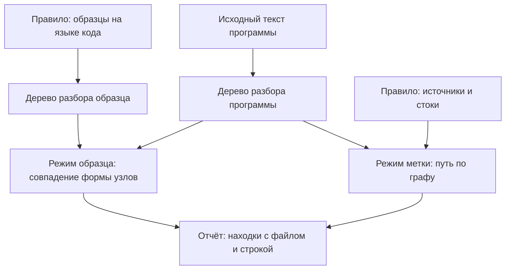

# Semgrep: правила, метапеременные, taint mode

Вам доводилось открывать конфиг линтера и гадать по строке образца, какой
код правило на самом деле ловит. Вот такое правило целиком:

```yaml
rules:
  - id: sql-built-by-concat
    message: Текст запроса собран из частей
    severity: ERROR
    languages: [python]
    pattern: $C.execute("..." + $X, ...)
```

Читается оно быстрее, чем кажется. Всё, что должно совпасть дословно,
записано дословно: имя вызова `execute` и плюс между частями строки. Всё,
что меняется от случая к случаю, заменено значками. Записи `$C` и `$X` —
метапеременные, они совпадают с любым выражением. Многоточия обозначают
любое содержимое строки и любые остальные доводы вызова. Совпадение идёт
по дереву разбора, поэтому запись в четыре строки и другое имя переменной
правило не ломают. Так устроен язык правил Semgrep: образец пишется на
языке самого кода, а разбор в дерево остаётся внутри движка.

Сам движок вы уже видели в работе: в `sast-principles` он прогонял стенд
готовым набором из реестра — общего каталога правил проекта. Что должно
измениться в правиле, когда дефект перестаёт умещаться в одно выражение, —
и где у языка правил граница, названная самим инструментом?

## Что такое язык правил

Semgrep — свободный движок статического анализа. Сам метод с деревом
разбора, графом и распространением метки разобран в `sast-principles` и
здесь не повторяется. Отличие Semgrep от анализаторов старшего поколения
в том, что проверки — это не код движка, а файлы правил. Правило пишет
пользователь, и написать его может тот, кто знает дефект, а не устройство
анализатора.

Правило — это документ YAML, тот же формат «ключ: значение», что у
конфигурации сборки. Обязательных полей пять [^1]. Поле `id` — имя правила,
и под этим именем находка попадёт в отчёт. Поле `message` — текст, который
прочитает разработчик. Поле `severity` — важность находки: `INFO`,
`WARNING` или `ERROR`. Поле `languages` называет, на каком языке написан
искомый код. И сам образец: поле `pattern` или один из операторов, о
которых ниже.

Главная идея языка: образец пишется на языке самого кода. Чтобы искать
вызов с конкатенацией, вы пишете вызов с конкатенацией, а не регулярное
выражение. Бытовое соответствие — объявление о поиске. Запрос «красный
велосипед, три скорости, багажник» совпадёт и с объявлением «продаю красный
трёхскоростной велосипед с багажником», потому что важны признаки, а не
порядок слов. Признакам здесь соответствуют узлы дерева разбора, а порядку
слов — исходный текст. Ломается аналогия на смысле: человек отличит «три
скорости» от «трёх велосипедов», а правило про смысл не знает ничего, и эта
граница разобрана ниже.

Метапеременные вы уже встречали в `sast-principles`: запись вида `$X`
совпадает с любым выражением и запоминает совпавшее. Это пропуск в бланке
объявления: «куплю ___, недорого» сработает на любом товаре. Многоточие
`...` — «и так далее» перечня. В скобках вызова оно означает любые остальные
доводы, в строковом литерале — любое содержимое строки. Как эти записи
читаются в живом правиле, разбирается дальше на минимальном примере.

**Зачем это в работе AppSec-инженера.** Разобранная находка стоит один раз,
и правило по ней стоит один раз, а работает дальше само. Практически из
языка правил вырастают три постоянные задачи. Закрыть свой класс дефектов,
которого нет в готовых наборах. Сузить шумное чужое правило под свой стек.
Записать договорённость команды так, чтобы её проверяла сборка, а не память
ревьюера.

## Подумай, прежде чем читать

1. Образец пишется на языке кода. Что тогда происходит с комментарием внутри
   образца и с порядком именованных доводов вызова?
2. Правило нашло дефект на своём стенде. Что ещё нужно проверить, прежде чем
   ставить его в сборку общего репозитория?
3. Дефект — это путь, а не одно выражение: значение пришло в одном месте,
   применилось в другом. Что в правиле должно измениться?

## Как это работает

**Откуда это взялось.** Правила первых анализаторов писались на языке
самого анализатора: чтобы добавить проверку, надо было выучить внутреннее
представление кода и его API. Ломалось это на людях. Инженер, знающий свой
дефект, правило написать не мог, а тот, кто мог, про дефект не знал. В ответ
появился язык, в котором образец выглядит как кусок искомого кода, а разбор
в дерево остаётся внутри движка.

У правила два режима, и дальше они разбираются по очереди:



**Описание схемы.** Схема читается сверху вниз и показывает, что у прогона
один вход — текст программы — и два способа искать. В режиме образца движок
сопоставляет дерево образца с деревом программы. В режиме метки он ищет
путь значения от источника к стоку. Оба способа заканчиваются одним
отчётом.

### Из чего состоит правило

Вот минимальное правило целиком ещё раз. До чтения разбора отметьте про
себя, какой способ собрать запрос оно не увидит:

```yaml
rules:
  - id: sql-built-by-concat
    message: Текст запроса собран из частей
    severity: ERROR
    languages: [python]
    pattern: $C.execute("..." + $X, ...)
```

Образец читается так. Дословно записаны имя вызова и плюс, и вся точность
правила в них. Метапеременные `$C` и `$X` совпадают с любыми выражениями.
Многоточие внутри строкового литерала означает любое содержимое строки, а
в скобках вызова — любые остальные доводы. Совпадение идёт по дереву,
поэтому запись в четыре строки и запись с лишними пробелами дают то же
совпадение [^2].

Одна метапеременная, названная дважды, требует совпадения обоих мест. Это
даёт правила про равенство: одна и та же переменная в проверке и в
использовании, один и тот же ключ в двух вызовах.

Образец и код совпадают не буквой, а формой, и из этого следуют три
привычки чтения чужих правил. Первая: искать в образце, что именно
оставлено дословным, — обычно это имя вызова или ключевое слово. Вторая:
смотреть, что заменено метапеременной, — это и есть объявленная широта.
Третья: считать многоточия, потому что каждое из них добавляет множество
кода, о котором автор правила не думал.

### Как из образцов собирается условие

Операторы соединяют образцы в условие [^1]. `patterns` — это «и»: совпасть
обязаны все образцы списка. `pattern-either` — «или»: достаточно одного.
`pattern-not` вычитает: место, совпавшее с таким образцом, из находок
убирается. `pattern-inside` ограничивает область поиска: например, искать
только внутри функций, которые обрабатывают запрос.

Ещё три оператора работают не с образцом, а с уже совпавшей метапеременной.
`metavariable-regex` проверяет совпавший текст регулярным выражением: так
правило «eval от значения запроса» из «Проверь себя» отбирает доводы, в
тексте которых есть `input` или `request`. `metavariable-pattern` разбирает
совпавший текст как код и проверяет его ещё одним образцом.
`focus-metavariable` переносит место находки: отметка в отчёте встанет на
узел метапеременной, а не на всё совпадение.

Одного образца хватает, пока дефект — одно выражение. Когда дефект — путь
значения от параметра функции до опасного вызова, правило переходит в
другой режим: вместо одного образца оно объявляет списки источников и
стоков. Правило на стенде этой темы началось с одного образца и прошло
четыре версии: `v2` была промежуточной правкой и в замер не вошла. Стенд —
шесть файлов на Python, в них два подставленных дефекта SQL и два чистых
места похожей формы:

```text
версия  что изменилось                    находок  верных  ложных  пропущено
v1      один образец, конкатенация              1       1       0          1
v3      режим метки, широкий сток               4       2       2          0
v3b     сток сужен до конкатенации              1       1       0          1
v3c     сток «execute ровно с одним доводом»    3       2       1          0
```

Каждая правка здесь куплена строкой из отчёта: пропущенным дефектом в
присваивании, ложным срабатыванием на запросе без подстановки. Версия `v1`
пропускает дефект, где текст запроса собран в переменную строкой выше:
образец описывает вызов, а конкатенация стоит в присваивании. Это же ответ
на вопрос из начала раздела: вызов с готовой переменной минимальное правило
не увидит.

### Поля, которые решают судьбу правила

Кроме обязательных пяти у правила есть поля, без которых оно работает и
которыми оно живёт в команде [^1].

`metadata` — свободный словарь, куда кладут класс дефекта, ссылку на
внутренний документ и владельца правила. Значение оттуда попадает в отчёт
и в машинные форматы, и по нему находки сводятся с трекером. Именно по этому
полю отчёт из десятка правил раскладывается по ответственным без ручной
сортировки.

`paths` задаёт, где правило работает и где нет: каталог тестов,
сгенерированный код, чужая копия библиотеки. Без него правило, написанное
про боевой код, начнёт шуметь по тестам, где склейка строк — норма.

Отдельного упоминания стоит `fix` — образец замены, который движок
подставит по просьбе. Правило с автоправкой не только находит место, но и
переписывает его. Отношение к такому правилу другое: ошибка в образце
замены меняет чужой код, а не отчёт.

Поля `min-version` и `max-version` называют, на каких версиях движка правило
имеет смысл. Появляются они там, где правило опирается на свежую возможность
языка правил. Без них правило на старой сборке молча ничего не находит, и
молчание это принимают за чистоту кода.

### Режим распространения метки

Пропуск закрывается сменой режима. Вместо `pattern` правило объявляет
`mode: taint` и списки: `pattern-sources` называет источники,
`pattern-sinks` — стоки, необязательные `pattern-sanitizers` — санитайзеры
[^3]. Сами понятия — источник, сток, санитайзер — разобраны в
`sast-principles`, новое здесь только их запись в правиле. С редакции
документации 2026-06 `pattern-sinks` перестал быть обязательным: обязателен
только `pattern-sources` [^3]. Читать листинг стоит по трём планам. Первый
— найти, чем объявлен источник метки. Второй — понять, какие формы вызова
собраны в сток и что из него вычитает `pattern-not`. Третий — разобраться,
куда `focus-metavariable` переносит место находки.

```yaml
    mode: taint
    pattern-sources:
      - pattern: |
          def $F(..., $X, ...):
            ...
    pattern-sinks:
      - patterns:
          - pattern-either:
              - pattern: $C.execute("..." + $V, ...)
              - pattern: $C.execute(f"...{$V}...", ...)
              - pattern: $C.execute($V)
          - pattern-not: $C.execute("...")
          - focus-metavariable: $V
```

Источник тут — любой параметр функции, сток — вызов, в котором текст запроса
собран или пришёл готовым. Строка `pattern-not` вычитает вызов с единственным
строковым литералом: там подставлять нечего. `focus-metavariable` решает,
что именно станет местом находки: не вызов целиком, а помеченное значение
`$V`. Ложное срабатывание версии `v3` на чистом запросе на параметрах сняла
не она, а сужение стока: в `v3c` сток требует от вызова ровно один довод.
Вызов с параметрами несёт метку во втором доводе и под такой сток не
подпадает.

Здесь видна цена каждой правки из таблицы версий: расширение стока покупает
находки шумом, сужение — тишину пропуском. Обе цены читаются из замера, а не
из вкуса автора. А если запрос собирает функция-помощник из соседнего файла,
а в `execute` уходит готовая строка — какой части правила не хватит, чтобы
увидеть такой путь? Ответ: никакой части. Такой путь пересекает границу
файла, и никакая правка правила её не перейдёт — нужен межпроцедурный
анализ движка. Эта граница названа ниже, в «Чего не умеет».

Санитайзер снимает метку. Записывается он образцом, и это важное
ограничение: снимается метка присваиванием или вызовом, а не проверкой.
Правило, где защита выражена сравнением с константой, санитайзером не
описывается. На стенде этой темы такое место есть, и ложное срабатывание на
нём остаётся во всех версиях, которые это место видят. В том числе оно
стоит в прогоне из раздела «Как читать вывод».

Пропагатор, наоборот, метку переносит: он нужен там, где значение уходит
внутрь структуры или возвращается изменённым, а движок сам этого не видит.
Документация прямо называет область его работы: одна процедура [^3]. Из
этого следует привычка чтения чужих правил на метке: прежде чем спорить о
наборе источников, проверьте, лежат ли источник и сток в одной функции.

### Что видит движок сверх дословного совпадения

Часть работы делается без просьбы. Значение константы подставляется в место
использования: образец с литералом найдёт и код, где тот же литерал записан
в переменную выше. Порядок именованных доводов не важен, а некоторые
эквивалентные записи считаются одинаковыми [^2]. Комментарии в дерево
разбора не попадают вовсе, поэтому комментарий внутри образца исчезает при
разборе: правило сработает так, как если бы его не было.

Полезно это ровно настолько же, насколько опасно. Правило может сработать
на коде, который в исходнике выглядит иначе, чем образец, и объяснение
находки придётся искать в этих эквивалентностях. Подстановка константы,
порядок доводов и судьба комментария проверены прогоном, а разбор двух
последних есть в ответах «Проверь себя».

## Что умеет и чего не умеет

**Что умеет.** Первое — искать форму выражения независимо от записи: имена,
пробелы, переносы строк, порядок именованных доводов. Второе — связывать два
места равенством метапеременной. Третье — вести значение по графу от
источника к стоку внутри функции. Четвёртое — работать на нескольких языках
одним набором правил: у каждого правила свой `languages`, а прогон и отчёт
общие.

Один и тот же дефект на двух стеках показывает, что здесь инвариант, а что
декорация. Инвариант — форма «текст запроса собран из частей и ушёл в вызов
исполнения». Декорация — синтаксис: в Python это конкатенация и f-строка, в
Go — `fmt.Sprintf` и присваивание перед вызовом. Правило на Go, написанное
по той же форме, нашло на стенде оба подставленных дефекта и не сработало
ни на одном чистом месте.

Общий набор правил на несколько языков даёт ещё одну вещь, которой нет у
инструмента под один стек: одинаковые сообщения. Разработчик на Python и
разработчик на Go получают одну формулировку и один идентификатор, и разговор
про класс дефекта не начинается заново на каждом языке. Практически правило
пишется парой: сначала форма на одном языке, потом та же форма на втором.
Различия между двумя записями и становятся списком того, что в классе дефекта
декорация.

**Чего не умеет.** Первое — считать. Условие «ключ короче шестнадцати байт»
образцом не выражается. Оператор `metavariable-comparison`, сравнивающий
текст метапеременной с литералом, работает с числом из записи, а не с
длиной значения на исполнении. Второе — переходить границу функции и файла
в бесплатной сборке: пропагаторы объявлены внутрипроцедурными, то есть
работают в пределах одной функции [^3]. Третье — знать про эту программу
что-либо, кроме её текста: список разрешённых имён таблиц для правила —
запись в тексте программы, а не множество известных значений.

Четвёртое стоит отдельно. Правило не умеет отличить дефект от намеренного
исключения. Чистая функция, где имя таблицы сверяется с замкнутым множеством,
осталась ложным срабатыванием во всех версиях, которые это место видят, —
и в `v3`, и в `v3c`. Причина в устройстве: проверка здесь — сравнение, а
метка снимается присваиванием.

### Тот же дефект на втором стеке

Стенд на Go содержит те же два дефекта: запрос, собранный `fmt.Sprintf` и
присвоенный переменной, и запрос, собранный конкатенацией прямо в вызове.
Правило описывает обе формы одним `pattern-either`, и вторая его ветвь — это
последовательность из двух операторов.

```yaml
  - id: sql-built-by-concat-go
    languages: [go]
    patterns:
      - pattern-either:
          - pattern: $D.Query("..." + $X, ...)
          - pattern: |
              $Q := fmt.Sprintf("...", ...)
              ...
              $D.Query($Q, ...)
```

Многоточие между двумя строками образца означает любые операторы между ними.
Это и есть способ описать путь значения без режима метки — там, где путь
короткий и лежит в одной функции.

Прогон на стенде Go дал два срабатывания на двух подставленных дефектах и ни
одного на чистом коде. Чистое место здесь то же, что на Python: имя таблицы
сверяется с множеством и подставляется в запрос. Правило на него не сработало
по случайной причине — там `fmt.Sprintf` стоит прямо в доводе вызова, а не в
присваивании. Случайность эта поучительна: тишина правила не всегда означает,
что правило устроено верно.

## Как запустить

Файл правил — обычный YAML, лежит в репозитории рядом с кодом.

```bash
# Semgrep 1.174.0. Свой файл правил вместо набора из реестра.
semgrep --config=rules/sql.yaml --metrics=off --no-git-ignore shop/
```

Ключ `--config` заменяет реестровый набор своим файлом. `--metrics=off`
выключает отправку статистики запуска автору инструмента: без этого ключа
прогон обращается наружу. `--no-git-ignore` отменяет обход файлов вне
индекса git: стенд или свежий каталог иначе молча выпадут из прогона.

Правило без разметки ожиданий — это черновик. Правило тоже программа, и у
неё бывают регрессии: правка, закрывшая один пропуск, может открыть другой.
Поэтому у правила есть свой юнит-тест, и называется он разметкой ожиданий.
Это файл с тем же именем, что у файла правил, и расширением языка: для
`rules/sql.yaml` разметка лежит в `rules/sql.py`. Комментарий `ruleid:`
ставится над строкой, где правило обязано сработать, а `ok:` — над строкой,
где обязано промолчать [^4].

```python
def get_order_safe(conn, order_id):
    # ok: sql-string-built
    return conn.execute("SELECT id FROM orders WHERE id = ?", (order_id,))
```

```bash
# Прогон разметки: сверяет срабатывания с ожиданиями по номерам строк.
semgrep --test --metrics=off rules/
```

Прогон разметки не читает содержимого кода за пределами аннотаций: он
сверяет номера строк. Отсюда порядок работы. Сначала в файл разметки
кладутся два-три случая срабатывания и столько же случаев молчания. Потом
правило доводится до схождения. И только потом файл разметки пополняется
тем, что нашлось на живом репозитории. Каждое разобранное ложное
срабатывание превращается в строку `ok:`, каждый разобранный пропуск — в
строку `ruleid:`.

Такой файл со временем становится описанием правила, которое читается
быстрее самого правила. По нему видно, какие случаи автор рассматривал, и по
нему же правится правило, когда стек меняется.

## Как читать вывод

Отчёт по своему правилу устроен так же, как по чужому: идентификатор
правила, файл, строка, сообщение. Читать его стоит вместе с разметкой,
потому что находка сама по себе говорит мало — говорит расхождение с
ожиданием.

```text
0/1: 1 unit tests did not pass:
  x sql-string-built
  missed lines: [], incorrect lines: [19]
```

`missed lines` — правило промолчало там, где размечено `ruleid:`.
`incorrect lines` — сработало там, где размечено `ok:`. Строка 19 в этом
прогоне — запрос без подстановки вовсе: `conn.execute("SELECT id FROM
orders")`. Правило сработало на нём, потому что источником объявлен любой
параметр функции, и параметр `conn` тоже помечен.

Находка здесь — в правиле, а не в коде, и нашёл её прогон разметки, а не
прогон по стенду: на стенде такой функции не было. После добавления
`pattern-not` разметка сходится:

```text
1/1: ✓ All tests passed
```

Дальше правило идёт на корпус. На шести файлах стенда — три находки: два
настоящих дефекта и одно ложное срабатывание на проверенном имени таблицы.
На двадцати семи файлах инструментария этого проекта — ноль находок и ноль
шума. Что делать с настоящими находками, разбирают темы `sqli-basics` и
`parameterized-queries`: правило показывает место, а починка живёт в своих
темах.

Три числа стоит держать рядом при каждом прогоне своего правила: сколько
файлов просмотрено, сколько находок и сколько из них ожидалось. Первое число
ловит правило, не попавшее ни на один файл из-за неверного `languages`.
Второе и третье вместе показывают, чего стоит очередная правка образца.

## Границы метода

**Граница первая: правило описывает форму, а не намерение.** Всё, что
отличает дефект от осознанного исключения, лежит вне текста выражения. Такие
случаи закрываются не правилом, а разметкой в коде и записью решения.

**Граница вторая: язык правил не покрывает язык кода целиком.** Конструкции,
которых движок не разбирает, в множество целей не попадают, и в отчёте это
видно только числом просмотренных файлов.

**Граница третья: правило живёт вместе со стеком.** Образец, написанный под
один драйвер базы, не переносится на другой библиотечный вызов. Смена
библиотеки не ломает прогон и не даёт ошибки: правило перестаёт находить, и
только. Признак у этого один и косвенный: число находок правила упало до
нуля и держится там дольше обычного.

**Граница четвёртая: правило не заменяет разговора.** Находка своего правила
приходит к разработчику как претензия от инструмента, а не от человека, и
сообщение — единственное, что от человека остаётся. Сообщение вида «SQL
injection» не говорит ничего: разработчик и так видит, что здесь запрос.
Сообщение, называющее, что не так и что делать, стоит правилу одной строки, а
разбору находки — половины времени.

**Цена.** Первая версия правила — минуты. Версия, которая не шумит на чужом
коде, — часы, и большая часть уходит на разметку и на прогоны по большому
репозиторию, а не на образец. Прогон одного своего правила на шести файлах
занял около двух секунд, на пятидесяти шести файлах — около четырёх, оценка
по одному прогону.

## Частая ошибка

Первое срабатывание вдохновляет: правило, которое нашло дефект на своём
примере, готово к сборке, а проверять его дальше — работа впрок.
Ответьте себе «да» или «нет» — и держите ответ, пока читаете.

**Правило проверяется не на дефекте, а на чистом коде.** Срабатывание на
дефекте показывает, что образец не пустой, и больше ничего. Прогон разметки
на стенде этой темы поймал ложное срабатывание на запросе без подстановки —
на коде, которого в исходном стенде не было. Правило, поставленное в сборку
до такой проверки, начинает шуметь на чужом коде, и первым же следствием
становится просьба выключить его целиком.

Контрпример к обратному выводу. Набор из четырёх версий правила показал, что
сужение образца ради тишины стоит пропуска. Версия `v3b` не давала ложного
срабатывания на параметрах и теряла настоящий дефект. Тишина сама по себе не
цель.

Второе заблуждение того же вида: «своё правило шумит, потому что написано
плохо». Иногда так, но чаще шум приходит из широты, выбранной сознательно.
Правило, которое ловит форму «текст запроса собран из частей», обязано
срабатывать и на месте, где части проверены. Отличить одно от другого
правилом нельзя, и выбор здесь не между хорошим и плохим правилом, а между
шумом и пропуском.

## Чеклист для ревью

1. Проверьте, что у правила есть разметка ожиданий и прогон `--test` проходит.
2. Проверьте, что разметка содержит и `ok:`, а не только `ruleid:`.
3. Проверьте, что правило прогнано по репозиторию целиком, а не только по
   стенду.
4. Проверьте, что сообщение правила называет, что именно не так, а не имя
   класса дефекта.
5. Проверьте, что метапеременная, встречающаяся дважды, действительно
   требует совпадения, а не названа так по случайности.
6. Проверьте, что режим метки взят там, где дефект — путь, а не форма
   выражения.
7. Проверьте, что известные ложные срабатывания правила названы в его
   описании вместе с признаком, по которому они узнаются.
8. Проверьте, что у правила названо поле `paths` или причина, по которой оно
   работает на всём дереве, включая тесты и сгенерированный код.

Третье наблюдение того же ряда, что и обе ошибки выше. Правило, написанное
под конкретный дефект, почти всегда оказывается уже нужного: оно ловит
найденный случай и не ловит соседний. Расширять его стоит не догадкой, а
вторым найденным случаем — тогда каждая правка образца оплачена находкой, а
не предположением о том, как ещё бывает.

Практика этой темы дала ровно такую последовательность. Первая версия
описывала вызов. Вторая появилась после пропущенного дефекта в присваивании.
Третья и четвёртая — после ложных срабатываний на чистом коде. Ни одна правка
не была сделана впрок, и каждую можно назвать строкой из отчёта. Такой список
правок и есть готовое описание правила для того, кто придёт после.

## Попробуй сам

`lab-semgrep-rules`, каталог `pilot/lab/semgrep-rules`. Формат
«напиши-правило». Дан стенд на двух языках с подставленными дефектами и
чистым кодом похожей формы, дана разметка ожиданий и пустой файл правил.

**Цель одной фразой:** довести свой файл правил до состояния, когда
`semgrep --test` печатает «All tests passed» на обоих языках. Прогон по
стенду при этом обязан дать оба подставленных дефекта и не больше одного
ложного срабатывания.

Одна подсказка: начните с образца по вызову и посмотрите, какой из
подставленных дефектов он не найдёт; смена режима нужна ровно из-за него.

**Отдельная задача «почини».** Правило-заготовка в комплекте срабатывает на
запросе с параметрами. Убрать это срабатывание, не потеряв ни одного из двух
дефектов. Решение — в `solution/`, открывается после своей попытки.

## Проверь себя

1. Прочитайте правило и назовите, какой код оно ищет. Сработает ли оно на
   строках `return eval(prefix + request.args["q"])`, `return eval("1 + 2")`
   и `return eval(input())`?

   ```yaml
   rules:
     - id: eval-user-input
       message: eval от значения запроса
       severity: ERROR
       languages: [python]
       patterns:
         - pattern: eval($X)
         - metavariable-regex:
             metavariable: $X
             regex: .*(input|request).*
   ```

2. Образец пишется на языке кода. Что происходит с комментарием внутри
   образца и с порядком именованных доводов вызова?
3. Правило нашло дефект на своём стенде. Что ещё нужно проверить, прежде чем
   ставить его в сборку общего репозитория?

   A. Ничего: срабатывание на подставленном дефекте показывает, что правило
      рабочее.

   B. Прогнать его на чистом коде стенда и по большому репозиторию.

   C. Расширить образец, чтобы он ловил и соседние формы того же дефекта.

4. Предскажите, что напечатает `semgrep --test --metrics=off`, запущенный в
   каталоге с правилом `$C.execute("..." + $X, ...)` и таким файлом разметки.

   ```python
   def bad(conn, name):
       # ruleid: sc-exec-concat
       return conn.execute("DELETE FROM users WHERE name = " + name)

   def good(conn):
       # ok: sc-exec-concat
       return conn.execute("SELECT count(*) FROM users")

   def via_var(conn, uid):
       # ruleid: sc-exec-concat
       q = "SELECT * FROM users WHERE id = " + str(uid)
       return conn.execute(q)
   ```

5. Дефект — это путь, а не одно выражение: значение пришло в одном месте,
   применилось в другом. Что в правиле должно измениться?
6. Возврат к теме `sqli-basics`: правило из этой темы пометило склейку
   запроса. Чем такая находка чинится и почему фильтрация ввода её не
   закрывает?

<details markdown="1">
<summary>Ответ 1</summary>

1. Правило ищет вызов `eval`, чей довод содержит `input` или `request`:
   образец берёт любой вызов `eval`, а `metavariable-regex` проверяет текст
   совпавшего довода. На первой строке сработает: довод — конкатенация, в её
   тексте есть `request`. На второй промолчит: довод — литерал без этих имён.
   На третьей сработает: текст довода — `input()`. Проверено прогоном на
   Semgrep 1.174.0: две находки из трёх строк.

</details>

<details markdown="1">
<summary>Ответ 2</summary>

2. И то и другое теряется при разборе. Комментарий в образце исчезает, потому
   что образец разбирается в дерево, а комментарии в дерево не попадают.
   Проверено прогоном: правило с комментарием в образце сработало как обычно.
   Порядок именованных доводов не важен: образец `subprocess.run($CMD,
   shell=True, check=True)` совпал с вызовом, где `check=True` стоит раньше
   `shell=True`.

</details>

<details markdown="1">
<summary>Ответ 3: разбор вариантов</summary>

3. Верный ответ — B.

   A. Срабатывание на дефекте, подставленном под это же правило, показывает
      только, что образец не пустой. Прогон разметки на стенде темы поймал
      ложное срабатывание на коде, которого в стенде не было.

   B. Правило проверяется на чистом коде: прогон разметки с местами `ok:` и
      прогон по репозиторию целиком. Поставленное в сборку до такой проверки
      правило начинает шуметь на чужом коде, и первым следствием становится
      просьба выключить его целиком.

   C. Расширение догадкой покупает шум: правило, написанное под один случай,
      почти всегда уже нужного. Расширять его стоит вторым найденным случаем,
      а не предположением.

</details>

<details markdown="1">
<summary>Ответ 4</summary>

4. Прогон напечатает `0/1: 1 unit tests did not pass` и `missed lines: [11]`.
   На `bad` правило сработало, как размечено, на `good` промолчало. А на
   `via_var` промолчало вопреки разметке: конкатенация стоит в присваивании, а
   образец описывает довод вызова. Ответ получен прогоном на Semgrep 1.174.0:
   `semgrep --test --metrics=off` в каталоге с разметкой. Разметка здесь
   поймала слабость самого образца — пропуск пути через переменную.

</details>

<details markdown="1">
<summary>Ответ 5</summary>

5. На смену `pattern` приходит `mode: taint`: вместо одного образца — списки
   `pattern-sources` и `pattern-sinks`, а движок ищет путь помеченного
   значения между ними. Признак, что смена нужна: источник значения и его
   применение стоят в разных операторах, и между ними есть присваивание.

</details>

<details markdown="1">
<summary>Ответ 6</summary>

6. Чинится параметрами: текст запроса остаётся литералом, а значения едут
   отдельными доводами и не могут стать частью команды. Фильтрация не
   закрывает находку, потому что набор «опасных символов» зависит от
   контекста и обходится — это заблуждение разобрано в ловушке темы
   `sqli-basics`.

</details>

## Источники

1. Semgrep, «Rule structure syntax»; реестр `semgrep-rule-syntax`. Разделы:
   обязательные поля правила, операторы `patterns`, `pattern-either`,
   `pattern-not`, `pattern-inside`, `metavariable-regex`,
   `metavariable-comparison`, необязательные `metadata`, `paths`, `options`.
   <https://docs.semgrep.dev/writing-rules/rule-syntax>
2. Semgrep, «Rule pattern syntax»; реестр `semgrep-pattern-syntax`. Разделы:
   метапеременные, многоточие в вызовах и литералах, эквивалентности и
   подстановка константы.
   <https://docs.semgrep.dev/writing-rules/pattern-syntax>
3. Semgrep, «Taint analysis overview»; реестр `semgrep-taint`. Разделы:
   `pattern-sources`, `pattern-sinks`, `pattern-sanitizers`,
   `pattern-propagators`; область работы пропагаторов и условия
   межпроцедурного анализа.
   <https://docs.semgrep.dev/writing-rules/data-flow/taint-mode/overview>
4. Semgrep, «Testing rules»; реестр `semgrep-testing-rules`. Разделы:
   аннотации `ruleid:`, `ok:`, `todoruleid:`, `todook:`, устройство прогона
   `semgrep --test` и вывод про пропущенные и лишние строки.
   <https://docs.semgrep.dev/writing-rules/testing-rules>

Каркас этапа: `cwe-taxonomy`. Наследуется всеми темами и отдельной строкой не
повторяется.

**Скоропортящийся слой.** Версия Semgrep, состав операторов языка правил,
имена наборов из реестра и формат вывода прогона разметки. Устройство правила
— образец, метапеременные, многоточие, режим метки — держится дольше.

**Маркеры уверенности.** Срабатывание на запросе без подстановки, схождение
разметки после `pattern-not`, ноль находок на семнадцати файлах
инструментария и оба дефекта на стенде Go — **проверено лично** 2026-08-25
на Semgrep 1.174.0, Python 3.14.7, Go 1.27.0. Повторные прогоны 2026-10-03
на той же версии Semgrep 1.174.0: разметка решения лабы сошлась (2/2),
стенд Python дал три находки (db.py, строки 14, 28 и 33 — два дефекта и
ложное срабатывание на проверенном имени таблицы), стенд Go дал два
срабатывания на двух дефектах и ни одного на чистом коде, а инструментарий
проекта, выросший до двадцати семи файлов, — ноль находок; выводы вопросов
1, 2 и 4 самопроверки воспроизведены прогонами того же дня. Числа таблицы
версий пересчитаны 2026-10-03 на нынешнем стенде лабы: с первоначального
замера стенд изменился, чистое место с конкатенацией в вызове из него
убрано, и строки `v1` и `v3b` дают по одной верной находке без ложных;
строки `v3` и `v3c` сошлись дословно. Подстановка константы воспроизведена
тем же днём: образец с литералом нашёл и переменную, которой этот литерал
присвоен выше. Время прогона — **оценка по одному прогону**. Состав полей
правила, поведение многоточия и эквивалентностей, устройство режима метки и
аннотации разметки — **по документации** Semgrep, открытой лично
2026-08-25. Обязательность списков режима метки перечитана там же
2026-09-03: `pattern-sinks` перестал быть обязательным. Межпроцедурный
анализ платных сборок **не воспроизводился**: лицензии нет.

[^1]: Semgrep, «Rule structure syntax», реестр `semgrep-rule-syntax`.
[^2]: Semgrep, «Rule pattern syntax», реестр `semgrep-pattern-syntax`.
[^3]: Semgrep, «Taint analysis overview», реестр `semgrep-taint`.
[^4]: Semgrep, «Testing rules», реестр `semgrep-testing-rules`.
