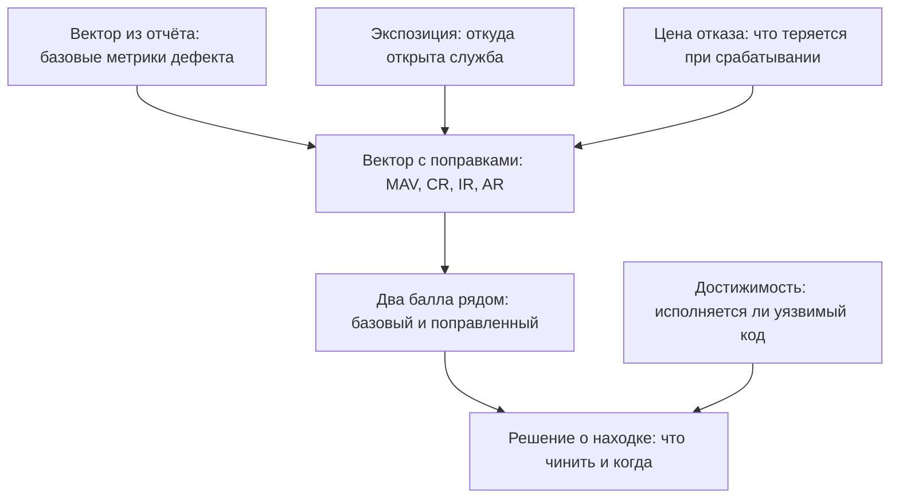

# Оценка severity: от вектора к решению

Отчёт сканера состава пришёл, и сверху в нём стоит балл 9.8 — у самого
потолка шкалы из темы `cve-cvss`. На учебном стенде такой балл имеют три
находки на один пакет, и стенд говорит об этом пакете вот что:

```text
пакет      находок   что его тянет
PyYAML           3   ничто: ни код, ни зависимости
requests         5   ничто: стоит в требованиях, нет в коде
```

Приложение пакет PyYAML не зовёт ни разу, и ни одна из установленных
библиотек его не требует: строка в требованиях осталась от чего-то давнего.
Получается странная пара — оценка почти максимальная, а чинить нечего. Дешевле
вычеркнуть строку из манифеста, чем обновлять пакет, который никто не
исполняет.

Оценка 9.8 при этом честная: она измеряет дефект и ничего не знает о вашей
системе. Так задумано: вакуум — цена переносимости оценки. Вектор молчит о
том, выполняется ли уязвимый код, открыта ли служба снаружи и что произойдёт
при отказе. Поэтому одна и та же находка дальше получает и 9.8, и 6.9, и оба
числа верные. Два класса тяжести между ними отделяют не мнения, а три
объявленных факта о приложении.

Что такое вектор, как он считается и чем EPSS отличается от KEV, разобрано в
`cve-cvss` и здесь не повторяется. Предмет этой темы — поправка на
приложение: что делать с баллом, когда он уже есть. Какие факты о вашей
системе способны сдвинуть 9.8 в 6.9 — и как их записать так, чтобы поправку
проверил другой человек?

## Балл измеряет дефект, а не вашу систему

Почему балл молчит о системе — не недоделка, а условие переносимости. Чтобы
балл мог посчитать кто угодно и получить одно и то же число, он обязан
описывать сам дефект и ничего больше. Добавьте в него вашу сеть — и оценка
перестанет сходиться у разных читателей. Поэтому стандарт разводит две вещи:
балл считается из дефекта, а поправка на вашу систему вносится отдельно и
отдельной группой метрик — Environmental, «окружение» [^1]. Заполняет её не
издатель оценки, а владелец системы, то есть вы.

Заполненная поправка двигает балл заметно. Один и тот же вектор
`AV:N/AC:L/PR:N/UI:N/S:U/C:H/I:H/A:H`:

```text
базовый                                        9.8  Critical
служба доступна только из внутренней сети      8.8  High
данные некритичны                              8.0  High
и то и другое сразу                            6.9  Medium
```

Четыре строки — это четыре оценки одного дефекта. Вторая получена
объявлением факта «служба видна только изнутри», третья — факта «за дефектом
нет ценных данных», четвёртая — обоих сразу. Разница между первой и
последней строкой — два класса тяжести, и получена она не спором о числе, а
объявлением контекста. Какими буквами эти факты дописаны к вектору, разбирает
следующий раздел.

**Зачем это в работе AppSec-инженера.** Отчёт сканера приходит списком из
десятков строк с баллами, и разработчик спрашивает не «сколько там баллов», а
«чинить ли это на неделе». Ответ собирается из балла и трёх фактов о вашей
системе; инженер, который умеет их назвать, отвечает за минуту, а не за
совещание.

## Как это работает

**Откуда это взялось.** Первые шкалы тяжести были одним числом от вендора, и
спорить с ним было нечем. CVSS разложил число на метрики и тем сделал спор
предметным: теперь спорят о значении конкретной метрики, а не о числе «на
глаз». Но метрики базовой группы описывают дефект в вакууме — иначе оценка
не была бы переносимой.

Как только оценки начали применять к живым системам, выяснилось, что
переносимость и полезность тянут в разные стороны. Ответом стали ещё две
группы: Threat — про активность вокруг дефекта, Environmental — про систему,
в которой он живёт [^2]. Базовая группа осталась неизменной, и это её сила:
её считает кто угодно и получает то же число.

Что владелец системы вправе объявить о своей установке? Три факта, и они
разной природы.

**Достижимость.** Пакет числится в зависимостях — это ещё не значит, что его
код выполняется: уязвимая функция может не вызываться никогда. Бытовой образ —
сломанная ступенька чердачной лестницы, на которую никто не поднимается.
Ступенька сломана честно, но упасть с неё некому. Граница образа: лестницу
могут начать использовать, и пакет могут подключить в следующем релизе.

Признак достижимости самый грубый и самый дешёвый: назван ли пакет в коде и
требует ли его хоть одна из установленных библиотек. Отрицательный ответ на
оба вопроса — не доказательство безопасности, а повод не ставить находку
первой. И важное различие в записи: достижимость в вектор не входит, стандарт
её не измеряет. Она идёт в решение напрямую, минуя балл.

**Экспозиция.** Откуда до уязвимого места дотягиваются. В базовой анкете за
это отвечает метрика доступа `AV` — из сети, из соседней сети, с той же
машины; сама анкета разобрана в `cve-cvss`. Поправка называется `MAV`: буква
M — modified, «изменённая». Тот же вопрос анкеты, но с ответом про вашу
установку, а не про дефект вообще.

Образ — одна и та же слабая дверь: на улицу или между комнатами квартиры.
Взломать её одинаково нетрудно, но до внутренней двери ещё надо дойти. Служба,
которая слушает только внутренний интерфейс, получает `MAV:A` вместо `AV:N`,
и балл ползёт вниз — это вторая строка таблицы выше.

**Цена отказа.** Что теряется, если дефект сработает. В векторе это три
требования — `CR`, `IR`, `AR`: насколько для вас важны конфиденциальность,
целостность и доступность именно этих данных. Образ — прорыв трубы: на складе
канцелярии и в архиве договоров вода одна и та же, а ущерб разный.

И цену архива называет не сантехник, а владелец архива: требования заполняет
владелец системы, а не инженер. Служба, где нет ничего кроме кэша картинок, и
служба с персональными данными получают разные баллы из одного вектора — это
третья строка той же таблицы.

Первые две поправки — про факты, третья — про решение бизнеса, и это
единственное место темы, где инженер не может ответить в одиночку. Как три
факта встречаются с вектором и превращаются в решение:



**Описание схемы.** Схема читается сверху вниз. Вектор из отчёта встречается
с двумя фактами о системе — экспозицией и ценой отказа — и превращается в
вектор с поправками. Из него считаются два балла: базовый и поправленный.
Третий факт, достижимость, в пересчёт не входит: его стрелка идёт сразу в
решение, минуя балл.

## Что умеет и чего не умеет

**Что умеет.** Поправка делает оценку проверяемой. Балл 6.9 без вектора — это
мнение, и спор о нём бесконечен. Тот же балл рядом с вектором
`MAV:A/CR:L/IR:L/AR:L` — утверждение о двух фактах: служба недоступна снаружи,
данные некритичны. С утверждением спорят по существу: проверить, откуда видна
служба, — вопрос одной команды. Спор о факте разрешим, спор о числе — нет.

Поправка умеет и обратное — поднимать балл. Требование `CR:H` на векторе, где
базовая оценка занижена из-за `C:L`, вытянет оценку вверх. Это не лазейка, а
рабочий случай: издатель вектора не знает, что за этой таблицей лежат
персональные данные, а вы знаете.

**Чего не умеет.** Ни одна поправка не отвечает на вопрос, выполняется ли
уязвимый код. Метрики окружения описывают, где стоит система, а не что в ней
исполняется; достижимость меряется другими средствами и в общем случае не
решается автоматически. Оценка также не задаёт очерёдность работ: балл
измеряет тяжесть, а очередь строится из сроков и потока задач — это предмет
темы `sla-and-backlog`.

И ещё одно: поправленный балл живёт только внутри вашей организации. Наружу
его отдавать бессмысленно, потому что у соседа другое окружение и то же число
будет значить другое. Поэтому наружу уходит базовый балл — он от окружения не
зависит.

## Как запустить

Порядок оценки одной находки — пять шагов, и первые три отвечают фактами.

1. Взять вектор и редакцию из отчёта. Не балл, а вектор: балл без вектора
   поправить нечем.
2. Проверить достижимость: назван ли пакет в коде, тянет ли его хоть одна
   зависимость.
3. Проверить экспозицию: откуда открыта служба.
4. Спросить владельца о цене отказа и записать ответ метриками `CR`, `IR`,
   `AR`.
5. Пересчитать вектор с поправками и записать оба балла рядом.

Пересчёт делается любым калькулятором стандарта; в прогоне ниже — библиотека
`cvss` версии 3.6, сети она не требует. Четыре строки считают один и тот же
вектор с нарастающими поправками:

```python
from cvss import CVSS3, CVSS4

base = "CVSS:3.1/AV:N/AC:L/PR:N/UI:N/S:U/C:H/I:H/A:H"
print(CVSS3(base).scores())                           # (9.8, 9.8, 9.8)
print(CVSS3(base + "/MAV:A").scores())                # (9.8, 9.8, 8.8)
print(CVSS3(base + "/CR:L/IR:L/AR:L").scores())       # (9.8, 9.8, 8.0)
print(CVSS3(base + "/MAV:A/CR:L/IR:L/AR:L").scores()) # (9.8, 9.8, 6.9)
```

Каждый вызов печатает кортеж из трёх чисел: базовый балл, временной и с
окружением. Двигается только третий — это и есть поправленный балл. Второй
учитывает зрелость эксплойта, и про неё — следующий раздел. Первый не
двигается никогда, и это то, что отдают наружу. Последняя строка листинга
повторяет последнюю строку таблицы из начала темы: те же два факта, та же
оценка 6.9. Но теперь видно, какими буквами эта оценка записана.

## Как читать вывод

Та же находка в редакции v4.0 — и с ещё одной поправкой, метрикой зрелости
эксплойта:

```text
v4.0 базовый                              9.3  Critical
     требования к данным низкие           8.9  High
     доступ только из внутренней сети     8.7  High
     эксплойта не существует (E:U)        8.1  High
```

Каждая строка здесь — одна поправка к базовому баллу 9.3, а не наращивание
предыдущей строки: требования, сеть и зрелость эксплойта приложены по
очереди.

Метрика `E` отвечает на вопрос, существует ли готовый способ воспользоваться
дефектом. В v4.0 она часть стандарта — группа Threat, а не внешняя приписка.
Заполненная как `E:U`, «эксплойта не существует», она снимает балл на 1.2.
Незаполненная — считается худшим случаем: стандарт по умолчанию берёт `E:A`,
то есть «эксплуатируется». Оценка, которую печатают базы, поэтому завышена
систематически, а не случайно.

Не путайте `E` с EPSS из темы `cve-cvss`. EPSS — прогноз модели о поведении
атакующих во внешнем мире, и меняется он независимо от вас. Поправка
описывает вашу систему и меняется вместе с ней — вами.

**Прогон на настоящем отчёте.** Стенд подраздела 2.2: приложение из восьми
строк, `requirements.txt` из шести пакетов и модуль на Java. Сканер состава
из темы `trivy` нашёл 47 уязвимостей, из них 21 уровня CRITICAL и HIGH.
Колонка «что его тянет» — это грубый признак достижимости из раздела выше,
применённый к каждому пакету:

```text
пакет                    находок   что его тянет
urllib3                       12   requests
Werkzeug                       9   Flask
log4j-core                     7   модуль Java
Jinja2                         6   Flask
requests                       5   ничто: стоит в требованиях, нет в коде
Flask                          4   код приложения
PyYAML                         3   ничто: ни код, ни зависимости
log4j-api                      1   log4j-core
```

Три находки на PyYAML — все три уровня CRITICAL с баллом 9.8. И все три на
пакете, который не назван в коде приложения ни разу. Не требует его и ни одна
из установленных библиотек: `Flask` версии 0.12.2 требует `Jinja2`,
`Werkzeug`, `click` и `itsdangerous`, и `PyYAML` в этом списке нет. Строка в
`requirements.txt` осталась от чего-то давнего — отсюда и три красные строки
в отчёте.

Вывод по трём строкам: тяжесть 9.8, достижимость не показана, экспозиции нет.
Решение — не «не чинить», а «убрать строку из требований», и это дешевле
обновления. Обновление пакета пришлось бы тестировать, а удаление строки,
которую никто не исполняет, не меняет исполнения вовсе.

Эти три строки — устройство поправки в миниатюре: балл остался 9.8, а решение
стало другим, потому что к числу добавились факты о системе. Какие строки
вашего последнего отчёта держатся на пакете, которого нет в исполнении?

## Границы метода

**Граница первая: цена отказа — не инженерное суждение.** Метрики `CR`, `IR`,
`AR` заполняет владелец системы, как владелец архива из примера выше.
Инженер, заполнивший их самостоятельно, получает балл, за которым не стоит
ничего, — и первый же спор это вскроет. Факта за такой поправкой нет: есть
чужое решение, принятое без спроса.

**Граница вторая: грубый признак достижимости ошибается в обе стороны.**
Пакет, не названный в коде, может подгружаться по имени из настройки. Пакет,
названный в коде, может вызываться в ветке, куда запрос не доходит. Признак
годится, чтобы понизить срочность, и не годится, чтобы закрыть находку.

**Граница третья: поправленный балл не переносится.** Он верен для одной
установки. Отчёт, где напечатан только он, вводит в заблуждение всех, кроме
автора; печатать надо оба балла и вектор поправки.

**Цена.** Пять шагов на находку — минуты, если владелец системы уже назвал
цену отказа один раз для всей службы. Если каждый раз заново, оценка
становится дороже починки, и на потоке в сорок семь строк её не сделает
никто.

## Частая ошибка

К поправке относятся с подозрением: поправка на контекст — способ занизить
балл и не чинить. Ответьте себе сразу, до чтения дальше: когда балл
опускается с 9.8 до 6.9, что именно изменилось — сам дефект или что-то ещё?

**Поправка меняет срочность, а не факт дефекта.** Балл 6.9 вместо 9.8 не
означает, что склейка запроса стала безопасной; он означает, что до неё не
дотянуться снаружи и за ней нет ценных данных. Оба условия держатся на
конфигурации, а конфигурация меняется. Служба, открытая наружу на следующей
неделе, возвращает балл к 9.8, и находка обязана вернуться в очередь.
Поэтому в чеклисте ниже и стоит условие отмены поправки.

Контрпример к обратному выводу — «тогда не поправлять вовсе, чинить по
базовому». На стенде из 47 находок 21 имеет уровень CRITICAL или HIGH.
Очередь из двадцати одной строки без поправки не упорядочена ничем. В ней три
строки про пакет, которого нет в исполнении, и две про уязвимости из KEV —
каталога подтверждённой эксплуатации из `cve-cvss`. Отказ от поправки — не
осторожность, а отказ от порядка работ.

## Чеклист для ревью

1. Проверьте, что рядом с баллом напечатан вектор и названа редакция
   стандарта.
2. Проверьте, что базовый балл и поправленный стоят в отчёте оба, а не один
   вместо другого.
3. Проверьте, что метрики `CR`, `IR` и `AR` заполнены владельцем системы, а
   не инженером за него.
4. Проверьте, что для каждой понижающей поправки названо условие, при
   изменении которого она отменяется.
5. Проверьте, что вывод о достижимости опирается на проверенный признак, а не
   на отсутствие пакета в памяти автора.
6. Проверьте, что поправленный балл не уходит за пределы организации без
   вектора поправки.

## Попробуй сам

Возьмите отчёт сканера состава по своему проекту и разберите в нём три
находки уровня CRITICAL. Отчёт берётся свежим прогоном из темы `trivy` или из
архива вашей команды — важно, чтобы находки были настоящими. Для каждой
находки посчитайте поправленный балл, назовите признак достижимости и
запишите условие отмены поправки.

Одна подсказка: начните с той находки, чей пакет не назван в коде, — на ней
разница между базовым и поправленным баллом видна лучше всего.

**Критерий выполнения** наблюдаемый. У вас есть три строки вида «CVE,
базовый балл, поправленный балл, вектор поправки, условие отмены». Хотя бы в
одной из них поправка меняет класс тяжести.

## Проверь себя

1. Прочитайте вектор из отчёта:

   ```text
   CVSS:3.1/AV:N/AC:L/PR:N/UI:N/S:U/C:H/I:H/A:H/MAV:A/CR:L/IR:L/AR:L
   ```

   Какие метрики здесь переопределены, кем — и что из этого пойдёт наружу?
2. Почему базовая группа метрик не описывает вашу систему и почему это
   сделано намеренно?
3. Балл находки опущен с 9.8 до 6.9 поправкой на окружение. Что изменилось?

   A. Дефект стал слабее: он уже не критичен.

   B. Срочность: до дефекта не дотянуться снаружи и за ним нет ценных данных,
      а сам дефект никуда не делся.

   C. Балл занижен, чтобы не чинить: поправка — способ списать находку.

4. Не запуская, предскажите, какое из трёх чисел двинется и во что.

   ```python
   from cvss import CVSS3

   base = "CVSS:3.1/AV:N/AC:L/PR:N/UI:N/S:U/C:H/I:H/A:H"
   print(CVSS3(base + "/MAV:A/CR:H").scores())
   ```

5. Возврат к теме `cve-cvss`: чем поправка на окружение отличается от EPSS,
   если обе снижают срочность?
6. Возврат к теме `app-architecture`: поправка `MAV` спрашивает, откуда
   открыта служба. По какой части карты приложения вы это читаете?

<details markdown="1">
<summary>Ответ 1</summary>

1. Переопределены четыре метрики после базовой восьмёрки: `MAV`, `CR`, `IR`,
   `AR` — их выставляет владелец системы, а не издатель оценки. Они говорят:
   служба доступна только из соседней сети, данные некритичны. Наружу идёт
   базовый вектор и базовый балл; поправленный живёт внутри организации.

</details>

<details markdown="1">
<summary>Ответ 2</summary>

2. Иначе оценка не была бы переносимой: базовый балл считает кто угодно и
   получает то же число, потому что он про дефект в вакууме. Контекст системы
   добавляется отдельной группой метрик — владельцем, а не издателем.

</details>

<details markdown="1">
<summary>Ответ 3: разбор вариантов</summary>

3. Верный ответ — B.

   A. Дефект тот же: склейка запроса безопасной не стала. Поправка меняет
      срочность, а не факт, и держится на конфигурации: служба, открытая
      наружу на следующей неделе, возвращает балл к 9.8.

   B. Оба условия — экспозиция и цена отказа — записаны метриками, и поправка
      проверяема другим человеком по вектору. Условие отмены записано рядом.

   C. Поправка без вектора — действительно мнение, а с вектором — утверждение
      о фактах. Отказ от поправки — не осторожность: на стенде очередь из
      двадцати одной строки без неё не упорядочена ничем.

</details>

<details markdown="1">
<summary>Ответ 4</summary>

4. Напечатает `(9.8, 9.8, 8.8)`: двигается только третье число, балл с
   окружением. `MAV:A` тянул бы его вниз, но `CR:H` — данные критичны —
   возвращает вверх: поправки складываются, а не вытесняют друг друга. Ответ
   получен прогоном: `python3` с библиотекой `cvss` 3.6.

</details>

<details markdown="1">
<summary>Ответ 5</summary>

5. Поправка описывает вашу систему и меняется вместе с ней — вами. EPSS
   описывает поведение атакующих во внешнем мире и меняется независимо от
   вас; ссылаться на его число без даты снимка бессмысленно.

</details>

<details markdown="1">
<summary>Ответ 6</summary>

6. По границам между узлами: балансировщик снаружи, внутренняя сеть, та же
   машина. `MAV:N` — служба видна из сети, `MAV:A` — из соседней, `MAV:L` —
   только с той же машины, и каждая ступень читается из карты, а не из кода.

</details>

## Источники

1. FIRST (CVSS SIG), «CVSS v3.1 Specification Document»; реестр
   `first-cvss-v31`. Разделы: Environmental Metric Group, модифицированные
   базовые метрики, требования к конфиденциальности, целостности и
   доступности.
   <https://www.first.org/cvss/v3.1/specification-document>
2. FIRST (CVSS SIG), «CVSS v4.0 Specification Document»; реестр
   `first-cvss-v40`. Разделы: Threat Metric Group и метрика зрелости
   эксплойта, Environmental Metric Group, оговорка о том, что базовая оценка
   не есть риск.
   <https://www.first.org/cvss/v4.0/specification-document>
3. FIRST (EPSS SIG), «Exploit Prediction Scoring System»; реестр
   `first-epss`. Разделы: что модель предсказывает и в каком окне.
   <https://www.first.org/epss/>

Каркас этапа: `cwe-taxonomy`. Наследуется всеми темами и отдельной строкой не
повторяется.

**Скоропортящийся слой.** Числа отчёта по составу и версии пакетов стенда.
Формулы обеих редакций и состав групп метрик держатся, пока держится
стандарт.

**Маркеры уверенности.** Все баллы пересчитаны **лично** 2026-09-03
библиотекой `cvss` версии 3.6 из вектора, напечатанного в теме: v3.1 — 9.8,
8.8, 8.0 и 6.9; v4.0 — 9.3, 8.9, 8.7 и 8.1. Разбор отчёта по составу —
**лично** на сохранённом прогоне Trivy подраздела 2.2: 47 находок, 21 уровня
CRITICAL и HIGH, распределение по пакетам и список требований `Flask` 0.12.2
сверены с метаданными установленных пакетов. Состав групп метрик и умолчание
`E:A` — **по документации** FIRST, открытой лично 2026-08-25. Достижимость
уязвимого кода средствами анализа **не проверялась**: признак взят грубый и
назван таким в разделе о границах.

[^1]: FIRST, CVSS v3.1, раздел «Environmental Metrics», реестр
      `first-cvss-v31`.
[^2]: FIRST, CVSS v4.0, разделы «Threat Metrics» и «Environmental Metrics»,
      реестр `first-cvss-v40`.
