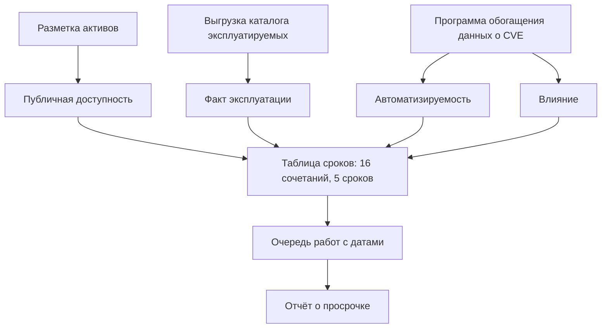
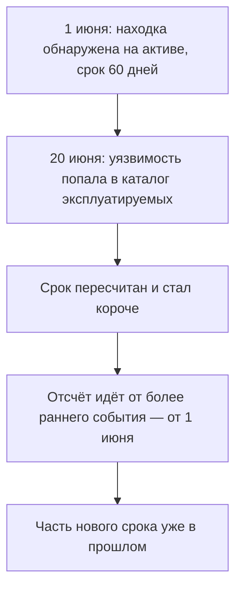

# SLA на устранение и приоритизация бэклога

Две находки лежат в одном отчёте, и обе дают атакующему полный контроль над
системой. Первая получает срок «три дня и криминалистический разбор»: её не
только чинят за три дня, но и проверяют, не успели ли ей воспользоваться.
Вторая, с тем же влиянием, получает «до планового обновления», то есть
никакого срока вовсе. Обе строки взяты из одной таблицы — действующей
директивы о сроках устранения, которую выпустило агентство кибербезопасности
США:

```text
доступен  в каталоге  автоматизируем  влияние     срок
да        да          да              полное      3 дня и разбор
нет       нет         нет             полное      до планового обновления
```

Таблица «уровень тяжести — число дней» такой разброс объяснить не может:
влияние в обеих строках худшее из возможных, а сроки противоположные. Разницу
делают другие переменные — доступен ли актив из интернета и стоит ли
уязвимость в каталоге эксплуатируемых, то есть наблюдается ли она в атаках.
Предмет темы — соглашение о сроках: договор, который назначает каждой находке
дату исчезновения. Ниже разобрано, как в этом образце срок считается от
четырёх переменных, от какого события он отсчитывается и что происходит с
очередью, когда каталог пополняется.

## Что такое соглашение о сроках

Соглашение о сроках — это договор, который назначает каждой находке дату, к
которой она должна исчезнуть. По-английски такой договор называется SLA,
service level agreement, «соглашение об уровне услуги». Внутри AppSec услуга
одна: уязвимость перестаёт существовать на активе. Дата из договора превращает
находку в обязательство: у неё появляется срок, и по нему видно, успевает
команда или нет.

Бытовой пример — договор с интернет-провайдером. В нём записано, что аварию
на линии устранят за четыре часа, а за просрочку положена неустойка.
Соответствие прямое: услуга — это устранение находки, а срок из договора —
срок из таблицы. Ломается пример на неустойке: разработчика за прошедшую
дату не штрафуют деньгами. Внутреннее соглашение держится не на штрафе, а на
том, что просрочка видна всем.

Без такого договора список находок остаётся списком: сорок строк, у каждой
уровень тяжести, и ни у одной нет даты. Очередь работ появляется, только
когда у строки есть срок: теперь видно, что делать к какому числу и что уже
просрочено. Конструкция знакома по бэклогу задач в разработке — это
необработанный хвост работ с приоритетами. Здесь бэклог — хвост находок, и
приоритет в нём считается по таблице, а не спорится заново на каждой строке.
До соглашения находки проходят дедупликацию и разбор ложных срабатываний —
это темы `finding-deduplication` и `triage-false-positives`; соглашение
начинается там, где находки уже настоящие.

Образец соглашения, разобранный в этой теме, — директива CISA. Агентство
пишет такие директивы для федеральных ведомств США, и для них это не совет,
а требование со сроками. Для нас директива — не закон, а нормативный образец:
действующее соглашение, написанное чужой рукой и проверенное на чужом
бюджете. Читать её стоит как чужой протокол, который уже пожил в бою.

**Зачем это в работе AppSec-инженера.** Разговор о сроке — самый частый
разговор с разработчиком после разговора о самой находке. Соглашение, в
котором срок выведен из переменных, этот разговор заканчивает: спор о важности
заменяется проверкой фактов. Соглашение «критичное чиним быстро» — начинает
его заново каждый раз.

## Как это работает

**Откуда это взялось.** Первые соглашения о сроках были таблицей «уровень
тяжести — число дней»: критичное чинится за неделю, высокое за месяц.
Держались они на допущении, что тяжесть отражает опасность. Допущение не
выдержало проверки: уязвимости с одинаковым баллом различаются по
вероятности эксплуатации в сто раз, — этот разбор есть в `cve-cvss`. Ответом стали каталог наблюдаемой эксплуатации и модели
вероятности. Действующая директива от 10 июня 2026 года отменяет два прежних
документа. Первый задавал сроки для доступных из интернета систем, второй
завёл каталог эксплуатируемых уязвимостей. На смену обоим пришла одна таблица
от четырёх переменных.

**Четыре переменные.** Срок выводится из четырёх вопросов с ответами «да»
или «нет».

Первый вопрос: доступен ли уязвимый актив из интернета. Бытовой пример — две
квартиры с одинаковыми замками: у одной дверь выходит на улицу, у другой —
в подъезд с домофоном. Отмычка к обоим замкам одна, а очередь желающих
разная, потому что до второй двери ещё надо добраться. Ломается пример на
доставке: до подъезда идут ногами, а адрес в интернете перебирают машины, и
до любой двери там одинаково близко. Эта переменная берётся из собственной
разметки активов — реестра своих систем с пометкой, видна ли каждая снаружи.

Второй вопрос: стоит ли уязвимость в каталоге эксплуатируемых. Это тот самый
каталог KEV из `cve-cvss`: список уязвимостей, для которых зафиксирована
эксплуатация в реальных атаках. Там же разобрано его отличие от оценки
вероятности: каталог говорит «уже случилось», а не «вероятно». Переменная
берётся из выгрузки каталога.

Третий вопрос: автоматизируема ли эксплуатация, то есть сводится ли она к
готовому скрипту, который один атакующий запускает тысячей копий. Вскрытие
замка руками — одна квартира в час; машинка, которая перебирает сама, — весь
квартал за ночь. Соответствие прямое: руки — это ручной разбор, машинка —
готовый скрипт. Ломается пример на доставке снова: машинку не надо везти,
она стучится во все двери сразу.

Четвёртый вопрос: какое влияние получает атакующий — полный контроль над
активом или частичный. Директива сама оговаривает, что техническое влияние
«похоже на понятие severity из базового балла CVSS»; что такое базовый балл,
разбирает `cve-cvss`.

Две последние переменные в своей сети не увидеть: их публикует программа
обогащения данных. Запись об уязвимости сама по себе короткая: описание да
ссылки. Обогащение — это служба, которая дополняет такую запись оценками:
какое у неё влияние и автоматизируема ли эксплуатация. Без этой службы на
третий и четвёртый вопросы пришлось бы отвечать на глаз.

Четыре вопроса с двумя ответами дают шестнадцать сочетаний, и таблица
директивы назначает им пять разных сроков:

```text
3 дня и криминалистический разбор     3 сочетания
3 дня                                 2
14 дней                               6
60 дней                               3
до планового обновления               2
```

Самый мягкий срок — «до планового обновления». Плановое обновление — это
регулярное окно обслуживания: систему обновляют по расписанию, скажем раз в
квартал, и находка без срока ждёт такого окна. Ждать окно — значит ждать
без даты.

Самый жёсткий срок требует криминалистического разбора, и не для устрашения.
Если уязвимость уже эксплуатируют против доступной извне системы, взлом мог
уже случиться, и одной починки мало. Разбор — это осмотр следов: журналы,
копии дисков, список сеансов. Бытовой пример — вскрытая квартира: замок
меняют, но сначала смотрят, что пропало. Ломается пример на следах: в квартире
их видит любой участковый, а в системе — только то, что попало в журналы.

**Вес переменных.** Вес меряется так: при прочих равных меняем одну переменную
и смотрим, изменился ли срок. Шестнадцать сочетаний при этом разбиваются на
восемь пар — внутри пары сочетания различаются только этой переменной.

```text
наличие в каталоге эксплуатируемых   меняет срок в 8 парах из 8
публичная доступность актива                       6 из 8
автоматизируемость эксплуатации                    6 из 8
техническое влияние                                5 из 8
```

Факт эксплуатации решает всегда. Тяжесть — реже всех остальных, и в трёх
парах из восьми разница между полным и частичным контролем не меняет ровно
ничего.

У каждого из четырёх вопросов свой источник, и соглашение держится на этих
источниках, а не на таблице:



**Описание схемы.** Схема читается сверху вниз. Три источника слева дают
четыре переменные: разметка активов отвечает за доступность, выгрузка
каталога — за факт эксплуатации, обогащение — за автоматизируемость и влияние.
Переменные входят в таблицу сроков, таблица превращает список находок в
очередь с датами, а очередь рождает отчёт о просрочке.

**Отсчёт.** Точка отсчёта — более раннее из двух событий: попадание уязвимости
в каталог эксплуатируемых или обнаружение её на своём активе. Срок считается
календарными днями от этой точки, а не от начала работы над находкой. Директива
добавляет к отсчёту свойство, которого таблица уровней не знает: сроки
динамические. Уязвимость, попавшая в каталог после публикации, сокращает свой
срок задним числом. Актив, убранный из интернета, свой срок удлиняет. Очередь
пересчитывается от внешних событий, а не только от того, что сделала команда.



**Описание схемы.** Схема читается сверху вниз и показывает пересчёт на датах.
Находка получила срок в момент обнаружения. Попадание уязвимости в каталог —
внешнее событие, от команды оно не зависит. Новый срок отсчитывается от той же
начальной точки, поэтому прошедшие дни учитываются в нём. Если новый срок
уложился в них целиком, находка просрочена в момент пересчёта.

## Что умеет и чего не умеет

**Что умеет соглашение о сроках.** Превратить спор о важности в проверку
фактов. Вопрос «это правда срочно?» заменяется четырьмя вопросами с ответами
«да» и «нет», и на каждый есть источник: разметка активов, выгрузка каталога
эксплуатируемых, данные обогащения. Спор остаётся только там, где расходятся
факты, а факт, в отличие от уверенности, проверяется.

Второе, что оно умеет, — делать невыполнение видимым. Находка без срока не
бывает просроченной, поэтому список без сроков всегда выглядит здоровым.
Отчёт о просрочке показывает долю находок с прошедшей датой и этим отличает
«у нас много работы» от «мы не успеваем».

**Чего оно не умеет.** Назвать порядок работ внутри одного срока. Четырнадцать
дней на шесть находок не говорят, какую брать первой; здесь работают
вероятность эксплуатации и поправка на приложение — `severity-assessment`.

Не умеет оно и учитывать пропускную способность команды. Соглашение задаёт
спрос, а не предложение: если поток находок больше того, что команда способна
закрыть, соглашение будет нарушаться, и никакая таблица этого не изменит.
Таблица это покажет — но не починит.

## Как запустить

Соглашение вводится в четыре шага, и первый из них — не про сроки.

1. Научиться отвечать на четыре вопроса машинно. Публичная доступность берётся
   из разметки активов, факт эксплуатации — из выгрузки каталога,
   автоматизируемость и влияние — из обогащения данных об уязвимостях.
2. Записать таблицу сроков и договориться о ней с теми, кто чинит. Без
   согласия чинящей стороны таблица — пожелание, а не договор.
3. Задать событие отсчёта и правило пересчёта: с какого события течёт срок и
   что происходит, когда актив ушёл из интернета или уязвимость попала в
   каталог.
4. Завести отчёт о просрочке — иначе первые три шага никак не наблюдаемы.

Если обогащения нет, честный вариант — соглашение на двух переменных:
доступности и факте эксплуатации. Таблица станет короче, но каждый ответ в
ней останется проверяемым. Почему это лучше заполнения на глаз, разобрано
ниже, в «Границах метода».

Практическая мелочь, которую лучше знать заранее: таблица директивы в её
web-версии опубликована **картинкой**, не текстом, и машинно прочитать её со
страницы нельзя. Если таблицу переносят в свой процесс, строки переписывают
руками и сверяют числом: сочетаний должно быть шестнадцать.

Вот пять строк из шестнадцати; последняя — та, где срока нет вовсе:

```text
доступен  в каталоге  автоматизируем  влияние     срок
да        да          да              полное      3 дня и разбор
да        нет         да              полное      3 дня
да        нет         нет             частичное   60 дней
нет       да          нет             частичное   14 дней
нет       нет         нет             полное      до планового обновления
```

## Как читать вывод

**Строка без срока — главное, что есть в таблице.** Уязвимость, дающая полный
контроль над активом, не получает срока, если актив недоступен извне, её не
эксплуатируют и её эксплуатацию нельзя автоматизировать. Это и есть ответ на
вопрос, почему тяжесть не задаёт очерёдность. Дефект с полным контролем ждёт
планового обновления, а средний на периметре чинится за две недели.

**Одна переменная задаёт потолок.** Все восемь сочетаний с публично доступным
активом укладываются в 60 дней; из восьми сочетаний с недоступным два не
имеют срока вовсе. Разметка активов по доступности извне поэтому дороже любой
другой работы по данным: она одна ставит потолок на всё, что на активе
найдётся.

**Прогон на настоящем отчёте.** Отчёт по составу приложения — это список
уязвимостей в зависимостях; как такой отчёт получают, разбирают `sbom` и
`trivy`. Отчёт со стенда подраздела 2.2 содержит 47 находок. Приложение
слушает все интерфейсы: оно принимает соединения на любом адресе своей
машины, а не только с `127.0.0.1`, где его видела бы лишь сама машина. Само
по себе это не выход в интернет — между машиной и сетью могут стоять файрвол
или трансляция адресов. На этом стенде машина смотрит наружу, поэтому
приложение считается публично доступным. Две находки из 47 стоят в каталоге
эксплуатируемых по снимку каталога.

```text
всего находок                                47
из них в каталоге эксплуатируемых             2  -> 14 дней и жёстче
уровня CRITICAL и HIGH по сканеру            21
без срока при публично доступном активе       0
```

Вилка во второй строке — от 14 дней до «3 дней и криминалистического
разбора». Точное место в ней задают автоматизируемость и влияние, а эти две
переменные на прогоне не проверялись.

Ноль в последней строке — не оборот речи. Публичная доступность вычёркивает
из таблицы обе строки «до планового обновления», и все 47 находок получают
срок, самый мягкий из которых — 60 дней. Список из 47 задач со сроком — это
уже не список, а обязательство, и вопрос сразу перестаёт быть техническим.

Посмотрите теперь на третью строку: двадцать одна находка уровня CRITICAL и
HIGH по сканеру. Срока эти уровни не задают — срок посчитан от доступности и
каталога, а оценка сканера в таблице не участвует. Именно поэтому разговор
«но это же критичное» соглашением и закрывается.

Какая из четырёх переменных в вашем хозяйстве известна хуже всего — и кому
принадлежит её источник?

**Чего в директиве нет.** Слово EPSS не встречается в ней ни разу. EPSS —
это модель, которая даёт вероятность эксплуатации уязвимости на ближайшие
30 дней; как она устроена, разобрано в `cve-cvss`. Работает она не
на сроке, а на очереди внутри срока: из нескольких находок с одной датой
первой берут ту, у которой вероятность выше.

## Границы метода

**Граница первая: директива написана не для вас.** Она обязательна для
федеральных агентств США и служит образцом, а не готовым соглашением. Переносу
подлежит устройство — срок как функция от переменных, — а не числа:
четырнадцать дней взяты из чужой оценки риска, чужого потока находок и чужой
пропускной способности.

**Граница вторая: две переменные из четырёх приходят снаружи.**
Автоматизируемость эксплуатации и техническое влияние публикует программа
обогащения данных. Без такого источника соглашение придётся строить на двух
переменных — доступности и факте эксплуатации. Это честнее, чем заполнять две
оставшиеся на глаз: соглашение живёт тем, что каждый ответ проверяем, а
оценка на глаз не проверяема.

**Граница третья: срок не отвечает за починку.** Соглашение говорит, к какому
числу находка исчезнет; способов исчезнуть несколько — обновление, отключение
уязвимой возможности, вывод системы из эксплуатации. Подмена одного другим —
обычное дело: отключить форму заказа проще, чем починить её. Отчёт о просрочке
такой подмены не показывает: в нём видно, что находка исчезла, а не чем
именно.

**Цена.** Ввод соглашения — не таблица, а разметка активов и выгрузка
каталога. На небольшом хозяйстве это дни; таблицу можно написать за час, и она
будет бесполезна, пока на первый вопрос отвечает человек по памяти.

## Частая ошибка

В выгрузке сканера уже есть уровни: тяжесть задаёт очерёдность, поэтому
соглашение о сроках — это таблица уровней тяжести. Проверьте интуицию вопросом:
в скольких сочетаниях из шестнадцати разница между полным и частичным
контролем меняет срок?

**Тяжесть — самая слабая из четырёх переменных, и в шести сочетаниях из
шестнадцати она не меняет срока вовсе.** При недоступном извне активе разница
между полным контролем и частичным — не ноль лишь в одной паре из четырёх: три
дня с разбором против четырнадцати дней. Разница между «эксплуатируется» и «не
эксплуатируется» — всегда ненулевая. Соглашение по тяжести спорит не с
атакующим, а с оценщиком.

Контрпример к обратному выводу — «значит, тяжесть не нужна». В сочетаниях с
публично доступным активом она разводит 14 дней и 60, а вместе с
автоматизируемостью — 3 дня и 14. Тяжесть работает, но как одна из четырёх
переменных, а не как вся таблица.

## Чеклист для ревью

1. Проверьте, что срок в соглашении выводится хотя бы из двух переменных, а не
   только из уровня тяжести.
2. Проверьте, что названо событие, от которого срок отсчитывается.
3. Проверьте, что задано правило пересчёта срока при изменении доступности
   актива или появлении уязвимости в каталоге эксплуатируемых.
4. Проверьте, что доступность актива извне берётся из разметки, а не из памяти
   инженера.
5. Проверьте, что в отчёте есть доля просроченных находок, а не только число
   открытых.
6. Проверьте, что при закрытии находки записано, чем она закрыта: обновлением,
   отключением возможности или выводом системы.

## Попробуй сам

Возьмите отчёт сканера по своему проекту и постройте очередь. Для каждой
находки ответьте на две переменные, которые вам доступны, — публичную
доступность актива и наличие в каталоге эксплуатируемых — и выпишите срок по
таблице. Первая берётся из разметки активов, вторая — из свежей выгрузки
каталога, снятой на дату построения очереди. Две остальные переменные приходят
с обогащением; без него останьтесь на двух, это честнее ответа на глаз.

Одна подсказка: начните с активов, а не с находок; после разметки активов
половина строк получит срок автоматически.

**Критерий выполнения** наблюдаемый. У вас есть список находок со сроками, в
нём есть хотя бы одна строка без срока, и вы можете назвать, какая переменная
эту строку освободила.

## Проверь себя

1. Две находки из отчёта:

   ```text
   находка               доступен  в каталоге  автоматизируем  влияние
   инъекция на периметре   да        нет         да              полное
   закладка внутри         нет       нет         нет             полное
   ```

   Выведите срок каждой по таблице директивы.
2. Почему разметка активов по доступности извне дороже прочей работы по
   данным?
3. Соглашение о сроках предлагают записать таблицей «уровень тяжести — число
   дней». Так работает?

   A. Да: критичное чинится быстро, остальное по убыванию тяжести.

   B. Нет: срок выводится из переменных, и тяжесть среди них — самая слабая.

   C. Да, если добавить к тяжести колонку «в каталоге эксплуатируемых».

4. Не запуская, предскажите, какой порядок напечатает эта очередь — и какое
   правило темы она исполняет.

   ```python
   days = {"3 дня": 3, "14 дней": 14, "60 дней": 60}
   queue = [("A", "14 дней", 0.01),
            ("B", "14 дней", 0.6),
            ("C", "3 дня", 0.02)]
   order = sorted(queue, key=lambda x: (days[x[1]], -x[2]))
   print([x[0] for x in order])
   ```

5. Возврат к теме `severity-assessment`: чем поправка на приложение отличается
   от переменной публичной доступности?
6. Возврат к теме `app-architecture`: переменная «публичная доступность»
   берётся из разметки активов. Что на карте приложения отвечает на этот
   вопрос?

<details markdown="1">
<summary>Ответ 1</summary>

1. Первая — 3 дня: доступен, не в каталоге, автоматизируема, полное влияние.
   Вторая — срока нет, «до планового обновления»: недоступна извне, не
   эксплуатируется, не автоматизируется. Две строки с худшим влиянием получили
   противоположные сроки — потому что срок решают другие переменные.

</details>

<details markdown="1">
<summary>Ответ 2</summary>

2. Она одна ставит потолок срока на всё, что на активе найдётся. У публично
   доступного самый мягкий срок — 60 дней; у недоступного срока может не быть
   вовсе. Ошибка в этой разметке двигает всю очередь разом.

</details>

<details markdown="1">
<summary>Ответ 3: разбор вариантов</summary>

3. Верный ответ — B.

   A. В трёх парах из восьми разница между полным и частичным контролем не
      меняет срока вовсе: соглашение по тяжести спорит не с атакующим, а с
      оценщиком.

   B. Срок — функция четырёх переменных: доступность, факт эксплуатации,
      автоматизируемость, влияние. Спор о важности она заменяет проверкой
      фактов, на каждый из которых есть источник.

   C. Получится таблица из двух переменных: факт эксплуатации в ней есть, а
      доступности и автоматизируемости нет — и периметр с внутренним активом
      снова получат один срок.

</details>

<details markdown="1">
<summary>Ответ 4</summary>

4. Напечатает `['C', 'B', 'A']`: срок первичен, а внутри одного срока первой
   берут находку с бóльшей вероятностью эксплуатации. Ответ получен прогоном:
   `python3 queue.py`. Это ровно место EPSS в теме: не на сроке, а на очереди
   внутри срока.

</details>

<details markdown="1">
<summary>Ответ 5</summary>

5. Поправка меняет балл тяжести и остаётся внутри организации; переменная
   публичной доступности меняет дату, а балла не трогает. Одна работает на
   оценку, другая — на обязательство.

</details>

<details markdown="1">
<summary>Ответ 6</summary>

6. Граница между узлами: что видно из интернета напрямую, что стоит за
   балансировщиком, что внутри контура. По карте «доступен публично» читается
   как «есть путь от чужого узла до актива», а не как свойство самого актива.

</details>

## Источники

1. CISA, «BOD 26-04: Prioritizing Security Updates Based on Risk»; реестр
   `cisa-bod-26-04`. Разделы: четыре переменные срочности, приложение A с
   таблицей сроков, определения публичной доступности, частичного и полного
   контроля, оговорка о динамических сроках и отмена BOD 19-02 и BOD 22-01.
   <https://www.cisa.gov/news-events/directives/bod-26-04-prioritizing-security-updates-based-risk>
2. FIRST (EPSS SIG), «Exploit Prediction Scoring System»; реестр
   `first-epss`. Разделы: что модель предсказывает и в каком окне.
   <https://www.first.org/epss/>

Каркас этапа: `cwe-taxonomy`. Наследуется всеми темами и отдельной строкой не
повторяется.

**Скоропортящийся слой.** Числа сроков и состав переменных действующей
директивы, состав каталога эксплуатируемых и числа отчёта по составу. Само
устройство — срок как функция от переменных — держится дольше чисел.

**Маркеры уверенности.** Таблица сроков прочитана **лично** 2026-08-25 со
страницы директивы, где она опубликована изображением; все шестнадцать строк
перенесены и пересчитаны: пять разных сроков, вес переменных 8, 6, 6 и 5 пар
из восьми. Отсутствие слова EPSS в тексте директивы проверено поиском по
выгруженной странице. Числа отчёта по составу — **лично** на сохранённом
прогоне подраздела 2.2: 47 находок, 21 уровня CRITICAL и HIGH, две в каталоге
эксплуатируемых. Листинг из вопроса 4 прогнан повторно 2026-10-03, Python
3.14.7; вывод совпал дословно. Две переменные из четырёх — автоматизируемость
и техническое влияние — на этих находках **не проверялись**: их публикует
программа обогащения, которая в этой работе не запрашивалась.
