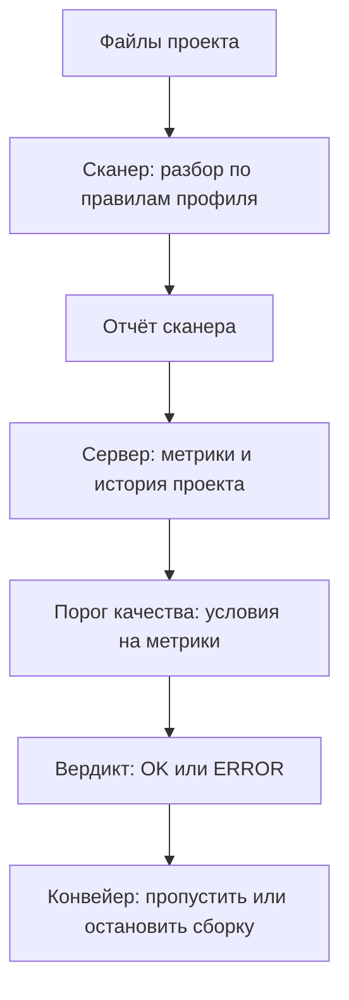

# SonarQube: quality gates и что они закрывают

На учебный стенд подставили три дефекта из тем этапа 1. В одном обработчике
запрос к базе собран подстановкой строки, в другом внешняя команда запущена
через оболочку, в третьем имя файла сложено с корнем каталога. Все три видны
прямо в тексте программы: такие дефекты статический анализ из темы
`sast-principles` ищет, не запуская код.

Стенд прогнали через SonarQube — сервер, который принимает отчёт сканера,
хранит историю проверок и сводит каждую в один вердикт. Прогон бесплатной
сборки — свободного варианта поставки — дал пять находок и вердикт `OK`, и по
трём подставленным дефектам в них нет ни строки.

Дело не в настройке: серверу задали прямой вопрос о трёх правилах через его
машинный интерфейс — набор адресов, по которым сервер отвечает данными, а не
страницами:

```text
GET /api/rules/search?rule_key=python:S3649   ->  total 0
GET /api/rules/search?rule_key=python:S2076   ->  total 0
GET /api/rules/search?rule_key=python:S2083   ->  total 0
```

Правил, ищущих внедрение SQL, команду операционной системы и путь к файлу, в
этой сборке нет вовсе: их не выключили, их не существует. А вердикт зелёный —
что он на самом деле проверил и как спросить об этом у самого сервера?

## Что такое порог качества

У SonarQube две части. Сканер разбирает файлы проекта по набору правил — это
статический анализ, метод темы `sast-principles`, — и отправляет отчёт на
сервер. Сервер хранит отчёты по проектам и считает по ним метрики. Метрика —
это одно свойство кода, измеренное одним числом, например число находок или
доля кода, покрытого тестами. Бытовой пример — температура в медицинской
карте: одно число, по которому судят о части состояния организма.

Порог качества, по-английски quality gate, — набор условий на метрики.
Условие собрано из трёх частей: метрика, оператор сравнения и пороговое
значение, например «новых уязвимостей больше нуля». Сработало хотя бы одно
условие — вердикт красный, не сработало ни одного — зелёный. Вердикт читает
конвейер: машина, которая на каждое изменение кода собирает проект,
прогоняет тесты и сканеры и решает, пускать ли изменение дальше. Порог
качества — та точка конвейера, где решение принимает сервер, а не человек.

Устройство порога похоже на выходной контроль в цеху. Контролёр меряет
деталь по карте измерений: диаметр в допуске, шероховатость в допуске — и
ставит печать «годно». Печать говорит «все пункты карты выполнены», а не
«деталь идеальна»: если в карте нет пункта про трещину, трещину никто не
искал. Соответствие прямое:

| В цеху | В SonarQube |
|---|---|
| карта измерений | порог качества |
| одна строка карты | условие |
| прибор, которым меряют | правило сканера |
| допуск из карты | пороговое значение |
| печать «годно» | зелёный вердикт |

Ломается аналогия на том, как устроена карта. У контролёра на каждый пункт
есть прибор, и пустого пункта в карте не бывает. У сервера условие стоит на
метрике, метрика считается по правилам, а правила в сборке может не быть
вовсе. Тогда измерение даёт ноль и печать стоит. Карта при этом выглядит
заполненной: по вердикту состав правил не восстановить, его спрашивают у
сервера отдельно.

**Зачем это в работе AppSec-инженера.** SonarQube стоит почти в каждом
конвейере, и его зелёный вердикт предъявляют как доказательство
безопасности: на ревью архитектуры, в переписке с заказчиком, в отчёте перед
релизом. Возразить на это можно только числами со своего кода. Какие правила
в сборке есть, какие условия стоят в пороге и какие классы дефектов остаются
за его пределами — дальше это проверяется на живом сервере.

## Как это работает

**Откуда это взялось.** До сервера отчёт сканера жил до следующего прогона,
и решение по нему принимал человек. Ломалось это на регулярности: отчёт
читают, пока он новый, а через месяц прогонов его никто не открывает.
Ответом стали две вещи. Сервер, который хранит историю и показывает её по
проектам. И порог, который превращает набор метрик в один вердикт для
конвейера: решение принимает машина, а не человек с настроением.

Прогон устроен так. Сканер разбирает файлы проекта и отправляет отчёт на
сервер, сервер считает метрики и применяет к ним условия порога. Условие
задаётся на весь код или на новый; новым считается код, изменённый с заданной
точки, например с прошлого выпуска. Условия на новый код позволяют требовать
чистоты от свежих правок, не переписывая старый долг. Встроенный порог
называется Sonar way, и рядом с ним живёт встроенный профиль с тем же именем:
профиль — это набор правил языка, включённых в прогон.

Здесь важно различить два состояния правила. Первое: правило есть в сборке,
но выключено в профиле, — тогда его можно включить настройкой. Второе:
правила в сборке нет вовсе, и тогда включать нечего. Со стороны вердикта оба
состояния выглядят одинаково: ноль находок. Различаются они ответом сервера
на прямой вопрос о правиле — такой вопрос задан в начале темы и повторён в
разделе «Как читать вывод».



**Описание схемы.** Схема читается сверху вниз и показывает путь одного
прогона. Сканер разбирает файлы проекта и отправляет отчёт на сервер. Сервер
считает метрики и применяет к ним условия порога качества. Вердикт уходит в
конвейер, и тот решает, пропустить сборку или остановить. На схеме видна и
граница темы: состав правил, по которым посчитан вердикт, снаружи не виден —
он остаётся внутри сервера.

Дашборд — страница проекта на сервере: метрики, находки и вердикт порога
собраны на ней. Механика здесь сокращена до того, что нужно для чтения
дашборда и порога: тема — рецепт, а не концепт. Устройство самого анализа —
дерево разбора, правила, поток данных — разобрано в `sast-principles`, а
починка найденных дефектов — в темах `sqli-basics`, `os-command-injection` и
`path-traversal`.

## Что умеет и чего не умеет

**Что умеет.** Хранить историю прогонов по проектам и считать метрики по
всему коду и по новому отдельно. Сводить метрики в один вердикт для
конвейера. Держать наборы правил профилями и свои пороги качества — всё это
есть и в бесплатной сборке. Отдавать результаты машинным интерфейсом: теми же
адресами пользуется конвейер, и человек с `curl` может спросить сервер
напрямую.

**Чего не умеет — в бесплатной сборке.** У SonarQube есть официальная таблица
возможностей: строки в ней — функции, столбцы — варианты поставки. Строка
«Injection vulnerabilities detection», поиск инъекций, у бесплатной сборки
пуста, а у платных отмечена. Дальше по таблице: разбор ветвей — только
магистральной, то есть главной; анализа запросов на слияние нет; блокировать
слияние по красному вердикту она тоже не умеет. Расширенный статический
анализ безопасности значится начиная с корпоративного варианта.

## Как запустить

Сервер поднимается образом, сканер — вторым образом, поэтому из установки
нужен только сам Docker. Образ — это готовый пакет с программой и её
окружением: `docker run` разворачивает пакет в работающий процесс, ничего
другого ставить в систему не нужно. Всё локально, без регистрации. Ключ `-d`
запускает сервер в фоне и возвращает терминал, `--name sq` даёт контейнеру
имя, по которому его останавливают. Ключ `-p 9000:9000` выставляет порт
сервера наружу: веб-интерфейс и машинный интерфейс открываются на порту 9000.

```bash
# SonarQube Community Build 26.8.0. Сервер.
docker run -d --name sq -p 9000:9000 sonarqube:community
```

Дальше нужны проект и ключ доступа. Проект — это имя на сервере, под которым
будут храниться прогоны; ключ доступа, или токен, — строка-пароль для
машинного интерфейса, чтобы сервер знал, чей это прогон. И то и другое
заводится через веб-интерфейс на порту 9000 или тем же машинным интерфейсом.
Прогон сканера:

```bash
# Сканер отдельным образом; каталог проекта монтируется в /usr/src.
docker run --rm --network host -v "$PWD/src:/usr/src" \
  sonarsource/sonar-scanner-cli \
  -Dsonar.projectKey=demo -Dsonar.host.url=http://localhost:9000 \
  -Dsonar.token=$TOKEN
```

Ключ `--rm` удаляет контейнер после прогона, чтобы он не копился в системе.
Ключ `--network host` пускает контейнер сканера по сети вашей машины:
`localhost:9000` внутри контейнера — тот же сервер, чей порт выставлен первой
командой. Каталог проекта монтируется, то есть подключается, внутрь
контейнера: сканер видит его как `/usr/src`. Результат читается не из вывода
сканера, а с сервера: вывод говорит только о том, что отчёт загружен.
Замените `demo` на имя своего проекта, а `$TOKEN` — на выданный сервером
токен.

## Как читать вывод

Для разбора прогона достаточно двух запросов к машинному интерфейсу: список
находок и состояние порога. Первый отвечает на вопрос «что нашлось», второй —
на вопрос «пропускать ли сборку». Оба — обычные GET-запросы, их можно
выполнить хоть браузером, хоть `curl`:

```text
GET /api/issues/search?componentKeys=<ключ>
GET /api/qualitygates/project_status?projectKey=<ключ>
```

Замените `<ключ>` на имя проекта на сервере — в примере запуска выше это
`demo`. Первый запрос возвращает находки списком, второй — вердикт и
состояние каждого условия порога. Дальше оба запроса выполнены на учебном
стенде, и их ответы разобраны строка за строкой.

Стенд — четыре обработчика веб-каркаса на Python с тремя подставленными
дефектами: запрос собран подстановкой, внешняя команда запущена через
оболочку, имя файла сложено с корнем каталога. Прогон бесплатной сборки дал
пять находок. До чтения разбора отметьте про себя, какие из пяти строк
отвечают подставленным дефектам.

```text
строка 7   python:S4502  SECURITY HIGH   Make sure disabling CSRF is safe
строка 15  python:S6965  MAINTAINABILITY Specify the HTTP methods ...
строка 24  python:S6965  MAINTAINABILITY Specify the HTTP methods ...
строка 34  python:S6965  MAINTAINABILITY Specify the HTTP methods ...
строка 42  python:S6965  MAINTAINABILITY Specify the HTTP methods ...
```

Каждая строка — одна находка: место в файле, идентификатор правила, тип и
важность, текст правила. Четыре строки из пяти — правило `python:S6965` типа
`MAINTAINABILITY`, сопровождаемость: обработчик не называет, какие методы
HTTP принимает. Пятая — `python:S4502`, тип `SECURITY`, важность высокая: в
настройках каркаса отключена защита от CSRF (Cross-Site Request Forgery,
подделка межсайтового запроса; механика атаки разобрана в `csrf-mechanics`).
Находка настоящая, но к подставленным дефектам она не относится.

По трём подставленным дефектам — ни одной находки. Точек внимания к
безопасности тоже ноль. Точка внимания — место, которое сервер просит
проверить глазами: оно не обязано быть дефектом, но решение принимает
человек. Состояние порога — `OK`. Проверить, дефект это настройки или свойство
сборки, можно тем же интерфейсом: спросить у сервера про конкретное правило.

```text
GET /api/rules/search?rule_key=python:S3649   ->  total 0
GET /api/rules/search?rule_key=python:S2076   ->  total 0
GET /api/rules/search?rule_key=python:S2083   ->  total 0
```

Идентификаторы в запросах — правила поиска внедрения SQL, внедрения команды
операционной системы и подстановки пути к файлу для Python. Ответ `total 0`
по всем трём означает: правил в сборке нет вовсе. Они не выключены в профиле —
их не существует, и включать нечего. В профиле Sonar way при этом активны 389
правил для Python: сборка не пустая, и именно поэтому зелёный вердикт выглядит
убедительно. Картина совпадает с таблицей возможностей, где строка про поиск
инъекций у бесплатной сборки пуста.

Отсюда развёрнутый ответ на вопрос темы. Порог считает по набору правил,
который есть, и молчит про набор, которого нет. Вердикт `OK` на стенде с
тремя дефектами и вердикт `OK` на честно чистом проекте выглядят одинаково.
Различаются они одним: ответом сервера на вопрос о составе правил. «Ноль
находок» и «не искали» в вердикте неотличимы, и это не тонкость настройки, а
свойство метрики.

Что делать с настоящими дефектами, найденными другими инструментами,
разбирают темы `sqli-basics`, `os-command-injection` и `path-traversal`.
Классы этих дефектов — `CWE-89`, `CWE-78` и `CWE-22` по каталогу CWE, общему
словарю классов дефектов. У находок по этим классам в описании правила стоит
номер класса CWE, и по нему тема с разбором и починкой находится в указателе
гайдбука.

## Границы метода

**Граница первая: вердикт считается по метрикам.** Порог не знает про
конкретную находку — он знает про число и рейтинг, буквенную оценку от A до
E, по которой тоже ставят условия. Условие «нет блокирующих проблем»
выполнено ровно тогда, когда ни одно правило такую проблему не подняло. В это
«ровно тогда» входит и случай, когда правила нет вовсе: молчание прибора и
отсутствие прибора дают одинаковое число.

**Граница вторая: бесплатная сборка не покрывает инъекции.** Это измерено
прогоном на стенде и подтверждено таблицей возможностей: два независимых
источника говорят одно. Закрывается дыра другим инструментом рядом, а не
настройкой: для Python это `bandit`, для Go — `gosec`, для межфайлового
анализа с потоком данных — `codeql`. Как именно они делят работу, разобрано в
их темах.

**Цена.** Сервер требует своей машины и обслуживания: база данных, индекс
поиска, обновления версий. Сам прогон сканера на одном файле — около трёх
секунд, оценка по одному прогону. Основная цена не в прогоне, а в содержании
сервера: он живёт постоянно, а не во время проверки.

## Частая ошибка

Зелёный порог качества играет роль сертификата: вердикт `OK` предъявляют
заказчику и себе как «проверка безопасности пройдена». Что именно он
подтверждает — ответьте про себя, прежде чем читать дальше. Опора для ответа
у вас уже есть: прогон стенда, где три дефекта подставлены, а вердикт
зелёный.

**Зелёный вердикт означает выполнение условий, а не отсутствие дефектов.** На
стенде с тремя подставленными инъекциями бесплатная сборка дала вердикт `OK`.
Причина не в настройке порога и не в профиле: правил, которые ищут эти классы
дефектов, в сборке нет. Порог честно посчитал ноль находок по классам,
которых он не искал, — и выполнил ровно то, что обещал.

Контрпример к обратному выводу: сам по себе порог не бесполезен. Из пяти
находок стенда одна была настоящей и относилась к безопасности — отключённая
защита от подделки запроса в настройках каркаса. Инструмент видит то, что
описано его правилами, и вопрос не «доверять ли вердикту», а «что именно
входит в набор, по которому он посчитан». На этот вопрос есть машинный ответ,
и раздел «Как читать вывод» показывает, как его получить.

## Чеклист для ревью

1. Проверьте, что вариант сборки назван рядом с вердиктом: бесплатная и
   платные различаются составом правил, а не только ценой.
2. Проверьте, что состав правил проверен запросом к серверу по конкретному
   идентификатору, а не по названию языка.
3. Проверьте, что условия порога прочитаны целиком, включая то, на каком коде
   каждое стоит, — на всём или на новом.
4. Проверьте, что классы, не покрытые сборкой, закрыты другим инструментом,
   а не объявлены отсутствующими по зелёному вердикту.
5. Проверьте, что число просмотренных файлов в отчёте сканера сопоставлено с
   объёмом проекта.
6. Проверьте, что зелёный вердикт не предъявляется как результат проверки
   безопасности без списка того, что в нём посчитано.

## Попробуй сам

Поднимите бесплатную сборку локально, как в разделе «Как запустить», и
прогоните сканер по своему проекту — любому, даже учебному. Дальше ответьте
на два вопроса запросами к серверу. Первый: какие условия стоят в пороге,
который применился к вашему прогону. Второй: есть ли в сборке правило на
класс дефекта, который важен именно вам, — идентификатор возьмите из темы
этого класса или из документации.

Одна подсказка: наличие правила проверяется поиском по идентификатору, и
пустой ответ означает, что правила нет в сборке, а не что оно выключено в
профиле. **Критерий выполнения** наблюдаемый: список условий порога со
значениями и рядом ответ сервера по идентификатору правила — есть оно в
сборке или нет.

## Проверь себя

1. Сервер ответил на запрос о состоянии порога:

   ```json
   {"projectStatus": {"status": "OK", "conditions": [
     {"metricKey": "new_vulnerabilities",
      "actualValue": "0", "status": "OK"}]}}
   ```

   Зелёный ли это вердикт и что он говорит о дефектах в проекте?
2. Почему на стенде с тремя подставленными инъекциями вердикт оказался
   зелёным?
3. Зелёный порог качества предъявляют заказчику как результат проверки
   безопасности. Что он подтверждает на самом деле?

   A. Что классов дефектов, за которые отвечает порог, в проекте нет.

   B. Что условия порога выполнены — по тем классам, которые сборка вообще
      ищет.

   C. Что критические находки разобраны и закрыты.

4. Не запуская, предскажите, что напечатает этот расчёт вердикта.

   ```python
   status = {"conditions": [
       {"metric": "new_vulnerabilities", "op": "GT",
        "threshold": "0", "actual": "0"},
       {"metric": "new_coverage", "op": "LT",
        "threshold": "80", "actual": "74"},
   ]}

   def verdict(s):
       check = {"GT": lambda a, t: a > t, "LT": lambda a, t: a < t}
       bad = [c["metric"] for c in s["conditions"]
              if check[c["op"]](float(c["actual"]), float(c["threshold"]))]
       return "ERROR, упавшие условия: " + ", ".join(bad) if bad else "OK"

   print(verdict(status))
   ```

5. Возврат к теме `os-command-injection`: правило подняло две строки —
   `os.system("ping " + h)` и `subprocess.run(["ping", h])`. Обе находки
   настоящие?
6. Возврат к теме `sast-principles`: к какой причине молчания относится
   отсутствие правила в наборе?

<details markdown="1">
<summary>Ответ 1</summary>

1. Вердикт зелёный: условие по новым уязвимостям выполнено. О дефектах он
   говорит ровно одно: по набору правил, который есть в сборке, новых находок
   нет. Про классы, которых в наборе нет, порог молчит: «ноль находок» и «не
   искали» в нём неотличимы.

</details>

<details markdown="1">
<summary>Ответ 2</summary>

2. Потому что правил, ищущих внедрение SQL, команду и путь к файлу, в
   бесплатной сборке нет вовсе. Они не выключены в профиле — их не существует.
   Порог честно посчитал ноль находок по классам, которых он не искал.

</details>

<details markdown="1">
<summary>Ответ 3: разбор вариантов</summary>

3. Верный ответ — B.

   A. «Нет» неотличимо от «не искали»: на стенде темы с тремя подставленными
      инъекциями стоял тот же `OK`. Вердикт без списка того, что в нём
      посчитано, о безопасности не говорит.

   B. Порог считает условия по метрикам: зелёный — значит выполнены. Состав
      классов, по которым посчитано, проверяется отдельно, запросом к серверу
      по идентификатору правила.

   C. Порог считает числа и рейтинги, а не решения людей: разбор находки в
      метрику не попадает, и закрытость он не проверяет.

</details>

<details markdown="1">
<summary>Ответ 4</summary>

4. Напечатает `ERROR, упавшие условия: new_coverage`. Вердикт красный, хотя
   новых уязвимостей ноль: красным его делает любое сработавшее условие, а не
   только условие про безопасность. Ответ получен прогоном:
   `python3 gate.py`.

</details>

<details markdown="1">
<summary>Ответ 5</summary>

5. Первая настоящая: строка команды собирается склейкой и отдаётся оболочке,
   и метасимволы в `h` разбираются ею. Вторая ложная по существу: список
   аргументов без оболочки не склеивает команду, и `h` остаётся одним
   аргументом, каким бы ни было его содержимое.

</details>

<details markdown="1">
<summary>Ответ 6</summary>

6. К причине «правила нет в наборе». Признак тот же: тот же код на другом
   наборе правил или на другом инструменте даёт находку.

</details>

## Источники

1. Sonar, «Understanding quality gates»; реестр `sonarqube-quality-gates`.
   Разделы: порог как набор условий на метрики, условия на весь код и на
   новый код, встроенный порог Sonar way, отдача вердикта в конвейер.
   <https://docs.sonarsource.com/sonarqube-server/quality-standards-administration/managing-quality-gates/introduction-to-quality-gates>
2. Sonar, «Feature comparison table»; реестр `sonarqube-feature-comparison`.
   Разделы: строка «Injection vulnerabilities detection» у бесплатной сборки
   пуста; расширенный статический анализ — от корпоративного варианта; разбор
   ветвей — только магистральной; анализа запросов на слияние и блокировки
   слияния по вердикту нет.
   <https://docs.sonarsource.com/sonarqube-community-build/feature-comparison-table>
3. NIST, «Source Code Security Analysis Tool Functional Specification»,
   SP 500-268 версии 1.1; реестр `nist-sp-500-268`. Разделы: определение
   ложного пропуска.
   <https://www.nist.gov/publications/source-code-security-analysis-tool-functional-specification-version-11>

Каркас этапа: `cwe-taxonomy`. Наследуется всеми темами и отдельной строкой не
повторяется.

**Скоропортящийся слой.** Номер версии сборки, состав правил и профилей, имена
метрик и условий встроенного порога, состав таблицы возможностей. Устройство
порога — условия на метрики и один вердикт — держится дольше.

**Маркеры уверенности.** Пять находок на стенде из четырёх обработчиков, из
них ни одной по трём подставленным инъекциям; ноль точек внимания к
безопасности; вердикт `OK`; пустые ответы сервера по трём идентификаторам
правил; 389 активных правил Python в профиле Sonar way — **проверено лично**
2026-08-25 на SonarQube Community Build 26.8.0.126808 и образе сканера
`sonarsource/sonar-scanner-cli`. Время прогона — **оценка по одному прогону**.
Устройство порога и состав возможностей вариантов — **по документации** Sonar,
открытой лично 2026-08-25. Платные варианты **не воспроизводились**: лицензии
нет, и всё сказанное о них взято из таблицы возможностей. Листинг из вопроса
4 прогнан повторно 2026-10-03, Python 3.14.7; вывод совпал дословно.
