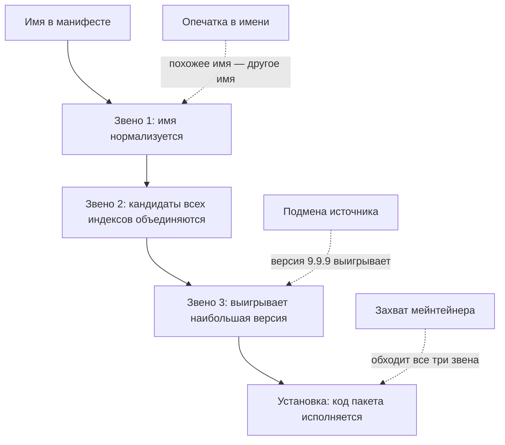

# Модель угроз цепочки поставок

Команду `pip install <имя>` вы писали десятки раз и не думали, что за ней
стоит. А стоит за ней цепочка из трёх решений, и каждое принимает машина: как
привести имя к канону, откуда взять кандидатов, какая версия выиграет. Вот
что получается на учебном стенде, когда одно звено подменено:

```text
только приватный индекс      -> версия 1.0.0, источник internal
приватный + публичный        -> версия 9.9.9, источник attacker
```

Обе строки сняты с одной и той же команды и одного и того же манифеста —
файла, где проект перечисляет нужные ему библиотеки. Разница между прогонами —
одно слово `--extra-index-url` в конфигурации. Внутренний пакет молча заменён
чужим: установщик выбрал наибольшую версию из двух источников, как ему и
положено по правилам. Установка не сломалась, тесты прошли, никто ничего не
заметил: взлома здесь не было, подмена собралась из трёх штатных решений
самого установщика. Подумайте до дальнейшего чтения: окажись во внутреннем
индексе версия выше атакующей — подмена бы исчезла или сместилась на другое
звено?

## Что такое цепочка поставок

Приложение состоит не только из кода, который написала команда. На каждую свою
строку приходятся сотни чужих: библиотеки, библиотеки этих библиотек, базовый
образ контейнера (стартовый набор файлов, поверх которого собирается ваш код),
инструменты сборки. Всё это код, который запускается с теми же правами,
что и ваш, но писали его посторонние люди. Путь, по которому чужой код
попадает в сборку, называют цепочкой поставок: имя в манифесте, реестр
пакетов, выбор версии, установка.

Бытовой пример — обед в столовой. Повар не выращивал овощи и не лепил конфеты:
продукты привезли поставщики, и повар им доверился. Отравление случается из-за
испорченной партии на чужом складе, а не из-за рук повара. Соответствие
прямое: повар — ваша команда, поставщики — авторы библиотек, испорченная
партия — подменённый пакет. Ломается аналогия на проверке: продукт на складе
можно хотя бы понюхать, а содержимое пакета перед установкой не читает никто.

Атака на цепочку поставок — это подмена: на одном из звеньев вместо ожидаемого
кода встаёт чужой, причём до того, как код дойдёт до сканера уязвимостей.
Большинство таких атак сводится к трём семействам. Опечатка в имени
(typosquatting) — чужой пакет с похожим именем ждёт вашей ошибки при наборе.
Подмена источника (dependency confusion) — чужой пакет носит точное имя вашего
внутреннего и лежит там, куда ваш установщик тоже смотрит.

Захват мейнтейнера устроен иначе: имя и источник правильные, но за учётной
записью автора уже другой человек. Первые две атаки бьют по звену «как имя
находит код», третья — по звену «кто стоит за кодом». Третья и опаснее всего:
против неё не спасают ни правильное имя, ни правильный источник.

Класс вырос настолько, что категории OWASP выделили ему отдельную строку
`A03:2025`, «цепочка поставок ПО». До редакции 2025 года этот риск сидел
внутри категории про уязвимые и устаревшие компоненты. Доля инцидентов, где
вошли через чужой код, а не через свой, стала слишком велика, чтобы держать её
приложением к другим категориям.

**Зачем это в работе AppSec-инженера.** Ревью кода видит то, что написала
команда; цепочку поставок оно не видит вовсе, а именно там растёт доля
инцидентов. Инженера спрашивают не «безопасен ли наш код», а «что попадает в
сборку и откуда мы знаем, что это именно оно». Ответить на этот вопрос, не
понимая, как имя превращается в установленный артефакт, нельзя.

## Подумай, прежде чем читать

1. Когда вы пишете `pip install shop-telemetry`, кто и по какому правилу решает,
   какой именно файл скачается и запустится?
2. Если у вас есть внутренний пакет `shop-telemetry` и кто-то выложил пакет с
   тем же именем в публичный реестр — чей код установится?
3. Что именно доказывает то, что пакет скачан с официального реестра: что его
   написал тот, кому вы доверяете, или что-то другое?

## Как это работает

**Откуда это взялось.** Раньше зависимости приносили руками: скачал архив,
положил в проект, при желании прочитал. Так проект на сотни пакетов не собрать
и тем более не обновить. Появились реестры — общие склады, куда автор
выкладывает библиотеку под именем, — и менеджеры пакетов: программы, которые
по этому имени сами находят, скачивают и ставят код.

Выигрыш был огромным, но у него была цена, которую заметили не сразу: доверие
к коду свернулось до доверия к имени. Пока пакетов были десятки и авторов
знали в лицо, это работало. Когда их стали тысячи, дело усугубили транзитивные
зависимости, то есть зависимости ваших зависимостей: граф ушёл на глубину,
которую никто не читает. Имя осталось единственным, на что смотрит установка.
На этом свёртывании и стоят все три атаки.

Имя — слабое звено: оно короткое, набирается руками, занимается кем угодно
первым и ничего о содержимом не гарантирует. Атака на цепочку поставок — не
новый класс дефекта в коде, а расплата за то, что доверие к сотням авторов
заменили доверием к строке в манифесте. Поэтому разбор дальше идёт не по
вредоносному коду, а по звеньям, где подменяется доверие. Превращение имени в
скачанный файл идёт через три звена, и на каждом — своё допущение о доверии.

**Звено первое: имя нормализуется.** Реестр приводит имя к канону, прежде чем
искать: в PyPI регистр не важен, а дефис и подчёркивание сводятся к одной
форме [^3]. Поэтому `Shop_Telemetry` и `shop-telemetry` — один пакет, и
опечаткой в разделителе промахнуться нельзя. А вот `shop-telementry` с лишней
буквой — уже другое имя: похожие для глаза написания, их называют
confusables, для реестра различны. Нормализация трогает регистр и разделители,
но не состав букв. Ровно в этом зазоре между «похоже для глаза» и «различно
для реестра» и живёт опечатка.

**Звено второе: выбирается источник.** Менеджер пакетов держит список
индексов — адресов реестров, где искать файлы. Ключевой факт: при нескольких
индексах `pip` не считает один «своим», а другой «запасным». Он объединяет
кандидатов из всех индексов в один список и выбирает среди него [^2]. Слово
`--extra-index-url` вводит в заблуждение корнем «extra»: кажется, что это
дополнительный, подчинённый источник, а на деле он равноправен основному.
Здесь подмена источника получает доступ к выбору: чужой пакет с внутренним
именем становится таким же кандидатом, как ваш. Доверие к своему реестру на
соседей по списку не переносится.

**Звено третье: выбирается версия.** Из всех кандидатов с подходящим именем
берётся наибольшая версия, если запрос не сузил её [^2]. Это и есть рычаг
подмены: чтобы чужой пакет выиграл, атакующему довольно выложить в публичный
индекс версию больше вашей внутренней. Угадывать пароль или взламывать реестр
не нужно — нужно знать имя внутреннего пакета и поставить `99.0.0`. Дальше
решает число.



**Описание схемы.** Схема читается сверху вниз и показывает путь от строки в
манифесте до исполненного кода: нормализация имени, объединение кандидатов со
всех индексов, выбор наибольшей версии, установка. Пунктиром подписано, на
каком звене живёт каждая из трёх атак. Опечатка стоит на нормализации: похожее
для глаза имя для реестра другое. Подмена источника стоит на выборе версии:
чужой кандидат выигрывает числом. Захват мейнтейнера стоит за всей цепочкой:
до исполнения доходит код с правильными именем, источником и версией.

Разные экосистемы устроены похоже, и это важно: атака переносится между ними
почти без изменений. В npm имена бывают в глобальном пространстве (`lodash`) и
в пространстве организации (`@company/utils`). Scope, приставка с именем
организации, придуман как раз для того, чтобы имя `@company/*` нельзя было
занять чужому: регистрация такого префикса закреплена за владельцем. Но
проекты сплошь и рядом держат внутренние пакеты в глобальном пространстве, и
тогда защиты нет. Отличие защищённого имени от отданного чужим — один префикс.

В pip пространств имён нет вовсе: имя одно на весь PyPI, и внутреннее имя
защищено лишь тем, что вы заняли его первым. Правило выбора наибольшей версии
из объединённых индексов при этом общее. Поэтому модель угроз здесь про само
устройство «имя → реестр → версия», а конкретный менеджер — только его
воплощение. Разбирать её на pip и npm — значит разбирать один механизм на двух
его воплощениях.

**Почему установка пакета — это исполнение кода.** Отдельное допущение, без
которого модель угроз рассыпается: установка не сводится к копированию файлов.
У пакетов Python бывает шаг сборки: скрипт `setup.py` запускается прямо при
установке. У пакетов npm есть хуки жизненного цикла: команда `postinstall`
выполняется сразу после распаковки пакета. Оба механизма исполняются на
машине, которая ставит пакет, и с правами этой машины.

Значит, вредоносный код срабатывает не тогда, когда приложение вызовет функцию
из зависимости, а уже в момент `install`. Часто это машина разработчика или
сборочный сервер — CI (continuous integration, непрерывная интеграция),
конвейер, который собирает проект при каждом изменении. На таком сервере
лежат ключи и токены сборки. Поэтому «мы же ещё не выкатили в прод» не
защищает: точка исполнения — установка, а не запуск.

Захват мейнтейнера обходит все три звена сразу: имя правильное, источник
официальный, версия ожидаемая. Но за учётной записью автора теперь стоит
другой человек, и новый выпуск несёт закладку. Так была устроена закладка в
`xz-utils` (`CVE-2024-3094`, 2024). Участник проекта годами вносил безобидные
правки и вошёл в доверие, а затем протолкнул в релиз обфусцированный бэкдор.
Обфускация здесь — намеренное запутывание кода, чтобы ревью его не заметило.

Каталог угроз SLSA разбирает это как отдельный класс. SLSA (Supply-chain
Levels for Software Artifacts) — открытый свод по защите цепочки поставок: он
перечисляет звенья, где артефакт могут подменить, и меры против каждой
подмены. Общий принцип там формулируется так: доверие к артефакту нельзя
вывести из того, что он пришёл по правильному адресу под правильным именем.
Происхождение нужно доказывать отдельно [^1].

## Как это атакуют

Обе атаки на имена воспроизводятся локально, без выхода наружу: два индекса —
это два каталога, установка идёт из файлов. Публиковать что-либо в публичный
реестр для этого не нужно и запрещено: механизм виден и на стенде. Стенд
собран в лабе темы, и все выводы этого раздела сняты с него.

**Подмена источника.** Внутренний индекс несёт `shop-telemetry 1.0.0`,
публичный — `shop-telemetry 9.9.9` с чужим кодом. Прогон на стенде лабы:

```text
только приватный индекс      -> версия 1.0.0, источник internal
приватный + публичный        -> версия 9.9.9, источник attacker
```

Разница между строками — одно слово `--extra-index-url` на публичный индекс.
Установка не сломалась и не предупредила: она выбрала бóльшую версию, как
задумано её правилами. Атакующему не нужно ничего взламывать — довольно знать
имя внутреннего пакета и выложить версию побольше туда, куда ваш менеджер и
так смотрит.

А имена внутренних пакетов утекают сами: они попадают в опубликованные
`package.json`, в логи сборки, в вопросы на форумах. Именно так эту атаку и
показали впервые публично. В 2021 году исследователь собрал имена внутренних
пакетов крупных компаний из случайно опубликованных манифестов и выложил в
PyPI и npm пустышки с теми же именами. Они установились сами, в чужих сборках.

**Опечатка в имени.** В публичном индексе рядом с `shop-telemetry` лежит
`shop-telementry`. Прогон:

```text
опечатка установлена         -> shop-telementry 1.0.0
```

Ни слова о том, что имя похоже на другое. Расстояние между именами — одна
буква, но реестр видит два разных имени и ставит ровно то, что попросили.
Догадок о том, что человек имел в виду соседнее имя, он не строит. Для него
`shop-telementry` — обычное свободное имя, которое кто-то занял первым.

Достаточно одной опечатки в `requirements.txt` или в команде из инструкции —
и запустится чужой код. Опечатка тем и опасна, что не выглядит атакой:
разработчик набрал имя чуть неточно, установка прошла, тест позеленел — а на
шаге сборки уже отработал чужой `setup.py`. Реальные кампании typosquatting
шли именно так. Пакеты-двойники популярных имён — `python3-dateutil` вместо
`python-dateutil`, `jeIlyfish` через заглавную «I» вместо строчной «l» — при
установке крали SSH- и GPG-ключи, список файлов и список хостов. Месяцами они
висели в реестре, пока их не замечали.

**Захват мейнтейнера** на локальном стенде не воспроизвести: он требует чужой
учётной записи в чужом реестре, а это действие в чужой инфраструктуре. Но
разобрать его как механизм необходимо, потому что именно он остаётся, когда
две первые атаки закрыты. Схема одна и та же в разных инцидентах. Атакующий
получает права на популярный пакет: крадёт токен автора, обманом входит в
число сопровождающих заброшенного проекта, покупает пакет у уставшего автора.
Затем выпускает новую версию.

Дальше работают ваши же правила: имя закреплено, версия свежее, источник
официальный, и обновление приезжает само. Опасность здесь не в одном пакете,
а в его охвате. Скомпрометировав один популярный узел графа, атака попадает в
тысячи проектов, которые его и в глаза не видели: он у них транзитивная
зависимость зависимости.

## Как это выглядит в коде

Признак уязвимости к подмене источника — в конфигурации, а не в самом коде.
Найдите в этих трёх строках слабое место и назовите, чей пакет оно готово
пропустить:

```ini
# pip.conf или флаги CI: внутренний индекс объявлен «дополнительным»
index-url = https://pypi.org/simple/
extra-index-url = https://nexus.internal/simple/
```

Здесь доверенный внутренний индекс стоит `extra`, то есть равноправным
кандидатом рядом с публичным. Любой пакет с внутренним именем, выложенный в
PyPI с версией побольше, победит.

В npm тот же признак выглядит как внутренняя зависимость в глобальном
пространстве имён вместо scope организации. Скажите до чтения продолжения:
чего этой строке не хватает?

```json
{ "dependencies": { "company-auth": "^2.0.0" } }
```

Имя `company-auth` глобально, значит, его может занять кто угодно в публичном
npm; будь оно `@company/auth`, чужой пакет под ним туда бы не попал. Манифест
при этом выглядит совершенно обычно — и в этом всё дело: уязвимость здесь не в
строке кода, а в том, чего в ней нет.

Признак уязвимости к опечатке — незакреплённое имя, пришедшее из ненадёжного
места: из скопированной команды, из подсказки редактора, из старого README.
Отдельного маркера в коде у неё нет — есть только имя, которое никто не сверил
со списком того, что проекту действительно нужно. Поэтому ловится опечатка не
чтением манифеста, а сверкой манифеста со списком одобренных зависимостей:
глаз разработчика пропускает лишнюю букву, список — нет.

## Как защититься

Чинится не одним флагом, а тремя движениями, потому что и звеньев доверия три.

**Один источник истины для внутренних имён.** Внутренний индекс задаётся
`--index-url`, а не `--extra-index-url`; публичные пакеты берутся так, чтобы
внутренние имена искались только во внутреннем реестре. Правильная форма —
внутренний реестр как единственный вход, который сам проксирует публичные
пакеты, а не два равноправных индекса в командной строке. Тогда подмена версии
в публичном индексе вообще не участвует в выборе: для внутреннего имени
публичный кандидат не рассматривается вовсе.

**Пиннинг.** Имя закрепляется точной версией, а лучше и хешем содержимого,
чтобы даже правильное имя не подтянуло неожиданный файл. Хеш закрывает то, что
версия не закрывает. Злоумышленник, перевыпустивший ту же версию с другим
содержимым, не пройдёт проверку `--require-hashes`: установка упадёт, а не
молча возьмёт подменённый файл. Насколько глубоко это закрывает граф
зависимостей и что делает lock-файл — тема `transitive-dependencies`, она
стоит следом в маршруте. Здесь важно другое: незакреплённое имя оставляет
открытым и первое звено (какое имя), и третье (какая версия).

**Резервирование имён.** Внутренние имена регистрируются в публичном реестре
как пустышки или под своим scope (в npm — `@company/name`), чтобы атакующий не
мог занять их первым. Это не показать на локальном стенде, не выходя наружу.
Но именно оно закрывает подмену источника и опечатку в корне, а не по
симптому. Если внутреннее имя уже занято вами в публичном реестре, чужой пакет
под ним туда не попадёт. Мера административная, а не техническая, и потому о
ней недолго забыть. Без неё два предыдущих движения защищают только текущую
конфигурацию установки, которую кто-нибудь однажды поменяет.

Захват мейнтейнера этими мерами не закрывается: имя, источник и даже хеш
конкретного вредоносного выпуска у него «правильные» — вредоносным стал сам
доверенный автор. Против него работает не пиннинг, а проверка происхождения
артефакта: подпись и provenance, доказательство того, кто и как это собрал.
Оба механизма разобраны в `artifact-signing`. И даже они не ловят намерение
кода, а лишь привязывают артефакт к сборочному конвейеру. Последний рубеж
против закладки — ревью изменений в зависимостях и настороженность к
обфускации, а не один инструмент.

## Как убедиться, что защита работает

Фикс проверяется наблюдением, а не рассуждением: та же установка после правки
обязана взять пакет из доверенного источника. На стенде это и есть критерий
проверялки — `ORIGIN` установленного пакета равен `internal`, версия `1.0.0`,
несмотря на публичный индекс с версией `9.9.9`:

```text
после фикса: установлен внутренний shop-telemetry 1.0.0 (internal)
```

Если проверять словами («мы же поставили правильный индекс»), подмена
возвращается незаметно: достаточно, чтобы кто-то в CI снова добавил
`--extra-index-url`, скопировав команду из чужого пайплайна. Поэтому проверка —
это повторный прогон установки в чистом окружении и сверка источника, а не
чтение конфигурации глазами.

Важна и негативная проверка — что фикс не сломал законную установку публичных
пакетов. Проект по-прежнему должен ставить нужные ему сторонние библиотеки,
иначе «починку» откатят на следующий же день. Хороший критерий поэтому
двойной: внутреннее имя берётся только из внутреннего источника, а публичное
ставится как прежде. На стенде лабы проверяется первое; второе проверяется
тем, что после фикса сборка проекта в целом продолжает собираться. Это общее
свойство любой меры против цепочки поставок: она обязана резать чужое, не
задевая нужного, и мера, которая ломает обычную установку, до продакшена не
доживает.

На ревью пройдите по списку.

1. Проверьте, что внутренний индекс задан через `index-url`, а не как
   `extra-index-url` рядом с публичным.
2. Проверьте, что имена внутренних пакетов зарезервированы в публичном реестре.
3. Проверьте, что прямые зависимости закреплены версией, а критичные — и хешем.
4. Проверьте, что список источников пакетов в CI совпадает с тем, что объявлено в
   политике, а не дополнен на ходу.
5. Проверьте, что новые имена зависимостей сверяются со списком нужного проекту, а
   не приходят из скопированных команд.
6. Проверьте, что на входе в сборку проверяется происхождение артефакта там, где
   это применимо, а не только наличие пакета.

## Как это находят инструменты

Сканеры состава, класс инструментов SCA (software composition analysis, анализ
состава), находят в зависимостях известные уязвимости. Они сверяют список
ваших пакетов с базами публичных записей о дефектах, а у каждой такой записи
есть номер вида `CVE-2024-3094`. Дальше по маршруту их разбирают темы `trivy`
и `dependency-track`. Такой сканер ловит устаревший пакет с публичной дырой,
но не новую закладку. У свежего вредоносного пакета записи в базе ещё нет, и
сканер по составу его пропустит.

Что автоматика действительно закрывает в цепочке поставок — это «неожиданный
источник» и «неожиданный состав». Работают здесь другие контроли, чем
сигнатурный поиск дефекта. Первый — политика разрешённых реестров: сборка
падает, если пакет пришёл не из одобренного источника. Второй — список
одобренных пакетов (allowlist) или, наоборот, заблокированных: новое имя в
зависимостях не проходит, пока его не рассмотрели.

Третий — SBOM, ведомость состава: машиночитаемый список всего, что вошло в
сборку. Она не находит атаку сама, но фиксирует состав и позволяет позже
спросить «а этого пакета мы не ждали»; ей посвящены темы `sbom` и
`dependency-track`. Четвёртый — эвристики на признаки вредоносности при
установке. Пакет, который в `postinstall` лезет в сеть или читает переменные
окружения, подозрителен независимо от того, есть ли на него запись CVE.

То есть машина ловит нарушение процесса — чужой источник, незаявленный пакет,
странное поведение при установке, — а не намерение кода. Поэтому против
подмены имени главный контроль стоит раньше сканера: в конфигурации установки
и в политике реестра. Не в отчёте, который читают после того, как чужой
`postinstall` отработал. Тогда уже поздно.

## Частая ошибка

Репутация реестра переходит на пакет: если пакет ставится с официального
реестра, он безопасен — реестр же проверенный. Опровержение следом — но
сначала ваш вариант: верно это или нет, и что именно реестр проверяет, прежде
чем отдать вам файл?

**Официальный источник доказывает адрес, а не автора.** То, что файл скачан с
`pypi.org`, говорит лишь, что кто-то выложил его под этим именем; кто именно и
что внутри — не говорит ничего. Именно на этом стоит и опечатка (имя чужое, а
источник официальный), и захват мейнтейнера (имя своё, источник официальный,
автор — уже нет).

Контрпример к обратному выводу — «тогда поставим свой приватный реестр, и
всё»: приватный реестр не помогает, если он объявлен `--extra-index-url`
рядом с публичным. Подмена источника случается ровно внутри «доверенной»
установки с внутреннего Nexus — потому что доверие к реестру не переносится
на правило выбора версии. Приватный реестр закрывает вопрос «откуда качать» и
не закрывает вопрос «что из кандидатов выбрать»; пока эти два вопроса решают
разные механизмы, одного реестра мало.

## Попробуй сам

`lab-supply-chain-threats`, каталог `pilot/lab/supply-chain-threats`. Формат
«разверни-и-проверь». Два локальных индекса пакетов формата PEP 503, каталоги
`file://`, и один и тот же пакет `shop-telemetry` в двух версиях: `1.0.0`
внутренняя и `9.9.9` атакующая. Рядом лежит двойник с опечаткой,
`shop-telementry`. Наружу лаба не ходит: установка идёт из файлов, сеть не
нужна.

**Цель одной фразой:** сначала увидеть обе атаки глазами, потом закрыть
подмену. Команда `bash demo.sh` воспроизводит подмену источника и опечатку и
печатает, что установилось. Задача «почини» — поправить заготовку `fix.sh`
так, чтобы установка снова взяла внутреннюю версию. Эталон лежит рядом, в
`fix.sh.example`, но сначала попробуйте сами.

Критерий наблюдаемый: `python3 check.py` прогоняет ваш `fix.sh` и печатает
«зачтено», только если установленный пакет имеет версию `1.0.0` и источник
`internal`. Одна подсказка живёт в `hint.md`: `--extra-index-url` не понижает
приоритет второго индекса. Разбор — в `solution.md`, открывается после своей
попытки.

## Проверь себя

1. Шаг установки зависимостей из конфигурации сборки:

   ```yaml
   # .gitlab-ci.yml — установка зависимостей
   install:
     script:
       - pip install --index-url https://nexus.internal/simple/
                     --extra-index-url https://pypi.org/simple/
                     -r requirements.txt
   ```

   Найдите слабое место и назовите, чей пакет оно готово пропустить.

2. По какому правилу менеджер пакетов выбирает версию, когда индексов два, и
   почему корень «extra» в имени флага здесь обманчив?
3. Каталог `internal` несёт `shop-telemetry 1.0.0`, каталог `public` —
   `shop-telemetry 9.9.9` с чужим кодом. Установка идёт такой командой:

   ```bash
   python -m pip install --no-deps --dry-run \
     --find-links internal --find-links public shop-telemetry
   ```

   Предскажите, какую версию она выберет и почему.

4. Установка взяла чужую версию `9.9.9` внутреннего имени из публичного
   индекса. Выберите починку:

   А. Поднять версию внутреннего пакета выше `9.9.9` и следить, чтобы она
      оставалась выше публичной.

   Б. Оставить один внутренний индекс единственным входом, который сам
      проксирует публичные пакеты, и зарезервировать внутренние имена в
      публичном реестре.

   В. Оставить два индекса, но читать вывод установки внимательнее: подмена
      будет видна по источнику.

5. Что именно доказывает то, что пакет скачан с официального реестра?
6. Возврат к теме `app-architecture`: в какой части карты «браузер — цепочка
   узлов — приложение» выполняется код зависимости и есть ли у него своя
   граница доверия?

<details markdown="1">
<summary>Ответ 1</summary>

1. Слабое место — `--extra-index-url` рядом с внутренним индексом: публичный
   реестр становится равноправным кандидатом для любого внутреннего имени.
   Чужой пакет с именем внутреннего и версией больше внутренней победит в
   выборе, и установка об этом ничего не скажет.

</details>

<details markdown="1">
<summary>Ответ 2</summary>

2. Кандидаты со всех индексов собираются в один список, и из него берётся
   наибольшая подходящая версия. «Extra» намекает на подчинённый, запасной
   источник, а на деле второй индекс равноправен первому: доверие к своему
   реестру на правило выбора не переносится.

</details>

<details markdown="1">
<summary>Ответ 3</summary>

3. Установка выберет `9.9.9` из `public`: кандидаты из обоих источников
   объединяются, и наибольшая версия выигрывает. Ответ получен прогоном на
   pip 26.2.1: `python -m pip install --no-deps --dry-run --find-links internal
   --find-links public shop-telemetry` печатает `Would install
   shop-telemetry-9.9.9`. Тот же запрос с одним `--find-links internal` даёт
   `1.0.0`.

</details>

<details markdown="1">
<summary>Ответ 4: разбор вариантов</summary>

4. Верный ответ — Б.

   А. Гонка версий не заканчивается: атакующему довольно выложить `99.0.0`.
      Подмена не исчезает, а смещается на тот же рычаг завтра.

   Б. При одном входе публичный кандидат для внутреннего имени не
      рассматривается вовсе, а резервирование не даёт занять имя первым. Это
      закрывает звено выбора источника, а не его симптом.

   В. Установка не ломается и не предупреждает: обе строки прогона на стенде
      выглядели штатно. Чтение глазами подмену не ловит — ловит повторная
      установка в чистом окружении со сверкой источника.

</details>

<details markdown="1">
<summary>Ответ 5</summary>

5. Адрес, а не автора: файл скачан с `pypi.org` говорит лишь, что кто-то
   выложил его под этим именем. На этом стоят и опечатка — имя чужое, источник
   официальный, — и захват мейнтейнера, где имя своё, источник официальный, а
   автор уже нет.

</details>

<details markdown="1">
<summary>Ответ 6</summary>

6. Внутри самого приложения, на серверной стороне: зависимость исполняется в
   том же процессе и под той же учётной записью, что и код приложения.
   Отдельного узла и отдельной границы доверия у неё нет — поэтому её подмена
   равносильна подмене самого приложения.

</details>

## Источники

1. SLSA, «Supply chain threats»; реестр `slsa-threats`. Разделы: каталог угроз
   по звеньям цепочки, отдельный разбор компрометации источника и мейнтейнера,
   тезис о том, что происхождение артефакта надо доказывать, а не выводить.
   <https://slsa.dev/spec/v1.2/threats>
2. pip, «pip install»; реестр `pip-install-docs`. Разделы: источники пакетов
   `--index-url` и `--extra-index-url`, объединение индексов и выбор наибольшей
   версии, установка по хешу `--require-hashes`.
   <https://pip.pypa.io/en/stable/cli/pip_install/>
3. PEP 503, «Simple Repository API»; реестр `pep-503`. Разделы: устройство индекса пакетов PEP 503,
   нормализация имени проекта — регистр и разделители сводятся к одной форме.
   <https://peps.python.org/pep-0503/>

Каркас этапа: `cwe-taxonomy`. Наследуется всеми темами и отдельной строкой не
повторяется.

**Скоропортящийся слой.** Имена флагов и правила выбора версии конкретного
менеджера пакетов, вид его вывода. Устройство — три звена доверия при
разрешении имени — держится дольше и от менеджера не зависит.

**Маркеры уверенности.** Обе атаки на имена — подмена источника и опечатка —
**воспроизведены лично** 2026-08-25 на локальных индексах формата PEP 503,
`pip` 26.2.1, Python 3.14.7; вывод прогонов и проверялка лежат в лабе. Прогон
`demo.sh` повторён лично 2026-10-03 на тех же версиях: все три строки вывода
совпали дословно; задача «почини» в обоих состояниях проверена тем же днём —
уязвимая заготовка дала «подмена не закрыта», эталон — «зачтено». Выбор
версии из ответа 3 повторно подтверждён 2026-10-03 прогоном с `--find-links`:
с двумя источниками `Would install shop-telemetry-9.9.9`, с одним внутренним —
`1.0.0`. Правило выбора версии и роль `--extra-index-url` — **по документации**
pip, открытой лично 2026-08-25. Нормализация имени — **по** PEP 503. Захват
мейнтейнера как класс угрозы — **по** каталогу SLSA; лично он не
воспроизводился, потому что требует чужой учётной записи в чужом реестре.
