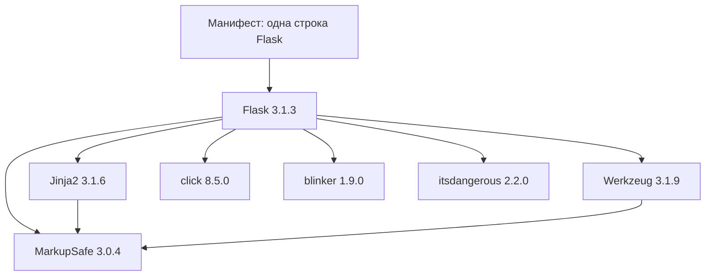
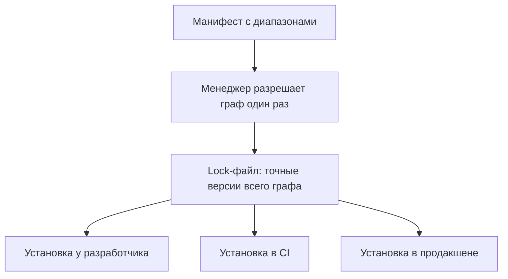

# Транзитивные зависимости, lock-файлы, пиннинг

Манифест учебного стенда — одна строка, `Flask`. Установка разрешила его
в версию 3.1.3 и принесла семь пакетов:

```text
объявлено в манифесте:  Flask
установлено фактически:  Flask blinker click itsdangerous Jinja2 MarkupSafe
                         Werkzeug
```

Шесть имён в манифесте никто не писал: их привёл менеджер пакетов.
Flask объявил свои требования, они — свои, и так до конца цепочки.
Уязвимость в любом из шести окажется в вашей сборке наравне с уязвимостью
самого Flask, а список состава, собранный по одному манифесту, этих имён
не покажет. Беды у такого слоя две: он невидим по манифесту, и версии в
нём плавают, пока их не закрепили. Вопрос, к которому вы вернётесь в
конце темы: в `MarkupSafe` нашли уязвимость — по какому документу вы
проверите, есть ли он в вашей сборке?

## Что такое транзитивная зависимость

Манифест — это файл, где проект перечисляет чужой код, который ему нужен:
в Python это `requirements.txt`, в JavaScript — `package.json`. Бытовой
образ — список покупок. Вы пишете в нём «борщ», а домой приезжают
свёкла, капуста, картофель и лук: овощей в списке не было, но без них
борща нет. Здесь борщ — это Flask, овощи — шесть пакетов из вступления,
а повар, который додумал состав за вас, — менеджер пакетов, программа
вроде pip или npm.

Пакеты, которые вы назвали в манифесте сами, называются прямыми
зависимостями. Пакеты, приехавшие по цепочке «зависимость зависимости»,
— транзитивными: их никто в команде не выбирал и не читал. Выполняются
они при этом в вашем процессе и с вашими правами: для запущенной
программы они неотличимы от кода, который писали вы. На стенде из одной
строки транзитивных оказалось шесть против одной прямой, и такая
пропорция — скорее норма, чем исключение.

Аналогия перестаёт работать в одном месте. Повар выбирает овощи глазами,
и каждый раз немного разные. Менеджер пакетов действует по записанным
правилам: читает требования, вычисляет цепочку и может записать результат
так, что повторная установка даст то же самое. Как он считает и что
именно можно записать — предмет следующего раздела.

**Зачем это в работе AppSec-инженера.** Когда сканер находит уязвимость
в пакете, которого нет в манифесте, первый вопрос — «откуда он вообще
взялся». Ответ читают по графу зависимостей после установки — манифест
его не содержит. И когда сборка «вчера была чистой, а сегодня нет» без единой
правки кода, это тоже про транзитивный слой. Версии в нём плыли, и
объяснять это команде будете вы.

## Как это работает

**Откуда это взялось.** Когда-то каждую библиотеку ставили руками:
скачал архив, положил в проект, повторил для каждой её зависимости.
С ростом графа это стало невозможно — у одной библиотеки десятки
требований, и у каждого требования свои. Поэтому менеджер пакетов
разрешает граф сам: читает объявленные требования, добавляет их
требования и так до конца. Быстро — и ровно поэтому состав сборки
перестал быть тем, что кто-то писал; он стал тем, что вычислил менеджер.

Вот этот граф для стенда из вступления, версии — снимок прогона
2026-10-03:



**Описание схемы.** Схема читается сверху вниз; стрелка означает «требует
для установки». Из манифеста менеджер взял одну строку и разрешил её в
Flask. Дальше Flask потребовал шесть пакетов сразу, а MarkupSafe нужен
ещё и Jinja2 с Werkzeug — один пакет приехал по трём дорогам. Все версии
на схеме — те, что менеджер выбрал в день прогона.

Как менеджер выбирает версию. Номер версии — три числа: в записи `3.1.3`
первое число — крупная линия, где совместимость могут ломать, второе —
добавления без поломок, третье — исправления ошибок. Требование
в манифесте устроено как грамматика из четырёх частей: имя, диапазон
версий, дополнительные опции и маркеры окружения [^2]. Маркеры — это
условия вроде «ставить этот пакет только на Windows». Запись `>=2.0,<3.0` читается «любая
версия от 2.0 включительно, но младше 3.0», а запись `^2.0` у
JavaScript-менеджеров — «2.0 или новее в пределах той же двойки».

По умолчанию менеджер берёт наибольшую версию, которая подходит под все
требования графа [^1]. Отсюда зазор: коммит проекта не меняется, а
разрешённая версия меняется, стоит автору пакета выпустить новую в тех
же границах. Это встроенное свойство диапазона, и настройкой его не
убрать. Его писали, чтобы исправления приезжали без правки манифеста. Но та же
свобода означает, что состав сборки задан не полностью.

Зазор виден на двух прогонах одной команды. Прогон 2026-10-01 разрешил
`MarkupSafe` в 3.0.3. Повтор через два дня, 2026-10-03, дал те же семь
имён, что во вступлении, но `MarkupSafe` уже 3.0.4. За эти дни вышел
новый выпуск в тех же границах, и менеджер молча взял его. Манифест при
этом не менялся вообще — поменялся мир вокруг него.

Граф зависимостей раскрыт в `supply-chain-threats` со стороны доверия к
источнику: кто опубликовал пакет и как имя превращается в код. Здесь он
важен со стороны версий. Это две стороны одной карты: имя ведёт к
источнику и к версии, и незакреплённой может быть каждая из них.

## Как это выглядит в коде

Незакреплённый манифест называет прямые пакеты и молчит о транзитивных:

```text
# requirements.txt — прямые зависимости, диапазоны
Flask>=0.12
```

Слабое место здесь одно, и имя пакета в нём не виновато. Найдёте его
сами, пока читаете дальше?

Что реально встало, видно после установки: менеджер сам перечислит
состав. Прогон 2026-10-03 в чистом окружении, команда `pip freeze`:

```text
blinker==1.9.0
click==8.5.0
Flask==3.1.3
itsdangerous==2.2.0
Jinja2==3.1.6
MarkupSafe==3.0.4
Werkzeug==3.1.9
```

Семь строк против одной в манифесте. Запись `==` здесь означает точную
версию вместо диапазона: так выглядит закреплённое имя. Шесть имён из этого списка
вошли в сборку, но в манифесте их нет: уязвимость в любом попадёт к вам
наравне с уязвимостью Flask. Список состава, сгенерированный по одному
манифесту, их не покажет — это разобрано в `sbom`.

Ответ на вопрос выше: слабое место — запись `>=0.12`, имя пакета ни при
чём. Диапазон без
верхней границы разрешает менеджеру взять любую будущую версию, включая
крупные линии, где ломается совместимость. Даже аккуратный диапазон вроде
`>=2.0,<3.0` оставляет зазор внутри своих границ, а запись без границ
оставляет зазор вообще без стенок.

## Как защититься

**Lock-файл.** Разрешённый граф записывается целиком: вместо диапазонов —
точные версии каждого пакета, прямого и транзитивного. Бытовой образ —
чек из магазина: список покупок говорит, что вы хотели, а чек — что
конкретно купили, какого сорта и веса. Ломается аналогия на
происхождении: чек выписывают один раз при покупке, а lock-файл
пересчитывают из манифеста при каждом обновлении. У pip отдельного
формата нет, и роль lock-файла играет requirements, где каждая строка
закреплена `==`. У других менеджеров свои имена — `package-lock.json`,
`poetry.lock`, `uv.lock`, — но устройство одно.

Дальше установка идёт по lock-файлу и не пересчитывает граф заново.
Поэтому на ноутбуке разработчика и в CI — на сервере непрерывной
интеграции, который собирает каждый коммит сам, — встаёт один и тот же
набор. Lock-файл коммитится в репозиторий рядом с кодом: это
зафиксированный ответ на вопрос «из чего собрано». Он же отвечает на
вопрос из вступления: есть ли `MarkupSafe` в вашей сборке, проверяют по
lock-файлу, потому что манифест про него молчит.



**Описание схемы.** Схема читается сверху вниз. Разрешение графа
случается один раз, и его результат зафиксирован в lock-файле. Все три
установки — у разработчика, в CI и в продакшене — читают уже его и не
пересчитывают диапазоны заново, поэтому набор версий везде одинаковый.

**Пиннинг по хешу.** Версия закрепляет число, хеш — содержимое. Хеш —
это отпечаток файла: функция считает по содержимому короткое число, и
изменённый хотя бы байт даёт другой отпечаток. Режим `--require-hashes`
в pip требует хеш к каждому пакету, включая транзитивные. Он падает,
если скачанный файл не совпал с записанным или если у зависимости хеша
нет вовсе [^3]. Это закрывает случай, когда под той же версией лежит
другой файл, — то, что одна версия не ловит.

Так выглядит lock-файл с хешами (хеши усечены для показа, в настоящем
файле каждый длиной 64 знака):

```text
# requirements-lock.txt — фрагмент, хеши усечены для показа
Flask==3.1.3 --hash=sha256:f4bcbefc1242…
blinker==1.9.0 --hash=sha256:ba0efaa9080b…
# …и так все семь строк: пакет без хеша установку остановит
```

Поведение режима проверено прогоном 2026-10-03: документация [^3] теперь
подкреплена стендом. Сделаем слабый вариант: файл `req.txt`, где хеш дан
только прямой зависимости, а про транзитивные не сказано ничего.

```text
# req.txt — хеш дан только прямой зависимости
Flask==3.1.3 --hash=sha256:f4bcbefc1242…
```

```bash
python -m pip install --require-hashes -r req.txt
```

```text
ERROR: In --require-hashes mode, all requirements must have
       their versions pinned with ==. These do not:
    blinker>=1.9.0 from https://…/blinker-1.9.0-py3-none-any.whl
    (from Flask==3.1.3->-r req.txt (line 1))
```

В терминале ошибка занимает две строки: здесь каждая перенесена под
ширину колонки, а длинный адрес пакета усечён многоточием; слова не
менялись. Прочитана она так: pip требует, чтобы каждый пакет графа был
закреплён через `==` и снабжён хешем, и падает на первом же, где это не
так. Транзитивный `blinker` приходит из требований Flask диапазоном,
поэтому до проверки хешей дело даже не дошло. Закрепить по хешу только
верхний слой не выйдет физически. А файл `requirements-lock.txt` выше,
где хеши даны всем семи пакетам, на том же стенде поставил ровно
записанные версии.

Что здесь не чинится. Lock-файл фиксирует, что вошло, но не делает
вошедшее безопасным. Устаревшая версия с публичной уязвимостью, будучи
закреплённой, остаётся закреплённо-уязвимой. Замороженный раз и навсегда
граф скатывается в `CWE-1104` — опору на сторонний компонент, который
больше не сопровождается. Поэтому закрепление ходит в паре с регулярным
обновлением и сканированием состава — темы `trivy` и `cve-cvss`. Закрепить
и забыть хуже, чем не закреплять: незакреплённая сборка хотя бы
подхватывает исправления, а замороженная — нет.

## Частая ошибка

Закреплённый манифест даёт ощущение порядка: если закрепить версии прямых
зависимостей, сборка воспроизводима. Верно ли это — и что продолжит
плавать, если закрепить только прямые? Ответьте себе «да» или «нет» и
держите ответ, пока читаете опровержение.

**Прямые зависимости — меньшая часть графа.** На стенде темы одна прямая
принесла шесть транзитивных: закрепив Flask, вы оставили шесть имён плыть
по своим диапазонам. Это видно и механически, из прогона выше: даже
режим хешей не дал закрепить одну прямую — установка упала на первом
транзитивном пакете. Воспроизводимость даёт фиксация всего графа, то есть
lock-файл; пиннинг верхнего слоя её не даёт.

Контрпример к обратному выводу — «тогда закрепим всё намертво и никогда
не трогаем». Замороженный граф перестаёт плыть, но перестаёт и получать
исправления безопасности: закреплённая уязвимая версия остаётся уязвимой,
пока её осознанно не подняли. Ответ не «диапазоны против пиннинга», а
«lock-файл плюс дисциплина обновлений».

## Чеклист для ревью

1. Проверьте, что lock-файл закоммичен и покрывает и прямые, и транзитивные
   зависимости.
2. Проверьте, что установка в CI идёт по lock-файлу, а не пересчитывает граф
   заново.
3. Проверьте, что критичные зависимости закреплены по хешу: одной версии
   недостаточно.
4. Проверьте, что для обновления lock-файла есть регулярный процесс, а не разовая
   заморозка.
5. Проверьте, что состав сборки сверяется со сканером уязвимостей, а не считается
   безопасным по факту закрепления.

## Попробуй сам

Создайте окружение с одной прямой зависимостью, у которой есть
транзитивные, установите её и сравните список установленного с манифестом.
Затем закрепите граф lock-файлом и убедитесь, что повторная установка
ставит те же версии. Для стенда темы это чистое окружение `python -m
venv`, одна строка `Flask` в requirements и `pip freeze` после установки.

Одна подсказка: разница между манифестом и установленным окружением и есть
транзитивный слой; его список даёт сам менеджер пакетов после установки.

**Критерий выполнения** наблюдаемый: список установленного длиннее
манифеста, и две установки по lock-файлу дают совпадающие версии всех
пакетов, а не только прямых.

## Проверь себя

1. Прочитайте манифест:

   ```text
   # requirements.txt — прямые зависимости
   Flask>=3.0,<4.0
   gunicorn
   ```

   Назовите все зазоры: какие имена и чьи версии здесь не закреплены.
2. Манифест учебного проекта — одна строка, `Flask`. Установка идёт такой
   командой:

   ```bash
   python -m pip install --dry-run flask
   ```

   Предскажите, сколько пакетов окажется в окружении и каких имён в манифесте
   не было.
3. Почему «закрепить граф один раз и не трогать» хуже, чем не закреплять
   вовсе?
4. Сборка одного и того же коммита в разные дни ставит разные версии. Выберите
   починку:

   А. Закрепить версии прямых зависимостей в манифесте: граф зафиксирован
      сверху.

   Б. Закрепить весь граф lock-файлом с хешами и завести регулярное
      обновление.

   В. Закрепить весь граф один раз и заморозить навсегда.

5. Возврат к теме `supply-chain-threats`: почему закреплённая версия не
   защищает от захвата мейнтейнера, а хеш конкретного выпуска — защищает?
6. Возврат к теме `app-architecture`: где на карте компонентов стоят
   транзитивные зависимости и почему их там не видно?

<details markdown="1">
<summary>Ответ 1</summary>

1. Зазора три. `gunicorn` без границ вовсе: возьмётся наибольшая доступная на
   день установки. `Flask>=3.0,<4.0` — диапазон: внутри него версия плывёт с
   каждым новым выпуском. И оба тянут транзитивные пакеты, которых в манифесте
   нет и чьи версии тоже не закреплены.

</details>

<details markdown="1">
<summary>Ответ 2</summary>

2. Семь пакетов вместо одного: сам Flask и его граф. Прогон 2026-10-01 дал
   `Would install Flask-3.1.3 Jinja2-3.1.6 MarkupSafe-3.0.3 Werkzeug-3.1.9
   blinker-1.9.0 itsdangerous-2.2.0`. Имён `Jinja2`, `MarkupSafe`, `Werkzeug`,
   `blinker`, `itsdangerous` в манифесте не было. Шесть строк в записи вместо
   семи объясняются устройством вывода. Команда перечисляет только то, что
   будет установлено в этот прогон: уже стоящий в окружении пакет в вывод
   не попадает. Повтор 2026-10-03 в чистом окружении перечислил все семь имён,
   включая `click`. А вот версия плывёт и в чистом окружении: `MarkupSafe`
   за те два дня сместился с 3.0.3 на 3.0.4 — это и есть зазор.

</details>

<details markdown="1">
<summary>Ответ 3</summary>

3. Замороженный граф перестаёт плыть, но перестаёт и получать исправления
   безопасности: закреплённая уязвимая версия остаётся уязвимой, пока её
   осознанно не подняли. Так граф скатывается в `CWE-1104` — опору на
   компонент, который больше не сопровождается. Правильная пара — lock-файл
   плюс регулярное обновление.

</details>

<details markdown="1">
<summary>Ответ 4: разбор вариантов</summary>

4. Верный ответ — Б.

   А. Прямые зависимости — меньшая часть графа: на стенде темы одна прямая
      принесла шесть транзитивных. Закрепив только верхний слой, вы оставили
      шесть имён плыть по своим диапазонам.

   Б. Lock-файл фиксирует точные версии всего графа, хеш привязывает имя к
      содержимому, а регулярное обновление не даёт графу устареть.

   В. Заморозка без обновлений — это закреплённая уязвимость с датой
      протухания. Плавучесть она снимает, а безопасности не добавляет.

</details>

<details markdown="1">
<summary>Ответ 5</summary>

5. Версия закрепляет число, но новый выпуск от захваченного мейнтейнера
   получит свою новую версию — и закрепление её не остановит. Хеш привязан к
   конкретному файлу: подменённое содержимое под тем же именем проверку не
   пройдёт, установка упадёт.

</details>

<details markdown="1">
<summary>Ответ 6</summary>

6. Они внутри серверного приложения: исполняются в том же процессе и с теми же
   правами. Отдельными узлами на карте их нет — поэтому по карте компонентов
   состав сборки не читается, а читается по графу зависимостей после
   установки.

</details>

## Источники

1. pip, «pip install»; реестр `pip-install-docs`. Разделы: разрешение
   зависимостей, выбор наибольшей подходящей версии, установка по lock-файлу и
   ограничениям.
   <https://pip.pypa.io/en/stable/cli/pip_install/>
2. PEP 508, «Dependency specification»; реестр `pep-508`. Разделы: грамматика
   спецификатора — имя, диапазон версий, extras, маркеры окружения.
   <https://peps.python.org/pep-0508/>
3. pip, «Secure installs»; реестр `pip-secure-installs`. Разделы: режим
   `--require-hashes`, требование хеша ко всем зависимостям, поведение при
   несовпадении.
   <https://pip.pypa.io/en/stable/topics/secure-installs/>

Каркас этапа: `cwe-taxonomy`. Наследуется всеми темами и отдельной строкой не
повторяется.

**Скоропортящийся слой.** Синтаксис диапазонов и имена lock-файлов конкретных
менеджеров, флаги пиннинга по хешу. Устройство — граф зависимостей и зазор
диапазона — от менеджера не зависит.

**Маркеры уверенности.** Разрастание одной прямой зависимости в семь пакетов
(шесть транзитивных) — **проверено лично** 2026-09-02 установкой `Flask` 3.1.3
в чистое окружение, `pip` 26.2.1, Python 3.14.7. Прогон повторён 2026-10-03:
те же семь имён, но `MarkupSafe` уже 3.0.4 вместо 3.0.3 — дрейф снят с
двух прогонов одной команды. Механика вывода `Would install` — **проверено
лично** 2026-10-03: с уже стоящим в окружении `click` сухой прогон перечисляет
шесть имён вместо семи. Поведение `--require-hashes` — **проверено лично**
2026-10-03: файл с хешем только у прямой зависимости упал с ошибкой о
транзитивном `blinker`, не закреплённом через `==`, а файл с хешами всего
графа поставил ровно записанные версии. Рёбра графа на схеме — **проверено
лично** 2026-10-03 выводом `pip show` для каждого из семи пакетов. Грамматика
диапазона и правило выбора версии — **по документации** pip и PEP 508,
открытым лично 2026-08-25.

[^1]: pip, «pip install», реестр `pip-install-docs`.
[^2]: PEP 508, «Dependency specification», реестр `pep-508`.
[^3]: pip, «Secure installs», реестр `pip-secure-installs`.
