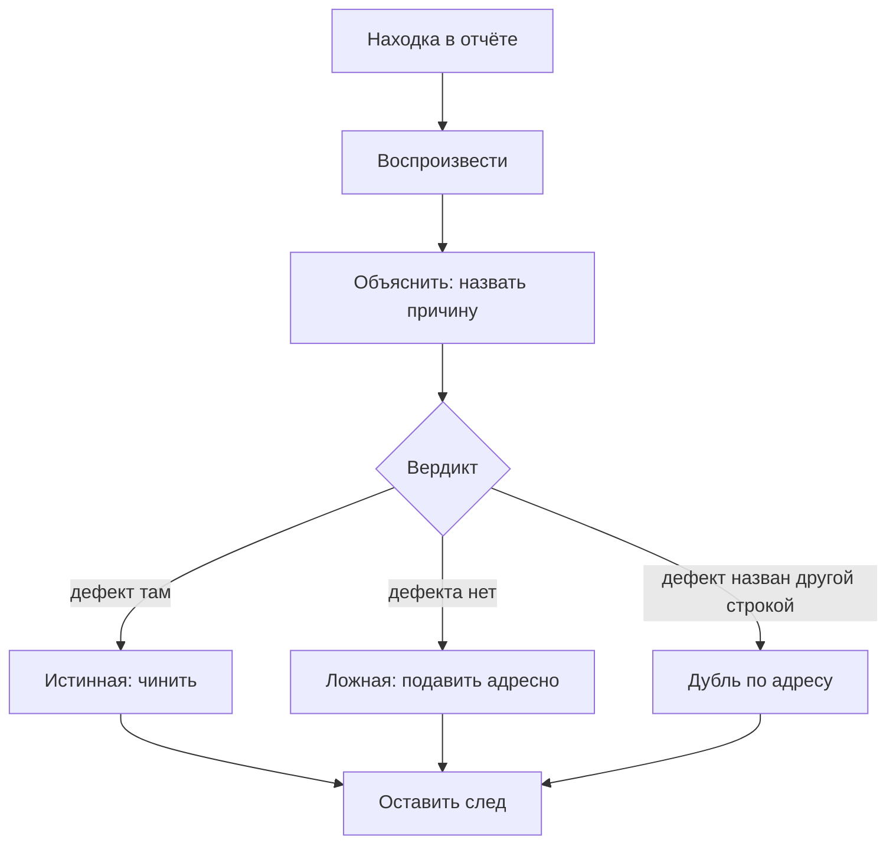

# Триаж находок: подавление и baseline

Утро начинается с отчёта ночного прогона: восемь находок, и по каждой нужно
решение. В коде на строке 278 кто-то до вас такое решение уже принял и записал
его прямо в файл — комментарием-подавлением. Подавление — это пометка,
которая велит инструменту больше не печатать находку в отчёт:

```text
# nosemgrep
# nosemgrep: lavka-reflected-output
```

Эти два комментария отличаются двоеточием и именем правила. На учебном стенде
из восьми находок первый снял две — ложную и настоящую, висящие на одной
строке. Второй снял одну, ложную. Какой из них безопасен — решите до разбора,
а сверьтесь после него. Цена ошибки уже названа: настоящий дефект,
исчезнувший из отчёта вместе с шумом.

## Три вердикта и три следа

Работа, которая начинается после прогона, называется триажем. Слово пришло из
медицины: в приёмном отделении больных разбирают не по порядку прихода, а по
тому, кому помощь нужна первой. Соответствие прямое: больные — это находки,
врач — вы, «помощь первой» — настоящий дефект. Ломается аналогия на одном:
пациент сам скажет, где болит, а находка молчит, и истину о ней придётся
добывать руками, строка за строкой.

У разбора одной находки три исхода, а не два. Истинная — дефект есть там,
куда показал инструмент. Ложная — дефекта нет; конечный список причин, по
которым инструмент ошибается, разобран в `sast-false-positives`. И третий
исход, который забывают чаще всего: дефект есть, но не там, куда показано,
и в отчёте он уже назван другой строкой. Такой вердикт называется дублём по
адресу: чинить надо одно место, а не два, и вторая строка отчёта — его
подтверждение.

Вердикт — половина решения. Вторая половина — след, который решение оставляет
после себя. След бывает трёх видов, и они не равноценны:

```text
комментарий в коде     виден тому, кто правит эту строку
базовый отчёт          виден прогону, не виден человеку
ничего                 находка исчезает, и вопрос вернётся через год
```

Базовый отчёт — второй способ убрать строки из отчёта, и инструменты называют
его baseline. Это снимок всего, что найдено на выбранный момент: дальше отчёт
показывает только новое, а накопленное прячет. Бытовой пример — ревизия в
магазине: всё, что лежало на полках до ревизии, списывается одной строкой,
и недостача дальше считается с нуля. Ломается пример там же, где опасен сам
приём: в магазине списанное выбрасывают, а спрятанные находки остаются в
коде.

Третий вид следа — его отсутствие. Находку убрали из отчёта, а записи о том,
почему, нет нигде. Через год тот же вопрос задаст другой человек, и разбор
начнётся с нуля.

**Зачем это в работе AppSec-инженера.** Разбор находок — ежедневная работа,
и дешевле всего она делается один раз. Находка, закрытая без следа, вернётся
в следующем прогоне и будет разобрана заново другим человеком. Умение
оставить след превращает разбор в накопление, а не в бег на месте.

## Как это работает

**Откуда это взялось.** Термины «ложное срабатывание» и «ложный пропуск»
пришли из функциональной спецификации инструментов анализа кода. Там они
определены строго: срабатывание на месте, где дефекта нет, и молчание там,
где он есть [^1]. Определение опирается на знание истины о коде, а у
разбирающего находку этого знания нет — его и предстоит добыть. Отсюда и
порядок работы: сначала воспроизвести, потом объяснить, и только потом
выносить вердикт.

Разбор одной находки идёт в четыре шага.

1. **Воспроизвести.** Для находки статического анализа — открыть строку и
   проследить путь значения глазами. Для находки сканера снаружи — повторить
   запрос руками, как это делалось в `zap-scanning`. Адрес в отчёте не
   доказательство: он говорит, куда смотрел инструмент, а не где дефект.
2. **Объяснить.** Назвать причину: путь значения настоящий, или его прервало
   экранирование, или инструмент показал место рядом. Причина без имени
   означает, что находка не разобрана.
3. **Вынести вердикт** из трёх, а не из двух.
4. **Оставить след** — и вот с этим шагом всё непросто, потому что его виды
   ведут себя по-разному в каждом инструменте.



**Описание схемы.** Схема читается сверху вниз и показывает путь одной
находки. Два первых шага добывают истину о коде, третий выносит вердикт из
трёх возможных, и у каждого вердикта своё продолжение. Все три ветки сходятся
в последнем шаге: каким бы ни был вердикт, решение оставляет след.

## Что умеет и чего не умеет

**Что умеет подавление.** Убрать из отчёта строку, про которую решение уже
принято. Это его единственная работа, и она нужна: отчёт, где четверть строк
разобрана и признана шумом, читают всё хуже с каждым прогоном.

**Чего оно не умеет.** Отличить «дефекта нет» от «чинить не хотим». Машине
эти два случая неразличимы, и различает их только текст рядом с подавлением —
причина, написанная человеком. Подавление без причины через год отвечает на
вопрос «что мы решили» ровно ничем. А сколько стоит принятая находка, если
она настоящая, — отдельный вопрос, и его решает оценка из
`severity-assessment`, а не комментарий в коде.

**Что умеет базовый отчёт.** Спрятать всё, что было в коде на выбранный
момент, и показывать только новое. Это лекарство от другой болезни: не от
шума, а от объёма. Соответствие такое: болезнь — отчёт в сотни строк, который
перестали читать, лекарство — снимок, после которого отчёт снова короткий.
Разница с подавлением принципиальная. Подавление адресуется одной находке,
базовый отчёт — всему, что накопилось, и никакой причины он не записывает.

Несоответствие у сравнения одно: лекарство избавляет от болезни, а базовый
отчёт — только от её вида. Накопленное остаётся в коде, и к этому граница
метода вернётся ниже.

## Как запустить

Стенд — приложение на 412 строк с подставленными дефектами; набор из четырёх
правил Semgrep версии 1.174.0, сети он не требует. На строке 278 срабатывают
два правила: ложное `lavka-reflected-output` (значение прошло через `int()`
и экранирование) и настоящее `lavka-internal-id-in-page` — страница печатает
внутренний номер владельца заказа.

```bash
# без подавления
semgrep --config=rules.yaml --metrics=off --json -o clean.json app.py

# глухое: комментарий # nosemgrep в конце строки 278
# адресное: # nosemgrep: lavka-reflected-output
semgrep --config=rules.yaml --metrics=off --json -o sup.json app.py
```

Оба прогона отличаются одним комментарием в коде. Глухой `# nosemgrep` гасит
все правила на строке, адресный с двоеточием — одно названное правило. Флаг
`--metrics=off` выключает отправку статистики прогона наружу, а `--json`
отдаёт машинный отчёт, в котором потом считают строки.

Для Bandit версии 1.9.4 то же различие пишется иначе: `# nosec` гасит строку
целиком, `# nosec B608` — один тест по номеру. Сам инструмент разбирает тема
`bandit`. Для ZAP версии 2.17.0 подавление живёт не в коде, а в плане
прогона, заданием `alertFilter`; устройство плана — окружение плюс список
работ — показано в `zap-scanning`:

```yaml
  - type: alertFilter
    parameters:
      deleteGlobalAlerts: true
    alertFilters:
      - ruleId: 10027
        newRisk: "False Positive"
```

Задание переводит находки правила 10027 в состояние `False Positive`: они не
удаляются, а помечаются. Что это значит для чтения отчёта — следующий
раздел.

## Как читать вывод

Три прогона из раздела выше дают три числа:

```text
Semgrep, четыре правила, стенд «Лавка»
  без подавления                              8 находок
  # nosemgrep                на строке 278    6 находок
  # nosemgrep: lavka-reflected-output         7 находок
```

Глухой комментарий снял обе находки строки — и ложную, и настоящую. Цена
двоеточия с именем правила — один настоящий дефект. Документация Semgrep
советует именно адресную форму и приводит её первой [^2]. Прежде чем ставить
глухой комментарий в своём коде, ответьте: какая ещё находка висит на этой
строке?

**След подавления у трёх инструментов разный.** У Semgrep в таблице стоит
сборка CE, Community Edition, то есть бесплатная. В платной подавленная
находка сохраняется со статусом, и след там выглядит иначе.

```text
Semgrep 1.174.0 CE  в отчёте не остаётся ничего: находки нет в results,
                    отдельного списка подавленных в JSON нет
Bandit 1.9.4        находки нет в results, но в metrics растёт nosec: 1
ZAP 2.17.0          строка правила остаётся, риск становится False Positive,
                    инстансов ноль
```

Прогон ZAP: пассивный план на том же стенде, фильтр на правило 10027
(комментарий `FIXME` на главной странице — приманка для ложного
срабатывания). Без фильтра — 8 правил и 26 инстансов, с фильтром — 8 правил
и 24 инстанса, причём строка правила 10027 никуда не делась. Инстанс здесь —
одно срабатывание одного правила на одном адресе, как и в `zap-scanning`.

Отсюда практическое следствие. Если инструмент следа не оставляет, след обязан
жить в другом месте: в комментарии рядом с кодом и в записи трекера. Читать
отчёт как полную картину нельзя ни в одном из трёх случаев, но у Semgrep это
особенно верно.

**Адресное подавление промахивается молча.** Комментарий `# nosec B105` на
строке, где сработал тест `B608`, не гасит ничего — и не сообщает об этом:

```text
без подавления                    5 находок,  metrics.nosec = 0
# nosec         на строке 210     4 находки,  metrics.nosec = 1
# nosec B105    на строке 210     5 находок,  metrics.nosec = 0
```

Промах виден только по числам: находок снова пять, а счётчик `nosec` в
статистике отчёта — ноль, то есть подавление не сработало вовсе. Поэтому
после каждого подавления прогон повторяют и сравнивают число находок.

**Базовый отчёт: 9 находок против одной.** В стенд добавлена новая ручка с
отражением параметра в разметке — четыре строки, от которых все прежние
находки уехали вниз. Полный прогон даёт 9 находок, из них новая одна.

```text
ключ (правило, файл, строка)        новых 9   — уехали строки
ключ (правило, файл)                новых 0   — новый дефект той же пары
semgrep --baseline-commit <sha>     новых 1   — верно
```

Числа объясняются тем, как устроено сравнение. Ключ из тройки «правило, файл,
строка» ломается на любой вставке выше по файлу: строки сдвинулись, и все
находки стали «новыми». Ключ без строки пропускает дефект, который возник в
той же паре «правило, файл». Semgrep не сравнивает номера строк. Рабочее
дерево — это файлы проекта в их текущем состоянии, а базовый коммит —
сохранённое состояние, с которым сравнивают. Ключ `--baseline-commit`
разворачивает дерево на базовом коммите и вычитает прогон из прогона. Bandit
с ключом `-b` на тех же данных даёт ноль новых — правильно для своего набора,
в котором отражения в разметке нет вовсе.

## Границы метода

**Граница первая: подавление не переживает переименование правила.**
Комментарий называет правило по имени; правило переименовали — подавление
перестало работать. Узнают об этом случайно, потому что молчание выглядит
одинаково: и «находки нет», и «смотреть больше не на что».

**Граница вторая: базовый отчёт нельзя ставить на грязном дереве.** Грязное
здесь не гитовское: оно означает находки без вердикта, а не незакоммиченные
правки. Всё, что было в коде на момент снимка, исчезнет из отчётов навсегда.
На стенде это 5 настоящих дефектов из 8 находок. Чинятся они в своих темах:
склейка запроса — в `sqli-basics`, отражённая разметка — в `xss-reflected`.
Документация Semgrep поэтому и разводит два режима: прогон по изменению — на
каждую ветку, полный прогон по основной ветке — по расписанию [^3].

**Граница третья: подавление у сканера живёт не в плане, а в его
настройках.** Задание `alertFilter` пишет фильтр в файл настроек домашнего
каталога ZAP, в элемент `globalalertfilter`. Дальше он применяется ко всем
последующим прогонам с этим каталогом, включая прогоны по другим целям.
Проверено: прогон по другому стенду, поднятому позже и на другом порту,
унаследовал фильтр на правило 10027 и напечатал по нему `False Positive` с
нулём инстансов. План с `deleteGlobalAlerts: true` без списка фильтров его не
снимает: задание печатает `No alertFilters element defined`, а прогон
завершается кодом 2. Снялось правкой файла настроек.

**Граница четвёртая: вердикт «дубль по адресу» машине не даётся.** Он требует
второго взгляда на отчёт целиком: строку признают дублем, только увидев, что
тот же дефект уже назван другой строкой по верному адресу. Склейка повторных
находок между инструментами — отдельная работа, и она разобрана в
`finding-deduplication`.

**Цена.** Разбор одной находки — от минуты (открыть строку и увидеть
экранирование) до получаса (повторить запрос, найти обработчик, доказать
недостижимость). На отчёте в сорок строк это половина рабочего дня, и
сокращается она только накоплением следов, а не скоростью чтения.

## Частая ошибка

Базовый снимок обещает чистый старт: снять базовый отчёт — значит начать с
чистого листа и дальше не пропускать ничего. Сколько настоящих дефектов
стенда переживёт снимок, сделанный до разбора? Держите ответ, пока читаете.

**Чистый лист прячет всё, что было, и не спрашивает, что это было.** На
стенде снимок унёс бы из отчётов пять настоящих дефектов. Вот они все пять:
склейка запроса в странице и та же склейка в API, отражение параметра в
разметке страницы и в ответе API. Пятое — чтение файла по имени из параметра.
Ни одна из пяти строк не была разобрана. И ни одна больше не появится: прогон
по изменению их не покажет, потому что эти строки не менялись.

Контрпример к обратному выводу — «тогда никакого базового отчёта». Полный
прогон на давнем репозитории даёт сотни строк, из которых новых единицы, и
читать его перестают на второй неделе. Рабочий порядок — оба режима сразу:
прогон по изменению блокирует ветку, полный прогон по расписанию идёт в
отдельную очередь разбора, и она не пуста.

## Чеклист для ревью

1. Проверьте, что у каждого подавления рядом стоит причина словами, а не
   только имя правила.
2. Проверьте, что подавление адресное: гасится названный тест, а не строка
   целиком.
3. Проверьте, что после подавления прогон повторён и снятая находка ровно
   одна.
4. Проверьте, что базовый отчёт снят с дерева, про которое известно, что в
   нём лежит.
5. Проверьте, что рядом с прогоном по изменению стоит полный прогон по
   расписанию.
6. Проверьте, что вердикт «дубль по адресу» подтверждён строкой отчёта,
   которая называет тот же дефект по верному адресу.

## Попробуй сам

Возьмите свой проект и подставьте в него ложное срабатывание: строку, где
значение экранируется, а метка до него дотягивается. Подавите находку сначала
глухо, потом адресно, сверяя число находок после каждого прогона.

Одна подсказка: чтобы разница стала видна, на той же строке должно
срабатывать второе правило — заведите его сами, оно может быть поиском по
образцу.

**Критерий выполнения** наблюдаемый. У вас три числа: находок без подавления,
после глухого и после адресного. Второе меньше третьего, и вы можете назвать,
какая находка потерялась.

## Проверь себя

1. Два правила сработали на одной строке одного файла:

   ```python
   import html

   def show(name, oid):
       safe = html.escape(name)
       return page("<p>" + safe), log("owner=" + str(owner_of(oid)))
   ```

   ```yaml
   rules:
     - id: lavka-reflected-output
       pattern: page("..." + $X)
     - id: lavka-internal-id
       pattern: log("..." + $X)
   ```

   Вынесите вердикт по каждому и назовите причину.

2. Предскажите число находок в трёх прогонах по этому файлу: без комментария,
   с `# nosemgrep` в конце строки 5 и с `# nosemgrep: lavka-reflected-output`
   там же.
3. Отчёт по давнему репозиторию — сотни строк, разбирать некогда. Поставить
   базовый снимок и начать с чистого листа?

   А. Да: чистый лист, и дальше прогон по изменению ничего не пропустит.

   Б. Нет: снимок прячет всё накопленное без разбора; рабочий порядок —
      прогон по изменению плюс полный прогон по расписанию.

   В. Да, если снять его после того, как разобрана половина строк.

4. Почему сравнение двух отчётов по номеру строки даёт неверный ответ и что
   делает вместо этого ключ базового коммита?
5. Возврат к теме `sast-false-positives`: какая из пяти причин шума объясняет
   ложную находку на строке с экранированием?
6. Возврат к теме `xss-reflected`: находка «отражение параметра в разметке»
   настоящая. Чем она чинится и почему подавление её не чинит?

<details markdown="1">
<summary>Ответ 1</summary>

1. `lavka-reflected-output` — ложная: значение прошло через `html.escape`, а
   правило про этот санитайзер не знает. `lavka-internal-id` — настоящая:
   внутренний номер владельца заказа печатается в журнал, и путь значения
   настоящий. Одна строка, два вердикта — поэтому и подавляют их по имени
   правила, а не строку целиком.

</details>

<details markdown="1">
<summary>Ответ 2</summary>

2. Два, ноль, один. Глухой комментарий снял обе находки строки — и ложную, и
   настоящую; адресный снял ровно ложную. Ответ получен прогоном на Semgrep
   1.174.0: `semgrep --config rules.yaml --metrics=off app.py` в трёх
   вариантах файла.

</details>

<details markdown="1">
<summary>Ответ 3: разбор вариантов</summary>

3. Верный ответ — Б.

   А. На стенде такой снимок унёс бы из отчётов пять настоящих дефектов. И ни
      один не появится снова: прогон по изменению показывает только то, что
      менялось, а эти строки не менялись.

   Б. Базовый отчёт — лекарство от объёма, а не от шума: он не спрашивает,
      что прячет. Долг разбирается полным прогоном по расписанию, а ветки
      блокирует прогон по изменению.

   В. Снимок не знает, где прошёл разбор: половина строк разобрана, вторая
      половина спрятана молча. Разобранное прячется адресным подавлением с
      причиной, а не снимком.

</details>

<details markdown="1">
<summary>Ответ 4</summary>

4. Номера строк уезжают от любой вставки выше по файлу: на стенде все девять
   находок стали бы «новыми». Ключ базового коммита разворачивает дерево на
   снимке и вычитает прогон из прогона — номера строк в таком сравнении не
   участвуют.

</details>

<details markdown="1">
<summary>Ответ 5</summary>

5. Четвёртая — санитайзер, неизвестный правилу: значение прошло через
   приведение типа и экранирование, а правило такой проверки не знает.
   Закрыть её можно записью санитайзера в правило, а не подавлением каждой
   находки.

</details>

<details markdown="1">
<summary>Ответ 6</summary>

6. Чинится экранированием вывода по контексту: разметка из параметра
   перестаёт быть разметкой. Подавление убирает строку из отчёта, а дефект
   остаётся в коде — и в следующем отчёте вопрос вернётся к другому человеку.

</details>

## Источники

1. NIST, «Source Code Security Analysis Tool Functional Specification»,
   SP 500-268 версии 1.1; реестр `nist-sp-500-268`. Разделы: определения
   ложного срабатывания и ложного пропуска.
   <https://www.nist.gov/publications/source-code-security-analysis-tool-functional-specification-version-11>
2. Semgrep, «Ignore files, folders, and code»; реестр `semgrep-ignore`.
   Разделы: подавление комментарием и его адресная форма, различие между
   исключением файлов и действием триажа, файл `.semgrepignore` и его
   умолчания.
   <https://docs.semgrep.dev/ignoring-files-folders-code>
3. Semgrep, «Customize your CI job»; реестр `semgrep-customize-ci-job`.
   Разделы: прогон по изменению против полного прогона, расписание полных
   прогонов по основной ветке.
   <https://docs.semgrep.dev/deployment/customize-ci-jobs>

Каркас этапа: `cwe-taxonomy`. Наследуется всеми темами и отдельной строкой не
повторяется.

**Скоропортящийся слой.** Версии инструментов, имена ключей командной строки,
номера правил ZAP и форма отчётов. Различие адресного и глухого подавления
держится, пока подавление задаётся комментарием.

**Маркеры уверенности.** Все числа сняты **лично** 2026-08-25 на стенде из
412 строк: Semgrep версии 1.174.0 — 8 находок без подавления, 6 после глухого
и 7 после адресного; 9 находок после правки против одной по базовому коммиту;
Bandit версии 1.9.4 — 5, 4 и 5 находок и счётчик `nosec`; ZAP 2.17.0 —
26 инстансов против 24 и строка правила 10027, у которой риск стал
`False Positive`. Сохранение фильтра между прогонами проверено **лично** на
втором стенде, поднятом на другом порту: фильтр применился к нему, а снялся
только правкой файла настроек.
Определения ложного срабатывания и пропуска — **по документации** NIST
SP 500-268; поведение подавления и режимы прогона — **по документации**
Semgrep, открытой лично 2026-08-25. Поведение подавления в платной версии
Semgrep **не проверялось**: там подавленная находка сохраняется со статусом,
и след выглядит иначе.

[^1]: NIST SP 500-268 v1.1, реестр `nist-sp-500-268`.
[^2]: Semgrep, «Ignore files, folders, and code», реестр `semgrep-ignore`.
[^3]: Semgrep, «Customize your CI job», реестр `semgrep-customize-ci-job`.
