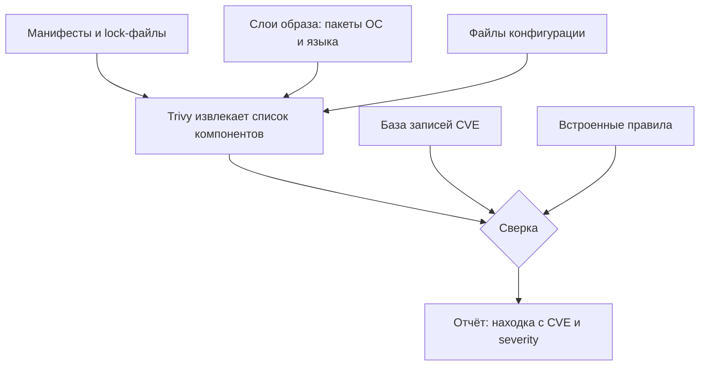

# Trivy: зависимости, образы, конфигурации

Прогоните одну команду Trivy на проекте, который вы считали спокойным:

```bash
trivy fs --scanners vuln .
```

На учебном стенде `exp/app` она печатает такую строку:

```text
Library    Vulnerability    Severity  Installed  Fixed
log4j-core CVE-2021-44228  CRITICAL   2.14.1    2.15.0
```

И это не единственная строка: тот же прогон дал 8 находок по `pom.xml` и ещё
39 по `requirements.txt`. Пакета `log4j-core` версии 2.14.1 в манифесте
проекта нет: его притянула одна из прямых зависимостей, а как устроен такой
приезд чужого кода, разбирает тема `transitive-dependencies`. Сканеру
безразлично, кто притащил пакет: он сверил то, что реально лежит в сборке, со
справочником известных уязвимостей и показал совпадение.

К этой строке есть два вопроса: какую версию ставить вместо 2.14.1 и
исчерпает ли такая замена всю таблицу находок. А за ними третий, главный, и
ему посвящена тема: что этот отчёт проверил на самом деле — и чего в нём
заведомо нет.

## Что такое Trivy

Trivy — сканер, который сверяет проект с базами известных уязвимостей. Такая
работа называется анализом состава, SCA (software composition analysis):
извлечь список компонентов сборки и проверить каждый по справочнику. Бытовой
пример здесь — ревизия продуктов в холодильнике по списку отозванных партий.
Соответствие прямое: пакет с номером версии — это продукт с номером партии,
а база уязвимостей — перечень отзывов. Ломается аналогия на последствиях:
отозванная партия опасна сама по себе, а уязвимая библиотека — только если
ваш код вызывает её уязвимую часть.

Под одним именем Trivy делает три разные проверки, и режимы различаются
объектом. Режим `fs` читает файловую систему проекта: манифесты и lock-файлы,
по которым собирается список зависимостей, — их устройство вы знаете из
`transitive-dependencies`. Режим `image` разбирает контейнерный образ —
готовую упаковку приложения вместе с окружением. Запускает такую упаковку
оркестратор — программа вроде Kubernetes, которая поднимает контейнеры и
следит за ними. Режим `config` читает файлы конфигурации, например рецепт
сборки образа или манифесты развёртывания, и ищет в них типовые ошибки
настройки.

Образ при этом устроен слоями, и это важно для чтения отчёта. Рецепт сборки
выполняется по шагам, и каждый шаг кладёт в образ свой слой файлов. Один шаг
добавляет пакеты операционной системы, другой — пакеты языка, третий — ваш
код. Бытовое соответствие — сборка чемодана: сначала вы кладёте обувь, поверх
неё одежду, поверх — документы, и вещи лежат именно слоями. Граница сходства:
из закрытого чемодана виден только верхний слой, а сканер перебирает все слои
образа целиком и поэтому видит каждый пакет внутри.

Отвечает Trivy на вопрос «есть ли в этом объекте известная проблема с
публичной записью». На вопрос «есть ли здесь новая закладка» он не отвечает:
сверка идёт с базой, а в базе новизны нет. Класс дефекта, который режим `fs`
находит в зависимостях, — опора на компонент с известной уязвимостью, в
каталоге CWE это `CWE-1395`. Чинится такой дефект обновлением и пиннингом;
починка разобрана в `transitive-dependencies` и сюда не переписывается.

**Зачем это в работе AppSec-инженера.** Trivy чаще всего ставят в конвейер
«чтобы был». А спрашивают с инженера не «умеешь ли запускать», а «что этот
зелёный отчёт на самом деле проверил». То есть какой объект, по какой базе и
что в этот прогон не попало. Точный ответ на такой вопрос — рабочий навык этой темы.

## Как это работает

**Откуда это взялось.** Зависимости, образы и конфигурации привыкли проверять
тремя разными инструментами, и на стыках терялось: какой-то объект не
сканировал никто. Каждый инструмент ждал этой проверки от соседа. Trivy
свёл три проверки под один запуск и одну базу, чтобы охват был виден целиком,
а не собирался из трёх отчётов тремя разными способами.

На входе режимы читают разное. Режим `fs` читает манифесты и lock-файлы, из
которых менеджер пакетов вычисляет весь граф зависимостей, включая
транзитивные, — свойства этого графа разобраны в `transitive-dependencies`.
Режим `image` читает слои образа, то есть пакеты операционной системы и
языковые пакеты, уложенные при сборке. Режим `config` читает текст самих
конфигураций.

Дальше включается общий механизм — сопоставление со справочником. Уязвимости
сверяются с записями CVE по координатам «имя пакета и версия»; что такое
запись CVE и откуда она берётся, разбирает `cve-cvss`. Конфигурации сверяются
со встроенными правилами вроде «контейнер не должен запускаться от root».
Совпадение становится находкой, и все находки печатаются в одном виде.



**Описание схемы.** Три режима различаются входом, то есть тем, что читать.
Дальше путь общий: Trivy извлекает список компонентов или настроек и сверяет
его с двумя справочниками. Для уязвимостей это база записей CVE, для
конфигураций — встроенные правила. Результат обеих сверок — отчёт одного
вида.

Тема строится как рецепт, поэтому устройство дано в объёме, нужном для чтения
вывода, а не в полном. Балл и класс тяжести Trivy не вычисляет сам, а берёт из
базы; как читать балл и почему тяжесть не задаёт приоритет, разбирает
`cve-cvss`.

## Что умеет и чего не умеет

**Что умеет.** По манифестам и lock-файлам — назвать известные уязвимости
зависимостей проекта, и прямых, и транзитивных. По образу — перечислить пакеты
операционной системы и языковые пакеты внутри него и назвать их известные
уязвимости; заодно пометить базовый образ, с которого снята поддержка. По
конфигурациям — найти типовые ошибки вроде запуска контейнера от root. Отчёт
отдаётся и таблицей для человека, и машинными форматами вроде JSON для
конвейера, а вывод сужается фильтром по severity.

**Чего не умеет.** Первое — находить неизвестное. У свежей закладки записи в
базе ещё нет, и Trivy пропустит её молча; это свойство любого сканера по базе,
а угрозы такого рода разбирает `supply-chain-threats`. Второе — судить о
достижимости: пакет числится уязвимым по координатам, даже если его уязвимая
функция в вашем коде ни разу не вызывается. Третье — подменять один режим
другим: `fs` не смотрит внутрь образа, `image` не читает исходные манифесты
проекта, `config` не ищет уязвимости вовсе.

Здесь и кончается аналогия про отзывы продуктов. Список отозванных партий не
скажет, навредила ли вам конкретная банка: для этого надо знать, ели ли вы из
неё. Справочник отвечает про партию, а про ваш ужин — нет. Так и Trivy
называет уязвимый пакет по координатам, а вопрос «доходит ли выполнение до
уязвимой функции» остаётся на вас.

## Как запустить

Три режима — три команды. Версия в прогонах этой темы — Trivy 0.74.0:

```bash
# зависимости проекта
trivy fs --scanners vuln .
# слои образа: пакеты ОС и языковые
trivy image python:3.9-alpine3.15
# конфигурации: Dockerfile, манифесты
trivy config .
```

Команда устроена одинаково: имя режима, потом объект проверки. У `fs` и
`config` объект — каталог с проектом, и точка означает текущий. У `image`
объект — имя образа в том виде, в каком его показал бы `docker images`. Ключ
`--scanners vuln` сужает режим `fs` до поиска уязвимостей: без него в прогон
попадают и другие виды проверок, и вывод смешивает разные классы находок.

Первый прогон скачивает базу уязвимостей, и это заметная разовая цена: сеть и
время. Дальше база лежит в локальном кэше, каталог которого задаёт переменная
`TRIVY_CACHE_DIR`, и прогоны идут быстро. Но база пополняется каждый день, и
вчерашний прогон того же проекта может отличаться от сегодняшнего. Отсюда
правило воспроизводимости: два прогона равны, только если совпали версия
сканера и дата базы. Поэтому дату базы пишут рядом с отчётом, и к этому
вернётся чеклист в конце темы.

Фильтр `--severity HIGH,CRITICAL` сужает вывод до тяжёлых находок, но по
тяжести, а не по важности. Бывает тяжёлая находка, до которой из вашего кода
не добраться, и средняя, которую эксплуатируют массово. Чем заменить фильтр
при разборе, разбирает `cve-cvss`. Второй приём из документации Trivy —
подавление отдельных находок по номеру: их перечисляют в файле `.trivyignore`
рядом с проектом. Его поведение описывает раздел Filtering, он же источник 2
в «Источниках». Подавление убирает точечно то, что разобрано и признано
неприменимым, а не целый класс сразу.

## Как читать вывод

Начнём с той самой строки из вступления — находки режима `fs` на стенде:

```text
Library    Vulnerability    Severity  Installed  Fixed
log4j-core CVE-2021-44228  CRITICAL   2.14.1    2.15.0
```

Строка читается слева направо. `Library` — уязвимый пакет, `Vulnerability` —
номер записи CVE, `Severity` — класс тяжести. Пара `Installed` и `Fixed` —
где вы стоите и до какой версии обновиться: здесь с 2.14.1 на 2.15.0. Таких
строк на стенде `exp/app` вышло 8 по `pom.xml` и 39 по `requirements.txt`:
граф зависимостей полон известных дыр. Что делать с находкой дальше —
обновить версию и закрепить её — разобрано в `transitive-dependencies` и сюда
не переписывается.

### Один CVE, два балла

Ключевая тонкость прячется в поле `Severity`: балл одного и того же CVE
зависит от источника. Базы оценивают по-своему, и Trivy хранит оценки
нескольких из них. Для Log4Shell, той самой уязвимости из строки выше, оценки
расходятся. NVD даёт 10.0 с метрикой Scope «changed», а RedHat — 9.8 со Scope
«unchanged». Разница в прочтении одной метрики: меняет ли эксплуатация границу
полномочий компонента. Что такое Scope и как считается вектор, разбирает
`cve-cvss`. Поэтому `Severity` в таблице — выбранный источник, а не абсолютная
истина.

Полный список оценок виден в машинном выводе. Команда
`trivy fs --scanners vuln --format json` по текущему каталогу печатает для
каждой находки оценки всех источников. Из такого поля и взята пара 10.0 против
9.8. Когда к отчёту приходят с вопросом «почему у вас CRITICAL, а в бюллетене
вендора HIGH», ответ лежит именно там.

### Три режима на одном стенде

Режим `image` устроен слоями, и его отчёт читается через них. На образе
`python:3.9-alpine3.15` Trivy нашёл 25 уязвимостей в пакетах операционной
системы и ещё 10 в языковых пакетах внутри образа. Заодно он пометил базовый
образ флагом EOSL (end of support life, конец срока поддержки). Флаг
означает: заплаток для этой линейки больше не выйдет, и каждая следующая
находка останется без исправленной версии. Это как модель телефона, снятая с
обновлений: аппарат работает, а дыры в нём остаются навсегда. Режим `fs` этих
находок не увидел бы: он не смотрит внутрь образа.

Режим `config` на том же стенде дал две находки по Dockerfile: запуск от root
и отсутствие HEALTHCHECK. HEALTHCHECK — инструкция, по которой оркестратор
проверяет, жив ли контейнер; без неё мёртвый контейнер может числиться
работающим. Уязвимостей пакетов этот режим не нашёл и не искал: это другой
класс проверки, ошибки настройки, а не записи в базе. Поэтому зелёный `config`
ничего не говорит об уязвимостях, а зелёный `fs` — о настройках.

## Границы метода

**Граница первая: только известное.** Trivy сверяет с базой, новизны в базе
нет, и свежую закладку он пропустит. Закрывается это не Trivy, а контролем
источника на входе — тема `supply-chain-threats` — и подписью артефактов.
Подпись — криптографическая метка, что артефакт собран именно вашим конвейером
и с тех пор не менялся. Её разбирает тема `artifact-signing`, она идёт по
маршруту позже.

**Граница вторая: режим не покрывает соседний.** Один прогон `fs` не проверяет
образ, `image` не читает манифесты проекта, `config` не ищет уязвимости.
Полный охват — это три прогона, а не один, и отчёт одного режима не значит
«проверено всё». Собрать три запуска в один шаг конвейера — обычная практика,
и тогда охват виден сразу по трём отчётам.

**Цена.** Первый прогон качает базу — заметная разовая цена и зависимость от
сети. Дальше прогоны быстры, а вот разбор находок — нет. 47 находок на
крошечном учебном стенде означают, что на настоящем проекте читать и
приоритизировать придётся больше, чем чинить. Как расставлять приоритет по
вероятности и факту эксплуатации, а не по одному баллу, разбирает `cve-cvss`.

## Частая ошибка

Один прогон засчитывается за полную проверку: Trivy прошёл — значит, проект
проверен. Прежде чем читать дальше, ответьте себе «да» или «нет»: зелёный
прогон `trivy fs` — это проверенный проект?

**Trivy проверяет тот объект, который ему дали, и только на известное.**
Зелёный `trivy fs` не говорит ничего о слоях образа, зелёный `image` — о
конфигурации, и ни один из режимов не видит свежую закладку. Слово
«проверено» относится к режиму и к дате базы, а не к продукту в целом.

Контрпример к обратному выводу — «тогда доверять нечему». Доверять можно
ровно тому, что режим покрывает, если назвать это точно. «Trivy image на этом
образе не нашёл известных уязвимостей высокой тяжести на дату базы такую-то» —
честное и полезное утверждение. «Trivy зелёный, всё чисто» — нет.

## Чеклист для ревью

Чеклист проверяет прогон, а не код: его вопросы задают отчёту Trivy на ревью
конвейера.

1. Проверьте, что запущены все нужные режимы (`fs`, `image`, `config`), а не один.
2. Проверьте, что дата базы уязвимостей записана рядом с отчётом.
3. Проверьте, что в отчёте виден источник балла severity, а не только его значение.
4. Проверьте, что базовый образ проверен на снятие с поддержки (EOSL).
5. Проверьте, что находки приоритизированы по EPSS и KEV, а не только по severity.
6. Проверьте, что непроверенные новые закладки названы пропуском, а не выглядят
   чистым результатом.

## Попробуй сам

Прогоните Trivy на своём проекте во всех трёх режимах и сведите в одну
таблицу, что нашёл каждый. Потом возьмите из отчёта один CVE и найдите в
JSON-выводе, из какого источника взят его балл severity и даёт ли другой
источник другое значение.

Одна подсказка: severity в таблице — это выбранный источник, а полный список
оценок по каждому источнику лежит в JSON-поле находки.

**Критерий выполнения** наблюдаемый: три отчёта различаются составом находок.
Вы можете назвать для одного CVE минимум два источника балла с разными
значениями и объяснить, почему они разные.

## Проверь себя

1. Прочитайте две строки чужого отчёта режима `fs`:

   ```text
   Library     Vulnerability   Severity  Installed  Fixed
   setuptools  CVE-2024-6345   HIGH      65.5.0     70.0.0
   requests    CVE-2024-35195  MEDIUM    2.31.0     2.32.0
   ```

   Что делать с каждой находкой и какое поле называет цель обновления?
2. Почему у одного CVE severity в отчёте Trivy может отличаться от значения в
   другом источнике?
3. В конвейере стоит зелёный `trivy fs`. Что именно проверено?

   A. Проект: зависимости, образ и конфигурации — Trivy один на всё.

   B. Зависимости проекта на известные уязвимости на дату базы — и только.

   C. Ничего: зелёный отчёт без находок ничего не значит.

4. Предскажите, сколько находок и какого severity напечатает прогон по этому
   манифесту — и от чего зависит ваш ответ.

   ```text
   # requirements.txt
   requests==2.31.0
   ```

5. Возврат к теме `transitive-dependencies`: почему Trivy находит уязвимости в
   пакетах, которых нет в манифесте?
6. Возврат к теме `fail-open-vs-fail-closed`: прогон `trivy fs`, который не
   нашёл ни одного манифеста, завершается зелёным. Какой это сдвиг отказа и
   как сдвинуть его в другую сторону?

<details markdown="1">
<summary>Ответ 1</summary>

1. Обе закрываются обновлением до версии из `Fixed`: setuptools до 70.0.0,
   requests до 2.32.0. `Installed` — установленная версия, `Severity` — балл
   выбранного источника, а не абсолют: у другого источника класс может
   отличаться. Порядок работ по одному `Severity` не строится — почему,
   разбирает `cve-cvss`.

</details>

<details markdown="1">
<summary>Ответ 2</summary>

2. Балл хранится по нескольким базам, и источники выставляют метрики
   по-своему: у Log4Shell NVD даёт 10.0, а RedHat — 9.8 из-за иного Scope. В
   таблице показан выбранный источник; полный список оценок лежит в JSON-поле
   находки.

</details>

<details markdown="1">
<summary>Ответ 3: разбор вариантов</summary>

3. Верный ответ — B.

   A. Режимы не покрывают друг друга: `fs` не смотрит слои образа, `image` не
      читает манифесты проекта, `config` не ищет уязвимости вовсе. Полный
      охват — три прогона, а не один.

   B. Честное утверждение звучит так: «на этом дереве на дату базы такой-то
      известных уязвимостей зависимостей не найдено». Оно и полезно, и
      проверяемо.

   C. Отчёт по покрытому объекту — не ничего: он фиксирует состояние на дату
      базы. Пропуск новизны — отдельная оговорка, а не повод считать весь
      отчёт пустым.

</details>

<details markdown="1">
<summary>Ответ 4</summary>

4. Три находки, все на один пакет `requests` и все `MEDIUM` — на дату базы
   2026-10-01. Ответ получен прогоном: `trivy fs --scanners vuln` по каталогу
   с этим манифестом, Trivy 0.74.0. Зависит он от даты базы уязвимостей:
   завтрашняя база может добавить записи, и поэтому дата базы пишется рядом с
   отчётом.

</details>

<details markdown="1">
<summary>Ответ 5</summary>

5. Trivy читает весь разрешённый граф зависимостей, включая транзитивные
   пакеты, которых в манифесте нет: граф вычислен менеджером пакетов, а не
   написан командой.

</details>

<details markdown="1">
<summary>Ответ 6</summary>

6. Это fail-open: отсутствие сигнала прочитано как «пропустить дальше».
   Сдвиг — читать число покрытых файлов и падать, когда объект не покрыт:
   «не с чем сверять» обязано быть красным, а не зелёным.

</details>

## Источники

1. Trivy documentation; реестр `trivy-docs`. Разделы: режимы `fs`, `image`,
   `config`, сканеры уязвимостей, кэш базы, определение снятого с поддержки
   образа.
   <https://trivy.dev/docs/latest/guide/>
2. Trivy, «Filtering»; реестр `trivy-filtering`. Разделы: фильтр по severity,
   подавление находок, поведение фильтров и их цена.
   <https://trivy.dev/docs/latest/configuration/filtering/>

Каркас этапа: `cwe-taxonomy`. Наследуется всеми темами и отдельной строкой не
повторяется.

**Скоропортящийся слой.** Версия Trivy, имена режимов и ключей, вид таблицы и
состав баз. Устройство — сверка объекта с базой известного — держится дольше и
от версии не зависит.

**Маркеры уверенности.** Все три режима прогнаны **лично** 2026-08-25 на Trivy
0.74.0: `fs` на стенде `exp/app` — 8 находок по `pom.xml` и 39 по
`requirements.txt`; `image` на `python:3.9-alpine3.15` — 25 уязвимостей ОС и
10 языковых, флаг EOSL; `config` по Dockerfile — 2 находки. Расхождение балла
Log4Shell (NVD 10.0, RedHat 9.8) взято **лично** из JSON-вывода того же
прогона. Режимы и поведение фильтров — **по документации** Trivy, открытой
лично 2026-08-25. Проверочный прогон из ответа 4 самопроверки снят той же
версией Trivy 0.74.0, но с базой на дату 2026-10-01. Тема переписана
2026-10-03 без новых прогонов: Trivy в окружении автора отсутствует, и выводы
команд оставлены из прогонов 2026-08-25 и 2026-10-01.
