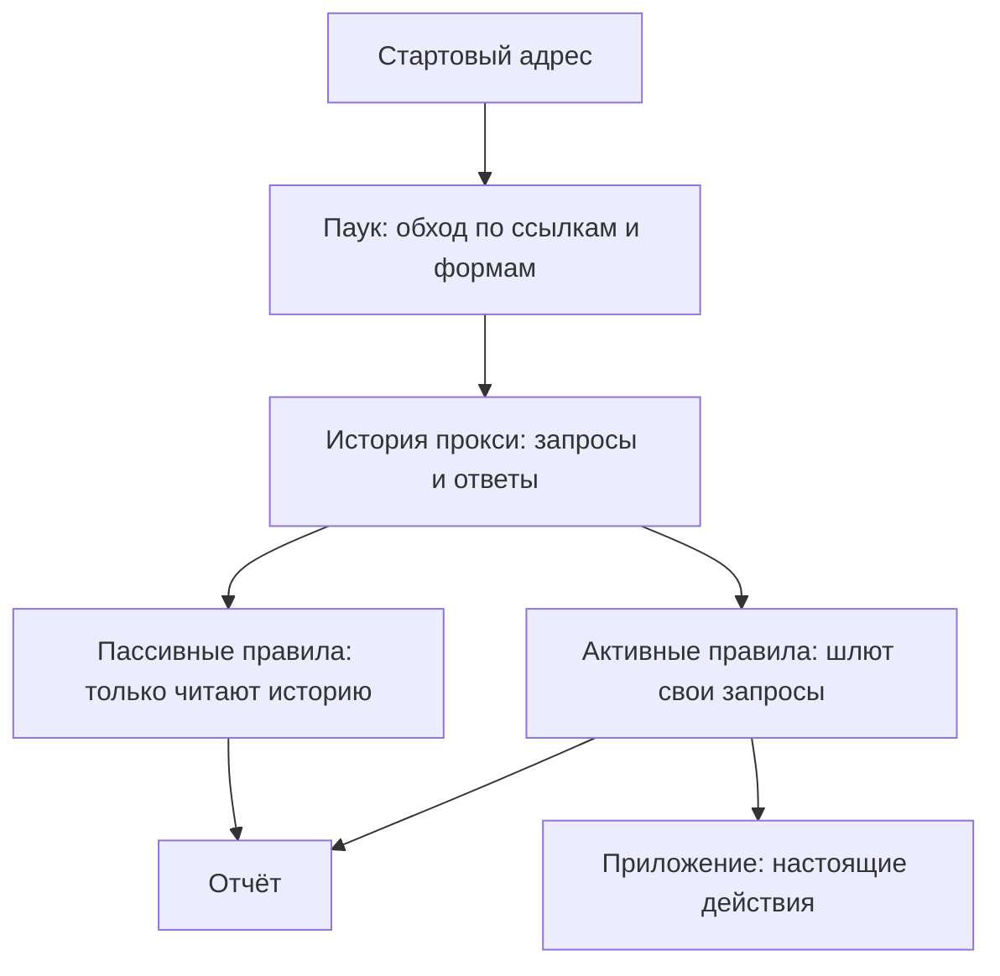

# OWASP ZAP: пассивное и активное сканирование

У сканера из этой темы два режима, и разница между ними видна без единого
слова теории — по двум прогонам одного стенда. Стенд называется «Лавка»: это
небольшое приложение-магазин, написанное специально для этой темы, и в него
подставлены тринадцать дефектов:

```text
                                    пассивный   активный
запросов к стенду                          12       1331
сработало правил                             8         12
инстансов                                   26         28
из них высокого риска                        0          5
```

Первый прогон обошёл приложение и молча разобрал трафик, который через
сканер прошёл: двенадцать запросов и ни одной найденной инъекции. Второй
послал 1331 собственный запрос — кавычку в параметр, `../../` в имя файла,
разметку в поле поиска — и нашёл четыре инъекции, которых в первом отчёте
нет. Инстанс в таблице — одно срабатывание одного правила на одном адресе:
если дефект один, а страниц с ним десять, инстансов будет десять.

Сканер называется OWASP ZAP, и устроен он как перехватывающий прокси —
программа между браузером и приложением, которая видит каждый запрос и
каждый ответ. Пассивный режим судит по прошедшему трафику и не отправляет
ничего сам. Активный шлёт собственные запросы, поэтому он в сто раз дороже
и способен уронить приложение.

## Что такое DAST

Этап 2 начался со статического анализа: тема `sast-principles` разбирает
метод, который читает исходный код и ищет дефекты в нём, не запуская
программу. У этого метода есть зеркальный двойник — DAST, dynamic
application security testing, динамическая проверка безопасности приложения.
Сканер DAST кода не видит вовсе. Он работает с уже запущенным приложением
снаружи: шлёт ему запросы, как это делает браузер, и судит по ответам.

Бытовой пример — приёмка квартиры. Можно изучить чертежи и смету, не заходя
внутрь: это статический взгляд. А можно прийти и дёргать ручки дверей,
открывать краны, стучать по стенам: это динамический. Соответствие прямое:
чертежи — это код, стук по стене — запрос сканера, гулкий отклик —
подозрительный ответ. Ломается аналогия на охвате: стукнуть можно любую
стену, а запрос сканер пошлёт только по адресу, который сумел найти. К чему
это приводит, разобрано ниже, в «Границах метода».

ZAP — свободный сканер этого класса от проекта OWASP; имя разворачивается в
Zed Attack Proxy, «атакующий прокси». Ставится он без лицензии и ключей, а
родословная у него проксичная: как перехватывающий прокси читает защищённый
трафик, разобрано в `tls-and-proxy`. Запрос, который сканер отправляет сам,
несёт полезную нагрузку — значение, подставленное в параметр, чтобы
спровоцировать дефект: кавычку, разметку, путь с `../`.

**Зачем это в работе AppSec-инженера.** Запустить ZAP — дело двух команд, а
работа начинается после прогона, с вопроса, который задают инженеру: что
именно этот отчёт проверил. И почему в нём сорок строк, из которых чинить
надо одиннадцать дефектов.

## Подумай, прежде чем читать

1. Пассивный режим ничего не отправляет и судит только по прошедшему трафику.
   Какие классы дефектов он в принципе способен назвать, а какие — нет?
2. Активный сканер шлёт запросы с полезной нагрузкой. Что произойдёт с
   приложением, где такой запрос создаёт заказ, отправляет письмо или удаляет
   запись?
3. Сканер обходит приложение по ссылкам. Что он найдёт в приложении, у которого
   ссылок нет вовсе — например, в бэкенде мобильного клиента?

## Как это работает

**Откуда это взялось.** Первым способом проверить работающее веб-приложение
был перехватывающий прокси: программа встаёт между браузером и сервером,
чтобы человек мог посмотреть на настоящий запрос и поправить его руками.
Ломалось это на объёме — приложение из двухсот страниц руками не обойти.
Тогда к прокси добавили две машины. Одна читает то, что и так проехало, и
печатает замечания. Вторая берёт уже увиденные запросы и повторяет их с
подменёнными значениями. Первая ничего не стоит приложению, вторая стоит
дорого — и именно поэтому они разведены на два режима, а не слиты в один.

Механика здесь сведена к тому, что объясняет вывод сканера: тема отвечает на
вопрос «как запустить». Как прокси разбирает защищённое соединение,
рассказывает `tls-and-proxy`, а из каких частей собран сам запрос —
`http-basics`. Классы дефектов, которые сканер находит, разобраны каждый в
своей теме этапа 1: `xss-reflected`, `xss-stored`, `sqli-basics`,
`path-traversal`.

Прогон складывается из трёх частей. Первая — обход, и делает его паук:
машинный посетитель, который открывает стартовый адрес, вынимает из ответа
ссылки и формы, переходит по ним и повторяет всё снова. Это тот же оценщик
из аналогии выше: чего он не увидел, в описи нет. Всё, до чего паук не
дошёл, для сканера не существует. На «Лавке» паук нашёл одиннадцать
адресов. Девять — по ссылкам и формам страниц. Ещё два, `robots.txt` и
`sitemap.xml`, он запросил сам: в этих служебных файлах сайт перечисляет
свои адреса как раз для обходчиков.

Вторая часть — пассивные правила. Каждый ответ, прошедший через прокси,
встаёт в очередь на разбор, и по нему проходит набор правил. Правило — это
проверка одного конкретного признака: оно смотрит на заголовки, на тело, на
cookie и печатает замечание, если что-то узнало. Собственных запросов
правило не делает: оно разбирает уже существующий ответ. Поэтому пассивный
прогон стоит ровно столько, сколько стоил обход.

Третья часть — активные правила. Такое правило берёт запрос, найденный при
обходе, подставляет в один из параметров полезную нагрузку и отправляет
получившийся запрос. Потом оно сравнивает ответ с ожиданием: вернулась ли
кавычка ошибкой базы, вернулась ли разметка неэкранированной, появилось ли
в теле `root:x:0:0`. Одна находка активного правила — это десятки, а иногда
сотни отправленных запросов. На «Лавке» пять находок высокого риска от
четырёх правил стоили 1331 запроса.



**Описание схемы.** Схема читается сверху вниз и показывает три части
прогона. Паук обходит приложение и складывает всё увиденное в историю
прокси. Дальше пути расходятся. Пассивные правила только читают историю и
идут сразу в отчёт. Активные по найденным запросам шлют свои, и эти
запросы приложение выполняет по-настоящему.

Почему два режима, а не один рычаг громкости. Разница между ними не
количественная. Пассивное правило отвечает на вопрос «что видно в этом
ответе», активное — на вопрос «что будет, если послать вот это». Второй
вопрос нельзя задать, не послав. А послать — значит выполнить в приложении
действие, которого его владелец не заказывал.

## Что умеет и чего не умеет

**Что умеет пассивный режим.** Назвать всё, о чём можно судить по готовому
ответу. Отсутствие заголовков `Content-Security-Policy`,
`X-Content-Type-Options`, `X-Frame-Options` — что это за заголовки и чем
грозит их отсутствие, разбирают `security-headers` и `csp`. Дальше по
списку: флаги cookie (их смысл — в `cookies`), версия сервера в заголовке
`Server`, формы, меняющие состояние без токена, комментарии в разметке. На
«Лавке» это восемь сработавших правил и 26 инстансов при двенадцати
запросах.

**Чего не умеет пассивный режим.** Найти инъекцию любого рода. Ни одного из
подставленных дефектов классов `CWE-79`, `CWE-89`, `CWE-22` в пассивном
отчёте нет и быть не может. Чтобы их увидеть, надо отправить то, чего в
обычном трафике не бывает. Номера здесь — из каталога CWE, общего словаря
классов дефектов, а темы, где эти классы разобраны, названы в разделе выше.

**Что умеет активный режим.** Отражённую и хранимую разметку в ответе,
ошибку базы на подставленной кавычке, чтение файла по обойдённому пути. На
«Лавке» это `CWE-79` в поиске и в заметке, `CWE-89` в каталоге, `CWE-22` в
выдаче файлов. Сверх этого найдено отражение полезной нагрузки на странице
ошибки — дефект, которого в стенд никто не подставлял; его история ждёт вас
в разделе «Как читать вывод».

**Чего не умеет активный режим.** Всё, что требует понимания смысла. Сканер
послал на страницу заказа 215 разных значений параметра `id`, и все они
были производными от номеров 101 и 102, стоявших в ссылках кабинета. Номер
201, то есть заказ другого пользователя, не пробовался ни разу. Не потому,
что сканер туда не дошёл: к странице заказа он обращался сотнями запросов.
Потому, что «чужой объект» — это не форма ответа, а его смысл; такие
дефекты разбирает `idor`, а полный список того, чего метод не видит, даёт
`dast-limits`.

**Чего не умеет пассивный режим сверх этого: увидеть то, чего в трафике не
было.** Правило про флаги cookie — пассивное, и написано оно давно. В
пассивном прогоне «Лавки» оно не сработало ни разу, потому что за двенадцать
запросов ни один ответ не поставил cookie: вход никто не проходил. Стоило
прогону войти — и правило сработало сразу, назвав отсутствие `HttpOnly` и
`SameSite`. Пассивное правило не «смотрит на приложение», оно смотрит на
конкретные прошедшие ответы. Его молчание означает «в этих ответах ничего
такого не было», а не «в приложении этого нет».

**Чего не умеет ни один режим.** Найти то, до чего не дошёл обход. Ручка
`/api/v1/reports` на том же стенде за все прогоны не получила ни одного
запроса: на неё нет ссылки ни с одной страницы. Как такой охват закрывается
описанием API, разбирает `api-scanning-openapi`.

## Как запустить

Прогон описывается файлом плана, а не щелчками в окне: план переносится
между машинами, повторяется и читается на ревью. Ниже — ZAP 2.17.0 и стенд
«Лавка» на `127.0.0.1:8081`, то есть сканируется только собственная машина.
План устроен как YAML-файл из двух частей. Окружение (`env`) задаёт
контекст — круг адресов, которые прогон считает своими. Список работ
(`jobs`) задаёт шаги прогона, и каждая работа делает ровно одну вещь.

Пассивный прогон — это обход плюс ожидание, пока разберётся очередь. План
читается по его четырём частям: окружение задаёт контекст и границы обхода,
`spider` обходит приложение, `passiveScan-wait` ждёт разбора очереди,
`report` выгружает итог:

```yaml
env:
  contexts:
    - name: lavka
      urls: ["http://127.0.0.1:8081/"]
      includePaths: ["http://127.0.0.1:8081.*"]
  parameters:
    failOnError: true
    progressToStdout: true
jobs:
  - type: spider
    parameters:
      context: lavka
      url: "http://127.0.0.1:8081/"
      maxDuration: 2
  - type: passiveScan-wait
    parameters: {maxDuration: 3}
  - type: report
    parameters:
      template: traditional-json
      reportDir: "./out"
      reportFile: "passive"
```

Активный — тот же план плюс одна работа между обходом и отчётом:

```yaml
  - type: activeScan
    parameters:
      context: lavka
      maxRuleDurationInMins: 2
      maxScanDurationInMins: 10
```

Запуск и того и другого:

```bash
zap.sh -cmd -dir ./zaphome \
  -config callhome.tel.enabled=false \
  -config start.checkForUpdates=0 \
  -autorun "$PWD/plan-passive.yaml"
```

Три вещи, без которых прогон получается не тем, чем кажется.

**Телеметрия и проверка обновлений включены по умолчанию.** Телеметрия —
это отправка статистики запусков автору инструмента. Пока она и проверка
обновлений включены, запуск сканера — это обращение наружу, и на закрытом
контуре прогон встанет. Ключ `callhome.tel.enabled=false` выключает
отправку статистики, `start.checkForUpdates=0` — обращение за обновлениями.
Проверять это надо не по документации, а журналом соединений: значения по
умолчанию меняются между версиями.

**Ограничение по времени — не украшение.** `maxRuleDurationInMins` и
`maxScanDurationInMins` задают, когда сканер сдастся. Без них одно правило
на одном параметре способно занять весь прогон, и отчёт выйдет неполным,
ничего об этом не сказав. Замеренные времена на «Лавке»: обход — меньше
секунды, пассивный разбор — 4 секунды, активное сканирование — 27 секунд
при одиннадцати адресах.

**Цена активного прогона.** 1331 запрос на одиннадцать адресов, то есть
больше сотни запросов на адрес. На приложении из двухсот страниц это десятки
тысяч запросов, и каждый из них — настоящее действие: созданный заказ,
отправленное письмо, изменённая запись. Активное сканирование чужого узла —
работа в чужой инфраструктуре, и разрешение на неё берут до прогона, а не
после.

## Как читать вывод

Отчёт прогона выше выгружен в формате `traditional-json`. Вот одна находка
из него, сокращённо:

```text
pluginid     40018
alert        SQL Injection
riskdesc     High (Low)
confidence   1
uri          http://127.0.0.1:8081/catalog?cat=%27
param        cat
attack       '
evidence     HTTP/1.1 500 Internal Server Error
cweid        89
```

`pluginid` — номер правила, и это первое, что смотрят. По номеру в
указателе правил ZAP видно, пассивное правило сработало или активное. Там
же видно, входит ли оно в набор по умолчанию: в поставку сканера входят
только правила статуса release. Поле `alert` — название находки, `uri` —
адрес.

Поля `param` и `attack` — куда и что подставили, и вместе они дают
воспроизведение находки одной строкой `curl`. Поле `evidence` — то, по чему
правило решило: здесь это код ответа, а не данные из базы. Поле `cweid` —
класс дефекта по каталогу CWE. Пара `riskdesc` и `confidence` — оценка
находки: `confidence` это та же уверенность, что стоит в скобке у
`riskdesc`, записанная числом.

**`riskdesc` читается справа налево.** `High (Low)` значит: если находка
настоящая, риск высокий, но уверенность в том, что она настоящая, — низкая.
Уверенность здесь низкая честно: правило увидело ошибку сервера на кавычке,
а ошибка сервера бывает и от кривого ввода. Сравните с находкой обхода
каталога на том же прогоне: `High (Medium)`, и улика — строка
`root:x:0:0`, то есть кусок настоящего `/etc/passwd`. Первую находку надо
проверять руками, вторая проверена самим сканером.

Чинятся такие находки не в сканере, а в коде приложения, и у темы про
инструмент своего блока про починку нет — вместо него ссылки. Как чинится
разметка в ответе, разбирают `xss-reflected` и `xss-stored`, инъекция в
запрос — `sqli-basics`, чтение файла по обойдённому пути —
`path-traversal`.

### Пассивный отчёт против активного на одном стенде

```text
                                    пассивный   активный
запросов к стенду                          12       1331
сработало правил                             8         12
инстансов                                   26         28
из них высокого риска                        0          5
```

Четыре правила, появившиеся только в активном прогоне, — это ровно четыре
класса дефектов, о которых по обычному трафику судить нельзя. Вот они:
отражённая разметка, разметка через настоящий браузер (правило прогоняет
страницу в браузере и смотрит, что всплывёт), инъекция в запрос, чтение
файла по обойдённому пути.

Обратите внимание на инстансы: 26 против 28. Пассивных находок в активном
прогоне **не стало больше почти нигде**, а по двум правилам стало меньше.
Причина: активный прогон затопил приложение запросами, часть адресов
ответила иначе, и пассивное правило на них не сработало. Число инстансов —
не мера полноты.

### Ложное срабатывание, дубль и пропуск

Полный отчёт прогона под входом — 40 инстансов. Из них работа для
разработчика — 30, а остальные десять надо разобрать до того, как отчёт
кому-то уйдёт. Ниже все три формы, в которых эти десять приходят.

**Ложное срабатывание.** Правило 10096 «Timestamp Disclosure» нашло на
главной странице число `1787619506` и сообщило об утечке отметки времени.
Это номер заказа. Правило ищет десятизначные числа, похожие на время эпохи
Unix. Время эпохи — это счёт секунд от 1 января 1970 года, и в таком виде
оно хранится в большинстве систем. Формально правило право: число похоже. Рядом
правило 10027 «Suspicious Comments» нашло в разметке комментарий `FIXME:
подтянуть новые фото самоваров` — рабочую пометку про фотографии товара.
Оба правила сделали ровно то, что умеют, и ни одно ничего не раскрыло.
Четыре инстанса из сорока.

**Дубль по неверному адресу.** Правило 40026 сообщило о разметке по адресам
`/search?q=ZAP#jaVasCript:…` и `/profile#…`. Всё, что стоит после решётки,
на сервер не отправляется вовсе: это фрагмент адреса, он остаётся в
браузере, и устроен он по правилам из `url-and-encoding`. Дефекты настоящие
— но лежат они в параметре `q` и в сохранённой заметке, и о них уже
сообщили другие строки того же отчёта. Адрес в этих двух строках уводит от
места дефекта. Правило работает настоящим браузером и записало тот адрес,
по которому вело браузер, а не тот, куда ушёл запрос.

**Не находка.** «User Agent Fuzzer» сообщает, что ответы на разные значения
`User-Agent` различаются. «Authentication Request Identified» сообщает, что
найдена форма входа. Оба нужны для настройки следующего прогона, и чинить в
них нечего.

**Пропуск.** Трёх подставленных дефектов в отчёте нет вовсе: чтение чужого
заказа, доступ обычного пользователя к списку пользователей, отрицательное
количество в заказе. Все три сканер посещал: к списку пользователей — 24
запроса, к оформлению заказа — 449. Молчание отчёта об этих местах не
значит, что там чисто.

### Находка, которой в стенде не было

Правило 40026 сообщило о разметке по адресу
`/files?name=<script>alert(5397)</script>` с уверенностью `High`: оно
работает настоящим браузером и видело, как всплыло окно. Такого дефекта в
стенд никто не подставлял. Повторение руками показало причину.
Несуществующее имя файла роняет обработчик, а страница ошибки печатает
текст исключения как есть — вместе с именем файла, то есть с полезной
нагрузкой. Заодно она печатает абсолютный путь к каталогу приложения.

Тот же дефект нашёлся ещё на двух адресах — на странице заказа, где падает
разбор номера, и в выдаче отчётов API. Это ровно та польза, ради которой
прогон и делают: **инструмент находит не то, что вы искали, а то, что
есть**. Автор стенда знал про тринадцать своих дефектов и не знал про
четырнадцатый, который сделал сам, когда писал страницу ошибки с
подробностями.

**Итог по стенду: 10 инстансов из 40, то есть четверть, отдавать
разработчику как есть нельзя.** Это доля на стенде из тринадцати известных
дефектов и двух намеренно подложенных приманок — на живом приложении она
обычно выше, а не ниже.

Откуда взялось число одиннадцать из начала темы, видно из тех же прогонов.
Подставлено было тринадцать дефектов, трёх в отчёте нет, а ещё один нашёлся
там, куда никто ничего не подставлял: тринадцать минус три плюс один.

Возьмите последний отчёт по своему проекту: какая доля строк — ложные
срабатывания и дубли, и чем вы это обоснуете, кроме доверия к инструменту?

## Границы метода

**Граница первая: снаружи видно только то, что проявляется снаружи.** Сканер
судит по ответу, и дефект, который не меняет ответа, для него не
существует. Примеры: неверная запись в журнал, слабый алгоритм в хранилище
паролей, отсутствующая проверка на стороне, до которой запрос не доходит.

**Граница вторая: обход определяет охват.** Всё, до чего паук не дошёл, не
проверено ничем. Ссылки, появляющиеся только после входа, ручки без ссылок,
формы за несколькими шагами — типовые места, где охват тихо падает. Вход
разбирает `authenticated-scanning`, ручки без ссылок —
`api-scanning-openapi`.

**Граница третья: активный режим меняет состояние.** Это не риск, а
определение. Сканер отправляет формы, и на «Лавке» он отправил форму заказа
449 раз. На приложении с настоящей базой это 449 заказов. Прогон по
работающему приложению без отдельной копии данных — решение владельца
системы, а не инженера с ноутбуком.

**Цена.** Пассивный прогон стоит ровно столько, сколько стоил обход: 12
запросов, четыре секунды на разбор очереди. Активный на тех же одиннадцати
адресах — 1331 запрос и 27 секунд. Отношение примерно сто к одному, и оно
держится: активное правило по определению перебирает, а перебор растёт с
числом параметров, а не с числом страниц.

## Частая ошибка

Отчёт без находок звучит как итог: зелёный отчёт DAST означает, что
приложение проверено. Ответьте себе «да» или «нет» — и держите ответ, пока
читаете.

**Отчёт означает, что проверено то, до чего сканер дошёл, теми правилами,
что у него есть.** Здесь два скрытых допущения: сканер дошёл везде и
смотрел всеми нужными правилами, — и оба по устройству неверны.

На «Лавке» пассивный отчёт с восемью сработавшими правилами не содержал ни
одной инъекции — при том, что в стенде их было четыре. Активный отчёт нашёл
инъекции и не нашёл ни одного из трёх дефектов доступа и логики. А отчёт
прогона под входом, у которого сессия умерла на одиннадцатом запросе,
содержал **тот же список правил**, что и правильно настроенный прогон.
Разница в 8 запросах под сессией против 2484 по отчёту не видна вовсе.

Контрпример к обратному выводу — «значит, отчёт бесполезен»: пять находок
высокого риска на «Лавке» настоящие, воспроизводятся одной строкой `curl`
и чинятся. Метод не бесполезен, он **неполон известным образом**, и польза
от него ровно в том, что известно, чего в нём нет.

## Чеклист для ревью

1. Проверьте, что в отчёте написано, какой это прогон — пассивный или
   активный, и на какой версии сканера он сделан.
2. Проверьте, что охват прогона назван числом: сколько адресов обошёл паук и
   сколько запросов ушло к приложению.
3. Проверьте, что для каждой находки высокого риска есть воспроизведение
   одной командой, а не только номер правила.
4. Проверьте, что уверенность правила прочитана и находки уверенности `Low`
   проверены руками до передачи разработчику.
5. Проверьте, что ложные срабатывания названы поимённо, а не вычтены из
   числа.
6. Проверьте, что про классы, которых метод не находит, сказано в самом
   отчёте, а не подразумевается.
7. Проверьте, что активный прогон по чужой системе сделан с письменным
   разрешением владельца, и в отчёте есть ссылка на него.

## Попробуй сам

`lab-zap-scanning`, каталог `pilot/lab/zap-scanning`. Формат
«разверни-и-проверь». Уязвимое приложение на петле, четыре плана прогона и
четыре сохранённых отчёта ZAP 2.17.0 — лаба проходится целиком и без
установки сканера.

**Цель одной фразой:** разметить семнадцать строк отчёта четырьмя вердиктами
и получить от проверялки совпадение не ниже, чем на пятнадцати строках из
семнадцати. Вердикты: истинная находка, ложное срабатывание, дубль по
неверному адресу, не дефект.

Одна подсказка: прежде чем спорить с находкой, повторите её `curl` по тому
же адресу и посмотрите, дошло ли до сервера то, что стоит в адресе.

**Отдельная задача «почини».** Закрыть шесть проб, которыми сканер нашёл на
стенде дефекты высокого риска, не уронив ни одной из семи функциональных
проверок. Проверялка считает зачётом только оба зелёных сразу: приложение с
выключенным поиском ни одной пробы не проходит. Решение — в `solution.md`,
открывается после своей попытки.

## Проверь себя

1. Прочитайте находку из чужого отчёта:

   ```text
   pluginid     40012
   alert        Cross Site Scripting (Reflected)
   riskdesc     High (Medium)
   uri          http://127.0.0.1:8081/search?q=%3Cscript%3E
   param        q
   attack       <script>alert(1)</script>
   evidence     <script>alert(1)</script>
   ```

   Каким правилом она поднята, как воспроизвести её одной командой и что
   читается в поле риска?
2. Пассивный режим ничего не отправляет и судит только по прошедшему трафику.
   Какие классы дефектов он в принципе способен назвать, а какие — нет? И что
   найдёт обход по ссылкам в приложении без ссылок — в бэкенде мобильного
   клиента?
3. Заказчик просит прогнать активный скан по боевому узлу «быстренько, пока
   никто не видит». Что ответить?

   A. Согласиться: активный прогон — та же проверка, только быстрая.

   B. Отказаться без копии данных и письменного разрешения: каждый запрос —
      настоящее действие в приложении.

   C. Согласиться, но с пассивным прогоном: он дешевле и ничем не хуже.

4. Не запуская, предскажите, что напечатает этот разбор адреса — и какую
   находку из темы он объясняет.

   ```python
   from urllib.parse import urlsplit

   u = "http://127.0.0.1:8081/search?q=ZAP#jaVasCript:alert(1)"
   p = urlsplit(u)
   print("на сервер уйдёт:", p.path + "?" + p.query)
   print("остаётся в браузере:", p.fragment)
   ```

5. Возврат к теме `tls-and-proxy`: почему для прогона по защищённому
   соединению сканеру нужен собственный корневой сертификат в доверенных?
6. Возврат к теме `http-basics`: из каких частей собран запрос и в какие из
   них сканер подставляет нагрузку?

<details markdown="1">
<summary>Ответ 1</summary>

1. Поднята активным правилом `40012`: оно само отправило запрос с нагрузкой в
   параметре `q`. Воспроизведение одной командой: `curl
   "http://127.0.0.1:8081/search?q=<script>alert(1)</script>"` — и смотреть,
   вернулась ли разметка неэкранированной; `evidence` это и показывает. Поле
   `riskdesc` читается справа налево: риск высокий, если находка настоящая, а
   уверенность правила — средняя.

</details>

<details markdown="1">
<summary>Ответ 2</summary>

2. Назвать он способен всё, о чём можно судить по готовому ответу: заголовки,
   флаги cookie, версию сервера, комментарии в разметке. Инъекцию — нет: чтобы
   её увидеть, надо послать то, чего в обычном трафике не бывает. А в
   приложении без ссылок обход не найдёт ничего сверх стартового адреса. Всё,
   до чего паук не дошёл, для сканера не существует; такой охват закрывается
   описанием API, а не пауком.

</details>

<details markdown="1">
<summary>Ответ 3: разбор вариантов</summary>

3. Верный ответ — B.

   A. На «Лавке» активный прогон — 1331 запрос на одиннадцать адресов, и форма
      заказа отправлена 449 раз: на настоящей базе это 449 заказов. «Быстрая»
      тут только настройка, а не последствия.

   B. Активное сканирование меняет состояние по определению, а чужой узел —
      чужая инфраструктура. Разрешение берут до прогона, и это решение
      владельца системы.

   C. Пассивный прогон не замена, а другой вопрос: он отвечает «что видно в
      ответе» и инъекций не находит вовсе — на стенде ни одной из четырёх.

</details>

<details markdown="1">
<summary>Ответ 4</summary>

4. Напечатает `на сервер уйдёт: /search?q=ZAP` и `остаётся в браузере:
   jaVasCript:alert(1)`. Это дубль по неверному адресу из темы: всё после
   решётки на сервер не отправляется, а правило, работающее браузером,
   записало адрес страницы, а не цель запроса. Ответ получен прогоном:
   `python3 fragurl.py`.

</details>

<details markdown="1">
<summary>Ответ 5</summary>

5. Прокси разбирает защищённое соединение, подменяя сертификат сервера
   собственным; браузер примет подмену, только если этот корневой сертификат
   лежит у него в доверенных. Без этого шага весь трафик для прокси — шифр.

</details>

<details markdown="1">
<summary>Ответ 6</summary>

6. Из стартовой строки, полей и тела. Нагрузка подставляется в каждое место:
   в цель с параметрами, в поля и в тело запроса. Поэтому находка может жить и
   в поле `Cookie`, а не только в адресе.

</details>

## Источники

1. ZAP, «Getting Started»; реестр `zap-getting-started`. Разделы: роль
   перехватывающего прокси, обход приложения пауком, различие пассивного и
   активного сканирования и предупреждение о том, что активное сканирование
   допустимо только против систем, на проверку которых есть разрешение.
   <https://www.zaproxy.org/getting-started/>
2. ZAP, «Automation Framework»; реестр `zap-automation`. Разделы: запуск плана
   командой `-cmd -autorun`, деление плана на окружение и список работ, состав
   работ (`spider`, `passiveScan-wait`, `activeScan`, `openapi`, `report`).
   <https://www.zaproxy.org/docs/automate/automation-framework/>
3. ZAP, «Alert Details»; реестр `zap-alerts-index`. Разделы: таблица правил по
   номерам, статус правила (release, beta, alpha, deprecated), риск, вид
   правила (пассивное, активное), привязка к CWE; замечание о том, что по
   умолчанию в сканер входят только правила статуса release.
   <https://www.zaproxy.org/docs/alerts/>

Каркас этапа: `cwe-taxonomy`. Наследуется всеми темами и отдельной строкой не
повторяется.

**Скоропортящийся слой.** Версия сканера, номера и названия правил, имена
ключей плана и ключей конфигурации, состав набора по умолчанию. Деление на два
режима по признаку «кто шлёт запрос» и следствия этого деления от версии не
зависят.

**Маркеры уверенности.** Все числа сняты **лично** 2026-08-25 на ZAP 2.17.0
(Java 17.0.20.1) по стенду из тринадцати подставленных дефектов, поднятому этой
же темой на `127.0.0.1`: 12 запросов и 26 инстансов в пассивном прогоне, 1331
запрос и 28 инстансов в активном, 40 инстансов в прогоне под входом, 215
значений параметра `id`, 449 отправок формы заказа, 24 запроса к списку
пользователей. Времена прогонов — **оценка по одному прогону** на одной
машине. Устройство работ плана и состав ключей — **по документации** ZAP,
открытой лично 2026-08-25. Листинг из вопроса 4 прогнан повторно 2026-10-03,
Python 3.14.7; вывод совпал дословно. Поведение сканера на приложениях,
устроенных иначе, **не воспроизводилось**: числа получены на одном стенде и
переносить их на другое приложение как есть нельзя.
