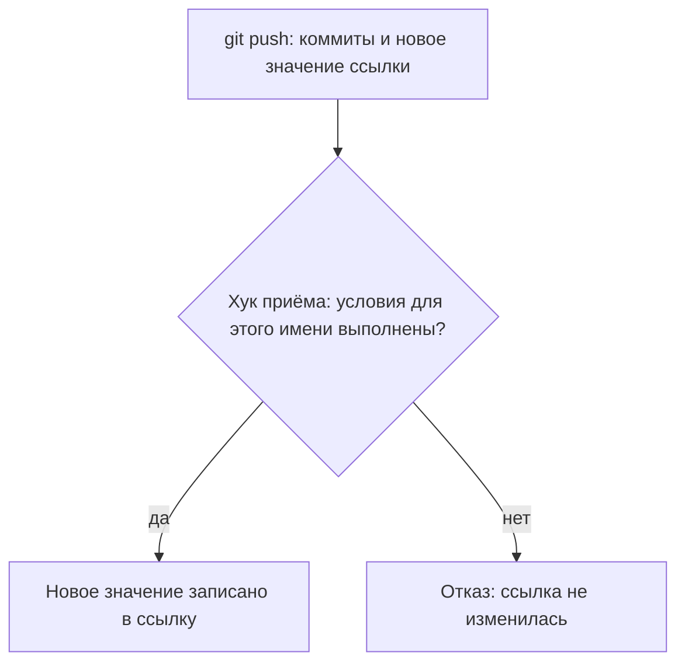
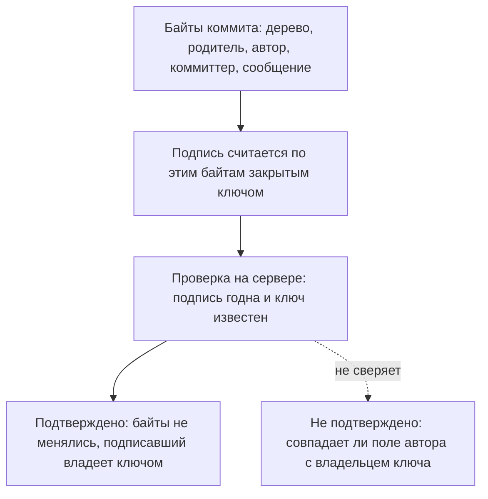

# Защита веток, обязательное ревью, подпись коммитов

Конец рабочего дня, разработчик дописал изменение и отправляет его в
основную ветку проекта, `main`. Завтра из неё соберут релиз. Отправка
возвращается с отказом: сервер не принял коммит, потому что у него нет
годной подписи, и выглядит это так:

```text
remote: отказ: коммит 70dcc00 без годной подписи (%G? = N)
 ! [remote rejected] main -> main (pre-receive hook declined)
```

Тот же коммит под именем `feature` уходит без единого замечания. А вечером
ветку сливают в `main` кнопкой в интерфейсе сервера, и неподписанный коммит
оказывается ровно там, куда его напрямую не пустили. Разгадка складывается
из двух половин: правило привязано к имени `refs/heads/main`, и проверка
стоит только на отправке по push. Первую половину обошло другое имя,
вторую — кнопка, которая пишет в ссылку на самом сервере. Такие правила
называют защитой веток; разберём, что проверяет каждое условие, где
остаются обходы и что удостоверяет зелёная метка подписи у коммита.

## Что такое защита ветки

Чтобы понять механику, нужно одно внутреннее устройство git. Ветка в git —
это не папка и не копия кода, а имя-указатель на коммит. Имя `main`
целиком записывается как `refs/heads/main`, и всё, что сервер хранит про
ветку, — это какой коммит стоит за этим именем. Такое имя называют ссылкой.

Бытовой пример — ярлык на рабочем столе: это тоже имя, которое указывает на
файл. Перенастроить ярлык на другой файл можно, не трогая ни один из них.
Ломается аналогия на природе указателя: ярлык ссылается на файл по пути,
а ссылка в git — на конкретный коммит по его сумме. Отправка на сервер,
команда push, — это просьба записать в ссылку новое значение и передать
коммиты, которых у сервера ещё нет.

Общая копия репозитория живёт на форже — службе вроде GitHub или GitLab,
которая хранит репозитории команды и даёт им веб-интерфейс. Защита ветки —
набор условий в настройках форжа, которые сервер проверяет перед записью
нового значения в ссылку. Условий обычно четыре.

Первое — обязательное ревью. Слияние в защищённую ветку идёт только через
запрос на слияние. Запрос — это предложение влить одну ветку в другую, к
которому на форже прикладывается обсуждение и одобрение другого человека.

Второе — обязательные проверки: шаги конвейера из `quality-gates` обязаны
закончиться зелёным вердиктом. Третье — запрет перезаписи истории: нельзя
записать в ссылку историю, где часть старых коммитов отсутствует. Такая
замена называется force push и по устройству похожа на переписывание
страницы журнала задним числом. Четвёртое — годная подпись у каждого
нового коммита. Первое и второе условия про людей и конвейер, третье и
четвёртое про содержимое.

У четырёх условий есть общее свойство, и оно важнее любого из них по
отдельности: выполняются они на сервере, в момент записи. Всё, что
выполняется на машине разработчика, защитой не считается, потому что
отключается ключом команды. Это показано прогоном в разделе «Как это
атакуют».

**Зачем это в работе AppSec-инженера.** Настройки защиты стоят везде, где
вообще есть ревью, и проверка их — работа на двадцать минут, которая
регулярно находит дыру. Здесь же живёт исполнение вердикта гейта: гейт в
конвейере ничего не запрещает, пока его проверка не объявлена обязательной
в защите ветки.

## Как это работает

**Откуда это взялось.** В распределённой системе контроля версий у сервера
нет особых прав по устройству. Он такая же копия, как любая другая, и
запись в него — обычная передача объектов. Правил «кому что можно писать»
в самой модели нет, поэтому условия записи пришлось надстраивать сверху, на
стороне сервера. Место для надстройки при этом ровно одно — момент, когда
сервер единственный раз получает управление: приём новых значений ссылок.

Проверкой занимается хук приёма — программа, которую сервер запускает на
каждую отправку до записи. У форжа такую роль играет встроенный механизм
правил защиты, а на самодельном сервере — скрипт `pre-receive`; строка
`pre-receive hook declined` из вступления — это его отказ. Хук получает
старое значение ссылки, новое значение и сам набор коммитов. Из этого он
проверяет, что новая история продолжает старую (запрет перезаписи), и
проходит по каждому новому коммиту, например смотрит его подпись. Если
проверка не прошла, хук отказывает, и ссылка не меняется.

Бытовой пример — контроль на въезде на склад: груз досматривают у ворот,
до того как коробки попадут на полку, потому что потом досматривать поздно.
Груз здесь — коммиты, полка — ссылка, ворота — момент приёма. Ломается
аналогия на числе ворот: у склада они одни, а имён у ссылок сколько угодно,
и заводится новое имя бесплатно. Правило привязано к имени вида
`refs/heads/main`, и на имя `refs/heads/feature` оно не распространяется,
если на него не заведено своё правило.



**Описание схемы.** Отправка попадает в хук приёма раньше любой записи.
Если условия для этого имени выполнены, ссылка получает новое значение.
Если нет, хук отказывает, и ссылка остаётся прежней. Другого входа у
отправки по push нет, поэтому хук — единственные ворота на этом пути.

Отдельного разбора стоит подпись коммита. Цифровая подпись уже встречалась
в `hmac-vs-signature`: закрытым ключом подписывают, открытым проверяют,
и проверить может любой, у кого есть открытый ключ. В git подпись считается
по байтам коммита закрытым ключом подписывающего. Ключом здесь служит ключ
GPG — программы подписи и шифрования, которая старше самого git, — или
привычный ключ SSH; открытая часть ключа загружена на форж. Вердикт
проверки git печатает кодом `%G?`: `G` означает «подпись годна и ключ
известен», `N` — подписи нет.

Коммит при этом содержит два поля про людей: автор — кто написал
изменение, и коммиттер — кто оформил коммит. Обе строки берутся из
настроек того, кто делал коммит, и ничем не ограничены. Документация
GitHub оговаривает это прямо: автор коммита — строка в настройках. Отсюда
следствие, которое стоит увидеть, а не выводить: коммит бывает подписан
годной подписью и при этом иметь в поле автора чужое имя:

```text
b1aac9e  подпись: G  подписал: dev@stand  автор в шапке: Тимлид <lead@stand>
```

Проверка `%G? = G` означает «подпись годна и ключ известен». Она не
означает «коммит написал тот, кто записан автором»: Тимлид из шапки здесь
ни при чём, потому что подпись удостоверяет ключ, а не строку.



**Описание схемы.** Подпись вычисляется по всем байтам коммита, поэтому
сервер подтверждает две вещи: содержимое не менялось, и у подписавшего
есть закрытый ключ. Поле автора входит в подписанные байты, но сервер не
сверяет его с владельцем ключа, поэтому про авторство годная подпись
молчит.

## Как это атакуют

Все три обхода воспроизведены на стенде. Стенд — это голый репозиторий,
то есть копия без рабочих файлов, в каком виде репозиторий живёт на
сервере, и написанный для него хук приёма. Хук повторяет два условия из
четырёх: годную подпись и запрет перезаписи истории.

**Обход 1: правило стоит на одном имени.** Отправка неподписанного коммита
в защищённое имя отклонена:

```text
remote: отказ: коммит 70dcc00 без годной подписи (%G? = N)
 ! [remote rejected] main -> main (pre-receive hook declined)
```

Та же история под другим именем ветки уходит без замечаний: на стенде
такая отправка вернула код 0, и неподписанный коммит лёг на сервер.

Дальше всё решает то, как устроено слияние в основную ветку. Если слияние
делает разработчик командой push, хук его остановит: он проверяет каждый
новый коммит, и на стенде отправка слияния в `main` получила тот же отказ.
Но если слияние делает сам сервер — кнопкой в интерфейсе форжа или ботом
автослияния, — хук приёма не вызывается вовсе. Сервер в этот момент не
принимает чужую отправку, а пишет сам. На стенде такое серверное слияние
провело неподписанный коммит в `main`: через дверь, а не через окно.

У настоящего форжа на этом месте может стоять второй контур — проверка
условий при самом слиянии, и тогда кнопка откажет. Есть он или нет, зависит
от вендора и настроек; на стенде его нет нарочно, чтобы показать саму дыру.
Как включить второй контур, разобрано в разделе «Как защититься».

Прежде чем читать дальше, ответьте: если раскинуть правило шаблоном на все
имена, но оставить в исключениях учётную запись сборки, путь исчезнет или
сменит вход?

**Обход 2: клиентский хук снимается ключом.** Клиентский хук — скрипт на
машине разработчика, который git запускает до создания коммита; устройство
таких хуков разбирает `pre-commit-hooks`. На стенде хук запрещал коммит с
ключом доступа внутри, отработал и отклонил коммит. Тот же коммит с ключом
`--no-verify` прошёл и лёг в историю — с годной подписью:

```text
обычный коммит: rc=1   pre-commit: похоже на ключ доступа — коммит отклонён
--no-verify:    rc=0
попал в историю: 1b32721  подпись G
```

Прежде чем читать объяснение, скажите, почему серверный хук этот коммит не
отклонил.

Серверный хук промолчал, потому что его условия выполнены: подпись у
коммита есть, история продолжается. А до содержимого файлов его условиям
дела нет: он смотрит, кто и как пишет в ссылку, а не что лежит в коммите.

**Обход 3: исключение из правила.** Список тех, на кого правило не
распространяется, — штатная возможность форжа, список обхода. Назначение
у него мирное: дать запасной путь на случай, когда обычный порядок не
работает, например починить ночью сломанный конвейер. Учётная запись
сборки, попавшая в такой список, превращает выполнение команды в конвейере
в запись в защищённую ветку. Связь с `pipeline-security` здесь прямая: кто
управляет входом конвейера, тот и пишет в `main` мимо всех условий. Это
же ответ на вопрос из обхода 1: шаблон на все имена закрыл дверь по имени,
а исключение открыло её по учётной записи.

## Как это выглядит в коде

Защита ветки живёт в настройках форжа, а не в файле проекта, поэтому «код»
здесь — состояние настроек и содержимое истории. Часть признаков видна и
без доступа к администрированию, по одной команде `git log`:

| Признак | Где смотреть |
|---|---|
| Коммит без подписи | `git log --format='%h %G? %s'` |
| Подпись есть, автор чужой | `git log --format='%h %G? %GS %an <%ae>'` |
| Слияние мимо запроса на слияние | по истории не отличить: журнал аудита форжа |
| Правило только на одном имени | список веток на сервере |

Обозначения в форматах: `%h` — короткая сумма коммита, `%G?` — вердикт о
подписи, `%GS` — ключ подписавшего. Дальше `%an` и `%ae` — имя и адрес из
поля автора, а `%s` — первая строка сообщения коммита.

Третьей строке таблицы нужна оговорка: кнопка форжа и ручное слияние
оставляют в истории одинаковый коммит с двумя родителями. У форжа принято
писать в сообщение такого коммита номер запроса, например «Merge pull
request #7», но это обычный текст сообщения, который можно набрать и
руками. Поэтому надёжный признак живёт не в истории, а в журнале аудита
форжа.

Первая строка таблицы — самая полезная. Ветка, где часть коммитов не имеет
годной подписи, говорит об одном из двух: либо условие подписи не
включено, либо кто-то входит в список исключений. Обе находки — повод идти
в настройки.

## Как защититься

Каждая починка ниже закрывает один из разобранных обходов, и сделать их
надо все, потому что обходы подменяют друг друга.

**Условие подписи ставится на сервере и на все имена, которые сливаются в
основную ветку.** Правило на одном имени закрывает одно имя, а обход 1
прошёл через соседнее. Рабочих варианта два: шаблон правила на все имена,
из которых сливают, и проверка условий при слиянии, а не только при записи.
Второй вариант закрывает и дорогу через кнопку форжа, потому что условия
проверяются в момент слияния, где бы оно ни запускалось.

**Клиентский хук дублируется серверным.** Не заменяется, а дублируется: на
машине разработчика хук даёт быструю обратную связь, на сервере —
обязательность. Обход 2 показал, почему одного клиентского хука мало:
ключ `--no-verify` снимает его, ни о чём не спрашивая. Разбор раскладки
проверок по ступеням — в `shift-left`.

**Подпись читается вместе с полем автора.** Условие «все коммиты
подписаны» закрывает подделку содержимого, а не подделку авторства: поле
автора — строка из настроек, и подпись её не удостоверяет. Там, где по
авторству считают ответственность, сверять нужно подписавший ключ с
ожидаемым владельцем, а не метку годности.

**Обязательные проверки объявляются поимённо.** Гейт в конвейере даёт
вердикт, а запрет даёт защита ветки, и только если проверка названа
обязательной по имени. Отсюда тонкая поломка: проверку переименовали в
описании конвейера, а в настройках защиты не переименовали. По документации
GitHub обязательный статус с пропавшим именем остаётся в ожидании, и каждое
слияние встаёт с «Waiting for status to be reported». Дыра тут не
молчаливая, но видна она как сбой, а не как дыра. Риск в том, как такой
сбой чинят: быстрый способ, удаление записи из обязательных, оставляет
ветку без проверки вовсе. Механика вердиктов — в `quality-gates`.

**Списки исключений пересматриваются.** Каждая запись в таком списке —
постоянная дыра в защите, открытая круглосуточно, а не на время аварии.
Учётной записи сборки в этих списках не место: обход 3 показал, во что она
там превращается.

## Частая ошибка

За зелёной меткой видят автора: если в защищённой ветке все коммиты
подписаны и метка подтверждения стоит, то авторство коммитов установлено.
Ответьте, установлено ли оно на самом деле, прежде чем читать
опровержение.

Подпись связывает коммит с ключом, а поле автора — произвольная строка из
настроек. Коммит с годной подписью и чужим именем в поле автора получается
одной командой и никаких прав не требует. Его прогон был в разделе «Как
это работает». Метка на сервере при этом остаётся зелёной, потому что
сервер проверил подпись, а не соответствие подписи полю. Цепочка у мнения
бытовая: подпись на бумаге удостоверяет человека, и зелёная метка на
коммите читается так же. Перенос ломается на том, что здесь подписываются
байты коммита, а строка автора — часть этих байтов, а не свойство
подписывающего.

Практическое следствие касается расследований. Вопрос «кто это написал» по
полю автора не решается даже в репозитории с обязательной подписью.
Решается он по тому, чьим ключом коммит подписан, и по тому, кому этот
ключ выдан.

Контрпример к обратному выводу — «значит, подпись бесполезна». Она
закрывает другое: подмену содержимого и вставку коммитов от чужого имени
тем, у кого нет ключа. До обязательной подписи доступа на запись хватало,
чтобы положить в историю коммит с любым именем автора и никак это не
пометить. После неподписанный коммит виден сразу.

## Чеклист для ревью

1. Проверьте, что условие защиты заведено на все имена ссылок, которые
   сливаются в основную ветку, а не только на неё саму.
2. Проверьте, что каждая проверка, вердикт которой должен что-то
   запрещать, объявлена обязательной поимённо.
3. Проверьте, что имена обязательных проверок совпадают с именами заданий
   в описании конвейера.
4. Проверьте, что запрет перезаписи истории включён для защищённых имён.
5. Проверьте, что в списках исключений из правил нет учётных записей
   сборки и других служебных учётных записей.
6. Проверьте, что клиентские хуки продублированы проверками на сервере.

## Попробуй сам

Возьмите любой доступный репозиторий и ответьте на два вопроса по его
истории, без доступа к настройкам администрирования:

```text
git log --format='%h %G? %GS  %an <%ae>' -30
```

1. Сколько коммитов из тридцати не имеют годной подписи.
2. Сколько среди подписанных таких, где подписавший ключ не соответствует
   полю автора.

**Наблюдаемый признак выполнения:** у вас есть два ответа числами, и по
каждому — вывод о том, какое условие защиты выключено или обходится. Если
оба ответа благополучны, назовите из списка веток репозитория имя, для
которого вы не можете подтвердить защиту.

## Проверь себя

1. Какие утверждения об авторстве из этой таблицы удостоверены подписью, а
   какие — нет?

   ```text
   $ git log --format='%h  %G?  подписал: %GS  автор: %an <%ae>' -3
   b1aac9e  G  подписал: dev@stand  автор: Тимлид <lead@stand>
   9c4e210  G  подписал: dev@stand  автор: dev <dev@stand>
   70dcc00  N  подписал: —          автор: Тимлид <lead@stand>
   ```

2. Предскажите, что напечатает вторая команда?

   ```text
   GIT_AUTHOR_NAME='Тимлид' GIT_AUTHOR_EMAIL='lead@stand' git commit -qm fix
   git log --format='%h %G? автор: %an <%ae>  коммиттер: %cn <%ce>' -1
   ```

3. В основную ветку попал неподписанный коммит, хотя требование подписи
   включено. Какую починку выбрать?

   A. Обязать разработчиков ставить клиентский хук, проверяющий подпись до
   отправки.

   B. Раскинуть правило подписи на все имена, из которых сливают в основную
   ветку, и вычистить списки исключений.

   C. Просить ревьюеров сверять поле автора с именем подписавшего глазами.

4. Возврат к теме `quality-gates`: почему красный вердикт гейта сам по
   себе ничего не запрещает?

5. Возврат к теме `hmac-vs-signature`: чем подпись коммита отличается от
   кода аутентичности сообщения по тому, что каждая удостоверяет, и по
   тому, кто может проверить?

<details markdown="1">
<summary>Ответ 1</summary>

1. Подпись удостоверяет два факта: байты коммита не менялись, и подписавший
   владеет ключом. Поле автора не удостоверено ничем — это строка из
   настроек. У третьего коммита нет и самой подписи (N). Поэтому в
   расследовании «кто написал» решается по подписавшему ключу, а не по
   полю автора.

</details>

<details markdown="1">
<summary>Ответ 2</summary>

2. Вывод вида:

```text
3fbc9a0  N  автор: Тимлид <lead@stand>  коммиттер: dev <dev@stand>
```

   Поле автора — произвольная строка, которую здесь задали переменные
   окружения, а N — потому что коммит не подписан. Прогон делается в любом
   локальном репозитории без настройки подписи; сумма коммита будет другой,
   остальное — тем же.

</details>

<details markdown="1">
<summary>Ответ 3: разбор вариантов</summary>

3. Верный вариант — B.

   A. Клиентский хук выполняется на машине разработчика и снимается ключом
   `--no-verify` — это разобранный в теме обход 2. Условием защиты может
   быть только проверка на сервере в момент записи.

   B. Верно. Правило привязано к имени ссылки, и коммит вошёл через имя, на
   которое правила не было. Шаблон на все имена, сливаемые в основную
   ветку, закрывает этот путь, а списки исключений — постоянные дыры, их
   пересматривают.

   C. Поле автора — произвольная строка, и подпись её не удостоверяет:
   сверка глазами проверяет то, что подделывается одной переменной
   окружения (вопрос 2). Путь через незащищённое имя при этом остаётся
   открытым.

</details>

<details markdown="1">
<summary>Ответ 4</summary>

4. Потому что вердикт — это код возврата шага и цвет сборки. Запрет живёт
   в защите ветки, где проверка объявлена обязательной поимённо; без этой
   записи красный гейт ничего не останавливает.

</details>

<details markdown="1">
<summary>Ответ 5</summary>

5. Код аутентичности сообщения удостоверяет знание общего секрета, и
   проверить его может только тот, кто знает тот же секрет. Подпись
   удостоверяет владение закрытым ключом и проверяется любым, у кого есть
   открытый. Обе говорят о неизменности подписанных байтов; поле автора —
   строка среди этих байтов, а не свойство ключа.

</details>

## Источники

1. GitHub, «About protected branches»; реестр `gh-protected-branches`.
   Разделы: обязательное ревью перед слиянием, обязательные проверки,
   запрет перезаписи истории, требование подписанных коммитов, списки
   исключений из правил.
   <https://docs.github.com/en/repositories/configuring-branches-and-merges-in-your-repository/managing-protected-branches/about-protected-branches>
2. GitHub, «About commit signature verification»; реестр `gh-commit-signing`.
   Разделы: подпись через GPG, SSH и S/MIME; что означает метка
   подтверждения; оговорка о том, что автор коммита — строка в настройках.
   <https://docs.github.com/en/authentication/managing-commit-signature-verification/about-commit-signature-verification>

Каркас этапа: `owasp-cicd-top10`. Наследуется всеми темами этапа и отдельной
строкой не повторяется.

**Скоропортящийся слой.** Названия условий защиты в интерфейсах серверов,
состав списков исключений и форма меток подтверждения. Устройство — правило
на имя ссылки, проверка в момент записи, подпись против поля автора —
держится дольше.

**Маркеры уверенности.** Коммит с годной подписью и чужим именем в поле
автора получен **лично**, 2026-08-25, на локальном репозитории с подписью
ключом SSH; вывод `git log` сохранён. Отказ по хуку приёма, обход через
незащищённое имя ветки и снятие клиентского хука ключом `--no-verify`
**воспроизведены лично** на голом репозитории с написанным для этого хуком:
коды возврата 1 и 0 сохранены. Хук написан для стенда и повторяет два
условия защиты из четырёх — подпись и запрет перезаписи истории. Весь
сценарий 2026-10-03 прогнан заново целиком (git 2.55.0, подпись ключом SSH
на ed25519, хук на `pre-receive`): неподписанный push в `main` отклонён
(rc=1), та же история под именем `feature` принята (rc=0), push слияния в
`main` снова отклонён, потому что хук проверяет каждый новый коммит,
серверное слияние через `update-ref` прошло мимо хука и провело
неподписанный коммит в `main`, а подписанный коммит с чужим полем автора
хук в `main` пропустил (G, подписал dev@stand, автор Тимлид). Команда из
вопроса 2 самопроверки прогнана тем же днём; вывод совпал по форме, сумма
коммита другая, как и сказано в ответе. Интерфейсы настроек живых серверов
**не проверялись**, живого форжа у проекта нет, и всё, что сказано про
списки исключений и обязательные проверки, изложено **по документации
вендора**. Кнопка слияния на живом форже **не воспроизводилась**: сам обход
показан на стенде, а существование второго контура проверки при слиянии
изложено по документации вендора. Поведение обязательной проверки с
пропавшим именем — ожидание статуса и блокировка слияния, а не молчаливое
снятие — сверено 2026-10-03 с документацией GitHub «Troubleshooting
required status checks» (прямые фразы «Pending» и «Waiting for status to
be reported»).
