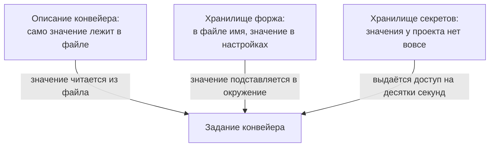
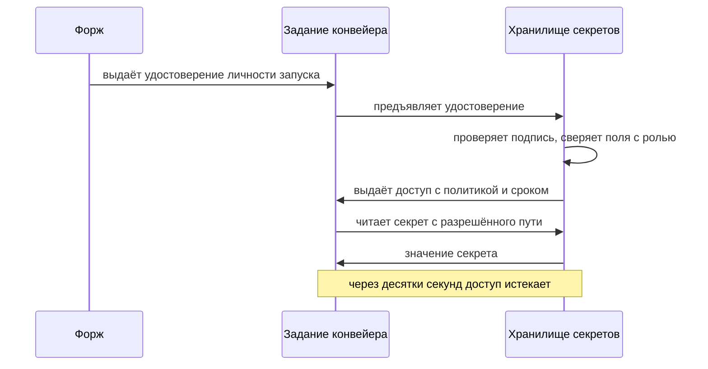

# Управление секретами в CI, интеграция с Vault

В конвейере сборки секрет базы данных лежит в настройках проекта. Форж —
система, которая хранит репозиторий и запускает конвейер, — подставляет
значение в окружение задания. А если шаг напечатает его в журнал, форж
заменит вхождение на звёздочки: так устроено маскирование. Проверим, что
выдерживает эта замена, — вот прогон модели механизма, то есть тех же
подстановок, выполненных командами оболочки: шесть способов напечатать одно
и то же значение:

```text
как печатаем                 что видно в журнале
прямая печать                [MASKED]
в составе строки             пароль=[MASKED]
base64                       czNjcjN0LWZyb20tdmF1bHQ=
наоборот                     tluav-morf-t3rc3s
по одному знаку              s 3 c r 3 t - f r o m - v a u l t
через переменную окружения   S=[MASKED]
```

Три строки из шести прошли насквозь, и безо всякого умысла:
перекодирование встречается в обычных командах передачи данных, разбор по
знакам — в отладочном выводе. Маскирование заменяет буквальные вхождения
значения в потоке журнала, а о смысле не знает ничего. Поэтому разговор
начинается не с журнала, а с места, где живёт значение: таких мест три, и
от места зависят круг читателей, срок и цена кражи. Как секрет доезжает от
каждого из трёх мест до задания — и как прогоном проверить, что выданный
доступ ограничен и политикой, и сроком?

## Три места, где живёт секрет

Первое место — само описание конвейера: значение записано в файле рядом с
шагами. Читает его каждый, у кого есть доступ к репозиторию, и остаётся оно
в истории даже после удаления строки. Это тот же дефект, что секрет в
прикладном коде, и чинится он там же — тема `secrets-in-code`.

Второе место — хранилище секретов самого форжа. Значение вводится один раз,
в настройках проекта, а в описании конвейера остаётся только имя. При
запуске форж подставляет значение в окружение задания и маскирует его в
журнале. Доступ к секрету при этом можно сузить — средой выкладки или
защищённой веткой; защита веток разобрана в `branch-protection`. Этот
вариант лучше первого на порядок, но секрет остаётся статичным: значение
живёт годами, доступно всем заданиям, которым его выдали, и само не меняется.

Третье место — отдельный сервис, хранилище секретов: его единственная работа —
держать значения и выдавать к ним доступ по запросу. Самое известное такое
хранилище — Vault компании HashiCorp, а OpenBao — его свободный форк;
прогоны в этой теме сделаны на OpenBao. Задание здесь не хранит секрета
вовсе. Оно предъявляет хранилищу удостоверение своей личности, а хранилище
выдаёт в ответ доступ — с политикой, то есть перечнем дозволенного, и со
сроком в десятки секунд.

Кому и что выдавать, хранилище знает из роли. Роль — именованная запись в
хранилище: она связывает способ опознавания с политиками и пределами
доступа, и каждый предъявитель опознаётся под своей ролью.

Бытовая картина — проходная предприятия. Работник не носит с собой
мастер-ключ от всех комнат: он предъявляет удостоверение, и проходная
выдаёт пропуск на одну смену и только в его комнаты. Соответствие прямое:

| В механизме | На проходной |
|---|---|
| хранилище секретов | отдел пропусков |
| удостоверение личности запуска | служебное удостоверение работника |
| доступ с политикой и сроком | пропуск со списком комнат на одну смену |
| сверка полей удостоверения с ролью | сверка удостоверения со списком на проходной |

Где аналогия ломается: пропуск — пластиковая карта в кармане, а выданный
доступ — строка в памяти задания. Украсть её способен любой код, который
задание исполняет, и работает украденное, пока не истёк срок. Поэтому срок
здесь не удобство, а граница окна кражи.

**Зачем это в работе AppSec-инженера.** Переход от статичного секрета к
короткоживущему — типовая задача первого года работы. Ценность её в том,
что она меняет цену утечки. Украденный статичный секрет работает, пока его
не отзовут. Украденный короткоживущий — минуту.

**Откуда это взялось.** Первые конвейеры получали доступы так же, как
человек: в конфигурации лежали логин и пароль служебной учётной записи.
Ломалось это дважды. Секрет попадал в репозиторий, потому что конфигурация
лежит в репозитории. И секрет не менялся: смена означала одновременную
правку во всех местах, где он прописан, и её откладывали. Хранилище
секретов форжа закрыло первую половину проблемы, обмен личности на
короткоживущий доступ — вторую.

Три места отличаются тем, что именно доезжает до задания:



**Описание схемы.** Сверху вниз: три места жительства секрета и задание
конвейера под ними. От первого места к заданию едет само значение, прямо из
файла описания. От второго — то же значение, но подстановкой в окружение:
файл его уже не содержит. От третьего — не значение, а доступ к нему,
выданный на десятки секунд.

## Как это работает

Эта тема — про доставку: путь от хранилища до задания. Устройство самого
хранилища, статические и динамические секреты и ротация как постоянный
режим стоят в плане на этапе 4 и разбираются там. Механика подписи
удостоверения — в `hmac-vs-signature`. Почему секрет, побывавший в
репозитории, считается скомпрометированным навсегда — в `secrets-in-code` и
`secret-history-scan`.

**Маскирование — подстановка, а не понимание.** Форж просматривает поток
журнала и заменяет вхождения известных ему значений — тех, что лежат в
секретах проекта и выданы этому запуску. Заменяются только буквальные
вхождения: строка в потоке совпала со значением посимвольно. Всё, что
отличается от значения хотя бы формой, проходит насквозь — это и показывает
прогон из начала темы.

Три прошедших способа — не хитрость, а будни. Перекодировка в base64 —
обычный способ записать значение печатными знаками, чтобы передать его в
поле или файл, где байты нежелательны. Печать по одному знаку — обычный
отладочный вывод. Обратный порядок получается сам при работе со строками.
Ни один из трёх не требует намерения спрятать секрет — достаточно напечатать
производную от него.

Проверьте себя на этом прогоне. Шаг печатает переменную окружения, в
которую заранее положили перекодировку секрета в base64. Замаскирует форж
такой вывод или нет — и по какому признаку вы ответили?

Нет, не замаскирует: в потоке лежит уже не значение, а его перекодировка, а
подстановка знает только букву значения. Признак ответа — не «похоже ли на
секрет», а «совпало ли посимвольно». Поэтому журналу верят только после
вопроса о том, что вообще туда печаталось.

**Обмен личности на доступ.** Задание предъявляет хранилищу одно из двух.
Первое — пара опознавателей: одно значение называет роль, второе доказывает
право на неё, то есть логин и пароль для машины; в Vault он называется
`approle`. Второе — подписанное удостоверение личности, которое форж
создаёт на конкретный запуск: по формату это подписанный токен из
`jwt-basics`, а протокол выдачи разбирает `oidc`. Хранилище проверяет
предъявленное, сверяет с ролью и выдаёт временный доступ. У выданного
доступа два ограничителя: политика — какие пути можно читать, и срок —
сколько секунд доступ живёт.

Разница между двумя способами существенна. Пара опознавателей где-то
хранится до предъявления: её можно скопировать и предъявить с чужой машины,
то есть это тот же статичный секрет, только с коротким сроком. Удостоверение
личности заранее не хранится нигде: его создают на запуск, и связано оно
полями с этим запуском — репозиторием, веткой, именем конвейера. Украсть
его способен код, исполняемый внутри того же запуска, но работает
украденное, пока не истёк срок: окно закрывает срок, а не невозможность
кражи.

Порядок обмена целиком:



**Описание схемы.** Форж выдаёт заданию удостоверение личности при запуске.
Задание предъявляет удостоверение хранилищу; хранилище проверяет подпись и
сверяет поля с ролью, после чего выдаёт доступ с политикой и сроком. По
этому доступу задание читает значение с разрешённого пути. Через десятки
секунд доступ истекает сам, без отзыва.

## Что умеет и чего не умеет

**Что умеет хранилище форжа.** Убрать значение из репозитория и из истории:
в описании конвейера остаётся имя, а не значение. Ограничить доступ к
секрету средой выкладки или защищённой веткой — то есть выдавать его только
заданиям на избранных запусках. Маскировать буквальные вхождения в журнале.

**Что умеет хранилище секретов сверх этого.** Выдавать доступ на срок:
выданное умирает само, и отзыв не нужен. Разделять права политикой, а не
фактом владения значением: одна роль читает путь `ci/db`, другая — `ci/prod`,
и владение одной не даёт другой. Отзывать выданное, не трогая остальных
потребителей: у каждого потребителя своя выдача, а не общий пароль.

**Чего не умеет ни то ни другое.** Помешать заданию распорядиться полученным
значением. Секрет, доехавший до шага, доступен всему, что этот шаг
запускает, — включая чужой код, попавший в сборку; эта сторона разобрана в
`pipeline-security`.

Не умеет ни одно из хранилищ и отличить законное использование от кражи.
Хранилище видит запрос с годным удостоверением и отвечает на него. Кто
именно выполняет команду на сборочной машине в этот момент, ему неизвестно.

## Как запустить

Порядок из пяти шагов значим: каждый следующий опирается на предыдущий.

**Шаг 1. Убрать значения из описания конвейера.** Начинать надо с этого:
хранилище, поднятое рядом со статичным секретом в файле, не меняет ничего.
Значение по-прежнему читает каждый, у кого есть доступ к репозиторию. Как
секрет выводят из кода и истории и почему удаления строки мало, разбирает
`secrets-in-code`.

**Шаг 2. Положить секрет в хранилище форжа.** Это настройки проекта, раздел
секретов. Отдельно проверьте область видимости: задания запускаются и на
чужих запросах на слияние, а такой запрос вправе предложить кто угодно.
Значение, доступное заданиям на чужих запросах, доступно и чужому коду
внутри них.

**Шаг 3. Передавать секрет через окружение, а не подстановкой в команду.**
Подстановка превращает значение в часть текста команды, а текст команды
разбирает интерпретатор и показывает журнал. Отсюда и утечки, и инъекции;
разбор обеих — в `pipeline-security`, здесь достаточно самого правила.

**Шаг 4. Завести роль в хранилище секретов и обменять личность на доступ.**
Прогон на локальном хранилище OpenBao с клиентом командной строки `bao`.
Три команды делают по одному делу: первая заводит роль с пределами, вторая
предъявляет пару опознавателей и получает токен, третья спрашивает у
хранилища, что именно выдано.

Одна вещь в прогоне подготовлена заранее: политика `ci-read`, запись
«читать путь `ci/db` можно», записана в хранилище до прогона. На её
содержимом построен раздел «Как читать вывод». Пара опознавателей,
наоборот, рождается здесь: `role_id` хранилище назначает роли при создании,
`secret_id` выдаёт отдельный вызов, и дальше оба лежат в переменных `$RID`
и `$SID`.

```text
$ bao write auth/approle/role/pipeline \
    token_policies=ci-read token_ttl=30s token_max_ttl=60s secret_id_ttl=60s
$ TOK=$(bao write -field=token auth/approle/login \
      role_id=$RID secret_id=$SID)
$ bao token lookup -format=json "$TOK" \
    | jq -r '.data | "ttl=\(.ttl)s policies=\(.policies|join(","))"'
ttl=30s policies=ci-read,default
```

Роль `pipeline` создана с четырьмя пределами: `token_policies` — политика
выдаваемого доступа, `token_ttl` — его срок, `token_max_ttl` — предел, до
которого доступ можно продлевать, `secret_id_ttl` — срок самого
опознавателя. Опознание здесь — пара опознавателей: `role_id` называет
роль, `secret_id` доказывает право на неё. Ответ на `token lookup` —
JSON-документ, и два нужных поля из него достаёт `jq` — утилита командной
строки, читающая JSON. Срок — тридцать секунд, список политик —
`ci-read` плюс служебная `default`, которая своих прав не даёт.

**Шаг 5. Проверить оба ограничителя прогоном.** Политику — попыткой
прочитать чужой путь: роль с политикой `ci-read` про путь `ci/prod` знать
не должна. Срок — тем же чтением после его истечения: через тридцать с
небольшим секунд тот же запрос обязан отказать. Как выглядят оба отказа —
в следующем разделе.

## Как читать вывод

Хранилище отвечает кодами и полями, и читать в ответе надо три вещи.

**Срок жизни выданного доступа.** Это поле `ttl` в ответе на опознание.
Значение, не совпадающее с ожидаемым, обычно означает, что настроена не та
роль: срок приезжает из настройки роли, а не из запроса.

**Политики.** Это список `policies` в том же ответе. Строка `default` в нём
есть почти всегда и своих прав не даёт, поэтому смотреть надо на остальные.

**Отказ.** Отказ по политике и отказ по истёкшему сроку выглядят одинаково —
код 403 и текст «permission denied». Различить их можно только по тому, что
вы запрашивали и когда:

```text
чтение своего пути ci/db       -> s3cr3t-from-vault
чтение чужого пути ci/prod     -> Code: 403, permission denied
через 34 с, свой же путь       -> Code: 403, permission denied
```

Два отказа в таблице одинаковы, а причины у них разные. Первая строка —
законное чтение: путь `ci/db` входит в политику `ci-read`, и срок не истёк.
Вторая — отказ по политике: путь `ci/prod` в политику не входит. Третья —
отказ по сроку: путь свой, но после выдачи прошло тридцать четыре секунды
при сроке в тридцать.

Одинаковый ответ на две разные причины — не изъян хранилища, а решение:
подробный отказ рассказывал бы запрашивающему, какие пути существуют и что
ему не положено. Практическое следствие для отладки конвейера: при отказе
первым делом смотрят на срок, а не на политику. Срок истекает сам:
полминуты между выдачей и отладочным запросом проходят незаметно, а
политика без правки роли не меняется.

## Границы метода

**Граница первая: обмен личности на доступ проверен здесь наполовину.**
Прогон выше сделан на паре опознавателей, а не на удостоверении личности
задания: удостоверение выдаёт сервер форжа, которого у этого проекта нет.
Разница между способами существенна — пара опознавателей хранится заранее,
удостоверение нет. Поэтому настройка обмена по удостоверению изложена по
документации вендора, а не по прогону; порядок на стороне GitHub — в первом
источнике темы.

**Граница вторая: маскирование проверено моделью.** Замена буквальных
вхождений в потоке журнала описана документацией обеих систем — GitHub
Actions и GitLab CI. Воспроизведена она здесь своими командами оболочки, а
не прогоном на живом сервере форжа.

**Граница третья: половина предмета лежит на этапе 4.** Устройство
хранилища, статические и динамические секреты, ротация как постоянный режим —
там. Здесь только доставка до задания.

**Цена.** Убрать значения из описаний конвейера — часы. Перевести один
конвейер на короткоживущий доступ — день-два, и большая часть этого времени
уходит на роли и политики, а не на конвейер. Перевести все конвейеры —
квартал.

## Частая ошибка

Звёздочки в журнале читаются как итог: значение лежит в секретах проекта,
форж маскирует его в выводе — значит, утечка через журнал закрыта.
Выдерживает ли проверку следствие «маскирует — значит, закрыта»? Ответьте
себе «да» или «нет» и держите ответ, пока читаете.

**Нет: маскирование заменяет буквальные вхождения и ничего не знает о
смысле.** Три из шести способов печати в прогоне из начала темы прошли
насквозь, и ни один не требовал намерения скрыть секрет. Цепочка
рассуждения здесь короткая: журнал показывает звёздочки вместо значения, и
это читается как «утечки нет». Не замечают при этом, что звёздочки стоят
только там, где значение попало в поток как есть, посимвольно.

Хуже другое: маскирование создаёт ощущение, что печать секрета безопасна, и
из-за этого команды перестают следить, куда значение вообще попадает.
Правило обратное: **секрет не должен доезжать до шагов, которым он не
нужен**, — и маскирование к этому правилу ничего не добавляет.

Контрпример к обратному выводу — «значит, маскирование бесполезно». Оно
ловит самый частый случай: значение, случайно напечатанное целиком при
отладке. Это единственное, на что оно рассчитано, и с этим оно справляется.

## Чеклист для ревью

1. Проверьте, что в описаниях конвейера нет записанных значений секретов.
2. Проверьте, что секреты не доступны заданиям, запускаемым чужими запросами на
   слияние.
3. Проверьте, что значение секрета передаётся шагу через окружение, а не
   подстановкой в текст команды.
4. Проверьте, что у выданного конвейеру доступа есть срок жизни, а не бессрочность.
5. Проверьте, что политика доступа ограничивает пути, а не выдаёт чтение целиком.
6. Проверьте, что секрет доезжает только до тех заданий, которым он нужен.

## Попробуй сам

Возьмите один свой конвейер и составьте карту секретов. Строка карты — один
секрет. Колонки: где лежит значение, какие задания его получают, каким из
них он нужен на деле и есть ли у доступа срок жизни.

После этого выберите один секрет из карты и ответьте письменно на два
вопроса. Что сделает нападающий, получив его? Сколько времени у него на это
будет?

**Наблюдаемый признак выполнения:** карта заполнена, и в ней есть хотя бы
одна строка, где задание получает секрет, который ему не нужен. Если такой
строки нет — назовите секрет с самым долгим сроком жизни и скажите, чем он
ограничен, кроме отзыва вручную.

## Проверь себя

1. Форж маскирует в журнале буквальные вхождения значения `S`. Предскажите,
   что окажется в журнале после каждой из трёх команд.

   ```text
   echo "token=$S"
   echo "$S" | base64
   printf '%s\n' "${S:0:4}"
   ```

2. Почему пара опознавателей роли — тот же статичный секрет, хотя и
   короткоживущий, а удостоверение личности задания — нет?
3. Назовите три места жительства секрета в конвейере и скажите, чем каждое
   следующее лучше предыдущего.
4. Почему хранилище отвечает на два разных отказа одинаково, и как при отладке
   узнать настоящую причину?

   ```text
   чтение своего пути ci/db       -> s3cr3t-from-vault
   чтение чужого пути ci/prod     -> Code: 403, permission denied
   через 34 с, свой же путь       -> Code: 403, permission denied
   ```

5. Возврат к теме `secrets-in-code`: почему секрет, побывавший в репозитории,
   считается скомпрометированным и после удаления строки?
6. Возврат к теме `secret-rotation`: чем короткоживущий доступ отличается от
   частой ротации статичного секрета?

<details markdown="1">
<summary>Ответ 1</summary>

1. Первая команда замаскируется: вхождение буквальное. Вторая и третья пройдут:
   после перекодирования и после обрезки буквального вхождения в потоке нет.
   Проверка модели механизма:

```text
$ S='s3cr3t-from-vault'
$ echo "token=$S" | sed "s/$S/[MASKED]/g"
token=[MASKED]
$ echo "$S" | base64 | grep -c "$S"
0
```

   Подстановка знает букву значения и не знает его смысл — поэтому журналу
   верят только после вопроса «а что вообще туда печаталось».

</details>

<details markdown="1">
<summary>Ответ 2</summary>

2. Пара опознавателей где-то хранится до предъявления: её можно скопировать и
   предъявить с чужой машины, и короткий срок у неё — срок украденного секрета.
   Удостоверение личности создаётся на конкретный запуск и заранее не хранится
   нигде. Связано оно полями с этим запуском, а окно возможной кражи закрывает
   его срок — минуты, а не годы.

</details>

<details markdown="1">
<summary>Ответ 3</summary>

3. В описании конвейера: значение читает каждый и остаётся в истории после
   удаления строки. В хранилище форжа: значения в репозитории нет, но оно
   статично и бессрочно. В хранилище секретов: значения нет нигде, а доступ
   выдаётся на срок и с политикой.

</details>

<details markdown="1">
<summary>Ответ 4</summary>

4. Вторая строка таблицы — отказ по политике: путь `ci/prod` в политику
   `ci-read` не входит. Третья — отказ по сроку: путь свой, но выдача уже
   истекла. Ответ один, потому что подробный отказ рассказывал бы
   запрашивающему, какие пути существуют. Различают отказы по тому, что
   запрашивали и когда; при отладке первым делом смотрят срок.

</details>

<details markdown="1">
<summary>Ответ 5</summary>

5. Потому что значение осталось в объектах истории и в копиях репозитория у
   всех, кто его получал. Удаление строки убирает значение из текущего
   состояния, а не из прошлых коммитов.

</details>

<details markdown="1">
<summary>Ответ 6</summary>

6. Ротация меняет статичное значение по расписанию, и между сменами украденное
   значение работает. Короткоживущий доступ не хранится вовсе: значение
   создаётся на задание и умирает вместе с ним, и окно использования
   украденного — десятки секунд.

</details>

## Источники

1. GitHub, «Configuring OpenID Connect in HashiCorp Vault»; реестр
   `gha-oidc-vault`. Разделы: обмен удостоверения личности конвейера на доступ к
   хранилищу вместо статичного секрета в настройках репозитория; настройка
   доверия на стороне хранилища.
   <https://docs.github.com/en/actions/how-tos/secure-your-work/security-harden-deployments/oidc-in-hashicorp-vault>
2. GitLab, «Pipeline security»; реестр `gitlab-pipeline-security`. Разделы:
   секреты в конвейере, защищённые и маскируемые переменные, ограничения
   маскирования.
   <https://docs.gitlab.com/ci/pipeline_security/>

Каркас этапа: `owasp-cicd-top10`. Наследуется всеми темами этапа и отдельной
строкой не повторяется.

**Скоропортящийся слой.** Названия разделов настроек, имена методов опознавания
в хранилище, состав ответа на опознание. Устройство — три места жительства
секрета, маскирование подстановкой, обмен личности на срочный доступ — держится
дольше.

**Маркеры уверенности.** Выдача короткоживущего доступа, отказ по политике на
чужом пути и отказ после истечения срока — **лично**, 2026-08-25, на локальном
хранилище OpenBao 2.6.2 (коммит dd9c19c от 2026-08-18), поднятом в контейнере в
режиме разработки; вывод сохранён. Прогон модели маскирования повторён
2026-10-03 на bash 5.3.20: значения таблицы и вывод команд из ответа 1
воспроизвелись дословно. Опознание сделано **парой опознавателей роли**, а не
удостоверением личности задания: сервера форжа, который такое удостоверение
выдаёт, у проекта нет, и эта часть изложена **по документации вендора**.
Поведение маскирования воспроизведено **моделью** механизма, описанного
документацией обеих систем: три способа печати из шести проходят насквозь.
Хранилище форжа, области видимости секретов и их доступность на чужих запросах
на слияние **не проверялись** прогоном.
