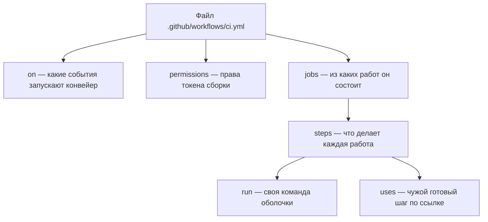

# GitHub Actions: workflow, job, секреты, права токена

Представьте первое ревью чужого конвейера. Перед вами файл с описанием
сборки. В него специально подставлены пять дефектов: широкие права,
опасное событие, чужой шаг по подвижной ссылке и две подстановки чужих
значений в команды шагов. Линтер описаний — программа, которая
проверяет такие файлы локально, без сервера, — отвечает на него так
(строки замечаний сокращены):

```text
vuln.yml:16:58: "github.event.pull_request.title" is potentially untrusted.
  avoid using it directly in inline scripts. [expression]
vuln.yml:24:35: "github.event.pull_request.body" is potentially untrusted.
  avoid using it directly in inline scripts. [expression]
rc=1
```

Две находки из пяти. Обе — про подстановку в команду полей запроса на
слияние: в выводе линтера и в ключах файла он называется `pull_request`.
Остальные три пропущены не из-за качества инструмента: он проверяет
синтаксис, типы выражений и известный ему список недоверенных источников.
Права, события и ссылки — это уже политика, и политики линтер не знает. Чтобы найти три оставшихся
дефекта, файл надо уметь читать глазами, и этому учит эта тема.

Система, для которой написан такой файл, называется GitHub Actions. Это
сервер сборки, встроенный в хостинг репозиториев GitHub: он видит
события в репозитории, например отправку коммита или запрос на слияние,
и запускает на них конвейер. Устройство такого конвейера — событие, граф
работ, артефакт, кэш, вердикт — разобрано в `pipeline-anatomy` и здесь
не повторяется. Предмет этой темы другой: как всё это записывается на
языке конкретной системы и где в такой записи прячутся дефекты
безопасности.

Описание конвейера лежит в самом репозитории, в каталоге
`.github/workflows/`. Каждый файл в этом каталоге — один workflow, то
есть один конвейер, записанный текстом в формате YAML. Читается такой
файл четырьмя вопросами: что запускает (ключ `on`), с какими правами
(ключ `permissions`), из каких работ состоит (ключ `jobs`), что делает
каждая (список `steps`). Шаг бывает своим, командой оболочки, или чужим —
готовым шагом, который подключается из другого репозитория по ссылке.
Половина типового конвейера собрана из чужих.

Что линтер заметит в таком файле сам — и какие три из пяти дефектов
останутся глазам ревьюера?

**Зачем это в работе AppSec-инженера.** Чтение чужого описания конвейера —
ежедневная работа, а не разовая настройка. Три четверти замечаний по
конвейеру пишутся по одному файлу, без доступа к серверу. Права шире
нужного, чужой шаг по подвижной ссылке, значение из запроса в команде
шага.

## Как это работает

Механизм здесь не свой: событие, граф работ, артефакт, кэш и вердикт
разобраны в `pipeline-anatomy`, а модель прав токена сборки как класс
дефекта — в `pipeline-security`. Ниже — только то, чем эта система
записывает уже разобранное.

**Откуда это взялось.** Ранние конвейеры описывались настройками в
интерфейсе сервера сборки: галочки, поля, порядок шагов мышью. Проверить
такую настройку в ревью было нечем, а восстановить после потери сервера —
только по памяти. Переезд описания в репозиторий решил обе задачи разом
и создал третью. Файл, который выполняется с правами сборки, стал править
любой, кто может прислать запрос на слияние.

**Событие и права идут вместе.** `on` перечисляет события, на которые
конвейер запускается. На каждый запуск система выдаёт конвейеру токен
сборки — временное удостоверение, которое живёт один запуск. Оно
предъявляется серверу при каждом действии: прочитать код, поставить
отметку о проверке, опубликовать выпуск. Список того, что токену можно,
— это и есть блок `permissions`.

Бытовой пример — гостевой бейдж на проходной. Токен соответствует бейджу,
а блок `permissions` — списку дверей, напечатанному на нём: дверь без
записи не откроется. Ломается аналогия в одном месте. Настоящий бейдж
выписывает охрана, а здесь список дверей пишет сам файл, который будет
выполняться с этими правами. Поэтому блок `permissions` в ревью читают
первым.

Значение прав по умолчанию задаётся настройкой организации, и полагаться
на него не стоит. Блок `permissions` в самом файле перекрывает умолчание
и делает решение видимым в ревью. Область, не названная в блоке, получает
`none`, то есть «ничего нельзя». Запись `permissions: {}` отключает всё
[^2].

**Секрет объявляется не там, где переменная.** Переменная шага — блок
`env` рядом с шагом или с job. Секрет живёт в настройках репозитория или
организации и попадает в описание выражением `${{ secrets.ИМЯ }}`.
Двойные фигурные скобки со знаком доллара — синтаксис подстановки: перед
запуском шага система вычисляет выражение внутри скобок и вставляет
значение в текст. Разница между переменной и секретом видна в файле без
всякого сервера: значение переменной в нём написано, значение секрета —
нет.

**Чужой шаг подключается ссылкой, и ссылка бывает подвижной.** Запись
`uses: владелец/шаг@v4` называет репозиторий с готовым шагом и тег
версии в нём. Тег — это ярлык, который владелец шага переставляет на
новый коммит при каждом выпуске. Поэтому сегодня и через месяц за одним
и тем же `@v4` может стоять разный код. Полная сумма коммита, сорок
шестнадцатеричных цифр, переставлена быть не может: сумма привязана к
содержимому коммита, и другое содержимое даёт другую сумму. Чем это
похоже на зафиксированную версию зависимости, спрашивает самопроверка в
конце темы.



**Описание схемы.** Схема читается сверху вниз и повторяет четыре
вопроса, которыми читается файл описания. Верхний узел — сам файл, и из
него выходят три ключа. `on` отвечает за события запуска, `permissions`
— за права токена сборки, `jobs` — за состав работ. Каждая работа
распадается на шаги, а шаг бывает своей командой `run` или чужим шагом
`uses`, подключённым по ссылке.

Три узла из семи относятся к безопасности напрямую, и все три задаются в
самом файле. Это набор событий в `on`, набор прав в `permissions` и
способ сослаться на чужой шаг в `uses`. Именно их ревьюер и проверяет
глазами, потому что линтер их не покрывает, — к этому тема вернётся в
разделе про чтение вывода.

## Что умеет и чего не умеет

**Что умеет.** Описать конвейер целиком одним файлом, который проходит
ревью вместе с кодом. Дать готовые шаги на всё типовое: получение кода,
установку среды, выгрузку и загрузку артефактов. Задать права токена
сборки построчно, в том числе по-разному для разных job.

**Чего не умеет.** Проверить чужой шаг. Подключая шаг, вы подключаете
репозиторий целиком с правами своей сборки, и содержимое его вам никто
не показывает.

Не умеет система и развести доверенный код и недоверенный автоматически.
Запрос на слияние может прийти из чужой копии репозитория — такую копию
называют форком. Автор изменений забирает репозиторий к себе, правит его
у себя и присылает правки запросом, не имея доступа к оригиналу. Событие
такого запроса бывает двух видов, и они различаются правами. Один вид
запускает конвейер над чужим кодом с урезанным токеном и без секретов,
другой — с полными. Выбор между ними делает автор файла, а не сервер, и
ошибка в этом выборе отдаёт чужому коду права вашей сборки. Как выбирать
между двумя видами, разбирает `pipeline-security`.

## Как запустить

**Шаг 1. Написать описание.** Минимальный полезный конвейер — сборка,
проверка, передача артефакта между ними, урезанные права. Читайте файл
четырьмя планами, по числу вопросов из введения. Сначала найдите, что
запускает конвейер и с какими правами он идёт. Затем проследите, как
собранное уходит артефактом и чем закреплены чужие шаги:

```yaml
name: ci
on:
  push:
    branches: [main]
  pull_request:

permissions:
  contents: read

jobs:
  build:
    runs-on: ubuntu-24.04
    steps:
      - uses: actions/checkout@11bd71901bbe5b1630ceea73d27597364c9af683
      - run: mkdir -p out && python -c "print('собрано')" > out/app.txt
      - uses: >-                                      # v4.6.2
          actions/upload-artifact@ea165f8d65b6e75b540449e92b4886f43607fa02
        with:
          name: app
          path: out/app.txt
```

Свёрнутый скаляр `>-` в шаге выгрузки стоит только ради ширины страницы:
он даёт ту же строку, что и запись в одну строку. Ключ `runs-on` в
начале работы выбирает раннер, то есть машину, которую сервер выделяет
под работу: `ubuntu-24.04` — метка готового образа системы на ней. Сама
выгрузка сделана готовым шагом `upload-artifact`, который сохраняет
объявленный путь как артефакт запуска. Параметры чужому шагу передают
ключом `with`: здесь заданы имя артефакта (`name`) и путь к файлу
(`path`). Зачем артефакт объявляется явно и почему без него файл до
следующей работы не доезжает, объясняет `pipeline-anatomy`.

Две оставшиеся работы приведены целиком. В них два места для чтения: как
проверка забирает артефакт сборки шагом загрузки и как выпуск получает
повышение прав точечно, на уровне job:

```yaml
  scan:
    needs: [build]
    runs-on: ubuntu-24.04
    steps:
      - uses: >-                                      # v4.3.0
          actions/download-artifact@d3f86a106a0bac45b974a628896c90dbdf5c8093
        with:
          name: app
          path: out
      - run: echo "сканирую $(wc -c < out/app.txt) байт"

  release:
    needs: [build, scan]
    if: github.ref == 'refs/heads/main'
    runs-on: ubuntu-24.04
    permissions:
      contents: write
    steps:
      - run: echo "выпуск"
```

Четыре вещи в этом файле стоит прочитать отдельно. Запись
`permissions: contents: read` на уровне файла — умолчание для всех job:
код читать можно, писать ничего нельзя. Блок `permissions` внутри
`release` — повышение для одного job, которому запись нужна. Суммы
коммитов после `@` — неподвижные ссылки; номер версии стоит рядом
комментарием, для чтения. Строка `if: github.ref == 'refs/heads/main'`
у выпуска — условие запуска. `github.ref` называет ветку или тег, на
котором случилось событие, а скобки `${{ }}` в условии `if` разрешено
опускать.

**Шаг 2. Положить секрет.** Настройки репозитория, раздел секретов и
переменных для конвейера. Значение вводится один раз и обратно не
читается: настройка показывает имя секрета и дату обновления, но не само
значение. В описании оно доступно как `${{ secrets.ИМЯ }}` и передаётся
шагу через `env`, а не подставляется в текст команды — почему именно
так, разбирается в `pipeline-security`.

**Шаг 3. Проверить описание до отправки.** Линтер описаний работает
локально и сети не требует:

```text
docker run --rm -v "$PWD":/repo -w /repo rhysd/actionlint:1.7.12 -no-color
```

Каталог должен быть репозиторием: линтер ищет `.github/workflows` от
корня и без `.git` отказывается работать.

## Как читать вывод

Линтер печатает по строке на замечание: путь, строка, столбец, текст,
правило в квадратных скобках. Прогон на файле с пятью подставленными
дефектами (строки замечаний сокращены):

```text
vuln.yml:16:58: "github.event.pull_request.title" is potentially untrusted.
  avoid using it directly in inline scripts. [expression]
vuln.yml:24:35: "github.event.pull_request.body" is potentially untrusted.
  avoid using it directly in inline scripts. [expression]
rc=1
```

Из пяти подставленных дефектов в этом выводе видны два. Какие три
остались непойманными, назовите, не заглядывая дальше.

**Две находки из пяти — и это важнее самих находок.** В файле, кроме двух
подстановок, стояли `permissions: write-all`, событие запроса на слияние
с получением чужого кода и чужой шаг по подвижной ссылке. Линтер о них
не сказал ничего: он проверяет синтаксис, типы выражений и известный
список недоверенных источников, а не политику.

Отдельно поучителен пропуск. Подстановка имени учётной записи автора
запроса из того же файла осталась без пометки. В списке недоверенных
источников линтера его нет: набор знаков в имени ограничен. Ограничен —
не значит безопасен в любом контексте, и решение о том, чем ограничение
считать, линтер оставляет человеку.

Вывод для работы: **линтер описаний закрывает синтаксис и часть инъекций,
а права, события и ссылки на чужие шаги остаются своим правилам.** Как
они пишутся, разбирается в `pipeline-security`. Тот же файл, те же
подстановки, но значения переданы шагам через `env`: что останется в
выводе линтера и почему?

## Границы метода

**Граница первая: конвейер этой системы без её сервера не проверить.**
Локально проверяются синтаксис описания и часть выражений. Права токена
сборки, поведение событий, хранилище секретов и маскирование в журнале —
серверные. Маскирование здесь — замена значения секрета звёздочками в
журнале запуска, чтобы случайно напечатанный секрет не остался в
протоколе. Эмулятора у серверной части нет по устройству, а не по
бедности. Правила выдачи прав и секретов живут на стороне сервера, и
локальной копии им не положено. Всё, что о них сказано в этой теме,
взято из документации вендора и прогоном не подтверждалось; это названо
в маркерах уверенности отдельно.

**Граница вторая: тег версии чужого шага — не версия.** Ссылка вида `@v4`
указывает на подвижный тег, который владелец шага перемещает при каждом
выпуске. Единственная неподвижная ссылка — полная сумма коммита.

**Граница третья: описание версионно.** Имена ключей, состав областей
прав и набор событий меняются от выпуска к выпуску. Устройство —
событие, граф, артефакт, вердикт — не меняется, и лежит оно в
`pipeline-anatomy`.

**Цена.** Написать первый рабочий конвейер — час. Прочитать чужой и
выписать из него события, права и список чужих шагов — двадцать минут.
Поставить локальный линтер — минуты, и это лучшее вложение из трёх.

## Частая ошибка

Не написано — значит, не выдано: если в описании конвейера не написано
`permissions`, права у токена сборки минимальные. Так ли это — решите до
чтения ответа.

**Умолчание задаётся не файлом, а настройкой организации или репозитория,
и исторически оно было широким.** Файл без блока `permissions` наследует
то, что выставлено снаружи, и в ревью этого не видно: страница выглядит
одинаково при любом умолчании. Цепочка у ошибки правдоподобная: раз права
не перечислены, кажется, что они и не выданы. На деле молчание файла
означает наследование настройки снаружи, а не ноль. Отсюда правило: блок
`permissions` в описании стоит писать всегда, даже когда он повторяет
умолчание, — он превращает невидимую настройку в строку, которую читает
ревьюер [^3].

Контрпример к обратному выводу — «значит, надо ставить `permissions: {}`
везде». Не везде: job, которому нужно опубликовать артефакт или поставить
отметку о проверке, с пустыми правами не отработает. Правило не «минимум
всегда», а «минимум по умолчанию и повышение точечно, на уровне job».

## Чеклист для ревью

1. Проверьте, что в описании конвейера есть блок `permissions`, а не
   унаследованное умолчание.
2. Проверьте, что права повышаются на уровне job, которому они нужны, а не
   на уровне всего файла.
3. Проверьте, что чужие шаги подключены по полной сумме коммита, а не по
   тегу или ветке.
4. Проверьте, что значения секретов передаются шагу через `env`, а не
   подставляются в текст команды.
5. Проверьте, что события в `on` перечислены явно и для события из чужой
   копии репозитория набор job отличается от основного.
6. Проверьте, что описание конвейера проходит локальный линтер до отправки
   на сервер.

## Попробуй сам

Взять любой открытый репозиторий с конвейером на этой системе и составить
по его описанию три списка. События с правами, которые они дают. Чужие
шаги с пометкой, подвижная ссылка или сумма коммита. Шаги, в командах
которых стоит значение из события.

Работа делается по одному файлу, доступа к репозиторию не требует. После
этого прогнать по нему локальный линтер и сравнить свои три списка с его
выводом.

**Наблюдаемый признак выполнения:** у вас есть три списка и ответ на
вопрос, какие пункты линтер нашёл сам, а какие пришлось выписывать
глазами. Второй список обычно длиннее первого.

## Проверь себя

1. Предскажите вывод линтера описаний на таком файле: сколько находок и на
   каких шагах?

```yaml
steps:
  - name: inline
    run: |
      echo "title — ${{ github.event.pull_request.title }}"
  - name: via env
    env:
      TITLE: ${{ github.event.pull_request.title }}
    run: |
      echo "title — $TITLE"
```

2. Какие права получит токен сборки у каждого job, и почему по файлу это
   видно лишь наполовину?

```yaml
name: ci
on: [push]

jobs:
  build:
    steps:
      - run: echo "сборка"
  release:
    permissions:
      contents: write
    steps:
      - run: echo "выпуск"
```

3. Чем шаг `run` отличается от шага `uses` по тому, что попадает в вашу
   сборку?

4. Что локальный линтер описаний находит по устройству, а что остаётся на
   ревьюера и свои правила?

5. Возврат к теме `pipeline-anatomy`: job проверки объявлен через
   `needs: [build]` и всё равно не видит собранный файл. Чего в описании
   не хватает?

6. Возврат к теме `supply-chain-threats`: чем подключение чужого шага по
   тегу похоже на установку зависимости без зафиксированной версии, и что
   здесь делает сумма коммита?

<details markdown="1">
<summary>Ответ 1</summary>

1. Одна находка, на первом шаге. Линтер видит подстановку недоверенного
   поля в текст команды и помечает её. Передачу той же величины через
   `env` он считает законной: значение приезжает в процесс, а не в текст
   программы. Прогон из каталога репозитория:

```text
$ docker run --rm -v "$PWD":/repo -w /repo rhysd/actionlint:1.7.12 -no-color
.github/workflows/probe.yml:13:34: "github.event.pull_request.title"
  is potentially untrusted. [expression]
rc=1
```

</details>

<details markdown="1">
<summary>Ответ 2</summary>

2. У `release` — запись в содержимое, и это видно по его блоку. У `build`
   своего блока нет: он получит умолчание из настроек организации, а какое
   оно, в файле не написано. Молчание файла означает наследование, а не
   ноль, поэтому блок `permissions` на уровне файла пишут всегда —
   повышение точечно, на уровне job.

</details>

<details markdown="1">
<summary>Ответ 3</summary>

3. `run` — своя команда, её текст виден в файле целиком. `uses` — чужой
   репозиторий, который выполнится с правами вашей сборки; его содержимое
   в файле не видно, видна только ссылка.

</details>

<details markdown="1">
<summary>Ответ 4</summary>

4. Находит синтаксис, ошибки типов в выражениях и подстановку известных
   недоверенных полей события в команды шагов. Не находит широких прав,
   опасного выбора события и подвижных ссылок на чужие шаги: это политика,
   а политику линтер не знает.

</details>

<details markdown="1">
<summary>Ответ 5</summary>

5. Объявления получения артефакта на стороне job проверки. `needs` задаёт
   порядок запуска, а файл доезжает только объявленным артефактом — это
   различие и есть центр темы про устройство конвейера.

</details>

<details markdown="1">
<summary>Ответ 6</summary>

6. Оба случая — доверие чужому коду по подвижному имени: зависимость
   «свежей версии» и шаг `@v4` меняются их владельцем без вашего ведома.
   Сумма коммита работает как зафиксированная версия с контрольной суммой:
   ссылка неподвижна, а обновление становится видимым изменением в ревью.

</details>

## Источники

1. GitHub, «Understanding GitHub Actions»; реестр `gha-understanding`.
   Разделы: словарь workflow, событие, job, шаг, действие, раннер;
   расположение файлов описания.
   <https://docs.github.com/en/actions/get-started/understand-github-actions>
2. GitHub, «Workflow syntax for GitHub Actions»; реестр
   `gha-workflow-syntax`. Разделы: `permissions` — таблица областей,
   значения `read`, `write`, `none`, установка на уровне файла и на уровне
   job, записи `read-all`, `write-all` и `permissions: {}`.
   <https://docs.github.com/en/actions/reference/workflows-and-actions/workflow-syntax>
3. GitHub, «Controlling permissions for GITHUB_TOKEN»; реестр
   `gha-token-permissions`. Разделы: передача токена в командную строку и в
   интерфейс, блок `permissions` на уровне job, принцип наименьших
   привилегий, когда вместо токена сборки нужна учётная запись приложения.
   <https://docs.github.com/en/actions/tutorials/authenticate-with-github_token>

Каркас этапа: `owasp-cicd-top10`. Наследуется всеми темами этапа и
отдельной строкой не повторяется.

**Скоропортящийся слой.** Имена ключей описания, состав областей прав,
набор событий, номера версий готовых шагов и суммы коммитов в листинге.
Устройство — событие, права, граф, чужой шаг по ссылке — держится дольше.

**Маркеры уверенности.** Прогон линтера описаний версии 1.7.12 (собран
компилятором go1.26.1) на файле с пятью подставленными дефектами —
**лично**, 2026-08-25: две находки из пяти, вывод сохранён. Приведённое
описание конвейера **лично** проверено тем же линтером и замечаний не
даёт. Повторной проверкой 2026-10-03 на том же образе линтера **лично**
подтверждено: собранное в теме описание конвейера замечаний не даёт
(rc=0); подстановка заголовка запроса в команду шага помечается находкой
[expression], а передача той же величины через `env` — нет; запуск вне
каталога репозитория линтер отклоняет (rc=3); подстановка имени учётной
записи автора запроса в команду шага не помечается. Права токена сборки,
поведение событий, хранилище секретов и маскирование в журнале **не
проверялись**: живого сервера этой системы у проекта нет, граница миссии
запрещает публикацию наружу, и всё это изложено **по документации
вендора**. Суммы коммитов готовых шагов в листинге взяты из выпусков
соответствующих версий и на сервере не сверялись.
