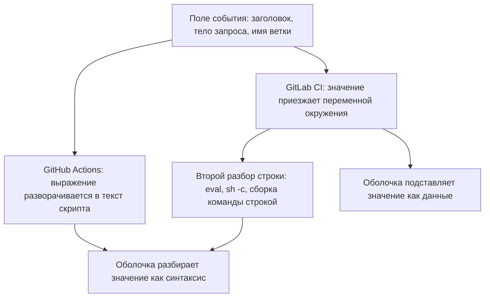
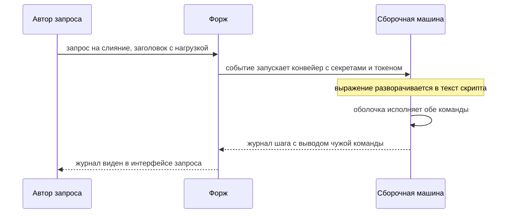

# Безопасность самого пайплайна: инъекции и права токена

Шаг, который приветствует автора запроса на слияние, пишется в три строки и
выглядит безобидно:

```yaml
- name: greet
  run: |
    echo "Спасибо за запрос: ${{ github.event.pull_request.title }}"
```

Автор запроса озаглавил его `Опечатка"; id; echo "`. Конвейер разворачивает
выражение в текст скрипта до того, как скрипт увидит оболочка, и на
сборочной машине выполняется уже другое:

```text
echo "Спасибо за запрос: Опечатка"; id; echo ""
```

Команд стало три вместо одной, и средняя напечатала `uid=1000(tarchok)`. Это
значит, что строка из чужого заголовка выполнилась как команда — там, где
лежат секреты выкладки и токен с правом записи в репозиторий. Автору запроса
для этого хватило права править заголовок своего запроса. Предмет темы —
описание конвейера как код, который выполняется с правами сборки. Разберём,
почему значение из чужого запроса превращается в команду, что при этом
достаётся нападающему и как это чинить в двух разных системах.

## Один файл, три класса дефектов

Описание конвейера — код, который выполняется на сборочной машине с правами
сборки и с доступом к секретам проекта. Из этого одного факта следуют три
класса дефектов, и все три встречаются в одном файле.

**Первый класс — инъекция в команду шага.** Значение из чужого запроса —
заголовок, тело, имя ветки — попадает в команду оболочки. У GitHub Actions
оно подставляется прямо в текст скрипта до того, как скрипт увидит оболочка,
и тогда любая кавычка внутри значения становится синтаксисом. У GitLab CI
значение приезжает в окружение задания, и инъекция появляется на шаг позже —
там, где готовую строку разбирают второй раз.

**Второй класс — права токена сборки.** Конвейеру выдают токен, и по
умолчанию его права задаются настройкой снаружи файла. Токен с правом записи
в код превращает выполнение команды на сборочной машине в изменение
содержимого репозитория.

**Третий класс — доверие чужому шагу.** Шаг, подключённый по тегу или ветке,
— это ссылка, которую владелец шага переписывает в любой момент. Ссылка по
сумме коммита не переписывается.

Исход у всех трёх один: выполнение произвольного кода в среде, где лежат
секреты выкладки и стоит токен с правами на репозиторий. Это не «уязвимость
конвейера» в переносном смысле, а выполнение кода на чужой машине. Разница с
обычной инъекцией команд лишь в том, где эта машина стоит.

**Зачем это в работе AppSec-инженера.** Безопасность конвейера называют в
вакансиях, и это единственный класс, который проверяется по одному файлу,
без доступа к продукту и без стенда. Ревью описания конвейера занимает
двадцать минут и находит то, чего не найдёт ни один сканер прикладного кода:
он в этот файл не смотрит.

## Подумай, прежде чем читать

1. В команде шага стоит подстановка заголовка запроса на слияние. Что
   произойдёт, если заголовок будет таким: `починка"; id; echo "`?
2. Конвейер собирает код из чужой копии репозитория и имеет доступ к секретам
   выкладки. Что мешает нападающему их прочитать?
3. Чужой шаг подключён записью `@v4`, и полгода ничего не менялось. Значит ли
   это, что выполняется тот же код, что и полгода назад?

## Как это работает

**Откуда это взялось.** Настройки сборки жили в интерфейсе сервера, и править
их мог только тот, у кого был доступ к серверу. Переезд описания в репозиторий
дал ревью и историю, а заодно превратил файл конвейера в код, который присылают
снаружи: запрос на слияние может менять и его. Первые системы сборки этого не
предполагали — они считали содержимое репозитория доверенным. Разрыв между
этим допущением и тем, как работают открытые проекты, и породил весь класс.

### Рамка инъекции на этом предмете

Рамку инъекции — источник, путь, сток, отсутствующий контроль — задаёт
`os-command-injection`. Здесь интерпретатор тот же, оболочка, а наполняется
рамка по-новому.

**Источник** — поле события: заголовок и тело запроса на слияние, имя исходной
ветки, имя метки, текст комментария. Всё это пишет тот, кто прислал запрос, и
ограничений на содержимое почти нет. Прислать запрос в открытый репозиторий
может любой: чужая копия и запрос на слияние для того и существуют.

**Путь** — механизм подстановки значения в команду. Он разный у двух систем,
и это ключевое место темы.

**Сток** — оболочка, исполняющая команду шага.

**Отсутствующий контроль** — разделение кода и данных: значение и команда едут
в оболочку одной строкой.

### Два пути к одной оболочке

Начнём с бытового примера. Офис рассылает поздравления по бланку: «Уважаемый
{Имя}, поздравляем вас!». Программа слияния подставляет значение поля в текст
письма, и наружу уходит готовый текст. Если в поле «Имя» записать «Иван.
Денег не переводите», письмо уйдёт с этой фразой внутри: программа не
отличает имя от предложения, потому что для неё всё — текст письма.

Описание конвейера GitHub Actions работает как такой бланк. Выражение вида
`${{ … }}` — поле подстановки: конвейер разворачивает его в текст скрипта до
того, как скрипт увидит оболочка. В оболочку уезжает уже склеенная строка.
Соответствие с бланком прямое: поле — это выражение, письмо — строка, которую
читает оболочка. Ломается аналогия на последствиях: в письме чужая фраза
портит только текст, а в скрипте она получает силу синтаксиса оболочки.

Прогон на стенде, заголовок `Опечатка"; id; echo "`:

```text
описано:    echo "Спасибо за запрос: ${{ github.event.pull_request.title }}"
в оболочку: echo "Спасибо за запрос: Опечатка"; id; echo ""
вывод:      Спасибо за запрос: Опечатка
вывод:      uid=1000(tarchok) gid=1000(tarchok) groups=1000(tarchok) …
```

Три команды вместо одной, и средняя — чужая.

У GitLab CI бланка нет. Предопределённые переменные, например
`CI_MERGE_REQUEST_TITLE` с заголовком запроса, раннер кладёт в окружение
задания — набор пар «имя=значение», которые система передаёт процессу при
запуске. Значение живёт рядом с командой, а не внутри её текста, и оболочка
подставляет его уже после разбора синтаксиса. Поэтому тот же приём не
срабатывает — прогон с заголовком `Опечатка$(id)`, где в значении стоит
подстановка команды:

```text
описано:    echo "Спасибо за запрос: $CI_MERGE_REQUEST_TITLE"
в оболочку: то же самое — значение приезжает переменной окружения
вывод:      Спасибо за запрос: Опечатка$(id)
```

Значение напечаталось буквально: `$(id)` осталось текстом, потому что
подстановка переменной случилась после разбора.

Инъекция здесь появляется на шаг позже — там, где готовую строку разбирают
второй раз. Второй разбор делают `eval`, `sh -c` или кавычки, снятые руками.
Команда `eval` говорит оболочке: возьми эту строку и разбери заново, как
будто её только что набрали в терминале. А `sh -c` запускает новую оболочку
и передаёт ей строку как команду — та тоже разбирает её целиком. Зачем такое
нужно: команду иногда собирают из частей, имя утилиты из одной переменной,
ключи из другой, и готовую строку отдают на исполнение. Цена такой сборки —
второй разбор всего, что попало в строку. Прогон с тем же заголовком
`Опечатка$(id)`:

```text
описано:    eval "echo Здравствуйте, $CI_MERGE_REQUEST_TITLE"
вывод:      Здравствуйте, Опечаткаuid=1000(tarchok) …
```



**Описание схемы.** Схема читается сверху вниз и показывает два пути от
одного источника к одной оболочке. Поле события заполняет автор запроса. В
GitHub Actions значение склеивается с текстом скрипта до оболочки, и оболочка
разбирает его как синтаксис. В GitLab CI значение приезжает переменной
окружения, и напрямую оболочка подставляет его как данные; инъекция ждёт на
обходном пути — через второй разбор строки.

**Что из этого следует для ревью.** Класс общий: чужое значение доходит до
разбора оболочкой, а место разбора разное. В описании GitHub Actions искать
надо саму подстановку в команде. В описании GitLab CI — второй разбор строки:
`eval`, `sh -c`, снятые руками кавычки, подстановку в другой язык. Правило
одно: найдите, где чужое значение встречается с разбором. Команду в описании
GitLab CI собирают строкой и запускают через `eval`: по какому из двух путей
пойдёт такая сборка и почему?

### Что лежит рядом с командой: токен и секреты

Выполнение команды на сборочной машине само по себе даёт немного: машина
одноразовая, а код и так открыт. Ценность создают две вещи, лежащие рядом с
командой, — токен и секреты.

Токен сборки — автоматическая учётная запись конвейера: система выдаёт её
каждому прогону, и шаги предъявляют её форжу, когда делают что-то с
репозиторием от имени сборки. Форж — сервер, который хранит репозиторий и
запускает конвейеры, например GitHub или GitLab. Права токена задаются либо
настройкой организации, либо блоком `permissions` в описании конвейера;
модель прав подробно разобрана в `github-actions`. Право записи в содержимое
превращает выполнение команды в правку кода: коммит от имени сборки проходит
те проверки, которые смотрят на автора, и попадает в ветку. Право на выпуски
позволяет подменить опубликованный артефакт.

Отсюда правило минимума, и оно записывается в самом файле: минимальные права
на весь конвейер, повышение точечно тому заданию, которому они нужны.
Область, не названная в блоке прав, не выдаётся [^1].

### Граница доверия проходит по событию

Граница доверия в конвейере проходит не по заданию и не по стадии, а по
событию, которое конвейер запустило. Событие «коммит в основную ветку» —
доверенный код. Событие «запрос на слияние из чужой копии» — недоверенный.

У GitHub Actions есть два разных события для запроса на слияние.
`pull_request` запускается в контексте чужой копии: секретов нет, права
урезаны. `pull_request_target` запускается в контексте основного репозитория:
секреты есть, права полные. Предназначено второе для задач, которым чужой код
не нужен вовсе, — скажем, чтобы повесить метку на запрос или поблагодарить
автора. Здесь работает аналогия с почтовым ящиком у входа: бросить открытку
может любой прохожий, и для этого ему не выдают ключи от склада. Ломается
аналогия в том, что ключи в конвейере выдаются не человеку, а машине — и
выдаются автоматически по виду события.

Дефект возникает, когда событие с правами сочетают с явным получением чужого
кода: получается сборка чужого содержимого с правами хозяина репозитория.
Исследование GitHub Security Lab ввело для этого приёма отдельное имя —
«pwn request». Оно же показывает, сколько в такой сборке точек внедрения
помимо самих команд шага: это сценарии установки зависимостей, тесты и
скрипты сборки [^2].

### Общий кэш как канал

Кэш сборки существует ради скорости, а по устройству это общая на репозиторий
папка, в которую пишет любое задание с правом записи (устройство кэша — в
`pipeline-anatomy`). Отсюда путь, который в списке дефектов обычно не
значится. Задание, запущенное чужим запросом на слияние, кладёт в кэш
подменённый файл — собранную зависимость, скачанный пакет, промежуточный
результат сборки. Следующая сборка основной ветки этот файл восстанавливает и
использует. Такой приём называют отравлением кэша.

Свойство, которое делает этот путь неприятным, — отложенность. Между записью
в кэш и её срабатыванием проходит время, запрос на слияние к тому моменту
закрыт, и связь между двумя событиями по журналам не читается. Ключ кэша при
этом обычно считается по файлу со списком зависимостей, то есть предсказуем:
чтобы попасть в кэш нужной сборки, довольно не менять этот файл.

Закрывается это тем же разделением, что и всё остальное в теме: заданиям,
запущенным недоверенным событием, право записи в общий кэш не выдаётся. У
обеих систем это настройка сервера, а не строка в описании конвейера, и
проверяется она на сервере.

### Чужой шаг

Подключение чужого шага — это включение чужого репозитория в свою сборку с
правами своей сборки. Механика доверия разобрана в `supply-chain-threats`;
здесь важна одна деталь, специфичная для конвейера: ссылка бывает подвижной.
Тег и ветку владелец шага перемещает в любой момент, сумму коммита — никогда.
Полгода без изменений в вашем файле не означают полугода без изменений в том,
что выполняется.

## Как это атакуют

Порядок действий нападающего на открытом репозитории короткий, и первые два
шага не требуют ничего, кроме чтения.

**Шаг 1. Прочитать описание конвейера.** Оно лежит в репозитории рядом с
кодом. Из него видно всё: события, права, чужие шаги, команды с подстановками.

**Шаг 2. Найти подстановку чужого значения в команду.** Поля, которые пишет
автор запроса, перечислены в документации обеих систем; искать надо их имена
внутри блоков команд.

**Шаг 3. Прислать запрос на слияние с полезной нагрузкой в заголовке.**
Заголовок и тело запроса меняются после создания, а сборку перезапускает
каждый новый коммит в исходную ветку запроса.

**Шаг 4. Забрать то, ради чего всё делалось.** Что именно доступно, зависит
от события и прав.



**Описание схемы.** Схема читается сверху вниз и показывает обмен при атаке
через заголовок. Автор присылает запрос на слияние, форж по событию запускает
конвейер и выдаёт сборочной машине секреты и токен. Подстановка превращает
заголовок во вторую команду, оболочка исполняет обе, и вывод чужой команды
возвращается автору через журнал, видимый в интерфейсе запроса.

Что доступно на четвёртом шаге, зависит от события и прав:

```text
что доступно                       при каком условии
секреты выкладки                   событие идёт с секретами основной ветки
токен с правом записи в код        права не урезаны блоком в описании
запись в общий кэш сборки          кэш общий на репозиторий
доступ во внутреннюю сеть          раннер стоит в сети организации
```

Последняя строка — самая недооценённая. Раннер — машина, которая забирает
задания конвейера у форжа и выполняет их; форж даёт свои машины, но
организация может подключить собственную. Собственный раннер ставят ради
доступа к внутренним ресурсам: стендам, реестрам пакетов, базам. Такой
раннер, поднятый в сети организации, превращает инъекцию в описании конвейера
открытого репозитория в точку входа во внутреннюю сеть.

**Чего нападающему делать не приходится.** Ни угадывать, ни перебирать.
Описание конвейера открыто, ответ конвейера виден в интерфейсе запроса на
слияние. Попыток можно сделать сколько угодно: заголовок правится в любой
момент, а очередной коммит в ветку перезапускает сборку. Это редкий класс,
где обратная связь у нападающего полная и бесплатная, — и по той же причине
он редко требует более одного дня работы.

**Слепой случай.** Вывод команды в журнал попадает не всегда: журнал сборки
на чужой запрос может быть закрыт. Подтверждается инъекция теми же способами,
что в `os-command-injection`: задержкой и внеполосным запросом.

## Как это выглядит в коде

Пять признаков, все — в одном файле. Ниже дефектное описание для GitHub
Actions; парное для GitLab CI показано в лабе. Читайте файл четырьмя планами.
Каким событием запущен конвейер и что это даёт токену? Чей код попадает в
сборку? Где чужое значение встречается с разбором? Как подключены чужие шаги?
Номера выносок — ответы для сверки: сначала попробуйте назвать все пять
дефектов сами.

```yaml
# УЯЗВИМО — демонстрация, не для продакшена
name: pr-greeter
on:
  pull_request_target:          # (1)
    types: [opened, synchronize]

permissions: write-all          # (2)

jobs:
  greet:
    runs-on: ubuntu-24.04
    steps:
      - uses: actions/checkout@v4
        with:
          ref: ${{ github.event.pull_request.head.sha }}   # (3)
      - name: greet
        run: |
          echo "Спасибо: ${{ github.event.pull_request.title }}"   # (4)
      - uses: some-vendor/publish-action@main   # (5)
        with:
          token: ${{ secrets.GITHUB_TOKEN }}
```

1. Событие запроса с правами основного репозитория: прогон идёт с секретами
   и полным токеном. Само по себе законно — смотреть надо на пару к нему,
   выноску (3).
2. Права токена шире необходимого: `write-all` отдаёт запись во все области.
   Приветствию нужно от силы чтение.
3. Получение чужого кода: сборка забирает коммит чужого запроса по его
   `head.sha`.
4. Подстановка чужого значения в текст команды: заголовок запроса
   разворачивается прямо в строке `run`.
5. Чужой шаг по подвижной ссылке: ветку `main` владелец шага переписывает в
   любой момент.

**Выноски (1) и (3) работают в паре.** Событие с правами основного репозитория
само по себе законно; получение чужого кода само по себе законно. Опасно
сочетание, и искать в ревью надо именно его.

**Выноска (2) читается по отсутствию.** Файл без блока прав выглядит так же
безобидно, как файл с урезанными правами; разница невидима и задаётся
настройкой снаружи. Поэтому блок прав стоит писать всегда, даже когда он
повторяет умолчание.

**Выноска (4) отличается по системам.** В GitHub Actions опасна сама
подстановка в команду. В GitLab CI подстановка переменной из события в
команду законна, а искать надо повторный разбор: `eval`, сборку команды
строкой, передачу значения в другой интерпретатор. Отсюда и разный порядок
чтения файла: в описании GitHub Actions читается сама команда, в описании
GitLab CI — цепочка, по которой значение доходит до второго разбора.

**Выноска (5) проверяется по форме ссылки.** Сорок шестнадцатеричных знаков
после `@` — закреплено. Всё остальное — подвижно.

## Как защититься

Порядок правок повторяет порядок классов дефектов: сначала инъекция, потом
права, событие, чужой шаг и секрет. Каждая правка мала, а причина у неё одна —
разделить код и данные.

**Инъекция: развести подстановку и разбор.** В GitHub Actions значение
выносится в переменную окружения шага; в команде остаётся обращение к
переменной. Тогда значение приезжает в процесс, а не в текст программы:

```yaml
# УЯЗВИМО — демонстрация, не для продакшена
- name: greet
  run: |
    echo "Спасибо за запрос: ${{ github.event.pull_request.title }}"
```

```yaml
# Исправлено: значение едет в окружение, а не в текст скрипта
- name: greet
  env:
    TITLE: ${{ github.event.pull_request.title }}
  run: |
    echo "Спасибо за запрос: $TITLE"
```

Пара отличается одним движением, а меняется механика. В первом варианте
заголовок становится частью текста скрипта, и оболочка разбирает его кавычки
как свои. Во втором выражение по-прежнему разворачивается до оболочки, но
попадает в значение переменной окружения, а переменную оболочка подставляет
после разбора синтаксиса. Кавычка из заголовка доезжает как данные.

В GitLab CI значение уже в окружении, и чинить надо второй разбор: убрать
`eval`, не собирать команду строкой, передавать значение аргументом:

```yaml
# УЯЗВИМО — демонстрация, не для продакшена
script:
  - eval "echo Здравствуйте, $CI_MERGE_REQUEST_TITLE"
```

```yaml
# Исправлено: второго разбора нет, значение уходит аргументом
script:
  - printf 'Здравствуйте, %s\n' "$CI_MERGE_REQUEST_TITLE"
```

Чего делать не надо ни там, ни там — вычищать из значения кавычки и
метасимволы. Причина та же, что в `os-command-injection`: список запрещённого
обходится, а разбор остаётся.

**Права: минимум в файле, повышение точечно.** Блок прав на уровне конвейера
ставится всегда; заданию, которому нужна запись, права повышаются отдельным
блоком. Область, не названная явно, не выдаётся. Фрагмент описания:

```yaml
# Исправлено: минимум на весь конвейер, повышение — точечно на job
permissions:
  contents: read

jobs:
  publish:
    permissions:
      contents: write
```

**Событие: разнести доверенное и недоверенное.** Приветствию чужой код не
нужен — достаточно события без секретов. Если сборка чужого кода действительно
нужна, её разносят на два конвейера: первый собирает без секретов и складывает
артефакт, второй берёт готовый артефакт и имеет права. Граница доверия при
этом совпадает с границей файлов, и ревью видит обе половины.

**Чужой шаг: закрепить ссылку.** Сумма коммита вместо тега, комментарий с
номером версии рядом для читаемости:

```yaml
# Исправлено: полная сумма коммита вместо подвижного тега
- uses: actions/checkout@11bd71901bbe5b1630ceea73d27597364c9af683  # v4.2.2
```

Обновление становится видимым изменением в ревью, а не невидимым событием у
чужого владельца.

**Секрет: не класть в описание.** Значение в файле читает каждый, у кого есть
доступ к репозиторию, и остаётся оно в истории после удаления строки.
Доставка секрета в конвейер разбирается в `ci-secrets`.

## Как убедиться, что защита работает

Прогоном, а не чтением. Три проверки, и первой мало.

**Проверка 1: линтер молчит.** Своё правило или готовый линтер описаний — по
исправленному файлу. Ноль замечаний. Этой проверки мало по той же причине, по
которой её мало в прикладном коде: линтер подтверждает отсутствие известного
признака, а не отсутствие дефекта.

**Проверка 2: полезная нагрузка не выполняется.** Подстановка воспроизводится
локально: значение подставляется в команду шага так же, как это делает форж,
и результат запускается. Скрипт лабы делает оба шага, из её каталога:

```bash
python3 expand.py .github/workflows/pr-greeter.yml 'Опечатка"; id; echo "'
python3 expand.py .gitlab-ci.yml 'Опечатка$(id)'
```

Признак фикса наблюдаемый: в выводе нет строки `uid=`. Проверять надо тремя
разными нагрузками: с двойной кавычкой, с `$(…)` и с обратными кавычками.
Починка, закрывающая одну форму и не закрывающая две другие, встречается
чаще, чем хотелось бы.

**Проверка 3: конвейер не выпотрошен.** Приветствие печатается, сборка
запускается, выкладка на месте. Без этой проверки задача решается удалением
шагов, и такая «починка» проходит первые две.

На ревью описания конвейера пройдите по списку.

1. Проверьте, что значения из события не подставляются в текст команды шага,
   а передаются через переменные окружения.
2. Проверьте, что в командах шагов нет повторного разбора строки, содержащей
   значение из события.
3. Проверьте, что в описании конвейера объявлен блок прав, а не унаследовано
   умолчание.
4. Проверьте, что права повышаются на уровне задания, которому они нужны.
5. Проверьте, что событие с секретами и правами основного репозитория не
   сочетается с получением кода из чужой копии.
6. Проверьте, что чужие шаги подключены по полной сумме коммита.
7. Проверьте, что значения секретов не записаны в описании конвейера.
8. Проверьте, что собственный раннер не обслуживает конвейеры, запускаемые
   чужими запросами на слияние.

## Как это находят инструменты

Двумя инструментами, и ни одного из них по отдельности не хватает. Замер на
файле с пятью подставленными дефектами.

**Линтер описаний** (версия 1.7.12) нашёл **два из пяти** — обе подстановки
недоверенных полей в команды шагов:

```text
vuln.yml:16:58: "github.event.pull_request.title" is potentially untrusted.
  avoid using it directly in inline scripts. … [expression]
vuln.yml:24:35: "github.event.pull_request.body" is potentially untrusted.
  avoid using it directly in inline scripts. … [expression]
rc=1
```

Вывод сокращён: дальше в каждом сообщении стоит совет пропустить значение
через переменную окружения и ссылка на документацию. Линтер рекомендует ровно
ту починку, которая разобрана в разделе «Как защититься».

Не нашёл: широких прав, сочетания события с получением чужого кода, подвижной
ссылки на чужой шаг. Причина не в качестве инструмента: он проверяет
синтаксис, типы выражений и список недоверенных источников, а перечисленное —
политика.

Отдельно поучителен пропуск внутри его собственной области. Подстановку с
именем учётной записи автора запроса он не пометил, хотя она стоит в том же
файле. Набор знаков в имени ограничен, и в список недоверенных источников оно
не входит. Решение о том, чем считать это ограничение, инструмент оставляет
человеку.

**Три своих правила** по тому же файлу нашли оставшиеся три: широкие права,
сочетание события с получением чужого кода, подвижную ссылку. Вместе — пять
из пяти. Полный набор таких правил лежит в лабе темы и читается целиком; его
прогон по двум описаниям конвейера из лабы печатает шесть замечаний.

**Ложное срабатывание, полученное при написании правил.** Первая версия
правила на подстановку искала выражение по всему файлу и срабатывала на
**исправленном** описании: в блоке переменных окружения то же самое выражение
стоит законно. Правило пришлось ограничить телом команды. Это тот самый
случай, ради которого своё правило прогоняют не только на дефектном коде, но
и на починенном — `semgrep-custom-rules`.

**Чего не ловит ни один из двух.** Того, что происходит на стороне сервера.
Какие права у токена сборки в этом репозитории по умолчанию, стоит ли
собственный раннер в сети организации, что лежит в общем кэше. Всё это
проверяется настройками, а не файлом.

## Частая ошибка

Первая мысль — про кавычки: инъекция в описании конвейера — та же инъекция
команд, и кажется, что достаточно закавычить подстановку. До опровержения
прикиньте на примере из вступления: что станет с командой после подстановки
заголовка, если сам заголовок закавычить?

**Кавычки не помогают, потому что подстановка происходит до того, как
оболочка увидит кавычки.** В GitHub Actions выражение разворачивается в текст
скрипта: кавычка внутри подставленного значения закрывает вашу кавычку и
открывает новую команду. Прогон выше показывает это построчно: в строке,
уехавшей в оболочку, кавычек ровно столько, сколько получилось после склейки,
и синтаксис у неё другой, чем вы писали.

Откуда берётся рецепт: в оболочке закавыченная переменная — данные, а не код,
и «закавычить» звучит как готовая защита. Срыв в том, что закавыченным в
оболочку приезжает уже склеенный текст, и кавычки в нём — из значения, а не
ваши.

Отсюда и разница с обычной инъекцией команд, где значение хотя бы приезжает в
переменную. Здесь оно приезжает в исходный текст программы, и правильная
аналогия не «инъекция в команду», а «сборка кода конкатенацией строк».

Контрпример к обратному выводу — «значит, в GitLab CI этого класса нет».
Есть: значение приезжает в окружение, и до первого повторного разбора всё
спокойно. Повторный разбор в описаниях конвейера встречается постоянно:
`eval`, сборка команды строкой, подстановка в другой интерпретатор. Разница
между системами не в наличии класса, а в том, сколько шагов до него.

## Попробуй сам

`lab-pipeline-security`, каталог `pilot/lab/pipeline-security`. Формат
«почини»: правятся два описания конвейера, пока `check.py` не скажет
«зачтено».

**Цель одной фразой:** закрыть шесть замечаний в двух описаниях так, чтобы
конвейер продолжал работать.

Всё локально, без сети, без форжа и без контейнеров. Подстановка значения в
команду шага воспроизводится своим скриптом, правила линтера лежат рядом и
читаются целиком.

Подсказка в лабе одна и указывает на то, что правка у двух систем разная. В
GitHub Actions значение попадает в текст скрипта, в GitLab CI приезжает в
окружение.

**Отдельная задача «почини».** Проверок в лабе три, и третья стоит там
намеренно: она смотрит, что приветствие, сборка и выкладка остались на месте.
Задача решается починкой шагов, а не их удалением.

Разбор лежит в `solution.md` и открывается после своей попытки.

## Проверь себя

1. Предскажите, что напечатает шаг приветствия и выполнится ли команда в
   обратных кавычках, если заголовок запроса такой?

   ```text
   заголовок: Опечатка`id`
   шаг: run: echo "Спасибо за запрос: ${{ github.event.pull_request.title }}"
   ```

2. Почему первая команда напечатает заголовок как данные, а вторая выполнит
   `$(id)` из него?

   ```yaml
   script:
     - MSG="Привет, $CI_MERGE_REQUEST_TITLE"
     - sh -c "echo $MSG"
   ```

3. В описании конвейера GitHub Actions значение заголовка подставляется в
   текст команды. Какую починку выбрать?

   A. Вычищать из заголовка кавычки, `$(` и обратные кавычки перед
      подстановкой.

   B. Вынести значение в переменную окружения шага и обращаться к нему как к
      переменной.

   C. Заключить подстановку в кавычки: `echo "${{ … }}"`.

4. Конвейер собирает код из чужой копии репозитория и имеет доступ к секретам
   выкладки. Почему граница доверия проходит здесь по событию, а не по job?
5. Возврат к теме `os-command-injection`: что в описании конвейера
   соответствует параметризации запроса и почему работает она одинаково в
   обоих местах?
6. Возврат к теме `supply-chain-threats`: чужой шаг подключён записью `@v4`,
   и полгода в вашем файле ничего не менялось. Выполняется ли тот же код, что
   полгода назад, и чем этот случай отличается от зависимости,
   зафиксированной локфайлом?

<details markdown="1">
<summary>Ответ 1</summary>

1. Выполнится: выражение разворачивается в текст скрипта до оболочки, и
   обратные кавычки в подставленном значении — тот же синтаксис оболочки.
   Прогон из каталога лабы:

   ```bash
   python3 expand.py .github/workflows/pr-greeter.yml 'Опечатка`id`'
   ```

   ```text
   в оболочку: echo "Спасибо за запрос: Опечатка`id`"
   вывод:      Спасибо за запрос: Опечаткаuid=1000(tarchok) …
   ```

</details>

<details markdown="1">
<summary>Ответ 2</summary>

2. В первой команде значение приезжает переменной окружения: оболочка
   подставляет его после разбора синтаксиса, и `$(id)` остаётся текстом.
   Вторая собирает строку и отдаёт её на второй разбор: `sh -c` читает уже
   склеенный текст, и `$(id)` в нём — синтаксис. Проверка:

   ```bash
   MSG='Привет, Опечатка$(id)'
   echo "первая: $MSG"
   sh -c "echo $MSG"
   ```

   ```text
   первая: Привет, Опечатка$(id)
   Привет, Опечаткаuid=1000(tarchok) …
   ```

</details>

<details markdown="1">
<summary>Ответ 3: разбор вариантов</summary>

3. Верный вариант — B.

   A. Список запрещённого обходится: запись одного и того же в оболочке
      многовариантна, и чистка гоняется за синтаксисом вслед. Это то же
      заблуждение, что в `os-command-injection`: разбор остаётся.

   B. Верно. Значение приезжает в процесс через окружение, а не в текст
      программы: оболочка подставляет переменную после разбора синтаксиса.

   C. Кавычки пишет автор описания, а подстановка происходит до того, как
      оболочка их увидит: кавычка внутри значения закрывает вашу и открывает
      новую команду. Это ловушка темы.

</details>

<details markdown="1">
<summary>Ответ 4</summary>

4. Права токена и доступность секретов назначаются событию, которое запустило
   конвейер; job внутри одного прогона делят и то и другое. Поэтому «коммит в
   основную ветку» и «запрос на слияние из чужой копии» — разные границы, и
   читать описание надо с события.

</details>

<details markdown="1">
<summary>Ответ 5</summary>

5. Параметризации соответствует перенос значения из текста программы в
   данные: переменная окружения у GitHub Actions, отказ от повторного разбора
   у GitLab CI. Механизм один: код и данные едут в интерпретатор раздельно,
   поэтому и работает это одинаково.

</details>

<details markdown="1">
<summary>Ответ 6</summary>

6. Неизвестно: тег перемещается владельцем шага, и по той же записи в разное
   время выполняется разный код. Зависимость, зафиксированная локфайлом,
   неподвижна; аналог локфайла здесь — сумма коммита после `@`. Полгода без
   правок в вашем файле ничего не говорят о чужом.

</details>

## Источники

1. GitHub, «Security hardening for GitHub Actions»; реестр
   `gha-security-hardening`. Разделы: скрипт-инъекция через выражения события
   с парой «уязвимый и безопасный», перенос значения в переменную окружения;
   права токена сборки; закрепление чужих шагов по сумме коммита; опасность
   события с правами при недоверенном коде; собственные раннеры; маскирование
   значений.
   <https://docs.github.com/en/actions/reference/security/secure-use>
2. GitHub Security Lab, «Keeping your GitHub Actions and workflows secure
   Part 1: Preventing pwn requests»; реестр `ghsl-pwn-requests`. Разделы:
   почему событие с правами вместе с явным получением чужого кода отдаёт
   выполнение с правами на запись; перечень точек внедрения в типовой сборке.
   <https://securitylab.github.com/resources/github-actions-preventing-pwn-requests/>
3. GitLab, «Pipeline security»; реестр `gitlab-pipeline-security`. Разделы:
   секреты в конвейере, защищённые и маскируемые переменные, целостность
   конвейера.
   <https://docs.gitlab.com/ci/pipeline_security/>

Каркас этапа: `owasp-cicd-top10`. Наследуется всеми темами этапа и отдельной
строкой не повторяется.

**Скоропортящийся слой.** Имена событий и полей, состав областей прав токена
сборки, поведение линтера описаний конкретной версии. Устройство — источник,
подстановка, разбор, права, доверие ссылке — держится дольше.

**Маркеры уверенности.** Выполнение команды через подстановку заголовка
воспроизведено **лично**, 2026-08-25, тремя разными нагрузками на обеих
системах описания; вывод с `uid=` сохранён. Подстановка при этом воспроизведена
**моделью** механизма, описанного документацией обеих систем: у GitHub
Actions — разворачивание выражения в текст скрипта, у GitLab CI — переменная
в окружении задания. Живого форжа у проекта нет, поэтому серверная половина —
права токена сборки по умолчанию, поведение события с правами основного
репозитория, доступ к секретам на чужом запросе, содержимое общего кэша —
**не проверялась** и изложена **по документации вендора и по названному
исследованию**. Замер «линтер нашёл два из пяти, свои правила — три» сделан
**лично** на одном файле с пятью подставленными дефектами: линтер описаний
1.7.12, сканер правил 1.174.0, оба вывода сохранены. Ложное срабатывание
первой версии своего правила **воспроизведено лично** на исправленном
описании. Прогоны скриптов лабы — `expand.py` на заголовках с кавычкой,
подстановкой и обратными кавычками по обеим системам, `lint.py`, `check.py` —
повторены **лично** 2026-10-03: шесть замечаний линтера и вывод с `uid=` на
месте. Сумма коммита шага в листинге закрепления взята из примера закрепления
в документации вендора (выпуск v4.2.2) и на сервере не сверялась.
