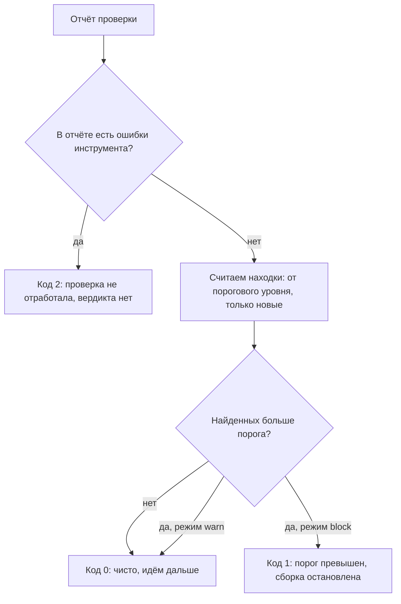
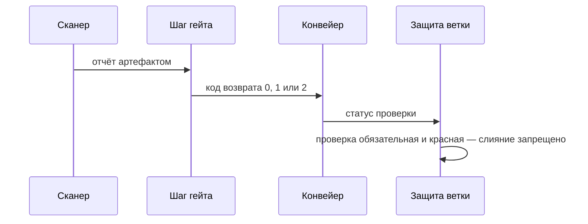

# Блокирующие и информационные проверки, quality gates

Конвейер из `pipeline-anatomy` уже умеет запускать проверку и печатать её
отчёт. Теперь представьте прогон, в описании которого опечатка: путь к файлу
правил указывает на файл, которого нет. Сканер правил не находит, завершается
кодом 7 и отдаёт пустой отчёт. В журнале сборки это выглядит так:

```text
scan: cannot open ci/rules.yaml, exit code 7
gate: 0 findings, passed
```

Две строки — и в них вся поломка: какая из них должна была остановить сборку
и почему не остановила? Пустой отчёт конвейер читает как «находок ноль,
чисто», и слияние разрешено: все проверки «пройдены», конвейер зелёный. Та
же строка `0 findings` стоит и после честного чистого прогона, потому что
тишина сломанной проверки ничем не отличается от тишины чистого кода. Это
поломка молчаливого гейта, и она хуже красного конвейера: красный хотя бы
замечают.

## Что такое quality gate

Почему пустой отчёт прочитался как «чисто», видно из того, что конвейер знает
о шаге. Отчёт он не читает вовсе. У каждого job есть код возврата, и конвейер
складывает вердикт сборки из этих чисел: ноль значит «шаг прошёл», неноль —
«шаг упал». Всё, что проверка узнала о коде — какие правила сработали,
где, насколько это серьёзно, — остаётся в отчёте и до вердикта не доходит.
Значит, между отчётом и конвейером нужен тот, кто читает отчёт и назначает
число. Это и есть quality gate, «порог качества»: шаг конвейера, который
превращает вывод проверки в одно из двух решений — сборка идёт дальше или
останавливается.

Устройство гейта похоже на досмотр в аэропорту. Офицер смотрит не в чемодан,
а на экран сканера, и решение принимает по картинке. Соответствие такое:

| досмотр в аэропорту | конвейер |
|---|---|
| чемодан | сборка |
| сканер с картинкой | проверка с отчётом |
| офицер у экрана | гейт |
| «пропускай» или «задержи» | код возврата |

Аналогия ломается ровно в том месте, ради которого написана эта тема. Экран
досмотра либо показывает картинку, либо заметно погас, и молчащий сканер
офицера не обманет. В конвейере же упавшая проверка отдаёт пустой отчёт, а
пустой отчёт выглядит чистым. Поэтому договор о коде возврата обязан
различать три исхода, а не два:

```text
0  порог не превышен — идём дальше
1  порог превышен — сборка остановлена
2  проверка не отработала — вердикта нет
```

Третий код — главное, чего в типовом гейте нет. Проверка, которая не смогла
запуститься, не нашла файлов или упала на разборе, отдаёт пустой список
находок. Гейт, различающий только «есть находки» и «нет находок», прочтёт
этот список как «чисто» и пропустит сборку. Ответьте себе до дальнейшего
чтения: откуда гейт вообще может узнать, что проверка упала, если отчёт при
этом пуст?

Кроме числа, у вердикта есть режим. Блокирующий гейт при превышении порога
возвращает единицу, и конвейер останавливает сборку. Информационный печатает
то же замечание, но возвращает ноль: сборка едет дальше, а замечание
остаётся в журнале. Это не строгий и мягкий варианты одной проверки, а две
разные роли в процессе: информационный режим собирает статистику и доверие
команды, блокирующий исполняет принятую договорённость.

Серверный порог качества из темы `sonarqube` — родственник этого гейта, но не
он сам. Там условия применяет сервер к метрикам, которые посчитал сам. Здесь
гейт — шаг в конвейере, и работает он с отчётом любого инструмента, отдающего
машиночитаемый формат.

**Зачем это в работе AppSec-инженера.** Настройка блокирующих проверок — то,
чем «встройка в CI/CD» отличается от «запустили сканер». Запустить сканер в
конвейере умеет любой. Сделать так, чтобы его вердикт что-то менял и при этом
не остановил работу команды, — отдельная работа. Достаётся она именно
AppSec-инженеру, потому что решать приходится не технический, а договорной
вопрос: что считается достаточно плохим, чтобы остановить выкладку.

## Подумай, прежде чем читать

1. Сканер запустился, не нашёл ни одного файла для проверки и завершился. Что
   должен вернуть гейт?
2. В репозитории две старые находки. Разработчик добавил третью. Порог стоит
   «не больше двух». Остановит ли гейт сборку?
3. Проверку включили блокирующей в понедельник. Что произойдёт с ней к
   пятнице, если в первый же день она остановит десять сборок из десяти?

## Как это работает

**Откуда это взялось.** Первые проверки в конвейере печатали отчёт, и читать
его никто не был обязан. Отчёт, который никого ни к чему не обязывает,
перестают читать за две недели — это наблюдение старше самих конвейеров.
Ответом стала блокировка: вердикт проверки привязали к судьбе сборки. Тут же
выяснилась цена. Репозиторий, в который проверку внесли впервые, содержит
накопленные находки, и блокирующий порог «ноль находок» останавливает всё
сразу. Из попыток разрешить это противоречие и выросли три механизма темы:
режимы, порог на новом коде и ступень ввода.

### Договор о коде возврата

Конвейер видит от проверки одно число, поэтому гейт — это код, который читает
отчёт и назначает это число. Чисел три, и третье почти всегда приходится
вводить руками, потому что инструменты его не различают. Сканер, упавший на
разборе одного файла, обычно завершается тем же кодом, что и сканер, ничего
не нашедший. Отличие видно только внутри отчёта, в отдельном списке ошибок
инструмента. Гейт обязан посмотреть туда до того, как считать находки:

```python
# ФРАГМЕНТ — упрощённое начало функции гейта из лабы темы
if report.get("errors"):
    print("gate: проверка не отработала — вердикта нет")
    return 2
```

Порядок здесь существенный. Гейт, который сначала считает находки, увидит
ноль и отдаст зелёный: проверка упала, а сборка проехала мимо неё с отметкой
«пройдено». Именно так устроена поломка из вступления.

### Порог: уровень, число, множество

Слово «порог» собрано из трёх решений, и каждое отвечает на свой вопрос.

Первое решение — **уровень**. Порог считает находки от заданной тяжести и
выше, а не все подряд. Без этого «не больше нуля» останавливает сборку на
первом же информационном замечании о стиле.

Второе решение — **число**: сколько находок пропускается. Ноль — самый
честный вариант и одновременно самый непригодный для репозитория, в котором
проверка вводится впервые.

Третье решение — **множество**. Считаются не все находки, а те, которых не
было в базовом состоянии. Базовое состояние, или baseline, — это снимок
находок на момент ввода проверки: всё, что в нём есть, объявляется
накопленным долгом, а считается только новое. Вопрос у такого порога другой:
не «сколько всего», а «что нового».

### Порог на всём коде против порога на новом

Различие проще всего видно на бытовом примере. Врач может сказать «вес не
больше восьмидесяти» — это порог числом на всём. А может сказать «вес не
должен расти» — это порог на новом: при восьмидесяти пяти первое правило
запрещает всё, а второе разрешает жить и запрещает прибавлять. Ломается
аналогия на измерении: весы показывают вес всегда, а «новизну» находки ещё
надо уметь опознать. Этому посвящён подраздел про опознание ниже.

На прогоне разница между числом и множеством видна построчно. Стенд: два
коммита, в первом один дефект, во втором добавлен второй. До разбора найдите
в таблице две строки, которые отвечают на один и тот же коммит по-разному.

```text
режим                       находок  rc  результат
весь код, блокирующий, 0          2   1  сборка остановлена
весь код, информационный, 0       2   0  идём дальше
весь код, блокирующий, порог 2    2   0  зелёный
новый код, baseline коммит A      1   1  сборка остановлена
новый код, baseline коммит B      0   0  зелёный
```

Третья строка и четвёртая — весь смысл различия. Числовой бюджет «не больше
двух» пропускает только что добавленный дефект: общее число ещё не выросло
выше порога. Baseline того же коммита относительно предыдущего останавливает
сборку, потому что вопрос у него другой — что появилось, а не сколько всего.
Проверить различие можно одним ходом: пусть второй коммит чинит старую
находку и добавляет новую. Что ответит числовой бюджет «не больше двух» и
что ответит baseline?

Числовой бюджет при этом не бесполезен: он даёт направление. Порог, который
раз в квартал опускают на единицу, медленно вычищает накопленное. Но
останавливать новый дефект он не умеет по устройству. Направление — да,
защита — нет.

Теперь порядок решений внутри гейта собирается в одну картинку:



**Описание схемы.** Схема читается сверху вниз и показывает порядок решений
внутри гейта. Первой проверяется не число находок, а список ошибок
инструмента: если он непуст, гейт отвечает «вердикта нет». Только потом
считаются находки — от порогового уровня тяжести и, если задана база, только
новые. Превышение порога останавливает сборку лишь в блокирующем режиме: в
информационном замечание печатается, а код возврата остаётся нулём.

### Как гейт опознаёт находку

Baseline — разность двух множеств, и всё держится на том, что считается
элементом множества. Одна и та же находка в двух отчётах должна опознаться
как одна: ошибка опознания — и сборка остановлена зря.

Проще всего опознавать находку по координате — правило, файл, номер строки.
Это как опознавать жильца по адресу: пока он не переехал, работает. Слабость
видна на стенде. Ключ из идентификатора правила и файла склеивает две разные
находки одного правила в одном файле. На стенде правило про сборку запроса
строкой сработало дважды — на пятой строке и на восемнадцатой, — и вторая при
таком ключе не считается новой. Ключ с номером строки ломается иначе: добавьте
строку выше — и любая находка под ней объявляется новой.

Правильный ответ — отпечаток, по-английски fingerprint: подпись, вычисленная
по самому фрагменту кода, а не по его координате. Фрагмент тот же — и находка
та же, куда бы она ни съехала в файле. На стенде получить отпечаток не
удалось: поля `extra.lines` и `extra.fingerprint` бесплатная сборка сканера
отдаёт строкой `requires login`, то есть отпечатка в отчёте нет вовсе.

Это замер, а не оценка, и практический вывод из него один: **baseline, собранный
своими руками поверх отчёта, — временная мера.** Постоянная — либо режим
baseline самого инструмента, который сравнивает не отчёты, а состояния кода
по истории, либо система, хранящая находки и умеющая их опознавать. Как
опознание устроено там, разбирается в `finding-deduplication`.

### Ступень

Проверка, включённая блокирующей на живом репозитории, останавливает работу
команды в первый день и выключается во второй. Ступень, которая этого
избегает, состоит из трёх шагов и растянута на недели.

1. **Информационный режим.** Проверка стоит, отчёт печатается, вердикт не
   меняется. Задача шага — собрать статистику: сколько находок в неделю,
   какая доля ложных, сколько времени уходит на разбор.
2. **Порог на новом коде.** Накопленное объявляется базой и не считается.
   Останавливает только то, что добавили. С этого момента долг перестаёт
   расти.
3. **Порог на всём.** Вводится, когда накопленное разобрано, и только тогда.

Шаг между вторым и третьим — самый длинный, и на многих репозиториях он не
делается никогда. Это законный итог: конвейер, который не даёт долгу расти,
полезнее конвейера, который остановлен навсегда. Полпути здесь — уже
результат.

### Где гейт стоит в конвейере

Гейт — отдельный шаг, а не часть шага проверки, и это решение стоит объяснить.
Слить их в один шаг заманчиво: сканер сам умеет завершаться ненулевым кодом
при находках, и отдельный гейт кажется лишним звеном. Цена такого слияния
выясняется позже, и она в трёх местах.

Первое: порог перестаёт быть виден. Он превращается в набор ключей командной
строки внутри длинной команды, и ответ на вопрос «почему остановились»
приходится собирать из документации инструмента.

Второе: режим перестаёт переключаться. Информационный прогон того же сканера
— это другая команда, и две команды немедленно расходятся между собой;
вводить проверку по ступени становится нечем.

Третье, и самое дорогое: у разных инструментов разные соглашения о кодах
возврата. Один отдаёт единицу при находках и двойку при ошибке, другой —
единицу в обоих случаях, третий всегда ноль и просит смотреть в отчёт. Гейт,
написанный отдельно и читающий машиночитаемый отчёт, приводит их всех к
одному договору; гейт, растворённый в командах инструментов, повторяет
разнобой этих соглашений внутри одного конвейера.

### Кто исполняет вердикт

Гейт возвращает число, конвейер складывает числа в вердикт, но вердикт сам по
себе ничего не запрещает. Запрет живёт в другом месте — в защите ветки.
Защита ветки — это настройка форжа, площадки, где живёт репозиторий:
проверка объявляется обязательной, и слияние в защищённую ветку невозможно,
пока она красная. Кто кому что передаёт, видно на обмене:



**Описание схемы.** Обмен читается сверху вниз. Сканер передаёт гейту отчёт
объявленным артефактом, потому что рабочий каталог нового job чистый. Гейт
отвечает конвейеру одним числом, конвейер сообщает форжу статус проверки.
Запрет применяет не гейт и не конвейер, а последний участник — защита ветки.

Граница между темами проходит здесь: порог живёт в конвейере и даёт вердикт,
защита ветки живёт в форже и решает, что с этим вердиктом делать. Разбор — в
`branch-protection`.

## Что умеет и чего не умеет

**Что умеет гейт.** Превратить отчёт в решение, и превратить его одинаково
при каждой сборке. Человек, читающий отчёт, решает всякий раз заново; гейт
решает по записанному правилу, и правило это лежит в репозитории и проходит
ревью.

Второе — сделать долг видимым. Порог на новом коде проводит черту между
«накоплено» и «добавлено», и обе величины становятся числами, за которыми
можно следить.

Третье — дать разработчику ответ до ревью. Вердикт приходит на конвейере, а
не в комментарии через два дня, и правится там же, где писался код.

**Чего гейт не умеет.** Отличить дефект от ложного срабатывания. Он считает
строки в отчёте; вопрос, что из этого настоящее, решён раньше и в другом
месте — `triage-false-positives`.

Не умеет он и назначить порог. Число берётся из договорённости команды, а не
из инструмента; гейт, у которого порог «по умолчанию», повторяет чужую
договорённость, принятую для другого продукта.

Не умеет он и учесть, что проверка бывает частичной. Сканер, разобравший
девять файлов из десяти, отдаёт находки по девяти; в отчёте это выглядит как
полный результат, и гейт считает по нему. Отличить частичный проход от
полного можно только по числу проверенных объектов. Число это стоит печатать
в журнал рядом с числом находок: иначе сужение области проверки становится
самым дешёвым способом получить зелёный гейт.

Не умеет он остановить того, кто может обойти проверку. Гейт останавливает
сборку; выкладка в обход конвейера, слияние с правами администратора и прямой
коммит в защищённую ветку остаются вне его досягаемости.

## Как запустить

Гейт — свой код, а не настройка. Он читает отчёт и назначает число, поэтому
пишется один раз и переиспользуется на всех проверках, отдающих
машиночитаемый отчёт.

**Шаг 1. Получить отчёт машиной, а не глазами.** Любой инструмент, который
предполагается использовать в гейте, обязан уметь отдавать отчёт в
разбираемом формате. Инструмент, который печатает только текст для человека,
придётся разбирать выражениями, и первый же выпуск это сломает.

**Шаг 2. Написать сам гейт.** Он состоит из четырёх решений, и порядок между
ними тот же, что в разделе про механику. Сначала «не знаю», потом фильтр по
уровню, потом разность с базой, потом сравнение с числом.

**Шаг 3. Задать режим отдельным ключом.** Блокирующий и информационный — не
два разных гейта, а один с переключателем. Иначе информационная версия
отстанет от блокирующей на первой же правке.

**Шаг 4. Прогнать на четырёх отчётах.** Чистый, с находками, с новой находкой
относительно базы, с упавшим сканером. Четвёртый — тот, о котором забывают;
получить его несложно, достаточно указать гейту на несуществующий файл
правил. Прогон со стенда этой темы:

```text
$ ./gate.sh block
gate: проверка не отработала (semgrep rc=7) — вердикта нет
$ echo $?
2
```

Гейт увидел, что сканер завершился кодом 7, и ответил двойкой — «вердикта
нет», а не «чисто». Именно это отличает гейт, написанный по договору, от
гейта, который умеет только считать находки.

**Шаг 5. Поставить в конвейер.** Шаг гейта идёт после шага проверки и
получает её отчёт артефактом. Обе части этой фразы существенны. Гейт —
отдельный шаг, потому что его вердикт должен быть виден в конвейере отдельной
строкой. Артефакт объявляется явно, потому что рабочий каталог у нового job
чистый.

## Как читать вывод

Гейт печатает три вещи, и все три нужны в журнале.

**Число и порог рядом.** Строка «находок 2, порог 0» отвечает на первый
вопрос разработчика — почему остановились. Без порога в той же строке ему
придётся искать настройку в описании конвейера.

**Список находок, но короткий.** Пять первых строк с правилом, файлом и
номером строки. Полный отчёт лежит артефактом; журнал нужен для того, чтобы
понять, идти за отчётом или нет.

**Режим и база.** Строка «режим block, baseline 7b8e835» говорит, по какому
правилу вынесен вердикт. Она же — единственный способ понять задним числом,
почему вчерашняя сборка прошла, а сегодняшняя нет, при одинаковом числе
находок.

Прогон гейта на стенде, все пять случаев:

```text
весь код, блокирующий      2  rc=1  порог превышен, сборка стоит
весь код, информационный   2  rc=0  режим информационный, идём дальше
весь код, порог 2          2  rc=0  зелёный
новый код, baseline A      1  rc=1  порог превышен, сборка стоит
новый код, baseline B      0  rc=0  зелёный
```

**Чего в выводе гейта быть не должно.** Тяжести, пересчитанной самим гейтом.
Гейт не оценщик: он читает уровень, назначенный инструментом, и сравнивает
его с порогом. Оценка тяжести с поправкой на приложение — работа другой темы
(`severity-assessment`), и удвоение её внутри гейта даёт два расходящихся
мнения об одной находке.

## Границы метода

**Граница первая: гейт не заменяет разбор.** Он считает то, что ему дали.
Репозиторий, где половина находок ложные, с гейтом получит остановленные
сборки вместо непрочитанных отчётов, и это не улучшение. Порядок работ
обратный: сначала разбор и подавление, потом блокировка.

**Граница вторая: порог на новом коде опознаёт находки настолько, насколько
позволяет отчёт.** На бесплатных сборках инструментов отпечатка в отчёте
может не быть вовсе, и своё опознание придётся строить на координатах — то
есть хрупко. Режим baseline самого инструмента, если он есть, надёжнее
своего.

**Граница третья: гейт ничего не знает о том, что происходит после сборки.**
Он относится к артефакту в момент проверки. Подмена артефакта после сборки,
выкладка мимо конвейера и правка на работающем сервере лежат за его границей.

**Граница четвёртая: третий код возврата понимает не всякий конвейер.**
Многие системы трактуют любой ненулевой код одинаково — как падение. Тогда
«не знаю» и «порог превышен» сливаются в один красный вердикт, и различать их
придётся по журналу. Это хуже, чем разные коды, и всё же лучше, чем зелёный
на упавшей проверке.

**Цена.** Написать гейт — день с прогонами на четырёх отчётах. Провести
проверку по ступени от информационного режима до порога на новом коде — от
двух недель до квартала. Большая часть этого времени уходит на разбор
накопленного, а не на технику.

## Частая ошибка

Так вводят гейт без сопротивления: чтобы не остановить команду, достаточно
поставить порог по числу находок чуть выше текущего значения и постепенно его
снижать. Звучит как разумный компромисс. Проверьте это ощущение на строках
прогона из раздела «Как это работает» и только потом читайте дальше.

**Числовой бюджет пропускает новый дефект, пока общее число не выросло выше
порога.** На стенде это видно построчно: порог «не больше двух» при двух
находках зелёный, и добавленный вторым коммитом дефект проезжает без
замечаний. Разработчик получил зелёный конвейер на коммит, который добавил
дефект, — то есть ровно тот сигнал, которого гейт должен был не дать.

Цепочка у этой ошибки понятная: порог «чуть выше текущего» выглядит
компромиссом между «останавливать всё» и «не останавливать ничего», а
обещание снижать его — планом. У компромисса не замечают одного: общее число
ничего не говорит про добавленное, а добавленное — единственное, ради чего
порог ставился.

Хуже другое следствие. Числовой бюджет создаёт обмен: починил старую находку
— получил право добавить новую. Обмен этот никем не задумывался и никем не
контролируется, но правило работает именно так.

Контрпример к обратному выводу — «значит, числовой порог не нужен вовсе».
Нужен, но для другой задачи: он задаёт направление на накопленном долге, и
снижать его раз в квартал полезно. Ошибка не в самом пороге, а в том, что его
ставят вместо baseline, а не вместе с ним. Правильная пара — baseline
останавливает новое, числовой порог медленно вычищает старое.

## Чеклист для ревью

1. Проверьте, что гейт различает три исхода: порог не превышен, порог превышен
   и проверка не отработала.
2. Проверьте, что список ошибок инструмента проверяется до подсчёта находок, а
   не после.
3. Проверьте, что порог считает находки от названного уровня тяжести, а не все
   подряд.
4. Проверьте, что новое отделено от накопленного базой, а не числовым бюджетом.
5. Проверьте, что режим проверки задан переключателем, а не двумя копиями
   гейта.
6. Проверьте, что отчёт проверки передан гейту артефактом, объявленным явно.
7. Проверьте, что порог записан в репозитории и виден в ревью, а не выставлен
   в интерфейсе сервера.
8. Проверьте, что вердикт гейта объявлен обязательным в защите ветки — иначе
   он ничего не запрещает.

## Попробуй сам

`lab-quality-gates`, каталог `pilot/lab/quality-gates`. Формат «почини»:
правится `gate.py`, пока `check.py` не скажет «зачтено».

**Цель одной фразой:** написать гейт, выполняющий договор о трёх кодах
возврата на четырёх сохранённых отчётах.

Всё локально, без сети и без сканера: отчёты сняты заранее настоящим прогоном
и лежат рядом. Заготовка `gate.py` в исходном состоянии отдаёт ноль всегда, а
восемь прогонов проверялки разводят уровень тяжести, информационный режим,
числовой бюджет и базу.

Подсказка в лабе одна и говорит про третий код возврата: начинать надо с
различения «не знаю» и «чисто», а не с подсчёта.

**Отдельная задача «почини».** Порядок решений в гейте существенный: проверка
списка ошибок инструмента стоит до фильтра по уровню, иначе упавший сканер
даёт зелёный. Отдельно в лабе показано хрупкое место опознания находок — то
самое, из-за которого свой baseline остаётся временной мерой.

Разбор лежит в `solution.md` и открывается после своей попытки.

## Проверь себя

1. Предскажите, что напечатает команда на каждом из двух отчётов лабы, и какой
   код обязан вернуть гейт на каждом?

```text
jq '(.results|length), (.errors|length)' reports/clean.json
jq '(.results|length), (.errors|length)' reports/failed.json
```

2. Почему один и тот же коммит останавливается по одной строке прогона и
   проходит по другой?

```text
режим                       находок  rc  результат
весь код, блокирующий, порог 2    2   0  зелёный
новый код, baseline коммит A      1   1  сборка остановлена
```

3. Почему проверка списка ошибок инструмента стоит в гейте до подсчёта
   находок?
4. Проверку включили блокирующей в понедельник, и в первый день она
   остановила десять сборок из десяти. Что произойдёт с ней к пятнице и
   почему?
5. Возврат к теме `sonarqube`: чем порог, который считает сам сервер проверки
   качества, отличается от гейта в конвейере?
6. Возврат к теме `triage-false-positives`: почему блокировку вводят после
   разбора находок, а не до него?

<details markdown="1">
<summary>Ответ 1</summary>

1. Прогон из каталога лабы `pilot/lab/quality-gates`:

```text
$ jq '(.results|length), (.errors|length)' reports/clean.json
0
0
$ jq '(.results|length), (.errors|length)' reports/failed.json
0
1
```

   Находок ноль в обоих отчётах, но у второго есть список ошибок: сканер упал.
   Гейт обязан вернуть 0 на первом и 2 на втором — «вердикта нет», а не
   «чисто».

</details>

<details markdown="1">
<summary>Ответ 2</summary>

2. Числовой бюджет смотрит на общее число: два не больше порога, и добавленный
   дефект проезжает. Baseline смотрит на разность с прошлым состоянием: одна
   новая находка есть — сборка стоит. Вопросы у двух режимов разные: «сколько
   всего» и «что появилось».

</details>

<details markdown="1">
<summary>Ответ 3</summary>

3. При падении список находок пуст, и гейт, считающий первым делом, прочтёт
   пустоту как «чисто» и пропустит сборку мимо упавшей проверки. Поэтому
   порядок решений такой: сначала «не знаю», потом фильтр по уровню, потом
   разность с базой, потом сравнение с числом.

</details>

<details markdown="1">
<summary>Ответ 4</summary>

4. Её отключат. Десять остановок из десяти означают, что проверка вошла без
   ступени. Ступень: информационный режим со сбором статистики, порог на
   новом коде, порог на всём. Блокировка на живом репозитории в первый день
   останавливает работу команды, и реакцией команды будет отключение проверки.

</details>

<details markdown="1">
<summary>Ответ 5</summary>

5. Сервер проверки качества считает свой порог по своим метрикам, и его
   вердикт относится к тому, что он измерил. Гейт в конвейере сводит вердикты
   нескольких проверок в один код возврата шага и живёт в описании конвейера,
   а не в настройках сервера.

</details>

<details markdown="1">
<summary>Ответ 6</summary>

6. Блокировка не улучшает отчёт: репозиторий, где половина находок ложные,
   получит остановленные сборки вместо непрочитанных отчётов, и первым
   следствием станет отключение проверки. Поэтому сначала разбор и
   подавление, потом блокировка.

</details>

## Источники

1. SonarSource, «Quality gates»; реестр `sonarqube-quality-gates`. Разделы:
   условия порога, метрики нового кода против метрик всего кода, поведение при
   недостижимом условии.
   <https://docs.sonarsource.com/sonarqube-server/quality-standards-administration/managing-quality-gates/introduction-to-quality-gates>
2. GitHub, «About protected branches»; реестр `gh-protected-branches`. Разделы:
   обязательные проверки перед слиянием — то место, где вердикт конвейера
   превращается в запрет.
   <https://docs.github.com/en/repositories/configuring-branches-and-merges-in-your-repository/managing-protected-branches/about-protected-branches>

Каркас этапа: `owasp-cicd-top10`. Наследуется всеми темами этапа и отдельной
строкой не повторяется.

**Скоропортящийся слой.** Состав полей машиночитаемого отчёта конкретного
сканера, наличие в нём отпечатка находки и названия ключей режима baseline.
Устройство — три кода возврата, порог по уровню, разность с базой, ступень
ввода — держится дольше.

**Маркеры уверенности.** Все пять прогонов гейта и их коды возврата — **лично**,
2026-08-25, на своём стенде: два коммита, один старый дефект и один добавленный,
сканер Semgrep 1.174.0, вывод сохранён. Третий код возврата воспроизведён
**лично** указанием гейту на несуществующий файл правил: сканер завершился
кодом 7, гейт отдал 2. Отсутствие отпечатка в отчёте — **замер**: поля
`extra.lines` и `extra.fingerprint` во всех трёх находках содержат строку
`requires login`. Прогоны jq из вопроса 1 повторены **лично** 2026-10-03 в
каталоге лабы: вывод совпал дословно (`0` и `0` на чистом отчёте, `0` и `1` на
упавшем). Заготовка лабы перезапущена в тот же день: `gate.py` отвечает нулём
на любом отчёте, `check.py` печатает «не зачтено» — исходное состояние лабы на
месте. Числа стенда малы и привязаны к нему; переносить стоит устройство, а не
значения. Поведение сервера проверки качества и настройки защиты ветки **не
проверялись** прогоном и изложены **по документации**.
