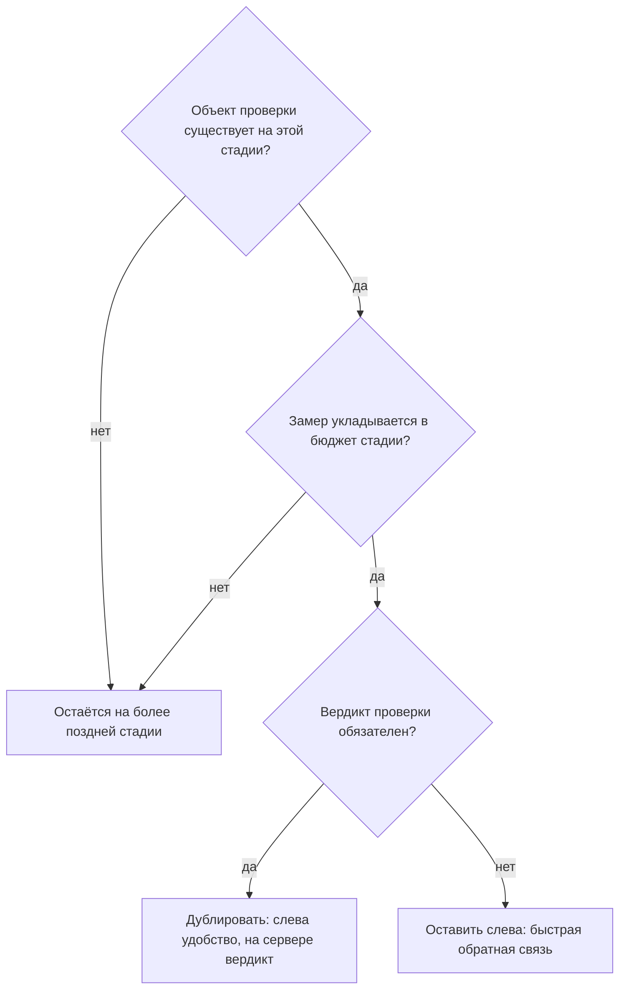

# Shift-left: какая проверка на какой стадии

В таблице замеров этой темы есть пара чисел, которая удивляет. Проверка
двадцати четырёх строк кода заняла 0.71 секунды, а проверка семи тысяч строк
тем же инструментом — 1.05. Объём вырос в триста раз, а время — в полтора.
Почти всё время ушло не на разбор кода, а на запуск самого инструмента.

Из таких наблюдений складывается правило темы: место проверки в конвейере
выводится из двух измеримых величин, а не из девиза «чем раньше, тем лучше».
Девиз называется «сдвиг влево», и у него есть точный смысл и ходовое
искажение. Разница между ними стоит командам настоящих проверок: перенесённые
не туда, они не отключаются решением, а тихо перестают работать.

## Что такое сдвиг влево

Разработку рисуют лентой слева направо. Слева программист пишет код у себя
в редакторе. Дальше изменение едет в общий репозиторий и в сборку, а справа
лента кончается выпуском — версией, которую видят пользователи. «Сдвинуть
проверку влево» значит перенести её ближе к началу ленты, к моменту, когда
код ещё пишется. Само слово пришло из тестирования, где давно заметили:
дефект, найденный раньше, чинится дешевле.

Бытовой пример — опечатка в тексте. В черновике она правится одним нажатием,
и никто её не видит. В отправленном письме — вторым письмом с извинением:
исправимо, но уже заметно. В отпечатанной газете она не правится вовсе:
тираж разошёлся. Черновик здесь соответствует коду до коммита, письмо —
слиянию в общую ветку, газета — выпуску. Ломается аналогия в одном месте:
вычитка не отнимает время у того, кто пишет, а проверка в конвейере отнимает.
Это вторая величина, из которой выводится размещение.

**Первая величина — цена находки, и она растёт вправо.** Дефект, найденный до
коммита, правится в том же контексте, в котором писался: вы ещё помните,
зачем нужна эта строка. Тот же дефект, найденный в ревью, стоит переключения
внимания двух человек — вашего и проверяющего. На выпуске он стоит отката,
разговора с заказчиком и записи в отчёт.

**Вторая величина — бюджет времени стадии, и он падает влево.** Проверку до
коммита разработчик ждёт лично и при каждом коммите, поэтому счёт идёт на
секунды. Проверку на слиянии автор изменения ждёт один раз, и у неё есть
минуты. Проверку на выпуске не ждёт никто конкретный, и у неё есть часы.

Из двух величин выводится правило размещения: **проверка ставится на самую
раннюю стадию, в бюджет которой она укладывается.** Всё, что не укладывается,
остаётся правее, и это не поражение, а нормальный итог раскладки. Ранняя
проверка при этом не заменяет позднюю: клиентский хук обходится одним ключом,
и обязательной проверка становится только на сервере. Как устроен такой
обход, разбирает `pre-commit-hooks`.

**Зачем это в работе AppSec-инженера.** За термином обычно стоит запрос
«поставьте проверки раньше». Отвечать на него приходится конкретикой: какая
проверка, в какой бюджет укладывается, что она найдёт на этой стадии и чего
не найдёт. Без замера разговор сводится к переносу всего подряд на первую
стадию. После этого разработчики отключают хук, и проверок становится меньше,
чем было.

## Как это работает

**Откуда это взялось.** Наблюдение о растущей цене поздней находки старше
конвейеров и относилось изначально к дефектам вообще, а не к безопасности.
Перенос его на проверки безопасности дал нынешний термин и вместе с ним
устойчивое искажение. «Влево» стали читать как «до коммита», а стадию между
коммитом и выпуском — как промежуточную. На деле стадий, на которых проверка
может стоять, четыре, и самая полезная из них обычно вторая. На слиянии
сходятся три вещи: бюджет в минутах, а не в секундах, изменение перед
проверкой целиком, а вердикт исполняет сервер — ключом его не снять.

### Четыре стадии и их бюджеты

Назовём стадии по месту изменения в конвейере. Первая — до коммита: код ещё
у вас в редакторе или в хуке. Вторая — на слиянии: изменение предложено
в общую ветку запросом на слияние, то есть пакетом правок, который коллеги
читают и который автоматика проверяет целиком. Третья — после слияния:
полный проход по общей ветке, которого никто не ждёт лично. Четвёртая — на
выпуске: проверка собранного продукта перед тем, как его увидят пользователи.

Порядок стадий задаёт не привычка, а структура: руководство OWASP DevSecOps
Guideline идёт теми же шагами — до коммита, проверки уязвимостей, соответствие
требованиям [^1]. Наша четвёрка отличается одним: середина этого списка
разделена надвое, на слияние и на проход после него. Развёрнуто это выглядит
так:

```text
стадия           кто ждёт           бюджет      что успевает
до коммита       разработчик        до 2 с      секреты, разметка, линтеры
на слиянии       автор запроса      2–10 мин    статический анализ, состав
после слияния    никто              десятки мин полный проход, состав, образ
на выпуске       выпуск             часы        работающее приложение
```

Бюджет — наблюдаемая величина, а не пожелание. Хук, отнимающий пять секунд
на каждый коммит, отключается за неделю. Хук, отнимающий десятую долю
секунды, живёт годами.

### Замеры

Числа ниже сняты на одном стенде и малы, потому что стенд мал. Полезно в них
соотношение, а не сами значения: на вашем репозитории числа будут другими,
и мерить придётся своё. Каждое значение — медиана трёх прогонов, то есть
средний по порядку результат: так один случайный тормоз машины не портит
замер. Последняя строка таблицы — проход всего конвейера целиком, из четырёх
работ (job).

```text
проверка                                      сек
хук: поиск ключа доступа по индексу          0.00
проверка описания конвейера схемой           0.07
линтер описаний конвейера в контейнере       0.27
статический анализ, 2 правила, 24 строки     0.71
статический анализ, 2 правила, 7038 строк    1.05
проход по всему конвейеру, 4 job             1.11
```

Читается таблица так. Разница между проверкой двадцати четырёх строк и
проверкой семи тысяч — треть секунды: почти всё время статического анализа
уходит на запуск, а не на разбор. Отсюда неочевидный вывод: **на маленьком
изменении дорого не проверить, а начать проверять.**

Хук, запускающий тяжёлый инструмент на трёх изменённых файлах, стоит почти
столько же, сколько полный проход. В бюджет стадии он не влезает по этой
причине, а не из-за объёма кода. Почему тогда замер на пустом изменении
говорит о пригодности хука больше, чем замер на большом? Потому что на пустом
изменении видна чистая цена запуска, а именно она решает, укладывается ли
проверка в бюджет хука.

Второй вывод — про порядок. Проверки описания конвейера дешевле проверок кода
на порядок и относятся к файлу, который меняется редко. Их место — самая
левая стадия, и там они бесплатны.

### Что переносится влево, а что нет

Влево переносится проверка, которой достаточно текста изменения. Поиск
секретов, разметка, линтеры, проверка описания конвейера — всё это смотрит
на строки, которые вы только что написали, и укладывается в секунды.

Влево не переносится проверка, которой нужен собранный продукт или его
окружение. Динамическому сканеру нужно поднятое приложение, которое отвечает
на запросы. Проверке образа контейнера нужен сам образ — упаковка приложения
вместе со всем его окружением в один переносимый файл. Разбору состава
зависимостей нужны разрешённые версии — конкретные версии библиотек, которые
сборка выбрала по диапазонам из манифеста. У всех троих объект проверки
появляется позже коммита, и переносить их некуда.

Отдельный случай — проверки, которым нужен контекст всего репозитория.
Статический анализ, идущий по межпроцедурным путям, на трёх изменённых файлах
даёт не быстрый, а неверный ответ: половина путей уходит в код, которого он
не видел. Это вопрос корректности, а не бюджета, и разобран он в
`sast-principles`.

### Перенос против дублирования

«Сдвинуть влево» иногда означает перенести, а иногда — поставить второй раз.
Различать эти два случая стоит по тому, кто исполняет вердикт.

Проверка, стоящая только слева, необязательна: клиентский хук снимается
ключом `--no-verify`, и на сервер приходит коммит, которого хук не видел.
Поэтому перенос в чистом виде применим лишь там, где ранняя проверка нужна
для удобства, а не для гарантии.

Проверка, которая должна что-то гарантировать, дублируется. Слева она даёт
быструю обратную связь, справа — вердикт, на который опирается защита ветки:
серверное правило, которое не пускает слияние, пока назначенные проверки не
прошли. Устройство такого правила разбирает `branch-protection`. Обе
половины настраиваются одним файлом правил, иначе они разойдутся за месяц.

Вся процедура размещения одной проверки собирается в три вопроса:



**Описание схемы.** Схема читается сверху вниз и показывает, как решается
место одной проверки. Первый вопрос — существует ли на этой стадии объект
проверки: если нет, переносить некуда, и проверка остаётся правее. Второй —
укладывается ли замер в бюджет стадии: если нет, проверка тоже остаётся
правее, там бюджет больше. Третий — обязателен ли вердикт: обязательная
проверка дублируется, необязательная остаётся слева как быстрая обратная
связь.

## Что умеет и чего не умеет

**Что умеет правило размещения.** Превратить спор «а давайте всё на
pre-commit» в счёт: берём бюджет стадии, берём замер проверки, сравниваем.
Спор кончается числами, а не авторитетом говорящего.

Второе умение — показать, что дублирование бывает необходимым, а не
избыточным. Аргумент «эта проверка уже стоит на хуке» после разбора
превращается в вопрос «и что мешает её обойти». Ответ — один ключ командной
строки, и он закрывает спор в другую сторону.

**Чего правило не умеет.** Ускорить проверку. Оно размещает то, что есть:
если инструмент отвечает три минуты, влево он не поедет, сколько ни двигай.
Не умеет оно и назначить, что именно проверять. Набор проверок берётся из
модели угроз — списка того, от кого и от чего защищается продукт, — и из
того, чем продукт занят. Размещение — вопрос второй, и решать его до первого
бессмысленно: раскладывать по стадиям будет нечего.

## Как запустить

Своей команды у этой темы нет: она про раскладку чужих команд по стадиям.
Есть порядок работ, который отрабатывает за день, и он из пяти шагов.

**Шаг 1. Выписать проверки, которые уже стоят.** Читается один файл —
описание конвейера: что запускается, на каком событии, в какой работе.
Устройство такого файла разобрано в `pipeline-anatomy`.

**Шаг 2. Замерить каждую.** Три прогона, берётся медиана. Замерять надо на
своём репозитории, а не на примере из документации: время зависит от размера
кода и от машины, на которой стоит раннер.

**Шаг 3. Сопоставить с бюджетом.** Таблица из четырёх строк, по стадии
в строке. Проверка ставится на самую левую стадию, в бюджет которой попадает
её замер.

**Шаг 4. Разделить обязательные и вспомогательные.** Для каждой проверки
ответить на один вопрос: кто исполняет её вердикт. Если ответ «никто» —
проверка вспомогательная, и место ей слева. Если «защита ветки» — она обязана
стоять справа, а слева может стоять её быстрая копия.

**Шаг 5. Проверить, что копии не разошлись.** Ранняя и поздняя половины одной
проверки настраиваются одним файлом правил. Расхождение ловится прогоном,
а не намерением.

## Как читать вывод

Вывод у этой темы — таблица раскладки, а не отчёт инструмента. Читается она
по трём признакам.

**Пустая левая колонка.** Ни одной проверки до коммита — обычная и не самая
плохая картина: обратная связь приходит на конвейере, через минуты. Хуже
обратное.

**Переполненная левая колонка.** Пять проверок на хуке общей стоимостью
восемь секунд — признак того, что хук уже отключён у половины команды, и об
этом никто не сказал. Проверяется это прямым вопросом, а не чтением файла
настроек: файл покажет проверку, которая формально стоит.

**Проверка, стоящая слева и не стоящая справа.** Самый частый дефект
раскладки. Выглядит как забота о раннем обнаружении, работает как отсутствие
проверки: вердикт необязателен, обход — один ключ командной строки.

## Границы метода

**Граница первая: замеры не переносятся между репозиториями.** Время проверки
зависит от размера кода, языка, числа правил и от машины, на которой стоит
раннер. Числа этой темы сняты на стенде в несколько десятков строк. На живом
репозитории они другие, и мерить надо своё.

**Граница вторая: бюджет стадии — величина про людей, а не про технику.**
«Две секунды на хук» — наблюдение, а не техническое ограничение. Оно о том,
сколько разработчик готов ждать при каждом коммите, не начав искать способ
не ждать. Значение меняется от команды к команде и проверяется разговором,
а не замером.

**Граница третья: у темы нет своего инструмента.** Всё, что она делает, —
раскладывает чужие проверки. Проверить раскладку прогоном нельзя. Прогоном
проверяется каждая проверка по отдельности, а решение остаётся человеческим.

**Цена.** Разложить проверки среднего репозитория — день с замерами.
Договориться о бюджете стадии с командой — дольше, и это главная статья
расхода.

## Частая ошибка

Девиз переноса влево доводят до предела: чем раньше стоит проверка, тем
лучше, поэтому правильная цель — перенести всё, что можно, на стадию до
коммита. «Чем раньше, тем лучше» — правда это или нет? Свой ответ
сформулируйте до разбора.

**Проверка, отнимающая у разработчика больше пары секунд на каждый коммит,
исчезает.** Не отключается решением, а тихо снимается ключом `--no-verify` —
по одному человеку за раз, без объявления. Через месяц проверка формально
стоит, а фактически не работает ни у кого. Хуже того: она считается стоящей,
поэтому справа её не ставят. Мнение берётся из первой величины в одиночку:
цена находки и правда растёт вправо. Вторая величина, бюджет стадии,
движется навстречу, и «всё, что можно» упирается в неё.

Итог переноса «всего, что можно» обратен намерению: проверок на сервере
становится меньше, чем было до сдвига.

Контрпример к обратному выводу — «значит, на хуке проверок держать не
стоит». Стоит: поиск секретов на хуке даёт то, чего не даёт ни одна поздняя
проверка. Он не пускает секрет в историю. Найденный после коммита секрет
считается скомпрометированным, и удаление его из истории уже не помогает —
почему, разбирает `secret-history-scan`. Правило не «ничего слева», а «слева
то, что укладывается в бюджет и что теряет смысл, будучи найденным позже».

## Чеклист для ревью

1. Проверьте, что у каждой проверки в конвейере замерено время на своём
   репозитории, а не взято из документации.
2. Проверьте, что суммарное время проверок до коммита укладывается в пару секунд.
3. Проверьте, что для каждой проверки названо, кто исполняет её вердикт.
4. Проверьте, что обязательная проверка стоит на сервере, а не только на
   клиентском хуке.
5. Проверьте, что ранняя и поздняя копии одной проверки настроены одним файлом
   правил.
6. Проверьте, что проверки, которым нужен собранный продукт, не перенесены на
   стадию, где его ещё нет.

## Попробуй сам

Взять свой репозиторий и построить таблицу раскладки: строка — проверка,
колонки — стадия, замеренное время, кто исполняет вердикт, обходится ли.
Замерять три раза, брать медиану.

После этого ответить на один вопрос по каждой строке: **что сломается, если эту
проверку убрать совсем.** Строки, на которые ответа нет, — кандидаты не на
перенос влево, а на удаление.

**Наблюдаемый признак выполнения:** таблица заполнена целиком, и в ней есть
хотя бы одна строка, где проверка стоит слева и не стоит справа. Либо вы
можете сказать, что таких строк нет, и показать это по таблице.

## Проверь себя

1. Хук `pre-commit` отклоняет коммит с секретом. Предскажите код возврата той
   же команды с ключом `--no-verify` и что об этом узнает сервер?

```text
$ git commit -m x
pre-commit: похоже на ключ доступа — коммит отклонён
```

2. Почему два замера в таблице различаются в полтора раза, а не в триста, и что
   это значит для хука, запускающего тяжёлый инструмент?

```text
проверка                                   сек
статический анализ, 24 строки              0.71
статический анализ, 7038 строк             1.05
```

3. Почему проверку, которой нужен собранный продукт, не переносят на стадию до
   коммита, даже если она быстрая?

4. Возврат к теме `pre-commit-hooks`: почему обязательной проверка становится
   только на сервере?

5. Возврат к теме `quality-gates`: что даёт информационный режим проверки,
   если её вердикт ничего не останавливает?

<details markdown="1">
<summary>Ответ 1</summary>

1. Ноль, и сервер не узнает ничего: хук выполняется на машине разработчика и
   ключом пропускается. Проверка на любом репозитории с хуком:

```text
$ git commit -m x ; echo "rc=$?"
pre-commit: похоже на ключ доступа — коммит отклонён
rc=1
$ git commit --no-verify -m x ; echo "rc=$?"
rc=0
```

   Обязательной проверку делает только исполнение на приёмной стороне.

</details>

<details markdown="1">
<summary>Ответ 2</summary>

2. Почти всё время уходит на запуск инструмента, а не на разбор: разница
   объёма добавляет треть секунды. Вывод для размещения: пригодность проверки
   к хуку меряют на пустом изменении — там видна чистая цена запуска.

</details>

<details markdown="1">
<summary>Ответ 3</summary>

3. На стадии до коммита объекта проверки ещё нет: работающее приложение, образ
   контейнера и разрешённый состав зависимостей появляются позже. Это граница
   по объекту, и ускорение инструмента её не сдвигает.

</details>

<details markdown="1">
<summary>Ответ 4</summary>

4. Обязательность — это исполнение там, куда код приходит. Клиентский хук
   живёт на машине разработчика и снимается его же ключом; серверная проверка
   обходится только с записью в журнал.

</details>

<details markdown="1">
<summary>Ответ 5</summary>

5. Статистику для ступени ввода: сколько находок в неделю, какая доля ложных,
   сколько времени уходит на разбор. По этим числам решают, каким будет порог
   на новом коде, — поэтому информационный режим это первая ступень, а не
   отсутствие проверки.

</details>

## Источники

1. OWASP, «DevSecOps Guideline»; реестр `owasp-devsecops-guideline`. Разделы:
   нумерация стадий конвейера — 1 Pre-commit (1a Secrets Management,
   1b Linting Code), 2 Vulnerability Scanning (2a SAST, 2b DAST, 2c IAST,
   2d SCA, 2e Infrastructure, 2f Container), 3 Compliance Auditing.
   <https://owasp.org/www-project-devsecops-guideline/latest/>
2. Проект `pre-commit`; реестр `pre-commit`. Разделы: устройство клиентского
   хука, файл настроек, порядок запуска инструментов на изменённых файлах.
   <https://pre-commit.com/>

Каркас этапа: `owasp-cicd-top10`. Наследуется всеми темами этапа и отдельной
строкой не повторяется.

**Скоропортящийся слой.** Числа замеров и состав разделов руководства по
безопасной разработке. Устройство — две величины, четыре стадии, различие
переноса и дублирования — держится дольше.

**Маркеры уверенности.** Все шесть замеров времени — **лично**, 2026-08-25,
медиана трёх прогонов на одной машине; объекты проверки и их размер названы в
таблице. Числа привязаны к стенду и переносу не подлежат: переносится
соотношение. Бюджеты стадий — **оценка**, а не замер: «до двух секунд на хук» и
«две-десять минут на слиянии» взяты из практики и из нумерации стадий
руководства, но эксперимента, который бы их установил, в этой работе не
ставилось. Утверждение о том, что дорогой хук снимается ключом `--no-verify`,
**воспроизведено лично** на стенде подраздела о четырёх стадиях и разобрано в
`branch-protection`; частота такого снятия в живых командах **не измерялась**.

[^1]: OWASP, «DevSecOps Guideline», реестр `owasp-devsecops-guideline`.
