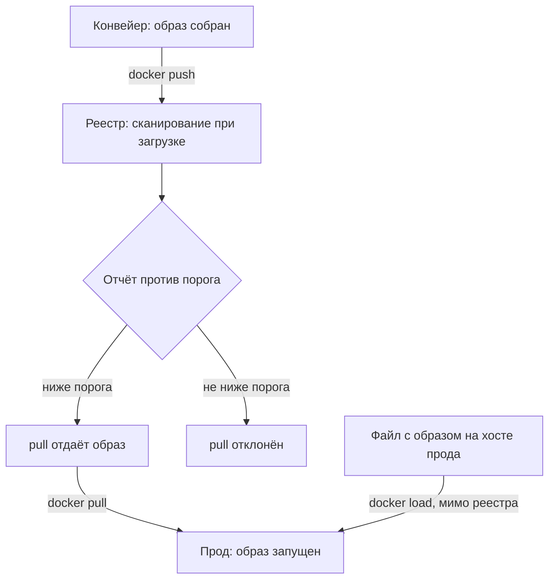

# Реестр артефактов: Harbor и сканирование при загрузке

Начнём с опыта, который ставится за минуту. Поднимем минимальный реестр —
программу registry:2, которая хранит образы и отдаёт их по запросу, —
загрузим в него образ и спросим, что внутри:

```bash
docker run -d -p 5000:5000 --name reg registry:2
docker tag alpine:latest 127.0.0.1:5000/demo:1.0
docker push 127.0.0.1:5000/demo:1.0
curl -s 127.0.0.1:5000/v2/demo/tags/list
```

Ответ реестра:

```text
{"name":"demo","tags":["1.0"]}
```

Образ лёг, и любой, кто знает адрес, теперь получит его на скачивание.
Заметьте, чего на этом пути не произошло: ничего. Хранилище приняло
артефакт без единой проверки — не спросило, что внутри, кто его собрал и
можно ли его выпускать.

Если вы ставили `docker push` в конвейер, вы знаете это место:
единственная дверь, через которую образ попадает на боевые серверы, то
есть в прод. Превратить эту дверь в контрольно-пропускной пункт — предмет
этой темы. Harbor сканирует каждый образ при загрузке и запрещает
скачивание образов не ниже заданного порога уязвимости. И держите вопрос,
на который тема ответит в «Границах метода». Образ приехал в прод
командой `docker load`, которая разворачивает образ из файла прямо на
хосте, мимо реестра. На каком шаге его остановит такая точка контроля?

## Что такое реестр артефактов

Образ у вас уже собран и проверен: линтер читал его рецепт, сканер — его
состав, это тема `dockerfile-lint-image-scan`. Дальше с образом происходит
бытовая вещь: его надо куда-то положить, чтобы серверы прода могли его
забрать. Реестр артефактов — хранилище образов с сетевым доступом.
Загрузка в него называется push, скачивание — pull, и обе команды уже
встретились вам в первом прогоне.

Бытовой пример — склад готовой продукции между цехом и магазинами. Цех, то
есть ваш конвейер сборки, привозит изделия на склад. Магазины, то есть
серверы прода, забирают их со склада. Всякий товар проходит через склад,
поэтому проверка на складе одна, а накрывает она весь товар сразу.
Ломается аналогия на служебном входе: со склада изделие можно вынести
мимо контроля, и у образа такой вход тоже есть. Это не гипотетика,
а рабочая команда, и разговор о ней — в «Границах метода».

Реестр из первого прогона — склад без контроля вовсе: registry:2 хранит и
отдаёт, и этим его обязанности кончаются. Реестр-точка-контроля на том же
адресе ведёт себя иначе. Он принимает образ, сканирует его, кладёт отчёт
рядом с образом и дальше на каждый pull отвечает по порогу: ниже порога —
отдаёт, не ниже — отказывает. Harbor — открытый реестр ровно второго
устройства, и рецепт этой темы собран на нём.



**Описание схемы.** Схема читается сверху вниз. Конвейер собирает образ и
загружает его в реестр командой push. Реестр сканирует образ при загрузке
и сверяет отчёт с порогом. Ниже порога образ отдаётся на pull и доезжает
до прода; не ниже порога pull отклонён, и образ остаётся внутри. Отдельная
стрелка показывает обход: файл с образом разворачивается командой
`docker load` на самом хосте прода, и этот путь идёт мимо реестра.

**Зачем это в работе AppSec-инженера.** Проверка в конвейере зависит от
каждого конвейера: она сработает только для тех образов, которые через
него прошли. Проверка в реестре срабатывает для всех, включая образы,
собранные в обход. Реестр — последнее место, где образ ещё можно
остановить, и ревьюеру важно уметь читать его настройки. После реестра
остановить образ уже нечем.

## Как это работает

**Откуда это взялось.** Проверки в конвейере смотрят образы тех проектов,
которые через него прошли. Образ, собранный в обход конвейера — в форке
репозитория или вручную на ноутбуке, — доезжает до прода без единой
проверки. Ответ придумали прямой: перенести контроль в место, которое не
обходится. Push в реестр идёт отовсюду, pull оттуда идёт везде, поэтому
точка становится обязательной сама собой. Проверка вне этой двери
необязательна.

Сам сканер здесь тот же, что в теме `dockerfile-lint-image-scan`: он
сравнивает состав образа с базой уязвимостей. В Harbor встроен Trivy, а
внешний сканер подключается через Pluggable Scanner API — интерфейс, по
которому реестр отдаёт образ на проверку и забирает готовый отчёт. Новое
в этой теме — не устройство сканера, а место контроля и его политики.
Политик ровно две: когда сканировать и что делать с результатом.

**Когда сканировать.** При загрузке: каждый push сам запускает
сканирование, ручной команды не нужно, и отчёт ложится рядом с образом.
По расписанию: база уязвимостей растёт ежедневно,
и образ, вчера бывший чистым, завтра может оказаться уязвимым без всякого
нового push — пересканирование ловит именно это. И вручную, когда отчёт
нужен вне расписания.

**Что делать с результатом.** Первое — порог: уровень уязвимости,
например High, при котором реестр отказывает в pull. Если в отчёте есть
находка не ниже порога, скачать образ нельзя, а раз скачать нельзя, то и
прод его не получит. Второе — CVE allowlist, список оформленных
исключений. Запись в нём снимает перечисленные CVE из расчёта порога.

Бытовая форма такой записи — обходной билет с подписью и датой:
исключение оформляется с обоснованием, почему эта находка не страшна
именно нам, и со сроком пересмотра. Граница аналогии: билет разовый,
а запись в allowlist действует на каждый pull, пока не наступит срок
пересмотра. Запись без обоснования — уже не исключение, а подавленная
находка.

## Что умеет и чего не умеет

**Что умеет.** Сканировать каждый образ при загрузке и по расписанию.
Хранить отчёт рядом с образом, так что отчёт не теряется между конвейером
и продом. Обновлять базу сканера офлайн — для изолированного контура, то
есть сети без выхода наружу, куда базу заносят на носителе. Запрещать pull
образов с уязвимостями не ниже порога. Вести allowlist оформленных
исключений.

**Чего не умеет.** Лечить сам образ: отчёт — повестка на обновление, а не
заплатка. Проверять то, чего нет в базе: уязвимость без записи в базе для
сканера не существует. Заменять ревью рецепта сборки и запуска — это темы
`dockerfile-lint-image-scan` и `docker-insecure-practices`. И главное:
реестр не видит образы, которые в него не попали. Контроль покрывает
только свою дверь.

## Как запустить

Рецепт ниже собран по документации Harbor 2.15.0. Своего стенда Harbor у
автора на момент написания не было, и маркеры уверенности в конце темы
говорят об этом прямо. Поэтому формулировки вида «включите» опираются на
документацию, а не на прогон.

Установка идёт со встроенным сканером: у установщика Harbor есть флаг
`--with-trivy`. Дальше четыре шага в настройках проекта:

1. Включите сканирование при загрузке: раздел Deployment security,
   автоматическое сканирование образов при push.
2. Задайте порог: настройка Prevent vulnerable images from running
   с уровнем уязвимости, не ниже которого образ нельзя скачать. Название
   обещает «запрет запуска», а запрещает она выдачу образа на pull — до
   запуска дело попросту не доходит.
3. Заведите CVE allowlist для оформленных исключений: у каждой записи
   обязаны быть обоснование и срок пересмотра.
4. Для изолированного контура настройте офлайн-обновление базы сканера.

После настройки проверьте её делом, а не по галочкам. Загрузите образ,
дождитесь отчёта, затем попробуйте скачать образ с находкой не ниже
порога. Pull обязан быть отклонён: отклонение, а не строка в отчёте,
доказывает, что порог работает.

## Как читать вывод

Отчёт сканирования в интерфейсе реестра — та же таблица «пакет, CVE,
уровень, фикс», что у сканера из темы `dockerfile-lint-image-scan`, плюс
статус образа против порога. Читается отчёт по статусу. Образ ниже порога
скачивается. Образ не ниже порога не скачивается. Allowlist снимает
перечисленные в нём CVE из расчёта, и образ, оставшийся ниже порога по
остатку, проходит.

С записью в allowlist связана главная ошибка чтения. Запись без
обоснования — та же находка, что подавленная без комментария находка
линтера. И там и там отличие исключения от спрятанного дефекта — в
оформлении, а не в механизме. Исключение оформляется причиной и сроком
пересмотра. Без них запись читается как «мы спрятали находку», и на ревью
её разворачивают обратно.

## Границы метода

**Граница первая: контроль работает на своей двери и только на ней.**
Здесь ответ на вопрос из начала темы. Образ, загруженный командой
`docker load` прямо на хосте прода, реестр не проходит вообще. Поэтому ни
сканирование, ни порог на нём не сработают: их нет на этом пути.
Закрывается дыра не настройкой реестра, а запретом `docker load` вне
реестра на уровне хостов прода.

**Граница вторая: порог не читает смысл.** Уязвимость, до которой есть
путь в вашем приложении, и уязвимость в пакете, который не вызывается
никогда, считаются одинаково. Различие «пакет уязвим, но путь его вызова
в образе не задействован» — знание о приложении, а не о таблице сканера.
Тема `dockerfile-lint-image-scan` разбирает его на чтении вывода сканера.

**Граница третья: allowlist размывается.** Каждая запись снимает находки
из расчёта порога, и список, который растёт без пересмотра, превращает
порог в декорацию. Поэтому срок пересмотра — часть записи, а не пожелание.

И последнее: реестр не отвечает за содержимое образа сверх базы. Ваш код
и конфигурация запуска — вне его предмета.

## Частая ошибка

Реестр сканирует каждый push. Нужно ли тогда сканирование в конвейере?
Ответьте себе «да» или «нет» — и держите ответ, пока читаете.

Звучит логично: раз образ в реестре просканирован, прогон в конвейере
избыточен.

**Это два разных контура, и оба нужны.** Проверка в конвейере дешёвая и
быстрая, реестр — обязательная и последняя. Первая ловит до публикации,
вторая — то, что приехало мимо конвейера.

Контрпример в одну сторону: образ, собранный в форке репозитория и
загруженный вручную. Конвейер его не видел, реестр остановил его по
порогу. Контрпример в другую: реестр с порогом High не увидел находку,
которую конвейер ловил правилом линтера на форму Dockerfile. Уязвимости
в базе по ней нет, и сканеру там нечего найти.

## Чеклист для ревью

Проверяя чужой реестр как точку контроля, пройдите по шести пунктам:

1. Проверьте, что все образы прода проходят через реестр с политикой,
   а `docker load` вне реестра запрещён.
2. Проверьте, что сканирование при загрузке включено для каждого проекта.
3. Проверьте, что задан порог запрета pull и он не выше согласованного
   уровня риска.
4. Проверьте, что каждая запись CVE allowlist несёт обоснование и срок
   пересмотра.
5. Проверьте, что база сканера обновляется — при изолированном контуре
   офлайн-обновлением.
6. Проверьте, что подпись образа проверяется отдельно от сканирования —
   тема `artifact-signing`.

## Попробуй сам

Возьмите проект в доступном вам Harbor или прочитайте настройки проекта по
документации. Ответьте на три вопроса: включено ли сканирование при
загрузке, какой порог запрета pull, что лежит в allowlist и с какими
сроками.

Одна подсказка: ответы читаются из настроек проекта, раздел Deployment
security, и из списка исключений — ничего запускать не нужно.

**Критерий выполнения** наблюдаемый: три письменных ответа, и у каждой
записи allowlist есть обоснование и срок — или записано её отсутствие.

## Проверь себя

1. Локальный реестр поднят, образ отправлен. Предскажите ответ последнего
   запроса и проверьте прогоном.

   ```text
   docker tag alpine:latest 127.0.0.1:5000/probe:2.0
   docker push 127.0.0.1:5000/probe:2.0
   curl -s 127.0.0.1:5000/v2/probe/tags/list
   …
   ```

2. Прочитайте ответ реестра: что в нём видно и чего на этом пути не
   произошло?

   ```bash
   curl -s 127.0.0.1:5000/v2/_catalog
   ```

   ```text
   {"repositories":["demo","probe"]}
   ```

3. Реестр сканирует каждый push. Нужно ли тогда сканирование в конвейере?

   A. Нет: раз образ в реестре просканирован, прогон в конвейере дублирует
      его.

   B. Да: конвейер ловит до публикации и проверяет форму Dockerfile,
      а реестр обязателен для всего, что приехало мимо конвейера.

   C. Нет, но линтер в конвейере оставить: сканер реестр заменяет,
      а линтер — нет.

4. Почему запись в CVE allowlist без обоснования читается как спрятанная
   находка? Чем такая запись отличается от подавленной находки линтера и
   чем они совпадают по форме?
5. Возврат к теме `dockerfile-lint-image-scan`: что проверяет сканер
   внутри реестра и чего он не увидит там же?
6. Возврат к теме `artifact-signing`: реестр проверяет и подпись, и
   уязвимости. Зелёная подпись и зелёное сканирование — какие два разных
   вопроса они закрывают?

<details markdown="1">
<summary>Ответ 1</summary>

1. `{"name":"probe","tags":["2.0"]}`. Команда для прогона — та же тройка:
   tag, push, затем `curl -s 127.0.0.1:5000/v2/probe/tags/list`. Реестр
   принял образ без единой проверки и теперь отдаёт его любому pull:
   ровно та дверь, которую тема превращает в точку контроля. Ответ получен
   прогоном 2026-10-03, Docker 29.8.1.

</details>

<details markdown="1">
<summary>Ответ 2</summary>

2. Видно, какие репозитории лежат в реестре: demo и probe доступны любому,
   кто дошёл до API. Не произошло на пути образа ничего: хранилище приняло
   артефакт без сканирования, порога и подписи. Разница между
   реестром-хранилищем и реестром-точкой-контроля — не в API, а в том,
   что происходит с образом на этой двери.

</details>

<details markdown="1">
<summary>Ответ 3: разбор вариантов</summary>

3. Верный ответ — B.

   A. Дубля нет, потому что контуры разные. Конвейер видит только свои
      сборки и ловит до публикации; реестр видит всё загруженное, но уже
      у самой двери. Образ из форка, загруженный вручную, конвейер не
      видел вовсе.

   B. Оба факта из разбора сходятся: конвейер дёшев и читает форму
      Dockerfile, реестр обязателен и последен. Форк с ручной загрузкой
      остановил именно реестр, находку линтера ловит именно конвейер.

   C. Наполовину верно: линтер и правда нужен, потому что сканер форму
      Dockerfile не читает. Но сканер в реестре не дубль: он единственный,
      кто проверяет образы, приехавшие мимо конвейера.

</details>

<details markdown="1">
<summary>Ответ 4</summary>

4. Потому что отличие исключения от спрятанного дефекта — в оформлении, а
   не в механизме. Отличие в механизме такое: allowlist снимает
   перечисленные CVE из расчёта порога запрета pull, и образ скачивается
   дальше; подавление снимает находку из вывода линтера. Совпадают по форме
   требования к записи: и та и другая без обоснования и срока пересмотра —
   та же находка, что и сама уязвимость.

</details>

<details markdown="1">
<summary>Ответ 5</summary>

5. Тот же сканер сравнивает состав образа с базой уязвимостей — в Harbor
   встроен Trivy. Не увидит он там того же, чего не видит всегда: вашего
   кода, конфигурации запуска, секретов в истории и уязвимостей вне базы.
   Реестр добавляет к прогону только место и политику: порог и allowlist.

</details>

<details markdown="1">
<summary>Ответ 6</summary>

6. Подпись отвечает «откуда образ и не изменён ли по дороге»,
   сканирование — «что внутри известно плохого». Подписанный образ с
   уязвимым пакетом проходит первую проверку и падает на второй; чистый
   по базе образ без подписи — наоборот. Один контроль не заменяет другой.

</details>

## Источники

1. Документация Harbor, корень разделов; реестр `harbor-docs`.
   Разделы: карта документации, установка с --with-trivy.
   <https://goharbor.io/docs/>
2. Harbor — Vulnerability Scanning, документация v2.15.0; реестр
   `harbor-vulnerability-scanning`. Разделы: сканирование при загрузке и
   по расписанию, Pluggable Scanner API, CVE allowlist, офлайн-обновление
   базы, настройка проекта с порогом запрета pull.
   <https://goharbor.io/docs/2.15.0/administration/vulnerability-scanning/>

Каркас этапа: записи семейства man-* и якоря подраздела 4.2
(docker-engine-security, owasp-cs-docker) — наследуются всеми темами
подраздела.

**Скоропортящийся слой.** Версия Harbor и места настроек в интерфейсе
быстроживущи; адрес документации версионирован и при обновлении меняется.
Механика точки контроля (push, scan, порог, allowlist) стабильна.

**Маркеры уверенности.** Прогоны локального реестра выполнены **лично**:
первично 2026-09-01 на Arch Linux, Docker 29.7.2, повторены 2026-10-03 на
Arch Linux, Docker 29.8.1 — поднятие registry:2 на 127.0.0.1:5000,
загрузка demo:1.0 и probe:2.0, чтение списков тегов и каталога через API;
каталог отдаёт имена по алфавиту. Реестр после прогонов остановлен и
удалён. Настройки Harbor — **по документации** v2.15.0 (обе страницы
открыты лично 2026-09-01: vulnerability-scanning и настройка проекта про
порог запрета pull). Стенд Harbor **не поднимался**: это первый тяжёлый
стенд этапа (находка Н-03 оглавления), и установка вне границ миссии.
Поэтому формулировки вида «включите» опираются на документацию, а не на
прогон.
