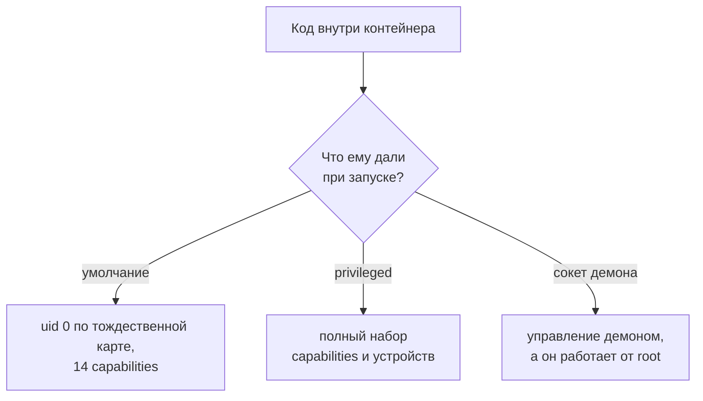

# Небезопасные практики Docker: privileged и docker.sock

Уровень **L1** · время 75 мин (теория 40 / лаба 25 / самопроверка 10,
оценка)

Что прочитать сначала: `linux-userns-cgroups`, `linux-setuid`,
`linux-file-permissions`.

Запустим самый обычный контейнер и спросим, кто в нём процесс:

```text
$ docker run --rm alpine id
uid=0(root) gid=0(root) groups=0(root),0(root),1(bin),…
$ docker run --rm alpine head -1 /proc/self/uid_map
         0          0 4294967295
```

Список групп сокращён многоточием. Процесс в контейнере — root, и карта
идентификаторов вторая строка — тождественная: внутренний uid 0 есть
внешний uid 0, root хоста. Если вы запускали контейнеры руками, эта
картина вам знакома — она везде по умолчанию.

Привычка срабатывает против нас: раз внутри «всё своё», то и root там
как будто безобиден. На деле граница контейнера держится не на uid,
а на срезах, и умолчальный запуск снимает ровно те срезы, которые не
мешают совместимости образов. Остальное — в описании запуска, которое
пишете вы.

По умолчанию — не значит безопасно. Дальше разберём три практики,
которые из «контейнера как границы» делают прямой путь на хост:
флаг --privileged, сокет демона внутри контейнера и root без
user namespace. У каждой своя цена и своя починка, но читаются они одинаково:
что снято в описании запуска. Затем — как это видно в описании запуска,
как чинится и лаба про выход через сокет.

Границы темы. Многоступенчатая сборка и состав образа — тема
`docker-multistage-builds`, секреты в слоях — `docker-secret-leaks`,
политики кластера поверх тех же запретов — подраздел 4.3.

## 0. Коротко

Контейнер — процесс хоста с подрезанными обзором и полномочиями; что
именно подрезано, решает описание запуска. Флаг --privileged снимает
почти всё: полный набор capabilities, устройства хоста, без фильтра
вызовов. Смонтированный /var/run/docker.sock даёт контейнеру управление
демоном, а демон работает от root. Root в контейнере без user namespace
— это root на хосте по карте uid. Чинится срезом: свой пользователь,
cap-drop=all с точечным добавлением, никакого сокета внутри, лимиты и
read-only. То же в терминах, которыми это обсуждают.

**Зачем это в работе AppSec-инженера.** Эти три практики — постоянные
находки ревью манифестов и compose-файлов, и у каждой есть работающее
обоснование у автора: «так надо мониторингу», «иначе не собирается».
Спор закрывается не доводом, а демонстрацией: что получает код,
оказавшийся внутри такого контейнера. Вторая причина держать тему отдельно:
половина коротких рецептов «как отладить контейнер» в интернете начинается
с privileged или сокета, и их копируют без переосмысления.

## 1. Цели

После этого раздела вы сможете:

1. Объяснить, чем privileged-контейнер равен root на хосте.
2. Показать выход через смонтированный сокет демона на стенде.
3. Прочитать набор capabilities контейнера и назвать лишние.
4. Найти в описании запуска четыре признака небезопасных практик.
5. Починить запуск контейнера и подтвердить починку ретестом.

## 2. Предвопросы

Ответьте до чтения, даже если не уверены.

1. Контейнеру примонтировали /var/run/docker.sock «только для чтения
   списка». Что ещё он получил и почему?
2. Внутри контейнера процесс работает от root. Кем оказывается он на
   хосте, если user namespace не настроен?
3. Чем флаг --cap-add SYS_ADMIN отличается от --privileged по итогу?

## 3. Механика

**Откуда это взялось.** Контейнер собран из namespaces и cgroups — тема
`linux-userns-cgroups`, — и обзор у него подрезан. Но права процесса
живут в другом месте: в карте uid и в наборе capabilities из темы
`linux-capabilities`. По умолчанию карта тождественная, а набор
умолчательный — четырнадцать capabilities. Обе настройки безопасны,
пока изоляция не снята флагом запуска. Снять её можно в разных местах:
--privileged — сразу всё, --cap-add — точечно, сокет демона — обходом
через доверенный процесс.

Тождественная карта — решение о совместимости, принятое за пользователя.
Образ, собранный под root, должен запуститься без переписывания, поэтому
умолчание — «root внутри равен root снаружи». Тема
`linux-userns-cgroups` показала, что карта бывает иной; здесь важно
помнить одно: ничего в запуске не напоминает о ней. Контейнер не спросит,
хотите ли вы тождественную карту.

Демон Docker работает от root: документация прямо требует пускать к нему
только доверенных пользователей, потому что демон умеет монтировать
любой каталог хоста в контейнер. Сокет демона внутри контейнера —
это тот же root, но через API: кто может говорить с сокетом, тот может
попросить демона запустить привилегированный контейнер. Промежуточных
степеней у этого доступа нет.

Отдельно заметьте асимметрию: сокет — обычный файл, и права на него
проверяются моделью из темы `linux-file-permissions`. Писать в него может
root и группа docker. Поэтому членство в группе docker — это тоже root
на хосте, только отложенный до первого запуска контейнера.

### Что снимает флаг privileged

Флаг меняет три вещи разом. Первое — набор capabilities: с урезанного
умолчания на полный, включая CAP_SYS_ADMIN, «новый root» из темы
`linux-capabilities`. Второе — устройства: контейнер видит все /dev
хоста, а не шесть стандартных. Третье — фильтры: профиль seccomp и
ограничения мандатного контроля не применяются. Поэтому privileged —
не «ещё один флаг», а отказ от изоляции как таковой: остаётся только
namespace-обзор, да и тот частичный.

Умолчальный набор capabilities контейнера читается из самого контейнера:

```text
$ docker run --rm alpine grep CapEff /proc/self/status
CapEff:  00000000a80425fb
```

Табуляция заменена пробелами. Развёртка через `capsh --decode` даёт
четырнадцать имён: cap_chown, cap_dac_override, cap_kill, cap_setuid,
cap_net_bind_service, cap_net_raw, cap_sys_chroot и другие. Среди них
нет CAP_SYS_ADMIN — и это ровно та строка, которая отличает обычный
запуск от --privileged.

Четырнадцать — не случайное число: это набор, подобранный под типовой
сервис. cap_net_bind_service позволяет слушать порт ниже 1024,
cap_sys_chroot — сменить корень, cap_setuid — сменить uid процесса.
Всё системное — монтирование, модули ядра, чужие процессы, настройка
сети — отрезано. Сервису, которому нужно меньше (а обычно нужно меньше),
умолчание тоже широко, и срез продолжается с cap_drop: [ALL].



**Описание схемы.** Код внутри контейнера получает полномочия из описания
запуска. По умолчанию это root по тождественной карте и урезанный набор.
Флаг privileged даёт полный набор и устройства хоста. Сокет демона даёт
API демона, работающего от root. Все три пути заканчиваются на хосте.

## 4. Эксплуатация

Стенд — локальный Docker 29.7.2 на Arch Linux, ядро 6.18, образы alpine
и python:3.12-slim. Каждый шаг повторим руками, и всё, что меняется на
хосте, — временный маркер в /tmp, который удаляется за собой. Готовый
скрипт выхода (sockescape.py) лежал бы опасно близко к боевому, поэтому
в тексте он не приводится; важна цепочка, а не копия.

Порядок шагов — от одиночного к составному. Сначала смотрим, что флаг
делает с процессом, потом — что файл-сокет делает с хостом. Обратите
внимание на форму доказательства: везде одинаковая — один и тот же
вызов до и после изменения запуска.

Шаг 1. Набор capabilities: умолчание против privileged. Команда из
блока «Механика» против той же с флагом:

```text
$ docker run --rm --privileged alpine grep CapEff /proc/self/status
CapEff:  000001ffffffffff
```

Полный набор — все сорок одна capability, включая CAP_SYS_ADMIN. Та же
маска получается точечно: `--cap-add SYS_ADMIN` добавляет ровно один
бит (проверено прогоном: a80425fb стал a82425fb). Отсюда рабочее
правило чтения масок: сама маска ничего не говорит, говорит её
развёртка в имена — capsh --decode из темы `linux-capabilities`.

Шаг 2. Что privileged снимает сверх capabilities. Два измерения из
/proc и /dev того же контейнера:

```text
$ docker run --rm alpine grep -w Seccomp /proc/self/status
Seccomp:  2
$ docker run --rm --privileged alpine grep -w Seccomp /proc/self/status
Seccomp:  0
$ docker run --rm alpine sh -c 'ls /dev | wc -l'
15
$ docker run --rm --privileged alpine sh -c 'ls /dev | wc -l'
201
```

Seccomp: 2 — фильтр вызовов действует; 0 — выключен. Устройств пятнадцать
против двухсот одного: контейнер видит все /dev хоста. Флаг оказался не
одной настройкой, а тремя.

Из этого следует приём ревью: privileged не читают как «высокие права»,
его читают как «изоляция выключена». Любая дальнейшая оценка («а что он
сможет») излишняя: сможет всё, что умеет ядро хоста.

Шаг 3. Сокет демона. Скрипт внутри контейнера стучится в сокет:

```text
$ docker run --rm -v $PWD/sockprobe.py:/probe.py:ro \
    python:3.12-slim python /probe.py
FileNotFoundError: [Errno 2] No such file or directory
$ docker run --rm -v $PWD/sockprobe.py:/probe.py:ro \
    -v /var/run/docker.sock:/var/run/docker.sock \
    python:3.12-slim python /probe.py
демон ответил списком контейнеров: 1 шт.
```

Без сокета — ошибка, с сокетом — демон отвечает. Парность темы: один и
тот же контейнер с сокетом и без даёт разный ответ на один вызов.

Заметьте, чего для этого не потребовалось: ни одного флага на контейнере,
ни root внутри, ни privileged. Контейнер умолчальный, образ невинный.
Всё решило монтирование одного файла. Поэтому находка пишется о строке
`volumes`, а не о контейнере.

Шаг 4. Выход на хост. Изнутри контейнера с сокетом просим демона
создать и запустить контейнер с bind хоста:

```text
create -> 201, id=aeffd2f18b1d
start -> 204
$ cat /tmp/s4demo/escaped.txt
uid=0(root) gid=0(root) groups=0(root),0(root),…
```

Созданный изнутри контейнер записал маркер на файловую систему хоста от
root. Это и есть выход: сокет, а не сам контейнер, открыл дверь.

Цепочка собрана из трёх шагов, и каждый шаг штатный. Контейнер с сокетом
говорит с API демона. Просьба «создай контейнер с bind корня хоста»
законна для API: никакого эксплойта нет, есть вызов. Созданный контейнер
стоит на хосте как процесс от root. Останавливает цепочку ровно одно:
канала к демону у контейнера не должно быть.

Отдельно отметьте масштаб последствия: bind в демоне не ограничен
каталогом. Та же просьба с `/:/m` монтирует корень хоста целиком, и
дальше работают обычные инструменты темы `linux-file-permissions`:
чтение чужих конфигов, запись в них, новый setuid-бинарник. Поэтому
в отчёте находка пишется как «root на хосте», а не «чтение сокета».

Соберите ответ до перехода к починке: мониторингу нужен список
контейнеров, и больше ничего. Каким должен быть канал вместо сокета,
чтобы цепочка разомкнулась?

## 5. Как выглядит в коде

Ревьюер читает описание запуска — манифест, compose-файл, строку
docker run в CI. Четыре признака — попробуйте отыскать оба из них в
этом фрагменте до выносок:

```yaml
# УЯЗВИМО — демонстрация, не для продакшена
services:
  monitor:
    image: monitor:latest
    privileged: true                        # (1)
    volumes:
      - /var/run/docker.sock:/var/run/docker.sock   # (2)
```

1. Полный набор capabilities и устройства хоста. CWE-250 (каталог
   Common Weakness Enumeration) — лишние полномочия.
2. Сокет равен управлению демоном — управлению правами (CWE-269).

Вторая пара признаков живёт в Dockerfile: отсутствие USER (процесс
останется root) и ADD по сетевому адресу вместо COPY (источник не
проверяем). Обе строки короткие, поэтому их пропускают: Dockerfile
выглядит «про слои», а права стоят в нём же. Законные пары, которые
ложной находкой не считаются: cap_add с одной узкой capability вроде
NET_BIND_SERVICE и root внутри при настроенном userns-remap — там карта
не тождественная. Отличить второе глазами по манифесту нельзя: remap —
свойство демона хоста. Проверяется оно на самом хосте тем же чтением
/proc из контейнера: карта `0 100000 65536` вместо тождественной.

Те же четыре признака в команде запуска — укажите оба сами:

```bash
# УЯЗВИМО — демонстрация, не для продакшена
docker run -d --privileged \
  -v /var/run/docker.sock:/var/run/docker.sock \
  monitor:latest
```

Инвариант дефекта — снятый срез, декорация — место записи: флаг
командной строки, поле compose, поле securityContext в манифесте
кластера. Поэтому ревью идёт не по синтаксису, а по вопросу «какие
срезы сняты у этого запуска».

Третье место — описание конвейера: строка docker run в шаге CI. Там та
же пара флагов выглядит безобиднее, потому что «это временно, для
сборки». Временный privileged в CI даёт root на раннере, а раннер —
это чей-то хост с секретами сборки. Вопрос тот же: какие срезы сняты.

**Что не спасает.** Read-only корень без снятия capabilities не мешает
процессу с CAP_SYS_ADMIN. Сокет «только для чтения» не бывает: у API
демона нет режима read-only, тот же сокет создаёт контейнеры. И смена
пользователя внутри Dockerfile не помогает против сокета: демону
всё равно, кто внутри контейнера, — он слушает root хоста.

## 6. Как чинится

Срез в том же порядке, в каком шли признаки. Каждая строка ниже отвечает
на один пункт из блока «Как выглядит в коде»:

```yaml
# Исправлено
services:
  monitor:
    image: monitor:latest
    user: "1000:1000"                       # (1)
    read_only: true                         # (2)
    cap_drop: [ALL]                         # (3)
```

1. Свой пользователь вместо root: карта тождественная, но uid 1000
   хоста.
2. Корень на чтение: запись остаётся в явно примонтированных местах.
3. Снять всё, добавить точечно — тем же словарём, что в теме
   `linux-capabilities`.

Сокет не чинится флагом: его не должно быть внутри. Контейнеру, которому
нужен список контейнеров, ставят узкий прокси перед сокетом, пропускающий
ровно чтение списка, — это лаба темы. Демону в целом есть и другой
ответ: rootless-режим, когда сам демон работает не от root
(docker-engine-security), и userns-remap, при котором карта перестаёт
быть тождественной.

Разница двух ответов по весу. userns-remap оставляет демон под root, но
подменяет карту: root контейнера становится непривилегированным uid
хоста. Rootless идёт дальше и поднимает демон под обычным
пользователем: компрометация демона тоже перестаёт давать root. Цена
rootless — побочные ограничения по сети и ресурсам; цена remap —
совместимость образов, собранных в расчёте на root. Оба решения —
свойство хоста, а не образа, поэтому они не заменяют срез в описании
запуска, а дополняют его.

Порядок применения среза тоже рабочий вопрос. Сначала снимают то, что
видно из описания: privileged и сокет. Потом набирают обратно ровно то,
без чего служба не стартует. Обратный порядок — «оставить и резать по
жалобам» — возвращает права первой же ошибкой в журнале.

**Границы применимости.** Срез ломает то, что правда нуждалось в правах.
Порт ниже 1024 требует CAP_NET_BIND_SERVICE — он добавляется точечно.
А часть системных агентов без SYS_ADMIN не живёт: для них ответ не
«вернуть права», а пересмотреть, зачем агент в контейнере. И срез не
чинит саму службу: он ограничивает цену её компрометации, а не дефект
в ней.

## 7. Как проверить фикс

**Ретест.** Тот же запуск, тот же вопрос:

```text
$ docker run --rm --cap-drop all alpine grep CapEff /proc/self/status
CapEff:  0000000000000000
$ docker run --rm -u 1000:1000 alpine id
uid=1000 gid=1000
```

Полный набор стал пустым, root стал обычным пользователем. Для сокета
ретест — повтор шага 3: без примонтированного сокета тот же скрипт
получает FileNotFoundError.

Отдельно проверяется, что срез не перепутали с перестановкой: запуск с
`--user 1000` при живом privileged — не фикс, полный набор остаётся.
Поэтому ретест спрашивает маску CapEff, а не имя пользователя: uid
виден в id, полномочия — только в /proc. Тот же принцип, что в теме
`linux-file-permissions`: проверяем наблюдаемое свойство (stat там,
маска здесь), а не намерение из описания.

**Регресс.** Лаба темы: tests.py проверяет, что мониторинг работает на
узком канале, hack.py — что создание контейнера через канал отказано.
Оба зелёные одновременно. В репозитории таким регрессом служит проверка
описания запуска в CI: запуск с privileged, сокетом или cap_add не из
белого списка роняет сборку.

**Негативные кейсы.** Служба обязана стартовать и отвечать после среза:
порт, чтение конфигурации, запись в разрешённое место. Починка вида
«запретить всё» ловится именно ими. Отдельный кейс — пользователь с
номером, которого нет в /etc/passwd образа: `user: "1000:1000"` рабочий,
но часть библиотек ждёт имя. Проверяется это прогоном службы после
правки, а не чтением Dockerfile.

## 8. Как ловится автоматикой

Половина находок видна статике. hadolint читает Dockerfile и ловит,
например, неявный тег:

```text
$ docker run --rm -i hadolint/hadolint < Dockerfile
-:1 DL3006 warning: Always tag the version of an image explicitly
```

Прогон на hadolint 2.15.1 (образ проекта). Тот же прогон на Dockerfile
с `USER guest` дал второй уровень замечаний: DL3066 напоминает, что
именной пользователь может не разрешиться на хосте. Но Dockerfile — не
место запуска: флаги privileged, сокет и cap-add живут в команде запуска
или в compose-файле, и hadolint их не видит. Там работают либо глаза по
чеклисту, либо политики admission в кластере — это темы подраздела 4.3.

**Что автоматика пропустит.** Сокет в compose, права в команде CI,
намерение: user 1000 у службы, которой нужен порт 443, — легальный срез
или ошибка, решает контекст. Замечание же по форме: DL3007 про тег
latest ловится всегда, а что у этого образа внутри, линтеру невидно —
состав образа проверяется сканером, тема `dockerfile-lint-image-scan`.

**Какой шум даст.** Легальные cap_add и осознанный latest в
экспериментальном коде. Такие места подавляются точечным комментарием с
обоснованием, а не ослаблением правила. Полный перечень правил и
разбор сканирования образов — в теме `dockerfile-lint-image-scan`.

## 9. Ловушка

Ответьте про себя до опровержения: контейнер без единого флага — уже
песочница?

Распространённое представление: контейнер сам по себе песочница, флаги
лишь уточняют удобство.

**Контейнер — набор срезов, и каждый флаг решает, остался ли срез.**
Механизм из блока «Механика»: без флагов срезов уже немного —
тождественная карта uid и четырнадцать capabilities; privileged снимает
и их. Слово «контейнер» в этом вопросе вообще ничего не означает:
значимо только описание запуска, и два контейнера одного образа могут
стоять по разные стороны границы. Заблуждение строится на слове
«песочница»: раз процесс упакован, граница стоит сама собой. На деле
граница — сумма срезов, и каждый срез кто-то должен был оставить.

Контрпример из блока «Эксплуатация»: контейнер без единого флага, но с
примонтированным сокетом, записал файл на хост от root. Песочница
кончилась на монтировании, а не на privileged. Вторая половина той же
ловушки — читать манифест по слову image: образ скромный, alpine, а срез
снят флагом рядом. Смотреть надо на запуск целиком: пользователь, набор,
точки монтирования, лимиты.

## 10. Чеклист ревью

1. Verify that ни один контейнер не запускается с privileged.
2. Verify that /var/run/docker.sock не примонтирован ни в один контейнер
   (CWE-269).
3. Verify that процесс в контейнере работает не от root либо карта uid
   не тождественная (userns-remap).
4. Verify that cap_drop: [ALL] стоит у всех, а cap_add — только под
   названный вызов (CWE-250).
5. Verify that корневая файловая система контейнера read-only, а запись
   идёт в явные точки монтирования.
6. Verify that заданы лимиты памяти и процессора — тема
   `linux-userns-cgroups`.
7. Verify that в Dockerfile явный USER и нет ADD по сетевому адресу.
8. Verify that группа docker на хосте не раздаётся «для удобства»:
   членство в ней равно отложенному root.

## 11. Лаба

**Цель одной фразой:** добиться, чтобы
`pilot/lab/docker-insecure-practices/hack.py` вышел с кодом 0,
а `tests.py` продолжил выходить с кодом 0.

Лаба повторяет шаг 4 из блока «Эксплуатация» руками: контейнеру
мониторинга нужен список контейнеров, а канал у него полный. Вопрос
один: что ещё умеет этот канал.

Формат — Secure Code Game: чинится `code.py`, эксплойт и функциональные
тесты рядом. Демон, сокет и контейнер изображены моделью на структурах
данных: настоящий Docker не нужен; реальный прогон выхода — в блоке
«Эксплуатация». Модель повторяет ровно цепочку шага 4: канал контейнера,
запрос на создание, ответ демона. Нужен Python 3.6 или новее. Секции
«Запуск», «Сброс» и «Удаление» — в `README.md` каталога.

Подсказка даётся одна: мониторингу нужен один вызов одной точки API.
Дайте контейнеру канал, который умеет ровно его и отвечает отказом на
всё остальное. Демон при этом остаётся общим: администратор хоста ходит
в него напрямую, а лишний вызов через канал должен кончиться отказом.

**Отдельная задача «почини».** Мониторинг обязан работать после правки:
отчёт видит контейнеры хоста, включая созданные напрямую через демон.
Наблюдаемый критерий: `tests.py` печатает «Упало проверок: 0»,
а `hack.py` — «ЭКСПЛОЙТ НЕ СРАБОТАЛ».

Решение — `solution.py` в том же каталоге, открыто без условий.

## 12. Проверь себя

1. Чем privileged-контейнер отличается от умолчального по набору
   capabilities?
2. Почему сокет демона равен root на хосте, хотя контейнер без
   флагов?
3. Что показывает тождественная карта uid_map и чем она опасна?
4. Почему cap_add с одним именем — не находка, а --privileged —
   находка?
5. Возврат к теме `linux-userns-cgroups`: карта uid_map `0 1000 1` —
   кем оказывается root контейнера снаружи?
6. Возврат к теме `linux-setuid`: чем демон, слушающий сокет, похож
   на setuid-обёртку и чем отличается?

<details markdown="1">
<summary>Ответы</summary>

1. У умолчального четырнадцать урезанных capabilities, у privileged —
   все сорок одна плюс устройства хоста и без фильтра вызовов.
2. Демон работает от root и умеет монтировать любой каталог хоста в
   контейнер. Говорящий с сокетом просит демона — и получает хост без
   единого флага на своём контейнере.
3. Внутренний uid 0 есть внешний uid 0: root в контейнере — root на
   хосте. Опасна любая ошибка изоляции: обзор снят, а права те же. При
   remap карта начиналась бы с внешнего непривилегированного номера,
   и удар по изоляции не дошёл бы до хоста.
4. cap_add добавляет названный бит под названный вызов, его можно
   обосновать. privileged снимает всё разом, обосновывать нечего.
5. Внешним uid 1000 — обычным пользователем хоста: карта отображает
   внутренний ноль ровно на один внешний непривилегированный номер.
6. Похож: оба принимают просьбы непривилегированного и исполняют с
   чужими правами. Отличие: обёртка — программа с битом на файле,
   демон — постоянный процесс с API, и «аргументы» ему приходят по
   сокету. Второе отличие важнее: обёртка решает одну задачу, демон —
   любую, какую попросят, поэтому цена его компрометации всегда
   полная.

</details>

## 13. Источники

1. Docker Engine security, Docker, Inc.; реестр `docker-engine-security`.
   Разделы: Docker daemon attack surface, Linux kernel capabilities,
   Rootless mode.
   <https://docs.docker.com/engine/security/>
2. OWASP Docker Security Cheat Sheet; реестр `owasp-cs-docker`. Разделы:
   список практик — privileged, сокет, root, capabilities, лимиты.
   <https://cheatsheetseries.owasp.org/cheatsheets/Docker_Security_Cheat_Sheet.html>
3. capabilities(7) «overview of Linux capabilities», Linux man-pages
   6.18; реестр `man-capabilities`. Разделы: наборы процесса, список
   capabilities.
   <https://man7.org/linux/man-pages/man7/capabilities.7.html>

Каркас этапа: записи семейства man-* (Linux man-pages project, выпуск
6.18) и якоря подраздела 4.2 (docker-engine-security, owasp-cs-docker) —
наследуются всеми темами подраздела.

**Скоропортящийся слой.** Версии Docker, hadolint и образов названы в
маркерах; умолчальный набор capabilities Docker менялся исторически и
проверяется при ревизии прогоном. Механизм (карта uid, наборы, сокет)
стабилен.

**Маркеры уверенности.** **Проверено лично** 2026-09-01 на Arch Linux,
ядро 6.18.48-1-lts, Docker 29.7.2, образы alpine и python:3.12-slim:
root и тождественная карта в умолчальном контейнере, умолчальный набор
a80425fb против полного 000001ffffffffff под privileged, добавление
бита SYS_ADMIN (a82425fb), ответ демона контейнеру без сокета и с ним,
создание контейнера изнутри через API (201/204) и маркер на хосте от
root. Лаба прогнана на обеих целях: `hack.py` даёт код 1 на code.py и
0 на solution.py, `tests.py` зелёный в обоих случаях. hadolint 2.15.1
прогнан на своём образе: DL3006 на неявном теге. Разбор privileged у
OWASP и требование о доверенных пользователях демона — **по
документации** (обе страницы открыты лично 2026-09-01). Rootless-режим
и userns-remap **не прогонялись**: перенастройка демона вне границ
миссии.
