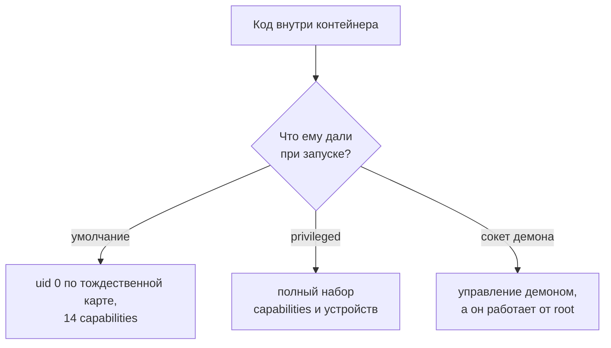

# Небезопасные практики Docker: privileged и docker.sock

Утро начинается с ревью. Перед вами compose-файл — описание, по которому
Docker поднимает сервисы проекта. Между строк про образ и порты стоят две
пометки: `privileged: true` и файл `/var/run/docker.sock`, примонтированный
внутрь контейнера. На вопрос «зачем» автор отвечает коротко: так просит
мониторинг, иначе не собирается. Звучит правдоподобно, и именно такие строки
годами копируют из инструкций по отладке. Дальше мы проверим руками, что
получает код, запущенный с каждой из трёх типовых пометок: флагом
`--privileged`, сокетом демона внутри и пользователем root по умолчанию.
А чинится всё одним приёмом — срезом: убрать лишнее из описания запуска
и вернуть ровно нужное.

## Что такое контейнер и демон Docker

Docker — программа, которая запускает процессы в изоляции друг от друга.
Работает она с двумя сущностями: образом и контейнером. Образ — неизменяемый
пакет с файлами программы: кодом, библиотеками, утилитами. Контейнер —
процесс, запущенный из образа. Соответствие бытовое: установочный диск
и работающая система. С одного диска систему можно запустить много раз,
и каждый запуск живёт своей жизнью. Так и с одного образа поднимают сколько
угодно контейнеров, и каждый думает, что он один на компьютере.

Изнутри контейнер устроен без магии: это обычный процесс Linux, которому
подрезали обзор и аппетит. Обзор режут namespaces: процесс видит свои
процессы, свою сеть и свою файловую систему. Аппетит режут cgroups: процессу
отмеряют процессор и память. Оба механизма разобраны в теме
`linux-userns-cgroups`, и повторять их здесь мы не будем. Docker — обёртка
над ними: по описанию запуска он собирает namespaces, карту идентификаторов,
набор полномочий и список монтирований. Именно это описание решает, на что
способен код внутри.

Сам Docker устроен из двух половин. Команда `docker`, которую вы набираете
в терминале, — тонкий клиент: она передаёт просьбу и печатает ответ. Работу
делает демон — постоянный процесс, запущенный от root: он скачивает образы,
создаёт контейнеры, монтирует каталоги. Клиент и демон разговаривают через
файл-сокет `/var/run/docker.sock`, точку приёма просьб. Соответствие
бытовое: демон — управляющий домом с ключами от всех квартир, а сокет —
окошко, куда жильцы подают заявки. Аналогия ломается на отказе: управляющий
вправе ответить «нет», а демон исполняет любую допустимую просьбу, кто бы
её ни подал.

Когда сервисов несколько, их запуск описывают одним compose-файлом, обычно
`docker-compose.yml`. Это декларативное описание: какие образы поднять,
какие порты открыть, какие флаги поставить. Одна заявка на всю бригаду
вместо звонка каждому рабочему. Отдельная строка в нём — монтирование:
каталог или файл хоста делают видимым внутри контейнера, и записывается
оно парой «путь на хосте, двоеточие, путь в контейнере». Для процесса внутри
смонтированный каталог — продолжение его собственной файловой системы,
как дверь из квартиры прямо в подвал дома.

**Зачем это в работе AppSec-инженера.** Три практики из этой темы —
постоянные находки ревью compose-файлов и манифестов, то есть такого же
описания запуска, но уже для кластера. У каждой находки есть рабочее
обоснование у автора: «так надо мониторингу», «иначе не собирается». Спор
закрывается не доводом, а демонстрацией того, что получает код, оказавшийся
внутри такого контейнера. Вторая причина держать тему
отдельно: половина коротких рецептов отладки контейнера в интернете
начинается с privileged или сокета, и их копируют без переосмысления.

Начнём с наблюдения, на котором всё стоит. Запустим самый обычный контейнер
и спросим, кто в нём процесс:

```text
$ docker run --rm alpine id
uid=0(root) gid=0(root) groups=0(root),0(root),1(bin),…
$ docker run --rm alpine head -1 /proc/self/uid_map
         0          0 4294967295
```

Список групп сокращён многоточием. Процесс в контейнере — root, и карта
идентификаторов во второй строке тождественная: внутренний uid 0 есть
внешний uid 0, root хоста. Как читается такая карта, разбирала тема
`linux-userns-cgroups`; здесь важен сам факт: умолчание ничего не спрашивает
и не подчёркивает. Привычка срабатывает против нас: раз внутри «всё своё»,
то и root там как будто безобиден. Границы темы: состав образа — в
`docker-multistage-builds`, секреты в слоях — в `docker-secret-leaks`,
политики кластера — в подразделе 4.3.

## Подумай, прежде чем читать

1. Контейнеру примонтировали /var/run/docker.sock «только для чтения
   списка». Что ещё он получил и почему?
2. Внутри контейнера процесс работает от root. Кем оказывается он на
   хосте, если user namespace не настроен?
3. Чем флаг --cap-add SYS_ADMIN отличается от --privileged по итогу?

## Как это работает

Capability — один кусочек полномочий root, выданный отдельно от остальных.
Ядро делит всесилие root на сорок с небольшим независимых проверок,
и процессу можно оставить только нужные. Например, cap_net_bind_service
разрешает слушать порт ниже 1024 и ничего больше. Бытовое соответствие —
вместо мастер-ключа от всего здания связка ключей от отдельных комнат.
Подробный разбор — в теме `linux-capabilities`; здесь нужно одно.
Умолчальный набор контейнера — четырнадцать штук, урезанный рабочий набор
типового сервиса.

**Откуда это взялось.** Docker делали упаковкой и запуском чужих образов,
и умолчания подобраны под совместимость: образ, собранный под root, обязан
запуститься без переписывания. Отсюда тождественная карта из наблюдения
выше: «root внутри равен root снаружи». Тема `linux-userns-cgroups`
показала, что карта бывает иной, — но ничто в запуске о ней не спрашивает.
Права же процесса живут в двух местах: в карте uid и в наборе capabilities.
Снять изоляцию можно в разных точках: `--privileged` снимает сразу всё,
`--cap-add` — точечно, по одному capability за раз, сокет демона — обходом
через доверенный процесс.

Умолчание читается из самого контейнера:

```text
$ docker run --rm alpine grep CapEff /proc/self/status
CapEff:  00000000a80425fb
```

Табуляция заменена пробелами. Развёртка через `capsh --decode` даёт
четырнадцать имён: cap_chown, cap_dac_override, cap_kill, cap_setuid,
cap_net_bind_service, cap_net_raw, cap_sys_chroot и другие. Среди них нет
CAP_SYS_ADMIN — самого широкого полномочия, «нового root» из темы
`linux-capabilities`. Именно эта строка отличает обычный запуск от
`--privileged`.

Четырнадцать — не случайное число: это набор, подобранный под типовой
сервис. cap_net_bind_service позволяет слушать порт ниже 1024,
cap_sys_chroot — сменить корень, cap_setuid — сменить uid процесса.
Всё системное отрезано: монтирование, модули ядра, чужие процессы,
настройка сети. Сервису, которому нужно меньше, а обычно нужно меньше,
умолчание тоже широко, и срез продолжается с `cap_drop: [ALL]`.

После карты uid и набора capabilities третий срез — фильтр системных
вызовов seccomp. Системный вызов — это просьба процесса к ядру: открыть
файл, создать сокет, смонтировать каталог. Фильтр держит список разрешённых
просьб и рубит остальные ещё в ядре. Бытовое соответствие — пропуск
с помеченными этажами: в здание посетителя пускают, но лифт открывает
только разрешённые двери. У обычного контейнера фильтр действует, а у
привилегированного выключен, и ниже это видно вживую. Вместе с фильтром
флаг снимает и мандатный контроль: политики AppArmor и SELinux из темы
`linux-mandatory-access` к такому контейнеру не применяются.

Демон Docker работает от root, и документация прямо требует пускать к нему
только доверенных пользователей: демон умеет монтировать любой каталог хоста
в контейнер. Сокет демона внутри контейнера — тот же root, но через API:
кто может говорить с сокетом, тот может попросить демона запустить
привилегированный контейнер. Промежуточных степеней у этого доступа нет.

Отдельно заметьте асимметрию: сокет — обычный файл, и права на него
проверяются моделью из темы `linux-file-permissions`. Писать в него могут
root и группа docker. Поэтому членство в группе docker — тоже root на хосте,
только отложенный до первого запуска контейнера.


```mermaid
flowchart TB
    A[Код внутри контейнера] --> B{Что ему дали<br/>при запуске?}
    B -- умолчание --> C[uid 0 по тождественной карте,<br/>14 capabilities]
    B -- privileged --> D[полный набор<br/>capabilities и устройств]
    B -- сокет демона --> E[управление демоном,<br/>а он работает от root]
```

**Описание схемы.** Схема читается сверху вниз. Код внутри контейнера
получает полномочия из описания запуска. По умолчанию это root по
тождественной карте и урезанный набор. Флаг privileged даёт полный набор
и устройства хоста. Сокет демона даёт API демона, работающего от root.
Все три пути заканчиваются на хосте.

## Как это атакуют

Стенд — локальный Docker 29.8.1 на Arch Linux, ядро 6.18, образы alpine
и python:3.12-slim. Каждый шаг повторим руками, и всё, что меняется на
хосте, — временный маркер в /tmp, который удаляется за собой. Готовый
скрипт выхода опасно близок к боевому, поэтому в тексте его нет: важна
цепочка, а не копия.

Порядок шагов — от одиночного к составному. Сначала смотрим, что флаг
делает с процессом, потом — что файл-сокет делает с хостом. Обратите
внимание на форму доказательства: везде один и тот же вызов до и после
изменения запуска.

Шаг 1. Набор capabilities: умолчание против privileged. Команда из блока
«Как это работает» против той же с флагом:

```text
$ docker run --rm --privileged alpine grep CapEff /proc/self/status
CapEff:  000001ffffffffff
```

Полный набор — все сорок одна capability, включая CAP_SYS_ADMIN. Та же
маска получается точечно: `--cap-add SYS_ADMIN` добавляет ровно один бит,
и проверено прогоном — a80425fb стал a82425fb. Отсюда рабочее правило
чтения масок: сама маска ничего не говорит, говорит её развёртка в имена
через `capsh --decode` из темы `linux-capabilities`.

Шаг 2. Что privileged снимает сверх capabilities. Два измерения из /proc
и /dev того же контейнера:

```text
$ docker run --rm alpine grep -w Seccomp /proc/self/status
Seccomp:  2
$ docker run --rm --privileged alpine grep -w Seccomp /proc/self/status
Seccomp:  0
$ docker run --rm alpine sh -c 'ls /dev | wc -l'
15
$ docker run --rm --privileged alpine sh -c 'ls /dev | wc -l'
221
```

Seccomp: 2 — фильтр вызовов действует, 0 — выключен. Устройств пятнадцать
против двухсот двадцати одного: контейнер видит все /dev хоста. Число
зависит от хоста, но соотношение одно: единицы против сотен. Флаг оказался
не одной настройкой, а тремя.

Из этого следует приём ревью: privileged не читают как «высокие права»,
его читают как «изоляция выключена». Любая дальнейшая оценка «а что он
сможет» излишняя: сможет всё, что умеет ядро хоста.

Шаг 3. Сокет демона. Скрипт внутри контейнера стучится в сокет, и разница
видна на одном вызове:

```text
$ docker run --rm -v $PWD/sockprobe.py:/probe.py:ro \
    python:3.12-slim python /probe.py
FileNotFoundError: [Errno 2] No such file or directory
$ docker run --rm -v $PWD/sockprobe.py:/probe.py:ro \
    -v /var/run/docker.sock:/var/run/docker.sock \
    python:3.12-slim python /probe.py
демон ответил списком контейнеров: 1 шт.
```

Без сокета — ошибка, с сокетом — демон отвечает. Это парность темы: один
и тот же контейнер с сокетом и без даёт разный ответ на один вызов.

Заметьте, чего для этого не потребовалось: ни одного флага на контейнере,
ни root внутри, ни privileged. Контейнер умолчальный, образ невинный.
Всё решило монтирование одного файла, поэтому находка пишется о строке
`volumes`, а не о контейнере.

Шаг 4. Выход на хост. Изнутри контейнера с сокетом просим демона создать
и запустить контейнер с bind-монтированием — той самой парой „путь на хосте:
путь в контейнере" из описания запуска:

```text
create -> 201, id=7e59ef7418e2
start -> 204
$ cat /tmp/s4demo/escaped.txt
uid=0(root) gid=0(root) groups=0(root),0(root),…
```

Созданный изнутри контейнер записал маркер на файловую систему хоста от
root. Это и есть выход: дверь открыл сокет, а не сам контейнер.

Цепочка собрана из трёх шагов, и каждый шаг штатный. Контейнер с сокетом
говорит с API демона. Просьба «создай контейнер с bind корня хоста» законна
для API: никакого эксплойта нет, есть вызов. Созданный контейнер стоит на
хосте как процесс от root. Останавливает цепочку ровно одно: канала к
демону у контейнера быть не должно.

Отдельно — масштаб последствия: bind в демоне не ограничен каталогом. Та же
просьба с `/:/m` монтирует корень хоста целиком, и дальше работают обычные
инструменты темы `linux-file-permissions`: чтение чужих конфигов, запись
в них, новый setuid-бинарник. Поэтому в отчёте находка пишется как «root
на хосте», а не «чтение сокета».

Соберите ответ до перехода к починке: мониторингу нужен список контейнеров,
и больше ничего. Каким должен быть канал вместо сокета, чтобы цепочка
разомкнулась?

## Как это выглядит в коде

Ревьюер читает описание запуска: манифест, compose-файл, строку docker run
в CI. Признаков четыре, и два из них — в этом фрагменте; попробуйте
отыскать оба до выносок:

```yaml
# УЯЗВИМО — демонстрация, не для продакшена
services:
  monitor:
    image: monitor:latest
    privileged: true                        # (1)
    volumes:
      - /var/run/docker.sock:/var/run/docker.sock   # (2)
```

1. Полный набор capabilities и устройства хоста. CWE-250 (каталог типовых
   слабостей Common Weakness Enumeration) — лишние полномочия.
2. Сокет равен управлению демоном, то есть управлению правами (CWE-269).

Вторая пара признаков живёт в Dockerfile — файле-рецепте, по которому
собирается образ. Каждая инструкция рецепта добавляет к образу один слой,
то есть пласт файлов поверх предыдущих; из таких слоёв образ и складывается.
Признаки здесь — две инструкции про права. Первая — отсутствие USER: эта
инструкция задаёт пользователя процесса, и без неё процесс останется root.
Вторая — ADD по сетевому адресу вместо COPY: ADD умеет скачивать файл по
адресу и не проверяет источник, а COPY берёт только локальные файлы сборки.

Обе строки короткие, поэтому их пропускают: Dockerfile выглядит
«про слои», а права стоят в нём же. Законные пары, которые ложной находкой
не считаются: cap_add с одной узкой capability вроде NET_BIND_SERVICE
и root внутри при настроенном userns-remap. Второе глазами по манифесту
не отличить: remap — свойство демона хоста. Проверяется оно на самом хосте
тем же чтением /proc из контейнера: карта `0 100000 65536` вместо
тождественной.

Те же признаки в команде запуска — укажите оба сами:

```bash
# УЯЗВИМО — демонстрация, не для продакшена
docker run -d --privileged \
  -v /var/run/docker.sock:/var/run/docker.sock \
  monitor:latest
```

Инвариант дефекта — снятый срез, декорация — место записи: флаг командной
строки, поле compose, поле securityContext в манифесте кластера. Поэтому
ревью идёт не по синтаксису, а по вопросу «какие срезы сняты у этого
запуска».

Третье место — описание конвейера: строка docker run в шаге CI. Там та же
пара флагов выглядит безобиднее, потому что «это временно, для сборки».
Временный privileged в CI даёт root на раннере, а раннер — чужой хост
с секретами сборки. Вопрос тот же: какие срезы сняты.

**Что не спасает.** Read-only корень без снятия capabilities не мешает
процессу с CAP_SYS_ADMIN. Сокета «только для чтения» не бывает: у API
демона нет режима read-only, и тот же сокет создаёт контейнеры. Смена
пользователя внутри Dockerfile не помогает против сокета: демону всё равно,
кто внутри контейнера, он слушает от root хоста.

## Как защититься

Защита — тот же срез в том же порядке, в каком шли признаки. Каждая строка
исправленного описания отвечает на один пункт блока выше:

```yaml
# Исправлено
services:
  monitor:
    image: monitor:latest
    user: "1000:1000"                       # (1)
    read_only: true                         # (2)
    cap_drop: [ALL]                         # (3)
```

1. Свой пользователь вместо root: карта тождественная, но uid 1000 хоста.
2. Корень на чтение: запись остаётся в явно примонтированных местах.
3. Снять всё и добавить точечно — тем же словарём, что в теме
   `linux-capabilities`.

Сокет не чинится флагом: его не должно быть внутри. Контейнеру, которому
нужен список контейнеров, ставят узкий прокси перед сокетом — посредника,
пропускающего ровно чтение списка и отвечающего отказом на всё остальное.
Это лаба темы.

Демону в целом есть два ответа потяжелее, и оба — свойство хоста. Первый —
userns-remap: демон остаётся под root, но карта uid подменяется, и root
контейнера становится непривилегированным uid хоста. Второй — rootless-
режим: сам демон поднимается под обычным пользователем, и компрометация
демона тоже перестаёт давать root. Цена rootless — ограничения по сети
и ресурсам, цена remap — совместимость образов, собранных в расчёте на
root. Оба решения дополняют срез в описании запуска, а не заменяют его.

Порядок применения среза — тоже рабочий вопрос. Сначала снимают то, что
видно из описания: privileged и сокет. Потом набирают обратно ровно то,
без чего служба не стартует. Обратный порядок, «оставить и резать по
жалобам», возвращает права первой же ошибкой в журнале.

**Границы применимости.** Срез ломает то, что правда нуждалось в правах.
Порт ниже 1024 требует CAP_NET_BIND_SERVICE, и он добавляется точечно.
Часть системных агентов без SYS_ADMIN не живёт: для них ответ не «вернуть
права», а пересмотреть, зачем агент в контейнере. И срез не чинит саму
службу: он ограничивает цену её компрометации, а не дефект в ней.

## Как убедиться, что защита работает

Починку проверяют тем же способом, каким показывали дефект: тем же запуском
и тем же вопросом.

```text
$ docker run --rm --cap-drop all alpine grep CapEff /proc/self/status
CapEff:  0000000000000000
$ docker run --rm -u 1000:1000 alpine id
uid=1000 gid=1000 groups=1000
```

Полный набор стал пустым, root стал обычным пользователем. Для сокета
ретест — повтор шага 3: без примонтированного сокета тот же скрипт получает
FileNotFoundError.

Отдельно проверяется, что срез не перепутали с перестановкой: запуск с
`--user 1000` при живом privileged — не фикс, полный набор остаётся.
Поэтому ретест спрашивает маску CapEff, а не имя пользователя: uid виден
в id, полномочия — только в /proc. Принцип тот же, что в теме
`linux-file-permissions`: проверяем наблюдаемое свойство — там stat, здесь
маска, — а не намерение из описания.

**Регресс.** Лаба темы: tests.py проверяет, что мониторинг работает на
узком канале, hack.py — что создание контейнера через канал отказано,
и оба зелёные одновременно. В репозитории таким регрессом служит проверка
описания запуска в CI: запуск с privileged, сокетом или cap_add не из
белого списка роняет сборку.

**Негативные кейсы.** Служба обязана стартовать и отвечать после среза:
порт, чтение конфигурации, запись в разрешённое место. Починка вида
«запретить всё» ловится именно ими. Отдельный кейс — пользователь
с номером, которого нет в /etc/passwd образа: `user: "1000:1000"` рабочий,
но часть библиотек ждёт имя. Проверяется это прогоном службы после правки,
а не чтением Dockerfile.

На ревью пройдите по списку.

1. Проверьте, что ни один контейнер не запускается с privileged.
2. Проверьте, что /var/run/docker.sock не примонтирован ни в один контейнер
   (CWE-269).
3. Проверьте, что процесс в контейнере работает не от root либо карта uid
   не тождественная (userns-remap).
4. Проверьте, что cap_drop: [ALL] стоит у всех, а cap_add — только под
   названный вызов (CWE-250).
5. Проверьте, что корневая файловая система контейнера read-only, а запись
   идёт в явные точки монтирования.
6. Проверьте, что заданы лимиты памяти и процессора — тема
   `linux-userns-cgroups`.
7. Проверьте, что в Dockerfile явный USER и нет ADD по сетевому адресу.
8. Проверьте, что группа docker на хосте не раздаётся «для удобства»:
   членство в ней равно отложенному root.

## Как это находят инструменты

Половина находок видна статике. Для Dockerfile есть hadolint — линтер,
программа, которая читает текст Dockerfile и ругается на типовые ошибки,
ничего не собирая и не запуская. Такой инструмент дёшев: его ставят шагом
в конвейер, и он роняет сборку на каждой замеченной строке.

```text
$ docker run --rm -i hadolint/hadolint < Dockerfile
-:1 DL3006 warning: Always tag the version of an image explicitly
```

Прогон на hadolint 2.15.1, образ проекта: правило DL3006 требует явный тег
версии у базового образа. Тот же прогон на Dockerfile с `USER guest` дал
второй уровень замечаний: DL3066 напоминает, что именной пользователь может
не разрешиться на хосте. Но Dockerfile — не место запуска: флаги
privileged, сокет и cap-add живут в команде запуска или compose-файле,
и hadolint их не видит. Там работают либо глаза по чеклисту, либо политики
admission в кластере — темы подраздела 4.3.

**Что автоматика пропустит.** Сокет в compose, права в команде CI,
намерение: user 1000 у службы, которой нужен порт 443, — легальный срез или
ошибка, решает контекст. Замечание же по форме: DL3007 про тег latest
ловится всегда, а что у этого образа внутри, линтеру невидно. Состав образа
проверяется сканером — тема `dockerfile-lint-image-scan`.

**Какой шум даст.** Легальные cap_add и осознанный latest в
экспериментальном коде. Такие места подавляются точечным комментарием
с обоснованием, а не ослаблением правила. Полный перечень правил и разбор
сканирования образов — в теме `dockerfile-lint-image-scan`.

## Частая ошибка

Ответьте про себя до опровержения: контейнер без единого флага — уже
песочница?

**Контейнер — набор срезов, и каждый флаг решает, остался ли срез.** Без
флагов срезов уже немного: тождественная карта uid и четырнадцать
capabilities, а privileged снимает и их. Слово «контейнер» в этом вопросе
ничего не означает: значимо только описание запуска, и два контейнера
одного образа могут стоять по разные стороны границы. Заблуждение строится
на слове «песочница»: раз процесс упакован, граница вроде бы стоит сама
собой. На деле граница — сумма срезов, и каждый срез кто-то должен был
оставить.

Контрпример из блока про атаку: контейнер без единого флага, но с
примонтированным сокетом, записал файл на хост от root. Песочница кончилась
на монтировании, а не на privileged. Вторая половина той же ловушки —
читать манифест по слову image: образ скромный, alpine, а срез снят флагом
рядом. Смотреть надо на запуск целиком: пользователь, набор, точки
монтирования, лимиты.

## Попробуй сам

`lab-docker-insecure-practices`, каталог `pilot/lab/docker-insecure-practices`.
Формат Secure Code Game: чинится `code.py`, эксплойт и функциональные тесты
лежат рядом.

**Цель одной фразой:** добиться, чтобы `hack.py` вышел с кодом 0,
а `tests.py` продолжил выходить с кодом 0.

Лаба повторяет шаг 4 руками: контейнеру мониторинга нужен список
контейнеров, а канал у него полный. Вопрос один: что ещё умеет этот канал.
Демон, сокет и контейнер изображены моделью на структурах данных, и настоящий
Docker не нужен: реальный прогон выхода был выше. Нужен Python 3.6 или
новее; секции «Запуск», «Сброс» и «Удаление» — в `README.md` каталога.

Подсказка одна: мониторингу нужен один вызов одной точки API. Дайте
контейнеру канал, который умеет ровно его и отвечает отказом на всё
остальное. Демон при этом остаётся общим: администратор хоста ходит в него
напрямую, а лишний вызов через канал должен кончиться отказом.

**Отдельная задача «почини».** Мониторинг обязан работать после правки:
отчёт видит контейнеры хоста, включая созданные напрямую через демон.
Наблюдаемый критерий: `tests.py` печатает «Упало проверок: 0», а `hack.py`
— «ЭКСПЛОЙТ НЕ СРАБОТАЛ». Решение — `solution.py` в том же каталоге,
открыто без условий.

## Проверь себя

1. Предскажите по маске, чего в наборе нет, и проверьте развёрткой:

   ```text
   $ docker run --rm alpine grep CapEff /proc/self/status
   CapEff:  00000000a80425fb
   ```

   Есть ли в этом наборе CAP_SYS_ADMIN и сколько имён в нём всего?

2. Найдите оба признака в этом описании запуска и решите, спасает ли
   пометка `:ro` на монтировании.

   ```yaml
   # УЯЗВИМО — демонстрация, не для продакшена
   services:
     backup:
       image: backup:1.4
       user: "0:0"
       volumes:
         - /var/run/docker.sock:/var/run/docker.sock:ro
   ```

3. Контейнеру мониторинга нужен список контейнеров, и ему примонтирован
   сокет демона. Выберите починку:

   A. Оставить сокет, но примонтировать его с пометкой `:ro` — только чтение.

   B. Поставить перед сокетом узкий прокси, пропускающий ровно чтение списка.

   C. Оставить сокет, но перевести процесс контейнера на `user: "1000:1000"`.

4. Почему `--privileged` в ревью читают как «изоляция выключена», а не как
   «высокие права»?
5. Возврат к теме `linux-setuid`: чем демон, слушающий сокет, похож на
   setuid-обёртку и чем отличается?
6. Возврат к теме `ci-secrets`: строка `docker run --privileged` в шаге
   конвейера называется «временно, для сборки». Что получает тот, кто через
   неё вышел на раннер?

<details markdown="1">
<summary>Ответ 1</summary>

1. CAP_SYS_ADMIN в наборе нет, имён четырнадцать. Маска сама ничего не
   говорит — говорит её развёртка: `capsh --decode=00000000a80425fb`
   печатает список от cap_chown до cap_setfcap, и cap_sys_admin в нём
   отсутствует. Ровно эта строка отличает умолчальный запуск от
   `--privileged`, у которого набор полный.

</details>

<details markdown="1">
<summary>Ответ 2</summary>

2. Признака два: процесс останется root (`user: "0:0"`) при, судя по
   запуску, тождественной карте — то есть root хоста; и сокет демона
   внутри контейнера. Пометка `:ro` не спасает: у API демона нет режима
   read-only, и через «читаемый» сокет тот же вызов создаёт новый
   контейнер с bind корня хоста. Находка пишется о строке `volumes`, а
   не о контейнере.

</details>

<details markdown="1">
<summary>Ответ 3: разбор вариантов</summary>

3. Верный ответ — B.

   A. У API демона нет чтения без записи: тот же сокет, открытый «на
      чтение», принимает вызов на создание контейнера. Пометка меняет
      права на файл, а не возможности API за ним.

   B. Канал сужается до одного нужного вызова: прокси пропускает чтение
      списка и отвечает отказом на всё остальное. Цепочка «сокет →
      создание контейнера → bind хоста» разомкнута, демон для
      администратора остаётся общим.

   C. Демону всё равно, кто внутри контейнера: слушает сокет процесс
      root хоста, и смена uid внутри на его права не влияет. Срез снят
      монтированием, а не пользователем.

</details>

<details markdown="1">
<summary>Ответ 4</summary>

4. Флаг снимает три вещи разом: набор capabilities становится полным,
   контейнер видит все устройства хоста, фильтры вызовов и мандатного
   контроля выключаются. «Высокие права» предполагают градацию и вопрос «что он
   сможет». Здесь ответ известен заранее: всё, что умеет ядро хоста.
   Дальнейшая оценка излишняя, и флаг читается как отказ от изоляции.

</details>

<details markdown="1">
<summary>Ответ 5</summary>

5. Похож: оба принимают просьбы непривилегированного и исполняют их с
   чужими правами. Отличий два: обёртка — программа с битом на файле,
   демон — постоянный процесс с API, и «аргументы» ему приходят по
   сокету. Второе: обёртка решает одну задачу, а демон — любую, какую
   попросят, поэтому цена его компрометации всегда полная.

</details>

<details markdown="1">
<summary>Ответ 6</summary>

6. Root на раннере — а раннер это хост конвейера с секретами сборки:
   токенами репозитория, ключами подписи, переменными окружения шагов.
   «Временно» меняет длительность окна, но не его ширину: за время шага
   через privileged доходят до всего, что конвейер считал своим.

</details>

## Источники

1. Docker Engine security, Docker, Inc.; реестр `docker-engine-security`.
   Разделы: Docker daemon attack surface, Linux kernel capabilities,
   Rootless mode.
   <https://docs.docker.com/engine/security/>
2. OWASP Docker Security Cheat Sheet; реестр `owasp-cs-docker`. Разделы:
   список практик — privileged, сокет, root, capabilities, лимиты.
   <https://cheatsheetseries.owasp.org/cheatsheets/Docker_Security_Cheat_Sheet.html>
3. capabilities(7) «overview of Linux capabilities», Linux man-pages
   6.18; реестр `man-capabilities`. Разделы: наборы процесса, список
   capabilities.
   <https://man7.org/linux/man-pages/man7/capabilities.7.html>

Каркас этапа: записи семейства man-* (Linux man-pages project, выпуск
6.18) и якоря подраздела 4.2 (docker-engine-security, owasp-cs-docker) —
наследуются всеми темами подраздела.

**Скоропортящийся слой.** Версии Docker, hadolint и образов названы в
маркерах; умолчальный набор capabilities Docker менялся исторически и
проверяется при ревизии прогоном. Число устройств в /dev под privileged
зависит от хоста и версии. Механизм (карта uid, наборы, сокет) стабилен.

**Маркеры уверенности.** **Проверено лично** 2026-09-01 на Arch Linux,
ядро 6.18.48-1-lts, Docker 29.7.2 и перепроверено 2026-10-03 на ядре
6.18.54-1-lts, Docker 29.8.1, образы alpine и python:3.12-slim: root
и тождественная карта в умолчальном контейнере, умолчальный набор
a80425fb против полного 000001ffffffffff под privileged, добавление бита
SYS_ADMIN (a82425fb), ответ демона контейнеру без сокета и с ним, создание
контейнера изнутри через API (201/204) и маркер на хосте от root. Число
устройств /dev под privileged при перепроверке — 221 вместо 201: счёт идёт
по устройствам хоста. Лаба прогнана заново на Python 3.14.7: `hack.py`
даёт код 1 на code.py и 0 на solution.py, `tests.py` зелёный в обоих
случаях. hadolint 2.15.1 прогнан на своём образе: DL3006 на неявном теге,
DL3066 на именном пользователе. Разбор privileged у OWASP и требование
о доверенных пользователях демона — **по документации** (обе страницы
открыты лично 2026-09-01). Rootless-режим и userns-remap **не
прогонялись**: перенастройка демона вне границ миссии.
