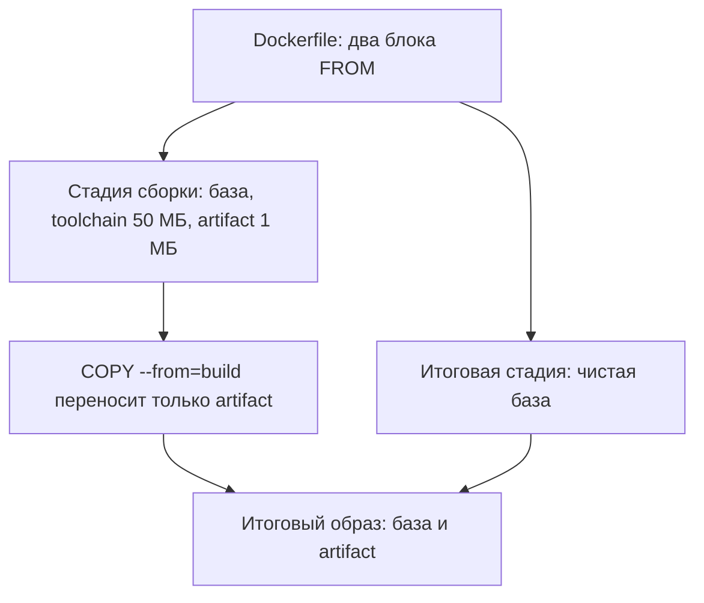

# Multi-stage сборка и минимальный базовый образ

Представьте два файла сборки одного и того же приложения. Файлы отличаются
по сути одной строкой, и из них собраны два образа. Образ — это приложение,
упакованное вместе со всем своим окружением в одну заготовку. Из образа за
секунды запускают работающий экземпляр, контейнер, и запускать можно
сколько угодно копий. Смотрим, что получилось на выходе:

```text
$ docker images
demo-multi     latest   bb9769a6870d   179MB
demo-single    latest   98ad067037e2   284MB
```

Метки образов и колонки вывода сокращены по ширине. Приложение в обоих
образах одно и то же, а весят они по-разному. Во второй доехало ещё и
сборочное окружение — инструменты, которыми приложение собирали, — на
50 МБ, а в первый — нет. Присмотритесь к разнице: она составляет 105 МБ,
то есть вдвое больше самого окружения. Почему команда так считает,
разберём в разделе про чтение вывода. Сама тема — про
строку, которая так разделила две сборки, и про то, как по выводу двух
команд прочитать, что из окружения сборки доедет до поставки.

## Из чего собран образ

Образ собирается по файлу-рецепту, который называется Dockerfile. Это
обычный текстовый файл, и каждая его строка-инструкция — один шаг рецепта:
взять основу, перейти в каталог, выполнить команду, скопировать файл.
Сборщик Docker выполняет инструкции по порядку, и результат каждого шага
складывает в образ.

Результат шага при этом не перезаписывает предыдущий, а ложится поверх
него новым слоем. Слой — это запечатанный набор изменений одной
инструкции, и после записи он уже не меняется. Из неизменности следует
главное свойство: если файл создан на одном шаге и удалён на следующем,
он остаётся в прежнем слое и в истории образа.

Как на стене: надпись можно закрасить новым слоем краски, но под краской
она осталась. Здесь надпись — это файл, новая инструкция — новый слой
краски, а история образа — все слои разом. Ломается сравнение на
шлифовке: краску счищают до основания, а из готового образа слой не
вынуть, не пересобрав его заново. Подробно эта механика и её последствия
для секретов разобраны в теме `docker-secret-leaks`.

Первая инструкция любого рецепта — FROM, она задаёт базовый образ, основу,
поверх которой кладутся ваши слои. В примерах этой темы основа —
`python:3.12-slim`: система Debian с установленным Python, урезанная до
минимума, а пометка slim как раз про эту урезанность. Есть и крайний
вариант, scratch — пустая основа, где нет ничего, кроме того, что вы
положите сами.

Теперь к тому, что попадает в образ лишнего. Чтобы собрать приложение,
нужно сборочное окружение — набор инструментов сборки, который называют
toolchain: компилятор, линковщик, заголовки библиотек, менеджер пакетов.
Результат сборки называют артефактом — готовый бинарник или
каталог вроде dist. Бытовое соответствие — строительные леса: без них дом
не построить, но жильцам они не нужны и мешают. Леса здесь — сборочное
окружение, дом — приложение, а сдача дома жильцам — поставка образа.

И вот где сравнение ломается в нужную сторону: леса с готового дома снимают,
а из готового образа окружение не снимешь, потому что слои неизменны.
Ответ на эту неизменность — сменить окружение между сборкой и поставкой,
и этот ответ разбирается ниже.

**Зачем это в работе AppSec-инженера.** Образ, в котором остались
компилятор и сетевые утилиты, — это готовый инструментарий для того, кто
попал внутрь контейнера. Собирать и скачивать ничего не надо, всё уже
лежит на месте. Проверка состава образа — штатный вопрос ревью, и
multi-stage сборка — её дешёвый ответ.

## Как это работает

**Откуда это взялось.** Почистить образ после сборки нельзя, можно только
не положить — это следствие неизменности слоёв из раздела выше. Раз чистка
невозможна, приём идёт от противного: собираем в одном окружении,
поставляем из другого. Несколько стадий в одном Dockerfile называются
multi-stage сборкой, то есть многостадийной. Каждая новая инструкция FROM
начинает свежую стадию с чистой основы, и слои прошлых стадий в неё не
переходят.

У стадии может быть имя: `FROM python:3.12-slim AS build` называет стадию
словом `build`. Имя нужно, чтобы забрать из стадии результат. Инструкция
`COPY --from=build` копирует файл из названной стадии в текущую, и только
явно скопированное переходит границу стадий. Всё остальное сборочное
окружение остаётся в стадии сборки и в итоговый образ не едет.



**Описание схемы.** Схема читается сверху вниз. Один Dockerfile порождает
две стадии: сборочную с тяжёлым окружением и итоговую с чистой основой.
Между ними стоит единственный переход — COPY --from, и через него проходит
только артефакт. Итоговый образ собирается из чистой основы и артефакта.

Базовый образ итоговой стадии — отдельный выбор, и он виден в истории
итога. Обычно это тот же slim-вариант, что и в сборке, а для статически
собранной программы хватает и пустой основы scratch.

## Что умеет и чего не умеет

Умеет приём три вещи. Убирать сборочное окружение из итогового образа.
Держать сборку и поставку в одном файле, который читается на ревью
целиком. И собирать одну стадию отдельно флагом `--target` — так
проверяют сборочную стадию, не дожидаясь итоговой.

Не умеет он четыре вещи, и каждая важна на ревью. Во-первых, лечить
содержимое базового образа: уязвимый slim остаётся уязвимым, и это тема
`dockerfile-lint-image-scan`. Во-вторых, прятать то, что скопировано в
итог: COPY --from тащит файл целиком, и секрет внутри артефакта доедет
вместе с ним. В-третьих, подменять выбор базовой основы: она выбирается
вручную.

В-четвёртых, приём не делает сборку воспроизводимой. Воспроизводимой
называют сборку, которая из одних исходников даёт один и тот же результат
в любой день. Тег — это ярлык версии образа, и ярлык `latest` плавает:
сегодня он указывает на одно содержимое, завтра на другое. Зафиксировать
версию конкретным номером называют пином, и без пина в FROM каждая сборка
решает заново, что именно собирать.

## Как запустить

Рецепт ниже — учебный, и прогоны в этой теме сняты на Docker 29.8.1.
Стадия сборки создаёт тяжёлый файл на 50 МБ, который изображает toolchain,
и маленький артефакт. Итоговая стадия забирает только артефакт. Читать
файл стоит тремя планами: завести сборочное окружение, изобразить сборку,
собрать поставку.

```dockerfile
# Файл целиком, собирается docker build
FROM python:3.12-slim AS build
WORKDIR /app
RUN dd if=/dev/urandom of=/app/toolchain.bin bs=1M count=50
RUN dd if=/dev/urandom of=/app/artifact.bin bs=1M count=1

FROM python:3.12-slim
WORKDIR /app
COPY --from=build /app/artifact.bin /app/artifact.bin
CMD ["python", "-c", "print('app')"]
```

Первый план решают первая строка FROM с именем `build` и инструкция
WORKDIR, которая задаёт рабочий каталог стадии. Второй план — две строки
RUN. RUN выполняет команду при сборке, а `dd` пишет файл заданного размера
из случайных байтов. Так изображены тяжёлый результат работы toolchain и
сам артефакт. Третий план — итоговая стадия: свежая FROM, та же рабочая
папка, COPY --from переносит только артефакт, и CMD задаёт команду, с
которой стартует контейнер.

Сборка обеих стадий целиком и точечная сборка одной стадии:

```bash
docker build -t demo-multi .
docker build --target build -t demo-build-only .
```

Вторая команда собирает только стадию `build`. В нашем прогоне она весит
284 МБ — ровно столько, сколько одностадийный образ из вступления.
Основа у них общая, и всё лишнее сверх неё — это и есть сборочное
окружение.

Порядок действий для живого проекта такой. Найдите, что нужно итогу:
обычно это один бинарник или каталог dist. Перенесите его в COPY --from,
уберите из итоговой стадии всё сборочное, соберите и сравните. Сравнение
делается не по ощущению, а по истории образа, и следующий раздел — про то,
как её читать.

## Как читать вывод

Размер — первый признак, но не доказательство: сравнивать надо состав.
Вводный вывод этой темы — 179 МБ против 284 МБ при одном приложении.
Разница — 105 МБ, вдвое больше сборочного окружения, и тут работают два
множителя. Первый — единицы: `dd` с `bs=1M count=50` пишет 50 двоичных
мегабайт, а вывод считает десятичные, и слой показывается как 52,4 МБ.
Второй — хранение: слой, собранный на вашей машине, хранится в двух
копиях, пакетом, которым образы обмениваются, и распаковкой, из которой
работает контейнер. Учёт размера видит обе копии, поэтому слой
отсвечивает в выводе дважды, и 52,4 плюс 52,4 дают те самые 105 МБ.

Состав читает история образа:

```text
$ docker history demo-multi
IMAGE          CREATED BY                                     SIZE
bb9769a6870d   CMD ["python" "-c" "print…                     0B
16ef669a7814   COPY file:ed06d983c04d4a9f…                   1.06MB
f55c2514f8b7   WORKDIR /app                                   8.19kB
```

Колонки урезаны по ширине, показаны верхние строки. В истории итога есть
только COPY артефакта, а слоёв с toolchain.bin нет. Именно это и есть
критерий приёмки: итоговая история не содержит сборочных инструкций.
Обратная проверка — история одностадийной сборки, и там обе строки с dd
на месте:

```text
$ docker history demo-single
IMAGE          CREATED BY                                     SIZE
98ad067037e2   CMD ["python" "-c" "print…                     0B
3a5aa57abd6d   dd if=/dev/urandom of=/app/artifa…             1.06MB
f91fa65b660b   dd if=/dev/urandom of=/app/toolch…             52.4MB
f55c2514f8b7   WORKDIR /app                                   8.19kB
```

Осталось убедиться, что итоговый образ не только чист, но и рабочий:

```text
$ docker run --rm demo-multi
app
```

Скажите, не собирая: в итоговую стадию добавили `RUN apt-get install
curl` — что покажет приёмка по истории образа? Ответ разобран в блоке
«Проверь себя», а пока держите критерий: всё, что сделано инструкцией
итоговой стадии, в истории видно.

## Границы метода

Приём решает состав поставки, и ничего больше. Четыре границы стоит
держать в голове. Первая — секреты. Секрет, попавший в стадию сборки, в
итог не попадёт, но сам факт его присутствия в сборке опасен по-другому.
Файлы стадии видны тому, кто собирает образ, и это отдельная тема
`docker-secret-leaks`.

Вторая граница — кеш. Сборщик запоминает результаты шагов, чтобы не
пересобирать неизменное, и кеш стадий обманывает: изменённый исходник при
неизменной инструкции COPY пересоберётся не так, как ожидалось. Поэтому
смотрите на итоговую историю, а не на строчки про кеш в выводе сборки.

Третья граница — базовый образ итоговой стадии выбирается отдельно и
чинится отдельно. Приём про то, что доедет из сборки, а не про то, что
лежит в основе. Четвёртая — сам сборщик. В Docker два строителя:
устаревший builder и buildx, и синтаксис секретов сборки понимает только
buildx. На стенде без него устаревший builder печатает предупреждение
прямо при сборке — в нашем окружении это предупреждение воспроизвелось.

## Частая ошибка

Образ похудел со 284 до 179 МБ. Стал ли он безопаснее?

Распространённый вывод: раз образ меньше, он безопаснее.

**Размер — следствие, а не свойство.** Безопасность определяется составом,
то есть тем, чем в образе можно воспользоваться. Заблуждение склеивает два
свойства — вес и состав: будто убавка одного меняет другое. Связь между
ними односторонняя. Чистый состав обычно легче, потому что из поставки
убрали лишнее. А вот лёгкий образ чистым быть не обязан: убрать можно
документацию и примеры, оставив компилятор и сетевые утилиты.

Контрпример: образ на 40 МБ меньше, но содержит компилятор и wget. Для
удержания позиции внутри контейнера это готовый набор: код атакующего
соберёт и скачает инструменты на месте. Multi-stage работает только тогда,
когда меняется состав, а не счётчик мегабайт, и состав проверяется
историей, как в разделе про чтение вывода.

## Чеклист для ревью

1. Проверьте, что итоговая стадия не содержит сборочных инструментов:
   компиляторов, менеджеров пакетов, сетевых утилит.
2. Проверьте, что в итог копируется только артефакт (COPY --from), а не
   весь каталог сборки.
3. Проверьте, что история итогового образа не содержит сборочных
   инструкций (docker history).
4. Проверьте, что базовый образ итоговой стадии пиннут по версии, а не
   latest.
5. Проверьте, что секреты в сборку приходят через механизм секретов,
   а не через ARG — тема `docker-secret-leaks`.
6. Проверьте, что выбран минимальный рабочий базовый образ, а не «полный
   на всякий случай».

## Попробуй сам

Возьмите Dockerfile своего проекта или учебный из блока «Как запустить»
и переведите его на две стадии: сборка отдельно, поставка отдельно.

Одна подсказка: сначала соберите обе версии и положите рядом вывод
docker images и docker history. Разница между ними и есть ответ, поэтому
замер нужен до переписывания, а не после.

**Критерий выполнения** наблюдаемый: в истории итогового образа нет
сборочных инструкций, приложение стартует из итогового образа, а размер
упал не меньше чем на размер сборочного окружения.

## Проверь себя

1. Предскажите, какие строки выведет `docker history` итогового образа
   этой сборки — будут ли среди них сборочные `RUN` с dd.

   ```dockerfile
   FROM alpine AS build
   RUN dd if=/dev/urandom of=/toolchain.bin bs=1M count=2
   RUN dd if=/dev/urandom of=/artifact.bin bs=1M count=1

   FROM alpine
   COPY --from=build /artifact.bin /artifact.bin
   CMD ["true"]
   ```

2. Прочитайте итоговую стадию этого Dockerfile: что из сборочного
   окружения доедет до поставки и что ещё в ней окажется?

   ```dockerfile
   FROM python:3.12-slim AS build
   WORKDIR /app
   RUN pip install build && python -m build

   FROM python:3.12-slim
   RUN apt-get update && apt-get install -y curl
   COPY --from=build /app/dist /app/dist
   ```

3. Почему удаление сборочных инструментов последней инструкцией RUN не
   очищает образ?
4. Образ после перевода на две стадии похудел вдвое. Почему это ещё не
   значит, что он стал безопаснее?
5. Возврат к теме `docker-insecure-practices`: минимальный образ без
   shell и сетевых утилит — что он забирает у атакующего, попавшего
   внутрь, и какую половину запуска он не трогает?
6. Возврат к теме `sbom`: `docker history` показывает слои и команды
   сборки. Что поверх этого даст список пакетов образа и кому он нужен?

<details markdown="1">
<summary>Ответ 1</summary>

1. Сборочных `RUN` там не будет: история итогового образа содержит
   только инструкции итоговой стадии (`CMD`, `COPY` артефакта) и слои
   базового образа. Команда для прогона: собрать этот файл `docker build
   . -t probe` и выполнить `docker history probe`. Двух строк с dd в
   выводе нет — критерий приёмки темы выполнен. Этот прогон повторён на
   alpine 3.24 при перепроверке темы: история показала CMD и COPY без
   единой строки dd.

</details>

<details markdown="1">
<summary>Ответ 2</summary>

2. Из сборочного окружения доедет ровно одно: каталог `/app/dist`,
   перенесённый через `COPY --from`; pip, кеши и слои стадии `build` в
   итог не входят. А вот curl в итоге окажется: его ставит `RUN` уже в
   итоговой стадии, и приёмка по истории образа его покажет — сетевая
   утилита в поставке останется. Multi-stage решает, что доедет из
   сборки; что кладут в саму итоговую стадию, она не фильтрует.

</details>

<details markdown="1">
<summary>Ответ 3</summary>

3. Каждая инструкция оставляет свой слой навсегда: удаление — это новый
   слой поверх, а файл остаётся в предыдущем. Почистить образ после
   сборки нельзя, можно только не положить — отсюда и приём со сменой
   окружения между стадиями. Механика слоёв подробно разобрана в теме
   `docker-secret-leaks`.

</details>

<details markdown="1">
<summary>Ответ 4</summary>

4. Размер — следствие состава, а не само свойство: лёгкий образ с
   компилятором и wget внутри даёт атакующему готовый набор инструментов,
   а большой без них — нет. Похудение говорит, что что-то убрали;
   безопасность решает, что именно осталось, и читается она по истории
   и составу, а не по счётчику мегабайт.

</details>

<details markdown="1">
<summary>Ответ 5</summary>

5. Он забирает удержание позиции: без shell, curl и компилятора код
   внутри контейнера не скачает инструменты и не соберёт их на месте.
   Не трогает он права запуска: root по тождественной карте, сокет
   демона и лишние capabilities, то есть раздельные полномочия root из
   темы `linux-capabilities`. Они решаются флагами и картой uid из той
   темы, а не составом образа.

</details>

<details markdown="1">
<summary>Ответ 6</summary>

6. История показывает, какими инструкциями образ собран, но не
   перечисляет пакеты и их версии внутри слоёв. Список пакетов — SBOM
   (Software Bill of Materials) — нужен сканеру уязвимостей: по нему
   состав образа сопоставляется с базой известных уязвимостей (CVE,
   Common Vulnerabilities and Exposures). Находка в пакете всплывёт
   даже там, где история читается безобидно.

</details>

## Источники

1. Multi-stage builds, документация Docker; реестр `docker-multistage`.
   Разделы: вторая стадия FROM, COPY --from, сборка через --target.
   <https://docs.docker.com/build/building/multi-stage/>
2. docker image history, справка CLI Docker; реестр `docker-image-history`.
   Разделы: колонки вывода, ключи --no-trunc и --format.
   <https://docs.docker.com/reference/cli/docker/image/history/>

Каркас этапа: записи семейства man-* и якоря подраздела 4.2
(docker-engine-security, owasp-cs-docker) — наследуются всеми темами
подраздела.

**Скоропортящийся слой.** Синтаксис и умолчания builder меняются:
устаревший builder в Docker 29 печатает предупреждение, синтаксис
секретов требует buildx. Размеры образов — свойство версий базы
и хранилища образов.

**Маркеры уверенности.** **Проверено лично** 2026-09-01 на Arch Linux,
Docker 29.7.2, образ python:3.12-slim: сборка обеих версий (284 МБ против
179 МБ), история итога без сборочных слоёв, запуск итогового образа
(печатает «app»), предупреждение устаревшего builder. Синтаксис
`RUN --mount=type=secret` проверен на buildx 0.30.1 в изолированном
DOCKER_CONFIG — см. тему `docker-secret-leaks`. Поведение --target и
scratch-базы — **по документации** (docker-multistage, открыта лично
2026-09-01). Все прогоны повторены 2026-10-03 на Docker 29.8.1, хранилище
overlayfs: размеры совпали дословно (179 МБ и 284 МБ), сборка стадии
через --target дала 284 МБ, история итога и обратная проверка по
одностадийному образу совпали по составу строк, запуск итогового образа
печатает «app», предупреждение устаревшего builder воспроизведено —
buildx в окружении отсутствует. Сценарий вопроса 1 собран на alpine:
история итогового образа показала CMD и COPY без сборочных строк dd.
