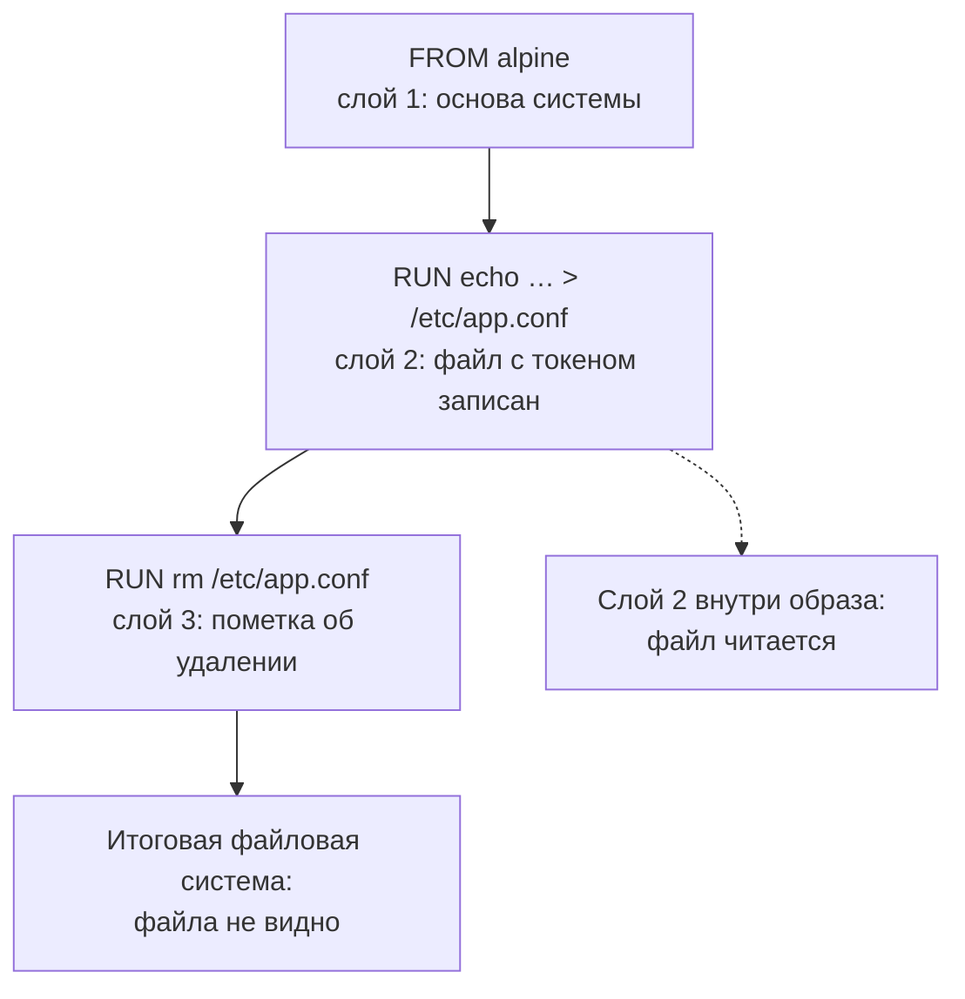
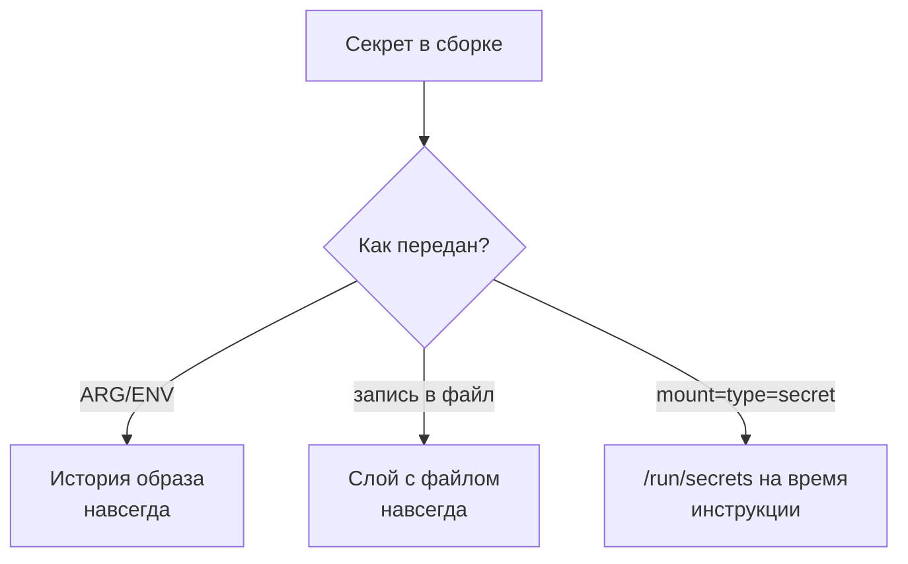

# Секреты в слоях образа и в build args

Представьте сборку образа — упакованного слепка программы со всем её
окружением; из образа запускают изолированные копии программы, контейнеры.
Сборщик берёт токен из аргумента сборки, записывает его в конфиг, а
следующей инструкцией конфиг удаляет. Кажется, что следов не осталось:
итоговый образ файл не содержит. Теперь спросите у образа, как он
собирался: команда docker history печатает протокол сборки, а флаг
--format '{{.CreatedBy}}' оставляет там только текст команд шагов:

```bash
docker history --format '{{.CreatedBy}}' leak-demo
```

```text
RUN |1 API_TOKEN=sk-live-42 /bin/sh -c rm /e…
RUN |1 API_TOKEN=sk-live-42 /bin/sh -c echo …
ARG API_TOKEN=sk-live-42
```

Файла в образе нет, а токен читается в каждой строке протокола: префикс
`|1` — пометка сборщика, и следом за ним подставлено значение одной
переменной сборки. И сам файл никуда не делся: он остался в промежуточном
слое, то есть в снимке изменений от одной инструкции. Достаётся он оттуда
одной командой — это показано в разделе «Как это атакуют». Секрет,
попавший в сборку, из образа уже не вытащить: токен пережил собственное
удаление.

## Из чего собран образ

### Контейнер, образ, Dockerfile

Контейнер — это способ запустить программу в отгороженном окружении: у неё
своя файловая система и свои процессы, а ядро операционной системы общее с
хозяйской машиной. Бытовой пример — квартира в многоквартирном доме: стены
и замок у жильца свои, а фундамент и стояки общие. Граница аналогии —
прочность стен: между квартирами стены капитальные, а контейнеры делят
одно ядро, и изоляция между ними тоньше. Docker — самый ходовой инструмент
сборки и запуска контейнеров, и дальше в теме речь о нём.

Образ — это упакованная копия программы со всем окружением: библиотеками,
настройками, файлами. Из одного образа запускают сколько угодно одинаковых
контейнеров, как с одного установочного диска ставят одну и ту же систему.
Граница аналогии — изменяемость: поставленная с диска система дальше живёт
и меняется, а контейнер каждый раз стартует с чистого слепка. Собирается
образ по рецепту — текстовому файлу Dockerfile. Каждая строка
рецепта — инструкция: FROM задаёт основу, RUN выполняет команду внутри
сборки, ARG и ENV объявляют переменные.

### Слои не забывают

Каждая инструкция добавляет поверх предыдущих новый слой — снимок изменений,
которые инструкция внесла. Слой неизменяем: записанное в него остаётся в нём
навсегда. Такое устройство вам уже знакомо, если вы работали с git.

| в git | в образе |
|---|---|
| коммит | слой |
| `git log` | `docker history` |
| `git rm` и новый коммит | `RUN rm` и новый слой |

Соответствие держится на главном свойстве: и коммит, и слой — неизменяемая
запись поверх предыдущей, а удалённый файл читается из старой записи.
Ломается аналогия на переписывании: git умеет переписать историю через
rebase, а у образа такой операции нет. «Изменить прошлое» образа можно
единственным способом — собрать его заново.

Поэтому «удалить файл» в Dockerfile означает «добавить слой с пометкой,
что файла больше нет». Итоговая файловая система показывает верх стопки,
и в ней файла не видно. Но стопка хранится целиком, и нижний слой с файлом
остаётся внутри образа. А вот файл, созданный и стёртый внутри одной
инструкции, не попадает в слой вовсе: слой фиксирует итог завершённой
инструкции. Посмотрите на стопку сверху вниз:



**Описание схемы.** Основная цепочка идёт сверху вниз: каждая инструкция
добавляет свой слой, и после третьей инструкции файла нет в итоговой
файловой системе. Пунктирная связь показывает второй факт: содержимое
второго слоя никуда не делось, и файл с токеном читается из него напрямую.

### История и реестр

У образа есть и протокол сборки — история. Команда docker history печатает
её: какая инструкция породила каждый слой и с каким текстом команды. Именно
такой протокол показан во вступлении. История не живёт отдельно от образа:
она записана в его конфиге и уезжает вместе с ним.

Готовый образ редко остаётся там, где его собрали: его публикуют в реестре —
хранилище образов, по роли похожем на репозиторий пакетов вроде npm или
PyPI. Туда загружают, оттуда скачивают. В реестр уезжает образ целиком, со
всеми слоями и историей. Поэтому любой, кто скачал образ, читает и то и
другое — без всякого взлома.

**Зачем это в работе AppSec-инженера.** Утечка секрета в историю образа —
одна из самых частых находок при ревью Dockerfile, и видна она одной
командой history. Проверка занимает минуту, а последствие размером с
реестр: всем, кто скачал образ, достались и секреты.

## Как это работает

**Откуда это взялось.** Образы изначально собирали неизменяемыми слоями,
потому что так дешевле хранить и передавать: общие части не дублируются,
один базовый слой делят сотни образов. Цена неизменяемости — отсутствие
удаления: «стереть» внутри образа означает «добавить слой с пометкой об
удалении». Секрет попадает в эту модель двумя дверями. Первая — содержимое
слоя: файл записали, потом «стёрли». Вторая — история сборки: значение
переменной печатается в команде, породившей слой.

У переменных ARG и ENV разная досягаемость. ARG — переменная времени сборки:
она живёт, пока идёт сборка, но её значение остаётся в истории образа, что
и видно в выводе из вступления. ENV — переменная окружения: она попадает
не только в историю, но и в настройки образа. Контейнер стартует с такой
переменной в окружении, а снаружи её показывает docker inspect — команда,
которая печатает карточку образа с настройками.

В каталоге типовых слабостей CWE обе находки относятся к CWE-798: секрет
зашит там, где его читает посторонний. По форме это CWE-538: значение
оказалось в месте, доступном постороннему. Номера пригодятся, когда находку
нужно будет записать в отчёт или связать с чеклистом ревью.

Третий путь придумали ровно под эту задачу — механизм секретов сборки.
Инструкция `RUN --mount=type=secret` монтирует значение из файла в каталог
/run/secrets на время одной инструкции: инструкция закончилась — и файла
нет. «Смонтировать» значит показать файл внутри сборочного окружения, не
копируя в слой. Бытовое соответствие — ключ от кладовой, который повару
выдают на одну готовку: в акте записано блюдо, а не ключ. Ломается
аналогия на копировании. Настоящий ключ можно сфотографировать, а
смонтированный файл сам в слой не попадает, если только команда его туда
не запишет.

Итог такой: в слой попадает результат инструкции, а не значение, и в
историю — текст команды без значения. Разница трёх путей — на схеме:



**Описание схемы.** Один секрет, три пути. ARG и ENV записывают значение
в историю образа. Запись в файл оставляет его в слое, даже если следующая
инструкция файл удаляет. Только монтирование на время инструкции не
оставляет значения ни в истории, ни в слоях.

## Как это атакуют

Если вы передавали в сборку ключи через --build-arg, вопрос уже стоял.
Доставка секрета до задания конвейера — тема `ci-secrets`, отзыв утёкшего
значения — тема `secrets-in-code`, а здесь третья задача: не дать секрету
остаться в артефакте сборки. Атакующему не нужен взлом: достаточно
получить сам образ. Скачать из публичного реестра, вынуть из кеша
сборщика, забрать с машины, куда образ приехал, — дальше остаётся только
читать. Проверим обе двери руками.

Стенд — локальный Docker 29.7.2 со сборщиком buildx 0.30.1, образ alpine.
buildx — сборочный компонент Docker с собственным номером версии; без него
синтаксиса секретов сборки нет. Утечка воспроизводится на стенде двумя
сборками.

Шаг 1. Соберите образ, где сборщик берёт токен из аргумента и тут же
удаляет файл с ним:

```dockerfile
# Dockerfile, целиком; УЯЗВИМО — демонстрация, не для продакшена
FROM alpine
ARG API_TOKEN
RUN echo "token=$API_TOKEN" > /etc/app.conf
RUN rm /etc/app.conf
```

Инструкция ARG объявляет аргумент сборки, а значение ему передаётся
снаружи, флагом --build-arg:

```bash
docker build --build-arg API_TOKEN=sk-live-42 -t leak-demo .
```

Шаг 2. Прочитайте историю — её вывод разобран во вступлении: значение
видно в обеих строках RUN и в строке ARG. Сборщики разных версий печатают
историю по-разному, но значение, переданное через --build-arg и
использованное в команде, в истории остаётся.

Затем достаньте сам файл из сохранённого образа. Команда docker save
выгружает образ в tar-архив, чтобы передать его без реестра — как
репозиторий на флешке. Внутри архива каждый слой лежит отдельным файлом:

```bash
docker save leak-demo -o leak.tar
mkdir layers && tar -xf leak.tar -C layers
tar -xOf <слой> etc/app.conf
```

```text
token=sk-live-42
```

Замените: `<слой>` — имя файла слоя внутри архива. В проверенном прогоне
слои лежали в layers/blobs/sha256/ и были сжаты gzip. Нужный находится
перебором: tar -tf по каждому файлу показывает, где лежит etc/app.conf.

Файл, которого «нет» в образе, читается из слоя. В этом парность темы:
одна и та же инструкция удаления даёт разный ответ в итоговой файловой
системе и в истории слоёв. А в том же архиве лежит конфиг образа — JSON
с историей сборки, и grep по значению токена находит его там без всякого
docker history.

Шаг 3. Теперь соберите тот же образ через механизм секретов. Значение
лежит в файле token.txt на сборщике и подаётся флагом --secret:

```dockerfile
# Dockerfile, целиком; исправленный вариант
FROM alpine
RUN --mount=type=secret,id=api_token \
    test -s /run/secrets/api_token && \
    echo "приватный артефакт собран" > /build.log
```

```bash
docker build --secret id=api_token,src=./token.txt -t leak-demo-fixed .
```

Проверка идёт тремя способами: в истории нет значения, ноль вхождений; в
слоях сохранённого образа нет значения; сборка при этом прошла. Значит,
значение приехало и сработало: инструкция test -s падает, если файл пуст
или отсутствует.

На этом же стенде поймана и вторая ошибка. Если значение секрета вписать
в текст самой RUN-команды, оно останется в истории даже при
--mount=type=secret: история хранит текст команды, и монтирование тут не
помогает. Поэтому значение внутри инструкции читают из файла через
$(cat …), а не подставляют в текст.

Оба прогона вместе выводят на одну границу. Всё, что стало текстом команды
или содержимым слоя, остаётся в образе навсегда. Не остаётся только
значение, смонтированное на время одной инструкции.

Остаётся вопрос, который копированием стенда не решается: а если секрет
нужен не в сборке, а приложению при старте? Там --mount=type=secret не
поможет: монтирование живёт только во время сборки, и в запущенном
контейнере его нет. Секреты рантайма — отдельная задача, и дальше по
маршруту её закрывают темы `k8s-secrets` и `vault-integration`.

## Как это выглядит в коде

Ревьюер читает Dockerfile и ищет два признака. Найдите оба в листинге до
чтения выносок.

```dockerfile
# Фрагмент Dockerfile; УЯЗВИМО — демонстрация, не для продакшена
ARG API_TOKEN
ENV DB_PASSWORD=s3cret        # (1)
RUN curl -H "Authorization: $API_TOKEN" \
    https://internal.example/repo.tgz -o /tmp/r.tgz   # (2)
RUN rm /tmp/r.tgz
```

1. ENV с секретом: значение останется и в истории, и в окружении рантайма —
   двойная утечка одной строкой.
2. ARG в теле команды: при сборке значение подставится в текст команды и
   попадёт в историю. Удаление следующей строкой не чинит ни слой, ни
   историю.

Есть и третий признак, косвенный: флаг --build-arg в описании конвейера.
Секрет, который прошёл через него, оседает в истории образа; как значение
доезжает до сборщика, разбирает `ci-secrets`. Осторожнее с ложными
срабатываниями: ARG с несекретным значением, например версией или путём
репозитория, находкой не считается. Смотрите на происхождение значения,
а не на одно имя.

Автоматика здесь прямая, потому что история машиночитаема:
`docker history --format json` отдаёт команды слоёв, и grep по имени
переменной ловит утечку в конвейере за секунду. По самому Dockerfile
статический разбор ловит форму: ENV с присваиванием значения, ARG с именем,
похожим на секрет. Пропустит он секрет, собранный вычислением, и значение
в тексте RUN без характерного имени. Сканирование образа на уязвимости —
соседний вопрос, его разбирает тема `dockerfile-lint-image-scan`.

## Как защититься

Правило одно: секрет приезжает в сборку через монтирование и не
записывается ни в файл образа, ни в текст команды. Исправление для
ревьюерского листинга из раздела «Как это выглядит в коде»:

```dockerfile
# Фрагмент Dockerfile; исправленный вариант
RUN --mount=type=secret,id=api_token \
    curl -H "Authorization: $(cat /run/secrets/api_token)" \
    https://internal.example/repo.tgz -o /tmp/r.tgz && \
    tar -xzf /tmp/r.tgz -C /opt && rm /tmp/r.tgz
```

Здесь значение читается из /run/secrets в момент инструкции. В историю
попадает только текст с $(cat …), потому что значение в тексте не
появляется. В слой попадает распакованный архив — результат работы, а не
сам секрет. Временный архив удалён той же инструкцией, и это безопасно:
созданное и стёртое внутри одной RUN в слой не попадает. Сборка
вызывается с флагом --secret, который указывает файл-источник на
сборщике:

```bash
docker build --secret id=api_token,src=./token.txt -t app .
```

**Границы применимости.** Синтаксис требует buildx. Если на сборщике
старый Docker без него, Dockerfile с --mount=type=secret не разберётся:
сборка упадёт на разборе, и это видно сразу, молчаливого провала нет.
Вторая граница важнее: секрет, уже уехавший в реестр, правкой Dockerfile
не отзывается. Утёкшее значение считается скомпрометированным, его меняют —
этой ротации посвящена тема `secret-rotation`, — а образ пересобирают. И
третье: $(cat …) безопасен, а подстановка значения в текст команды — нет,
и пример этой ошибки разобран в разделе «Как это атакуют».

**Проверка фикса.** Ретест — те же два чтения, что и в атаке. Команда
`docker history --no-trunc` не содержит ни значения, ни самого ARG, а
сохранённый образ не содержит значения ни в одном слое. Регресс закрывается
проверкой в конвейере: история нового образа не должна содержать имён
секретных аргументов. И последнее — негативный кейс: сборка обязана падать
там, где секрет нужен. Если сборка «чинится» удалением приватного шага,
это не починка, а потеря функции.

## Частая ошибка

Сначала ответьте для себя: файл записали в слой, а следующей же инструкцией
удалили. Есть он в образе или нет?

Знакомая уверенность звучит так: секрет удалили из образа следующей
инструкцией, значит, его там нет.

**Удаление — это новый слой поверх, а не стирание.** Слои неизменяемы,
и пометка об удалении живёт отдельно от содержимого; механика разобрана
в разделе «Как это работает».

Контрпример вы уже видели своими глазами, если повторяли прогон: файл,
удалённый во второй строке Dockerfile, читается из слоя первой. Удаление
внутри той же инструкции — другое дело: такой файл в слой не попадает
вовсе. А история показывает и значение ARG, то есть утекают обе двери
сразу. Хорошая новость в том, что закрываются обе одним механизмом —
монтированием.

## Чеклист для ревью

1. Проверьте, что ни один секрет не приходит в сборку через ARG или ENV
   (CWE-798).
2. Проверьте, что секреты в сборке подключены через --mount=type=secret.
3. Проверьте, что значение секрета не вписано в текст RUN-команды.
4. Проверьте, что история собранного образа не содержит секретов
   (docker history --no-trunc).
5. Проверьте, что в конвейере сборка вызывается с --secret, а не
   с --build-arg (CWE-538).
6. Проверьте, что утёкшие значения заменены, а не только убраны из
   Dockerfile — тема `secret-rotation`.

## Попробуй сам

Соберите уязвимый Dockerfile из раздела «Как это атакуют» с тестовым
значением и найдите его двумя способами: в истории образа и в слое
сохранённого образа. Затем перепишите рецепт на --mount=type=secret и
повторите поиск.

Подсказка одна: архив от docker save — это tar, внутри которого слои лежат
отдельными файлами. Если файл слоя начинается не как tar, значит, он сжат
gzip: GNU tar распознаёт сжатие сам, и команды чтения не меняются.

**Критерий выполнения** наблюдаемый: до правки значение найдено обоими
способами, после правки не найдено ни одним, и сборка прошла.

## Проверь себя

1. Образ собран из такого Dockerfile, и файл удалён последней строкой.
   Предскажите, сколько раз значение токена встретится в истории образа,
   и проверьте прогоном.

   ```dockerfile
   FROM alpine
   ARG API_TOKEN
   RUN echo "token=$API_TOKEN" > /etc/app.conf
   RUN rm /etc/app.conf
   ```

2. Здесь файл `.npmrc` создан и удалён внутри одной инструкции RUN.
   Где останется токен в таком образе — в слоях, в истории, в обоих
   местах? Чем этот случай отличается от вопроса 1?

   ```dockerfile
   FROM node:22-slim
   ARG NPM_TOKEN
   RUN echo "//registry.npmjs.org/:_authToken=$NPM_TOKEN" > .npmrc \
       && npm ci && rm .npmrc
   ```

3. Сборке нужен токен для скачивания приватного репозитория. Выберите
   починку.

   A. Передать токен через ARG и удалить файл с ним последней
      инструкцией RUN.

   B. Передать токен через `RUN --mount=type=secret` и прочитать его из
      /run/secrets внутри той же инструкции.

   C. Передать токен через ENV, а после сборки убрать эту строку из
      Dockerfile.

4. Почему секрет, подставленный в текст RUN-команды, утекает даже при
   `RUN --mount=type=secret`?
5. Возврат к теме `docker-multistage-builds`: секрет, попавший в стадию
   сборки, в итоговый образ не попадёт. Почему это не снимает находку?
6. Возврат к теме `secrets-in-code`: чем отзыв утёкшего секрета
   отличается от правки Dockerfile?

<details markdown="1">
<summary>Ответ 1</summary>

1. Минимум по разу в каждой строке RUN, собранной с активным ARG: значение
   подставляется в команду, породившую слой. Прогон: собрать с
   `--build-arg API_TOKEN=probe-7` и выполнить `docker history --no-trunc
   --format '{{.CreatedBy}}' <образ>` — обе строки RUN несут префикс
   `API_TOKEN=probe-7`. Файл удалён, а значение читается из истории.

</details>

<details markdown="1">
<summary>Ответ 2</summary>

2. Только в истории: значение ARG подставлено в текст команды, и его
   видно в выводе docker history. В слои токен не попал: слой — снимок
   изменений после завершения инструкции, а `.npmrc` стёрт до конца той
   же RUN. Прогон это подтверждает: в архиве от `docker save` файл не
   находится ни в одном слое, а значение находится в строке истории.
   Цепочка `&& … && rm` закрывает слой, но не историю. Отличие от
   вопроса 1: там две инструкции RUN, и файл остаётся в слое первой.

</details>

<details markdown="1">
<summary>Ответ 3: разбор вариантов</summary>

3. Верный вариант — B.

   A. Неверно: удаление — это новый слой с пометкой, а содержимое остаётся
      в прежнем слое; значение ARG к тому же видно в истории. Файл «стёрт»
      только в итоговой файловой системе.

   B. Верно: монтирование подкладывает значение в /run/secrets на время
      одной инструкции — в слой попадает результат, а не секрет, а в
      историю — текст команды без значения. Сборка вызывается с `--secret`,
      и синтаксис требует buildx.

   C. Неверно: ENV виден и в истории, и в окружении рантайма, и в выводе
      docker inspect. А правка Dockerfile не отзывает уже собранное: образ
      с секретом уехал в реестр. Утёкшее значение меняют ротацией, а строку
      правят, чтобы не утекло следующее.

</details>

<details markdown="1">
<summary>Ответ 4</summary>

4. Монтирование защищает доставку значения, а история хранит текст
   команды: подстановка в сам текст печатает значение в строке слоя, и
   `--mount` тут ни при чём. Поэтому внутри инструкции значение читают
   из /run/secrets через `$(cat …)`, а не вписывают в команду.

</details>

<details markdown="1">
<summary>Ответ 5</summary>

5. Итоговый образ чист, но секрет уже побывал в сборке: в кеше стадии,
   в журнале конвейера, в промежуточном образе на сборщике. Состав
   поставки и доставка секрета — разные рубежи; второй закрывает
   `--mount=type=secret`, а присутствие в сборке лечится ротацией
   значения.

</details>

<details markdown="1">
<summary>Ответ 6</summary>

6. Правка Dockerfile останавливает будущие утечки; отзыв обесценивает
   уже утёкшее: значение считается скомпрометированным с момента сборки,
   и его меняют. Нужны оба действия, и порядок — сначала ротация: читатель
   реестра уже мог прочитать старое.

</details>

## Источники

1. Build secrets, документация Docker; реестр `docker-build-secrets`.
   Разделы: почему ARG и ENV остаются в истории, RUN --mount=type=secret,
   вызов сборки с --secret.
   <https://docs.docker.com/build/building/secrets/>
2. docker image history, справка CLI Docker; реестр `docker-image-history`.
   Разделы: колонки вывода, --no-trunc, --format.
   <https://docs.docker.com/reference/cli/docker/image/history/>

Каркас этапа: записи семейства man-* и якоря подраздела 4.2
(docker-engine-security, owasp-cs-docker) — наследуются всеми темами
подраздела.

**Скоропортящийся слой.** Синтаксис секретов требует buildx; его наличие
и версии на стенде — в маркерах. Поведение history в разных версиях Docker
проверяется при ревизии: buildx 0.30.1 печатает значение и в строке ARG,
а сборка через docker build на Docker 29.8.1 показывает его только в
строках RUN. Раскладка архива docker save тоже менялась между версиями:
в Docker 29.8.1 слои лежат в blobs/sha256/ и сжаты gzip.

**Маркеры уверенности.** **Проверено лично** 2026-09-01 на Arch Linux,
Docker 29.7.2, buildx 0.30.1 (изолированный DOCKER_CONFIG), образ alpine:
утечка ARG в историю (--format и --no-trunc), чтение «удалённого» файла
из слоя сохранённого образа, сборка с --mount=type=secret (ноль вхождений
значения в истории и в слоях, артефакт собран), утечка значения,
вписанного в текст RUN при --mount, — поймана на первом варианте
демонстрации. 2026-10-03 перепроверено на Docker 29.8.1: сборка уязвимого
Dockerfile, вывод history с префиксом `|1 API_TOKEN=sk-live-42` в строках
RUN, чтение etc/app.conf из слоя архива (blobs/sha256/; файл слоя
начинается не как tar — он сжат gzip), токен находится grep по
JSON-конфигу образа внутри того же архива, `docker history --format json`
отдаёт команды слоёв. Там же проверен контраст из вопроса 2: файл,
созданный и стёртый внутри одной RUN, не попадает ни в один слой, а
значение остаётся в истории. Сборка с --mount=type=secret на 29.8.1 не
повторялась, в окружении нет buildx, и оставлена по записи 2026-09-01.
Формат вызова --secret и поведение ENV в рантайме — **по документации**
(обе страницы открыты лично 2026-09-01).
