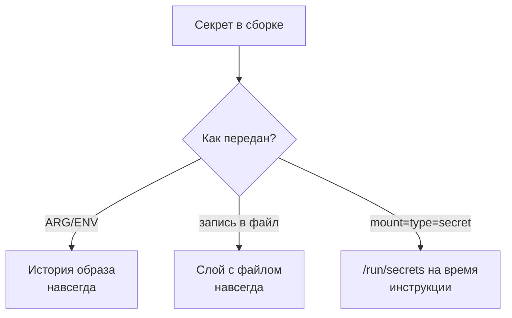

# Секреты в слоях образа и в build args

Уровень **L2** · время 30 мин (теория 20 / задача 7 / самопроверка 3,
оценка)

Что прочитать сначала: `secrets-in-code`, `ci-secrets`.

Собран образ: сборщик взял токен из аргумента, записал в конфиг и тут же
стёр файл. Смотрим, что осталось в образе:

```text
$ docker history --format '{{.CreatedBy}}' leak-demo
RUN |1 API_TOKEN=sk-live-42 /bin/sh -c rm /e…
RUN |1 API_TOKEN=sk-live-42 /bin/sh -c echo …
ARG API_TOKEN=sk-live-42
```

Файла в итоговом образе нет — а токен виден в каждой строке истории. Больше
того: сам файл жив в промежуточном слое, и к нему мы ещё вернёмся. Это и
есть находка: секрет, который попал в сборку, из образа уже не вытащить.
Токен пережил собственное удаление.

Если вы передавали в сборку ключи через --build-arg, вопрос уже стоял.
Доставка секрета в задание конвейера — тема `ci-secrets`; здесь —
недопущение секрета в артефакт сборки. Как секрет попадает в сборку, не
попадая в образ, — и почему из истории образа его уже не вытащить?

## 0. Коротко

Образ — стопка слоёв, и слой неизменяем: удалённое следующей инструкцией
остаётся в предыдущем слое. Build args и ENV с секретом записываются в
историю образа и видны через docker history даже без распаковки.
Правильный путь — механизм секретов сборки: `RUN --mount=type=secret`
подкладывает значение на время одной инструкции и в образ не пишет.
Найденное чинится не удалением строки, а сменой секрета: утёкшее считается
скомпрометированным (тема `secrets-in-code`). Меняется не образ, а секрет.

**Зачем это в работе AppSec-инженера.** Это одна из самых частых находок
при ревью Dockerfile, и видна она одной командой history. Образ уезжает
в реестр, а с ним и вся его история: читатель реестра читает и секреты.
Проверка занимает минуту, а последствие — размером с реестр.

## 1. Цели

После этого раздела вы сможете:

1. Показать секрет в истории образа после его удаления из файла.
2. Объяснить, почему слой навсегда и чем ARG отличается от ENV.
3. Передать секрет в сборку через --mount=type=secret, не записав в
   образ.
4. Найти утечку в Dockerfile глазами и автоматикой.

## 3. Механика

**Откуда это взялось.** Образы собирались как неизменяемые слои: так
дешевле хранить и передавать общие части. Цена неизменяемости — отсутствие
удаления: «стереть» внутри образа означает «добавить слой с пометкой об
удалении». Секрет попадает в эту модель двумя дверьми: содержимым слоя
(файл записали, потом «стёрли») и историей сборки (значение ARG или ENV
печатается в команде, породившей слой).

У ARG и ENV разная досягаемость. ARG живёт только в сборке, но его
значение остаётся в истории — видно во вводном выводе. ENV к тому же
становится переменной окружения в рантайме и виден через `docker inspect`
и внутри контейнера. Оба случая — CWE-798 (каталог Common Weakness
Enumeration) в месте хранения, а по форме это CWE-538: значение оказалось
в доступном постороннем месте.

Механизм секретов сборки устроен иначе: `RUN --mount=type=secret`
монтирует значение из файла в /run/secrets на время одной инструкции.
В слой попадает результат инструкции, а не само значение.



**Описание схемы.** Один секрет, три пути. ARG и ENV записывают значение
в историю образа. Запись в файл оставляет его в слое, даже если следующая
инструкция файл удаляет. Только монтирование на время инструкции не
оставляет значения ни в истории, ни в слоях.

## 4. Эксплуатация

Стенд — локальный Docker 29.7.2 с buildx 0.30.1, образ alpine. Утечка
воспроизводится на нём за две сборки.

Шаг 1. Соберите образ с токеном в ARG и удалением файла:

```dockerfile
# Файл целиком; УЯЗВИМО — демонстрация
FROM alpine
ARG API_TOKEN
RUN echo "token=$API_TOKEN" > /etc/app.conf
RUN rm /etc/app.conf
```

Шаг 2. Прочитайте историю — вывод в начале темы. Затем достаньте сам
файл из сохранённого образа:

```text
$ docker save leak-demo -o leak.tar
$ tar -xOf <слой> etc/app.conf
token=sk-live-42
```

Файл, которого «нет» в образе, читается из слоя. Это парность темы: одна
и та же инструкция удаления — и разный ответ в итоговой файловой системе
и в истории слоёв.

Шаг 3. Тот же сборщик через механизм секретов:

```dockerfile
# Файл целиком; исправленный вариант
FROM alpine
RUN --mount=type=secret,id=api_token \
    test -s /run/secrets/api_token && \
    echo "приватный артефакт собран" > /build.log
```

Проверка тремя способами: в history нет значения (0 вхождений), в слоях
сохранённого образа нет значения, сборка прошла — значение приехало
и сработало. На этом стенде поймана и вторая ошибка: секрет, вписанный
в текст самой RUN-команды, виден в history и при --mount. Значение не
должно появляться в тексте команды.

Оба прогона вместе выводят на одну границу. Всё, что стало текстом
команды или содержимым слоя, остаётся в образе навсегда; не остаётся
только значение, смонтированное на время инструкции. А вот вопрос,
который копированием этого стенда не решается: секрет нужен уже в
рантайме, а не в сборке, — поможет ли там --mount=type=secret?

## 5. Как выглядит в коде

Ревьюер читает Dockerfile и ищет два признака; найдите оба в листинге
до чтения выносок.

```dockerfile
# УЯЗВИМО — демонстрация, не для продакшена
ARG API_TOKEN
ENV DB_PASSWORD=s3cret        # (1)
RUN curl -H "Authorization: $API_TOKEN" \
    https://internal.example/repo.tgz -o /tmp/r.tgz   # (2)
RUN rm /tmp/r.tgz
```

1. ENV с секретом: останется и в истории, и в окружении рантайма.
2. ARG в теле команды: значение подставится в текст команды в истории.
   Удаление следующей строкой не чинит ни слой, ни историю.

Признак третий, косвенный: --build-arg в описании конвейера. Секрет,
который прошёл через него, осел в истории образа. Ложное срабатывание:
ARG с несекретным значением (версия, путь репозитория) — находкой не
считается; смотрите на происхождение значения.

Автоматика здесь прямая: история образа машиночитаема,
`docker history --format json` отдаёт команды слоёв, и grep по имени
переменной ловит утечку в CI за секунду. По Dockerfile статика ловит
форму: ENV с присваиванием, ARG с именем секрета. Пропустит она секрет,
собранный вычислением, и значение в тексте RUN без характерного имени.
Сканирование образа на уязвимости — соседний вопрос, тема
`dockerfile-lint-image-scan`.

## 6. Как чинится

Правило одно: секрет приезжает в сборку через монтирование и не
записывается ни в файл образа, ни в текст команды:

```dockerfile
# Исправлено
FROM alpine
RUN --mount=type=secret,id=api_token \
    curl -H "Authorization: $(cat /run/secrets/api_token)" \
    https://internal.example/repo.tgz -o /tmp/r.tgz && \
    tar -xzf /tmp/r.tgz -C /opt && rm /tmp/r.tgz
```

Секрет читается из /run/secrets в момент инструкции, в историю попадает
только текст с $(…), в слой — только распакованный артефакт. Сборка
вызывается с --secret id=api_token,src=….

**Границы применимости.** Синтаксис требует buildx: на стенде со
устаревшим builder его нет, и сборка упадёт на разборе — это видно сразу.
Секрет, уже уехавший в реестр, этим не отзывается: меняйте значение
и пересобирайте. И помните про текст команды: $(cat …) безопасен,
подстановка значения в текст — нет.

**Проверка фикса.** Ретест двумя чтениями: `docker history --no-trunc`
не содержит значения (и самого ARG), сохранённый образ не содержит
значения ни в одном слое. Оба прохода делаются командами из блока
«Эксплуатация». Регресс — проверка в CI: history нового образа не
содержит имён секретных аргументов. Негативный кейс: сборка обязана
падать там, где секрет нужен, а не «чиниться» удалением приватной части.

## 9. Ловушка

Сначала ответьте для себя: файл записали в слой и следующей же
инструкцией удалили — есть он в образе или нет?

Знакомая уверенность: секрет удалили из образа следующей
инструкцией, значит, его там нет.

**Удаление — это новый слой поверх, а не стирание.** Механизм из блока
«Механика»: слои неизменяемы, и пометка об удалении живёт отдельно от
содержимого.

Контрпример из блока «Эксплуатация»: файл, удалённый во второй строке,
читается из слоя первой. История показывает и значение ARG — то есть
утекают обе двери, а не одна. И чинятся обе одним механизмом.

## 10. Чеклист ревью

1. Проверьте, что ни один секрет не приходит в сборку через ARG или ENV
   (CWE-798).
2. Проверьте, что секреты в сборке подключены через --mount=type=secret.
3. Проверьте, что значение секрета не вписано в текст RUN-команды.
4. Проверьте, что история собранного образа не содержит секретов
   (docker history --no-trunc).
5. Проверьте, что в CI сборка вызывается с --secret, а не --build-arg
   (CWE-538).
6. Проверьте, что утёкшие значения заменены, а не только убраны из
   Dockerfile — тема `secret-rotation`.

## 11. Задача

Соберите уязвимый Dockerfile из блока «Как выглядит в коде» с тестовым
значением и найдите его двумя способами: в истории и в слое сохранённого
образа. Затем перепишите на --mount=type=secret и повторите поиск.

Одна подсказка: слои сохранённого образа — это tar внутри tar; сначала
docker save, потом список содержимого каждого слоя.

**Критерий выполнения** наблюдаемый: до правки значение найдено обоими
способами, после — не найдено ни одним, и сборка прошла.

## 12. Проверь себя

1. Образ собран из такого Dockerfile, файл удалён последней строкой.
   Предскажите, сколько раз значение токена встретится в истории образа,
   и проверьте прогоном.

   ```dockerfile
   FROM alpine
   ARG API_TOKEN
   RUN echo "token=$API_TOKEN" > /etc/app.conf
   RUN rm /etc/app.conf
   ```

2. Найдите в этом Dockerfile оба места, где секрет оседает в образе.

   ```dockerfile
   FROM node:22-slim
   ARG NPM_TOKEN
   RUN echo "//registry.npmjs.org/:_authToken=$NPM_TOKEN" > .npmrc \
       && npm ci && rm .npmrc
   ```

3. Сборке нужен токен для скачивания приватного репозитория. Выберите
   починку:

   А. Передать токен через ARG и удалить файл с ним последней
      инструкцией RUN.
   Б. Передать токен через `RUN --mount=type=secret` и прочитать его из
      /run/secrets внутри той же инструкции.
   В. Передать токен через ENV, а после сборки убрать эту строку из
      Dockerfile.

4. Почему секрет, подставленный в текст RUN-команды, утекает даже при
   `RUN --mount=type=secret`?
5. Возврат к теме `docker-multistage-builds`: секрет, попавший в стадию
   сборки, в итоговый образ не попадёт. Почему это не снимает находку?
6. Возврат к теме `secrets-in-code`: чем отзыв утёкшего секрета
   отличается от правки Dockerfile?

<details markdown="1">
<summary>Ответ 1</summary>

1. Минимум по разу в каждой строке RUN, собранной с активным ARG: значение
   подставляется в команду, породившую слой. Прогон: собрать с
   `--build-arg API_TOKEN=probe-7` и выполнить `docker history --no-trunc
   --format '{{.CreatedBy}}' <образ>` — обе строки RUN несут префикс
   `API_TOKEN=probe-7`. Файл удалён, а значение читается из истории.

</details>

<details markdown="1">
<summary>Ответ 2</summary>

2. Первое — история: значение ARG печатается в команде слоя, и строка с
   `.npmrc` его содержит. Второе — слой: файл `.npmrc` записан одной
   инструкцией, а удаление в той же цепочке заканчивается позже. Слой с
   файлом остаётся в сохранённом образе; читается через `docker save` и
   распаковку слоя. Удаление строкой ниже не чинит ни того, ни другого.

</details>

<details markdown="1">
<summary>Ответ 3 — разбор вариантов</summary>

3. Верен Б. Разбор каждого:

   А. Удаление — это новый слой с пометкой, а содержимое остаётся в
      прежнем слое; значение ARG к тому же видно в истории. Файл «стёрт»
      только в итоговой файловой системе.
   Б. Монтирование подкладывает значение в /run/secrets на время одной
      инструкции: в слой попадает результат, а не секрет, и в истории —
      текст команды без значения. Сборка вызывается с `--secret`, и
      синтаксис требует buildx.
   В. ENV виден и в истории, и в окружении рантайма, и в inspect образа.
      А правка Dockerfile не отзывает уже собранное: образ с секретом
      уехал в реестр. Утёкшее значение меняют — ротацией, — а строку
      правят, чтобы не утекало следующее.

</details>

<details markdown="1">
<summary>Ответ 4</summary>

4. Монтирование защищает доставку значения, а история хранит текст
   команды: подстановка в сам текст печатает значение в строке слоя, и
   `--mount` тут ни при чём. Поэтому внутри инструкции значение читают
   из /run/secrets через `$(cat …)`, а не вписывают в команду.

</details>

<details markdown="1">
<summary>Ответ 5</summary>

5. Итоговый образ чист, но секрет уже побывал в сборке: в кеше стадии,
   в журнале конвейера, в промежуточном образе на сборщике. Состав
   поставки и доставка секрета — разные рубежи; второй закрывает
   `--mount=type=secret`, а присутствие в сборке лечится ротацией
   значения.

</details>

<details markdown="1">
<summary>Ответ 6</summary>

6. Правка Dockerfile останавливает будущие утечки; отзыв обесценивает
   уже утёкшее: значение считается скомпрометированным с момента сборки,
   и его меняют. Нужны оба действия, и порядок — сначала ротация: читатель
   реестра уже мог прочитать старое.

</details>

## 13. Источники

1. Build secrets, документация Docker; реестр `docker-build-secrets`.
   Разделы: почему ARG/ENV остаются в истории, RUN --mount=type=secret,
   вызов сборки с --secret.
   <https://docs.docker.com/build/building/secrets/>
2. docker image history, справка CLI Docker; реестр `docker-image-history`.
   Разделы: колонки вывода, --no-trunc, --format.
   <https://docs.docker.com/reference/cli/docker/image/history/>

Каркас этапа: записи семейства man-* и якоря подраздела 4.2
(docker-engine-security, owasp-cs-docker) — наследуются всеми темами
подраздела.

**Скоропортящийся слой.** Синтаксис секретов требует buildx; его наличие
и версии на стенде — в маркерах. Поведение history в разных версиях
Docker проверяется при ревизии.

**Маркеры уверенности.** **Проверено лично** 2026-09-01 на Arch Linux,
Docker 29.7.2, buildx 0.30.1 (изолированный DOCKER_CONFIG), образ alpine:
утечка ARG в историю (--format и --no-trunc), чтение «удалённого» файла
из слоя сохранённого образа, сборка с --mount=type=secret (0 вхождений
значения в history и в слоях, артефакт собран), утечка значения, вписанного
в текст RUN при --mount — поймана на первом варианте демонстрации.
Формат вызова --secret и поведение ENV в рантайме — **по документации**
(обе страницы открыты лично 2026-09-01).
