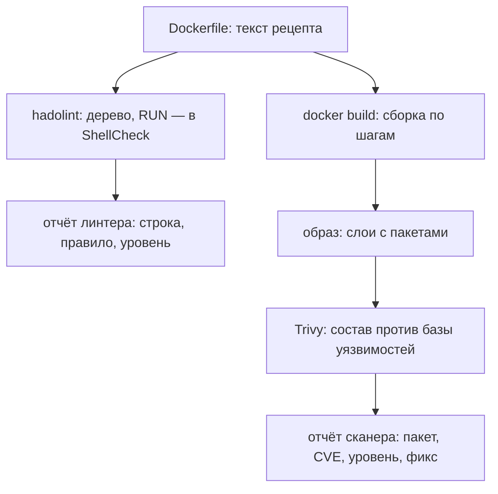

# hadolint и сканирование образов

Вот Dockerfile из пяти строк — учебный, но собранный из самых ходовых
ошибок. Dockerfile — это текстовый рецепт, по которому Docker собирает
образ приложения: каждая строка задаёт один шаг сборки, и результат
шага остаётся в образе. Читается он как инструкция по сборке шкафа:
взять основу, поставить инструмент, положить своё, назначить команду
запуска. Ошибка в пункте такой инструкции повторится в каждом образе,
собранном по этому рецепту.

```dockerfile
FROM debian:latest
RUN apt-get update && apt-get install -y curl && rm -rf /var/lib/apt/lists/*
WORKDIR /app
COPY app.py .
CMD curl https://example.com
```

Прогоним по рецепту линтер. Линтер — программа, которая читает текст
и находит в нём типовые ошибки формы, ничего не запуская и не собирая.
Ближайший бытовой аналог — проверка орфографии в редакторе: смысла она
не понимает, а однотипные ошибки подчёркивает мгновенно. Линтер для
Dockerfile называется hadolint:

```text
$ docker run --rm -i hadolint/hadolint < Dockerfile
-:1 DL3007 warning: Using latest is prone to errors …
-:2 DL3008 warning: Pin versions in apt get install …
-:2 DL3015 info: Avoid additional packages …
-:5 DL3025 warning: Use arguments JSON notation …
```

Текст сообщений сокращён по ширине. Четыре находки за секунду, до
всякой сборки. После сборки образ попадает ко второму инструменту —
сканеру Trivy из темы `trivy`: он читает не рецепт, а состав готового
образа. Прогон по образу python:3.12-slim, типовой основе питоновских
проектов, на день проверки дал 19 находок уровней HIGH и CRITICAL.
Линтер отвечает на вопрос «как собрано», сканер — «что внутри», и эта
тема учит читать вывод обоих.

Вот вопрос, на который вы ответите к концу темы. Секрет, переданный
в сборку и осевший в истории образа — а история — это запись каждого
шага сборки внутри образа, — какой из двух прогонов его покажет?

## Два взгляда на один артефакт

Вернёмся к аналогии со шкафом и расставим соответствия явно. Инструкция
по сборке — это Dockerfile, пункт инструкции — строка с глаголом
`FROM`, `RUN` или `CMD`. Состояние шкафа после пункта — слой образа,
а готовый шкаф — сам образ (слои вы знаете из темы `trivy`). Ломается
аналогия на разборке: по готовому шкафу порядок сборки не восстановить,
а образ хранит историю своих шагов — какие команды выполнялись и с
какими аргументами. Переданный при сборке секрет, например значением
инструкции `ARG`, остаётся в этой записи; как его оттуда достают,
разбирает тема `docker-secret-leaks`.

Почему инструментов два, а не один, видно из того, что каждый читает.
Линтер смотрит на рецепт: неявный тег, незафиксированная версия, не та
форма команды. Сканер смотрит на результат: какие пакеты реально попали
в образ и какие уязвимости им сопоставлены. Выбор тега в собранном
образе уже не читается как дефект — состав от него на момент сборки не
меняется, а меняется он при следующей сборке. И наоборот: версии,
которые реально приехали в образ, в тексте рецепта ещё не существуют.

**Зачем это в работе AppSec-инженера.** Образ — точка, где проверка
ещё дешёвая: до развёртывания, до реестра, до кластера. Реестр здесь —
хранилище собранных образов, откуда их забирают при развёртывании;
устройство реестров — тема `artifact-registries`. Линтер и сканер дают
два независимых прочтения одного артефакта, и умение читать их вывод —
рабочий навык ревьюера образов.

## Как это работает

**Откуда это взялось.** Dockerfile — текстовый рецепт, и его
проверяемость была заметна сразу. Первым шагом линтер разбирает текст
в синтаксическое дерево — структуру, где каждая строка становится
узлом с именем инструкции и её аргументами. Правила вроде «не latest»
и «не ADD по сети» пишутся уже по этому дереву. Проект hadolint
добавил к ним второй уровень: тело каждого RUN — это скрипт на языке
оболочки, и его разбирает ShellCheck, линтер shell-команд.

Сканер образов решает задачу, которую дерево не видит: что фактически
попало внутрь. Сканеру текст рецепта не нужен, он читает то, что
собралось. Его устройство — база уязвимостей и сопоставление пакетов —
разобрано в теме `trivy` и здесь не повторяется; новое место этой темы
— сам образ как объект проверки.

По такому дереву вопрос «есть ли FROM без явной версии» — короткий
запрос по структуре, а не поиск подстроки. По тексту слово latest
нашлось бы и в комментарии, а дерево тег от комментария отличает. Тело
RUN в дереве — один аргумент-строка, а внутри неё живёт целый скрипт;
его ошибки, например незакавыченную переменную, видит ShellCheck, а не
правила DLxxxx.

Оба пути одной темы — на схеме:



**Описание схемы.** Схема читается сверху вниз. От одного Dockerfile
расходятся две ветки. Левая — линтер, которому достаточно текста, и его
отчёт о форме рецепта. Правая — сборка, образ и сканер, читающий состав
образа, и его отчёт об известных уязвимостях. Отчёты разные, потому что
объекты разные: рецепт и результат сборки.

По схеме видно и почему линтер отвечает за секунду: ему нужен только
текст. Сканеру нужны собранный образ и база уязвимостей, которая
загружается при прогоне. Поэтому в конвейере линтер ставят раньше:
его находки дешевле всего.

## Что умеет и чего не умеет

**hadolint умеет** найти по дереву и по телу RUN ошибки формы: неявный
тег базового образа, незафиксированные версии пакетов, CMD не в
JSON-форме. Последнее значит, что команду запускает оболочка-посредник;
чем это грозит, разобрано у правила DL3025 ниже. Каждая такая находка —
предсказуемый дефект будущего образа: разные сборки из одного рецепта,
лишние пакеты, процесс без сигналов. Как читать конкретные коды — в
разделе «Как читать вывод».

**hadolint не видит** флаги запуска: privileged, сокет демона, cap-add
живут в команде `docker run` и в файлах описания запуска, а не в тексте
Dockerfile.
Это тема `docker-insecure-practices`. Не видит он и содержимое
образа: рецепт он не выполняет, поэтому не знает, какие версии пакетов
реально приехали. Не видит и намерение строки: зачем в образе curl и
нужен ли он там вообще — вопрос к автору рецепта, а не к линтеру. Из
текста Dockerfile он не выходит.

**Сканер умеет** перечислить пакеты образа и сопоставить им известные
уязвимости с уровнем и ссылкой на запись CVE. Это ровно тот режим
`image`, который разбирала тема `trivy`; здесь он поставлен в пару к
линтеру.

**Сканер не проверяет** ваш код, конфигурацию запуска, секреты в
истории образа (это тема `docker-secret-leaks`) и уязвимости, которых
ещё нет в базе. За пределы состава и базы он не выходит.

Посмотрите на четыре списка вместе: слепые зоны у инструментов не
пересекаются. Состав видит только сканер, форму рецепта — только
линтер, а описание запуска — никто из двух. Отсюда и раскладка по
маршруту: рецепт и образ здесь, запуск — в `docker-insecure-practices`.

## Как запустить

Оба прогона ниже выполнены образами самих проектов: ни линтер, ни
сканер не ставятся на хост, а приезжают контейнерами. Линтеру хватает
текста рецепта, и его подают на стандартный ввод:

```bash
docker run --rm -i hadolint/hadolint < Dockerfile
```

Флаг `-i` держит стандартный ввод открытым, чтобы линтер внутри
контейнера получил файл, а `--rm` удаляет контейнер после прогона.

Сканеру нужен сам образ, и он читает его у локального демона Docker
через сокет:

```bash
docker run --rm -v /var/run/docker.sock:/var/run/docker.sock \
  aquasec/trivy image --severity HIGH,CRITICAL python:3.12-slim
```

Сокет демона здесь отдан, чтобы сканер увидел локальные образы, — и
это ровно та находка из темы `docker-insecure-practices`: кто держит
сокет, тот управляет демоном. Допустима она только на своём стенде.

Прогон без порога остаётся отчётом, который никто не читает. Порог —
правило «сборка падает, если есть находка выше заданного уровня», и
устроен он на коде возврата; механику таких гейтов разбирает тема
`quality-gates`. У линтера порог задаёт флаг `--failure-threshold`.
Со значением `warning` сборку роняют находки уровня warning и выше, а
одиночная заметка info, как DL3015 из введения, прогон не уронит. У
сканера — связка `--exit-code 1` с фильтрами.
Фильтр `--severity HIGH,CRITICAL` сужает список по уровню. Фильтр
`--ignore-unfixed` оставляет только находки с выпущенным фиксом: по
ним есть что сделать немедленно.

Подавление оформляется записью, а не молчанием. У линтера это
комментарий с номером правила прямо в Dockerfile, у сканера — файл
`.trivyignore`. В обоих случаях к записи положены обоснование и срок
пересмотра — это пункт чеклиста ниже.

## Как читать вывод

Вывод линтера — строки вида «строка, правило, уровень, текст». Читается
он по коду правила: текст сообщения короткий и живёт на английском, а
код стабилен, и по нему правило ищется в списке из README проекта.
Разберём четыре находки из введения.

DL3007 на первой строке — тег latest. Тег — ярлык версии образа, и
владелец базового образа переставляет ярлык latest на каждую новую
сборку. Поэтому рецепт, собранный сегодня и через месяц, молча даст
разные образы. Чинится это фиксацией версии — тем же пиннингом, что
разбирала тема `transitive-dependencies`, только уровнем выше: пиннута
теперь не библиотека, а базовый образ.

DL3008 на второй строке — тот же дефект этажом ниже: версии пакетов не
зафиксированы, и завтра установщик `apt-get`, которым пользуется Debian,
отдаст другие. Рядом стоит DL3015 уровня info: установщик по умолчанию
тянет ещё и рекомендованные пакеты, и они раздувают образ. Уровень
info — не помехи, а заметки; при шуме их отсекают порогом, оставляя
warning и выше.

DL3025 с пятой строки стоит разобрать подробнее, потому что за ним
стоит механика. В shell-форме команду запускает оболочка, и главным
процессом контейнера становится она, а не ваша программа. Когда
контейнер останавливают, система шлёт главному процессу сигнал
SIGTERM — просьбу завершиться аккуратно. Оболочка сигнал дальше не
передаёт, программа остановки не замечает, и по таймауту её добивают
принудительно. В JSON-форме посредника нет: аргументы пишутся списком,
и сигнал доходит до самой программы. Бытовое соответствие —
распоряжение через секретаря, который не передаёт его исполнителю:
снаружи видно «распоряжение отдано», внутри никто не пошевелился.

Вывод сканера — таблица с колонками «пакет, CVE, уровень, состояние,
установленная версия, версия фикса»:

```text
Total: 19 (HIGH: 16, CRITICAL: 3)
│ gzip │ CVE-2026-41992 │ HIGH │ affected │ 1.13-1 │ …
```

Строки таблицы сокращены по ширине. Пакет — имя пакета операционной
системы внутри образа, CVE — номер записи об уязвимости в общей базе
(её устройство разбирает тема `cve-cvss`), уровень берётся из базы.
За ними следуют состояние, установленная версия — здесь 1.13-1 — и
версия фикса, обрезанная в этой строке многоточием. Решение по строке
принимается по паре «состояние, версия фикса».

Рабочих состояний три. Состояние affected без версии фикса — обновлять
не на что. Остаётся ждать с записанным обоснованием или менять базовый
образ: пакет сопровождает владелец базы, а не вы. Состояние
fix_deferred — фикс объявлен сопровождающими, но выпуск отложен: ждать
с датой пересмотра. Версия фикса есть — обновлять.

Ложное срабатывание у сканера выглядит так: пакет уязвим, но путь его
вызова в образе не задействован. Архиватор gzip из строки выше уязвим
при разборе чужого архива; если приложение архивы не принимает,
дотянуться до уязвимого кода извне нечем. Это знание о приложении, а
не о таблице, и его вносит человек, а не сканер.

Пропуск — обратная сторона: уязвимость, которой нет в базе на день
прогона. База загружается при каждом запуске, поэтому вчерашнее
«чисто» — снимок на день, а не свойство образа. Отсюда пункт чеклиста
про повторное сканирование по расписанию.

## Границы метода

Обе проверки — про образ, а не про запуск. Описание запуска они не
читают: флаги команды `docker run`, монтирования, манифест
развёртывания — файл с описанием того, как и где запускать образ.
Линтеру нет дела до команды запуска, сканеру — до того, куда образ
поедет. Проверки манифестов ждут дальше по маршруту.

Сканер отвечает на состав на день базы, линтер — на форму текста. Ни
один не отвечает на вопрос «а нужен ли этот пакет вообще». Это вопрос
состава, и его решает многоступенчатая сборка, при которой в итоговый
образ попадает только результат, без инструментов сборки, — тема
`docker-multistage-builds`.

Образ из чужого реестра обе проверки прогоняют, но доверия ему это не
добавляет: прогон показывает известное, а не происхождение. Образ со
свежей закладкой, которой нет ни в одной базе, пройдёт обе проверки
молча.

## Частая ошибка

Прежде чем читать опровержение, решите сами: прогон сканера зелёный —
образ можно публиковать?

Распространённый вывод: зелёный прогон сканера означает безопасный
образ.

**Сканер отвечает «известных уязвимостей не найдено», не больше.**
Механизм из раздела «Как это работает»: сопоставление с базой не видит
ни вашего кода, ни конфигурации запуска, ни уязвимостей вне базы.

Контрпример: образ с собственным бинарником, собранным из кода с
уязвимостью, — сканер молчит, потому что такого пакета в базе нет. И
обратно: 19 находок у slim-образа из введения — это повестка на
обновление базового образа, а не вердикт «образ нельзя использовать».
Обе крайности — одна и та же ошибка чтения: в первом случае молчание
прочитали как «чисто», во втором — наличие находок как «негодно».

## Чеклист для ревью

1. Проверьте, что каждый Dockerfile проходит hadolint, а замечания выше
   уровня info разобраны: линтер работает секунду, и находка в рецепте
   дешевле находки в готовом образе.
2. Проверьте, что каждый образ в поставке проходит сканер с порогом по
   уровню и наличию фикса: без порога прогон остаётся отчётом, который
   никто не читает.
3. Проверьте, что теги базовых образов пиннуты по версии
   (DL3006/DL3007): иначе две сборки одного рецепта молча дадут разные
   образы.
4. Проверьте, что сканирование повторяется по расписанию, а не только
   при сборке: база уязвимостей растёт ежедневно. Чистый на день сборки
   образ через месяц может оказаться находкой.
5. Проверьте, что подавленные находки линтера и сканера несут
   обоснование и срок пересмотра: подавление без даты — это заметание
   под ковёр.
6. Проверьте, что флаги запуска проверяются отдельно — линтером они не
   читаются (тема `docker-insecure-practices`).

## Попробуй сам

Возьмите Dockerfile и образ своего проекта или учебный Dockerfile из
введения и прогоните оба инструмента. Запишите: сколько находок у
линтера и по каким правилам, сколько у сканера и сколько из них с
доступным фиксом.

Одна подсказка: сканеру нужен локальный образ или имя в реестре;
линтеру достаточно текста Dockerfile на стандартном вводе.

**Критерий выполнения** наблюдаемый: два вывода собраны, и для каждой
находки сканера записано решение: обновить, подавить с обоснованием
или принять. Число находок без решений ничего не меняет: работа
начинается с решения по каждой строке.

## Проверь себя

1. Предскажите находки линтера по этому Dockerfile — какие правила
   сработают и на каких строках, и проверьте прогоном.

   ```dockerfile
   FROM debian
   RUN apt-get update && apt-get install -y curl
   CMD curl https://example.com
   ```

2. Прочитайте строку из вывода сканера: что у пакета есть, чего нет и
   какое решение из трёх здесь рабочее?

   ```text
   │ zlib1g │ CVE-2026-10418 │ HIGH │ affected │ 1.2.13 │  │
   ```

3. Почему зелёный прогон сканера не означает «образ можно публиковать»?
4. Секрет, осевший в истории образа при сборке, — какой из двух прогонов
   темы его покажет и почему?
5. Возврат к теме `trivy`: что сканирует trivy помимо образа и где это
   разобрано?
6. Возврат к теме `docker-insecure-practices`: какие две находки той
   темы не видны ни линтеру, ни сканеру?

<details markdown="1">
<summary>Ответ 1</summary>

1. На строке 1 — DL3006: тег не указан вовсе (явный `latest` дал бы
   DL3007). На строке 2 — DL3008: версии пакетов не зафиксированы, плюс
   заметки уровня info DL3009 и DL3015 про apt. На строке 3 — DL3025:
   CMD в shell-форме, процесс не получит сигналов. Команда для прогона:
   `docker run --rm -i hadolint/hadolint < Dockerfile`.

</details>

<details markdown="1">
<summary>Ответ 2</summary>

2. Уязвимость известна, уровень высокий, установленная версия на
   месте; нет версии фикса — колонка фикса в строке пуста. Рабочие
   решения: ждать с записанным обоснованием и сроком пересмотра, менять
   базовый образ на тот, где пакет новее, либо подавить с обоснованием.
   Обновить пакет нельзя: обновлять не на что.

</details>

<details markdown="1">
<summary>Ответ 3</summary>

3. Сканер отвечает ровно «известных уязвимостей не найдено»: он читает
   состав и сверяет с базой на день прогона. Вашего кода, конфигурации
   запуска, секретов в истории и уязвимостей вне базы он не видит — образ
   с собственным уязвимым бинарником пройдёт молча.

</details>

<details markdown="1">
<summary>Ответ 4</summary>

4. Никакой. Линтер читает текст Dockerfile и не выходит из него: значение
   ARG в истории — свойство собранного образа. Сканер читает состав
   образа — пакеты, — а историю не смотрит. Секрет в истории ловит
   третья проверка: `docker history` из темы `docker-secret-leaks`.

</details>

<details markdown="1">
<summary>Ответ 5</summary>

5. Зависимости и файловую систему репозитория — разобрано в теме этапа 2
   `trivy`; здесь объект проверки — сам образ. Один инструмент, разные
   объекты: репозиторий до сборки, образ после.

</details>

<details markdown="1">
<summary>Ответ 6</summary>

6. Примонтированный docker.sock и флаг privileged: оба — свойства
   запуска. Линтеру невидимы, потому что они живут в команде запуска или
   compose-файле, а не в тексте Dockerfile; сканеру — потому что состав
   образа они не меняют. Их проверяют глазами по чеклисту или
   политиками приёма в кластере — правилами admission, которые
   отклоняют небезопасный запуск.

</details>

## Источники

1. hadolint — репозиторий проекта; реестр `hadolint-repo`. Разделы:
   README со списком правил DL1xxx–DL4xxx, интеграция ShellCheck.
   <https://github.com/hadolint/hadolint>
2. Документация Trivy; реестр `trivy-docs`. Стартовая страница —
   оглавление: сканирование образов и уровни лежат на подстраницах.
   <https://trivy.dev/docs/latest/guide/>
3. Trivy, «Filtering»; реестр `trivy-filtering`. Разделы: фильтр по
   уровню и статусу фикса, подавление находок (.trivyignore).
   <https://trivy.dev/docs/latest/configuration/filtering/>

Каркас этапа: записи семейства man-* и якоря подраздела 4.2
(docker-engine-security, owasp-cs-docker) — наследуются всеми темами
подраздела.

**Скоропортящийся слой.** Номера правил hadolint, версии инструментов,
содержимое базы уязвимостей — всё быстроживущее; при ревизии прогоны
повторяются. Числа находок привязаны к дню и к версии образа.

**Маркеры уверенности.** **Проверено лично** 2026-09-01 на Arch Linux,
Docker 29.7.2: hadolint 2.15.1 (образ проекта) на учебном Dockerfile —
DL3007, DL3008, DL3015, DL3025; на Dockerfile с USER guest — DL3066;
DL3002 про root в версии 2.15.1 больше не выдаётся, проверено двумя
прогонами. Trivy 0.74.0 (образ проекта) на python:3.12-slim — Total: 19
(HIGH: 16, CRITICAL: 3), база загружена при прогоне. Устройство сканера
и границы базы — **по документации** (trivy-docs, открыта лично
2026-09-01). Список правил hadolint — **по README проекта** (открыт лично
2026-09-01). В конвейер обе проверки на этой миссии не ставились.
