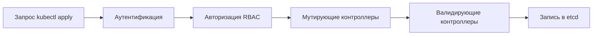

# Admission controllers: кто пропускает под в кластер

Уровень **L3** · время 10 мин (теория 8 / самопроверка 2, оценка)

Что прочитать сначала: `k8s-pod-security`.

Случай уже был нами виден. Тема про профили показала отказ кластера на
поде с privileged: true. Кто именно отказал? Не профиль — он список
полей. Отказал контроллер на пути записи: PodSecurity читает метку
пространства имён и профиль и отвечает Forbidden до того, как объект
записан. Тема дальше — об этом месте в пути запроса: где оно стоит,
чем мутирующий контроллер отличается от валидирующего и как туда
попадают собственные правила.

## 0. Коротко

Запрос к API-серверу проходит аутентификацию, авторизацию (RBAC из темы
`k8s-rbac`) и цепочку admission-контроллеров; записывается объект только
после всех троих. Контроллеры двух родов: мутирующие могут изменить
объект (дописать defaults), валидирующие — только принять или отклонить.
Pod Security Standards применяются встроенным контроллером PodSecurity;
свои правила навешиваются вебхуками (ValidatingAdmissionWebhook и
мутирующий парный) без пересборки API-сервера. Отказ приходит поэтому
до записи, и текст его называет правило, а не стадию.

**Зачем это в работе AppSec-инженера.** Это ответ на вопрос «а кто
вообще применяет наши политики». Запрет, который не стоит на пути
записи, не существует; ревьюеру важно отличать объявленную политику от
подключённой. Отказ из темы `k8s-pod-security` читается теперь точнее:
Forbidden пришёл от контроллера, а не от кластера вообще. И вопрос
«где это выключается» получает адрес: конфигурация API-сервера и список
вебхуков.

## 3. Механика

**Откуда это взялось.** Правила вроде «privileged нельзя» бесполезны как
договорённость: писать в API-сервер может всякий авторизованный. Контроль
должен стоять на самом пути записи. Ответом стала цепочка внутри
API-сервера: после ответов «кто пришёл» и «что ему можно» идёт вопрос
«а можно ли такой объект».

**Описание схемы.** Запрос идёт слева направо: кто пришёл, что ему можно,
затем цепочка контроллеров. Мутирующие идут первыми и могут изменить
объект; валидирующие видят итог и отвечают «принят» или «отклонён».
Записывается только прошедшее всё.

Разница родов в полномочии: мутирующий правит объект (вписать значение по
умолчанию), валидирующий только судит. Свои политики подключаются
вебхуком: API-сервер вызывает внешний сервис при записи и ждёт ответа.

### Вебхуки и их цена

Цена вебхука — доступность: недоступный сервис политики по умолчанию
блокирует или пропускает всё, и это выбор конфигурации (failurePolicy).
Встроенный PodSecurity вебхука не требует: он внутри API-сервера и
читает метки пространства имён из темы `k8s-pod-security`.

Порядок внутри цепочки значим: мутирующие идут раньше валидирующих,
чтобы судить уже дописанный объект. Пример первого рода — контроллер,
дописывающий значения по умолчанию в манифест; пример второго — отказ
PodSecurity из темы про профили. Путать их нельзя в обе стороны:
валидирующий, который молча поправил объект, скрыл от ревизии само
изменение.

Отсюда практический вывод для аудита кластера. Спросить «какие политики
у нас есть» — значит перечислить подключённые контроллеры и вебхуки,
а не документы команды. Список встроенных читается в конфигурации
API-сервера, вебхуки видны как объекты в кластере. Политика, которой
нет в этих двух местах, на запись не действует. Отдельно смотрят на
failurePolicy каждого вебхука: «пропускать при недоступности» превращает
отказ сервиса политики в открытую дверь.

## 13. Источники

1. Admission Controllers Reference, документация Kubernetes; реестр
   `k8s-admission-controllers`. Разделы: место в пути запроса, mutating
   и validating, вебхуки, PodSecurity.
   <https://kubernetes.io/docs/reference/access-authn-authz/admission-controllers/>
2. Pod Security Standards, документация Kubernetes; реестр
   `k8s-pod-security-standards`. Разделы: применение профилей через
   admission.
   <https://kubernetes.io/docs/concepts/security/pod-security-standards/>

Каркас этапа: записи семейства man-* и якоря подразделов — наследуются
всеми темами этапа 4.

**Маркеры уверенности.** Отказ контроллера PodSecurity — **проверено
лично** 2026-09-01 на kind v0.31.0, Kubernetes 1.35.0: под с privileged
отклонён с перечнем нарушений в пространстве с enforce=restricted и
принят без метки (прогон — в теме `k8s-pod-security`). Состав цепочки,
разница родов контроллеров, failurePolicy вебхуков — **по документации**
(admission-controllers, открыта лично 2026-09-01). Свой вебхук на стенде
не поднимался.
