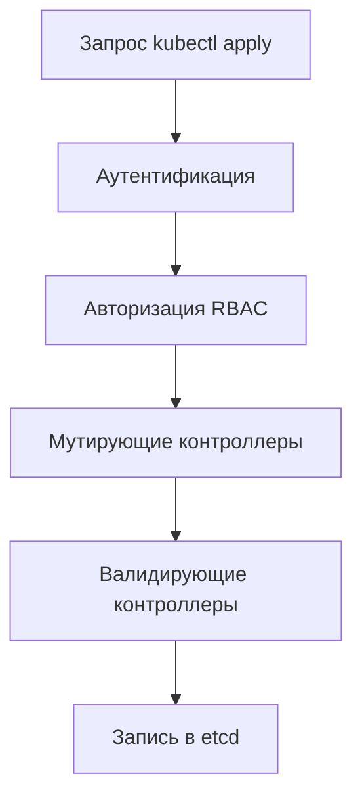

# Admission controllers: кто пропускает под в кластер

В теме `k8s-pod-security` был такой прогон: манифест пода с
`privileged: true` отправили в два пространства имён. Под меткой
enforce=restricted кластер ответил Forbidden и перечислил пять нарушений,
а без метки тот же под запустился. Кто именно отказал, там осталось за
кадром. Сам профиль отказать не может, потому что профиль — это список
запрещённых полей, а не исполнитель. Отказал механизм внутри кластера,
который прочитал метку и ответил ещё до записи объекта. Он называется
admission-контроль. Разберём, где стоит эта проверка, чем контроллер,
который правит объект, отличается от судящего, и как в цепочку попадают
правила команды.

## Куда попадает запрос к кластеру

Чтобы поставить проверку на пути записи, сначала посмотрим, какой путь
запрос вообще проходит. Кластер — это машины плюс общее состояние: какие
поды должны работать, из каких образов и с какими ограничениями. Состояние
хранится в etcd, базе данных вида «ключ-значение», которая для кластера —
единственный источник правды. Что записано в etcd, то кластер и считает
существующим; чего там нет, для кластера не существует.

Команда `kubectl apply`, с которой вы работали в прошлой теме, не говорит
с машинами напрямую. Она отправляет манифест в API-сервер — единственную
приёмную кластера. Через него проходят все запросы на чтение и изменение
состояния: планировщик и агенты узлов ходят тем же путём, а в etcd пишет
только API-сервер. Бытовое соответствие такое: etcd — главная книга
записей организации, API-сервер — единственное окно, через которое в книгу
вносят запись. Ломается аналогия в одном месте: окно не только записывает,
но и проверяет заявление, и эта проверка — предмет темы.

Для безопасности такое устройство — подарок. Запрет, поставленный в этом
окне, обойти нельзя, потому что другой дороги к записи нет. Запрет в любом
другом месте действует только на тех, кто идёт той дорогой. Например,
проверка манифестов в CI ловит то, что пришло из репозитория, но автора,
который пишет в API-сервер напрямую, она не встречает.

## Как это работает

**Откуда это взялось.** Правило вроде «privileged запрещён» бесполезно как
договорённость, потому что писать в API-сервер может всякий
авторизованный. Контроль должен стоять на самом пути записи. Ответом стала
цепочка проверок внутри API-сервера: после ответов на вопросы «кто пришёл»
и «что ему можно» задаётся третий — «можно ли такой объект».

Путь запроса состоит из трёх стадий. Сначала аутентификация: API-сервер
выясняет, кто пришёл, например сверяет токен учётной записи. Затем
авторизация: ролевая модель из темы `k8s-rbac` отвечает, что этому
субъекту можно. Последней стоит цепочка admission-контроллеров, и только
пройдя все три стадии, объект записывается в etcd. Отказ на любой из них
означает, что записи не было вовсе.

Admission-контроллер — это участок кода внутри API-сервера, который
смотрит на объект перед записью. Название значит «контроль допуска»: это
последнее место, где объект ещё можно остановить без последствий. До
записи отказ — это сообщение об ошибке автору манифеста, и больше ничего.
После записи был бы уже запущенный под, который пришлось бы искать и
гасить.

```mermaid
flowchart TB
    A[Запрос kubectl apply] --> B[Аутентификация]
    B --> C[Авторизация RBAC]
    C --> D[Мутирующие контроллеры]
    D --> E[Валидирующие контроллеры]
    E --> F[Запись в etcd]
```

**Описание схемы.** Запрос идёт сверху вниз: кто пришёл, что ему можно,
затем цепочка контроллеров. Мутирующие стоят первыми и могут изменить
объект; валидирующие видят уже итог и отвечают «принят» или «отклонён».
Записывается только то, что прошло все стадии.

Контроллеры бывают двух родов, и разница между ними — в полномочии.
Мутирующий вправе изменить объект: например, дописать в манифест значения
по умолчанию, которые автор не указал. Валидирующий только судит — принять
или отклонить, а править объект ему запрещено. Бытовое соответствие:
мутирующий — это сотрудник приёмной, который исправляет опечатку в вашем
заявлении, валидирующий — тот, кто ставит отметку «принято» или
«отказано», не трогая текста. Граница аналогии: исправленное заявление вам
отдают на подпись, а изменённый объект уходит дальше без переспроса.

Порядок внутри цепочки значим: мутирующие идут раньше валидирующих, чтобы
суд применялся к уже дописанному объекту. Если поменять порядок,
проверялось бы не то, что попадёт в etcd: после проверки объект ещё
изменится. Путать роды нельзя и в обратную сторону. Валидирующий, который
молча поправил объект, скрыл от ревизии само изменение: записано не то,
что прислали, и не то, что видел проверяющий.

Отказ из темы `k8s-pod-security` пришёл от встроенного валидирующего
контроллера PodSecurity. Он прочитал метку пространства имён, применил к
манифесту профиль и ответил Forbidden до записи. Поэтому текст отказа
называет нарушенные правила, а не стадию конвейера: автору манифеста
важно, что чинить, а не где стоял страж.

## Свои правила: вебхуки и их цена

Встроенные контроллеры покрывают то, что предусмотрели авторы Kubernetes.
Политику своей команды, например «образы только из нашего реестра», ими не
выразить. Для таких правил служат вебхуки. Вебхук — это адрес внешнего
сервиса: при записи объекта API-сервер вызывает сервис по HTTPS, передаёт
ему объект, и ответ решает судьбу записи. Подключаются вебхуки объектами
конфигурации: ValidatingAdmissionWebhook для судящего сервиса и
MutatingAdmissionWebhook для правящего. API-сервер пересобирать не нужно.

Вызов вебхука синхронный: запись ждёт ответа, и в этом цена механизма.
Если сервис политики не отвечает, поведение задаёт параметр failurePolicy.
Значение Fail отклоняет всё, значение Ignore пропускает всё. Это знакомый
выбор между fail-closed и fail-open из темы `fail-open-vs-fail-closed`,
только цена ошибки здесь кластерная. «Пропускать при недоступности»
превращает отказ сервиса политики в открытую дверь: запрет исчезает ровно
тогда, когда сервис уронили или заняли.

Встроенный PodSecurity вебхука не требует, потому что живёт внутри самого
API-сервера: читает метки пространства имён из темы `k8s-pod-security` и
никуда не звонит. Недоступен он только вместе с API-сервером, а без
API-сервера записи нет вовсе. Поэтому профили из прошлой темы работают без
отдельного сервиса, а за доступностью собственных политик придётся следить
самим.

## Как перечислить действующие политики

Отсюда практический вывод для аудита кластера. Спросить «какие политики у
нас есть» — значит перечислить подключённые контроллеры и вебхуки, а не
документы команды. Список встроенных контроллеров читается в конфигурации
API-сервера, а вебхуки видны как объекты в самом кластере. Политика,
которой нет в этих двух местах, на запись не действует, как бы громко ни
была объявлена. Отдельно смотрят failurePolicy каждого вебхука: отказ
сервиса политики не должен открывать дверь.

У мутирующих вебхуков есть и вторая цена для ревью. Если объект правится
на записи, то в etcd лежит не то, что лежит в репозитории команды.
Манифест в git может выглядеть безупречно, а работать будет изменённая
копия. Поэтому список мутирующих вебхуков читают так же внимательно, как
список валидирующих: каждый из них — место, где код расходится с ревью.

**Зачем это в работе AppSec-инженера.** Тема отвечает на вопрос «а кто
вообще применяет наши политики». Запрет, который не стоит на пути записи,
не существует, и ревьюеру важно отличать объявленную политику от
подключённой. Отказ из темы `k8s-pod-security` теперь читается точнее:
Forbidden пришёл от конкретного контроллера, а не от кластера вообще. И
вопрос «где это выключается» получает адрес: конфигурация API-сервера и
список вебхуков.

## Источники

1. Admission Controllers Reference, документация Kubernetes; реестр
   `k8s-admission-controllers`. Разделы: место в пути запроса, mutating
   и validating, вебхуки, PodSecurity.
   <https://kubernetes.io/docs/reference/access-authn-authz/admission-controllers/>
2. Pod Security Standards, документация Kubernetes; реестр
   `k8s-pod-security-standards`. Разделы: применение профилей через
   admission.
   <https://kubernetes.io/docs/concepts/security/pod-security-standards/>

Каркас этапа: записи семейства man-* и якоря подразделов — наследуются
всеми темами этапа 4.

**Маркеры уверенности.** Отказ контроллера PodSecurity — **проверено
лично** 2026-09-01 на kind v0.31.0, Kubernetes 1.35.0: под с privileged
отклонён с перечнем нарушений в пространстве с enforce=restricted и
принят без метки (прогон — в теме `k8s-pod-security`). Состав цепочки,
разница родов контроллеров, failurePolicy вебхуков — **по документации**
(admission-controllers, открыта лично 2026-09-01). Свой вебхук на стенде
не поднимался.
