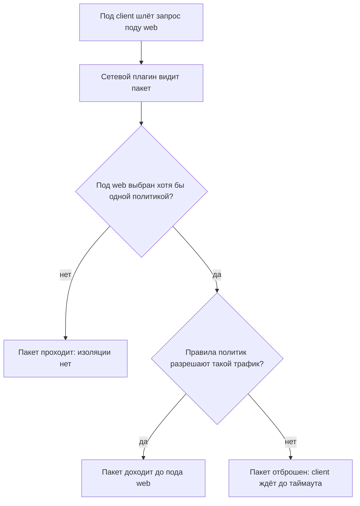

# Network policies: сетевая изоляция подов

Два пода в одном кластере, и под client читает страницу у пода web. Под —
минимальная единица развёртывания: один или два контейнера под общим
сетевым адресом, где контейнер — это процесс в изоляции, со своей
файловой системой. Кластер здесь — набор машин под управлением
Kubernetes, программы, которая запускает такие поды и следит, чтобы они
жили. Бытовой образ пода — квартира с одним номером телефона: жильцов
внутри может быть двое, а звонят всё равно в квартиру целиком. Поставим
политику «запретить входящий трафик всем подам сразу» и повторим запрос.
Не заглядывая в транскрипт, ответьте: второй запрос пройдёт или упадёт?

```text
$ kubectl exec client -- wget -q -T 3 -O- http://10.244.0.5/
<!DOCTYPE html>          # до политики
$ kubectl apply -f deny-all.yaml
networkpolicy.networking.k8s.io/deny-all created
$ kubectl exec client -- wget -q -T 3 -O- http://10.244.0.5/
wget: download timed out
```

Команды выполняет kubectl, консольный клиент кластера. Запись
`exec client -- wget` означает «запустить wget внутри пода client»,
а `10.244.0.5` — адрес пода web. Первый запрос вернул страницу, второй
упал по таймауту: три секунды прошли, ответа нет. При этом кластер
здоров и под web работает — молчит он потому, что политика велела
отбрасывать входящие пакеты. Прогон сделан на kind v0.31, Kubernetes
1.35: kind поднимает настоящий кластер локально, внутри Docker, как раз
для таких учебных экспериментов.

Политика — единственный механизм, которым кластер вообще умеет резать
трафик между подами. Две её оговорки обесценивают написанное молча:
«политика написана» превращается в проверяемый вопрос «а применилась
ли она». Транскрипт оставляет и второй вопрос. А если бы селектор
выбирал только под web — что изменилось бы для соседнего пода с базой
данных, который туда не попал?

## Как это работает

**Откуда это взялось.** Сеть кластера изначально плоская: любой под
может открыть соединение к любому, и запретов в ней нет. Так сделано
намеренно. Поды то и дело перезапускаются и переезжают между машинами,
и сеть, которую пришлось бы перенастраивать под каждую пару приложений,
стала бы главным тормозом развёртывания. Плата за плоскость — отсутствие
границ: процесс в одном поде может обратиться к базе данных в другом
напрямую. Тема `deny-by-default` даёт общий принцип «запрещено всё, что
не разрешено явно»; NetworkPolicy — его сетевая форма.

### Что описывает объект

Объект называется NetworkPolicy, сетевая политика. Она делает ровно две
вещи: выбирает поды и описывает разрешённый для них трафик. Выбор идёт
селектором, то есть фильтром по меткам. Метка — пара «ключ: значение»
на объекте кластера, как стикер на коробке при переезде. У пода web
стоит метка `app: web`, и селектор с этой парой выберет все поды с таким
стикером. И поды, и политики живут внутри пространства имён: это именованный
раздел кластера, папка с объектами одного приложения, и политика
действует внутри своей папки.

Дальше — главное правило темы, и в нём инверсия. Пока под не выбран ни
одной политикой, ему разрешено всё. Как только хотя бы одна политика
его выбрала, разрешено только то, что в ней написано. Запрет по
умолчанию из `deny-by-default` включается здесь не на кластер целиком,
а на каждый выбранный под в отдельности. Этим политика отличается от
прав темы `k8s-rbac`: те решают, кто что может сделать с объектами
через API, а политика режет сами пакеты между подами.

### Политика из введения

Вот она целиком — четыре строки смысла:

```yaml
# Файл целиком
apiVersion: networking.k8s.io/v1
kind: NetworkPolicy
metadata:
  name: deny-all
spec:
  podSelector: {}        # все поды пространства имён
  policyTypes: ["Ingress"]
```

Пустой селектор `{}` выбирает все поды пространства имён. Поле
`policyTypes` — перечень направлений, которые политика регулирует;
здесь оно одно, входящее. Ключа `ingress` в манифесте нет совсем,
а отсутствие ключа означает пустой список правил: раз не разрешено
ничего, входящий трафик запрещён целиком. Ровно это и увидел под
client во втором запросе. Если добавить в `policyTypes` значение
`Egress`, так же запретится исходящий.

Разрешение всегда пишется явно: от кого и в какие порты. Источник —
не обязательно соседний под: поля `namespaceSelector` и `ipBlock`
выбирают целое пространство имён или блок адресов, например офисную
подсеть. Настройка в проде выглядит так: запрет по умолчанию, а рядом
список разрешённых пар «под — под».

Из этой формы следует и порядок ведения политик. Разрешение — ещё одна
политика рядом, а не правка запрещающей. Правила разных политик
складываются: поду разрешено всё, что разрешила хотя бы одна из
выбравших его. Поэтому в пространстве имён сначала ставят deny-all для
всех, а потом открывают конкретные пары «кто — куда» отдельными
политиками. Если разрешающую политику потом убрать, под снова остаётся
под общим запретом.

### Кто исполняет политику

Осталось назвать исполнителя, потому что исполняет политику не сам
Kubernetes. Кластер трафика вообще не касается. Объект NetworkPolicy
принимает API-сервер — единственную точку входа всех команд кластера —
и сохраняет его в etcd, базе, где лежат все объекты кластера. А пакеты
между подами ходят через сетевой плагин, отдельную программу, которую
в кластер ставят для настройки сети. Стандартный разъём для таких
программ называется CNI, container network interface, «интерфейс сети
контейнеров».

Здесь работает бытовое сравнение с приказом и проходной. Кластер издаёт
политику и хранит её текст, а турникет, который решает, пустить или
нет, ставит отдельное охранное агентство — плагин. Соответствие прямое:
приказ — это объект NetworkPolicy, проходная — сетевой плагин,
сотрудники — пакеты между подами. Ломается сравнение в одном месте, и
это самое важное место темы: агентство может приказ проигнорировать,
и никто в дирекции об этом не узнает. К чему это приводит, разбирает
следующий раздел.



**Описание схемы.** Схема читается сверху вниз и показывает путь одного
пакета. Плагин смотрит, выбран ли под-получатель хотя бы одной
политикой. Если нет, пакет проходит, потому что изоляция включается
только выбором. Если да, решают правила: разрешённый трафик доходит,
остальной отбрасывается, и отправитель узнаёт об этом по таймауту.

## Две оговорки, которые видны только в прогоне

Первая оговорка отвечает на вопрос введения про под с базой данных,
и сперва честное уточнение. Показанный deny-all с пустым селектором
выбрал и базу тоже: её вход запрещён вместе со всеми. Гипотетическая
политика, выбирающая только под web, изменила бы для базы ровно ничего.
Политика существует только для подов, которых она выбрала, а под вне
всех селекторов открыт полностью. У плоской сети нет общего режима
защиты: изоляция включается для каждого пода отдельно, и список подов
без политик — это список открытых подов.

Вторая оговорка — про исполнителя. API-сервер принимает объект
NetworkPolicy всегда, потому что проверять умение плагина ему нечем.
На кластере, где плагин политики не поддерживает, объект спокойно лежит
в etcd и не делает ничего. Это класс дефекта «защита заявлена, но не
срабатывает», CWE-693 в каталоге Common Weakness Enumeration: внешне
всё настроено, а фактической изоляции нет. Поэтому фраза «политика
написана» сама ничего не говорит: её проверяют прогоном из введения,
запросом до политики и после неё.

Отдельно стоит замечание про журналы: оно меньше оговорок по масштабу.
Отказы политики журналируются не везде: записи пишет плагин, а не ядро, и
набор того, что попадает в журнал, у плагинов разный. По форме чтение
таких журналов относится к теме `linux-logs-audit-systemd`, но источник
записей там другой. Практический вывод: если на ревью спорят, срабатывает
ли политика, журнал может промолчать, и решает прогон.

**Зачем это в работе AppSec-инженера.** Это ответ на вопрос «а между
подами у нас вообще что-то запрещено». Обе оговорки — пустой набор
политик и неподдерживающий плагин — видны только в прогоне, а не в
манифесте, поэтому тема и ставит их рядом. На ревью спросить «какая
у нас политика» недостаточно: спрашивают ещё, какой в кластере плагин
и все ли поды кто-нибудь выбрал.

## Источники

1. Network Policies, документация Kubernetes; реестр
   `k8s-network-policies`. Разделы: селекторы, ingress и egress,
   изоляция по умолчанию, роль сетевого плагина.
   <https://kubernetes.io/docs/concepts/services-networking/network-policies/>
2. OWASP Kubernetes Security Cheat Sheet; реестр `owasp-cs-kubernetes`.
   Разделы: сетевая сегментация, минимальные политики.
   <https://cheatsheetseries.owasp.org/cheatsheets/Kubernetes_Security_Cheat_Sheet.html>

Каркас этапа: записи семейства man-* и якоря подразделов — наследуются
всеми темами этапа 4.

**Маркеры уверенности.** **Проверено лично** 2026-09-01 на kind v0.31.0,
Kubernetes 1.35.0 (сетевой плагин kindnet): запрос проходит до политики,
после deny-all падает по таймауту, после удаления политики проходит
снова. Список поддерживающих плагинов и семантика egress — **по
документации** (обе страницы открыты лично 2026-09-01). Поведение на
других плагинах (Calico, Cilium) **не прогонялось**: кластер один.
