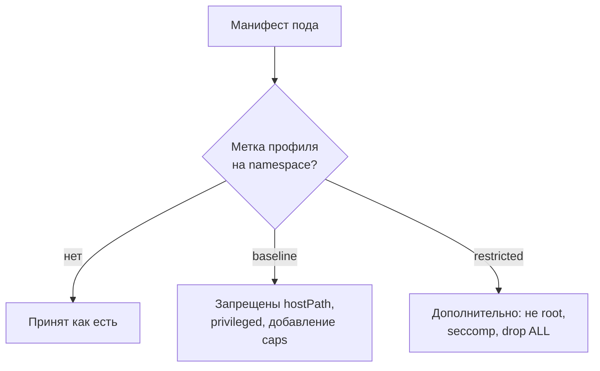

# Pod Security Standards и securityContext

Уровень **L2** · время 35 мин (теория 22 / задача 8 / самопроверка 5,
оценка)

Что прочитать сначала: `docker-insecure-practices`, `linux-file-permissions`.

Один и тот же манифест пода отправляется в два пространства имён. В первом
стоит метка enforce=restricted, во втором — ничего. Ответ кластера:

```text
$ kubectl -n locked apply -f privpod.yaml
Error from server (Forbidden): pods "privpod" is forbidden:
violates PodSecurity "restricted:latest": privileged (…),
allowPrivilegeEscalation != false (…), unrestricted capabilities (…),
runAsNonRoot != true (…), seccompProfile (…)
$ kubectl apply -f privpod.yaml
pod/privpod created
```

Текст отказа сокращён по ширине, перечень нарушений в нём полный.
Профиль запретил под целиком и перечислил все пять причин. Без метки тот
же под с privileged: true запустился и работает. Всё решила одна метка.
Это и есть тема: профили
строгости для пода и конфигурация, которая выглядит включённой, а не
срабатывает. Перенесите прогон на соседний профиль: тот же манифест
отправлен в пространство с меткой enforce=baseline — пройдёт он или
откажет, и по какой причине?

Дальше разберём три профиля, поля securityContext, которые они читают,
и где живёт переключатель. Применяет профиль admission-контроль — тема
`k8s-admission-controllers`; сами запреты унаследованы от темы
`docker-insecure-practices` и здесь не пересказываются.

## 0. Коротко

Pod Security Standards делят поды на три уровня. Privileged не запрещает
ничего. Baseline закрывает известные пути эскалации: hostPath,
hostNetwork, privileged, добавление capabilities. Restricted добавляет
к этому требования формы: runAsNonRoot, seccompProfile, drop ALL с
разрешением только NET_BIND_SERVICE обратно. Метка на пространстве имён
назначает профиль; без метки ограничений нет. Проверяет манифест
admission-контроль до записи объекта.

**Зачем это в работе AppSec-инженера.** securityContext встречается в
каждом манифесте, и ревью читает его по словарю профилей. Типовая
находка звучит как «privileged: true в проде», а типовой пропуск —
профиль, объявленный в документации команды и не включённый на
пространстве имён.

## 1. Цели

После этого раздела вы сможете:

1. Назвать три профиля Pod Security Standards и что каждый запрещает.
2. Прочитать securityContext пода и назвать снятые ограничения.
3. Показать отказ профиля restricted на живом кластере.
4. Найти пространство имён с объявленным, но неприменяемым профилем.

## 3. Механика

**Откуда это взялось.** Тема `docker-insecure-practices` показала, что
контейнер без срезов — это root на хосте. Кластеру нужно было ответить
на уровне выше: запретить опасные описания подов до их создания.
Ответом стал список запрещённых полей, собранный в три ступени
строгости, и точка применения — на пути записи объекта, а не после.

securityContext живёт на двух уровнях манифеста: у пода и у контейнера;
контейнерный побеждает. Поля в нём — те же срезы, что в теме про Docker.
Кем запущен процесс решают runAsNonRoot и runAsUser, какие capabilities
сняты — список drop, какой профиль seccomp применён — одноимённое поле.
Отдельно стоит allowPrivilegeEscalation: это no_new_privs из темы
`linux-logs-audit-systemd`, запрет поднять права после старта.
Модель разрешения — та же, что в теме
`linux-file-permissions`: читатель манифеста решает, кем станет процесс.

Профиль читается как накопление. Baseline запрещает эскалацию формы:
общий с хостом путь, сеть хоста, privileged, добавление capabilities.
Restricted требует явных срезов: не root, seccomp, drop ALL (CWE-250,
каталог Common Weakness Enumeration). Прохождение restricted означает,
что под уже несёт усиление, которое в Docker ставят руками.



**Описание схемы.** Манифест доходит до записи только через проверку
профиля пространства имён. Без метки проверки нет вовсе, с baseline
отклоняются известные пути эскалации, с restricted — ещё и манифесты без
явных срезов.

## 5. Как выглядит в коде

Ревьюер читает манифест пода и метку пространства. Два образца; в первом
собраны все пять причин отказа из введения — найдите их до чтения
разбора:

```yaml
# УЯЗВИМО — демонстрация, не для продакшена
securityContext:
  privileged: true
```

```yaml
# Проходит restricted
securityContext:
  allowPrivilegeEscalation: false
  runAsNonRoot: true
  runAsUser: 1000
  capabilities:
    drop: ["ALL"]
  seccompProfile:
    type: RuntimeDefault
```

Второй вариант проверен прогоном: под принят в пространстве с
enforce=restricted и работает под uid 1000. Первый отклонён с перечнем
из пяти нарушений — он во введении. Чтение этого перечня и есть рецепт
починки: каждая строка называет отсутствующее поле.

**Ложное срабатывание.** securityContext без runAsNonRoot у пода, чей
образ собран под не-root, — форма неполная, дефекта нет: процесс и так
не root. Смотрите на итоговый uid, а не на наличие строки. Обратная
пара: метка audit=restricted вместо enforce — под пускается, пишется
только предупреждение; для отчёта это «профиль объявлен, не применён».

## 6. Как чинится

Порядок один: поду дописывают срезы, пространству — метку. Срезы по
списку из блока «Как выглядит в коде»; метка —
pod-security.kubernetes.io/enforce с именем профиля. Начинать принято с
audit: предупреждения собираются неделю, читаются, разбираются, и только
потом метка переводится в enforce — иначе отказ мешает рабочим подам.

**Границы применимости.** Профиль не лечит содержимое образа и не видит
флагов вне манифеста; слой ниже — тема `docker-insecure-practices`.
Пода, которому по-настоящему нужен privileged (агент узла), restricted
не место — ему своё пространство имён с baseline и отдельное
обоснование. И режим warn/audit не запрет: он пишет предупреждение, а
пропускает всё.

## 9. Ловушка

Решите до опровержения: команда объявила в документации профиль
restricted — работает ли кластер под ним уже?

Распространённое представление: раз команда объявила профиль restricted,
кластер под ним работает.

**Профиль существует только в метке пространства имён.** Механизм из
блока «Механика»: проверяет admission при записи пода, а admission смотрит
метку, а не документ команды.

Контрпример из введения: тот же манифест в пространстве без метки
запустился. Декларация «у нас restricted» проверяется списком меток по
всем пространствам, а не презентацией.

## 10. Чеклист ревью

1. Verify that у каждого пространства имён с продуктовой нагрузкой стоит
   метка enforce (CWE-250).
2. Verify that профиль не ниже baseline, а для подов с чужим кодом —
   restricted.
3. Verify that ни один под вне известных исключений не несёт
   privileged, hostPath, hostNetwork, добавления capabilities.
4. Verify that у пода с restricted выставлены runAsNonRoot,
   allowPrivilegeEscalation: false, drop ALL и seccompProfile.
5. Verify that исключения (агенты узла) живут в отдельном пространстве
   имён с письменным обоснованием.
6. Verify that объявленный профиль проверен пробным манифестом, а не
   документом.

## 11. Задача

Возьмите учебный кластер (kind поднимается локально) и два пространства
имён: с меткой enforce=restricted и без. Прогоните в обоих манифест с
privileged: true и манифест из блока «Как выглядит в коде».

Одна подсказка: текст отказа перечисляет все нарушения разом — читайте
его как чеклист недостающих полей, а не как одну ошибку.

**Критерий выполнения** наблюдаемый: таблица из четырёх прогонов
(два пространства на два манифеста). В ней ровно один ответ «created»
без метки и ровно один — со срезами под меткой.

## 12. Проверь себя

1. Чем baseline отличается от restricted по ответу на манифест без
   securityContext?
2. Почему метка audit=restricted не считается включённым профилем?
3. Что проверяет admission и в какой момент пути запроса?
4. Кем будет процесс пода с runAsUser: 1000 внутри и снаружи?
5. Возврат к теме `docker-insecure-practices`: какие три практики
   Docker покрывают профили baseline и restricted?
6. Возврат к теме `linux-file-permissions`: чем runAsUser в манифесте
   отличается от chmod на файле образа?

<details markdown="1">
<summary>Ответы</summary>

1. Baseline пропустит: явных путей эскалации в пустом контексте нет.
   Restricted откажет: требуются явные срезы, а их нет.
2. Audit пишет предупреждение и пропускает под. Запрета нет, и вне
   журнала предупреждений конфигурация не отличима от выключенной.
3. Манифест пода против профиля пространства имён — до записи объекта.
4. Внутри — uid 1000; снаружи — тем же uid 1000 по тождественной карте,
   если не настроен userns-remap — переназначение uid контейнера на
   номера хоста (тема `docker-insecure-practices`).
5. Privileged, лишние capabilities и запуск от root; hostPath и
   hostNetwork у них общий смысл «выйти за пределы контейнера».
6. runAsUser решает, кем процесс запустится; chmod решает, кто может
   читать файлы образа. Первое — про запуск, второе — про доступ к
   содержимому.

</details>

## 13. Источники

1. Pod Security Standards, документация Kubernetes; реестр
   `k8s-pod-security-standards`. Разделы: три профиля, списки полей,
   метки на пространстве имён.
   <https://kubernetes.io/docs/concepts/security/pod-security-standards/>
2. OWASP Kubernetes Security Cheat Sheet; реестр `owasp-cs-kubernetes`.
   Разделы: securityContext, минимальные права пода.
   <https://cheatsheetseries.owasp.org/cheatsheets/Kubernetes_Security_Cheat_Sheet.html>

Каркас этапа: записи семейства man-* и якоря подразделов — наследуются
всеми темами этапа 4.

**Скоропортящийся слой.** Списки полей профилей дополняются от версии
к версии; метки и имена профилей стабильны. Версия кластера и kind — в
маркерах.

**Маркеры уверенности.** **Проверено лично** 2026-09-01 на kind v0.31.0,
Kubernetes 1.35.0: отказ restricted с перечнем из пяти нарушений, запуск
того же пода в пространстве без метки, запуск пода со срезами под
restricted (uid=1000 внутри). Составы профилей и семантика меток —
**по документации** (обе страницы открыты лично 2026-09-01). Режимы
warn и audit на кластере отдельно не прогонялись.
