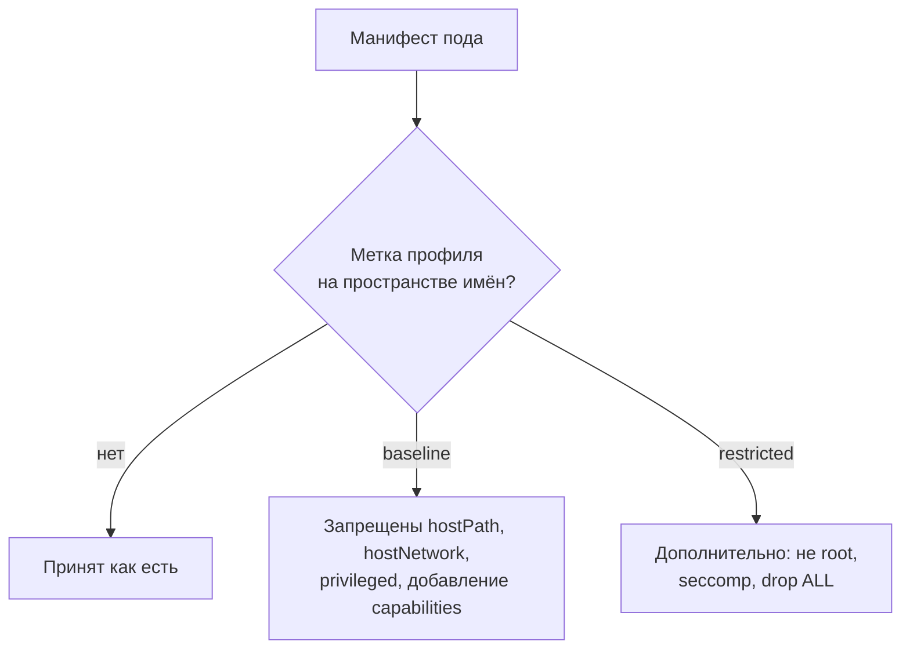

# Pod Security Standards и securityContext

Представьте гостиницу, где постояльцы — это программы. Кластер Kubernetes
устроен так же: связка машин и диспетчер, который размещает на них
контейнеры и следит, чтобы каждый работал по описанию. Описание называют
манифестом — это заявка «запусти такой-то образ с такими-то условиями»,
короткий YAML-файл. Заявки подают программой kubectl из командной строки.
Один и тот же манифест пода отправлен в два пространства имён: в первом
стоит метка enforce=restricted, во втором нет ничего. Ответы кластера
разные:

```text
$ kubectl -n locked apply -f privpod.yaml
Error from server (Forbidden): pods "privpod" is forbidden:
violates PodSecurity "restricted:latest": privileged (…),
allowPrivilegeEscalation != false (…), unrestricted capabilities (…),
runAsNonRoot != true (…), seccompProfile (…)
$ kubectl apply -f privpod.yaml
pod/privpod created
```

Разберём, что здесь произошло. Под — минимальная единица запуска в
кластере: один контейнер или несколько контейнеров, которые делят машину
и сеть; в гостинице это номер. Пространство имён — именованный отсек
кластера со своими правилами, этаж гостиницы; ключ `-n locked` выбрал
этаж locked. Метка — табличка на этаже, пара «имя=значение»:
enforce=restricted читается как «применяй профиль restricted к каждому
новому поду».

Текст отказа сокращён по ширине, а перечень нарушений в нём полный:
профиль запретил под целиком и назвал все пять причин. Без таблички тот
же под с `privileged: true` запустился и работает — всё решила одна
метка. Это и есть тема: три профиля строгости для пода и конфигурация,
которая выглядит включённой, а не срабатывает. Перенесите прогон на
соседний профиль, не читая дальше: тот же манифест отправлен в
пространство с меткой enforce=baseline — пройдёт он или откажет, и по
какой причине? Ответ стоит в конце раздела «Как это работает».

## Как это работает

**Откуда это взялось.** Тема `docker-insecure-practices` показала:
контейнер без срезов — это root на хосте, потому что карта uid по
умолчанию тождественная. Кластеру нужен был ответ уровнем выше — не
ловить опасный запуск последствиями, а запретить опасное описание пода
до его создания. Ответом стали Pod Security Standards: список запрещённых
и требуемых полей, собранный в три ступени строгости. Проверять их решено
при записи объекта — записи о чём-либо в кластере, здесь о поде, — то
есть до того, как под появился.

Проверяет заявку admission-контроль — цепочка проверок внутри
API-сервера, сердца кластера; её устройство разбирает тема
`k8s-admission-controllers`. Здесь важно одно её свойство: проверка стоит
до записи объекта. Отказанный под не «запустился и упал», а не появился
вовсе, поэтому отказ не роняет уже работающую нагрузку. В гостинице это
администратор на стойке: он сверяет заявку с правилами этажа до выдачи
ключа. Полное соответствие аналогии:

| В гостинице | В кластере |
|---|---|
| Заявка на заселение | Манифест пода |
| Администратор сверяет заявку до выдачи ключа | Admission-контроль проверяет манифест до записи |
| Этаж со своими правилами | Пространство имён |
| Табличка с правилами на этаже | Метка enforce с именем профиля |
| Номер с постояльцем | Под с контейнером |

**Где аналогия ломается.** В гостинице постоялец может нарушить правило
уже после заселения, и его выселят задним числом. В кластере метка
действует один раз, в момент подачи манифеста: уже работающие поды она
не трогает. Поэтому поставить метку сегодня — не значит проверить то,
что запущено вчера.

Сами срезы живут в секции securityContext манифеста. Она пишется на двух
уровнях — у пода целиком и у каждого контейнера, и контейнерный вариант
побеждает подовый. Поля секции вам уже знакомы: это те же срезы из темы
`docker-insecure-practices`, переложенные с флагов запуска в YAML.
Соответствие можно повторить руками, хватит любого локального образа:

```text
$ docker run --rm --user 1000:1000 --cap-drop ALL \
    --security-opt no-new-privileges python:3.12-slim id
uid=1000 gid=1000 groups=1000
```

Три флага здесь — это поля securityContext. `--user 1000:1000`
соответствует runAsUser: 1000 в паре с runAsNonRoot: true.
`--cap-drop ALL` соответствует списку drop в поле capabilities.
`--security-opt no-new-privileges` соответствует
allowPrivilegeEscalation: false. Процесс внутри запустился с uid 1000,
без единой capability и без возможности поднять права после старта.

Поля стоит знать по именам:

- runAsNonRoot и runAsUser решают, кем запущен процесс. Вопрос «кем
  станет процесс» уже вставал в теме `linux-setuid`: там его решал бит на
  файле программы, здесь его решает автор манифеста.
- Поле capabilities со списком drop снимает capabilities — дробные куски
  полномочий root. Читать их набор учит тема `docker-insecure-practices`,
  а устройство разбирает `linux-capabilities`.
- seccompProfile выбирает фильтр системных вызовов — список обращений к
  ядру, которые процессу разрешены. Значение RuntimeDefault — стандартный
  список контейнерной среды.
- allowPrivilegeEscalation: false запрещает процессу поднять права после
  старта. Это флаг ядра no_new_privs, и его действие видно в файле
  /proc/self/status.

Сравните два прогона, без флага и с ним:

```text
$ docker run --rm python:3.12-slim grep NoNewPrivs /proc/self/status
NoNewPrivs: 0
$ docker run --rm --security-opt no-new-privileges \
    python:3.12-slim grep NoNewPrivs /proc/self/status
NoNewPrivs: 1
```

С флагом значение стало единицей: процесс больше не получит новых прав,
даже если запустит программу с битом setuid из темы `linux-setuid`. Тот
же рубильник в systemd называется NoNewPrivileges=, и его разбирает тема
`linux-logs-audit-systemd`.

Теперь сами профили. Их три, и читаются они накоплением:

- **privileged** — профиль-заглушка, он не запрещает ничего. Не путайте
  его с полем privileged: true: профиль говорит «на этаже разрешено всё»,
  а поле просит все права сразу для одного контейнера.
- **baseline** закрывает известные пути эскалации. Это hostPath
  (монтирование каталога хоста внутрь пода — чужие файлы как свои),
  hostNetwork (под делит сеть с хостом), поле privileged и добавление
  capabilities.
- **restricted** добавляет требования формы: runAsNonRoot: true,
  allowPrivilegeEscalation: false, seccompProfile и drop ALL. Обратно
  разрешено вернуть только NET_BIND_SERVICE — capability, которая
  позволяет занять порт с номером ниже 1024.

Запрет поднимать лишние полномочия — это CWE-250, пункт каталога типовых
слабостей (Common Weakness Enumeration). Как такие номера связываются с
публичными уязвимостями, разбирает тема `cve-cvss`. За этим пунктом
стоят все четыре среза restricted. Под,
прошедший restricted, уже несёт на себе то усиление, которое в Docker
ставят руками, — вы видели его тремя флагами в прогоне этого раздела.

Теперь ответ на вопрос из введения. Тот же манифест в пространстве
enforce=baseline получит отказ, но по одной причине: поле
privileged: true входит в список baseline. Остальные четыре строки
перечня — требования формы, и их добавляет только restricted.


```mermaid
flowchart TB
    A[Манифест пода] --> B{Метка профиля<br/>на пространстве имён?}
    B -- нет --> C[Принят как есть]
    B -- baseline --> D
    B -- restricted --> E
D[Запрещены hostPath, hostNetwork,<br/>privileged, добавление capabilities]
E[Дополнительно: не root,<br/>seccomp, drop ALL]
```

**Описание схемы.** Схема читается сверху вниз. Манифест доходит до
записи только через проверку профиля пространства имён. Без метки
проверки нет вовсе, с baseline отклоняются известные пути эскалации, с
restricted — ещё и манифесты без явных срезов.

**Зачем это в работе AppSec-инженера.** securityContext встречается в
каждом манифесте, и ревью читает его по словарю профилей. Типовая находка
звучит как «privileged: true в проде», а типовой пропуск — профиль,
объявленный в документации команды и не включённый на пространстве имён.
Второе опаснее: находку видно прямо в манифесте, а пропуск заметен
только в расхождении документа с кластером.

## Как это выглядит в коде

Ревьюер читает манифест пода и метку пространства. Вот два образца
securityContext. В первом собраны все пять причин отказа из введения —
найдите их до чтения разбора:

```yaml
# УЯЗВИМО — демонстрация, не для продакшена
securityContext:
  privileged: true
```

```yaml
# Проходит restricted
securityContext:
  allowPrivilegeEscalation: false
  runAsNonRoot: true
  runAsUser: 1000
  capabilities:
    drop: ["ALL"]
  seccompProfile:
    type: RuntimeDefault
```

Пять причин при одном-единственном поле получились так. Поле
privileged: true — само первая причина. Остальные четыре — это поля,
которых в образце нет: allowPrivilegeEscalation не выставлен в false,
capabilities не сняты, runAsNonRoot не требован, seccompProfile не
выбран. Поэтому текст отказа читается не как одна ошибка, а как чеклист
недостающих полей: дописываете строку — и повторяете apply. Второй
образец проверен прогоном: под принят в пространстве с enforce=restricted
и работает под uid 1000.

**Ложное срабатывание.** securityContext без runAsNonRoot у пода, чей
образ собран под не-root, — форма неполная, а дефекта нет: процесс и так
не root. Смотрите на итоговый uid, а не на наличие строки; uid виден в
выводе id, как в прогоне раздела «Как это работает». Есть и обратная
пара: метка audit=restricted вместо enforce пускает под и пишет только
предупреждение. Для отчёта это «профиль объявлен, не применён».

## Как защититься

Порядок один: поду дописывают срезы, пространству — метку. Срезы берутся
по списку из раздела «Как это выглядит в коде», а метка называется
`pod-security.kubernetes.io/enforce` и держит имя профиля. Почему порядок
именно такой, видно из механики: проверяет манифест admission, а читает
он метку. Если поставить enforce на пространство, чьи поды без срезов,
первый же перезапуск рабочего пода получит отказ.

Поэтому начинать принято с режима audit. Режимов записи три. enforce
отклоняет под, warn отвечает предупреждением тому, кто подал манифест,
audit пишет предупреждение в журнал аудита кластера. Неделю предупреждения
собирают, читают и разбирают, и только потом метку переводят в enforce —
так отказ не встречает рабочие поды врасплох. Цена вопроса видна из
устройства режимов: warn и audit ничего не запрещают, под проходит, а
факт нарушения остаётся строкой, которую ещё надо прочитать.

**Границы применимости.** Профиль не лечит содержимое образа и не видит
флагов вне манифеста — этот слой ниже, и его разбирает тема
`docker-insecure-practices`. Поду, которому по-настоящему нужен
privileged, в restricted места нет. Например, агенту узла — отдельной
машины кластера, обслуживающему сам кластер, — выделяют своё пространство
имён с baseline и письменным обоснованием.

## Частая ошибка

Команда объявила в документации: наше пространство имён работает под
профилем restricted. Работает ли кластер под ним уже? Решите сами до
чтения дальше.

Ответ «да» читается из документа: раз профиль объявлен, он и применяется.
Это неверно, и контрпример — во введении темы: тот же манифест в
пространстве без метки запустился, несмотря ни на какие документы.
Профиль существует только в метке пространства имён, потому что admission
при записи пода смотрит метку, а не презентацию команды. Декларация «у
нас restricted» проверяется списком меток по всем пространствам и пробным
манифестом из раздела «Попробуй сам».

## Чеклист для ревью

На ревью пройдите по списку.

1. Проверьте, что у каждого пространства имён с продуктовой нагрузкой стоит
   метка enforce (CWE-250).
2. Проверьте, что профиль не ниже baseline, а для подов с чужим кодом —
   restricted.
3. Проверьте, что ни один под вне известных исключений не несёт
   privileged, hostPath, hostNetwork, добавления capabilities.
4. Проверьте, что у пода с restricted выставлены runAsNonRoot,
   allowPrivilegeEscalation: false, drop ALL и seccompProfile.
5. Проверьте, что исключения (агенты узла) живут в отдельном пространстве
   имён с письменным обоснованием.
6. Проверьте, что объявленный профиль проверен пробным манифестом, а не
   документом.

## Попробуй сам

Возьмите учебный кластер kind — он весь живёт в одном Docker-контейнере
на вашей машине — и два пространства имён: одно с меткой
enforce=restricted, второе без метки. Подготовка — четыре команды:

```text
$ kind create cluster --name pss
$ kubectl create namespace locked
$ kubectl label namespace locked \
    pod-security.kubernetes.io/enforce=restricted
$ kubectl create namespace open
```

Первая команда поднимает кластер, вторая и четвёртая создают этажи
locked и open, третья вешает на locked табличку enforce=restricted.
Прогоните в обоих пространствах манифест с `privileged: true` и манифест
со срезами из раздела «Как это выглядит в коде».

Одна подсказка: текст отказа перечисляет все нарушения разом. Читайте его
как чеклист недостающих полей, а не как одну ошибку.

**Критерий выполнения** наблюдаемый: таблица из четырёх прогонов — два
пространства на два манифеста. В ней ровно один ответ «created» без
метки и ровно один — со срезами под меткой.

## Проверь себя

1. Манифест с таким контекстом отправляется в пространство с меткой
   enforce=restricted. Предскажите ответ admission и проверьте прогоном.

   ```yaml
   securityContext:
     runAsNonRoot: true
     allowPrivilegeEscalation: false
     seccompProfile:
       type: RuntimeDefault
   ```

2. Прочитайте метки пространства имён: работает ли в нём профиль
   restricted?

   ```text
   $ kubectl get ns shop -o jsonpath='{.metadata.labels}'
   {"pod-security.kubernetes.io/audit":"restricted","team":"shop"}
   ```

3. Ревью нашло под с `privileged: true` в продуктовом пространстве без
   меток; команда хочет перевести его на restricted. Выберите починку:

   А. Объявить в документации команды, что пространство работает под
      restricted.

   Б. Дописать поду срезы и поставить пространству метку enforce,
      начав с недели в режиме audit.

   В. Поставить пространству метку enforce=restricted, манифест пода
      не трогать.

4. Почему под без единой строки securityContext проходит baseline, но
   получает отказ от restricted?
5. Возврат к теме `docker-insecure-practices`: какие три практики Docker
   покрывают профили baseline и restricted?
6. Возврат к теме `fail-open-vs-fail-closed`: режимы audit и warn у
   профиля — это fail-open или fail-closed, и когда такой режим оправдан?

<details markdown="1">
<summary>Ответ 1</summary>

1. Отказ: restricted требует ещё и `capabilities: drop: ["ALL"]`, а его
   здесь нет; в тексте отказа эта причина названа строкой «unrestricted
   capabilities». Команда для прогона: `kubectl -n locked apply -f
   pod.yaml` в пространстве с меткой enforce=restricted — тем же приёмом
   во введении отклонён под с пятью нарушениями. Текст отказа — чеклист
   недостающих полей: дописываете строку, повторяете apply.

</details>

<details markdown="1">
<summary>Ответ 2</summary>

2. Нет. Метка audit пишет предупреждение и пропускает под; запрет даёт
   только enforce. Для отчёта это «профиль объявлен, не применён»: вне
   журнала предупреждений конфигурация неотличима от выключенной, и
   пробный манифест это подтвердит — он запустится.

</details>

<details markdown="1">
<summary>Ответ 3: разбор вариантов</summary>

3. Верен Б. Разбор каждого:

   А. Профиль существует только в метке пространства имён: проверяет
      admission при записи пода, а смотрит он метку, а не документ
      команды. Декларация проверяется списком меток, а не презентацией.

   Б. Сначала audit: неделя предупреждений показывает, что сломается;
      затем под получает срезы — runAsNonRoot, allowPrivilegeEscalation:
      false, drop ALL, seccompProfile, — и метка переводится в enforce.
      Отказ приходит до записи объекта, и рабочие поды его не встречают.

   В. Под без срезов получит отказ при первом же пересоздании: метка
      применяется к манифесту как есть. Порядок «метка вперёд, манифест
      потом» кладёт рабочую нагрузку первым же отказом.

</details>

<details markdown="1">
<summary>Ответ 4</summary>

4. Профили отвечают на разные вопросы. Baseline запрещает перечисленное
   опасное: общий с хостом путь, сеть хоста, privileged, добавление
   capabilities — в пустом контексте ничего этого нет, и запрещать
   нечего. Restricted требует перечисленное безопасное: явный не-root,
   seccomp, drop ALL, — а требовать приходится то, чего в манифесте нет.

</details>

<details markdown="1">
<summary>Ответ 5</summary>

5. Privileged, лишние capabilities и запуск от root: baseline закрывает
   первые два вместе с hostPath и hostNetwork. Restricted добавляет
   обязательный не-root и срез capabilities до drop ALL. Профиль — это те
   же срезы из темы про Docker, перенесённые с флагов запуска на манифест
   и применяемые до записи объекта.

</details>

<details markdown="1">
<summary>Ответ 6</summary>

6. Fail-open: при «сбое» политики под пропускается, а событие пишется
   предупреждением. Оправдан он переходом: неделя в audit собирает, что
   сломает будущий enforce, и это единственный срок, когда fail-open
   здесь уместен. Постоянный audit — выключенный профиль с журналом.

</details>

## Источники

1. Pod Security Standards, документация Kubernetes; реестр
   `k8s-pod-security-standards`. Разделы: три профиля, списки полей,
   метки на пространстве имён.
   <https://kubernetes.io/docs/concepts/security/pod-security-standards/>
2. OWASP Kubernetes Security Cheat Sheet; реестр `owasp-cs-kubernetes`.
   Разделы: securityContext, минимальные права пода.
   <https://cheatsheetseries.owasp.org/cheatsheets/Kubernetes_Security_Cheat_Sheet.html>

Каркас этапа: записи семейства man-* и якоря подразделов — наследуются
всеми темами этапа 4.

**Скоропортящийся слой.** Списки полей профилей дополняются от версии
к версии; метки и имена профилей стабильны. Версия кластера и kind — в
маркерах.

**Маркеры уверенности.** **Проверено лично** 2026-09-01 на kind v0.31.0,
Kubernetes 1.35.0: отказ restricted с перечнем из пяти нарушений, запуск
того же пода в пространстве без метки, запуск пода со срезами под
restricted (uid=1000 внутри). Соответствие полей securityContext флагам
Docker и значение NoNewPrivs в /proc/self/status **проверены лично**
2026-10-03 на Docker 29.8.1, образ python:3.12-slim. Составы профилей,
семантика меток и поведение режимов warn и audit — **по документации**
(обе страницы открыты лично 2026-09-01); сами режимы на кластере
отдельно не прогонялись.
