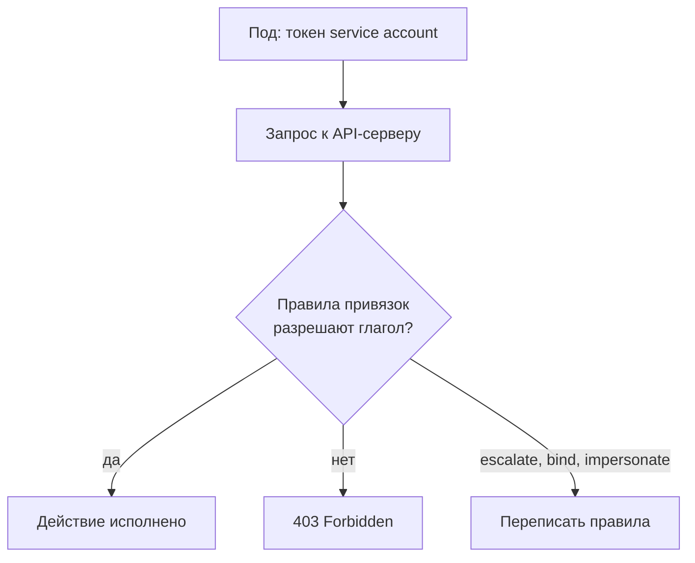

# Kubernetes RBAC и service accounts

Уровень **L2** · время 35 мин (теория 22 / задача 8 / самопроверка 5,
оценка)

Что прочитать сначала: `access-control-models`, `deny-by-default`.

Учётной записи deployer выдали роль из одного правила. Проверим на живом
кластере (kind v0.31, Kubernetes 1.35), что она разрешает:

```text
$ kubectl auth can-i escalate roles \
    --as=system:serviceaccount:default:esc-sa
yes
$ kubectl auth can-i delete pods \
    --as=system:serviceaccount:default:esc-sa
no
```

У записи нет права удалять поды, но есть право escalate: она может
расширять роли. Расширить — значит дописать себе любое право, включая
удаление подов. Разрешение «почти пустое», а итог — администратор.
Не заглядывая в транскрипт, назовите, какой из двух ответов can-i —
yes на escalate или no на delete pods — точнее описывает реальные права
этой записи?

Если вы писали манифесты с Role и RoleBinding, эта форма вам знакома.
Дальше разберём, из чего складывается право в кластере, какие глаголы
опасны и как токен service account оказывается в поде.

## 0. Коротко

RBAC в Kubernetes аддитивен: право — это глагол над ресурсом, запретов
нет, и не запрещено то, что не разрешено. Роль (Role в пространстве имён,
ClusterRole в кластере) собирает правила, привязка (RoleBinding,
ClusterRoleBinding) отдаёт их субъекту — пользователю, группе или
service account.
Три глагола — escalate, bind, impersonate — разрешают обход самой модели:
расширить свою роль, отдать чужую роль, выступить чужим именем. Токен
service account монтируется в под по умолчанию и открывает ровно права
своей привязки. Каждый из четырёх фактов — самостоятельная находка
ревью.

**Зачем это в работе AppSec-инженера.** Манифесты RBAC — постоянный
предмет ревью кластера, и находка в них компактна: одна строка с глаголом.
Спор «зачем вашему деплою escalate» решается тем, что это право не про
поды, а про саму модель прав.

## 1. Цели

После этого раздела вы сможете:

1. Прочитать правило RBAC и назвать, что оно разрешает.
2. Показать на кластере, что даёт глагол escalate.
3. Объяснить, как токен service account попадает в под и что он
   открывает.
4. Найти в манифесте роль с эскалацией до администратора.

## 3. Механика

**Откуда это взялось.** Кластеру нужен ответ на вопрос «кто может что
сделать с каким объектом». Модель доступа разобрана в теме
`access-control-models`; здесь её конкретная форма: права собираются
по глаголам над ресурсами, запретов не бывает. Тема `deny-by-default`
даёт основание: молчание роли — отказ. Опасны не разрешённые глаголы,
а те, что меняют саму модель.

Правило — тройка: группа API, ресурс, глаголы. Роль — набор правил.
Привязка соединяет роль с субъектом. Субъект — пользователь, группа или
service account; встроенная группа system:authenticated — это все
вошедшие разом, и привязка к ней отдаёт роль всему кластеру. Service
account — учётная запись для процесса в поде. Её токен по умолчанию
монтируется в под по пути
/var/run/secrets/kubernetes.io/serviceaccount, и процесс пода ходит в
API-сервер с правами её привязок. Прочитать его может всякий, кто
исполняет код в поде, — и это заметная часть цены компрометации пода.

Три глагола стоят особняком, потому что действуют на саму модель.
Глагол escalate разрешает править роли — то есть дописать себе что
угодно. Глагол bind разрешает привязать чужую роль себе. Глагол
impersonate разрешает говорить API-серверу от чужого имени. Каждый
обходит deny-by-default не через запрет, а через право переписать
разрешения. Это CWE-269 (каталог Common
Weakness Enumeration), управление привилегиями; роль с избыточными
глаголами — CWE-266.



**Описание схемы.** Под предъявляет токен, API-сервер сверяет глагол
запроса с правилами привязок. Обычный исход — исполнение или отказ.
Особый — глаголы, которые разрешают править саму модель: после них
сверка теряет смысл.

## 5. Как выглядит в коде

Ревьюер читает манифесты. Находок три; две из них видны в листинге —
назовите их до чтения выносок:

```yaml
# УЯЗВИМО — демонстрация, не для продакшена
rules:
- apiGroups: ["*"]          # (1)
  resources: ["*"]
  verbs: ["*"]
- apiGroups: ["rbac.authorization.k8s.io"]   # (2)
  resources: ["roles"]
  verbs: ["escalate"]
```

1. Звёзды по всем трём осям: администратор без слова admin.
2. Глагол над моделью: роль с ним — это право стать администратором,
   с ответом «да» на любой can-i.

Третья находка без YAML: service account без явного
automountServiceAccountToken: false. Умолчание монтирует токен в каждый
под записи, и всякий, кто исполнит код в поде, получает её права. Проверено
на кластере: поле пустое — монтирование включено.

**Ложное срабатывание.** Широкая Role в пустом пространстве имён без
секретов и нагрузки — форма та же, цены нет. Смотрите на то, что в
пространстве лежит, и на то, кто носит привязку.

## 6. Как чинится

Правило одно: роль собирается из того, что делает код, а не из того, что
пригодится. Глаголы escalate, bind, impersonate в обычной роли не нужны
никогда. Токен не монтируется туда, где API не вызывается:

```yaml
# Исправлено
automountServiceAccountToken: false
```

Проверка фикса — `kubectl auth can-i` от имени записи по каждому глаголу
роли, включая три опасных. Ожидаемый ответ на них — no.

**Границы применимости.** Права, собранные по минимуму, ломаются при
расширении функции: сервису понадобилось читать ConfigMap — роль растёт
осознанно, а не звёздой. Кластерные роли (cluster-admin и системные)
встроены и нужны компонентам кластера; ревью касается своих ролей и
своих привязок.

## 9. Ловушка

Прикиньте до разбора: роль без delete и create — уже безобидна?

Так рассуждают: права в кластере опасны глаголами
delete и create, а редакторские роли без них безобидны.

**Опасны глаголы, которые правят саму модель.** Механизм из блока
«Механика»: escalate и bind не удаляют ничего, они меняют правила, по
которым что-то удаляется.

Контрпример из введения: записи нельзя удалять поды, но можно escalate —
и через два вызова она администратор: дописывает себе роль, проверяет
can-i заново.

## 10. Чеклист ревью

1. Verify that ни одна своя роль не содержит escalate, bind, impersonate
   (CWE-269).
2. Verify that звёзд по осям нет: группа, ресурс и глаголы перечислены
   явно (CWE-266).
3. Verify that у service accounts без нужды в API стоит
   automountServiceAccountToken: false.
4. Verify that ClusterRoleBinding привязаны к сервисным учёткам, а не
   к широким группам.
5. Verify that каждое право в роли отвечает на вызов, который код делает
   на самом деле.
6. Verify that права проверены прогоном can-i от имени записи, а не
   чтением манифеста.

## 11. Задача

Возьмите кластер (учебный kind поднимается локально) и учётную запись с
одной ролью. Снимите два ответа can-i: по праву, которое роль даёт, и по
праву, которого в ней нет.

Одна подсказка: `kubectl auth can-i --list` от имени записи печатает всё
разрешённое разом.

**Критерий выполнения** наблюдаемый: вывод can-i по обоим правам
записан, и к роли приложен список глаголов из --list, где видно, что
опасных трёх нет.

## 12. Проверь себя

1. Что означает аддитивность RBAC и почему в ней нет запретов?
2. Что разрешает глагол escalate и почему ответ can-i на delete pods
   при этом «no» ничего не доказывает?
3. Как токен service account попадает в под по умолчанию и как это
   выключить?
4. Чем RoleBinding отличается от ClusterRoleBinding по области
   действия?
5. Возврат к теме `deny-by-default`: почему escalate не противоречит
   запрету по умолчанию, хотя обходит его?
6. Возврат к теме `access-control-models`: из каких частей здесь
   собрано правило доступа?

<details markdown="1">
<summary>Ответы</summary>

1. Права только добавляются: не запрещено то, что не разрешено. Запрет
   писать негде — отсутствие права и есть запрет.
2. Escalate разрешает менять роли: запись дописывает себе delete и
   спрашивает снова. Ответ меняется после смены правил, а не момента
   вопроса.
3. Монтируется по умолчанию в /var/run/secrets/kubernetes.io/…;
   выключается automountServiceAccountToken: false у записи или пода.
4. RoleBinding отдаёт роль в одном пространстве имён; ClusterRoleBinding
   — по всему кластеру.
5. Запрет по умолчанию работает на отсутствии права; escalate — это
   наличие права на сами правила. Модель не нарушена, она переписана
   легально.
6. Субъект (кто), глагол над ресурсом (что), привязка (кому отдано) —
   та же рамка «кто, что, над чем».

</details>

## 13. Источники

1. Using RBAC Authorization, документация Kubernetes; реестр `k8s-rbac`.
   Разделы: Role и ClusterRole, привязки, предотвращение эскалации,
   глаголы escalate, bind, impersonate.
   <https://kubernetes.io/docs/reference/access-authn-authz/rbac/>
2. OWASP Kubernetes Security Cheat Sheet; реестр `owasp-cs-kubernetes`.
   Разделы: RBAC, service accounts, минимальные права.
   <https://cheatsheetseries.owasp.org/cheatsheets/Kubernetes_Security_Cheat_Sheet.html>

Каркас этапа: записи семейства man-* и якоря подразделов — наследуются
всеми темами этапа 4.

**Скоропортящийся слой.** Поля манифестов стабильны годами; версии
кластера и kind названы в маркерах. Набор встроенных ролей растёт от
версии к версии.

**Маркеры уверенности.** **Проверено лично** 2026-09-01 на kind v0.31.0,
Kubernetes 1.35.0, кластер в Docker 29.7.2: роль с get/list на pods даёт
по can-i yes на get и no на escalate и delete, роль с escalate даёт yes
на escalate и no на delete, токен service account выдаётся (`create
token`), поле automountServiceAccountToken пусто по умолчанию. Семантика глаголов и
аддитивность — **по документации** (k8s-rbac, открыта лично 2026-09-01).
Права встроенных кластерных ролей не перечитывались по кластеру.
