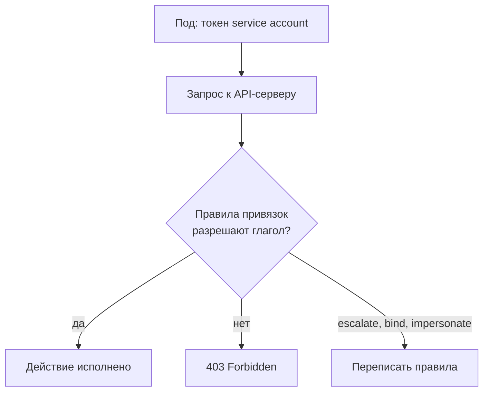
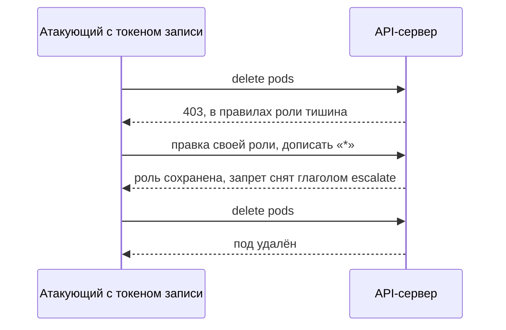

# Kubernetes RBAC и service accounts

Учётной записи в кластере выдали роль из одного правила, и ревьюер решил
проверить, что она разрешает на самом деле. Кластер здесь — Kubernetes:
программа-диспетчер, которая держит приложение запущенным на десятках машин
и решает, кому из людей и процессов что в нём можно. С кластером
разговаривают командой kubectl, а её подкоманда `auth can-i` отвечает на
вопрос «может ли эта запись сделать такое действие». Вот два её ответа,
снятые на учебном кластере kind v0.31 с Kubernetes 1.35; инструмент kind
поднимает такой кластер локально, его узлы — Docker-контейнеры на вашей
машине:

```text
$ kubectl auth can-i escalate roles \
    --as=system:serviceaccount:default:esc-sa
yes
$ kubectl auth can-i delete pods \
    --as=system:serviceaccount:default:esc-sa
no
```

Флаг `--as` означает «от имени записи»: `system:serviceaccount:default:esc-sa`
— это service account esc-sa из пространства default, учётная запись для
программы, а не для человека. Второй ответ говорит, что удалять поды записи
нельзя; под — минимальная единица запуска в кластере, один или несколько
контейнеров на одной машине. Но ответ yes важнее: escalate — это право
расширять роли, то есть дописать себе любое разрешение, включая удаление
подов, и «почти пустая» роль оказывается отложенным администратором. Не
заглядывая в транскрипт, назовите, какой из двух ответов — yes на escalate
или no на delete pods — точнее описывает реальные права записи.

## Кластер, объекты и единая точка входа

До этого места маршрута приложение в темах жило на одной машине: процессы,
файлы, контейнер. В кластере машин десятки — каждая зовётся узлом, — и
Kubernetes решает, на каком узле запустить под, следит, чтобы подов было
столько, сколько заказано, и перезапускает упавшие. Управлять таким
хозяйством руками по ssh не выйдет, поэтому всё в кластере — объекты, и
меняются они через одну точку.

Объект — это запись о чём-либо в кластере: о поде, о роли, о привязке.
Описывают объект манифестом, файлом в формате YAML, и отдают кластеру
командой `kubectl apply`. Дальше кластер сам приводит жизнь к описанию:
попросили три пода — получите три. Листинги этой темы как раз такие
манифесты.

Все объекты рождаются и меняются через API-сервер — единственную точку
входа в кластер: kubectl ходит в него, и поды изнутри кластера ходят в него
же. Бытовой образ — единая приёмная большого завода. API-сервер
соответствует окну приёма, запрос — заявлению, а роль — пропуску с
перечнем дверей. На этом аналогия и ломается: настоящий пропуск нельзя
переписать самому, а роль в кластере иногда можно — этому посвящена
половина темы.

Объекты в кластере лежат по пространствам имён — разделам вроде папок: у
команды платежей своё, у команды поиска своё. Слово знакомо по теме
`linux-userns-cgroups`, но смысл другой: там namespaces изолируют процессы
друг от друга, а здесь это картотека, а не стена. Одни роли действуют
внутри одного пространства, другие — на весь кластер; это различие
разобрано ниже, в «Из чего собрано разрешение».

**Зачем это в работе AppSec-инженера.** Раз всё решается списком прав,
ревью кластера сводится к чтению манифестов RBAC, и находка в них
компактна: одна строка с глаголом. Спор «зачем вашему деплою escalate»
короток, потому что это право не про поды, а про саму модель прав.

## Как это работает

**Откуда это взялось.** Кластеру нужен ответ на вопрос «кто может что
сделать с каким объектом». Сам вопрос и три классические модели ответа на
него разобраны в `access-control-models`; Kubernetes выбрал ролевую: права
группируют в роли, а роли выдают субъектам. До неё права задавал файл
политики (модель ABAC из той же темы) на машине API-сервера, и поменять
правило означало сначала попасть на ту машину. RBAC перенёс права в обычные
объекты API: роль меняется командой, и кластер подхватывает её на лету.
Основание отказа даёт `deny-by-default`: молчание роли — это отказ, а не
нейтральность.

### Из чего собрано разрешение

Правило в роли — тройка: группа API, ресурс, глаголы. Группа API — это
раздел API кластера, например основная группа с пустым именем или
rbac.authorization.k8s.io, где живут сами роли. Ресурс — тип объекта во
множественном числе: pods — это поды, configmaps — объекты ConfigMap, в
которых лежат настройки приложения парами «ключ — значение», roles — сами
роли. Глагол — действие над ресурсом: get, list, watch, create, update,
delete. Вместе тройка читается как фраза:

```yaml
rules:
- apiGroups: [""]
  resources: ["pods"]
  verbs: ["get", "list"]
```

Читается вслух так: «в основной группе API разрешено получать поды по
имени и перечислять их списком». Пустые кавычки в apiGroups — имя основной
группы, так уж записано в Kubernetes. Такой же разбор — группа, ресурс,
глагол — ревьюер проделывает с каждым правилом манифеста.

Роль собирает правила в пачку. Role действует в одном пространстве имён,
ClusterRole — по всему кластеру. Привязка отдаёт роль субъекту: RoleBinding
внутри пространства, ClusterRoleBinding по всему кластеру. Субъект — тот,
кому выдают: пользователь, группа или service account. Встроенная группа
system:authenticated означает «все вошедшие разом», и привязка к ней
отдаёт роль всему кластеру одной строкой.

Ещё одно свойство модели — аддитивность: запретов в RBAC нет вообще.
Правило может только разрешать, и права субъекта складываются из всех его
привязок, как сдача из монет. Поэтому «в роли нет delete» и «записи
запрещён delete» — одно и то же: не разрешено, значит запрещено. Это и
есть `deny-by-default` внутри кластера.

### Service account и её токен

Service account — учётная запись для процесса, а не для человека: от её
имени в API-сервер ходит код, запущенный в поде. Если в описании пода
запись не названа, под получает запись default своего пространства. У
записи есть токен — строка, которую процесс предъявляет API-серверу как
пропуск. По умолчанию кластер сам кладёт токен внутрь пода по пути
/var/run/secrets/kubernetes.io/serviceaccount.

Прочитать этот файл может всякий, кто исполняет код в поде. Дальше он
ходит в API-сервер уже с правами привязок записи, и никакой дополнительной
кражи не нужно. Поэтому токен в поде — заметная часть цены компрометации
пода: уязвимость в приложении из этапа 1 превращается в права на кластер.


```mermaid
flowchart TD
    A[Под: токен service account] --> B[Запрос к API-серверу]
    B --> C{Правила привязок<br/>разрешают глагол?}
    C -- да --> D[Действие исполнено]
    C -- нет --> E[403 Forbidden]
    C -- "escalate, bind, impersonate" --> F[Переписать правила]
```

**Описание схемы.** Под предъявляет токен, и API-сервер сверяет глагол
запроса с правилами привязок записи. Обычных исхода два: действие исполнено
или отказ 403, то есть «запрещено». Третий путь особый: глаголы, которые
разрешают править саму модель, — после них вся сверка теряет смысл.

### Три глагола, которые правят саму модель

Авторы Kubernetes знали, чем опасны роли, которые может править кто угодно.
Поэтому в API встроен запрет: создать или изменить роль может лишь тот, у
кого уже есть все права из неё. Тот же запрет стоит на привязках: отдать
роль можно, только владея всеми её правами самому. Запрет работает всегда,
но у него сделано три официальных исключения — три глагола.

Глагол escalate снимает запрет с ролей: роль с ним можно расширять сверх
своих прав, то есть дописать себе что угодно. Работает он в паре с правом
создавать или править роли — сам по себе он ничего не пишет, но такая пара
в манифесте означает «будущий администратор». Глагол bind снимает запрет с
привязок: в паре с правом создавать привязки (create на rolebindings)
запись отдаёт себе чужую роль, например встроенную cluster-admin. Глагол
impersonate разрешает говорить API-серверу от чужого
имени, и дальше запрос исполняется с чужими правами.

Каждый из трёх обходит deny-by-default не через запрет, а через право
переписать разрешения, поэтому ревью читает их отдельно от обычных
глаголов. В каталоге CWE (Common Weakness Enumeration, общий реестр типовых
слабостей) это CWE-269, неправильное управление привилегиями. Роль, которой
права даны шире нужного, — CWE-266. Оба номера встретятся в чеклисте ревью.

## Как это атакуют

Вернёмся к записи из введения. Глагол escalate имеет смысл только с правом
создавать или править роли, поэтому в манифестах он встречается в паре с
таким правом. Допустим, у записи такая пара есть; тогда атака занимает два
вызова. Первым атакующий правит свою роль и дописывает в неё
звёзды по всем осям; встроенный запрет молчит, потому что escalate его
отменяет. Вторым он повторяет can-i delete pods, и ответ меняется с no на
yes. То самое no из введения было верным лишь на момент вопроса.


```mermaid
sequenceDiagram
    participant A as Атакующий с токеном записи
    participant S as API-сервер
    A->>S: delete pods
    S-->>A: 403, в правилах роли тишина
    A->>S: правка своей роли, дописать «*»
    S-->>A: роль сохранена, запрет снят глаголом escalate
    A->>S: delete pods
    S-->>A: под удалён
```

**Описание схемы.** Атакующий дважды просит удалить поды. Первый раз
отказ, потому что роль молчит. Между попытками он правит свою роль: глагол
escalate снимает встроенный запрет на расширение, и после сохранения роли
вторая попытка проходит. Обратите внимание на порядок: отказ стоял не на
запрете, а на отсутствии разрешения, и отсутствие атакующий устранил сам.

Тот же ход собирается через bind: глагол на чужую роль плюс право создавать
привязки, и запись привязывает к себе хоть cluster-admin, а встроенный
запрет молчит. Через impersonate движений ещё меньше: атакующий подписывает
каждый запрос чужим именем, и API-сервер исполняет его с чужими правами.

Вторая дверь — токен. Пусть в приложении из пода нашлась уязвимость уровня
этапа 1, и атакующий исполняет в поде свой код. Он читает файл по пути
/var/run/secrets/kubernetes.io/serviceaccount и дальше ходит в API-сервер
уже как service account, со всеми её привязками. Взламывать кластер не
понадобилось: права привезли с собой.

## Как это выглядит в коде

Ревьюер читает манифесты ролей, и план чтения здесь из трёх шагов. Первый —
пройти по трём осям каждого правила: группа, ресурс, глагол. Второй —
найти глаголы, которые правят саму модель. Третий — вспомнить, что права
записи зависят не только от роли. В листинге две находки из трёх; назовите
их до чтения выносок:

```yaml
# УЯЗВИМО — демонстрация, не для продакшена
rules:
- apiGroups: ["*"]          # (1)
  resources: ["*"]
  verbs: ["*"]
- apiGroups: ["rbac.authorization.k8s.io"]   # (2)
  resources: ["roles"]
  verbs: ["escalate"]
```

1. Шаг первый, звёзды по всем трём осям: любая группа, любой ресурс, любое
   действие — администратор без слова admin. Звезда щедрее, чем кажется:
   она разрешит и типы объектов, которых в кластере пока нет, — об этом
   документация предупреждает прямо.
2. Шаг второй, глагол над моделью: escalate на roles. Вместе с правом
   править роли это «допиши себе что угодно», и любой can-i для такой
   записи отвечает yes.

Третьей находки в YAML нет, потому что она живёт в его отсутствии: service
account без явного `automountServiceAccountToken: false`. Умолчание
монтирует токен в каждый под записи, и всякий, кто исполнит код в поде,
получает её права. Это проверено на живом кластере: поле пустое —
монтирование включено.

**Ложное срабатывание.** Широкая Role в пустом пространстве имён, где нет
ни секретов, ни нагрузки, выглядит так же, а цены у неё нет. Поэтому
манифест читают вместе с местом: смотрите, что лежит в пространстве и кто
носит привязку. Форма находки — это подозрение, а цена решается окружением.

## Как защититься

Правило одно: роль собирается из того, что код делает на самом деле, а не
из того, что может пригодиться. Практически это значит, что список правил
пишется по вызовам кода: какие объекты он читает, какие создаёт, в каком
пространстве. Каждое право в роли отвечает на конкретный вызов, и звёзды
по осям в такой роли не появляются.

Глаголы escalate, bind и impersonate в роли обычного приложения не нужны
никогда: приложение читает и пишет объекты, а не переписывает модель прав.
Вторая мера касается токена: туда, где код не вызывает API, токен не
монтируется вовсе. Поле называется automountServiceAccountToken, и ставится
оно в описании пода или самой записи:

```yaml
# Исправлено
automountServiceAccountToken: false
```

Проверка фикса делается тем же приёмом, что во введении: `kubectl auth
can-i` от имени записи по каждому глаголу роли, и три опасных спрашиваются
явно. Ожидаемый ответ на них — no, причём читается вся роль, а не один
ответ: при escalate в ней одиночное no ничего не доказывает.

**Границы применимости.** Права, собранные по минимуму, ломаются при росте
функции: сервису понадобилось читать ConfigMap, и роль растёт на одну
осознанную строку, а не на звезду. Встроенные кластерные роли —
cluster-admin и системные — поставляются с кластером и нужны его
компонентам. Ревью касается своих ролей и своих привязок, встроенные не
переписывают.

## Частая ошибка

Прикиньте до разбора: роль, в которой нет delete и create, — уже
безобидна? Так рассуждают многие: права в кластере опасны разрушительными
глаголами, а редакторские роли без них ни к чему плохому вести не могут.
Звучит разумно, и именно поэтому ошибка живая.

**Опасны глаголы, которые правят саму модель.** Escalate и bind не удаляют
ничего сами — они меняют правила, по которым что-то удаляется. Разобрано
это было в разделе «Три глагола, которые правят саму модель». Контрпример —
из введения: записи нельзя удалять поды, но можно escalate. С правом правки
ролей рядом через два вызова она администратор: правит свою роль и
спрашивает can-i заново.

## Чеклист для ревью

1. Проверьте, что ни одна своя роль не содержит escalate, bind, impersonate
   (CWE-269).
2. Проверьте, что звёзд по осям нет: группа, ресурс и глаголы перечислены
   явно (CWE-266).
3. Проверьте, что у service accounts без нужды в API стоит
   `automountServiceAccountToken: false`.
4. Проверьте, что ClusterRoleBinding привязаны к сервисным учёткам, а не
   к широким группам.
5. Проверьте, что каждое право в роли отвечает на вызов, который код делает
   на самом деле.
6. Проверьте, что права проверены прогоном can-i от имени записи, а не
   чтением манифеста.

## Попробуй сам

Поднимите учебный кластер и заведите в нём учётную запись с одной ролью.
Инструмент kind ставится локально, и его узлы живут в Docker-контейнерах,
отдельная машина не нужна. Сохраните каркас из трёх объектов в файл
rbac-lab.yaml. Это исполняемый набор: запись, роль с одним правилом
«get и list на pods» и привязка, которая отдаёт роль записи:

```yaml
apiVersion: v1
kind: ServiceAccount
metadata: {name: esc-sa}
---
apiVersion: rbac.authorization.k8s.io/v1
kind: Role
metadata: {name: pod-watcher}
rules:
- apiGroups: [""]
  resources: ["pods"]
  verbs: ["get", "list"]
---
apiVersion: rbac.authorization.k8s.io/v1
kind: RoleBinding
metadata: {name: esc-sa-pods}
subjects:
- kind: ServiceAccount
  name: esc-sa
  namespace: default
roleRef:
  kind: Role
  name: pod-watcher
  apiGroup: rbac.authorization.k8s.io
```

Первая пара команд поднимает кластер и применяет манифест, вторая снимает
два ответа can-i: по праву, которое роль даёт, и по праву, которого в ней
нет. Приём тот же, что во введении: флаг `--as` подставляет запись, а
меняется только пара «глагол — ресурс». Ожидаемая пара ответов — yes на
get и no на delete:

```bash
# Поднять кластер и применить манифест
kind create cluster --name rbac-lab
kubectl apply -f rbac-lab.yaml

# Проверить два права от имени записи
kubectl auth can-i get pods --as=system:serviceaccount:default:esc-sa
kubectl auth can-i delete pods --as=system:serviceaccount:default:esc-sa
```

Одна подсказка: `kubectl auth can-i --list` от имени записи печатает всё
разрешённое разом. Если в списке виден escalate, bind или impersonate,
каркас собран не по образцу — такой роли в задаче быть не должно.
**Критерий выполнения** наблюдаемый: вывод can-i по обоим правам записан, и
к роли приложен список глаголов из --list, где видно, что опасных трёх нет.

## Проверь себя

1. Учётной записи `deployer` выдали роль с такими правилами. Предскажите
   три ответа `kubectl auth can-i` от её имени: на `list configmaps`, на
   `delete configmaps` и на `bind clusterroles`.

   ```yaml
   rules:
   - apiGroups: [""]
     resources: ["configmaps"]
     verbs: ["get", "list"]
   - apiGroups: ["rbac.authorization.k8s.io"]
     resources: ["clusterroles"]
     verbs: ["bind"]
   ```

2. Прочитайте спецификацию пода: что уже смонтировано внутрь и кому это
   доступно?

   ```yaml
   spec:
     serviceAccountName: deployer
     containers:
     - name: app
       image: app:1.2
   ```

3. Ревью нашло у сервиса роль со звёздами по всем трём осям — «чтобы не
   возиться при росте». Выберите починку:

   А. Убрать из глаголов delete и create: опасные действия будут закрыты.

   Б. Собрать роль из вызовов, которые код делает на самом деле:
      перечислить группы, ресурсы и глаголы по именам.

   В. Оставить правила, но привязать их RoleBinding вместо
      ClusterRoleBinding, сузив область до одного пространства имён.

4. Почему ответ `can-i` «no» на delete pods ничего не доказывает, если у
   той же записи есть глагол escalate?
5. Возврат к теме `deny-by-default`: почему escalate не противоречит
   запрету по умолчанию, хотя обходит его?
6. Возврат к теме `access-control-models`: из каких частей здесь собрано
   правило доступа?

<details markdown="1">
<summary>Ответ 1</summary>

1. `list configmaps` — yes, глагол прямо разрешён. `delete configmaps` —
   no, аддитивная модель: не разрешено — значит запрещено. `bind
   clusterroles` — yes, и это тревожный ответ: bind на роли снимает
   встроенный запрет, и запись может привязать себе чужую роль, то есть
   обойти модель. Для самой привязки нужна вторая половина пары — право
   создавать привязки (create на rolebindings), но bind в манифесте уже
   повод для вопроса. Команда для прогона на учебном кластере: `kubectl
   auth can-i <глагол> <ресурс>
   --as=system:serviceaccount:<пространство>:deployer` — тем же приёмом во
   введении сняты yes на escalate и no на delete.

</details>

<details markdown="1">
<summary>Ответ 2</summary>

2. Внутрь смонтирован токен service account deployer: поле
   automountServiceAccountToken не задано, а умолчание — монтировать. Токен
   лежит по пути /var/run/secrets/kubernetes.io/serviceaccount, и читает
   его всякий, кто исполняет код в поде: дальше он ходит в API-сервер с
   правами привязок deployer. Заметная часть цены компрометации пода — вот
   эта строка, которой в спецификации нет.

</details>

<details markdown="1">
<summary>Ответ 3: разбор вариантов</summary>

3. Верен Б. Разбор каждого:

   А. Опасны не разрушительные глаголы сами по себе, а те, что правят
      модель: escalate и bind ничего не удаляют, они переписывают правила.
      Роль без delete и create с escalate — это отложенный администратор.
   Б. Право собирается из фактических вызовов кода: get и list по
      configmaps в одном пространстве — и всё. Каждая строка отвечает на
      вызов, и прогон `can-i` от имени записи это подтверждает.
   В. Область стала уже, а права теми же: звёзды по осям дают
      администратора внутри пространства, включая его секреты и
      учётные записи. Сужение области не сужает разрешение.

</details>

<details markdown="1">
<summary>Ответ 4</summary>

4. can-i отвечает на момент вопроса по текущим правилам, а escalate — это
   право эти правила переписать: запись дописывает себе delete и спрашивает
   снова. Ответ «no» верен ровно до первого вызова с escalate, поэтому
   читают всю роль, а не один ответ.

</details>

<details markdown="1">
<summary>Ответ 5</summary>

5. Запрет по умолчанию работает на отсутствии права: не разрешено — значит
   запрещено. Escalate — это наличие права на сами правила: модель не
   нарушена, она легально переписана тем, кому разрешили её править. Поэтому
   три глагола ревьюятся отдельно от остальных.

</details>

<details markdown="1">
<summary>Ответ 6</summary>

6. Субъект — пользователь, группа или service account (кто), правило —
   глагол над ресурсом из группы API (что и над чем), привязка — RoleBinding
   или ClusterRoleBinding (кому отдано). Та же рамка «кто, что, над чем»,
   что в моделях доступа, только записанная манифестами.

</details>

## Источники

1. Using RBAC Authorization, документация Kubernetes; реестр `k8s-rbac`.
   Разделы: Role и ClusterRole, привязки, предотвращение эскалации,
   глаголы escalate, bind, impersonate.
   <https://kubernetes.io/docs/reference/access-authn-authz/rbac/>
2. OWASP Kubernetes Security Cheat Sheet; реестр `owasp-cs-kubernetes`.
   Разделы: RBAC, service accounts, минимальные права.
   <https://cheatsheetseries.owasp.org/cheatsheets/Kubernetes_Security_Cheat_Sheet.html>

Каркас этапа: записи семейства man-* и якоря подразделов — наследуются
всеми темами этапа 4.

**Скоропортящийся слой.** Поля манифестов стабильны годами; версии
кластера и kind названы в маркерах. Набор встроенных ролей растёт от
версии к версии.

**Маркеры уверенности.** **Проверено лично** 2026-09-01 на kind v0.31.0,
Kubernetes 1.35.0, кластер в Docker 29.7.2: роль с get/list на pods даёт
по can-i yes на get и no на escalate и delete, роль с escalate даёт yes
на escalate и no на delete, токен service account выдаётся (`create
token`), поле automountServiceAccountToken пусто по умолчанию. Семантика
глаголов и аддитивность — **по документации** (k8s-rbac, открыта лично
2026-09-01). Права встроенных кластерных ролей не перечитывались по
кластеру.
