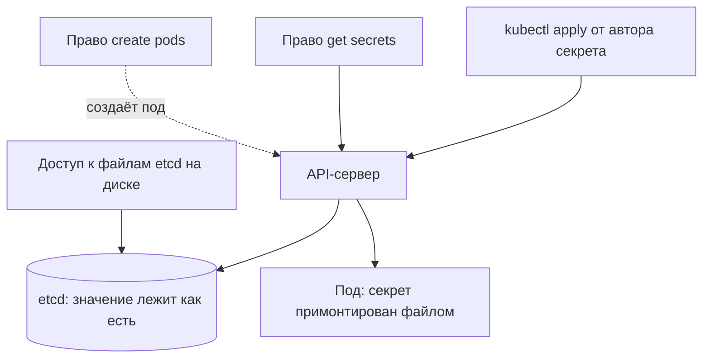

# Kubernetes Secrets: реальный уровень защиты

Приложению в кластере нужен пароль к базе данных, и коллега советует:
положите его в Kubernetes Secret, этот объект для того и придуман. Вы
создаёте Secret, и значение уезжает в кластер. Проверить, как оно там
лежит, можно двумя командами: первая читает поле password из объекта,
вторая пропускает ответ через утилиту base64. Прежде чем смотреть на
транскрипт, предскажите вывод второй команды.

```text
$ kubectl get secret demo-secret -o jsonpath='{.data.password}'
cXdlcnR5MTIz
$ echo 'cXdlcnR5MTIz' | base64 -d
qwerty123
```

Значение развернулось без ключа, без пароля и без единого вопроса со
стороны кластера. Название объекта обещает больше, чем он делает: ниже
видно, что Secret — это не хранилище секретов, а способ держать значение
отдельно от манифеста пода. Реальный уровень защиты складывается из трёх
обстоятельств. Одно из них отвечает на вопрос, который стоит задать сразу:
изменится ли вывод той же пары команд на кластере с включённым шифрованием.

## Что такое Secret

Секрет в этом гайдбуке — значение, которое открывает доступ: пароль к базе,
токен, ключ API; их разряды и места разбирает тема `secrets-in-code`.
Кластер Kubernetes держит состояние в объектах — записях, которые создают,
читают и удаляют через API-сервер, а права на записи задаёт модель из темы
`k8s-rbac`. Обычные настройки приложения — адрес соседнего сервиса, флаги,
таймауты — живут в объекте ConfigMap: под читает его при старте,
и конфигурация не зашита в образ.

Бытовой пример — доска объявлений у входа. Настройки на ней написаны
открытым текстом и видны всем, кто подошёл, потому что это адреса и числа.
Secret — это записка на той же доске, но в конверте с надписью «не
вскрывать при всех». Доска та же, и прочитать записку может каждый, кто
до неё дотянулся. Здесь аналогия и ломается: в кластере конверт ничем не
запечатан, и пометка «не вскрывать» — единственное отличие Secret от
ConfigMap.

По устройству это тот же объект: те же ключи и значения, то же поле data,
та же доставка в под. Отдельный тип нужен, чтобы кластер мог обращаться
с такими записями осторожнее: не писать значение на диск узла и выдавать
права на него отдельно. Само значение при этом прячется ровно одним
способом — кодировкой.

### base64 — это кодировка, а не шифр

Поле data передаётся текстом, а значение секрета может быть произвольными
байтами — например, файлом закрытого ключа. Поэтому значения записывают в
base64: стандартной кодировкой, где любые байты переписываются
шестьюдесятью четырьмя печатными знаками. Так картинку вкладывают в текст
письма: канал пропускает только печатные знаки, и байты приходится
переписывать другим алфавитом.

Строка `cXdlcnR5MTIz` выглядит как шифротекст, и в этом ловушка названия
объекта. Ключа здесь нет и не было: таблица соответствия — открытый
стандарт, и обратное преобразование делает одна команда `base64 -d` на
любой машине. Шифр без ключа не разворачивается никогда, а кодировка —
всегда. Поэтому документация Kubernetes называет такую запись
закодированной, а не зашифрованной.

**Зачем это в работе AppSec-инженера.** Название объекта провоцирует ложный
вывод «секреты в кластере уже защищены», и на ревью его приходится
разбирать по частям. Ревьюеру достаточно трёх вопросов: включено ли
шифрование etcd, базы данных кластера, кто может создавать поды и где
настоящее хранилище секретов. Остальная часть темы разворачивает все три.

## Как это работает

**Откуда это взялось.** До появления отдельного объекта значение клали
прямо в манифест пода или в образ контейнера — документация называет оба
места. Манифест читает всякий, у кого есть доступ к пространству имён,
а образ — всякий, у кого есть доступ к реестру образов. Поэтому значения
вынесли в объект, который создаётся и правится независимо от подов. Защита
при этом появилась не в самом объекте, а вокруг него: права на объект,
шифрование базы кластера, правила доставки в под. Три обстоятельства ниже —
это три места, где защита либо включена, либо нет.

### Чтение через API ничего не прячет

Первое обстоятельство видно во вступлении. Команда kubectl читает объект
через API кластера, и API-сервер отдаёт значение как записано — в base64.
Разворачивается оно без ключа, поэтому право get на секреты равно праву
знать их значения. Отсюда рабочее правило темы: вопрос «кто видит секрет»
— это вопрос о правах, а не о кодировке.

### В etcd значение лежит открытым текстом

Второе обстоятельство стоит за API-сервером. Записи кластера он хранит
в etcd — базе данных контрольной плоскости. Контрольная плоскость — это
узлы и процессы, которые управляют кластером: API-сервер, планировщик
и etcd. Поды работают на других узлах и к контрольной плоскости не
относятся.

Бытовой пример — главная книга учёта в конторе: что в ней записано, то
контора и считает правдой, а посетители идут через кассира. Кассир здесь —
API-сервер, книга — etcd. Аналогия ломается в одном месте: книгу можно
прочитать и минуя кассира, если добраться до полки, — то есть до файлов
etcd на диске.



**Описание схемы.** Схема читается сверху вниз и показывает четыре пути к
значению. Запись от автора идёт через API-сервер в etcd. Чтение с правом
get secrets повторяет путь автора. Право create pods ведёт в обход запрета
на чтение: учётная запись создаёт под, и API-сервер сам отдаёт секрет в
монтирование. Четвёртый путь минует API-сервер целиком — через файлы etcd
на диске контрольной плоскости.

По умолчанию шифрование при хранении выключено, и записи лежат в etcd как
есть. На учебном кластере этой темы значение `qwerty123` нашлось текстовым
поиском прямо в файле базы etcd. Хранение открытым текстом — это CWE-312
из каталога Common Weakness Enumeration. Последствие прямое: доступ к etcd
равен доступу ко всем секретам кластера, и бэкап базы — та же открытая
копия.

### Право создать под — это право читать секреты

Третье обстоятельство самое неожиданное. Секрет попадает в под
монтированием: кластер подключает его томом, и внутри контейнера
появляется каталог, где каждый ключ секрета лежит отдельным файлом со
значением. Приложение читает файл и получает пароль. Отсюда следствие,
которое документация формулирует прямо: кто уполномочен создать под в
пространстве имён, тот может прочитать любой Secret этого пространства.
Косвенный путь считается тоже: объект Deployment — это «держи включёнными
N копий пода», он создаёт поды сам, и право создать Deployment равно праву
создать под.

Проверим цепочку на учебной записи deployer. У записи одна роль — создавать
поды, а права читать секреты нет, и проверка can-i честно отвечает no.
Тогда запись создаёт под с примонтированным секретом и читает значение
внутри него:

```text
$ kubectl auth can-i get secrets -n shop \
    --as=system:serviceaccount:shop:deployer
no
$ kubectl -n shop exec reader -- cat /run/db/value
s3cr3t-db
```

Прогон сделан на кластере kind v0.31 с Kubernetes 1.35; kind — это учебный
кластер, который поднимается локально в контейнерах (Kubernetes IN Docker).
Модель прав из `k8s-rbac` здесь не сломана, а обойдена: запрет на get
secrets стоит, но он про ресурс secrets, а чтение пошло через ресурс pods.
Поэтому ревью прав на секреты начинается не с ролей на get, а с ролей на
create подов.

## Как поднять реальный уровень защиты

Документация сама называет меры, и у каждой есть точная граница. Разберём
их по порядку: сначала база, потом права, потом доставка в под.

### Шифрование etcd закрывает базу, но не API

Шифрование при хранении включается настройкой API-сервера — конфигурацией
EncryptionConfiguration. С этого момента API-сервер шифрует значения
секретов перед записью в etcd, а при чтении прозрачно расшифровывает. База
и её бэкапы перестают быть открытой копией всех секретов кластера.

Граница меры — это ответ на вопрос вступления. Вывод пары команд не
изменится: шифрование стоит на записи в базу, а чтение через API возвращает
значение уже расшифрованным. Путь «прочитать файлы etcd» закрыт, а пути
«спросить у API» и «создать под» остаются как были. Проверяется мера тем же
приёмом, что во втором обстоятельстве: по документации, при включённом
шифровании текстовый поиск по базе значения больше не находит.

Шпаргалка OWASP формулирует ставку жёстче: доступ к etcd на запись равен
правам root на весь кластер, а чтение открывает эскалацию. Поэтому рядом с
шифрованием в её списке стоят ещё две меры. Бэкапы базы шифруются всегда,
а доступ к самому etcd ограничивается: база принимает соединения только от
API-сервера с взаимной проверкой сертификатов. Секрет, зашифрованный в
базе, но читаемый из неё по сети любым клиентом, защиты не получил.

### Права проверяются с конца: create, а не get

Ревизия прав начинается с того, кто может создавать поды и всё, что поды
создаёт, — Deployment и подобные объекты. Проверка делается той же командой
`kubectl auth can-i` от имени учётной записи, только с глаголом create и
ресурсом pods; синтаксис разобран в `k8s-rbac`. Отдельно смотрятся глаголы
list и watch на секреты: по документации они отдают все значения
пространства имён сразу, а не только примонтированные конкретному поду.
Роль при этом собирается из того, что код делает на самом деле, — это
мера из списка документации.

### Что кластер уже делает за вас

Часть защиты встроена, и её полезно знать, чтобы не требовать лишнего.
Секрет уезжает только на узел, где работает под, которому он нужен. Узел
держит значение в памяти — во временной файловой системе tmpfs — и не
пишет его на диск, а при удалении пода локальная копия удаляется. Один под
не видит секретов другого. Пометка immutable страхует от случайной правки:
неизменяемый секрет нельзя обновить, его можно только удалить и создать
заново. Оговорка одна: контейнер с `privileged: true` читает все секреты
своего узла, поэтому привилегированные контейнеры — отдельный предмет
ревью.

### Как секрет доставляется в под

Способов доставки два: томом с файлами, как в прогоне выше, и переменными
окружения. Шпаргалка OWASP предпочитает первый: том монтируется только для
чтения. Переменная окружения — разобранное место утечки из темы
`secrets-in-code`: значение читается через файл окружения процесса
и попадает в отчёты об авариях. Отдельная мера из списка документации —
ограничить доступ к секрету конкретными контейнерами.

В поде может быть несколько контейнеров, и по умолчанию каждый видит только
то, что ему явно примонтировано. Документация приводит пример разделения:
внешний контейнер принимает запросы и не видит закрытого ключа, а
подписывает сообщения соседний контейнер-подписант, доступный только по
локальной петле. Атакующему во внешнем контейнере ключа в таком устройстве
не достать.

### Где настоящее хранилище

Вывод темы один: Secret — это способ доставки значения в под, а не
хранилище; граница «хранилище против доставки» разобрана в
`secrets-in-code`. Хранилище с выдачей по политике, аудитом и сроком
годности — предмет подраздела 4.4, и документация Kubernetes советует
внешние хранилища прямо: центральное управление и ротация живут там.
Утёкшее значение меняется процедурой ротации — тема `secret-rotation`,
а доставка секретов в конвейер сборки — `ci-secrets`.

### Что спросить у владельца кластера

Читатель почти наверняка получит кластер уже настроенным, поэтому тема
заканчивается тремя вопросами к тому, кто его настраивал. Первый: включено
ли шифрование при хранении — конфигурация EncryptionConfiguration у
API-сервера. Второй: у каких учётных записей есть право create pods
и широкие list или watch на секреты. Третий: где настоящее хранилище и как
в нём устроена ротация. Ответы на эти три вопроса и составляют реальный
уровень защиты — название объекта в него не входит.

## Источники

1. Secrets, документация Kubernetes; реестр `k8s-secrets`. Разделы:
   хранение в etcd без шифрования по умолчанию, доступ через создание
   пода, меры безопасного использования (шифрование при хранении,
   минимальные права, ограничение доступа конкретными контейнерами,
   внешние хранилища), поведение kubelet: tmpfs, доставка только на
   нужный узел, права list и watch, предупреждение о привилегированных
   контейнерах.
   <https://kubernetes.io/docs/concepts/configuration/secret/>
2. OWASP Kubernetes Security Cheat Sheet; реестр `owasp-cs-kubernetes`.
   Разделы: «Restricting access to etcd» (запись в etcd равна root на
   кластере, взаимный TLS и изоляция базы), «Keep secrets as secrets»
   (тома только для чтения против переменных окружения), «Encrypt
   secrets at rest», «Alternatives to Kubernetes Secret resources»
   (внешний менеджер секретов), «Rotate infrastructure credentials
   frequently».
   <https://cheatsheetseries.owasp.org/cheatsheets/Kubernetes_Security_Cheat_Sheet.html>

Каркас этапа: записи семейства man-* и якоря подразделов — наследуются
всеми темами этапа 4.

**Скоропортящийся слой.** Версии kind и Kubernetes названы в маркерах
уверенности; умолчание о шифровании etcd и синтаксис EncryptionConfiguration
привязаны к версии. Факты о кодировке, базе etcd и праве create pods
стабильны.

**Маркеры уверенности.** Прогон пары команд из вступления, текстовый поиск
значения `qwerty123` в базе etcd контрольной плоскости
(/var/lib/etcd/member/snap/db) и цепочка «create pods без get secrets,
секрет прочитан в поде» — **проверено лично** 2026-09-01 на kind v0.31.0,
Kubernetes 1.35.0. Перекодировка `cXdlcnR5MTIz` в `qwerty123` и обратно
перепроверена **прогоном** 2026-10-03 (base64 из GNU coreutils 9.12). Меры
документации — шифрование при хранении, минимальные права, поведение
kubelet, права list и watch, разделение по контейнерам, изоляция etcd —
**по документации**: страница о Secret и шпаргалка OWASP перечитаны лично
2026-10-03. Шифрование etcd на стенде не включалось: поведение включённого
шифрования описано по документации, а не по прогону.
