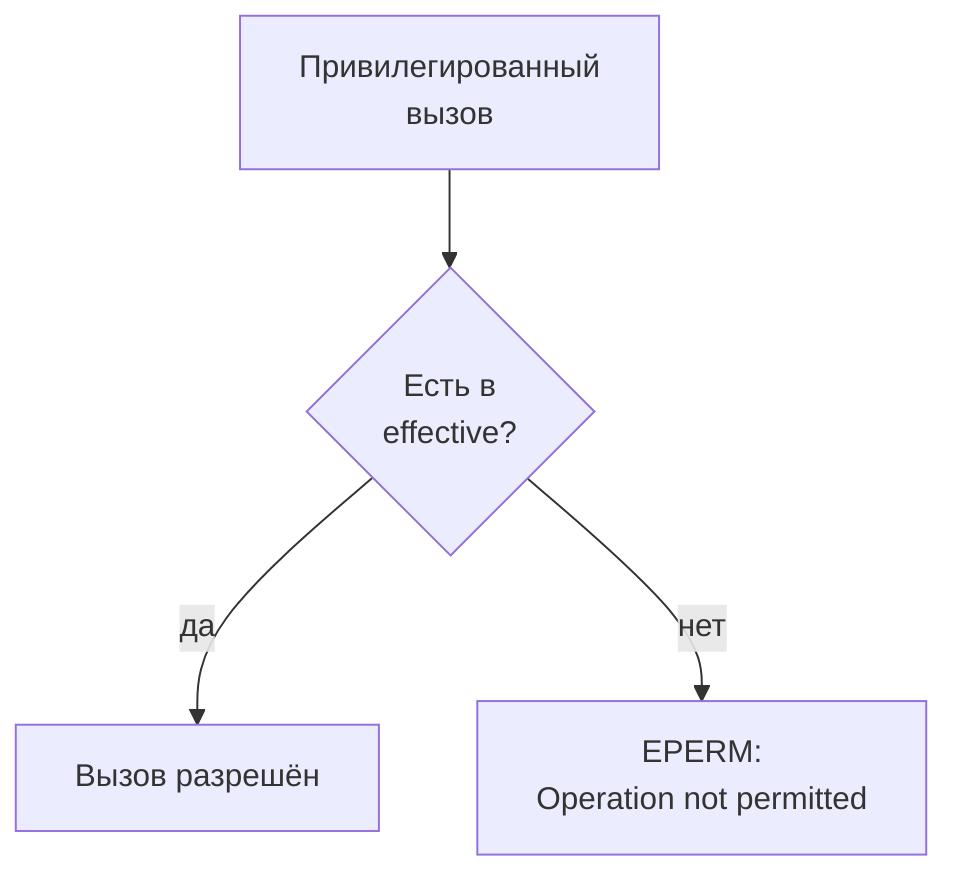

# Capabilities: деление полномочий root на отдельные права

Уровень **L1** · время 60 мин (теория 35 / лаба 15 / самопроверка 10,
оценка)

Что прочитать сначала: `linux-setuid`.

Диагностическому агенту нужно проверять узлы сырым сокетом. Обычному
пользователю это запрещено, и проверяется запрет одним вызовом:

```text
$ python3 probe.py
сырой сокет: отказ, [Errno 1] Operation not permitted
```

Тот же вызов внутри свежего пространства имён, где у процесса есть
права root:

```text
$ unshare -Urn python3 probe.py
сырой сокет: открыт
```

Скрипт один и тот же, машина та же, исход одному и тому же вызову —
противоположный. Поменялась не программа и не пользователь, а набор
полномочий процесса.

Между «отказано» и «открыто» стоит ровно одна capability —
CAP_NET_RAW. Если вы запускали контейнер и встречали в его журнале
«operation not permitted», вы уже видели эту модель в работе. Вызову
вроде бы ничего не мешало, а процессу не хватило одной строки в наборе.

У root в Linux полномочия не монолитны. Они поделены на отдельные
capabilities — на ядре 6.18 их сорок одна. У каждой имя того, что она
разрешает: CAP_NET_RAW открывает сырые сокеты, CAP_SYS_TIME переводит
часы, CAP_CHOWN меняет владельца файла. Процесс получает не «права
root», а набор, и ядро проверяет привилегированный вызов по этому
набору. Отсюда рабочее следствие: «процесс под root» и «процесс с
одной capability» отвечают на один вызов по-разному. Разницу между
ними видно в отчёте без всякого запуска.

Дальше разберём, из каких четырёх наборов складываются полномочия
процесса, как capability попадает на файл программы и почему
CAP_SYS_ADMIN документация называет новым root. Затем — как избыточный
набор выглядит в коде и в описании запуска, и лаба, где набор сокращают
до одной нужной строки.

## 0. Коротко

Полномочия root поделены на capabilities — отдельные права на
отдельные вызовы. У процесса четыре набора. Effective решает проверки,
permitted ограничивает effective, inheritable переживает запуск
программы. Bounding — потолок, выше которого не подняться. На файле
программы capability играет роль бита setuid, но дробную: вместо всех
прав владельца программа получает перечисленные. Опасность типовая:
процессу выдают полный набор «на всякий случай», и ошибка в нём
становится полным root. Чинится набором из одной-двух нужных
capabilities, а CAP_SYS_ADMIN — сигнал пересмотреть дизайн: она
покрывает слишком многое. То же в терминах, которыми это обсуждают.

**Зачем это в работе AppSec-инженера.** Флаги `--cap-drop` и поля
securityContext в манифестах говорят именно на этом словаре, и ревью
запуска сервиса — это чтение его набора. Вопрос «зачем этому процессу
CAP_SYS_ADMIN» в отчёте звучит постоянно. Отвечать на него нужно
списком вызовов, которым эта capability действительно нужна, — или
признанием, что таких вызовов нет.

## 1. Цели

После этого раздела вы сможете:

1. Объяснить, как capabilities делят полномочия root и чем набор
   отличается от setuid.
2. Назвать четыре набора capabilities процесса и роль каждого.
3. Прочитать наборы процесса в /proc и файловые capabilities через
   getcap.
4. Сократить набор процесса до нужного минимума и проверить вызовом.

## 2. Предвопросы

Ответьте до чтения, даже если не уверены.

1. Программе нужно слушать порт 443. Сколькими полномочиями root её
   придётся наделить?
2. У процесса нет ни одной capability. Может ли он получить какую-нибудь
   сам, без посторонней помощи?
3. Сервису выдали только CAP_SYS_ADMIN. Много ли он потерял по
   сравнению с полным root?

## 3. Механика

**Откуда это взялось.** Классическая модель Unix знала два состояния
процесса: uid 0, которому можно всё, и все остальные, которым можно по
правам файлов. Программе с одним привилегированным вызовом — открыть
сырой сокет, перевести часы — приходилось давать root целиком, и каждая
ошибка в такой программе была полной компрометацией машины. Ответом
стало деление: полномочия root разложили на отдельные права по именам
вызовов. Программа с набором из одной CAP_NET_RAW открывает сырой сокет
и не может ничего остального. Ни прочитать чужой файл в обход прав, ни
послать сигнал чужому процессу — для обоих не хватит набора.

### Четыре набора процесса

capabilities(7) описывает у процесса четыре набора, и их часто путают:
работают они в связке. Effective — то, что ядро проверяет
при каждом привилегированном вызове. Permitted — верхняя граница
effective: процесс вправе поднимать в effective только то, что есть в
permitted. Inheritable — то, что переживает запуск другой программы.
Bounding — потолок на всю жизнь процесса и его потомков: снятую из него
capability не вернуть ничем. Есть и пятый, ambient, — способ обычного
пользователя передать набор через запуск программы, — но на первом
чтении достаточно четырёх.

Как наборы ведут себя при запуске программы, различать важно.
Обычный запуск стирает effective и permitted, если у программы нет
файловых capabilities; bounding при запуске не меняется — его можно
только срезать. Поэтому bounding используют как сейф для потомков:
процесс срезает его у себя при старте, и ни один потомок лишнего
не получит. Ambient нужен ровно для обратной задачи: capabilities(7)
прямо советует его программам, которым надо запускать хелперов с
повышенными capability, не прибегая к setuid.

Прочитать наборы любого процесса можно без привилегий — они лежат в
/proc прямым текстом:

```text
$ grep Cap /proc/self/status
CapInh:  0000000800000000
CapPrm:  0000000000000000
CapEff:  0000000000000000
CapBnd:  000001ffffffffff
CapAmb:  0000000000000000
$ capsh --decode=000001ffffffffff
0x000001ffffffffff=cap_chown,cap_dac_override,...,cap_checkpoint_restore
```

У обычного shell effective и permitted пусты, а bounding полон: потолок
широкий, действующих прав нет. Маски разворачивает capsh (второй вывод
здесь сокращён многоточием, полный список — сорок одно имя; табуляции
в выводе заменены пробелами при вёрстке).

### Capability на файле программы

Отдать набор процессу можно через файл: setcap ставит программе
файловые capabilities, и при её запуске ядро наполняет наборы процесса
по записи. Механизм — тот, что у бита setuid из темы `linux-setuid`, но
дробный: вместо всех прав владельца программа получает перечисленные
имена. Посмотреть запись можно без root:

```text
$ getcap -r /usr/bin
/usr/bin/newuidmap cap_setuid=ep
/usr/bin/newgidmap cap_setgid=ep
```

На этой машине файловые capabilities стоят у двух программ, и каждой
дана ровно одна. Для сравнения: `/usr/bin/ping` на том же выводе не
имеет ни бита setuid, ни capabilities — ему хватает ping-сокета,
который ядро разрешает без CAP_NET_RAW.

### Capabilities против setuid

Оба механизма поднимают программу над правами вызвавшего, и выбор
между ними — рабочий вопрос. Бит setuid из темы `linux-setuid` переключает
процесс на владельца файла целиком: у владельца root — значит, на все
полномочия сразу. Файловая capability даёт перечисленные имена и ничего
сверх них: у такой программы нет даже прав владельца файла, если они не
перечислены. Поэтому там, где setuid-обёртке от root нужен один
привилегированный вызов, замена её записью setcap убирает из анализа
всё, чего обёртка не должна была уметь.

Заменить capabilities можно не всё: право читать чужие файлы по обычной
модели владельца через них не выдашь точечно, и там обёртка остаётся. Отсюда правило выбора.
Нужна одна именованная возможность — запись на файле; нужна модель
владельца со всеми её правами — бит setuid. Обе записи инвентаризуются
обходом файловой системы: `getcap -r` у одной, find с маской бита
у другой.

### Откуда у root полный набор

Процессу с uid 0 никто ничего не выдаёт поимённо. При запуске программы
ядро заполняет ему permitted и effective целиком, если действующий или
реальный uid равен нулю (capabilities(7)). Поэтому «запустить от root»
и «выдать все сорок одну» — одна и та же строка в описании запуска.
Привычное «User=root» в юните означает полный набор, а не «обычные
права администратора». Отсюда же видно, что
снимает полномочия: смена uid на ненулевой обнуляет наборы при запуске,
если их специально не сохранили.

### CAP_SYS_ADMIN — отдельный случай

Одна capability в списке стоит особняком: документация называет
CAP_SYS_ADMIN «новым root», потому что она покрывает слишком многое —
монтирование, пространства имён, десятки вызовов. Две младшие
capabilities выделили из неё позже именно поэтому: CAP_BPF и
CAP_PERFMON отделены в ядре 5.8, чтобы не давать SYS_ADMIN ради одной
подсистемы. Практический вывод для ревью: набор с CAP_SYS_ADMIN не
отличается от полного root по цене компрометации, и требование «убрать
лишние capabilities» такой набор не закрывает. В отчёте такой набор —
почти всегда находка.



**Описание схемы.** Каждый привилегированный вызов процесса ядро сверяет
с его набором effective: нужная capability есть — вызов разрешён, нет —
вызов возвращает ошибку EPERM. Ровно эту ошибку показал первый опыт
темы.

## 4. Эксплуатация

Стенд — любая машина с Linux; выводы сняты на Arch Linux, ядро
6.18.48, Python 3.14.7, пакет libcap с capsh. Все опыты безопасны и
ничего не меняют в системе.

Шаг 1. Один вызов, два результата. Скрипт probe.py пытается открыть
сырой сокет; снаружи — отказ, внутри свежего пространства имён —
успех:

```text
$ python3 probe.py
сырой сокет: отказ, [Errno 1] Operation not permitted
$ unshare -Urn python3 probe.py
сырой сокет: открыт
```

Разница между строками — один набор capabilities: внутри нового
пространства имён процесс получил полный набор над ним. Сами
пространства имён разбирает тема подраздела 4.1 о namespaces; здесь
важен итог: проверка шла по capability, а не по uid.

Шаг 2. Снимок собственного процесса. capsh показывает наборы целиком:

```text
$ capsh --print
Current: cap_wake_alarm=i
Bounding set =cap_chown,cap_dac_override,...,cap_checkpoint_restore
Ambient set =
```

У текущего shell действующих прав нет, наследуемая одна, bounding
полон (вывод сокращён многоточием: сорок одно имя). Сверьте со снимком
из блока «Механика»: это два окна в одни данные. Программа capsh читает
те же поля, что лежат в /proc, но подаёт их именами вместо масок.

Для сравнения посмотрите на процесс с pid 1 на этой же машине: у него
CapEff равен `000001ffffffffff` — полный набор. Init работает от root,
и ядро наполнило ему наборы целиком: ровно то, о чём сказано в блоке
«Механика». Такая сверка двух процессов — рабочий приём: снимок набора
читается за секунду и не требует ни прав, ни остановки службы.

Шаг 3. Тот же вопрос к лабе. Агенту netprobe для работы нужна одна
capability, а выдан полный набор. Эксплойт от имени процесса агента
пробует вызовы, не нужные ему:

```text
$ python3 hack.py
Цель: code.py
  опыт 0 — контроль, рабочий probe: работает
  опыт 1 — вызовы, не нужные агенту:
           смонтировать файловую систему: СРАБОТАЛО
           перевести системные часы: СРАБОТАЛО
           прочитать /etc/shadow в обход прав: СРАБОТАЛО
           послать сигнал чужому процессу: СРАБОТАЛО
           слушать порт 443: СРАБОТАЛО
           сверх cap_net_raw доступно вызовов: 5 из 5
ЭКСПЛОЙТ СРАБОТАЛ: код внутри процесса агента получил
полномочия, которые агенту не нужны.
```

Признак срабатывания: из процесса, которому нужен один вызов, доступны
пять других. Парность темы: одна и та же программа с полным набором и с
минимальным даёт разный ответ на один и тот же вызов.

Заметьте, что атакующему здесь понадобилось. Ни эксплойта против ядра,
ни ошибки в самом агенте в рамках опыта: условие одно — его код
оказался внутри процесса агента. Как он туда попал — вопрос другой
темы. Всё остальное ему выдала конфигурация запуска: полный набор
превратил любой канал исполнения в полный root. Меняется ровно одна
строка — набор, — и тот же канал заканчивается на отказе.

## 5. Как выглядит в коде

Избыточный набор виден не в коде программы, а в описании её запуска —
и в молчании самого кода о том, что ему нужно.

**Первое: «root на всякий случай» в запуске.** Из лабы — укажите, что
здесь выдано сверх нужного, прежде чем смотреть разбор:

```python
# УЯЗВИМО — демонстрация, не для продакшена
def start_agent(targets):
    proc = Process("netprobe", effective=ALL_CAPS)       # (1)
    return Agent(proc, targets)
```

1. Полный набор вместо одной нужной строки. В боевом коде то же самое
   выглядит как запуск от root, потому что root и есть полный набор.

**Второе: то же в описании развёртывания.** Назовите лишнее имя в
команде запуска.

```yaml
# УЯЗВИМО — демонстрация, не для продакшена
command: docker run --cap-add=SYS_ADMIN probe-agent  # (1)
```

1. К образу, которому хватило бы NET_RAW, добавили SYS_ADMIN — «новый
   root» по имени из документации. Инвариант дефекта: набор шире списка
   вызовов, которые программа делает на самом деле. Декорация: где
   записан набор — в коде, в unit-файле, в манифесте.

**Третье: что не спасает.** Запуск «не от root» с полным bounding set
ничего не меняет: потолок полный, и стоит процессу запустить программу
с файловыми capabilities, как набор наполнится. Имя пользователя —
не проверка полномочий: проверяются наборы, а uid 0 без capabilities не
сделает и половины того, что может обычный uid с полным набором.

**Четвёртое: откуда брать нужные имена.** Ревью набора начинается со
списка вызовов программы. Дальше каждый вызов ищется в capabilities(7):
там у каждого имени перечислено, что оно разрешает. Сырой сокет —
CAP_NET_RAW, порт ниже 1024 — CAP_NET_BIND_SERVICE, смена владельца
файла — CAP_CHOWN, сигнал чужому процессу — CAP_KILL. Имя, которого в
списке вызовов нет, — кандидат на удаление; имя, которое покрывает
половину системы, — кандидат на пересмотр дизайна.

> **Примечание: ложное срабатывание.** Процесс с пустым effective, но
> полным bounding — не находка: прав у него нет, есть потолок. Находка —
> процесс, у которого в effective или permitted лежит то, что не нужно
> его вызовам. Избыточные полномочия вообще — это CWE-250, а ошибки
> управления ими — CWE-269 (каталог Common Weakness Enumeration).

## 6. Как чинится

Порядок один: выписать вызовы, которые программа делает на самом деле,
найти им имена в capabilities(7) и выдать ровно их:

```python
# Исправлено
def start_agent(targets):
    proc = Process("netprobe", effective={"cap_net_raw"})  # (1)
    return Agent(proc, targets)
```

1. Набор из одной строки: всё остальное код внутри процесса получить
   не сможет. На боевой системе то же делают записью setcap на файле
   программы или полями запуска — срезанием bounding set и списком
   вместо умолчания.

Перенесите правило сами: тому же агенту добавили задачу слушать порт
443 — каким станет набор после починки?

Хелпер запускается из непривилегированного процесса и должен унести
capability с собой. Записи на файле мало: наборы при запуске
пересчитываются. Для такого перехода capabilities(7) предлагает
ambient-набор: процесс помечает capability наследуемой и поднимает её
в ambient. Тогда запущенная программа получает её без бита setuid и без
записи на файле.

**Границы применимости.** Capabilities делят полномочия root, но не
заменяют права на файлы из темы `linux-file-permissions`. Проверка
владельца и битов режима проходит всегда, и capability нужна именно
там, где обычной проверки недостаточно. Если единственное, что нужно
программе, покрывается CAP_SYS_ADMIN, — это повод пересмотреть дизайн,
а не выдать её: цена такого набора равна цене root. Наконец, набор
чинится на старте; процесс, которому права понадобятся «потом, может
быть», придётся либо перезапускать, либо проектировать иначе.

## 7. Как проверить фикс

**Ретест.** Прогоните эксплойт против исправленного запуска:

```text
$ LAB_TARGET=solution.py python3 hack.py
Цель: solution.py
  опыт 0 — контроль, рабочий probe: работает
  опыт 1 — вызовы, не нужные агенту:
           смонтировать файловую систему: ОТКАЗАНО
           перевести системные часы: ОТКАЗАНО
           прочитать /etc/shadow в обход прав: ОТКАЗАНО
           послать сигнал чужому процессу: ОТКАЗАНО
           слушать порт 443: ОТКАЗАНО
           сверх cap_net_raw доступно вызовов: 0 из 5
ЭКСПЛОЙТ НЕ СРАБОТАЛ: у процесса только cap_net_raw, ничего сверх неё.
```

Пять отказов при рабочем probe: агент потерял всё, кроме того, что ему
нужно.

**Регресс.** Семь проверок в tests.py: живой и мёртвый узел, повторная
проверка, отчёт, отказ узла вне списка, агент без целей. Они зелёные до
и после правки и упадут, если набор сократят ниже нужного: сырой сокет
там проверяется отдельной строкой. В боевом репозитории регрессом
служит проверка набора в описании запуска: сверка поля capabilities с
перечнем из трёх разрешённых имён падает на любом добавлении.

**Негативные кейсы.** Сокращение не должно ломать службу: проверки
узлов обязаны проходить при минимальном наборе. Второй край —
переборщить в другую сторону и снять нужное: симптом — та самая ошибка
EPERM из начала темы в журнале сервиса. Поэтому починку принимают двумя
прогонами, а не одним: эксплойт обязан стать зелёным, и функциональные
проверки обязаны остаться зелёными.

## 8. Как ловится автоматикой

Статика по исходнику здесь почти бессильна: набор живёт в описании
запуска и на файле, а не в коде. Рабочая автоматика — инвентаризация
двух мест.

Первое — файловые capabilities: `getcap -r` по системным каталогам
(вывод в блоке «Механика»). Второе — наборы живых процессов:
/proc/PID/status и capsh --decode для развёртки масок в имена.
Обход пишется в пять строк на shell: для каждого pid прочитать CapEff,
развернуть через capsh, напечатать непустые. Правило ревью одно:
каждая запись из этих двух списков обязана иметь обоснование — вызов,
которому она нужна.

**Что такая проверка пропустит.** Процессы, получившие полномочия без
файла и без записи в запуске, — например, через бит setuid: его словарь
и инвентаризация другие, они в теме `linux-setuid`. И обратно: почти
всякая файловая capability в выводе законна, поэтому список, как и в
случае setuid, работает только против базовой линии системы.

## 9. Ловушка

Процесс запущен не от root, и capabilities у него всего пара. Страшна
ли его компрометация — решите до чтения дальше.

Арифметика успокаивает: раз процесс запущен не от root, а с
«небольшими» capabilities, компрометация его не страшна.

**Цена набора измеряется именами, а не их числом.** CAP_SYS_ADMIN одна,
но документация зовёт её новым root: через неё доступны монтирование,
пространства имён и обход соседних ограничений. Процесс с такой одной
capability опаснее процесса с десятью мелкими. Цепочка у заблуждения
такая: uid не нулевой, capabilities мало по счёту — значит, и урон мал.
Оба звена про количество; ни одно — про то, какие именно полномочия
выданы.

Контрпример. Агенту диагностики вместо одной CAP_NET_RAW выдали
CAP_SYS_ADMIN «чтобы точно заработало». Код, исполненный внутри этого
процесса, монтирует файловую систему и читает хост за пределами всех
его изоляций. Счёт «capabilities мало» верного ответа не даёт: считать
нужно возможности. Вторая сторона той же ловушки — читать набор по
числу строк: сорок имён, из которых каждая узка, стоят дешевле одной
широкой.

## 10. Чеклист ревью

1. Verify that у каждого процесса и программы с capabilities есть
   список вызовов, под которые они выданы (CWE-250).
2. Verify that в effective нет ничего сверх этого списка; проверено по
   /proc/PID/status и capsh --decode.
3. Verify that CAP_SYS_ADMIN нет ни у одной службы, кроме случаев с
   письменным обоснованием, равным по весу обоснованию полного root.
4. Verify that файловые capabilities на системе сверены с базовой
   линией: `getcap -r` по системным каталогам.
5. Verify that bounding set потомков срезан там, где процесс запускает
   другие программы (CWE-269).
6. Verify that запуск «не от root» не подменяет проверку наборов:
   проверяются capabilities, а не uid.

## 11. Лаба

**Цель одной фразой:** добиться, чтобы
`pilot/lab/linux-capabilities/hack.py` вышел с кодом 0, а `tests.py`
продолжил выходить с кодом 0.

Лаба повторяет опыт из блока «Эксплуатация» руками: агенту выдан полный
набор, и из его процесса доступно всё, что есть у root.

Формат — Secure Code Game: чинится `code.py`, эксплойт и функциональные
тесты лежат рядом. Процесс и его capabilities изображены моделью на
структурах данных: настоящие привилегии и root не нужны, сеть не нужна.
Нужен Python 3.6 или новее. Секции «Запуск», «Сброс» и «Удаление» — в
`README.md` каталога.

Подсказка даётся одна: выпишите вызовы, которые агент делает на самом
деле, — он делает ровно один, — и оставьте в наборе процесса только
его.

**Отдельная задача «почини».** Служба обязана работать после правки:
живой узел отвечает «доступен», мёртвый — «недоступен», отчёт
собирается. Починка «запретить всё» приёмку не пройдёт: контрольный
опыт в hack.py проверяет именно её. Наблюдаемый критерий: `tests.py`
печатает «Упало проверок: 0», а `hack.py` — «ЭКСПЛОЙТ НЕ СРАБОТАЛ».

Решение — `solution.py` в том же каталоге, открыто без условий.

## 12. Проверь себя

1. Назовите четыре набора capabilities процесса и роль каждого.
2. Возврат к теме `linux-setuid`: чем ответ `cap_net_raw=ep` на файле
   программы отличается от бита setuid на ней же?
3. Чем bounding set отличается от effective и почему полный bounding
   при пустом effective — ещё не находка?
4. Почему CAP_SYS_ADMIN в наборе приравнивают к полному root?
5. Программе нужно слушать порт 443. Какая capability закрывает задачу
   и что она не даст?

<details markdown="1">
<summary>Ответы</summary>

1. Effective — то, что проверяет ядро при вызовах. Permitted — потолок
   для effective. Inheritable — то, что переживает запуск другой
   программы. Bounding — потолок на всю жизнь процесса и потомков.
2. Setuid дал бы все права владельца файла; запись `cap_net_raw=ep`
   даёт ровно одну — сырые сокеты — и ни одной другой.
3. Bounding — это потолок, а не права: пока effective и permitted
   пусты, вызовов с привилегиями процесс не сделает. Находкой полный
   bounding становится, когда из него можно поднять лишнее.
4. Она покрывает слишком много вызовов: монтирование, пространства
   имён, управление системой. Документация capabilities(7) прямо
   называет её «новым root».
5. CAP_NET_BIND_SERVICE. Она не даст ни сырых сокетов, ни чтения чужих
   файлов, ни сигналов чужим процессам — ничего, кроме порта ниже 1024.

</details>

## 13. Источники

1. capabilities(7) «overview of Linux capabilities», Linux man-pages
   6.18; реестр `man-capabilities`. Разделы: список capabilities, четыре
   набора процесса плюс ambient, файловые capabilities, примечание про
   CAP_SYS_ADMIN.
   <https://man7.org/linux/man-pages/man7/capabilities.7.html>
2. capsh(1) «capability shell wrapper», Linux man-pages 6.18; реестр
   `man-capsh`. Разделы: --print, --decode, --drop; сюда же
   родственные getcap(8) и setcap(8).
   <https://man7.org/linux/man-pages/man1/capsh.1.html>

Каркас этапа: записи семейства man-* (Linux man-pages project, выпуск
6.18) — наследуются всеми темами подраздела 4.1.

**Скоропортящийся слой.** Список capabilities растёт от версии к версии
ядра: тема опирается на сорок одну на ядре 6.18, на другом ядре число
иное. Файловые capabilities в выводе getcap — свойство конкретной
системы и её пакетов. Семантика четырёх наборов стабильна.

**Маркеры уверенности.** **Проверено лично** 2026-09-01 на Arch Linux,
ядро 6.18.48-1-lts, Python 3.14.7, capsh из libcap: отказ сырого сокета
без CAP_NET_RAW и успех внутри свежего user+net namespace, маски
/proc/self/status и их развёртка capsh --decode, файловые capabilities
на newuidmap и newgidmap, отсутствие битов и capabilities у
/usr/bin/ping, открытие ping-сокета (SOCK_DGRAM) без capability. Лаба
прогнана на обеих целях: `hack.py` даёт код 1 на code.py и 0 на
solution.py, `tests.py` зелёный в обоих случаях. Состав и смысл наборов,
формула «новый root» про CAP_SYS_ADMIN, поведение ambient и правила
наследования при exec — **по документации** (capabilities(7), открыт
лично 2026-09-01). Работа setcap на живой системе **не проверялась**:
прав root на стенде нет, и тема это не скрывает.
