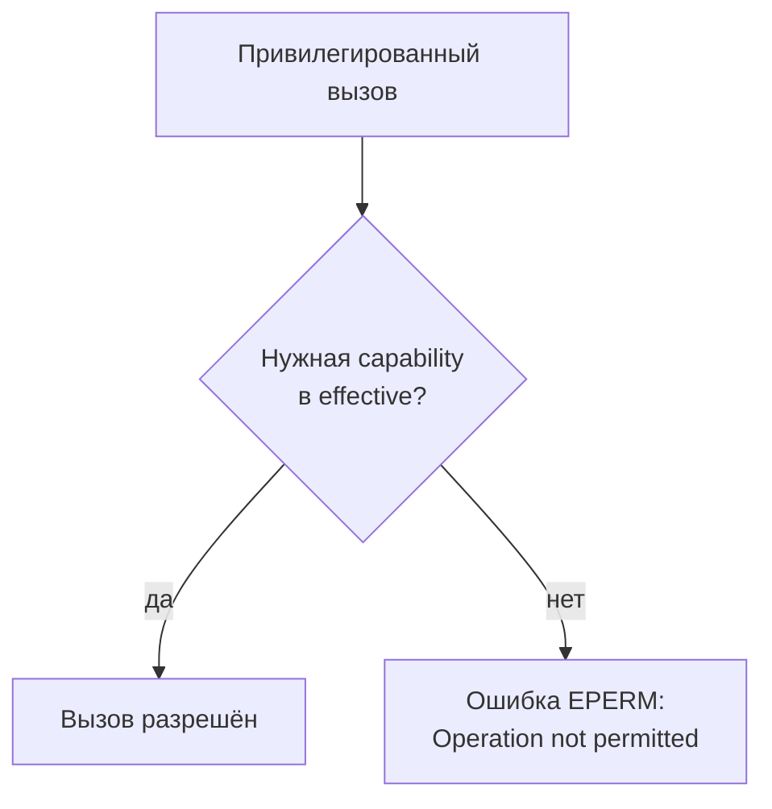
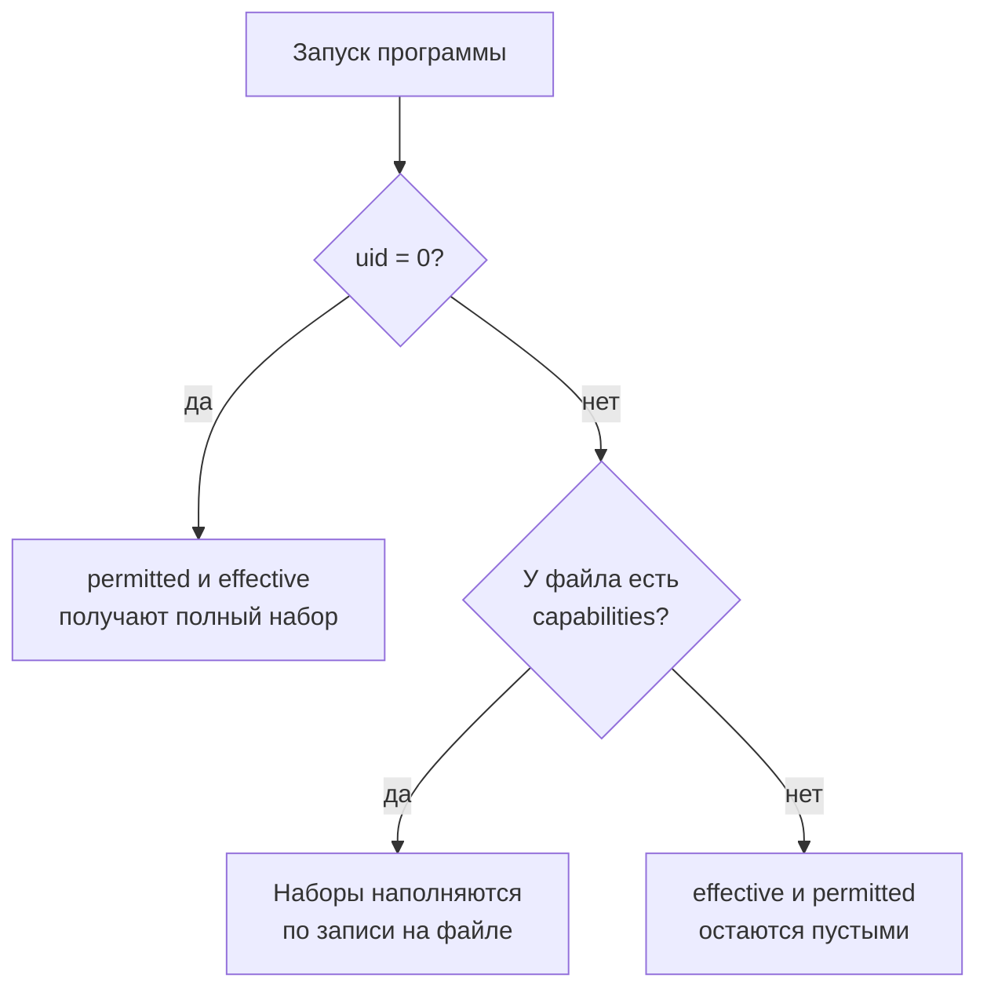

# Capabilities: деление полномочий root на отдельные права

Диагностическому агенту на сервере нужно проверять узлы сырым сокетом.
Сырым называют сокет, где программа собирает сетевой пакет сама, байт за
байтом, а не отдаёт эту работу ядру. Сырые сокеты нужны сканерам сети и
утилитам диагностики. У такой свободы есть цена: пакет с чужим обратным
адресом собирается тем же вызовом, как открытка с выдуманным
отправителем. Поэтому ядро
даёт сырые сокеты только привилегированным процессам. Запрет виден одним
прогоном — скрипт в несколько строк открывает сырой сокет и печатает
итог:

```text
$ python3 probe.py
сырой сокет: отказ, [Errno 1] Operation not permitted
```

Тот же скрипт на той же машине, но запущенный внутри свежего
пространства имён:

```text
$ unshare -Urn python3 probe.py
сырой сокет: открыт
```

Пространство имён — это способ ядра показать процессу его собственный
мир: свои процессы, свою сеть, своих пользователей. Команда
`unshare -Urn` создаёт такой мирок с пользователем root внутри и
запускает в нём скрипт. Бытовое соответствие — отдельная квартира:
внутри вы полный хозяин, а для соседей ваше хозяйство ничего не значит.
Аналогия ломается на выходе: хозяин квартиры может выйти и позвонить
соседу в дверь, а процесс выносит из своего мирка ровно ноль полномочий.
Устройство пространств имён разбирает следующая тема,
`linux-userns-cgroups`; здесь важен итог опыта.

Скрипт один, машина одна, а исход одного и того же вызова противоположный.
Поменялась не программа и не пользователь, а набор полномочий процесса.
Между «отказано» и «открыто» стоит ровно одна capability — CAP_NET_RAW,
«право открывать сырые сокеты». Если вы запускали контейнер и встречали
в его журнале «operation not permitted», вы уже видели эту модель в
работе. Вызову вроде бы ничего не мешало, а процессу не хватило одной
строки в наборе.

**Зачем это в работе AppSec-инженера.** Флаги `--cap-drop` и поля
securityContext в манифестах говорят именно на этом словаре, и ревью
запуска сервиса — это чтение его набора. Вопрос «зачем этому процессу
CAP_SYS_ADMIN» звучит в отчётах постоянно. Отвечать на него нужно
списком вызовов, которым эта capability действительно нужна, — или
признанием, что таких вызовов нет.

## Подумай, прежде чем читать

1. Программе нужно слушать порт 443. Сколькими полномочиями root её
   придётся наделить?
2. У процесса нет ни одной capability. Может ли он получить какую-нибудь
   сам, без посторонней помощи?
3. Сервису выдали только CAP_SYS_ADMIN. Много ли он потерял по сравнению
   с полным root?

## Как это работает

Полномочия root в Linux не монолитны. Они поделены на отдельные
capabilities — именованные права на отдельные действия. На ядре 6.18 их
сорок одна, и у каждой имя того, что она разрешает: CAP_NET_RAW открывает
сырые сокеты, CAP_SYS_TIME переводит часы, CAP_CHOWN меняет владельца
файла. Процесс получает не «права root», а набор, и ядро проверяет каждый
привилегированный вызов по этому набору. Отсюда рабочее следствие:
«процесс под root» и «процесс с одной capability» отвечают на один вызов
по-разному, и разница видна в описании запуска без всякого прогона.

**Откуда это взялось.** Классическая модель Unix знала два состояния
процесса: uid 0, которому можно всё, и все остальные, которым можно по
правам файлов. Программе с одним привилегированным вызовом — открыть
сырой сокет, перевести часы — приходилось давать root целиком, и каждая
ошибка в такой программе была полной компрометацией машины. Ответом
стало деление: полномочия root разложили на отдельные права по именам
вызовов. Программа с набором из одной CAP_NET_RAW открывает сырой сокет
и не может ничего остального. Ни прочитать чужой файл в обход прав, ни
послать сигнал чужому процессу: для обоих в наборе не хватит имени.

### Четыре набора процесса

У процесса четыре набора capabilities, и описывает их страница
capabilities(7) — седьмой раздел справочника man. Наборы часто путают,
потому что работают они в связке, а решает каждый своё.

- **Effective**, действующие — то, что ядро проверяет при каждом
  привилегированном вызове. Есть имя в effective — вызов разрешён.
- **Permitted**, разрешённые — верхняя граница effective. Процесс вправе
  поднимать в effective только то, что уже есть в permitted.
- **Inheritable**, наследуемые — то, что переживает запуск этим процессом
  другой программы.
- **Bounding**, потолок — граница на всю жизнь процесса и его потомков:
  снятую отсюда capability не вернуть ничем.

Разницу четырёх наборов видно на бытовой картинке — пропускной системе
здания, где у каждой двери свой турникет. Соответствие такое:

| Пропускная система | Набор процесса |
|---|---|
| Пропуск, предъявленный на турникете | effective |
| Пропуска, выданные вам на проходной | permitted |
| Пропуск, который разрешено передать сменщику | inheritable |
| Двери, разрешённые вашей роли в этом здании | bounding |
| Турникет внутри каждой двери | проверка внутри каждого вызова |

Ломается аналогия в двух местах. Забытый дома пропуск можно принести
завтра, а снятую из bounding capability не вернёт никто и ничем. И
турникет можно миновать через пожарную лестницу, а проверку ядра —
нельзя: она стоит внутри каждого привилегированного вызова.

Как наборы ведут себя при запуске программы, различать важно. Обычный
запуск стирает effective и permitted, если у программы нет файловых
capabilities — им посвящён подраздел «Capability на файле программы».
Bounding при запуске не меняется: его можно только срезать. Поэтому
bounding используют как сейф для потомков: процесс срезает его у себя
при старте, и ни один потомок лишнего не получит.

Есть и пятый набор, ambient. Он решает обратную задачу: обычный
пользователь передаёт capability через запуск программы. Страница
capabilities(7) прямо советует его программам, которые запускают
вспомогательные программы с повышенными capabilities, не прибегая к
setuid. На первом чтении достаточно четырёх наборов.

Наборы любого процесса читаются без привилегий. Ядро показывает
внутреннее состояние процессов как дерево файлов в каталоге /proc, и
файл /proc/self/status — карточка того процесса, который его читает. Все
пять наборов лежат там прямым текстом:

```text
$ grep Cap /proc/self/status
CapInh:  0000000800000000
CapPrm:  0000000000000000
CapEff:  0000000000000000
CapBnd:  000001ffffffffff
CapAmb:  0000000000000000
```

Каждой capability соответствует один бит, поэтому набор записан одним
шестнадцатеричным числом — маской. Разворачивает маски в имена capsh,
утилита из пакета libcap:

```text
$ capsh --decode=000001ffffffffff
0x000001ffffffffff=cap_chown,cap_dac_override,...,cap_checkpoint_restore
```

У обычного shell действующие и разрешённые наборы пусты, а потолок
полон: прав нет, запас широкий. Полный список во втором выводе — сорок
одно имя; здесь он сокращён многоточием, а табуляции заменены пробелами
при вёрстке.

Проверка на каждом привилегированном вызове устроена так:


```mermaid
flowchart TB
    A[Привилегированный вызов] --> B{Нужная capability<br/>в effective?}
    B -- да --> C[Вызов разрешён]
    B -- нет --> D[Ошибка EPERM:<br/>Operation not permitted]
```

**Описание схемы.** Каждый привилегированный вызов процесса ядро сверяет
с набором effective: нужная capability есть — вызов разрешён, нет —
вызов возвращает ошибку EPERM, «operation not permitted». Ровно эту
ошибку показал первый прогон темы.

### Capability на файле программы

Отдать набор процессу можно через файл программы. Утилита setcap из того
же пакета libcap записывает capabilities в атрибуты файла, и при запуске
программы ядро наполняет наборы процесса по этой записи. Механизм — тот,
что у бита setuid из темы `linux-setuid`, но дробный: вместо всех прав
владельца программа получает перечисленные имена. Читает такие записи
утилита getcap, и root ей не нужен:

```text
$ getcap -r /usr/bin
/usr/bin/newuidmap cap_setuid=ep
/usr/bin/newgidmap cap_setgid=ep
```

На этом стенде файловые capabilities стоят у двух программ, и каждой дана
ровно одна. Обе, newuidmap и newgidmap, — вспомогательные программы,
которые прописывают карты пользователей новым пространствам имён, и для
этого им нужно по одному праву. Для сравнения: у `/usr/bin/ping` на том
же выводе нет ни бита setuid, ни capabilities. Ему хватает ping-сокета —
варианта сокета с готовым типом пакета, который ядро разрешает без
CAP_NET_RAW.

### Capabilities против setuid

Оба механизма поднимают программу над правами вызвавшего, и выбор между
ними — рабочий вопрос. Бит setuid из темы `linux-setuid` переключает
процесс на владельца файла целиком: владелец root — значит, все
полномочия сразу. Файловая capability даёт перечисленные имена и ничего
сверх них: у такой программы нет даже прав владельца файла, если они не
перечислены. Поэтому там, где setuid-обёртке от root нужен один
привилегированный вызов, замена её записью setcap убирает из анализа всё,
чего обёртка не должна была уметь.

Заменить можно не всё. Открыть программе ровно один чужой файл, как это
умеет обёртка от владельца, через capabilities нельзя. Ближайшая по
смыслу, CAP_DAC_READ_SEARCH, открывает вообще все файлы в обход прав.
Там обёртка остаётся. Отсюда правило выбора. Нужна одна именованная
возможность — запись на файле; нужна модель владельца со всеми её
правами — бит setuid. Обе записи инвентаризуются обходом файловой
системы: `getcap -r` у одной, find с маской бита у другой.

### Откуда у root полный набор

Процессу с uid 0 никто ничего не выдаёт поимённо. При запуске программы
ядро заполняет ему permitted и effective целиком, если действующий или
реальный uid равен нулю, — так записано в capabilities(7). Поэтому
«запустить от root» и «выдать все сорок одну» — одна и та же строка в
описании запуска. Привычная запись «запускать службу от root» означает
полный набор, а не «обычные права администратора». Отсюда же видно, что
полномочия снимает: процесс, который полностью ушёл с uid 0, теряет
permitted и effective, если их специально не сохранили.


```mermaid
flowchart TB
    A[Запуск программы] --> B{uid = 0?}
    B -- да --> C[permitted и effective<br/>получают полный набор]
    B -- нет --> D{У файла есть<br/>capabilities?}
    D -- да --> E[Наборы наполняются<br/>по записи на файле]
    D -- нет --> F[effective и permitted<br/>остаются пустыми]
```

**Описание схемы.** Чем наполнятся наборы процесса, решается при запуске.
У процесса с uid 0 наборы permitted и effective полные. У обычного
запуска они наполняются записью capabilities на файле программы, а без
неё остаются пустыми. Потолок bounding это ветвление не меняет: он
срезается отдельно и только вниз.

### CAP_SYS_ADMIN — отдельный случай

Одна capability в списке стоит особняком. Документация называет
CAP_SYS_ADMIN «новым root», потому что она покрывает слишком многое:
монтирование файловых систем, создание пространств имён и ещё десятки
вызовов. Две младшие capability выделили из неё позже именно поэтому.
CAP_BPF — загрузку BPF-программ, маленьких фильтров и наблюдателей,
которые исполняются внутри ядра, — и CAP_PERFMON, счётчики
производительности, отделили в ядре 5.8. Тогда ради одной подсистемы не
приходилось давать SYS_ADMIN. Практический вывод для ревью: набор с
CAP_SYS_ADMIN по цене компрометации не отличается от полного root, и
требование «убрать лишние capabilities» такой набор не закрывает. В
отчёте это почти всегда находка.

## Как это атакуют

Стенд — любая машина с Linux; выводы сняты на Arch Linux, ядро 6.18,
Python 3.14.7, пакет libcap с утилитой capsh. Все опыты безопасны и
ничего не меняют в системе.

Шаг 1. Откуда у процесса внутри полный набор. Опыт из вступления
повторять не будем; посмотрим вместо этого, что получил процесс внутри
свежего пространства имён:

```text
$ unshare -Urn grep Cap /proc/self/status
CapInh:  0000000000000000
CapPrm:  000001ffffffffff
CapEff:  000001ffffffffff
CapBnd:  000001ffffffffff
CapAmb:  0000000000000000
```

Ядро наполнило permitted и effective целиком — по правилу «uid 0 при
запуске» из раздела «Как это работает»: внутри нового пространства
пользователей процесс стал его root. Проверка сырого сокета шла по
capability, а не по uid, и на этот раз имя в наборе нашлось. Снаружи у
этого root по-прежнему нет ничего.

Шаг 2. Снимок собственного процесса. Утилита capsh показывает наборы
именами, а не масками:

```text
$ capsh --print
Current: cap_wake_alarm=i
Bounding set =cap_chown,cap_dac_override,...,cap_checkpoint_restore
Ambient set =
```

У текущего shell действующих прав нет, наследуемое одно, потолок полон;
список сокращён многоточием, там сорок одно имя. Сверьте со снимком
/proc из раздела «Как это работает»: это два окна в одни данные, маски
и их развёртка.

Для сравнения — процесс с pid 1, первый процесс системы, который запускает
все остальные:

```text
$ grep CapEff /proc/1/status
CapEff:  000001ffffffffff
```

Он работает от root, и ядро наполнило ему наборы целиком — ровно то, о
чём сказано в разделе «Как это работает». Такая сверка двух процессов —
рабочий приём: снимок набора читается за секунду и не требует ни прав,
ни остановки службы.

Шаг 3. Тот же вопрос к лабе. Агенту netprobe для работы нужна одна
capability, а выдан полный набор. Эксплойт от имени процесса агента
пробует вызовы, которые агенту не нужны:

```text
$ python3 hack.py
Цель: code.py
  опыт 0 — контроль, рабочий probe: работает
  опыт 1 — вызовы, не нужные агенту:
           смонтировать файловую систему: СРАБОТАЛО
           перевести системные часы: СРАБОТАЛО
           прочитать /etc/shadow в обход прав: СРАБОТАЛО
           послать сигнал чужому процессу: СРАБОТАЛО
           слушать порт 443: СРАБОТАЛО
           сверх cap_net_raw доступно вызовов: 5 из 5
ЭКСПЛОЙТ СРАБОТАЛ: код внутри процесса агента получил
полномочия, которые агенту не нужны.
```

Признак срабатывания: из процесса, которому нужен один вызов, доступны
пять других. Здесь снова парность темы: одна и та же программа с полным
набором и с минимальным отвечает на один и тот же вызов по-разному.

Заметьте, чего атакующему не понадобилось. Ни эксплойта против ядра, ни
ошибки в самом агенте в рамках опыта: условие одно — его код оказался
внутри процесса агента. Как он туда попал — вопрос других тем, начиная
с этапа веб-уязвимостей. Всё остальное ему выдала конфигурация запуска:
полный набор превратил любой канал исполнения в полный root. Меняется
ровно одна строка — набор — и тот же канал заканчивается на отказе.

## Как это выглядит в коде

Избыточный набор виден не в коде программы, а в описании её запуска — и
в молчании самого кода о том, что ему нужно.

**Первое: «root на всякий случай» в запуске.** Из лабы — укажите, что
здесь выдано сверх нужного, прежде чем смотреть разбор:

```python
# УЯЗВИМО — демонстрация, не для продакшена
def start_agent(targets):
    proc = Process("netprobe", effective=ALL_CAPS)       # (1)
    return Agent(proc, targets)
```

1. Полный набор вместо одной нужной строки. В боевом коде то же самое
   выглядит как запуск от root, потому что root и есть полный набор.

**Второе: то же в описании развёртывания.** Назовите лишнее имя в команде
запуска.

```yaml
# УЯЗВИМО — демонстрация, не для продакшена
command: docker run --cap-add=SYS_ADMIN probe-agent  # (1)
```

1. Команда поднимает агента в контейнере, изолированном процессе; флаг
   `--cap-add` добавляет capability в его набор. Образу, которому хватило
   бы NET_RAW, добавили SYS_ADMIN — «новый root» по имени из документации.
   Инвариант дефекта: набор шире списка вызовов, которые программа делает
   на самом деле. Декорация: где записан набор — в коде, в файле службы,
   в манифесте.

**Третье: что не спасает.** Запуск «не от root» с полным потолком bounding
ничего не меняет: стоит процессу запустить программу с файловыми
capabilities, и набор наполнится по записи на файле. Имя пользователя —
не проверка полномочий. Проверяются наборы: процесс с uid 0 и пустым
набором не пройдёт ни одной проверки capability, а обычный uid с полным
набором — все.

**Четвёртое: откуда брать нужные имена.** Ревью набора начинается со
списка вызовов программы. Дальше каждый вызов ищется в capabilities(7):
у каждого имени там перечислено, что оно разрешает. Сырой сокет —
CAP_NET_RAW, порт ниже 1024 — CAP_NET_BIND_SERVICE, смена владельца
файла — CAP_CHOWN, сигнал чужому процессу — CAP_KILL. Имя, которого в
списке вызовов нет, — кандидат на удаление. Имя, которое покрывает
половину системы, — кандидат на пересмотр дизайна.

> **Примечание: ложное срабатывание.** Процесс с пустым effective, но
> полным потолком — не находка: прав у него нет, есть запас. Находка —
> процесс, у которого в effective или permitted лежит то, что не нужно
> его вызовам. Избыточные полномочия вообще — это CWE-250, а ошибки
> управления ими — CWE-269 (каталог Common Weakness Enumeration).

## Как защититься

Порядок один: выписать вызовы, которые программа делает на самом деле,
найти им имена в capabilities(7) и выдать ровно их:

```python
# Исправлено
def start_agent(targets):
    proc = Process("netprobe", effective={"cap_net_raw"})  # (1)
    return Agent(proc, targets)
```

1. Набор из одной строки: всё остальное код внутри процесса получить не
   сможет. На боевой системе то же делают записью setcap на файле
   программы или полями описания запуска — срезанием потолка и списком
   вместо умолчания.

Перенесите правило сами: тому же агенту добавили задачу слушать порт
443 — каким станет набор после починки? Ответ: из двух имён, cap_net_raw
и cap_net_bind_service.

Отдельный случай — вспомогательная программа, которая запускается из
непривилегированного процесса и должна унести capability с собой.
Записью на файле её не снабдить, если файл чужой: пакетный менеджер при
обновлении затрёт атрибут. Одного inheritable здесь мало: наследуемое имя
попадает в permitted запущенной программы только через встречную запись
на её файле. Файла с записью нет, поэтому и нужен ambient. Для такого
перехода capabilities(7) предлагает его прямо: процесс помечает
capability наследуемой и поднимает её в ambient. Тогда запущенная
программа получает её без бита setuid и без записи на файле.

**Границы применимости.** Capabilities делят полномочия root, но не
заменяют права на файлы из темы `linux-file-permissions`. Проверка
владельца и битов режима проходит всегда, и capability нужна именно там,
где обычной проверки недостаточно. Если единственное, что нужно
программе, покрывается CAP_SYS_ADMIN, — это повод пересмотреть дизайн, а
не выдать её: цена такого набора равна цене root. Наконец, набор чинится
на старте; процесс, которому права понадобятся «потом, может быть»,
придётся перезапускать или проектировать иначе.

## Как убедиться, что защита работает

Починку проверяют тем же эксплойтом, каким показывали дефект, — против
исправленного запуска:

```text
$ LAB_TARGET=solution.py python3 hack.py
Цель: solution.py
  опыт 0 — контроль, рабочий probe: работает
  опыт 1 — вызовы, не нужные агенту:
           смонтировать файловую систему: ОТКАЗАНО
           перевести системные часы: ОТКАЗАНО
           прочитать /etc/shadow в обход прав: ОТКАЗАНО
           послать сигнал чужому процессу: ОТКАЗАНО
           слушать порт 443: ОТКАЗАНО
           сверх cap_net_raw доступно вызовов: 0 из 5
ЭКСПЛОЙТ НЕ СРАБОТАЛ: у процесса только cap_net_raw, ничего сверх неё.
```

Пять отказов при рабочем probe: агент потерял всё, кроме того, что ему
нужно. Признак починки наблюдаемый — строка «ЭКСПЛОЙТ НЕ СРАБОТАЛ» и
код возврата 0.

**Регресс.** Семь проверок в tests.py: живой и мёртвый узел, повторная
проверка, отчёт, отказ узла вне списка, агент без целей и доступность
сырого сокета. Они зелёные до и после правки и упадут, если набор
сократят ниже нужного: сырой сокет там проверяется отдельной строкой. В
боевом репозитории регрессом служит проверка описания запуска в
конвейере: сверка поля capabilities с перечнем разрешённых имён падает
на любом добавлении.

**Негативные кейсы.** Сокращение не должно ломать службу: проверки узлов
обязаны проходить при минимальном наборе. Второй край — переборщить в
другую сторону и снять нужное: симптомом будет та самая ошибка EPERM из
начала темы в журнале сервиса. Поэтому починку принимают двумя
прогонами, а не одним: прогон эксплойта обязан дать код 0, и
функциональные проверки обязаны остаться зелёными.

На ревью пройдите по списку.

1. Проверьте, что у каждого процесса и программы с capabilities есть
   список вызовов, под которые они выданы (CWE-250).
2. Проверьте, что в effective нет ничего сверх этого списка; проверка —
   по /proc/PID/status и capsh --decode.
3. Проверьте, что CAP_SYS_ADMIN нет ни у одной службы, кроме случаев с
   письменным обоснованием, равным по весу обоснованию полного root.
4. Проверьте, что файловые capabilities на системе сверены с базовой
   линией: `getcap -r` по системным каталогам.
5. Проверьте, что потолок bounding у потомков срезан там, где процесс
   запускает другие программы (CWE-269).
6. Проверьте, что запуск «не от root» не подменяет проверку наборов:
   проверяются capabilities, а не uid.

## Как это находят инструменты

Статика по исходнику здесь почти бессильна: набор живёт в описании
запуска и на файле, а не в коде программы. Рабочая автоматика —
инвентаризация двух мест.

Первое место — файловые capabilities: `getcap -r` по системным каталогам
печатает все записи, и его вывод был в разделе «Как это работает».
Второе — наборы живых процессов: поля Cap в /proc/PID/status плюс
capsh --decode для развёртки масок в имена. Обход пишется в семь строк
на shell:

```bash
for p in /proc/[0-9]*/; do
  cmd=$(tr '\0' ' ' < "$p/cmdline" 2>/dev/null)
  [ -n "$cmd" ] || continue        # у потоков ядра cmdline пуста
  eff=$(awk '/^CapEff/ {print $2}' "$p/status" 2>/dev/null)
  [ -n "$eff" ] && [ "$eff" != "0000000000000000" ] || continue
  echo "${p#/proc/} ${cmd:0:28} :: $(capsh --decode="$eff")"
done
```

На стенде этой темы обход находит двадцать два процесса с непустым
effective. Вывод читается как карта полномочий системы; имена команд
сокращены, длинные списки свёрнуты многоточием:

```text
451/ systemd-timesyncd :: 0x0000000002000000=cap_sys_time
1476/ rtkit-daemon :: 0x0000000000800004=cap_dac_read_search,…
396/ systemd-journald :: 0x00000025402800cf (12 имён, есть cap_sys_admin)
1/ systemd :: 0x000001ffffffffff (полный набор)
```

Хорошие строки здесь узкие. Службе синхронизации времени выдана ровно
CAP_SYS_TIME, и это её работа — переводить часы. Демон rtkit выдаёт
приоритеты реального времени, и у него ровно пара под эту задачу. Длинные
строки — повод задать вопрос: у journald, службы, которая собирает
журналы системы, двенадцать имён, и среди них CAP_SYS_ADMIN. Такая строка
обязана иметь письменное обоснование, иначе это находка. Потоков ядра в
выводе нет: обход их пропускает, потому что полный набор у них стоит по
устройству ядра, а не по записи запуска.

**Что такая проверка пропустит.** Процессы, получившие полномочия без
файла и без записи в запуске, — например, через бит setuid: его словарь
и инвентаризация другие, они в теме `linux-setuid`. Шумит и обратное:
почти всякая файловая capability в выводе законна. Поэтому список, как и
в случае setuid, работает только против базовой линии системы — снимка
«что здесь стояло вчера».

## Частая ошибка

Процесс запущен не от root, и capabilities у него всего пара. Страшна ли
его компрометация — решите до чтения дальше.

Арифметика успокаивает: раз процесс запущен не от root, а с «небольшими»
capabilities, компрометация его не страшна.

**Цена набора измеряется именами, а не их числом.** CAP_SYS_ADMIN одна,
но документация зовёт её новым root: через неё доступны монтирование,
пространства имён и обход соседних ограничений. Процесс с такой одной
capability опаснее процесса с десятью мелкими. Цепочка у заблуждения
такая: uid не нулевой, capabilities мало по счёту — значит, и урон мал.
Оба звена про количество; ни одно — про то, какие именно полномочия
выданы.

Контрпример. Агенту диагностики вместо одной CAP_NET_RAW выдали
CAP_SYS_ADMIN «чтобы точно заработало». Код, исполненный внутри этого
процесса, монтирует файловую систему и читает хост за пределами всех его
изоляций. Счёт «capabilities мало» верного ответа не даёт: считать нужно
возможности. Вторая сторона той же ошибки — читать набор по числу строк:
сорок имён, из которых каждая узка, стоят дешевле одной широкой.

## Попробуй сам

**Цель одной фразой:** добиться, чтобы
`pilot/lab/linux-capabilities/hack.py` вышел с кодом 0, а `tests.py`
продолжил выходить с кодом 0.

Лаба повторяет опыт из раздела «Как это атакуют» руками: агенту выдан
полный набор, и из его процесса доступно всё, что есть у root.

Формат — Secure Code Game: чинится `code.py`, эксплойт и функциональные
тесты лежат рядом. Процесс и его capabilities изображены моделью на
структурах данных: настоящие привилегии и root не нужны, сеть не нужна.
Нужен Python 3.6 или новее. Секции «Запуск», «Сброс» и «Удаление» — в
`README.md` каталога.

Подсказка даётся одна: выпишите вызовы, которые агент делает на самом
деле, — он делает ровно один, — и оставьте в наборе процесса только его.

**Отдельная задача «почини».** Служба обязана работать после правки:
живой узел отвечает «доступен», мёртвый — «недоступен», отчёт собирается.
Починка «запретить всё» приёмку не пройдёт: контрольный опыт в hack.py
проверяет именно её. Наблюдаемый критерий: `tests.py` печатает «Упало
проверок: 0», а `hack.py` — «ЭКСПЛОЙТ НЕ СРАБОТАЛ».

Решение — `solution.py` в том же каталоге, открыто без условий.

## Проверь себя

1. Предскажите, чем кончится этот запуск, и проверьте прогоном.

   ```text
   $ python3 -c "import socket; socket.socket().bind(('', 443))"
   …
   ```

2. На сервере, где tcpdump поставлен пакетом, `getcap` печатает такую
   строку. Прочитайте запись: что умеет программа, чего она не умеет и
   чего у неё нет в сравнении с битом setuid?

   ```text
   $ getcap -r /usr/sbin
   /usr/sbin/tcpdump cap_net_admin,cap_net_raw=ep
   ```

3. Агенту диагностики нужен сырой сокет, и запускается он от root.
   Выберите починку:

   А. Выдать одну capability вместо полного root: CAP_SYS_ADMIN.

   Б. Выдать CAP_NET_RAW записью setcap на файле программы.

   В. Запускать от обычного пользователя: потолок bounding и так полон,
      сокет откроется.

4. Почему процесс с пустым набором capabilities не может поднять себе
   нужную сам, без посторонней помощи?
5. Возврат к теме `linux-setuid`: чем ответ `cap_net_raw=ep` на файле
   программы отличается от бита setuid на ней же для того же сырого
   сокета?
6. Возврат к теме `deny-by-default`: какой набор capabilities у процесса
   по умолчанию и почему это воплощение принципа «запрещено всё, что не
   разрешено»?

<details markdown="1">
<summary>Ответ 1</summary>

1. Отказ: `PermissionError: [Errno 13] Permission denied`. Порт ниже
   1024 требует CAP_NET_BIND_SERVICE, а у обычного процесса effective
   пуст — ядро отвечает отказом ещё до сети. Обратите внимание на код:
   здесь EACCES, «permission denied», а не EPERM из первого опыта темы;
   у разных вызовов разные коды отказа. Команда для прогона — та же
   строка: `python3 -c "import socket; socket.socket().bind(('', 443))"`.

</details>

<details markdown="1">
<summary>Ответ 2</summary>

2. Программа умеет ровно два именованных действия: сырые сокеты
   (cap_net_raw) и управление сетевыми интерфейсами (cap_net_admin).
   Пометка `=ep` поднимает оба имени в permitted и effective при запуске.
   Всё остальное ей закрыто: ни чужих файлов, ни сигналов чужим
   процессам, ни смены часов. От бита setuid она отличается тем, что не
   получает прав владельца файла. Бит дал бы все полномочия root разом,
   здесь же выданы два имени из сорока одного.

</details>

<details markdown="1">
<summary>Ответ 3: разбор вариантов</summary>

3. Верный ответ — Б.

   А. CAP_SYS_ADMIN документация называет «новым root»: монтирование,
      пространства имён, десятки вызовов. Цена компрометации такого
      набора равна цене полного root, и замена ничего не сокращает.

   Б. Набор из одного имени закрывает задачу и ничего сверх неё не даёт:
      код внутри процесса не прочитает чужой файл и не пошлёт сигнал
      чужому процессу. Инвентаризуется одной командой `getcap -r`.

   В. Потолок — не права: при пустых effective и permitted процесс не
      откроет ни порт, ни сокет. Полный потолок означает лишь, что
      поднять туда лишнее возможно позже, — это риск, а не помощь.

</details>

<details markdown="1">
<summary>Ответ 4</summary>

4. Поднимать в effective можно только то, что уже есть в permitted, а
   permitted при обычном запуске стирается. Полный набор наполняется
   ядром только процессу с uid 0; остальным его отдают извне — записью
   на файле программы или ambient-набором предка. Поэтому capabilities
   выдаются конфигурацией запуска, а не добываются изнутри.

</details>

<details markdown="1">
<summary>Ответ 5</summary>

5. Бит setuid переключает процесс на владельца файла целиком: у владельца
   root — значит, на все полномочия сразу, включая чужие файлы и сигналы.
   Запись `cap_net_raw=ep` даёт одно имя и ни одного сверх него: сырые
   сокеты открываются, а всё остальное по-прежнему решают обычные права
   вызвавшего.

</details>

<details markdown="1">
<summary>Ответ 6</summary>

6. Пустой: при обычном запуске effective и permitted стираются, и каждое
   привилегированное действие процесса кончается отказом. Привилегия
   существует, только когда её выдали поимённо, — ровно тот принцип, что
   в `deny-by-default` применялся к правилам доступа: разрешение
   появляется явной записью, а всё незаписанное запрещено.

</details>

## Источники

1. capabilities(7) «overview of Linux capabilities», Linux man-pages
   6.18; реестр `man-capabilities`. Разделы: список capabilities, четыре
   набора процесса плюс ambient, файловые capabilities, примечание про
   CAP_SYS_ADMIN.
   <https://man7.org/linux/man-pages/man7/capabilities.7.html>
2. capsh(1) «capability shell wrapper», Linux man-pages 6.18; реестр
   `man-capsh`. Разделы: --print, --decode, --drop; сюда же родственные
   getcap(8) и setcap(8).
   <https://man7.org/linux/man-pages/man1/capsh.1.html>

Каркас этапа: записи семейства man-* (Linux man-pages project, выпуск
6.18) — наследуются всеми темами подраздела 4.1.

**Скоропортящийся слой.** Список capabilities растёт от версии к версии
ядра: тема опирается на сорок одну на ядре 6.18, на другом ядре число
иное. Файловые capabilities в выводе getcap и наборы процессов в обходе
/proc — свойство конкретной системы и её пакетов. Семантика четырёх
наборов стабильна.

**Маркеры уверенности.** **Проверено лично** 2026-09-01 на Arch Linux,
ядро 6.18.48-1-lts, Python 3.14.7, capsh из libcap и перепроверено
2026-10-03 на ядре 6.18.54-1-lts: отказ сырого сокета без CAP_NET_RAW и
успех внутри свежего user+net namespace, наборы процесса внутри такого
пространства, маски /proc/self/status и их развёртка capsh --decode,
файловые capabilities на newuidmap и newgidmap, отсутствие битов и
capabilities у /usr/bin/ping, открытие ping-сокета (SOCK_DGRAM) без
capability, полный набор у pid 1, обход /proc с двадцатью двумя
процессами с непустым effective и развёртка их масок, отказ bind на
порт 443. Лаба прогнана заново на обеих целях: `hack.py` даёт код 1 на
code.py и 0 на solution.py, `tests.py` зелёный в обоих случаях. Состав и
смысл наборов, формула «новый root» про CAP_SYS_ADMIN, поведение ambient
и правила наследования при exec — **по документации** (capabilities(7),
открыт лично 2026-09-01). Работа setcap на живой системе **не
проверялась**: прав root на стенде нет, и тема это не скрывает.
