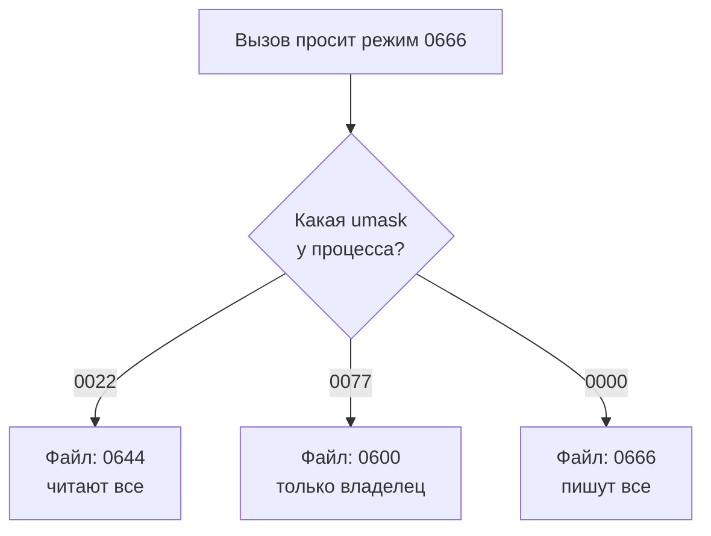

# Права на файлы: владелец, группа, биты режима, umask

Уровень **L1** · время 70 мин (теория 40 / лаба 20 / самопроверка 10,
оценка)

Сервис отчётов при первом запуске пишет конфиг с токеном доступа. Автор
сервиса при создании файла попросил у системы режим «читать и писать
всем» и пошёл дальше: он знал, что система обычно подрезает лишнее.
Проверим, что получилось, — та же операция, выполненная руками на
обычной машине:

```text
$ umask
0022
$ touch service.conf
$ stat -c '%a %A' service.conf
644 -rw-r--r--
```

Команда touch просит для нового файла режим 0666 — чтение и запись
каждому. Система ответила 0644: запись срезана, а чтение осталось и
группе, и всем остальным. Токен из такого конфига прочитает любой
пользователь этой машины — и любой процесс, запущенный под любой
учётной записью.

Если вы ставили `chmod +x` своему скрипту или читали первую колонку в
выводе `ls -l`, вы уже трогали эту модель руками. Она работала молча,
и работала не всегда так, как ожидалось.

У каждого файла в Linux есть владелец, группа и девять битов режима:
чтение, запись и исполнение — для владельца, для группы и для всех
остальных. Ядро сверяет с этой моделью каждое открытие файла. Права
нового файла складываются из двух чисел: режима, который попросила
программа, и маски umask процесса, которая срезает биты из
запрошенного.

Дальше разберём, как ядро делит обращающихся на три категории и в каком
порядке проверяет биты. Отдельно — почему один и тот же вызов даёт
разные права на разных машинах и кому достаётся маска процесса. Затем
найдём дефект в
коде на Python и в Node, починим его явным режимом, а в лабе закроем от
чужих глаз конфиг с токеном.

Повышение прав через биты setuid и setgid разбирает тема
`linux-setuid`, деление полномочий root — тема `linux-capabilities`;
здесь они не дублируются.

## 0. Коротко

То же в терминах, которыми это обсуждают. Доступ к файлу решают
владелец файла, его группа и девять битов режима: чтение, запись,
исполнение — три раза, для трёх категорий обращающихся. На каталоге те
же биты означают другое: исполнение там — право входить в каталог и
обращаться к его содержимому. Права нового файла равны запрошенному
режиму минус биты маски umask процесса; маска наследуется потомками и
умеет только отнимать. Типовой дефект: файл с секретом создают с
широким режимом в расчёте на маску — и на машине с другой маской секрет
читают все. Чинится это явным узким режимом в самом вызове создания.

**Зачем это в работе AppSec-инженера.** Находка «конфиг создался с
правами 0664» встречается в ревью постоянно, и видна она в одной строке
вызова. Спор о такой находке упирается в модель: кто именно получит
доступ, кто задаёт права и что может поменять их за спиной у кода.
Пока модель не названа целиком, разработчик отвечает «у нас umask
правильный» — и по-своему прав: на его машине. Тема даёт словарь, на
котором этот спор закрывается.

## 1. Цели

После этого раздела вы сможете:

1. Прочитать режим файла из вывода stat и назвать, кто что может с ним
   делать.
2. Объяснить, как umask срезает права при создании файла и кому маска
   достаётся.
3. Найти в коде создание файла с широкими правами и отличить его от
   законного.
4. Починить создание файла явным режимом и подтвердить починку выводом
   stat.

## 2. Предвопросы

Ответьте до чтения, даже если не уверены.

1. Программа просит для нового файла режим 0666, umask процесса — 0022.
   Какие права получит файл?
2. Пользователь не может получить список файлов каталога, но читает
   файл внутри него, зная имя. Какой бит при этом снят с каталога?
3. Демон стартовал с umask 0000. Что станет с файлами, которые он
   создаёт вызовом с режимом 0666?

## 3. Механика

**Откуда это взялось.** Машине с одним пользователем права не нужны:
делить нечего. UNIX с начала был многопользовательским: десятки людей
делили одни диски. Наивный ответ «файл видит только владелец» ломался
о совместную работу — группе проекта нужен общий каталог. Отсюда три
категории вместо двух: владелец, группа, остальные. Вторая половина
механизма появилась из лени программ: создание файла массово просило
режим 0666 «на всякий случай». Вместо правки каждой программы ввели
маску процесса, которая срезает биты при создании. Она и сегодня решает
половину вопроса о правах нового файла.

### Три категории и девять битов

inode(7) перечисляет биты режима файла поимённо: S_IRUSR, S_IWUSR,
S_IXUSR — владельцу; S_IRGRP, S_IWGRP, S_IXGRP — группе; S_IROTH,
S_IWOTH, S_IXOTH — остальным. В выводе `ls -l` это десять позиций:
первый символ — тип файла, дальше три тройки. Запись `-rw-r--r--`
читается так: обычный файл, владелец читает и пишет, группа читает,
остальные читают.

Ядро проверяет доступ в фиксированном порядке. Если обращающийся —
владелец файла, применяются биты владельца, и проверка закончена. Иначе
если он входит в группу файла — биты группы, и тоже всё. Иначе — биты
остальных. Следствие, которое путает новичков: владелец файла
`-r--r--r--` писать в него не может. Чужие биты к нему не применяются,
даже когда они шире.

### Владелец и группа — это числа

Внутри системы владелец и группа хранятся числами — идентификаторами
uid и gid. Соответствие чисел именам живёт в `/etc/passwd` и
`/etc/group`, и вывод `ls -l` — это уже разрешённые имена. Пользователь
может входить в несколько групп, но файл указывает ровно одну.
Поменять владельца файла может только root; отдать файл группе владелец
вправе, если сам в неё входит. Для ревью из этого следует: права
проверяются по числам, и «имя сервиса» в конфиге — подпись, а не
граница.

### Бит исполнения на каталоге

На каталоге та же тройка битов означает другое. Чтение разрешает
получить список имён внутри. Исполнение разрешает входить в каталог и
обращаться к его содержимому по имени — открыть файл, перейти глубже.
Запись вместе с исполнением разрешает создавать и удалять записи.

Отсюда рабочий приём закрытия данных: у каталога оставляют только
исполнение — список имён не читается, а файл по известному имени
открывается. И наоборот, частая поломка: с каталога сняли исполнение,
и файлы внутри не открываются даже при верных правах на них самих.

На обычном файле бит исполнения означает разрешение запустить файл как
программу. Без него даже исполняемый по содержимому файл не стартует.
Скрипту с вашим кодом нужны и чтение, и исполнение: первое, чтобы
интерпретатор открыл файл, второе, чтобы ядро согласилось его
запустить. Именно поэтому `chmod +x` на скрипте — самая первая команда,
которую вы выполняли в этой модели.

Ещё одно следствие той же раскладки: удаление и переименование файла
решает не сам файл, а каталог, в котором он лежит. Права на файл тут не
участвуют — нужна запись и исполнение на каталоге. Поэтому файл с
режимом 0600 в общем каталоге может удалить любой, кто пишет в этот
каталог. Сдерживает это sticky bit, и он тоже из темы `linux-setuid`.

### Маска umask

При создании файла программа передаёт ядру желаемый режим, а ядро
считает итог: запрошенный режим, из которого убраны биты, выставленные
в umask процесса. Маска 0022 означает «срезать запись у группы и у
остальных», и просьба 0666 превращается в 0644 — ровно то, что случилось
в примере из начала темы.

Два свойства маски важны для ревью. Первое: маска принадлежит процессу,
а не файлу и не системе. Потомок наследует её от родителя при fork, и
execve её не сбрасывает (umask(2), раздел NOTES). Значит, итоговые права
файла зависят от того, кто и как запустил программу, — это CWE-277
(каталог Common Weakness Enumeration), небезопасные унаследованные
права. Второе: маска умеет только срезать.
Шире, чем попросила программа, файл не станет никогда; потолок задаёт
код.



**Описание схемы.** Вход один: вызов, просящий режим 0666. Дальше исход
решает маска процесса: при 0022 файл получается читаемым всеми, при
0077 — только владельцем, при 0000 — записываемым всеми. Один и тот же
вызов даёт три разных результата в зависимости от окружения, в котором
его запустили.

## 4. Эксплуатация

Стенд — любая машина с Linux; выводы ниже сняты на Arch Linux, ядро
6.18, coreutils 9.11. Повторите их руками: каждая команда безопасна и
ничего не меняет за пределами рабочего каталога.

Шаг 1. Один запрос, три маски. touch просит для файла 0666; посмотрим,
что остаётся после разных масок:

```text
$ umask 022; touch a.conf; stat -c '%a' a.conf
644
$ umask 077; touch b.conf; stat -c '%a' b.conf
600
$ umask 000; touch c.conf; stat -c '%a' c.conf
666
```

Режим попросили один и тот же, получили три разных файла. Третья строка
— та самая находка из отчётов: запись открыта всем. Парность, на которой
стоит эта тема, видна прямо здесь: один вызов, разные маски, разный
ответ. Тот же режим 0755 на каталоге из первого опыта означал бы
«входить и читать список могут все». На каталоге биты читаются
иначе, и проверять их нужно другим вопросом.

Шаг 2. Маска наследуется потомком. Поменяем маску и запустим дочерний
процесс — он создаст файл уже со своей унаследованной маской:

```text
$ umask 027; bash -c 'umask; touch child.conf; stat -c %a child.conf'
0027
640
```

Потомок напечатал унаследованную маску 0027 и создал файл с режимом
0640: чтение группе уцелело, остальные не получили ничего. Программа
о маске не спрашивала — она досталась ей от родителя.

Шаг 3. Каталог без бита исполнения:

```text
$ chmod 000 closed
$ ls closed
ls: cannot open directory 'closed': Permission denied
$ cat closed/token.txt
cat: closed/token.txt: Permission denied
```

Ни списка, ни содержимого: без x-бита на каталоге права на сам файл уже
не доходят до проверки.

Шаг 4. Лаба темы — сервис, пишущий конфиг с токеном вызовом с режимом
0666. Прогон эксплойта:

```text
$ python3 hack.py
Цель: code.py
  опыт 1 — umask 022: режим 0644, группа читает: ДА, остальные читают: ДА
  опыт 2 — umask 077: режим 0600 (тот же вызов, другая маска)
ЭКСПЛОЙТ СРАБОТАЛ: конфиг с токеном читают не только владелец.
```

Признак срабатывания — биты чтения для группы и остальных при типичной
маске 0022. Второй опыт справочный: тот же вызов под маской 0077 даёт
закрытый файл. Это показывает, на чём держалась мнимая безопасность:
на настройке окружения, а не на коде.

## 5. Как выглядит в коде

Ревьюер ищет два признака, оба видны по одной строке: широкий режим в
вызове создания и отсутствие явного режима там, где секрет.

**Первое: широкий режим в самом вызове.** Так выглядит находка из лабы:

```python
# УЯЗВИМО — демонстрация, не для продакшена
fd = os.open(path, os.O_WRONLY | os.O_CREAT | os.O_TRUNC, 0o666)  # (1)
```

1. Режим 0666 просит чтение и запись каждому. Чем это кончится, решит
   маска процесса, а её автор кода не контролирует.

**Второе: тот же дефект на другом стеке.** В Node умолчание уже
расставлено за автора:

```javascript
// УЯЗВИМО — демонстрация, не для продакшена
fs.writeFileSync(path, `token=${token}\n`);              // (1)
```

1. У writeFileSync умолчательный режим 0666. Вызов выглядит нейтрально,
   а просит широкие права. Инвариант дефекта — широкий запрошенный
   режим; декорация — имя функции и то, виден режим в строке или спрятан
   в умолчание.

**Третье: что не спасает.** Вызов chmod сразу после создания оставляет
окно: между open и chmod файл существует с широкими правами, и читатель
может успеть внутрь. Проверка маски при старте программы не спасает
тоже: она верна в момент проверки, а потомки и библиотеки создают файлы
позже и, возможно, с другой маской. Надежда на «правильный Dockerfile»
не спасает втройне — она переносит вопрос на машину, которую автор кода
никогда не видел.

**Четвёртое: буквы вместо привычных rwx.** Если в выводе `ls -l` на
месте x стоит `s` или в конце `t`, это особые биты setuid, setgid и
sticky. Режим `-rwsr-xr-x` у `/usr/bin/passwd` виден на любой машине.
Они не про чтение, а про то, с чьими правами программа запустится и кому
можно удалять файлы в общем каталоге. Это предмет темы `linux-setuid`;
для ревью прав на файлы достаточно распознать такой режим и не списать
его на опечатку.

> **Примечание: ложные срабатывания.** Режим 0644 на публичном файле
> законен: readme, статика, собранный артефакт. Режим 0755 на каталоге и
> на исполняемом файле — тоже норма. Дефектом широкие права становятся у
> содержимого, которое не должно уходить за пределы владельца: секреты,
> ключи, конфиги с паролями. Класс таких дефектов каталоги называют
> CWE-732, а его частный случай «широко с самого создания» — CWE-276.
> Смотрите на содержимое файла, а не на само число.

## 6. Как чинится

Правило одно: для файла с секретом режим задаётся явно и не шире 0600,
прямо в вызове создания:

```python
# Исправлено
fd = os.open(path, os.O_WRONLY | os.O_CREAT | os.O_TRUNC, 0o600)  # (1)
```

1. Маска умеет только срезать, поэтому шире 0600 этот файл не станет
   ни при какой umask. Безопасность больше не зависит от окружения.

Второй рубеж — маска самого процесса: демону, пишущему конфиги,
выставляют umask 0077 при старте, и тогда даже будущая ошибка в новом
коде не откроет файлы наружу. Это страховка, а не замена явного режима:
маска процесса меняется извне, режим в вызове — нет.

Каталог с секретами закрывается раньше файла: режим 0700 на нём не
впускает чужих к содержимому независимо от прав на файлы внутри.
Проверка доступа идёт по цепочке каталогов от корня, и слабое звено в
ней обесценивает самый строгий режим файла.

**Границы применимости.** Если у родительского каталога задан список
доступа по умолчанию (default ACL), ядро игнорирует umask и назначает
права по списку (umask(2), раздел NOTES). В таком каталоге ни явный
режим, ни маска не дают последнего слова — его имеет список доступа, и
ревью переносится туда. Второй край: файлы, которые обязаны читаться
другими службами, — логи, общие отчёты. Им 0600 не подходит; там ответ —
отдельная группа и режим 0640, то есть осознанный выбор, а не
умолчание.

## 7. Как проверить фикс

**Ретест.** Прогоните тот же эксплойт против исправленного файла:

```text
$ LAB_TARGET=solution.py python3 hack.py
Цель: solution.py
  опыт 1 — umask 022: режим 0600, группа читает: нет, остальные читают: нет
  опыт 2 — umask 077: режим 0600 (тот же вызов, другая маска)
ЭКСПЛОЙТ НЕ СРАБОТАЛ: ни группа, ни остальные конфига не читают.
```

Было 0644, стало 0600 — при той же маске окружения. Код возврата 0.

**Регресс.** Одиннадцать проверок в tests.py лабы: запись и чтение
конфига, отсутствие затирания, отказ пустого токена, работа под тремя
масками. Они зелёные и до правки, и после — именно это делает их
регрессом, а не ретестом. В репозитории проекта таким регрессом служит
тест, который создаёт файл и проверяет его биты вызовом stat. Он упадёт
при любом откате починки и при смене маски на стенде.

**Негативные кейсы — что должно продолжать работать.** Владелец читает
и пишет файл при umask 0022, 0027 и 0077. Сервис, запущенный повторно,
находит существующий конфиг и не переписывает его. Самое частое
осложнение после такой починки — дочерний процесс под другой учётной
записью, который раньше читал конфиг по широким правам. Он сломается,
и это надо искать при приёмке, а не в проде.

## 8. Как ловится автоматикой

Дефект локален и виден по вызову, поэтому статика ловит его хорошо.
Правило для Semgrep лежит в `pilot/semgrep/insecure-file-mode.yaml`:

```yaml
# ФРАГМЕНТ — срез файла pilot/semgrep/insecure-file-mode.yaml,
# самостоятельно не запускается: опущены message и метаданные
rules:
  - id: insecure-file-mode
    languages: [python]
    severity: ERROR
    patterns:
      - pattern-either:
          - pattern: os.open($PATH, $FLAGS, 0o666, ...)
          - pattern: os.open($PATH, $FLAGS, 0o777, ...)
          - pattern: os.chmod($PATH, 0o666, ...)
          - pattern: os.chmod($PATH, 0o777, ...)
          - pattern: $PATH.chmod(0o666, ...)
          - pattern: $PATH.chmod(0o777, ...)
```

Листинг сокращён: в файле правила есть ещё текст сообщения и метаданные.
Правило прогнано на Semgrep 1.174.0: четыре размеченных находки из
четырёх, ни одного срабатывания на четырёх чистых кейсах. На уязвимом
code.py лабы — одна находка, на решении — ни одной.

**Что оно пропустит.** Режим, пришедший аргументом извне функции:
`os.chmod(path, mode)` невидим, потому что значение видно только в месте
вызова. Символьную форму `chmod g+w` в shell-скриптах правило не ловит
вовсе — оно написано про Python. Зато константу, посчитанную в тексте
программы, Semgrep сворачивает: `mode = 0o640 | 0o026` с последующим
chmod поймано прогоном, хотя литерала 0666 в строке вызова нет.

**Какой шум даст.** Режим 0666 на заведомо публичном файле —
срабатывание есть, дефекта нет. Такие места закрываются пометкой
`# nosemgrep` с пояснением, а не ослаблением правила. Правило здесь
работает намеренно широко: содержимое файла из строки вызова не видно.

## 9. Ловушка

Распространённое мнение: права на файлы — дело администратора сервера,
код приложения тут ни при чём.

**Потолок прав задаёт код, маска его только срезает.** Механизм из
блока «Механика»: итоговый режим не может стать шире запрошенного,
поэтому вызов, просящий 0666, заранее подписывается под любым итогом,
какой выдаст чужая маска. Обратное неверно тоже: срезанная маской
проверка не возвращается. Программа, попросившая 0600 и ожидающая, что
система «дорисует» чтение группе, получит файл, закрытый для группы, —
маска работает в одну сторону.

Контрпример из блока «Эксплуатация». Один и тот же вызов дал 0644 на
машине разработчика и 0666 на хосте, где демон стартовал с umask 0000.
Администратор первой машины свою работу сделал верно; дефект сидел в
вызове и ждал другого окружения.

## 10. Чеклист ревью

1. Verify that файлы с секретами создаются с явным режимом не шире 0600,
   а не в расчёте на маску процесса (CWE-276).
2. Verify that режим задан в самом вызове создания, а не chmod после:
   между созданием и chmod остаётся окно с широкими правами.
3. Verify that процессу, пишущему конфиги, задана строгая umask при
   старте как второй рубеж (CWE-277).
4. Verify that каталоги с секретами не дают лишнего исполнения: вход в
   такой каталог разрешён только владельцу.
5. Verify that у родительского каталога нет списка доступа по умолчанию,
   отменяющего действие маски (umask(2)).
6. Verify that итоговые права проверены выводом stat на живой системе,
   а не выведены из кода в уме (CWE-732).

## 11. Лаба

**Цель одной фразой:** добиться, чтобы
`pilot/lab/linux-file-permissions/hack.py` вышел с кодом 0, а `tests.py`
продолжил выходить с кодом 0.

Лаба повторяет руками то, что показано в блоке «Эксплуатация»: сервис
пишет конфиг с токеном. Эксплойт создаёт его под разными масками и
сверяет биты вызовом stat.

Формат — Secure Code Game: чинится `code.py`, эксплойт и функциональные
тесты лежат рядом. Нужен Python 3.6 или новее, сеть не нужна, права
root не нужны. Секции «Запуск», «Сброс» и «Удаление» — в `README.md`
каталога.

Подсказка даётся одна: маска может только срезать биты и никогда не
добавляет. Попросите у ядра режим, при котором файл закрыт для всех,
кроме владельца, — тогда любая маска оставит его закрытым.

**Отдельная задача «почини».** Сервис обязан работать под любой из
типовых масок — 0022, 0027, 0077: запись и чтение конфига владельцем,
отсутствие затирания при повторном запуске. Наблюдаемый критерий:
`tests.py` печатает «Упало проверок: 0» под всеми тремя масками,
а `hack.py` — «ЭКСПЛОЙТ НЕ СРАБОТАЛ».

Решение — `solution.py` в том же каталоге, открыто без условий.

## 12. Проверь себя

1. Программа просит для файла режим 0666, umask процесса — 0027. Какой
   режим получит файл?
2. Файл `-r--r--r--` принадлежит вам. Можете ли вы в него писать и
   почему?
3. Что должно быть у каталога и у файла, чтобы файл по известному имени
   читался, а список имён в каталоге — нет?
4. Демон стартовал с umask 0000 и пишет конфиг вызовом с режимом 0666.
   Что видит пользователь с соседней учётной записью?
5. Чем режим в вызове создания надёжнее chmod, сделанного сразу после?

<details markdown="1">
<summary>Ответы</summary>

1. 0640: маска 0027 срезает запись у группы и все биты у остальных.
2. Нет. Раз обращается владелец, ядро смотрит только биты владельца, а
   там записи нет; широкие биты группы и остальных к владельцу не
   применяются.
3. На каталоге — бит исполнения без чтения, на файле — чтение
   владельцу или той категории, к которой относится читатель.
4. Конфиг получит режим 0666: читать и менять его может любой
   пользователь машины.
5. Между созданием и chmod файл уже существует с широкими правами, и
   читатель может успеть в это окно. Режим в вызове не оставляет окна
   вовсе.

</details>

> **Примечание.** Вопросов на возврат к прошлым темам здесь нет: эта
> тема — корень маршрута этапа 4, предпосылок у неё нет.

## 13. Источники

1. inode(7) «file inode information», Linux man-pages 6.18; реестр
   `man-inode`. Разделы: The file type and mode — имена и значения битов
   режима, S_IRWXU и дальше по списку.
   <https://man7.org/linux/man-pages/man7/inode.7.html>
2. umask(2) «set file mode creation mask», Linux man-pages 6.18; реестр
   `man-umask`. Разделы: DESCRIPTION — как маска срезает биты, NOTES —
   наследование потомками, поведение execve, default ACL.
   <https://man7.org/linux/man-pages/man2/umask.2.html>

Каркас этапа: записи семейства man-* (Linux man-pages project, выпуск
6.18) — эта тема открывает подраздел 4.1, и рамку наследуют остальные
его темы.

**Скоропортящийся слой.** Семантика битов и маски стабильна
десятилетиями; скоропортящееся здесь — умолчания инструментов (режим
0666 у writeFileSync, умолчание mode у os.open) и версии, на которых
сняты выводы команд. При ревизии перечитывается эта рамка, а не
механика.

**Маркеры уверенности.** Все выводы команд в теме — **проверено лично**
2026-09-01 на Arch Linux, ядро 6.18.48-1-lts, GNU coreutils 9.11,
bash 5.3.15, Python 3.14.7: срезание бит маской (0644, 0600, 0666 при
трёх масках), отказ на каталоге без бита исполнения, наследование маски
потомком (0027 дало 0640 у файла потомка). Лаба прогнана в тот же день
на обеих целях: `hack.py` даёт код 1 на code.py и 0 на solution.py,
`tests.py` зелёный в обоих случаях. Правило Semgrep 1.174.0 сверено с
разметкой: четыре находки из четырёх, все с литералом режима.
Порядок проверки битов, наследование umask и поведение default ACL —
**по документации** (inode(7) и umask(2), открыты лично 2026-09-01).
