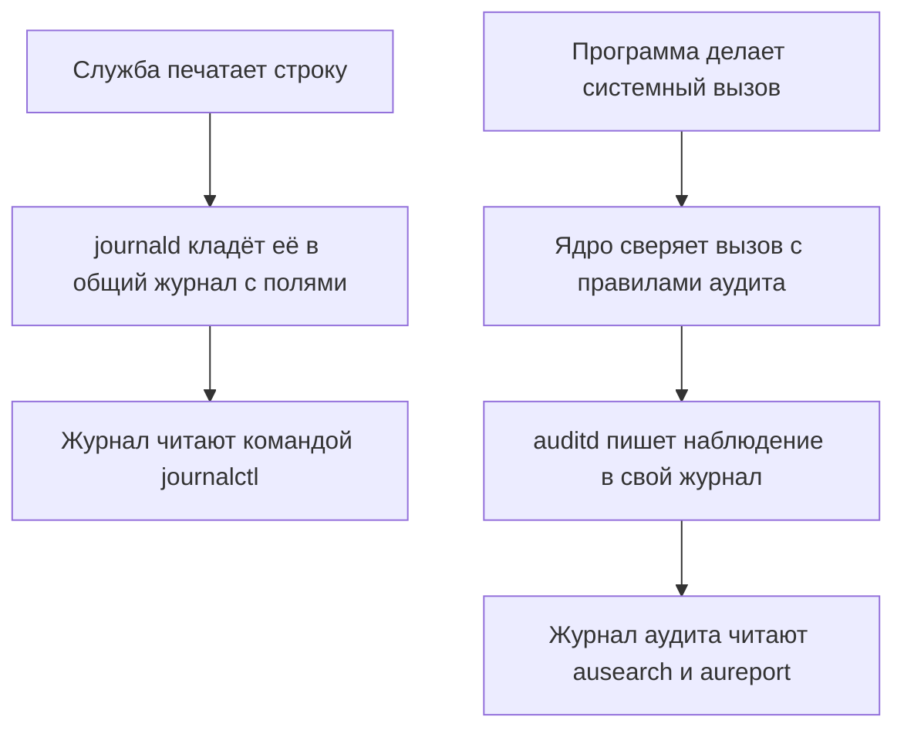

# Логи, аудит и усиление systemd-сервиса

Тема про лимиты, `linux-userns-cgroups`, закончилась жёсткой сценой:
процесс съел всю память своей cgroup, и ядро его убило. Сам процесс об
этом уже ничего сказать не мог, потому что был мёртв. Но запись о
случившемся есть, и та же команда находит такую запись и сегодня:

```text
$ journalctl --user --no-pager -o cat | grep oom-kill | tail -1
app-codium-…scope: Failed with result 'oom-kill'.
```

Имя запуска в записи сокращено по ширине. Строку написал не погибший
процесс, а менеджер, который за ним следил, и хранит её журналирующая
служба. Значит, на хосте кто-то ведёт записи, и у расследования есть с
чего начать. Тема отвечает на три вопроса: кто на хосте что записывает,
где это читать и как срезать сервису права. Третий вопрос решается без
контейнера и без правки кода, одними строками в описании службы.

## Кто на хосте ведёт записи

Сначала о том, кто вообще запускает службы на Linux-машине. Первым
после загрузки ядра стартует процесс systemd, и дальше он запускает и
дежурит все службы хоста. Это менеджер системы и служб: он читает
описание каждой службы, стартует её, следит, жива ли она, и поднимает
заново по правилам.

Бытовое соответствие — диспетчер смены: у него
карточка на каждый станок, он включает станки утром и первым узнаёт,
какой из них встал. Граница сравнения: диспетчер — человек и уходит
домой, а systemd работает, пока включена машина, и уйти ему некуда.
Карточка службы называется юнитом, и это обычный
текстовый файл. Слепки таких карточек уже встречались: scope-записи из
темы `linux-userns-cgroups` — то же устройство для разовых запусков.

Первая записывающая служба называется journald. Каждая программа при
работе что-то печатает: старты, отказы, ошибки. Если каждая пишет в свой
файл, расследование превращается в обход десятков файлов в разных
форматах. Она забирает эти потоки в один общий журнал: вывод служб,
сообщения старого потока syslog и сообщения ядра. Syslog — старый
стандарт отправки сообщений о событиях, он старше journald, и журнал
принимает этот поток тоже.

Бытовое соответствие — журнал дежурного по зданию: все пишут в одну
книгу, а не в личные записные книжки. Как и в книге дежурного, у каждой
записи есть время и автор. Поэтому journald хранит не только текст, но и
поля: какая служба сказала, какой процесс, когда. Ломается сравнение на
доверии: дежурный может переспросить и записать своими словами, а
journald хранит ровно то, что служба напечатала. Читает этот журнал
команда journalctl: она умеет отобрать записи одной службы, одной
загрузки, одного уровня важности и задать формат вывода.

**Зачем это в работе AppSec-инженера.** Расследование инцидента
начинается с журнала: это первое место, где ищут, что делала служба
накануне. Усиление юнита — самая дешёвая мера защиты из существующих:
ни кода, ни контейнера, только строки в файле службы. Читать запись и
ставить срез — рутина, и обе половины темы про эту рутину.

Второй записывающий механизм — auditd, и предмет у него другой.
Программа не может сама открыть файл или породить процесс: за такими
действиями она обращается к ядру. Каждое такое обращение называется
системным вызовом. Бытовое соответствие — окно приёма в архиве: читатель
не ходит в хранилище сам, а подаёт в окно заявку, и сотрудник выполняет
её или отказывает. Все заявки проходят одно окно, ядро, поэтому ядро
может каждую записать. Граница аналогии: окно не следит, что заявитель
делает с бумагами дома, — так и ядро исполняет вызов, не зная его
смысла.

Службу, которая работает в фоне постоянно и без терминала, в Linux
называют демоном. Демон auditd этим пользуется: администратор задаёт
правила, например «записывать каждое открытие файла /etc/shadow», и
auditd складывает наблюдения ядра в отдельный журнал. Если журнал —
книга дежурного, то auditd — протокол охраны: охранник пишет проходы
только через двери из списка контролируемых. Ломается сравнение на
выборе дверей: охранник видит все двери и сам решает, что записать, а
auditd молчит о любом событии, на которое не заведено правило. Читают
журнал аудита отдельные утилиты, ausearch и aureport: первая ищет по
записям, вторая собирает сводки.

Разница двух источников укладывается в одну фразу: журнал отвечает «что
служба сообщила», аудит — «что ядро наблюдало». Первое — слова
программы, второе — факты, которых она не контролирует. Служба может
промолчать или солгать в журнал, но открытый ею файл ядро видело в любом
случае.



**Описание схемы.** Схема читается сверху вниз, две цепочки независимы.
Левая — путь слов службы: напечатанная строка попадает в общий журнал
journald и читается командой journalctl. Правая — путь действий
программы: системный вызов идёт через ядро, ядро сверяет его с
правилами, и auditd пишет наблюдение в свой журнал.

## Как это работает

**Откуда это взялось.** Служба, которая ничего не пишет, при падении не
оставляет следов. Служба, которая пишет в свой файл, размножает форматы
и места хранения, и расследование начинается с вопроса, где вообще
лежат её записи. Ответом стал общий журнал: journald забрал потоки служб
в одно структурированное хранилище. Ядровые события — вызов, отказ,
смена прав — в потоках служб не появляются, потому что служба о них не
знает. Их стал писать auditd по правилам, которые задаёт администратор.
Два источника разошлись не по прихоти, а по природе: одно — сообщения
программ, другое — наблюдения ядра.

Третий механизм темы — срез прав юнита. Сама механика среза разобрана в
соседних темах и здесь не повторяется: наборы capabilities и их потолок
— в `linux-capabilities`, namespaces и частный /tmp — в
`linux-userns-cgroups`. Юнит лишь применяет обе механики к службе при
старте. Файл юнита устроен секциями, блоками строк под заголовком в
квадратных скобках, и директива из секции [Service] становится
свойством процесса.
Это и делает срез дешёвым: ни правки кода, ни контейнера, а эффект
получает уже готовый процесс.

## Что умеет и чего не умеет

journalctl умеет четыре вещи. Фильтровать записи по службе, загрузке
(то есть текущему сеансу работы машины), приоритету и времени. Отдавать записи в структурном виде, где каждое
поле адресуется по имени. Следить за потоком вживую, как `tail -f` по
общему журналу. И отвечать быстро, потому что журнал один, и поиск идёт
по его индексу, а не по десяткам файлов.

Чего journalctl не умеет, для расследования важнее. Он не покажет то,
что служба не напечатала: молчащая служба оставляет журнал пустым. Он не
гарантирует запись при переполнении: журнал ограничен по объёму, и
старые записи стираются, освобождая место новым. Такая замена старого
новым называется ротацией; бытовое соответствие — блокнот, из которого
вырывают самые старые страницы. Граница у блокнота одна: вырванную
страницу видно по обрывку, а стёртая запись журнала не оставляет и
следа. И он не доказывает,
что запись не подделана самим процессом: текст сообщения пишет служба.

auditd умеет другое: записать системный вызов по правилу, обращение к
файлу, отказ мандатной политики. Мандатная политика — это правила
запретов, которые ядро навязывает всем процессам поверх обычных прав
файлов; подробно она разобрана в теме `linux-mandatory-access`. Не
умеет он двух вещей. Во-первых, увидеть то, на что правила не заведены:
на пустом наборе правил auditd молчит. Во-вторых, понять смысл вызова
выше его аргументов: он запишет «процесс открыл файл», но не «зачем». И
общая граница обоих источников: это наблюдение, а не защита — они пишут
о событии после него и ничего не предотвращают.

## Как запустить

Чтение журнала службы:

```bash
journalctl -u sshd -b --no-pager        # юнит, текущая загрузка
journalctl -u sshd --since today -p warning
journalctl -u sshd -n 1 -o json-pretty  # запись с полями
```

Ключ `-u` отбирает записи одного юнита, `-b` ограничивает текущей
загрузкой, то есть отрезком от включения машины до текущего момента. Ключ `--since
today` задаёт начало по времени, а `-p warning` — порог важности:
останутся предупреждения и всё тяжелее. Ключ `-n 1` берёт последнюю
запись, `-o json-pretty` печатает её не строкой, а полями. `--no-pager`
выключает постраничный показ, чтобы вывод можно было передать дальше по
конвейеру.

Оценка среза прав юнита:

```bash
systemd-analyze security sshd           # перечень снятых ограничений
```

Затем в секцию [Service] юнита добавляют срез и перечитывают оценку тем
же запуском. Оценщик читает файл юнита с диска, поэтому правка видна в
оценке сразу, без перезапуска чего-либо. А вот работающая служба
применит новые директивы позже: после перечитывания конфигурации
менеджером и своего перезапуска, и оба действия требуют root.

Сам срез выглядит так:

```ini
[Service]
NoNewPrivileges=yes
ProtectSystem=strict
PrivateTmp=yes
CapabilityBoundingSet=CAP_NET_BIND_SERVICE
```

Действие каждой строки описано в systemd.exec(5). NoNewPrivileges=
запрещает процессу и его потомкам получать новые привилегии через
setuid-биты и файловые capabilities — они разобраны в темах
`linux-setuid` и `linux-capabilities`. ProtectSystem=strict монтирует файловую систему
для службы только на чтение, кроме служебных /proc, /sys и /dev.
PrivateTmp= поднимает службе свой /tmp в отдельном mount namespace —
механика пространств имён разобрана в теме `linux-userns-cgroups`.
CapabilityBoundingSet= оставляет в bounding set ровно перечисленные
имена. Здесь перечислено одно, CAP_NET_BIND_SERVICE, — право слушать
порты ниже 1024.

## Как читать вывод

Начало журнала службы за текущую загрузку:

```text
$ journalctl -u sshd -b --no-pager | head -3
Oct 02 18:02:38 tarchok systemd[1]: Starting OpenSSH Daemon...
Oct 02 18:02:38 tarchok sshd[704]: Server listening on 0.0.0.0 port 2222.
Oct 02 18:02:38 tarchok sshd[704]: Server listening on :: port 2222.
```

Строка журнала устроена одинаково: время, имя хоста, кто сказал и что
сказал. В «кто сказал» стоит имя программы, а в квадратных скобках —
pid, номер её процесса. Заметьте: первая запись принадлежит не sshd, а
systemd с pid 1. Номер 1 он получил как первый процесс системы, и это
менеджер сообщает, что запускает службу. Когда процесс
умрёт и сам сообщить ничего не сможет, запись об этом сделает тот же
менеджер, как и в случае с oom-kill из вступления.

За текстовой строкой стоят поля, и фильтры из прошлого раздела работают
именно по ним. Та же запись sshd в json-pretty (срез, табуляции заменены
пробелами):

```text
  "_SYSTEMD_UNIT" : "sshd.service",
  "_PID" : "704",
  "PRIORITY" : "6",
  "_CAP_EFFECTIVE" : "1ffffffffff",
  "MESSAGE" : "Server listening on :: port 2222."
```

Поля, чьё имя начинается с подчёркивания, добавил сам journald при
приёме сообщения, и процесс-отправитель их подделать не может. Текст
MESSAGE написала служба, поэтому при расследовании доверяют полям с
подчёркиванием. Поле _CAP_EFFECTIVE — действующий набор из темы
`linux-capabilities`; оно описывает процесс-отправителя. А sshd работает
от root, поэтому набор у этой записи полный.

Оценка юнита читается как перечень, а не как приговор:

```text
$ systemd-analyze security sshd | tail -3
  ✗ UMask=      Files created by service are world-readable …   0.1
→ Overall exposure level for sshd.service: 9.6 UNSAFE :-{
```

Строки сокращены по ширине, а пустая строка между перечнем и итогом
опущена. Каждая строка с крестиком — одно ограничение, которое у службы
снято, и число справа — его вес в итоге. Итог 9.6 UNSAFE у sshd — не
находка: серверу удалённого доступа полномочия нужны по назначению.
Перечень показывает, какие ограничения сняты, и каждый пункт проверяется
на нужность, а не на наличие.

Проверка без запуска: у ночного бэкапа
оценка 7.4, у sshd — 9.6. Какую из двух служб усиливать первой и чем это
решение обосновать? Ответ: первой усиливают бэкап, потому что очередь
ставит не число, а обоснованность пунктов. У sshd снятые ограничения
нужны по назначению, а у бэкапа, которому хватает чтения данных и записи
архива, семь с лишним баллов — это перечень необоснованных снятий.

Вывод auditd — записи вида type=AVC с отказом или type=SYSCALL с
аргументами вызова. Тип AVC — это те самые отказы мандатной политики из
темы `linux-mandatory-access`. Прогона здесь нет, потому что журнал
аудита требует root, а на стенде этой темы его нет. Список правил
показывает утилита auditctl, а сам журнал лежит в /var/log/audit — обе
попытки честно зафиксированы:

```text
$ auditctl -l
You must be root to run this program.
$ ls /var/log/audit
ls: cannot open directory '/var/log/audit': Permission denied
```

## Границы метода

Границ четыре, и все они про то, чего инструмент не делает. Первая:
журнал пишет то, что процесс решил сказать. Молчащая служба оставляет
расследование без записей, а враждебный процесс — с подделанными.
Вторая: аудит видит только то, под что заведены правила, и на пустом
наборе правил auditd молчит. Не поднятое заранее наблюдение не
восстановить задним числом.

Третья граница — про усиление: срез юнита не чинит саму службу.
Директивы срезают ущерб от её компрометации, а не дефект в ней.
Уязвимый sshd с ProtectSystem=strict остаётся уязвимым, но захвативший
его процесс получит систему, доступную только на чтение. Четвёртая: срез
ломает службу, если снял нужное. Служба, которой нужно писать в
/var/lib, встанет под ProtectSystem=strict, и рабочий пример такой
поломки — в «Проверь себя» ниже. Поэтому критерий рабочего среза один:
служба после правки проходит свои обычные проверки. Это границы
инструмента, а не брак методики.

## Частая ошибка

По службе за ночь инцидента в журнале нет ни одной записи. Что это
доказывает на самом деле?

Распространённый вывод: раз в journalctl по службе пусто, инцидента не
было.

**Пустой журнал означает отсутствие записей, а не отсутствие событий.**
Заблуждение склеивает два факта, «записей нет» и «событий не было», а
связь между ними односторонняя. Событие, о котором написали, запись
оставляет, но молчание ничего не доказывает. Служба могла не писать,
журнал мог ротироваться, а событие могло уйти в другой источник. Записи
аудита до journald не доходят вовсе: их пишет auditd и только по
заведённому правилу.

Контрпример уже встречался в этой теме: процесс убило ядро, и запись об
этом сделал менеджер, а не сам процесс. Его потока к тому моменту уже не
существовало. Кто молчит, тот не очищен, а не читается.

## Чеклист для ревью

1. Проверьте, что служба пишет события безопасности в журнал: старты,
   отказы доступа, падения.
2. Проверьте, что юнит несёт NoNewPrivileges=yes и срез
   CapabilityBoundingSet= под фактические вызовы службы.
3. Проверьте, что файловая система службы сужена через ProtectSystem= и
   PrivateTmp= там, где ей нечего писать.
4. Проверьте, что оценка systemd-analyze security перечитана после
   правки и каждый снятый пункт обоснован.
5. Проверьте, что под ключевые файлы и вызовы заведены правила auditd,
   а не ожидается, что журнал их покажет.
6. Проверьте, что журнал ограничен по объёму и ротируется — и это
   учтено при расследовании.

## Попробуй сам

Возьмите любую службу своей машины и снимите три артефакта. Первый —
первые строки её журнала за текущую загрузку. Второй — одна запись с
полями через json-pretty. Третий — оценка systemd-analyze security.

Одна подсказка: имя службы смотрят через `systemctl list-units
--type=service`, а оценку читают как перечень пунктов, а не как итоговое
слово.

**Критерий выполнения** наблюдаемый: три артефакта собраны, и для самого
дорогого пункта оценки (наибольший exposure) записано, нужен он службе
или нет.

## Проверь себя

1. Службе выдали юнит без единой директивы среза:

   ```ini
   [Service]
   ExecStart=/usr/bin/reportd
   ```

   Предскажите итоговую строку `systemd-analyze --user security` для
   такого юнита и проверьте прогоном.

2. Служба пишет отчёты в `/var/lib/reports`, и ей добавили срез:

   ```ini
   [Service]
   ProtectSystem=strict
   PrivateTmp=yes
   ```

   Что сломается при первом же запуске и какая директива чинит запись,
   не отменяя среза?

3. Почему пустой вывод `journalctl -u service` за ночь инцидента не
   доказывает, что инцидента не было?
4. Через какой механизм `NoNewPrivileges=yes` запрещает службе получать
   права чужих программ, и почему действие распространяется на потомков?
5. Возврат к теме `linux-capabilities`: что делает директива
   `CapabilityBoundingSet=` с точки зрения наборов процесса?
6. Возврат к теме `severity-assessment`: оценка 9.6 UNSAFE у sshd —
   как тема про оценку серьёзности велит читать такое число?

<details markdown="1">
<summary>Ответ 1</summary>

1. Высокая оценка со словом UNSAFE: ограничений нет, перечень снятых
   пунктов полон. Прогон: положить этот юнит в
   `~/.config/systemd/user/probe.service` и выполнить `systemd-analyze
   --user security probe.service` — итог вида `9.4 UNSAFE`. Директивы
   среза из блока «Как запустить» гоняют это число вниз.

</details>

<details markdown="1">
<summary>Ответ 2</summary>

2. Сломается запись отчётов: ProtectSystem=strict монтирует службе всю
   файловую систему только на чтение, кроме служебных /proc, /sys и /dev.
   Чинится директивой ReadWritePaths=/var/lib/reports — она открывает на
   запись ровно этот путь, остальное остаётся read-only. PrivateTmp= на
   запись в /var/lib не влияет: она поднимает службе свой /tmp.

</details>

<details markdown="1">
<summary>Ответ 3</summary>

3. Пустой журнал означает отсутствие записей, а не отсутствие событий:
   служба могла молчать, журнал мог ротироваться, а событие могло уйти в
   другой источник. Записи аудита до journald не доходят: их пишет
   auditd и только по заведённому правилу. Кто молчит, тот не очищен,
   а не читается.

</details>

<details markdown="1">
<summary>Ответ 4</summary>

4. Директива гасит получение новых привилегий через execve: биты setuid и
   setgid и файловые capabilities перестают действовать на процесс и его
   потомков. Потомки подпадают под запрет, потому что флаг живёт в
   процессе и наследуется при запуске программ — уйти из-под него через
   execve нельзя, в этом его смысл.

</details>

<details markdown="1">
<summary>Ответ 5</summary>

5. Оставляет в bounding set ровно перечисленные имена: потолок на всю
   жизнь процесса и его потомков срезается при старте. Ничего сверх
   списка ни сам процесс, ни его дети поднять не смогут.

</details>

<details markdown="1">
<summary>Ответ 6</summary>

6. Как вход для оценки, а не как приговор: число складывается из перечня
   снятых ограничений, и серьёзность каждого решает контекст. Серверу
   удалённого доступа полномочия нужны по назначению. Работа с такой
   оценкой — обосновать или закрыть каждый пункт перечня, а не гнаться
   за самим числом.

</details>

## Источники

1. systemd.exec(5) «execution environment configuration», systemd 261;
   реестр `man-systemd-exec`. Разделы: NoNewPrivileges=, ProtectSystem=,
   PrivateTmp=, CapabilityBoundingSet=, SystemCallFilter=.
   <https://man7.org/linux/man-pages/man5/systemd.exec.5.html>
2. auditd(8) «the Linux Audit daemon», редакция от 17 мая 2026; реестр
   `man-auditd`. Разделы: назначение демона, журнал audit.log,
   диспетчер событий.
   <https://man7.org/linux/man-pages/man8/auditd.8.html>

Каркас этапа: записи семейства man-* (Linux man-pages project, выпуск
6.18) — наследуются всеми темами подраздела 4.1.

**Скоропортящийся слой.** Директивы юнита и оценка привязаны к версии
systemd (проверено на 261, повторено на 262); синтаксис journalctl и
имена полей стабильнее, но тоже проверяются при ревизии. Выводы команд —
снимок одной машины.

**Маркеры уверенности.** **Проверено лично** 2026-09-01 на Arch Linux,
ядро 6.18.48-1-lts, systemd 261.2: чтение журнала юнита (-u, -b, -n,
-o json-pretty, поля записи), запись про oom-kill из темы
`linux-userns-cgroups`, оценка sshd 9.6 UNSAFE через systemd-analyze
security. Прогоны **повторены** 2026-10-03 на той же машине, ядро
6.18.54-1-lts, systemd 262: запись про oom-kill находится той же
командой (имя запуска другое, форма записи та же), журнал sshd начинается
с записи менеджера о старте, поля _SYSTEMD_UNIT, _PID, PRIORITY и
_CAP_EFFECTIVE записи sshd совпали, оценка sshd 9.6 UNSAFE с последней
строкой про UMask подтверждена, пустой юнит дал 9.4 UNSAFE, а с
NoNewPrivileges=yes — 9.2, обе оценки через systemd-analyze --user
security. Действие директив юнита — **по документации** (systemd.exec(5),
открыт лично 2026-09-01). auditd — **по документации** (auditd(8),
открыт лично 2026-09-01) и **не прогонялся**: auditctl и /var/log/audit
требуют root, которого на стенде нет, — попытки 2026-09-01 и повторные
2026-10-03 дали «You must be root to run this program» и «Permission
denied».
