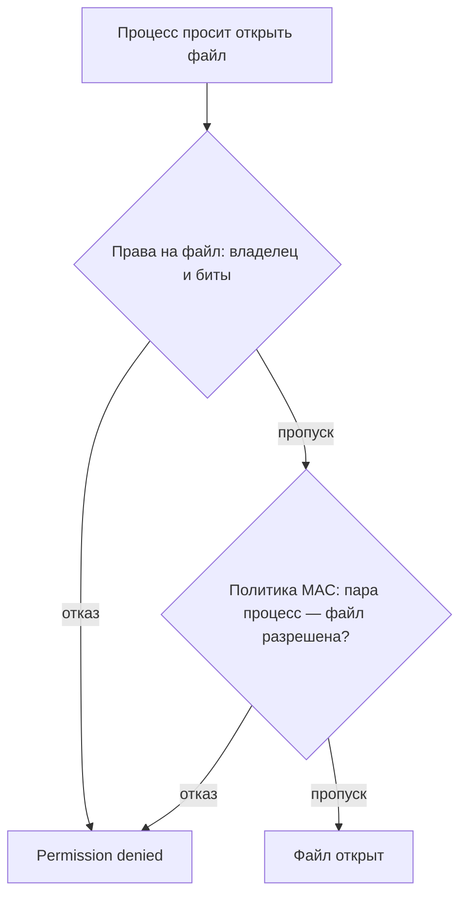

# SELinux и AppArmor: мандатный контроль доступа

Служба после обновления не открывает собственный конфиг. Права проверены
первым делом: владелец верный, режим `rw-r-----`, группа та самая. С точки
зрения прав всё в порядке, а служба не стартует. В журнале при этом лежит
строка об отказе от механизма, которого в выводе `ls -l` нет вовсе. Это
мандатный контроль доступа: поверх прав владельца работает вторая политика,
которую процесс не вправе менять сам. Разберём, кто пишет такую политику,
как она устроена у SELinux и AppArmor и где искать её отказы.

## Почему прав на файлы недостаточно

Модель из темы `linux-file-permissions` решает, кто владеет файлом и что
ему можно: владелец, группа и девять битов режима. Эта модель
дискреционная, от латинского discretio — «усмотрение»: распоряжаться
доступом волен сам владелец. Одна команда `chmod` — и файл читают все.
А root обходит такую проверку целиком: полномочие CAP_DAC_OVERRIDE из
темы `linux-capabilities` выключает её для него.

Чего эта модель не выражает — так это зачем процесс лезет в файл.
Веб-серверу не нужен `/etc/shadow` ни при каком владельце, а запретить это
правами нельзя: если uid процесса подходит под владельца или группу,
доступ открыт. Поэтому одна уязвимость в сервере превращает его в читалку
любого файла, до которого дотянется его учётная запись: права верные,
а читает их уже атакующий.

Ответ системы на эту дыру — мандатный контроль доступа, mandatory access
control, сокращённо MAC. Это второй слой правил поверх прав владельца,
и задаёт его администратор машины. Процесс не может ни расширить себе
доступ, ни унаследовать лишний у запустившего: правила живут в ядре,
и до них из процесса не дотянуться.

Бытовое соответствие — общежитие с комендантом и охраной. Ключи от своей
комнаты жилец раздаёт сам, а вот список «кому куда в общежитии можно»
пишет комендант, и жилец его не правит. Полное соответствие аналогии:

| В общежитии | В Linux |
|---|---|
| Жилец сам решает, кому дать ключ от комнаты | Владелец файла назначает права доступа |
| Список «курьерам на жилые этажи нельзя» пишет комендант | Политику MAC пишет администратор |
| Жилец список не правит | Процесс свои ограничения не меняет |
| Список действует и на старосту этажа | Политика действует и на root |

Граница аналогии — исполнитель. Список в общежитии исполняет
охранник-человек: его можно уговорить, отвлечь или обойти через чёрный
ход. Политику в Linux исполняет ядро, и обхода у неё нет: если обращение
не разрешено, отказ одинаков для всех, хоть для root. Ещё одно
несовпадение — привязка правил: к чему именно они прикреплены, у двух
систем устроено по-разному, и об этом следующие разделы.

## Как это работает

**Откуда это взялось.** Во второй половине 1990-х серверы массово вышли
в открытую сеть. Владелец файла оказался слабым защитником: взломанная
служба работает от своей учётной записи, и все файлы этой записи
достаются атакующему вместе с ней. Ответом стали две системы.
Агентство национальной безопасности США в 2000 году опубликовало SELinux,
где правила доступа отделены от владельцев. Параллельно компания Immunix
сделала AppArmor — с той же идеей, но с профилями, привязанными к путям
программ.

Подключаются обе системы к ядру через один интерфейс — LSM, Linux Security
Modules. Это набор точек внутри ядра, где оно спрашивает разрешения:
открытие файла, запуск программы, смена прав. В каждой такой точке ядро
опрашивает подключённые модули и действует, только если никто не запретил.
В терминах аналогии LSM — проходная: место, где список предъявляют каждому
входящему. Общий интерфейс нужен, чтобы разные системы безопасности
подключались к ядру одинаково, а не переписывали его под себя.



**Описание схемы.** Схема читается сверху вниз. Процесс просит у ядра
файл, и ядро применяет два слоя подряд: сначала права из темы
`linux-file-permissions`, потом политику мандатного контроля. Отказ
любого слоя даёт тот самый Permission denied, и по сообщению программы
не видно, кто именно отказал.

В SELinux каждый процесс и каждый файл несут метку, которую называют
контекстом. Правила политики говорят не про файлы и не про пользователей,
а про типы из этих меток. Пример: «процессам типа веб-сервера разрешено
читать файлы типа конфигурации веб-сервера». Администратор пишет разрешения
парами «тип процесса — тип объекта»: процесс здесь — тот, кто обращается,
объект — то, к чему обращаются. Метки процессов показывает `ps -Z`, метки
файлов — `ls -Z`.

Из метки следует практический подвох. Копия файла — новый файл, и метку
ему назначает политика, обычно по типу каталога-приёмника: `cp` перенесёт
конфиг, а контекст у копии окажется чужим. Перемещение `mv` метку
сохраняет, потому что файл остаётся тем же самым, новое только имя.
Поэтому «вернуть конфиг на место» копированием и перемещением — два
разных исхода.

В AppArmor правила привязаны не к меткам, а к пути программы. Профиль —
текстовый файл в каталоге `/etc/apparmor.d`, где перечислено, что
конкретной программе можно: какие файлы читать, какие писать, какие
запускать. Всё, чего в профиле нет, программе запрещено. Профиль
надевается на программу при её запуске и действует дальше на каждое её
обращение.

```text
# Упрощённый профиль nginx: всё вне списка запрещено
/usr/sbin/nginx {
    /etc/nginx/** r,      # читать конфигурацию
    /var/log/nginx/** w,  # писать журналы
    /srv/www/** r,        # читать страницы сайта
}
```

Здесь `r` — чтение, `w` — запись, двойная звёздочка — все файлы в глубину
каталога. Перечислять `/etc/shadow` не нужно: он вне списка, а значит,
уже запрещён. Настоящий профиль nginx длиннее — программе нужны ещё
сеть и сокеты, — но устройство то же самое.

У обеих систем два рабочих состояния. Боевой режим у SELinux называется
`enforcing`, у AppArmor — `enforce`: отказ в нём реален, и служба из
начала темы упала именно в нём. Второй режим — наблюдение, `permissive`
у SELinux и `complain` у AppArmor: действие проходит, но записывается
в журнал. Наблюдение нужно для обкатки: политику сначала пишут, потом
смотрят в журнале, что бы она запретила, дописывают нужные разрешения
и только после этого включают боевой режим.

## Метка против пути

Различие привязки решает, что сломается при переименовании. SELinux
следует за меткой: файл переименовали, метка осталась, правила прежние.
AppArmor смотрит на пути из профиля: файл переехал — и правило про старый
путь к нему больше не относится. Работает это и в обратную сторону.
Профиль привязан к пути программы, а не к её содержимому, поэтому
бинарник, подменённый по тому же пути, получит все разрешения
предшественника.

При ревизии профиля об этом стоит помнить: список путей — это список мест
на диске, а не список объектов с их сутью. Проверка «куда именно ходит
программа» не отвечает на вопрос «что именно она ходит читать».

## Как найти отказ и проверить режим

Отказ мандатного слоя не виден в выводе программы: там лишь
`Permission denied`, неотличимый от неправильных прав. Запись о нём ядро
кладёт в журнал аудита — подсистему, где собираются решения о доступе;
на сервере её читают через journal или службу аудита. SELinux пишет
запись вида AVC, access vector cache, с метками обоих участников,
AppArmor — событие с именем профиля и путём. По такой записи «неправильные
права» отличаются от «запретила политика»: названы и процесс, и объект.
Разбор этих журналов — тема `linux-logs-audit-systemd`.

Текущее состояние слоя показывают две команды. Для SELinux это
`getenforce`: она отвечает одним словом, `Enforcing`, `Permissive` или
`Disabled`. Для AppArmor это `aa-status`: она перечисляет загруженные
профили и раскладывает их по режимам `enforce` и `complain`. Обе команды
существуют только там, где их система установлена: на машине без SELinux
первой нет, без AppArmor нет второй.

Есть и способ спросить ядро напрямую, без установленных утилит: какие
модули безопасности активны. Ответ лежит в специальном файле, и вот его
содержимое на машине, с которой пишется этот текст:

```bash
cat /sys/kernel/security/lsm
```

```text
capability,landlock,lockdown,yama,bpf
```

Активных модулей пять, и ни SELinux, ни AppArmor среди них нет: искать
мандатные отказы на такой машине бессмысленно, слоя нет вовсе. Имя
capability в списке — тот самый механизм из темы `linux-capabilities`.
Диагностика необъяснимого `Permission denied` потому и начинается здесь:
сначала убедиться, что мандатный слой есть, потом смотреть его режим
и журнал.

Сценарий из начала темы теперь читается целиком: права были верны,
а запрет лежал в журнале аудита. И вопрос вдогонку получает ответ: та же
служба, запущенная от root, открывает чужой конфиг — помогут ли права
root? В боевом режиме нет. Проверка политики не смотрит на uid,
а CAP_DAC_OVERRIDE обходит только первый слой, права на файл. Пропустит
такое обращение только режим наблюдения — и то с записью в журнале.

**Зачем это в работе AppSec-инженера.** Необъяснимый `Permission denied`
при верных правах — стандартный симптом мандатного слоя, и ревьюеру
достаточно его узнать. Дальше три шага: убедиться, что слой есть, узнать
его режим и прочитать запись об отказе в журнале аудита. Соседние ступени
этой лестницы — темы `linux-capabilities`, где полномочия root делятся
на части, и `linux-logs-audit-systemd`, где такие записи читают.

## Источники

1. The SELinux Notebook, SELinux Project; реестр `selinux-notebook`.
   Разделы: MAC (мандатный контроль и контексты), Global Configuration
   Files (режимы enforcing, permissive, disabled).
   <https://github.com/SELinuxProject/selinux-notebook>
2. AppArmor, Ubuntu Server documentation, Canonical; реестр
   `apparmor-ubuntu`. Разделы: профили в /etc/apparmor.d, режимы enforce
   и complain, aa-status, apparmor_parser.
   <https://ubuntu.com/server/docs/how-to/security/apparmor/>

Каркас этапа: записи семейства man-* (Linux man-pages project, выпуск
6.18) — наследуются всеми темами подраздела 4.1.

**Маркеры уверенности.** Различие метка/путь, состав профилей, поведение
`cp` и `mv` и режимы обеих систем — **по документации**: SELinux Notebook
(разделы mac.md и global_config_files.md) и страница AppArmor в
документации Ubuntu Server, обе открыты лично 2026-09-01. Содержимое
`/sys/kernel/security/lsm` и отсутствие команд `getenforce` и `aa-status`
на стенде — **проверено лично** 2026-10-03. Лично **не воспроизводилось**:
на стенде ни SELinux, ни AppArmor нет, отказы в журнале аудита руками не
получены, и тема обзорная по замороженному оглавлению. Пример профиля —
упрощённый, по синтаксису из документации Ubuntu.
