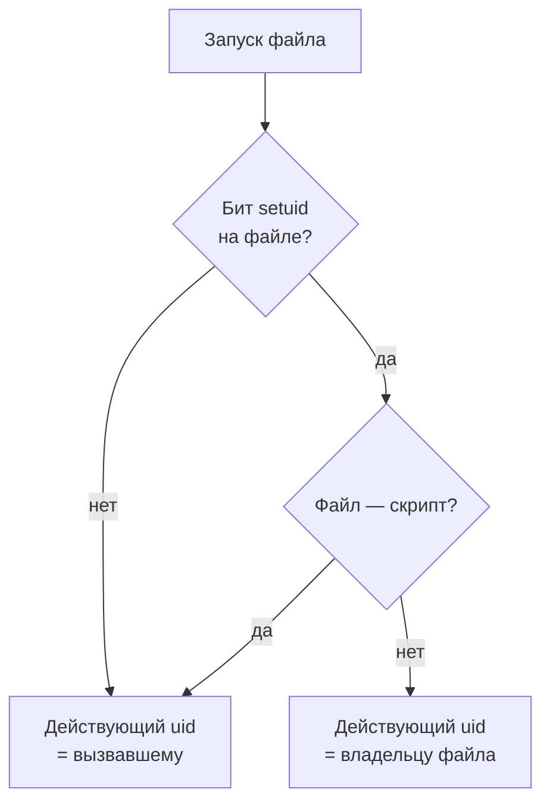

# setuid, setgid и sticky bit: повышение прав при запуске

Уровень **L1** · время 60 мин (теория 30 / лаба 20 / самопроверка 10,
оценка)

Что прочитать сначала: `linux-file-permissions`.

На любой машине с Linux стоит программа для смены пароля. Файл с
хешами паролей, `/etc/shadow`, открыт только root, а пароль свой менять
пользователю положено. Смотрим на саму программу:

```text
$ ls -l /usr/bin/passwd
-rwsr-xr-x 1 root root 80792 Jul 30 13:04 /usr/bin/passwd
```

Буква `s` на месте x у владельца — это бит setuid. Он меняет правило
запуска из темы про права на файлы: программа стартует не с правами
того, кто её вызвал, а с правами владельца файла. Здесь владелец —
root, поэтому `passwd`, запущенный обычным пользователем, пишет в
`/etc/shadow`. Без этого бита модель из девяти битов задачу не решает:
файл пришлось бы открыть всем.

Свои программы с `chmod +x` вы уже запускали — каждый раз они
получали ровно ваши права. Бит setuid — законный способ дать одной
программе больше, чем имеет вызывающий, и поэтому же — канал повышения
прав при ошибке в ней.

У этого способа есть цена, и она видна из схемы запуска. Программа,
которая работает с правами root, наследует от обычного пользователя
всё, что ядро ему передало: аргументы, переменные окружения, рабочий
каталог, открытые дескрипторы. Каждый пункт этого списка — вход
атакующего в привилегированный процесс, и тема проходит по ним по
очереди.

Дальше разберём три идентификатора пользователя у процесса, почему тот
же бит на скрипте ядро молча игнорирует и что означают setgid и sticky
bit на каталоге. Затем — как выглядит уязвимая setuid-обёртка в коде, и
лаба, где обёртку чинят руками.

## 0. Коротко

То же в терминах, которыми это обсуждают. Бит setuid на исполняемом
файле подменяет при запуске действующий uid процесса на uid владельца
файла; setgid делает то же с группой. У процесса при этом три
идентификатора: реальный — кто вызвал, действующий — с чьими правами
идут проверки, сохранённый — куда можно вернуться. На скрипте бит
игнорируется, на каталоге setgid означает наследование группы, а sticky
bit на общем каталоге запрещает удалять чужие файлы. Опасность
сосредоточена в setuid-программе: она работает с чужими правами и при
этом наследует окружение вызывающего, поэтому обязана собирать его
заново по белому списку.

**Зачем это в работе AppSec-инженера.** Setuid-обёртки встречаются в
продуктах, в deb-пакетах вендоров и в самодельных админских скриптах.
Ревью такой обёртки — это вопрос «что она унаследовала от вызывающего»:
переменные окружения, пути поиска, лимиты, унаследованные дескрипторы.
Инвентаризация битов на хосте — один вызов find, и его результат —
первое, что смотрят при оценке машины.

## 1. Цели

После этого раздела вы сможете:

1. Объяснить, что меняет бит setuid при запуске и почему на скрипте он
   молчит.
2. Различить реальный, действующий и сохранённый uid процесса.
3. Найти в setuid-программе доверие к окружению вызывающего.
4. Назначить setgid и sticky bit там, где они решают задачу, и
   проверить результат выводом stat.

## 2. Предвопросы

Ответьте до чтения, даже если не уверены.

1. Пользователь ставит бит setuid на свой скрипт. Получит ли запустивший
   его коллега права этого пользователя?
2. Setuid-программа от root вызывает другую программу по короткому
   имени. Кто выбирает, какой именно файл будет исполнен?
3. В `/tmp` каждый пользователь может создавать файлы. Почему там нельзя
   удалить чужой?

## 3. Механика

**Откуда это взялось.** Модель из девяти битов делит машину на «своих»
по владельцу и группе. Но в ней нет ответа на бытовую задачу: смена
своего пароля, печать на общий принтер, почта в чужом ящике до
прочтения. Открыть системный файл всем — значит отдать его на
растерзание всем. Закрыть — значит запретить и законное действие.
Ответом стал бит на файле программы: право сменить пароль получает не
пользователь, а одна конкретная проверенная программа, и только на
время её работы. Тем же ходом позже закрыли две соседние задачи:
унаследовать группу каталога (setgid на каталоге) и запретить чужое
удаление в общем каталоге (sticky bit).

### Три идентификатора процесса

Без них setuid остаётся магией, поэтому credentials(7) различает три
uid у каждого процесса. Реальный — кто запустил процесс. Действующий
(effective) — с чьими правами ядро проверяет доступы; вся модель прав
из темы `linux-file-permissions` смотрит именно на него. Сохранённый —
копия действующего на момент запуска, нужна, чтобы программа могла
временно сбросить привилегии и вернуться к ним.

При обычном запуске все три равны uid вызвавшего. При запуске файла с
битом setuid ядро ставит действующий и сохранённый uid равными
владельцу файла, а реальный оставляет вызвавшему. Так `passwd` знает и
«кто пришёл», и «с чьими правами я работаю».

Зачем нужен третий номер, видно из приёма временного сброса.
Setuid-программа получает привилегии на старте, открывает нужный ей
системный файл, а затем сбрасывает действующий uid до реального, чтобы
дальше работать с правами вызывающего. Вернуться к привилегиям она
может, потому что сохранённый uid их запомнил. Ошибка порядка здесь
дорога: сброс, оставивший сохранённый uid равным нулю, обратим, и
программа тащит скрытый путь к полным правам всю свою жизнь.

### Почему на скрипте бит молчит

Скрипт исполняет не ядро, а интерпретатор, которому скрипт передают
аргументом. Бит стоял бы на скрипте, а запускается чужая программа без
этого бита, и правила гонки между проверкой и прочтением файла делают
такой перенос небезопасным. Поэтому ядро Linux бит setuid на скрипте
игнорирует. Проверяется это руками за минуту — опыт в блоке
«Эксплуатация».

### setgid и sticky bit

Setgid на программе подменяет действующую группу процесса на группу
файла — тот же механизм, что у setuid, для группы. На каталоге setgid
означает другое: новые файлы и подкаталоги наследуют группу каталога,
а не основную группу создателя. Так устроены общие каталоги проектов:
что бы ни создал участник, доступ у группы сохраняется. Видно это
сразу, одной командой stat:

```text
$ stat -c '%a %U:%G %n' grpdemo grpdemo/inside.txt
2775 tarchok:adbusers grpdemo
644 tarchok:adbusers grpdemo/inside.txt
```

Каталог с битом setgid (двойка впереди) принадлежит группе adbusers, и
созданный в нём файл унаследовал её, хотя у создателя другая основная
группа.

Sticky bit на каталоге запрещает удалять и переименовывать чужие записи
в нём: запись снимает только её владелец, владелец каталога или root.
Без него общий каталог с правами на запись превращался бы в место, где
каждый может стереть чужое; с ним `/tmp` безопасно общий.

Ставятся биты тем же chmod: символьно — `chmod u+s`, `chmod g+s`,
`chmod +t`, числом — четвёртым разрядом слева: 4755, 2775, 1777. В
выводе `ls -l` их видно на месте x: `s` вместо `x` у владельца или
группы, `t` у остальных. Строчная буква означает, что исполнение под
битом стоит; прописные `S` и `T` показывают бит без исполнения — чаще
всего признак ошибки при назначении.



**Описание схемы.** При запуске файла ядро смотрит на бит setuid. Бита
нет или файл — скрипт: процесс получает действующий uid вызвавшего.
Бит есть и файл — обычная программа: действующий uid становится равным
владельцу файла, реальный остаётся вызвавшим, сохранённый запоминает
действующий.

## 4. Эксплуатация

Стенд — любая машина с Linux и компилятором; выводы сняты на Arch
Linux, ядро 6.18, gcc 16.2.1. Каждый опыт безопасен и ничего не меняет
за пределами рабочего каталога.

Шаг 1. Три идентификатора глазами. Программа печатает их через
getresuid:

```text
$ ./whoami_bits
ruid=1000 euid=1000 suid=1000
$ chmod u+s whoami_bits; ls -l whoami_bits
-rwsr-xr-x 1 tarchok tarchok 16088 Sep  1 09:01 whoami_bits
$ ./whoami_bits
ruid=1000 euid=1000 suid=1000
```

Бит стоит, буква `s` на месте, а числа не изменились. Так и должно быть:
владелец файла и вызывающий здесь один и тот же пользователь, повышать
нечего. Эффект появляется, когда владелец — root: тогда действующий и
сохранённый uid стали бы нулём (credentials(7)). Руками это на стенде
без root не проверить, и тема это различие помечает честно.

Опыт учит и другому: сам по себе бит ещё ничего не поднимает. Он
переносит права владельца файла, и если владелец — вы сами, переносить
нечего. Поэтому в инвентаризации интересны только биты на чужих файлах,
прежде всего на файлах root.

Шаг 2. Тот же бит на скрипте:

```text
$ cat s.sh
#!/bin/sh
echo "ruid=$(id -ru) euid=$(id -u)"
$ chmod 4755 s.sh; ls -l s.sh
-rwsr-xr-x 1 tarchok tarchok 46 Sep  1 09:01 s.sh
$ ./s.sh
ruid=1000 euid=1000
```

Бит в листинге есть, эффекта нет: ядро его игнорирует. Парность темы в
чистом виде: один бит на бинарнике и на скрипте — разный ответ.

Шаг 3. Sticky bit на общем каталоге:

```text
$ stat -c '%a %A %U' /tmp
1777 drwxrwxrwt root
```

Единица впереди — sticky bit, буква `t` на месте x у остальных. Писать в
`/tmp` могут все, удалять чужое — никто, кроме владельца записи.

Шаг 4. Лаба темы — модель setuid-обёртки, запускающей сборщик копий.
Эксплойт подменяет сборщик через PATH вызывающего:

```text
$ python3 hack.py
Цель: code.py
  опыт 1 — обёртка запустила /tmp/attacker/collect-backup с euid=0
           это программа атакующего: ДА
           она записала /etc/attacker-was-here: 'euid=0'
  опыт 2 — LD_PRELOAD доехал до программы: ДА (справочно)
  опыт 3 — контроль, честный запуск: работает
ЭКСПЛОЙТ СРАБОТАЛ: обёртка исполнила программу атакующего с правами root.
```

Признак срабатывания: программа, которую выбрал вызывающий, исполнилась
с действующим uid 0 и записала файл от root. Второй опыт показывает, что
окружение уехало в программу как есть: через PATH подменили программу,
а переменные вроде LD_PRELOAD заставили бы настоящую программу
загрузить чужой код.

Обратите внимание на то, чего атакующий не делал. Он не менял саму
обёртку, не открывал `/etc` на запись и не знал ни одного пароля. Всё,
что ему потребовалось, — свой каталог, своя программа и своя переменная
PATH, то есть ровно то, что у пользователя есть всегда. Вся цена атаки
лежит в одном решении обёртки: довериться унаследованному окружению.

## 5. Как выглядит в коде

Ревьюер setuid-программы ищет доверие к тому, что пришло от
вызывающего. Бит — атрибут файла, поэтому в коде дефект виден не по
биту, а по использованию наследуемого.

**Первое: поиск программы по чужому PATH.** Из лабы:

```python
# ФРАГМЕНТ — срез тела run_backup, самостоятельно не компилируется
# УЯЗВИМО — демонстрация, не для продакшена
for directory in proc.env.get("PATH", "").split(":"):     # (1)
    candidate = directory + "/collect-backup"
    if candidate in host.programs:
        return host.exec(proc, candidate, ["collect-backup"])
```

1. PATH пришёл в окружении вызывающего целиком. Его первый каталог —
   каталог атакующего, и обёртка исполняет то, что лежит там. Это
   CWE-426 (каталог Common Weakness Enumeration): путь поиска не
   заслуживает доверия.

**Второе: то же на C.** Классическая обёртка из админских скриптов:

```c
// УЯЗВИМО — демонстрация, не для продакшена
int main(void) {
    setuid(0);                          // (1)
    execlp("collect-backup",            // (2)
           "collect-backup", NULL);
    return 1;
}
```

1. Сброс и подъём через setuid(0) вперемешку: действующий uid уже 0.
2. `execlp` ищет программу по PATH — по тому самому, что задал
   вызывающий. Инвариант тот же, что в Python: привилегированный
   процесс исполняет имя, чьё разрешение в файл контролирует
   вызывающий.

**Третье: что не спасает.** Укоротить программу недостаточно: короткая
обёртка с execlp уязвима целиком. Проверить `getuid() != 0` в начале не
мешает атаке: реальный uid у атакующего честный, обёртка его и получит.
Сброс привилегий одним setuid(getuid()) оставляет сохранённый uid
равным нулю, и права возвращаются вызовом — порядок сброса разбирается
в credentials(7), и ошибка там стоит отдельного дефекта.

**Четвёртое: что чистит загрузчик сам.** Динамический загрузчик не
доверяет переменным вроде LD_PRELOAD и LD_LIBRARY_PATH, когда реальный
и действующий uid различаются. Ядро помечает такой запуск флагом
`AT_SECURE`, и загрузчик переходит в режим secure-execution (ld.so(8)).
На это нельзя полагаться как на защиту обёртки: список короткий, PATH
и всё прочее окружение в него не входят. А статически собранная
программа загрузчиком не пользуется вовсе. Опыт 2 лабы показывает это
в модели: переменная доехала до программы, потому что никто её не
отобрал.

> **Примечание: ложное срабатывание.** Программа, читающая PATH или
> запускающая хелпера, без бита setuid на файле — не находка этой темы.
> Она работает с правами вызывающего, и подмена ничего ему не даёт.
> Сначала смотрите на бит (`find` из блока «Как ловится автоматикой»),
> потом на код. Обратное тоже верно: программа с избыточными правами
> без необходимости — это CWE-250, и setuid root там, где хватило бы
> одной возможности, — его типичный случай.

## 6. Как чинится

Правило одно: привилегированная программа собирает окружение заново и
не доверяет ничему из унаследованного. Конкретно по опытам лабы:

```python
# Исправлено
SAFE_PATH = "/usr/sbin:/usr/bin"
KEEP_ENV = ("LANG",)                                    # (1)

proc = Process(ruid=caller_uid, euid=ROOT_UID, suid=ROOT_UID,
               env={"PATH": SAFE_PATH,                  # (2)
                    **{k: env[k] for k in KEEP_ENV if k in env}})
```

1. Белый список переменных: доезжает только то, что перечислено.
2. Поиск программы идёт по константе системных каталогов; PATH
   вызывающего игнорируется. Так же поступает sudo со своим env_reset.

Дальше по лестнице удешевления: вызывать хелпера по абсолютному пути,
держать привилегированную часть минимальной, сбрасывать действующий uid
сразу после получения нужного ресурса. Другой ответ на всю
конструкцию — отказаться от setuid root в пользу одной capability
на файле; это разбирает тема `linux-capabilities`.

Есть и архитектурная замена обёртке. Вместо того чтобы давать программе
бит, привилегированную операцию выносят в постоянно работающий сервис
под root. Обёртка-клиент просит его через сокет и никаких особых битов
не несёт. Так устроен sudo с его проверкой политики: право решает не бит
на файле, а правило в `/etc/sudoers`. Цена — демон, который надо
держать, и протокол запросов, который надо проверять.

**Границы применимости.** Белый список окружения закрывает PATH и
LD_PRELOAD, но не чинит логику самой программы: уязвимый сборщик
останется уязвимым и под честным вызовом. От setuid нельзя отказаться,
если программе нужны именно чужие права на файлы. Там, где достаточно
одного узкого полномочия, capability снимает вопрос; там, где нет,
остаётся аккуратная обёртка с этой дисциплиной.

## 7. Как проверить фикс

**Ретест.** Прогоните эксплойт против исправленной обёртки:

```text
$ LAB_TARGET=solution.py python3 hack.py
Цель: solution.py
  опыт 1 — обёртка запустила /usr/bin/collect-backup с euid=0
           это программа атакующего: нет
  опыт 2 — LD_PRELOAD доехал до программы: нет (справочно)
  опыт 3 — контроль, честный запуск: работает
ЭКСПЛОЙТ НЕ СРАБОТАЛ: обёртка нашла настоящий сборщик,
окружение вызывающего проигнорировано.
```

Подменённый каталог больше не участвует в поиске: запустился настоящий
сборщик из системного каталога.

**Регресс.** Восемь проверок в tests.py: честный запуск собирает копию,
журнал фиксирует системный путь и euid 0, запуск от другого
пользователя работает, LANG доезжает. Они зелёные до и после правки.
В репозитории проекта регрессом служит тест, который вызывает обёртку с
подменённым PATH и ждёт настоящий путь сборщика в журнале. Он упадёт
при любом откате на чтение окружения.

**Негативные кейсы.** Белый список не должен срезать нужное: локаль,
без которой сборщик пишет журнал абракадаброй. Не должен сломаться и
запуск из каталога с нестандартным PATH у вызывающего — после починки
он вообще не влияет на поиск. Отдельно проверяется вызов с пустым
окружением: обёртка обязана отработать и так, потому что после починки
ей из окружения не нужно ничего. Тест на это и есть проверка того, что
починка не «запретить всё».

## 8. Как ловится автоматикой

Честный ответ: статикой — плохо. Бит setuid живёт на файле, а не в
коде, и анализатор исходников его не видит. Видна только половина
дефекта: доверие к окружению. Правило, ловящее передачу `os.environ`
в вызов программы, даст гору шума на обычных программах, где это
законно.

Рабочая автоматика здесь — инвентаризация битов на файловой системе:

```text
$ find /usr/bin /usr/sbin /usr/local/bin -type f -perm /6000
/usr/bin/fusermount3
/usr/bin/newgrp
/usr/bin/sudo
/usr/bin/chsh
/usr/bin/ksu
/usr/bin/chage
/usr/bin/fusermount
/usr/bin/su
/usr/bin/gpasswd
/usr/bin/write
```

Маска `/6000` ловит оба бита сразу — setuid и setgid. Каждый файл из
такого списка — точка повышения прав: его автор, его версия и его
обоснованность проверяются вручную. Список с нестандартной записью —
находка до всякого анализа кода.

Чтобы список что-то значил, его сравнивают с базовой линией. Порядок
такой: снять вывод find на свежей системе сразу после установки,
сохранить как эталон и дальше смотреть разницу. Новая запись после
установки пакета — ожидаема и проверяется отдельно; новая запись без
установки — внеплановое повышение прав на машине. Без эталона тот же
вывод превращается в список, который пролистывают глазами.

**Что такая проверка пропустит.** Файлы без бита, которые получают
привилегии иначе: через sudo-правило, через файловые capabilities, —
их этот find не видит, их словарь разбирает тема `linux-capabilities`.
И обратно: почти каждая запись в выводе законна, поэтому список без
базовой линии системы шумит.

## 9. Ловушка

Распространённое мнение: setuid от служебного пользователя безопасен —
это же не root.

**Прав любого чужого uid достаточно, чтобы закончить атаку на его
ресурсы.** Механизм тот же: действующий uid процесса становится uid
владельца файла, и программа атакующего исполняется с доступом ко всем
файлам и процессам этого владельца.

Контрпример. Обёртка резервного копирования с setuid от служебной
учётной записи `backup`. Подмена хелпера через PATH даёт атакующему
чтение всех копий и правку заданий этой учётной записи. Секреты из
копий дальше открывают остальное — root атаке не потребовался. Из той
же ловушки растёт вторая ошибка: считать, что раз программа не
интерактивна, атаковать её нечем. У атакующего есть аргументы,
окружение, рабочий каталог и файлы, которые программа откроет, — ввода
с клавиатуры не нужно.

## 10. Чеклист ревью

1. Verify that у каждого файла с битом setuid или setgid есть
   обоснование, и список таких файлов сверяется с базовой линией.
2. Verify that setuid-программа не ищет исполняемые файлы по PATH из
   окружения вызывающего (CWE-426).
3. Verify that окружение пересобирается по белому списку: PATH
   константный, LD_PRELOAD и подобные не доезжают.
4. Verify that привилегии сбрасываются сразу после получения ресурса и
   в порядке, который не оставляет пути назад (CWE-250).
5. Verify that на исполняемом файле стоит бит только у обычного файла,
   а не у скрипта: на скрипте он молчит и вводит в заблуждение.
6. Verify that на общих каталогах стоит sticky bit, а на каталогах
   групп — setgid, и проверено это выводом stat.

## 11. Лаба

**Цель одной фразой:** добиться, чтобы
`pilot/lab/linux-setuid/hack.py` вышел с кодом 0, а `tests.py`
продолжил выходить с кодом 0.

Лаба повторяет атаку из блока «Эксплуатация» руками: обёртка ищет
сборщик по чужому PATH, и программа атакующего получает его права.

Формат — Secure Code Game: чинится `code.py`, эксплойт и функциональные
тесты лежат рядом. Обёртка, хост и привилегии изображены моделью на
структурах данных: настоящие права root не нужны, сеть не нужна. Нужен
Python 3.6 или новее. Секции «Запуск», «Сброс» и «Удаление» — в
`README.md` каталога.

Подсказка даётся одна: обёртка наследует окружение вызывающего, и всё,
что она из него берёт, выбирает он. Замените окружение своим:
фиксированный список каталогов для поиска программы и белый список из
тех переменных, которые действительно нужны, — так поступает sudo.

**Отдельная задача «почини».** Честный запуск обязан работать после
правки: сборщик находится в системном каталоге, копия собирается, локаль
доезжает. Починка «запретить всё» приёмку не проходит: контрольный опыт
в hack.py проверяет именно её. Наблюдаемый критерий: `tests.py`
печатает «Упало проверок: 0», а `hack.py` — «ЭКСПЛОЙТ НЕ СРАБОТАЛ».

Решение — `solution.py` в том же каталоге, открыто без условий. Сначала
попробуйте сами: починка умещается в три строки.

## 12. Проверь себя

1. Назовите три идентификатора пользователя у процесса и что каждый из
   них означает.
2. Почему бит setuid на скрипте не даёт эффекта и как это проверить
   руками?
3. Чем sticky bit на каталоге отличается от запрета записи в него?
4. Setuid-обёртка вызывает хелпера по абсолютному пути, но передаёт ему
   окружение вызывающего целиком. Закрыта ли атака?
5. Возврат к теме `linux-file-permissions`: почему недостаточно
   закрыть `/etc/shadow` правами 0600 и нужен ещё и setuid у passwd?
6. Возврат к теме `linux-file-permissions`: программа с setuid создала
   файл режимом 0666 при umask 0022. Кто теперь может его читать и от
   чьего имени он создан?

<details markdown="1">
<summary>Ответы</summary>

1. Реальный — кто запустил; действующий — с чьими правами ядро
   проверяет доступы; сохранённый — копия действующего на момент
   запуска, нужна для временного сброса и возврата привилегий.
2. Скрипт исполняет интерпретатор, а бит стоял бы на файле скрипта;
   переносить его на интерпретатор небезопасно, и ядро бит игнорирует.
   Проверка: поставить бит скрипту, печатающему `id -ru` и `id -u`, и
   сравнить — они останутся равны.
3. Запрет записи не пускает никого создавать и удалять; sticky bit
   оставляет создание всем, а удаление — только владельцу записи,
   владельцу каталога и root.
4. Нет: переменные вроде LD_PRELOAD доезжают до хелпера и подменяют
   его код изнутри. Абсолютный путь закрывает выбор файла, но не
   окружение.
5. Правилами файл закрыт для всех, включая законное действие «сменить
   свой пароль». Бит переносит право с пользователя на одну проверенную
   программу и только на время её работы.
6. Файл создан от действующего uid программы — от владельца обёртки, а
   не вызывающего. Маска 0022 срежет запись, но читать файл смогут
   группа и остальные: бит setuid права новых файлов не сужает.

</details>

## 13. Источники

1. inode(7) «file inode information», Linux man-pages 6.18; реестр
   `man-inode`. Разделы: The file type and mode — S_ISUID, S_ISGID,
   S_ISVTX и их особый смысл на каталогах.
   <https://man7.org/linux/man-pages/man7/inode.7.html>
2. credentials(7) «process identifiers», Linux man-pages 6.18; реестр
   `man-credentials`. Разделы: User and group identifiers — реальный,
   действующий, сохранённый uid; Effect of execve — подмена при запуске.
   <https://man7.org/linux/man-pages/man7/credentials.7.html>
3. ld.so(8) «dynamic linker/loader», Linux man-pages 6.18; реестр
   `man-ld-so`. Разделы: режим secure-execution, флаг AT_SECURE,
   переменные, которые загрузчик игнорирует.
   <https://man7.org/linux/man-pages/man8/ld.so.8.html>

Каркас этапа: записи семейства man-* (Linux man-pages project, выпуск
6.18) — наследуются всеми темами подраздела 4.1.

**Скоропортящийся слой.** Список файлов с особыми битами — свойство
конкретной системы и её пакетов; вывод find в теме снят на стенде и на
другой машине будет другим. Семантика битов и трёх идентификаторов
стабильна.

**Маркеры уверенности.** **Проверено лично** 2026-09-01 на Arch Linux,
ядро 6.18.48-1-lts, gcc 16.2.1, Python 3.14.7: три идентификатора по
getresuid без бита и с битом (без изменений при владельце-вызывающем),
игнорирование setuid на скрипте, sticky bit и 1777 на /tmp,
наследование группы в setgid-каталоге (файл получил группу каталога),
инвентаризация find по системным каталогам. Лаба прогнана на обеих
целях: `hack.py` даёт код 1 на code.py и 0 на solution.py, `tests.py`
зелёный в обоих случаях. Подмена действующего uid при владельце root и
порядок сброса привилегий — **по документации** (credentials(7),
открыт лично 2026-09-01): на стенде без root воспроизвести нельзя,
и тема это не скрывает. Режим secure-execution у загрузчика — **по
документации** (ld.so(8), открыт лично 2026-09-01); в лабе поведение
изображено моделью, настоящий бинарник не собирался. Поведение sudo
env_reset — **по документации** его описания, самостоятельно не
прогонялось.
