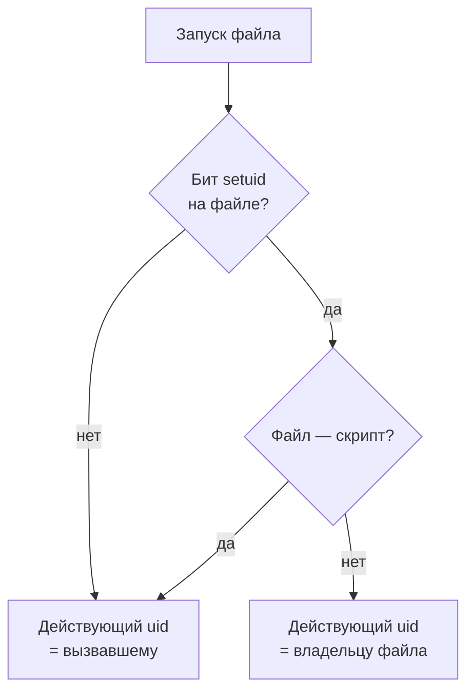

# setuid, setgid и sticky bit: повышение прав при запуске

На любой машине с Linux есть программа `passwd`, которая меняет пароль
пользователя. Хеши паролей лежат в системном файле `/etc/shadow`, и
читать его может только root — административная учётная запись с
неограниченными правами. При этом менять собственный пароль положено
каждому, а значит, программа обычного пользователя как-то пишет в файл,
открытый только root. Как это возможно, видно из первой колонки
листинга:

```text
$ ls -l /usr/bin/passwd
-rwsr-xr-x 1 root root 80792 Jul 30 13:04 /usr/bin/passwd
```

Буква `s` на месте `x` у владельца — это бит setuid: программа с ним
стартует не с правами вызвавшего, а с правами владельца файла, здесь —
root. Без этого бита модель из девяти битов темы `linux-file-permissions`
задачу не решает: файл пришлось бы открыть на запись всем. У решения
есть цена: программа с чужими правами наследует от вызвавшего всё, что
тот получил при запуске, — аргументы, переменные окружения, рабочий
каталог, открытые файлы. Каждый пункт этого списка — возможный вход
атакующего.

## Подумай, прежде чем читать

1. Пользователь ставит бит setuid на свой скрипт. Получит ли коллега,
   запустивший этот скрипт, права этого пользователя?
2. Setuid-программа от root вызывает другую программу по короткому
   имени, без полного пути. Кто решает, какой именно файл будет исполнен?
3. В каталог `/tmp` каждый пользователь может создавать файлы. Почему
   никто не может удалить оттуда чужой файл?

## Как это работает

**Откуда это взялось.** Модель из девяти битов темы
`linux-file-permissions` делит пользователей машины на владельца, группу
и остальных. В ней нет ответа на бытовые задачи: сменить свой пароль,
напечатать на общем принтере, положить письмо в чужой ящик до прочтения.
Открыть системный файл всем — значит отдать его на растерзание всем, а
закрыть — значит запретить и законное действие. Ответом стал бит на
файле программы: право сменить пароль получает не пользователь, а одна
конкретная проверенная программа, и только на время её работы. Тем же
ходом позже закрыли две соседние задачи: наследование группы каталога и
запрет удалять чужое в общем каталоге.

Чтобы понять механику бита, нужны два системных понятия. Процесс — это
программа в момент выполнения: один и тот же файл может жить в
нескольких процессах сразу, и каждый ведётся отдельно. Ведёт их ядро —
та часть системы, которая запускает программы и проверяет каждый доступ
к файлам. Учётную запись ядро знает по числу, идентификатору
пользователя — uid; имя существует для людей, а проверки идут по числу.
Свой номер показывает команда `id -u`.

### Три номера у каждого процесса

У каждого процесса ядро хранит не один uid, а три, и без них setuid
остаётся магией. Реальный uid — кто запустил процесс. Действующий
(effective) — с чьими правами ядро проверяет доступы: вся модель прав из
`linux-file-permissions` смотрит именно на него. Сохранённый uid —
копия действующего на момент запуска: она нужна, чтобы программа могла
временно сбросить привилегии и вернуться к ним.

Бытовое соответствие — допуск на стройку, где права меняются, а личность
нет:

| Номер у процесса | На стройке | Что решает |
|---|---|---|
| Реальный uid | ваш паспорт | кто вы на самом деле |
| Действующий uid | выданный вам пропуск | куда вас пустят с ним |
| Сохранённый uid | запись в журнале охраны | можно ли получить пропуск обратно |

Аналогия ломается на том, что пропуск — физический предмет, который
возвращают руками. Номер же — запись в структуре ядра, и «возврат» —
это присваивание, которое программа делает одним вызовом.

При обычном запуске все три номера равны uid вызвавшего. При запуске
файла с битом setuid ядро ставит действующий и сохранённый uid равными
владельцу файла, а реальный оставляет вызвавшему. Поэтому `passwd`
одновременно знает, кто пришёл, и работает с правами root.

Зачем нужен третий номер, видно из приёма временного сброса.
Setuid-программа получает привилегии на старте, открывает нужный ей
системный файл, а затем сбрасывает действующий uid до реального, чтобы
дальше работать с правами вызывающего. Вернуться к привилегиям она
может, потому что сохранённый uid их запомнил. Ошибка порядка здесь
дорога: сброс, оставивший сохранённый uid равным нулю, обратим, и
программа всю свою жизнь тащит скрытый путь к полным правам. Какие
вызовы делают сброс правильно, разобрано в разделе про код.

### Почему на скрипте бит молчит

Скрипт — это файл с текстом команд, который исполняет не ядро, а
интерпретатор. Первой строкой вроде `#!/bin/sh` скрипт называет свой
интерпретатор, ядро запускает его и передаёт ему файл скрипта
аргументом. Бит при этом стоял бы на скрипте, а запускается чужая
программа без этого бита. Есть и вторая причина: между проверкой бита и
чтением файла интерпретатором файл можно подменить, и перенос прав здесь
превращается в гонку. Поэтому ядро Linux бит setuid на скрипте
игнорирует. Проверяется это руками за минуту — опыт во втором шаге
раздела «Как это атакуют».

### setgid и sticky bit

Setgid — тот же механизм для группы. На программе он подменяет
действующую группу процесса на группу файла. На каталоге бит значит
другое, и чтобы оценить разницу, нужно правило по умолчанию. Без бита
новый файл получает основную группу создателя — группу его учётной
записи, которую показывает команда `id -gn`. В setgid-каталоге файлы и
подкаталоги наследуют группу каталога, а не основную группу создателя.
Так устроены общие каталоги проектов: что бы ни создал участник, доступ
у группы сохраняется. Видно это одной командой stat:

```text
$ stat -c '%a %U:%G %n' grpdemo grpdemo/inside.txt
2775 tarchok:adbusers grpdemo
644 tarchok:adbusers grpdemo/inside.txt
```

Каталог с битом setgid (двойка в первом разряде) принадлежит группе
adbusers, и созданный в нём файл унаследовал её, хотя у создателя другая
основная группа.

Sticky bit на каталоге запрещает удалять и переименовывать чужие записи
в нём: запись снимает только её владелец, владелец каталога или root.
Без него общий каталог с правами на запись был бы местом, где каждый
может стереть чужое. С ним `/tmp` безопасно общий — проверка в третьем
шаге раздела «Как это атакуют».

Ставятся биты тем же chmod: символьно — `chmod u+s`, `chmod g+s`,
`chmod +t`, числом — четвёртым разрядом слева: 4755, 2775, 1777. В
выводе `ls -l` их видно на месте `x`: `s` у владельца или группы, `t` у
остальных. Строчная буква означает, что исполнение под битом стоит.
Прописные `S` и `T` показывают бит без исполнения — чаще всего это
признак ошибки при назначении, поэтому встретили прописную — проверьте
назначение.


```mermaid
flowchart TD
    A[Запуск файла] --> B{Бит setuid<br/>на файле?}
    B -- нет --> C[Действующий uid<br/>= вызвавшему]
    B -- да --> D{Файл — скрипт?}
    D -- да --> C
    D -- нет --> E[Действующий uid<br/>= владельцу файла]
```

**Описание схемы.** При запуске файла ядро смотрит на бит setuid. Бита
нет или файл — скрипт: процесс получает действующий uid вызвавшего. Бит
есть и файл — обычная программа: действующий uid становится равным
владельцу файла, реальный остаётся вызвавшим, сохранённый запоминает
действующий.

## Как это атакуют

Атака на setuid-обёртку не трогает саму обёртку: она подсовывает ей
входы, которые та унаследовала от вызывающего. Чтобы понять механику,
посмотрим сначала, что процесс получает в наследство. При запуске ядро
передаёт новому процессу аргументы командной строки и окружение — пары
«имя=значение», через которые программам сообщают настройки. Одна из
них — PATH: список каталогов, по которым оболочка ищет программу по
короткому имени, и именно поэтому вы печатаете `ls` вместо `/bin/ls`.
Окружение целиком выбирает вызывающий.

Стенд — любая машина с Linux и компилятором; выводы ниже сняты на Arch
Linux, ядро 6.18, gcc 16.2.1. Каждый опыт безопасен и ничего не меняет
за пределами рабочего каталога.

Шаг 1. Три номера глазами. Программа печатает их через getresuid —
системный вызов, то есть обращение программы напрямую к ядру; этот
возвращает все три uid разом:

```text
$ ./whoami_bits
ruid=1000 euid=1000 suid=1000
$ chmod u+s whoami_bits; ls -l whoami_bits
-rwsr-xr-x 1 tarchok tarchok 16088 Sep  1 09:01 whoami_bits
$ ./whoami_bits
ruid=1000 euid=1000 suid=1000
```

Бит стоит, буква `s` на месте, а числа не изменились. Так и должно
быть: владелец файла и вызывающий здесь один и тот же пользователь, и
повышать нечего. Эффект появляется, когда владелец — root: тогда
действующий и сохранённый uid стали бы нулём (credentials(7)). Руками
на стенде без root это не проверить, и тема не скрывает этого различия.

Опыт учит и обратному: сам по себе бит ничего не поднимает. Он переносит
права владельца файла, и если владелец — вы сами, переносить нечего.
Поэтому при инвентаризации интересны биты на чужих файлах, прежде всего
на файлах root.

Шаг 2. Тот же бит на скрипте:

```text
$ cat s.sh
#!/bin/sh
echo "ruid=$(id -ru) euid=$(id -u)"
$ chmod 4755 s.sh; ls -l s.sh
-rwsr-xr-x 1 tarchok tarchok 46 Sep  1 09:01 s.sh
$ ./s.sh
ruid=1000 euid=1000
```

Бит в листинге есть, эффекта нет: ядро его игнорирует, потому что
исполняет файл интерпретатор. Парность темы в чистом виде: один и тот же
бит на бинарной программе и на скрипте даёт разный ответ.

Шаг 3. Sticky bit на общем каталоге:

```text
$ stat -c '%a %A %U' /tmp
1777 drwxrwxrwt root
```

Единица в первом разряде — sticky bit, буква `t` на месте `x` у
остальных. Писать в `/tmp` могут все, удалять чужое — никто, кроме
владельца записи.

Шаг 4. Теперь сама атака. Лаба темы — модель setuid-обёртки,
запускающей сборщик копий; настоящий root для неё не нужен, права
изображены структурами данных. Эксплойт подменяет сборщик через PATH
вызывающего:

```text
$ python3 hack.py
Цель: code.py
  опыт 1 — обёртка запустила /tmp/attacker/collect-backup с euid=0
           это программа атакующего: ДА
           она записала /etc/attacker-was-here: 'euid=0'
  опыт 2 — LD_PRELOAD доехал до программы: ДА (справочно)
  опыт 3 — контроль, честный запуск: работает
ЭКСПЛОЙТ СРАБОТАЛ: обёртка исполнила программу атакующего с правами root.
```

Признак срабатывания: программа, которую выбрал вызывающий, исполнилась
с действующим uid 0 и записала файл от root. Второй опыт показывает, что
окружение уехало в программу как есть: через PATH подменили программу, а
переменные вроде LD_PRELOAD заставили бы настоящую программу загрузить
чужой код.

Обратите внимание на то, чего атакующий не делал. Он не менял саму
обёртку, не открывал `/etc` на запись и не знал ни одного пароля. Всё,
что ему потребовалось, — свой каталог, своя программа и своя переменная
PATH, то есть ровно то, что есть у пользователя всегда. Вся цена атаки
лежит в одном решении обёртки: довериться унаследованному окружению.

Прогон сводится к одному правилу: всё, что процесс унаследовал, выбирает
вызывающий. Ответа в транскрипте нет: обёртку переписали на C и собрали
статически, вшив библиотеки в сам файл, — какие входы у атакующего
останутся?

## Как это выглядит в коде

Ревьюер setuid-программы ищет доверие к тому, что пришло от вызывающего.
Сам бит — атрибут файла, поэтому в коде дефект виден не по биту, а по
использованию наследуемого. Ниже три находки и один случай, который
находкой не считается.

**Первое: поиск программы по чужому PATH.** Из лабы — прежде чем читать
выноску, найдите строку, через которую вызывающий выбирает исполняемый
файл:

```python
# ФРАГМЕНТ — срез тела run_backup, самостоятельно не компилируется
# УЯЗВИМО — демонстрация, не для продакшена
for directory in proc.env.get("PATH", "").split(":"):     # (1)
    candidate = directory + "/collect-backup"
    if candidate in host.programs:
        return host.exec(proc, candidate, ["collect-backup"])
```

1. PATH пришёл в окружении вызывающего целиком. Его первый каталог —
   каталог атакующего, и обёртка исполняет то, что лежит там. В каталоге
   типовых слабостей CWE (Common Weakness Enumeration) этот дефект идёт
   под номером 426: путь поиска не заслуживает доверия.

**Второе: то же на C.** Здесь два дефекта, а не один — попробуйте
назвать оба. Классическая обёртка из админских скриптов:

```c
// УЯЗВИМО — демонстрация, не для продакшена
int main(void) {
    setuid(0);                          // (1)
    execlp("collect-backup",            // (2)
           "collect-backup", NULL);
    return 1;
}
```

1. У процесса с действующим uid 0 вызов setuid(0) переписывает все три
   номера в ноль. Стёрт реальный uid вызвавшего, и сбрасывать права
   больше некуда: программа остаётся полным root до конца жизни.
2. `execlp` — функция запуска программы, и буква `p` в её имени означает
   поиск по PATH: по тому самому списку каталогов, что задал вызывающий.
   Инвариант тот же, что в Python: привилегированный процесс исполняет
   имя, чьё разрешение в файл контролирует вызывающий.

**Третье: что не спасает.** Укоротить программу недостаточно: короткая
обёртка с execlp уязвима целиком. Отказ работать при `getuid() != 0`
остановит атаку, но вместе с ней и функцию. Обёртка существует, чтобы
обычный пользователь выполнил одно привилегированное действие; для root
она не нужна. Сброс привилегий одним seteuid(getuid()) обратим:
сохранённый uid остаётся нулём, и права возвращаются вызовом seteuid(0).
Полный сброс делает setuid(getuid()): у привилегированного процесса он
переписывает все три номера разом. Порядок разбирается в credentials(7),
и ошибка там стоит отдельного дефекта.

**Четвёртое: что чистит загрузчик сам.** Программы обычно собраны
динамически: код библиотек лежит в отдельных файлах и подключается при
запуске. Этим занимается динамический загрузчик, и у него есть
переменные-рычаги: LD_PRELOAD заставляет его подключить названную
библиотеку первой, то есть вшить чужой код в чужую программу.

Загрузчик не доверяет LD_PRELOAD и LD_LIBRARY_PATH, когда реальный и
действующий uid различаются: ядро помечает такой запуск флагом
`AT_SECURE`, и загрузчик переходит в режим secure-execution (ld.so(8)).
Полагаться на это как на защиту обёртки нельзя: список короткий, и PATH
в него не входит. А статически собранная программа, где библиотеки вшиты
в сам файл, загрузчиком не пользуется вовсе. Опыт 2 лабы показывает это
в модели: переменная доехала до программы, потому что никто её не
отобрал.

> **Примечание: ложное срабатывание.** Программа, читающая PATH или
> запускающая помощника, без бита setuid на файле — не находка этой
> темы. Она работает с правами вызывающего, и подмена ничего ему не
> даёт. Сначала смотрите на бит — find из раздела «Как это находят
> инструменты», потом на код. Обратное тоже верно: программа с
> избыточными правами без необходимости — это CWE-250, и setuid root
> там, где хватило бы одной узкой возможности, — его типичный случай.

## Как защититься

Правило одно: привилегированная программа собирает окружение заново и не
доверяет ничему из унаследованного. Конкретно по опытам лабы исправление
выглядит так:

```python
# Исправлено
SAFE_PATH = "/usr/sbin:/usr/bin"
KEEP_ENV = ("LANG",)                                    # (1)

proc = Process(ruid=caller_uid, euid=ROOT_UID, suid=ROOT_UID,
               env={"PATH": SAFE_PATH,                  # (2)
                    **{k: env[k] for k in KEEP_ENV if k in env}})
```

1. Белый список переменных: доезжает только то, что перечислено, — здесь
   локаль LANG.
2. Поиск программы идёт по константе системных каталогов; PATH
   вызывающего игнорируется. Так же поступает sudo со своим env_reset.

Почему решение именно такое. Убрать одну опасную переменную нельзя,
потому что завтра появится другая: наследство выбирает вызывающий, и
надёжен только список разрешённого, а не список запретов. Поэтому
окружение строится с нуля, а не вычищается.

Дальше по лестнице удешевления. Вызывайте помощника по абсолютному пути —
тогда поиск не нужен вовсе. Держите привилегированную часть минимальной:
чем меньше кода работает с чужими правами, тем меньше ревью. Сбрасывайте
действующий uid сразу после получения нужного ресурса, как в приёме из
раздела про механику. Отдельный ответ на всю конструкцию — отказаться от
setuid root в пользу одной capability на файле; это разбирает тема
`linux-capabilities`.

Есть и архитектурная замена обёртке. Привилегированную операцию выносят
в демон — постоянно работающую программу под root. Обёртка-клиент просит
его через сокет, точку связи между процессами на одной машине, и никаких
особых битов не несёт. Так устроен sudo с его проверкой политики: право
решает не бит на файле, а правило в `/etc/sudoers`. Цена — демон,
который надо держать, и протокол запросов, который надо проверять.

**Границы применимости.** Белый список окружения закрывает PATH и
LD_PRELOAD, но не чинит логику самой программы: уязвимый сборщик
останется уязвимым и под честным вызовом. От setuid нельзя отказаться,
если программе нужны именно чужие права на файлы. Там, где достаточно
одного узкого полномочия, capability снимает вопрос; там, где нет,
остаётся аккуратная обёртка с этой дисциплиной.

## Как убедиться, что защита работает

Проверка, которой нечего отвергнуть, ничего не доказывает. Поэтому
сначала ретест: прогоните тот же эксплойт против исправленной обёртки.

```text
$ LAB_TARGET=solution.py python3 hack.py
Цель: solution.py
  опыт 1 — обёртка запустила /usr/bin/collect-backup с euid=0
           это программа атакующего: нет
  опыт 2 — LD_PRELOAD доехал до программы: нет (справочно)
  опыт 3 — контроль, честный запуск: работает
ЭКСПЛОЙТ НЕ СРАБОТАЛ: обёртка нашла настоящий сборщик,
окружение вызывающего проигнорировано.
```

Подменённый каталог больше не участвует в поиске: запустился настоящий
сборщик из системного каталога, а окружение вызывающего проигнорировано.

Дальше регресс: починка не должна сломать честную работу. Восемь
проверок в tests.py: честный запуск собирает копию, журнал фиксирует
системный путь и euid 0, запуск от другого пользователя работает, LANG
доезжает. Они зелёные до и после правки. В репозитории проекта регрессом
служит тест, который вызывает обёртку с подменённым PATH. Тест ждёт
настоящий путь сборщика в журнале и упадёт при любом откате на чтение
окружения.

И негативные кейсы: белый список не должен срезать нужное. Без локали
сборщик пишет журнал абракадаброй, поэтому LANG стоит в белом списке. Не
должен сломаться и запуск из каталога с нестандартным PATH у вызывающего —
после починки он вообще не влияет на поиск. Отдельно проверяется вызов с
пустым окружением: обёртка обязана отработать и так, потому что после
починки ей из окружения не нужно ничего. Тест на это и есть проверка
того, что починка — не «запретить всё».

На ревью пройдите по списку.

1. Проверьте, что у каждого файла с битом setuid или setgid есть
   обоснование, и список таких файлов сверяется с базовой линией.
2. Проверьте, что setuid-программа не ищет исполняемые файлы по PATH из
   окружения вызывающего (CWE-426).
3. Проверьте, что окружение пересобирается по белому списку: PATH
   константный, LD_PRELOAD и подобные не доезжают.
4. Проверьте, что привилегии сбрасываются сразу после получения ресурса
   и в порядке, который не оставляет пути назад (CWE-250).
5. Проверьте, что бит стоит только на обычной программе, а не на
   скрипте: на скрипте он молчит и вводит в заблуждение.
6. Проверьте, что на общих каталогах стоит sticky bit, а на каталогах
   групп — setgid, и проверено это выводом stat.

## Как это находят инструменты

Честный ответ: статический анализ кода здесь работает плохо. Бит setuid
живёт на файле, а не в коде, и анализатор исходников его не видит. Видна
только половина дефекта — доверие к окружению, и правило, ловящее
передачу `os.environ` в вызов программы, даст гору шума на обычных
программах, где это законно.

Рабочая автоматика — инвентаризация битов на файловой системе:

```text
$ find /usr/bin /usr/sbin /usr/local/bin -type f -perm /6000
/usr/bin/fusermount3
/usr/bin/newgrp
/usr/bin/sudo
/usr/bin/chsh
/usr/bin/ksu
/usr/bin/chage
/usr/bin/fusermount
/usr/bin/su
/usr/bin/gpasswd
/usr/bin/write
```

Маска `/6000` ловит оба бита сразу: шестёрка в первом разряде — это 4
(setuid) плюс 2 (setgid). Каждый файл из такого списка — точка повышения
прав: его автор, его версия и его обоснованность проверяются вручную.
Список с нестандартной записью — находка до всякого анализа кода.

Чтобы список что-то значил, его сравнивают с базовой линией — эталонным
снимком системы. Порядок такой: снять вывод find на свежей системе сразу
после установки, сохранить как эталон и дальше смотреть разницу. Новая
запись после установки пакета ожидаема и проверяется отдельно. Новая
запись без установки — внеплановое повышение прав на машине. Без
эталона тот же вывод превращается в список, который пролистывают
глазами.

**Что такая проверка пропустит.** Файлы без бита, которые получают
привилегии иначе: через sudo-правило или через файловые capabilities, —
их этот find не видит, их словарь разбирает тема `linux-capabilities`. И
обратно: почти каждая запись в выводе законна, поэтому список без
базовой линии системы шумит.

**Зачем это в работе AppSec-инженера.** Setuid-обёртки встречаются в
продуктах, в deb-пакетах вендоров и в самодельных админских скриптах.
Ревью такой обёртки — это вопрос «что она унаследовала от вызывающего»:
переменные окружения, пути поиска, лимиты, унаследованные дескрипторы —
номера файлов, которые вызвавший открыл до запуска. Инвентаризация битов
на хосте — один вызов find, и его результат — первое, что смотрят при
оценке машины.

## Частая ошибка

Оцените сами: обёртка с setuid работает от служебной учётной записи, не
от root. Такой запуск уже безопасен?

Оценка «безопасен» опирается на сравнение с root: раз это не root, то и
повышать нечего.

**Прав любого чужого uid достаточно, чтобы закончить атаку на его
ресурсы.** Механизм тот же: действующий uid процесса становится uid
владельца файла, и программа атакующего исполняется с доступом ко всем
файлам и процессам этого владельца. Заблуждение строится на молчаливой
подмене цели: будто атакующему нужен только root. На практике ему нужен
чужой ресурс, и права служебной учётной записи его уже открывают.

Контрпример. Обёртка резервного копирования с setuid от служебной
учётной записи `backup`. Подмена помощника через PATH даёт атакующему
чтение всех копий и правку заданий этой учётной записи. Секреты из копий
дальше открывают остальное, и root атаке не потребовался. Из той же
ловушки растёт вторая ошибка: считать, что раз программа неинтерактивна,
атаковать её нечем. У атакующего есть аргументы, окружение, рабочий
каталог и файлы, которые программа откроет, — ввода с клавиатуры не
нужно.

## Попробуй сам

**Цель одной фразой:** добиться, чтобы
`pilot/lab/linux-setuid/hack.py` вышел с кодом 0, а `tests.py` продолжил
выходить с кодом 0.

Лаба повторяет атаку из раздела «Как это атакуют» руками: обёртка ищет
сборщик по чужому PATH, и программа атакующего получает его права.
Формат вам уже знаком по прошлым лабам — Secure Code Game: чинится
`code.py`, эксплойт и функциональные тесты лежат рядом. Обёртка, хост и
привилегии изображены моделью на структурах данных: настоящие права root
не нужны, сеть не нужна, достаточно Python 3.6 или новее. Секции
«Запуск», «Сброс» и «Удаление» — в `README.md` каталога.

Подсказка одна: обёртка наследует окружение вызывающего, и всё, что она
из него берёт, выбирает он. Замените окружение своим: фиксированный
список каталогов для поиска программы и белый список из переменных,
которые действительно нужны. Так поступает sudo.

**Отдельная задача «почини».** Честный запуск обязан работать после
правки: сборщик находится в системном каталоге, копия собирается, локаль
доезжает. Починка «запретить всё» приёмку не проходит: контрольный опыт
в hack.py проверяет именно её. Наблюдаемый критерий: `tests.py` печатает
«Упало проверок: 0», а `hack.py` — «ЭКСПЛОЙТ НЕ СРАБОТАЛ».

Решение — `solution.py` в том же каталоге, открыто без условий. Сначала
попробуйте сами: починка умещается в три строки.

## Проверь себя

1. Предскажите вывод последней команды до её запуска — и проверьте
   прогоном:

   ```text
   $ chmod 4755 backup.sh; ls -l backup.sh
   -rwsr-xr-x 1 root root 58 Oct  1 09:30 backup.sh
   $ ./backup.sh
   ```

   Внутри `backup.sh` одна строка: `echo "ruid=$(id -ru) euid=$(id -u)"`.
   Запускает обычный пользователь.

2. Найдите в этой обёртке два входа атакующего.

   ```c
   // УЯЗВИМО — демонстрация, не для продакшена
   int main(void) {
       setuid(0);
       system("collect-backup /data");
       return 0;
   }
   ```

3. Setuid-обёртка запускает помощника через `execlp` и наследует
   окружение вызывающего. Выберите починку:

   A. Проверить на старте `getuid() != 0` и отказаться работать, если
      вызвавший — не root.

   B. Собрать окружение заново: константный PATH и белый список
      переменных.

   C. Сбросить привилегии сразу на старте одним вызовом
      `seteuid(getuid())`.

4. Обёртку переписали на C и собрали статически. Почему у атакующего всё
   равно остаются входы, и какие?
5. Возврат к теме `linux-file-permissions`: программа с setuid создала
   файл режимом 0666 при umask 0022. Кто теперь может его читать и от
   чьего имени он создан?
6. Возврат к теме `privilege-escalation-vertical`: вывод `find /usr/bin
   /usr/sbin -type f -perm /6000` — карту чего он даёт в терминах той
   темы? Почему новая запись в нём без установки пакета — находка до
   всякого анализа кода?

<details markdown="1">
<summary>Ответ 1</summary>

1. `ruid=1000 euid=1000` — оба числа равны uid вызвавшего. Ядро игнорирует
   setuid на скрипте: исполняет его интерпретатор, и бит с файла скрипта
   на интерпретатор не переносится. Команда для прогона: `chmod 4755
   backup.sh` на скрипте с печатью `id -ru` и `id -u`, затем `./backup.sh` —
   числа совпадут при любом владельце файла.

</details>

<details markdown="1">
<summary>Ответ 2</summary>

2. Первый вход — PATH: `system` запускает команду через оболочку, и та
   ищет `collect-backup` по каталогам из окружения вызывающего; первый
   каталог атакующего выигрывает поиск. Второй — всё остальное окружение:
   `system` его не чистит, и переменные доезжают до оболочки и программы
   как есть. Оба выбирает вызывающий.

</details>

<details markdown="1">
<summary>Ответ 3: разбор вариантов</summary>

3. Верен B. Разбор каждого:

   A. Атаку это остановит, но ценой отказа от функции: обёртка
      существует, чтобы обычный пользователь выполнил одно
      привилегированное действие. Работать сможет только root, которому
      обёртка не нужна, — это починка вида «запретить всё», и приёмку
      она не проходит.

   B. Окружение пересобирается: поиск идёт по константе системных
      каталогов, доезжают только перечисленные переменные. Вызывающий
      больше не выбирает ни файл, ни окружение. Так поступает sudo со
      своим env_reset.

   C. Сброс обратим: `seteuid(getuid())` меняет только действующий uid,
      а сохранённый остаётся нулём, и права возвращаются вызовом
      `seteuid(0)`. Полный сброс делает `setuid(getuid())` — он
      переписывает все три идентификатора, но и он не чистит окружение:
      PATH атакующего остаётся в силе.

</details>

<details markdown="1">
<summary>Ответ 4</summary>

4. Статическая сборка убирает динамический загрузчик — вместе с его
   зачисткой LD_PRELOAD и LD_LIBRARY_PATH, которая и так работала только
   для своего короткого списка. Всё остальное наследство остаётся при
   любом способе сборки: аргументы командной строки, окружение за
   вычетом переменных загрузчика, рабочий каталог, открытые дескрипторы.
   Их ядро передаёт от вызывающего всегда, и чистить их обязана сама
   обёртка.

</details>

<details markdown="1">
<summary>Ответ 5</summary>

5. Файл создан от действующего uid программы — от владельца обёртки, а
   не вызывающего. Маска 0022 срежет запись у группы и остальных, но
   чтение оставит: файл читают все пользователи машины. Бит setuid права
   новых файлов не сужает: он подменяет uid при запуске, и всё.

</details>

<details markdown="1">
<summary>Ответ 6</summary>

6. Это карта точек вертикальной эскалации на машине: каждый файл с битом —
   место, где обычный пользователь законно получает чужие права на
   время запуска. Список сверяется с базовой линией, снятой на свежей
   системе. Новая запись без установки пакета означает, что кто-то добавил
   путь повышения прав, — повод разбираться до чтения кода этого файла.

</details>

## Источники

1. inode(7) «file inode information», Linux man-pages 6.18; реестр
   `man-inode`. Разделы: The file type and mode — S_ISUID, S_ISGID,
   S_ISVTX и их особый смысл на каталогах.
   <https://man7.org/linux/man-pages/man7/inode.7.html>
2. credentials(7) «process identifiers», Linux man-pages 6.18; реестр
   `man-credentials`. Разделы: User and group identifiers — реальный,
   действующий, сохранённый uid; Effect of execve — подмена при запуске.
   <https://man7.org/linux/man-pages/man7/credentials.7.html>
3. ld.so(8) «dynamic linker/loader», Linux man-pages 6.18; реестр
   `man-ld-so`. Разделы: режим secure-execution, флаг AT_SECURE,
   переменные, которые загрузчик игнорирует.
   <https://man7.org/linux/man-pages/man8/ld.so.8.html>

Каркас этапа: записи семейства man-* (Linux man-pages project, выпуск
6.18) — наследуются всеми темами подраздела 4.1.

**Скоропортящийся слой.** Список файлов с особыми битами — свойство
конкретной системы и её пакетов; вывод find в теме снят на стенде и на
другой машине будет другим. Семантика битов и трёх идентификаторов
стабильна.

**Маркеры уверенности.** **Проверено лично** 2026-09-01 на Arch Linux,
ядро 6.18.48-1-lts, gcc 16.2.1, Python 3.14.7: три идентификатора по
getresuid без бита и с битом (без изменений при владельце-вызывающем),
игнорирование setuid на скрипте, sticky bit и 1777 на /tmp,
наследование группы в setgid-каталоге (файл получил группу каталога),
инвентаризация find по системным каталогам. Лаба прогнана на обеих
целях: `hack.py` даёт код 1 на code.py и 0 на solution.py, `tests.py`
зелёный в обоих случаях. При переписывании темы 2026-10-03 на том же
стенде (ядро 6.18.54-1-lts, gcc 16.2.1, Python 3.14.7) повторно
прогнаны и воспроизведены один в один: getresuid с битом и без, бит на
скрипте, stat по /tmp и setgid-каталогу, `hack.py` и `tests.py` на обеих
целях. Подмена действующего uid при владельце root и порядок сброса
привилегий — **по документации** (credentials(7), открыт лично
2026-09-01): на стенде без root воспроизвести нельзя, и тема это не
скрывает. Режим secure-execution у загрузчика — **по документации**
(ld.so(8), открыт лично 2026-09-01); в лабе поведение изображено
моделью, настоящий бинарник не собирался. Поведение sudo env_reset —
**по документации** его описания, самостоятельно не прогонялось.
