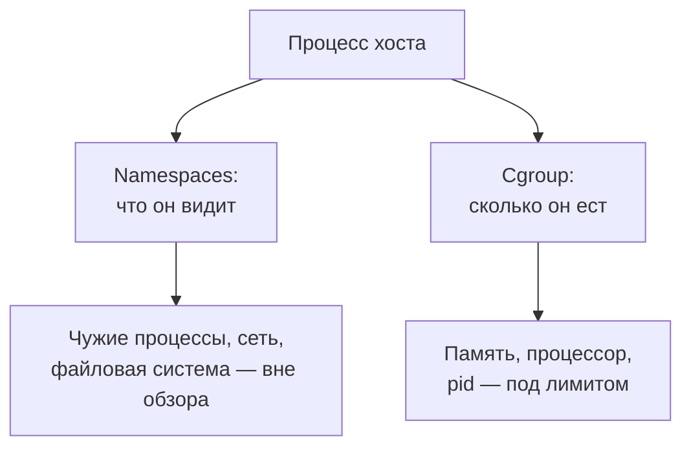

# Namespaces и cgroups: изоляция и лимиты процесса

Уровень **L2** · время 40 мин (теория 25 / задача 10 / самопроверка 5,
оценка)

Что прочитать сначала: `linux-setuid`, `linux-capabilities`.

Запустим процесс в свежем user namespace и спросим, кто он:

```text
$ unshare -Ur bash -c 'cat /proc/self/uid_map; id'
         0       1000          1
uid=0(root) gid=0(root) groups=0(root),65534(nobody)
```

Внутри процесс — root, uid 0. Карта в первой строке говорит другое:
внутренний uid 0 — это внешний uid 1000, обычный пользователь, и диапазон
ровно в одну запись. Права root у него есть только над ресурсами этого
пространства имён; снаружи он никем не стал.

Это и есть механизм, на котором стоят контейнеры. Контейнер — не
маленькая виртуальная машина, а обычный процесс хоста, которому подрезали
обзор и ресурсы. Обзор режут namespaces: процесс перестаёт видеть чужие
процессы, чужую сеть, чужой /tmp. Ресурсы режут cgroups: процесс не может
съесть больше памяти и процессора, чем ему выделили. Оба механизма —
свойство процесса, а не образа, и работают они без всякого Docker.

Дальше разберём восемь типов пространств имён, иерархию контрольных
групп и карту идентификаторов, потом посмотрим, как отсутствие изоляции
и лимитов выглядит в описании запуска. Флаги контейнерных рантаймов
поверх этой механики разбирает тема `docker-insecure-practices`.

## 0. Коротко

То же в терминах, которыми это обсуждают. Namespace отрезает процессу
кусок обзора: mount — файловую систему, pid — чужие процессы, net —
сетевые интерфейсы, user — соответствие идентификаторов. Cgroup
ограничивает и учитывает ресурсы группы процессов: память, процессор,
число pid. Права, полученные внутри user namespace, действуют только на
ресурсы этого namespace: root внутри — никто снаружи. Дефект
конфигурации здесь — процесс, которому дали обзор и ресурсы больше
нужного: он видит чужое и может обесточить хост.

**Зачем это в работе AppSec-инженера.** На этой механике стоит вся
контейнерная инфраструктура, и находки звучат её словами: «процесс видит
чужие namespace», «под без лимита памяти», «root в контейнере без
userns-remap». Понимание, что контейнер — это процесс с подрезанным
обзором, отличает оценку риска от пересказа маркетинга рантайма.

## 1. Цели

После этого раздела вы сможете:

1. Назвать, что отрезает процессу каждый тип namespace и что
   ограничивают cgroups.
2. Прочитать карту uid_map и назвать, кем оказывается root изнутри
   снаружи.
3. Отличить изоляцию обзора от лимита ресурсов.
4. Найти в описании запуска процесс без изоляции и без лимитов.

## 3. Механика

**Откуда это взялось.** Общий сервер ставит вопрос, который права на
файлы не решают: процессы мешают друг другу, даже когда ни один не читает
чужих файлов. Один видит чужие процессы и их порты, другой выедает всю
память хоста. Старый ответ — chroot — резал только корень файлового
дерева. Ответом стали два независимых механизма ядра: namespaces для
обзора и cgroups для ресурсов. Позже к ним добавился user namespace,
закрывший самый больной вопрос — как дать процессу root-подобные права,
не давая root на хосте.

### Namespaces: что процесс видит

namespaces(7) перечисляет восемь типов. У каждого свой предмет:
mount — точки монтирования, pid — дерево процессов, net — интерфейсы и
порты, uts — имя хоста. Дальше: ipc — объекты межпроцессного обмена,
cgroup — корень видимой иерархии групп, time — системные часы,
user — карту идентификаторов и capabilities. Список пространств
процесса виден без
всяких привилегий:

```text
$ lsns -p $$
        NS TYPE   NPROCS PID USER    COMMAND
4026531832 mnt        94 792 tarchok python3 -m smgr daemon
4026531836 pid        95 792 tarchok python3 -m smgr daemon
4026531837 user       82 792 tarchok python3 -m smgr daemon
```

Здесь сокращено до трёх строк из восьми. Одно пространство имён —
один номер; процессы с общим номером делят обзор. У процесса в новом
pid namespace нумерация начинается заново:

```text
$ unshare -Urpf --mount-proc bash -c 'echo "pid: $$";
> ls /proc | grep -c "^[0-9]"'
pid: 1
3
$ ls /proc | grep -c '^[0-9]'
373
```

Внутри процесс — pid 1 и видит три процесса, снаружи на той же машине
их сотни. Тот же приём с mount namespace: примонтированный внутри
временный /tmp снаружи не существует.

### Cgroups: сколько процесс может съесть

Контрольные группы — вторая половина механизма. cgroups(7) описывает
иерархию групп процессов с контроллерами ресурсов: память, процессор,
число pid, ввод-вывод. В версии v2 все контроллеры живут в единой
иерархии под /sys/fs/cgroup, и лимит назначается записью в файл группы.
Принадлежность процесса видна в его /proc: на этой машине shell лежит в
`0::/user.slice/user-1000.slice/session-2.scope`.

Лимит проверяется одним прогоном. Процесс с потолком памяти в 40 МБ
и запретом подкачки при попытке взять 200 МБ:

```text
$ journalctl --user --no-pager -o cat | grep oom-kill | tail -1
run-…scope: Failed with result 'oom-kill'.
```

Имя юнита сокращено. Ядро убило процесс группы по сигналу 9, и код
возврата был 137. Тонкость, проверенная тем же прогоном: при разрешённой
подкачке тот же лимит не убивает, а вытесняет страницы в swap — процесс
живёт, но тормозит.

### User namespace: root внутри, никто снаружи

Пространство имён пользователя задаёт карту идентификаторов между
внутри и снаружи. user_namespaces(7) описывает её формат: три числа на
строку — начало диапазона внутри, начало снаружи, длина. Карта из
вводного примера, `0 1000 1`, читается как «внутренний uid 0 — это
внешний uid 1000, и больше никто».

Права при этом не утекают наружу: capability внутри user namespace
разрешает операции только над ресурсами, которыми это пространство
владеет (user_namespaces(7)). Поэтому `unshare -Urn` из темы
`linux-capabilities` открыл сырой сокет только внутри нового сетевого
namespace — тем же прогоном снаружи был отказ. Отсюда ответ на вопрос
«опасен ли root в контейнере»: опасен ровно настолько, насколько широка
карта и что namespace-ам принадлежит.



**Описание схемы.** Один процесс хоста получает два независимых
ограничения: namespaces решают, какие объекты ему видны, cgroup — какие
ресурсы он может потребить. Первое без второго даёт изолированный
процесс, который обесточит хост; второе без первого — экономного
процесса, который читает чужие процессы.

## 5. Как выглядит в коде

Ревьюер здесь смотрит не на код приложения, а на описание его запуска —
и на типовые «песочницы», которые ничего не изолируют.

**Первое: chroot как изоляция.** Классическая ошибка:

```python
# УЯЗВИМО — «песочница», которая не изолирует
os.chroot("/srv/jail")   # (1)
```

1. chroot меняет только видимый корень файловой системы. Процессы,
   сеть, межпроцессный обмен остаются общими; процесс видит чужие pid,
   слушает чужие порты, шлёт сигналы. Это смена каталога, а не изоляция.

**Второе: запуск без лимитов.** Описание службы или команда запуска, в
которой нет ни потолка памяти, ни ограничения процессов:

```bash
# УЯЗВИМО — у воркера нет ни лимита, ни изоляции
python3 worker.py &
```

Один утечущий цикл такого воркера укладывает хост целиком: CWE-400
(каталог Common Weakness Enumeration), неограниченное потребление
ресурса. А запуск с правами шире нужных — та же CWE-250, что в теме
`linux-capabilities`.

**Что не спасает.** chroot под root обходится одним вызовом, поэтому
пара «chroot без смены uid» хуже обеих по отдельности: видимость упала,
полномочия нет. Лимит памяти без ограничения подкачки не убивает, а
замедляет. Namespace для процесса, который смотрит в чужой сокет,
изоляции не даёт.

> **Примечание: ложное срабатывание.** Процесс без своих namespaces —
> не дефект, а норма: вся система так живёт. Находкой его делает
> контекст: чужой код, недоверенные данные, общий хост. Одноразовый
> скрипт бэкапа на пустой машине изолировать нечему.

## 6. Как чинится

Изоляция и лимит собираются на процесс, образ тут необязателен:

```bash
# Изолированный запуск с лимитом, без контейнера
systemd-run --user --scope \
  -p MemoryMax=40M -p MemorySwapMax=0 \
  unshare -Urn ./worker.py
```

Первое — cgroups: потолок памяти и запрет подкачки. Второе —
namespaces: новые user и net пространства. Контейнерный рантайм делает
ровно эти два вызова, только через clone с флагами и записи в файлы
иерархии.

**Границы применимости.** Изоляция сужает обзор, но не чинит ядро:
уязвимость в самом ядре достаёт и из namespace. Поэтому под сомнительный
код кладут ещё и capabilities из темы `linux-capabilities`. Карта
uid_map решает, кем внутренний root оказывается снаружи; широкая карта с
диапазоном на тысячи uid — та же находка, что и запуск от root. И
лимиты стоят денег: потолок памяти под задачу подбирают замером, иначе
OOM killer начнёт убивать рабочие процессы.

## 9. Ловушка

Распространённое представление: контейнер — это маленькая виртуальная
машина, отдельная от хоста.

**Контейнер — процесс хоста с подрезанным обзором, ядро у него общее.**
Механизм из блока «Механика»: namespace меняет только то, что процессу
показывают, а системные вызовы идут в то же ядро, что у всех.

Контрпример. Сравните вывод lsns у процесса в контейнере и у процесса
хоста: форма та же, отличаются номера пространств. Уязвимость ядра,
дающая запись в чужую память, бьёт обе строки одинаково — «машина»
виртуальной тут нет.

## 10. Чеклист ревью

1. Verify that процессу с чужим кодом или недоверенными данными назначены
   свои namespaces, а не общие с хостом.
2. Verify that у процесса есть потолок памяти и ограничение подкачки
   (CWE-400).
3. Verify that карта uid_map не мапит внутренний uid 0 на uid 0 хоста.
4. Verify that изоляция не сведена к chroot: процессы, сеть и IPC
   отрезаются своими namespaces.
5. Verify that лишние capabilities у процесса сняты — лимиты обзора не
   заменяют лимиты полномочий.
6. Verify that подбор потолка памяти подтверждён замером, а не угадан.

## 11. Задача

Возьмите свою машину с Linux и снимите три артефакта одного процесса.
Первый — список его namespaces через `lsns -p $$`, второй — его cgroup
из /proc/self/cgroup, третий — карту uid_map через `unshare -Ur` из
блока «Механика».

Одна подсказка: сравнивать имеет смысл до и после unshare — разница и
есть изоляция.

**Критерий выполнения** наблюдаемый: таблица из двух строк (снаружи,
внутри) и трёх колонок (номер pid внутри namespace, число видимых
процессов, соответствие внутреннего uid внешнему по карте).

## 12. Проверь себя

1. Чем namespace отличается от cgroup по предмету ограничения?
2. Карта uid_map содержит `0 1000 1`. Кем оказывается внутренний root
   снаружи и сколько uid замаплено?
3. Почему capability внутри user namespace не опасна хосту?
4. Лимит памяти задан, подкачка разрешена. Что произойдёт с процессом,
   превысившим лимит?
5. Возврат к теме `linux-capabilities`: почему `unshare -Urn` открыл
   сырой сокет, хотя uid снаружи остался непривилегированным?
6. Возврат к теме `linux-setuid`: что произойдёт с битом setuid на
   файле, чей владелец не замаплен внутрь user namespace?

<details markdown="1">
<summary>Ответы</summary>

1. Namespace решает, что процесс видит; cgroup — сколько ресурсов он
   может потребить. Это независимые механизмы.
2. Внешним uid 1000, обычным пользователем; замаплен ровно один uid.
3. Capability внутри действует только на ресурсы, которыми владеет это
   пространство имён; ресурсы хоста ему не принадлежат.
4. Процесс не будет убит: страницы вытеснятся в swap, и он продолжит
   работать медленнее. Убийство наступает при запрете подкачки или при
   исчерпании её тоже.
5. Потому что процесс получил полный набор capabilities над новым
   сетевым namespace: проверка шла по capability, а не по uid хоста.
6. Бит молча игнорируется: программа запустится без подмены
   идентификатора (user_namespaces(7)).

</details>

## 13. Источники

1. namespaces(7) «overview of Linux namespaces», Linux man-pages 6.18;
   реестр `man-namespaces`. Разделы: список восьми типов пространств
   имён и их предмет.
   <https://man7.org/linux/man-pages/man7/namespaces.7.html>
2. cgroups(7) «Linux control groups», Linux man-pages 6.18; реестр
   `man-cgroups`. Разделы: иерархия, контроллеры, отличия v1 и v2.
   <https://man7.org/linux/man-pages/man7/cgroups.7.html>
3. user_namespaces(7) «overview of Linux user namespaces», Linux
   man-pages 6.18; реестр `man-user-namespaces`. Разделы: карты uid_map
   и gid_map, capabilities внутри namespace, setuid без маппинга.
   <https://man7.org/linux/man-pages/man7/user_namespaces.7.html>

Каркас этапа: записи семейства man-* (Linux man-pages project, выпуск
6.18) — наследуются всеми темами подраздела 4.1.

**Скоропортящийся слой.** Числа в выводах (номера namespace, счёт
процессов) — снимок одной машины на один прогон. Семантика карт и
контроллеров стабильна; различия v1 и v2 уходят в прошлое вместе с v1.

**Маркеры уверенности.** **Проверено лично** 2026-09-01 на Arch Linux,
ядро 6.18.48-1-lts, util-linux 2.42.2, systemd 261: вывод lsns,
карта `0 1000 1` и id внутри user namespace, pid 1 и три видимых
процесса в новом pid namespace, изолированный tmpfs в mount namespace,
OOM killer при MemoryMax=40M и MemorySwapMax=0 (код 137, запись
«oom-kill» в журнале) и уход в swap без запрета подкачки. Список типов
namespace, формат карты, правило «capability действует на ресурсы
namespace», игнорирование setuid без маппинга — **по документации**
(namespaces(7), cgroups(7), user_namespaces(7), открыты лично
2026-09-01). Поведение контейнерных рантаймов поверх этой механики
**не проверялось**: кластерный стенд не поднимался.
