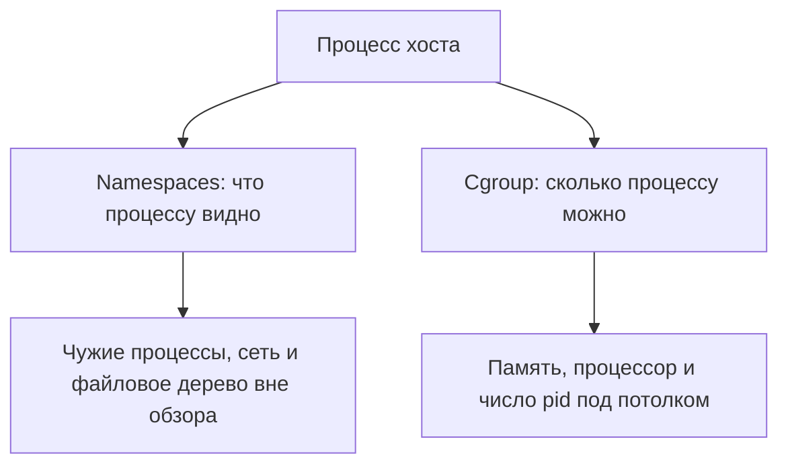

# Namespaces и cgroups: изоляция и лимиты процесса

Представьте общий сервер команды: ваш воркер, база соседнего проекта
и скрипт от заказчика. Ночью скрипт зациклился и выел всю память,
упали все трое, хотя баг был в одном скрипте. Утром выяснилось, что
скрипт видел чужие процессы и их командные строки, и в одной строке
лежал пароль. Права на файлы не помогли бы: скрипт не читал чужих
файлов, он мешал соседям иначе — через обзор и ресурсы. Ядро Linux
умеет отрезать и то и другое: namespaces решают, что процесс видит,
cgroups — сколько он может съесть. На этой паре стоят все контейнеры,
и ниже мы соберём изоляцию руками, без всякого Docker.

## Что такое namespace и cgroup

Оба механизма живут в ядре, поэтому начнём с него. Ядро — программа,
которая хозяйничает на машине: процессор, память и диски одни на всех,
и раздаёт их ядро. Всё, что процессу нужно за пределами собственной
памяти, он просит у ядра системным вызовом: открыть файл, послать байт
в сеть, породить процесс. Поэтому любое ограничение ядро применяет
в момент такой просьбы, и оба механизма темы работают именно там.

Namespace, пространство имён, — настройка обзора процесса: какие объекты
системы ему показывать. Процессу с новым пространством имён процессов
чужие процессы не запрещены, а не видны вовсе: их нет в его картине
мира. Бытовое соответствие — квартира в доме: жилец не видит соседей,
хотя дом один. Квартира здесь соответствует пространству имён, жилец —
процессу, дом — машине. Аналогия ломается на стенах: настоящие стены
держат физически, а namespace — фильтр на выдаче ядра, и системные
вызовы идут в то же общее ядро.

Cgroup, контрольная группа, — настройка аппетита: ядро считает, сколько
памяти, процессора и операций ввода-вывода съела группа процессов, и
останавливает её на назначенной отметке. Если namespace отвечает за «что
видно», то cgroup — за «сколько можно»: это счётчик электричества в той
же квартире. Поодиночке они не работают. Процесс со срезанным обзором
и без лимита обесточит хост, а процесс с лимитом и общим обзором
прочитает чужие командные строки.

Контейнер — не маленькая виртуальная машина, а обычный процесс хоста,
которому назначили свои пространства имён и свою группу. Отдельного
ядра у него нет, и это важно для безопасности: уязвимость в ядре
достаёт и из контейнера. Контейнерные рантаймы вроде Docker собирают
эти вызовы по описанию запуска, их флаги разбирает тема
`docker-insecure-practices` дальше по маршруту. Здесь хватит двух
утилит: `unshare` создаёт процессу новые пространства имён, а `lsns`
показывает, какие пространства у процесса есть.

**Зачем это в работе AppSec-инженера.** На этой паре механизмов стоит
вся контейнерная инфраструктура. Находки звучат её словами: «процесс
видит чужие namespace», «контейнер без лимита памяти», «root в контейнере
без userns-remap». Ревьюеру, который понимает, что контейнер — процесс
с подрезанным обзором, находка читается как сумма снятых ограничений,
а не как картинка из рекламы рантайма. Поэтому тема учит не командам,
а чтению запуска: что процессу оставили видеть и сколько ему позволили
съесть.

Начнём с наблюдения, на котором стоит вся тема. Запустим процесс
в свежем пространстве имён пользователя и спросим, кто он. За это
отвечают два флага: `-U` создаёт новое пространство имён пользователя,
а `-r` записывает в него карту «мой обычный uid снаружи становится
uid 0 внутри». Саму карту процесс читает из /proc — виртуальной папки,
в которой ядро отчитывается о процессах файлами.

```text
$ unshare -Ur bash -c 'cat /proc/self/uid_map; id'
         0       1000          1
uid=0(root) gid=0(root) groups=0(root),65534(nobody)
```

Вторая строка отвечает «root, uid 0». Первая строка — карта, и говорит
она другое: внутренний uid 0 — это внешний uid 1000, обычный
пользователь, и диапазон ровно в одну запись. Получается root, который
снаружи никем не стал: его полномочия действуют только над ресурсами
этого пространства имён. Что такое uid и чем он решает права, разбирала
тема `linux-setuid`. Как устроена карта и почему полномочия не утекают
наружу, разберём в разделе про user namespace.

## Как это работает

**Откуда это взялось.** Общий сервер ставит вопрос, который права на
файлы не решают: процессы мешают друг другу, даже когда ни один не
читает чужих файлов. Один видит чужие процессы и порты, другой выедает
всю память хоста. Старый ответ, вызов chroot, резал только корень
файлового дерева. Ответом стали два независимых механизма: namespaces
для обзора и cgroups для ресурсов. Первое пространство, mount, вошло
в ядро 2.4.19 в 2002 году, cgroups — в 2.6.24. А user namespace в 3.8
закрыл самый больной вопрос: как дать процессу права root, не давая
root на хосте.

### Namespaces: что процессу видно

Пространства имён делятся по предмету обзора, и namespaces(7)
перечисляет восемь типов. Чаще всего на ревью встречаются четыре. Mount
отрезает точки монтирования, то есть видимое файловое дерево. Pid
отрезает дерево процессов. Net отрезает сетевые интерфейсы и порты,
и у процесса оказывается свой localhost. User задаёт соответствие
идентификаторов и capabilities, ему отдельный раздел ниже. Остальные
четыре короче: uts даёт своё имя хоста, ipc — свои объекты
межпроцессного обмена, cgroup — свой корень видимой иерархии групп,
time — своё смещение системных часов.

Список пространств конкретного процесса виден без всяких привилегий.
Спросим у своего shell:

```text
$ lsns -p $$
        NS TYPE   NPROCS PID USER    COMMAND
4026531832 mnt        94 792 tarchok python3 -m smgr daemon
4026531836 pid        95 792 tarchok python3 -m smgr daemon
4026531837 user       82 792 tarchok python3 -m smgr daemon
```

Вывод сокращён до трёх строк из восьми. Одна строка — одно пространство:
колонка NS называет его номер, TYPE — тип, NPROCS — сколько процессов
в нём живёт. Процессы с общим номером делят обзор, и на обычной машине
почти все они сидят в восьми пространствах, которые ядро создало при
загрузке. Поэтому изоляция начинается с новых номеров.

### Новые пространства руками: pid и mount

Утилита `unshare` запускает команду с новыми пространствами, и буквы
флагов выбирают, какими. Прогон ниже добавляет к `-Ur` ещё два. Флаг
`-p` создаёт новое пространство имён процессов, а `-f` порождает
потомка. Своё место в дереве процессов процесс сменить не может,
поэтому команду внутри запускает потомок, и он становится там pid 1.
Опция `--mount-proc` вешает внутри свежий /proc, иначе там осталось бы
старое дерево процессов.

```text
$ unshare -Urpf --mount-proc bash -c 'echo "pid: $$";
> ls /proc | grep -c "^[0-9]"'
pid: 1
3
$ ls /proc | grep -c '^[0-9]'
397
```

Внутри процесс стал pid 1, первым в своём дереве, и видит ровно три
процесса. Снаружи на той же машине в тот же момент — 397. Оба числа
верны одновременно, потому что это два разных обзора одного ядра.
Тот же приём работает с mount namespace: примонтированный внутри новый
tmpfs, файловая система в памяти, снаружи не существует, и временный
/tmp перестаёт быть общим.

### Cgroups: сколько процессу можно

Контрольные группы — вторая половина механизма. cgroups(7) описывает
иерархию групп процессов с контроллерами ресурсов: память, процессор,
число pid, ввод-вывод. Версия v2 свела все контроллеры в единую
иерархию под /sys/fs/cgroup. Это файловый пульт управления: лимит
назначается записью числа в файл группы. Принадлежность процесса видна
в его /proc: на машине автора shell лежит в группе
`0::/user.slice/user-1000.slice/session-2.scope`, то есть в группе
пользовательского сеанса.

Лимит проверяется одним прогоном. Утилита systemd-run просит systemd,
диспетчер процессов машины, запустить команду в новой группе с заданными
свойствами. Поставим потолок памяти 40 МБ с запретом подкачки и попросим
у ядра 200 МБ:

```text
$ systemd-run --user --scope -p MemoryMax=40M -p MemorySwapMax=0 \
    python3 -c "a=bytearray(200*1024*1024)"
Running as unit: run-…scope
Killed
$ echo $?
137
```

Имя юнита, единицы запуска systemd, сокращено, а сообщение об убийстве
обрезано до слова Killed. Ядро убило процесс группы девятым сигналом.
Код возврата складывается из него по правилу «128 плюс номер сигнала»:
128 + 9 = 137. Запись осталась в журнале systemd, который читает
journalctl:

```text
$ journalctl --user --no-pager -o cat | grep oom-kill | tail -1
run-…scope: Failed with result 'oom-kill'.
```

Здесь работают три понятия, которые стоит назвать. Подкачка, swap, —
участок диска, куда ядро вытесняет страницы памяти, когда оперативной
не хватает. OOM killer — сторож ядра, который при исчерпании памяти
выбирает процесс и убивает его. Свойство MemorySwapMax=0 закрывает
подкачку, и тогда потолок бьёт сразу. Тонкость, проверенная тем же
прогоном без второго свойства: при разрешённой подкачке тот же лимит
не убивает, а вытесняет страницы в swap — процесс живёт, но тормозит.

### User namespace: root внутри, никто снаружи

Пространство имён пользователя задаёт карту идентификаторов между
внутри и снаружи. user_namespaces(7) описывает её формат: три числа на
строку — начало диапазона внутри, начало снаружи, длина. Карта из
первого прогона, `0 1000 1`, читается как «внутренний uid 0 — это
внешний uid 1000, и больше никто». Длина диапазона — одна запись, то
есть никакого другого uid у процесса нет. Карта лежит в
/proc/self/uid_map, и каждый процесс читает её про себя.

Права при этом не утекают наружу. Тема `linux-capabilities` показала,
что полномочия root поделены на отдельные capabilities. Здесь важно
правило из user_namespaces(7): capability внутри user namespace
разрешает операции только над ресурсами, которыми это пространство
владеет. Поэтому `unshare -Urn` из той темы открыл сырой
сокет только внутри нового сетевого пространства, а тем же прогоном
снаружи был отказ. Отсюда ответ на вопрос «опасен ли root в
контейнере»: опасен ровно настолько, насколько широка карта и чем
владеют его пространства. Сама цифра 0 внутри ещё ничего не значит.


```mermaid
flowchart TB
    A[Процесс хоста] --> B[Namespaces: что процессу видно]
    A --> C[Cgroup: сколько процессу можно]
    B --> D[Чужие процессы, сеть и файловое дерево вне обзора]
    C --> E[Память, процессор и число pid под потолком]
```

**Описание схемы.** Один процесс хоста получает два независимых
ограничения: namespaces решают, какие объекты ему видны, cgroup — какие
ресурсы он может потребить. Первое без второго даёт изолированный
процесс, который обесточит хост. Второе без первого — экономный
процесс, который читает чужое. По отдельности они не работают.

## Как это атакуют

Атакующий в этой теме — не взломщик ядра, а чужой код, который уже
запустили на общем хосте: воркер заказчика, контейнер из скачанного
образа, плагин из репозитория. Вопрос в том, что он получает, если
изоляцию и лимиты ему не назначили.

Первое — обзор. Без своего pid пространства чужой код видит все
процессы хоста и читает их командные строки из /proc: номер процесса —
каталог, файл cmdline внутри — строка запуска. В аргументах команд
встречаются пароли и токены, поэтому секрет в параметрах команды
считается скомпрометированным. Без своего net пространства процесс
видит общий localhost: сервис, который слушает 127.0.0.1 «только для
своих», считает своим любого на этом хосте. На машине автора в момент
прогона таких портов было пять.

Второе — ресурсы. Без потолка памяти один утечший цикл выедает память
хоста, и OOM killer выбирает жертву среди всех процессов: упасть может
ваша база, а не виновник. Это CWE-400, пункт каталога типовых слабостей
(Common Weakness Enumeration): неограниченное потребление ресурса. Как
такие номера связываются с публичными уязвимостями, разбирает тема
`cve-cvss`.

Третье — права. Если user namespace процессу не меняли, его uid —
настоящий. Карта обычной машины тождественная, каждый uid совпадает сам
с собой:

```text
$ cat /proc/self/uid_map
         0          0 4294967295
```

Внутренний root с такой картой — root хоста со всеми его полномочиями,
и никакой контейнерной границы между ними нет. Запуск с правами шире
нужных — та же CWE-250, что разбирала тема `linux-capabilities`.

## Как это выглядит в коде

Ревьюер здесь читает не код приложения, а описание его запуска, и
типовые «песочницы», которые ничего не изолируют. Признака два, и оба
помещаются в две строки.

Первый — chroot как изоляция. Вызов старый и звучит убедительно:
chroot, «смена корня», подменяет процессу видимый корень файлового
дерева. Назовите до выноски, что эта строка оставляет общим с хостом:

```python
# УЯЗВИМО — «песочница», которая не изолирует
os.chroot("/srv/jail")   # (1)
```

1. chroot меняет только файловое дерево. Процессы, сеть и межпроцессный
   обмен остаются общими: процесс видит чужие pid, слушает чужие порты,
   шлёт сигналы. Это смена каталога, а не изоляция, и под root она
   снимается тем же вызовом обратно.

Второй — запуск без лимитов. Описание службы или команда запуска, в
которой нет ни потолка памяти, ни ограничения процессов. Чем это
кончается для хоста, прикиньте до разбора:

```bash
# УЯЗВИМО — у воркера нет ни лимита, ни изоляции
python3 worker.py &
```

Один утечший цикл такого воркера укладывает хост целиком, это и есть
CWE-400 из блока про атаку. Права здесь тоже не спрашивали: воркер
наследует того, кто его запустил. А запуск от root «чтобы наверняка»
превращает любую ошибку воркера в ошибку с полными полномочиями.

**Что не спасает.** Пара «chroot без смены uid» хуже обеих по
отдельности: видимость упала, полномочия нет. Лимит памяти без
ограничения подкачки не убивает, а замедляет. И namespace не изолирует
то, что приехало по общему каналу: если процесс смотрит в чужой сокет,
обзор уже поделён.

> **Примечание: ложное срабатывание.** Процесс без своих namespaces —
> не дефект, а норма: вся система так живёт. Находкой его делает
> контекст: чужой код, недоверенные данные, общий хост. Одноразовый
> скрипт бэкапа на пустой машине изолировать нечему.

## Как защититься

Защита собирается на процесс, и образ для этого необязателен. Обе
половины ставятся одной строкой:

```bash
# Изолированный запуск с лимитом, без контейнера
systemd-run --user --scope \
  -p MemoryMax=40M -p MemorySwapMax=0 \
  unshare -Urn ./worker.py
```

Первое — cgroups: потолок памяти и запрет подкачки, утечка убьёт
воркера, а не хост. Второе — namespaces: буква `-n` добавляет новое
сетевое пространство, root внутри остаётся обычным пользователем
снаружи, а сеть хоста воркеру не видна. Контейнерный рантайм делает ровно эти два шага, только через
системный вызов clone с флагами и записи в файлы иерархии. Проверка
понимания без новых команд: уберите из строки unshare — что у процесса
останется и что пропадёт?

**Границы применимости.** Изоляция сужает обзор, но не чинит ядро:
уязвимость в самом ядре достаёт и из пространства имён, потому что
вызовы идут в общее ядро. Поэтому под сомнительный код кладут ещё и
срез capabilities из темы `linux-capabilities`, а принудительные
политики поверх разбирает тема `linux-mandatory-access` дальше по
маршруту. Карта uid_map решает, кем внутренний root окажется снаружи:
широкая карта с диапазоном на тысячи uid — та же находка, что запуск
от root. И лимиты стоят денег: потолок памяти под задачу подбирают
замером, иначе OOM killer начнёт убивать рабочие процессы.

Починка проверяется повтором атаки из блока выше, теми же командами.
Прогон с потолком 40 МБ кончается записью oom-kill в журнале и кодом
137: убит воркер, хост жив. Прогон `lsns` показывает у воркера свои
номера пространств, а карта читает «root внутри — uid 1000 снаружи».
Журнал и аудит таких запусков разбирает тема `linux-logs-audit-systemd`.

## Частая ошибка

Чем для ядра отличается процесс в контейнере от процесса на хосте?
Сначала свой ответ, потом опровержение.

Знакомая картинка: контейнер — это маленькая виртуальная машина,
отдельная от хоста.

**Контейнер — процесс хоста с подрезанным обзором, ядро у него общее.**
Namespace меняет только то, что процессу показывают, а системные вызовы
идут в то же ядро, что у всех. Заблуждение держится на картинке «своей
машины»: раз машина отдельная, то и ядро отдельное. Подстановка не
выводится: машины здесь нет, есть процесс со срезанным обзором.

Контрпример. Сравните вывод lsns у процесса в контейнере и у процесса
хоста: форма та же, отличаются номера пространств. Уязвимость ядра,
дающая запись в чужую память, бьёт обе строки одинаково — «машины»
виртуальной тут нет.

## Чеклист для ревью

1. Проверьте, что процессу с чужим кодом или недоверенными данными
   назначены свои namespaces, а не общие с хостом.
2. Проверьте, что у процесса есть потолок памяти и ограничение подкачки
   (CWE-400).
3. Проверьте, что карта uid_map не мапит внутренний uid 0 на uid 0
   хоста.
4. Проверьте, что изоляция не сведена к chroot: процессы, сеть и IPC
   отрезаются своими namespaces.
5. Проверьте, что лишние capabilities у процесса сняты: лимиты обзора
   не заменяют лимиты полномочий.
6. Проверьте, что подбор потолка памяти подтверждён замером, а не
   угадан.

## Попробуй сам

Возьмите свою машину с Linux и снимите три артефакта одного процесса.
Первый — список его пространств через `lsns -p $$`, второй — его группу
из /proc/self/cgroup, третий — карту uid_map через `unshare -Ur` из
раздела «Как это работает».

Одна подсказка: сравнивать имеет смысл до и после unshare — разница и
есть изоляция.

**Критерий выполнения** наблюдаемый: таблица из двух строк (снаружи,
внутри) и трёх колонок (номер pid внутри пространства, число видимых
процессов, соответствие внутреннего uid внешнему по карте).

## Проверь себя

1. Предскажите вывод до запуска и проверьте прогоном.

   ```text
   $ unshare -Urn python3 -c "import socket;socket.socket().bind(('',443))"
   $ echo $?
   …
   ```

2. Прочитайте карту процесса: кем снаружи оказываются внутренние uid 1
   и 2, сколько идентификаторов замаплено и кому принадлежит внутренний
   uid 0?

   ```text
   $ cat /proc/self/uid_map
            1       1001          2
   ```

3. Воркер исполняет присланный код и запускается строкой `python3
   worker.py &` — без изоляции и без лимитов. Выберите починку:

   A. Добавить в начало воркера `os.chroot("/srv/jail")`.

   B. Запускать через `systemd-run --scope -p MemoryMax=… -p
      MemorySwapMax=0 unshare -Urn ./worker.py`.

   C. Задать потолок памяти MemoryMax, а подкачку не трогать.

4. Почему уязвимость ядра, дающая запись в чужую память, бьёт процесс в
   контейнере так же, как процесс на хосте?

5. Возврат к теме `linux-capabilities`: почему `unshare -Urn` открыл
   сырой сокет, хотя uid снаружи остался непривилегированным?

6. Возврат к теме `unhandled-exceptions-dos`: там сервис клало
   необработанное исключение, здесь хост кладёт воркер без потолка
   памяти. Что общего у двух отказов и чем различаются их рубежи?

<details markdown="1">
<summary>Ответ 1</summary>

1. `0`: привязка удалась. Процесс получил полный набор capabilities над
   новыми user и net пространствами, а порт ниже 1024 — ресурс этого net
   namespace. Проверка прошла по capability, и uid хоста её не касался.
   Команда для прогона — та же пара `unshare -Urn python3 -c …` и `echo
   $?`; снаружи, без `unshare`, тот же вызов кончается PermissionError.

</details>

<details markdown="1">
<summary>Ответ 2</summary>

2. Три числа на строку: начало диапазона внутри, начало снаружи, длина.
   Внутренний uid 1 — внешний 1001, внутренний 2 — внешний 1002;
   замаплено ровно два. Внутренний uid 0 не замаплен никому: такого root
   внутри не существует, а обращения к нему снаружи покажут
   переполненный uid 65534, nobody.

</details>

<details markdown="1">
<summary>Ответ 3: разбор вариантов</summary>

3. Верен B. Разбор каждого:

   A. chroot меняет только видимый корень файловой системы: процессы,
      сеть и межпроцессный обмен остаются общими с хостом. Это смена
      каталога, а не изоляция.

   B. Даёт обе половины механизма: cgroups ставят потолок памяти с
      запретом подкачки, unshare отрезает обзор — свои user и net
      пространства, root внутри при этом снаружи никто.

   C. Лимит памяти без запрета подкачки не убивает, а замедляет:
      страницы вытесняются в swap, и утечший воркер живёт дальше,
      отъедая диск. А обзор хоста так и остался общим.

</details>

<details markdown="1">
<summary>Ответ 4</summary>

4. Ядро у контейнера и хоста общее: namespace меняет только то, что
   процессу показывают, а системные вызовы идут в то же ядро. Ошибка
   внутри ядра не знает, из какого namespace пришёл вызов, — «отдельной
   машины» здесь нет, есть процесс со срезанным обзором.

</details>

<details markdown="1">
<summary>Ответ 5</summary>

5. Процесс получил полный набор capabilities над свежим сетевым
   namespace, и проверка шла по capability, а не по uid хоста. Над
   ресурсами хоста этот набор не действует: тем же прогоном без новых
   пространств был отказ.

</details>

<details markdown="1">
<summary>Ответ 6</summary>

6. Общее — один участник обесточивает всех: одно исключение роняет
   сервис, один утечший цикл выедает память хоста. Рубежи разные: там
   отказ локализуют в обработчике — исключение ловят до того, как оно
   уронит процесс. Здесь рубеж в cgroup — потолок памяти с запретом
   подкачки, и OOM killer убивает один процесс вместо хоста.

</details>

## Источники

1. namespaces(7) «overview of Linux namespaces», Linux man-pages 6.18;
   реестр `man-namespaces`. Разделы: список восьми типов пространств
   имён и их предмет.
   <https://man7.org/linux/man-pages/man7/namespaces.7.html>
2. cgroups(7) «Linux control groups», Linux man-pages 6.18; реестр
   `man-cgroups`. Разделы: иерархия, контроллеры, отличия v1 и v2.
   <https://man7.org/linux/man-pages/man7/cgroups.7.html>
3. user_namespaces(7) «overview of Linux user namespaces», Linux
   man-pages 6.18; реестр `man-user-namespaces`. Разделы: карты uid_map
   и gid_map, capabilities внутри namespace, setuid без маппинга.
   <https://man7.org/linux/man-pages/man7/user_namespaces.7.html>

Каркас этапа: записи семейства man-* (Linux man-pages project, выпуск
6.18) — наследуются всеми темами подраздела 4.1.

**Скоропортящийся слой.** Числа в выводах (номера пространств, счёт
процессов) — снимок одной машины на один прогон. Семантика карт и
контроллеров стабильна; различия v1 и v2 уходят в прошлое вместе с v1.

**Маркеры уверенности.** **Проверено лично** 2026-09-01 на Arch Linux,
ядро 6.18.48-1-lts, util-linux 2.42.2, systemd 261: вывод lsns и
изолированный tmpfs в mount namespace. Перепроверено 2026-10-03 на той
же машине, ядро 6.18.54-1-lts, util-linux 2.42.4, systemd 262: карта
`0 1000 1` и id внутри user namespace, pid 1 и три видимых процесса
в новом pid namespace (снаружи 397), OOM killer при MemoryMax=40M и
MemorySwapMax=0 (код 137, запись «oom-kill» в журнале), выживание
процесса без запрета подкачки, тождественная карта хоста `0 0
4294967295`, привязка порта 443 внутри `unshare -Urn` и PermissionError
снаружи, пять портов на 127.0.0.1. Список типов namespace, формат
карты, правило «capability действует на ресурсы namespace», игнорирование
setuid без маппинга — **по документации** (namespaces(7), cgroups(7),
user_namespaces(7), открыты лично 2026-09-01). Поведение контейнерных
рантаймов поверх этой механики **не проверялось**: кластерный стенд не
поднимался.
