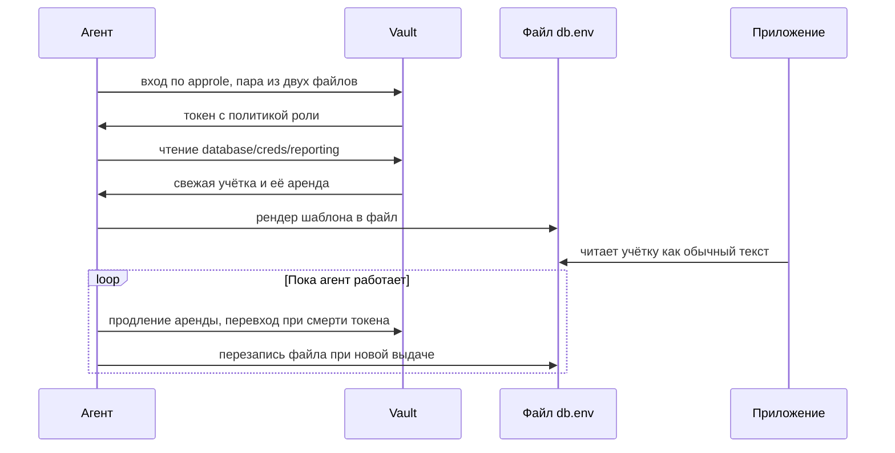

# Vault: интеграция с приложением и с CI

Агент запущен с конфигурацией на восемнадцать строк. Через пять секунд
рядом с приложением лежит файл, которого оно ждало:

```text
$ cat /tmp/agent/db.env
v-approle-reportin-1QE7xOa7uLKDPJi974aq-1791049908:ldh9pXw-g5pUq6qkVfSW
```

Приложение при этом не знает слова «Vault»: оно читает обычный файл, как
делало всегда. Файл написал Vault Agent — соседний процесс, который вошёл
в хранилище за приложение, вычитал свежую учётку базы и записал её по
шаблону. Пока агент работает, он сам продлевает аренду и перезаписывает
файл при смене учётки. Это и есть интеграция без переписывания. По какому
порядку агент превращает шаблон в файл с секретом — и какие две ловушки
пойманы на этом стенде?

## Как это работает

**Откуда это взялось.** Выдача секрета по политике разобрана в теме
`vault`, аренда и её продление — в теме `vault-lease-rotation`; здесь эта
механика не повторяется. Там осталась без ответа другая задача:
приложение написано задолго до хранилища и не умеет ни входить в Vault,
ни продлевать аренды. Переписывать двести сервисов ради хранилища никто
не будет. Ответом стал процесс-посредник, который говорит с хранилищем
за приложение.

Этот посредник — Vault Agent, обычный процесс на той же машине, где живёт
приложение. Он берёт на себя всё общение с хранилищем. Входит он по
методу платформы — способу входа, который удостоверяет сама среда:
approle на сервере, роль Kubernetes в кластере, личность job в CI.
Дальше агент держит токен, читает секреты и пишет их в файлы.

Бытовое соответствие — помощник с доверенностью. Он ходит в банк (хранилище) по
вашей доверенности (реквизиты входа) и получает документ (секрет).
Документ он кладёт в ящик вашего стола (файл), а вы его читаете. Ломается
аналогия в одном месте: настоящий документ в ящике лежит неизменным. Файл
же агент перезаписывает при каждой новой выдаче, и читающий его об этом
не узнаёт.

Конфигурация агента состоит из трёх частей. Первая — auto-auth,
автоматический вход: каким методом агент предъявляет себя хранилищу.
Вторая — sink, буквально «сток»: куда положить полученный токен, например
в файл. Третья — template, шаблон: какой секрет читать и в какой файл его
записать. Продление и перевход встроены и настройки не требуют. Токен
умер — агент входит заново. Аренда подходит к сроку — агент продлевает
её или берёт новую учётку и перезаписывает файл.

Для машин у Vault есть отдельный метод входа — approle, «роль
приложения». Вместо одного пароля он работает с парой: role_id играет
роль логина, secret_id — роль пароля. Пару нарочно разносят по разным
каналам доставки, чтобы один украденный файл не открывал вход: например,
role_id кладёт деплой-скрипт, а secret_id приезжает отдельно. Дальше
агент делает всё сам:



**Описание схемы.** Участников четверо: агент, хранилище, файл и
приложение. Агент входит по approle и получает токен. По токену он читает
секрет и получает учётку с арендой. Затем рендерит шаблон, то есть
подставляет значения, и пишет файл. Приложение читает только файл и ни с
кем больше не говорит. Петля внизу — фоновая работа: продление аренды и
перезапись файла повторяются, пока агент жив.

## Что умеет и чего не умеет

Умеет: войти по методу платформы без секрета в коде приложения, держать
файл с секретом свежим, продлевать аренды. Умеет и пережить перезапуск:
агент входит заново и снова пишет файл. Не умеет: написать за вас
политику — её пишете вы, и это первая ловушка ниже. Не умеет заставить
приложение перечитать файл. И не умеет защитить записанный файл сильнее,
чем позволяют его права на хосте.

Про права стоит сказать сразу, потому что умолчание неприятное: шаблон
пишет файл с 0644, то есть секрет читает любой пользователь хоста.
Измерено прогоном этой темы, лечение — в блоке «Границы метода». Модель
восьмеричных прав — тема `linux-file-permissions`. Политика, приложение
и файл остаются вашими.

## Как запустить

Порядок на стенде темы `vault`, четыре шага:

1. Включите метод входа и заведите роль: `auth enable approle`, роль
   `reporter` с политикой на чтение точки выдачи.
2. Заберите пару role_id и secret_id в файлы рядом с конфигурацией
   агента.
3. Напишите agent.hcl: auto_auth approle с путями к обоим файлам, sink
   в файл, template с секретом в db.env.
4. Запустите агента и прочитайте файл.

Конфигурация целиком — из прогона этой темы на Vault 1.21.3. Читается
она четырьмя планами: вход, реквизиты входа, место токена и результат.

```text
auto_auth {
  method "approle" {
    config = {
      role_id_file_path = "/tmp/agent/role_id"
      secret_id_file_path = "/tmp/agent/secret_id"
      remove_secret_id_file_after_reading = false
    }
  }
  sink "file" { config = { path = "/tmp/agent/token" } }
}
template {
  destination = "/tmp/agent/db.env"
  contents = <<-EOT
    {{- with secret "database/creds/reporting" -}}
    {{ .Data.username }}:{{ .Data.password }}
    {{- end }}
  EOT
}
```

Вход — блок auto_auth с методом approle. Реквизиты — пути к файлам
role_id и secret_id, там же строка про remove. Место токена — sink: туда
агент пишет полученный токен. Результат — блок template: источником стоит
динамическая роль из темы `vault`, содержимое — одна строка
«учётка:пароль», назначение — тот самый файл db.env из введения.

Строка про remove из плана «реквизиты» — не украшение. По умолчанию агент
считает secret_id одноразовым и удаляет его файл после первого чтения.
Первый старт проходит, а перезапуск умирает с «no known secret ID»:
войти заново уже нечем. Поймано на стенде этой темы, разбор — в «Проверь
себя».

## Как читать вывод

Успех — это файл: db.env появился и содержит свежую учётку вида
v-approle-… из введения. Имя начинается с v-approle-, потому что учётку
создал движок базы под чтение токеном, полученным методом approle: в
имени видны и метод входа, и роль. Вторая проверка — журнал агента:
ошибки входа и рендера шаблона идут туда.

Вот отказ из журнала прогона этой темы — у роли агента стояла политика
default. Метка времени и повтор пути в строке опущены:

```text
[WARN]  agent: (view) vault.read(database/creds/reporting):
Error making API request.
URL: GET http://127.0.0.1:8200/v1/database/creds/reporting
Code: 403. Errors:

* 1 error occurred:
  * permission denied
```

Читается такой отказ однозначно. Код 403 стоит на чтении конкретного
пути, а сам вход прошёл — иначе запроса к секрету в журнале не было бы.
Поэтому «permission denied» здесь означает не сломанный агент, а политику
роли без нужного пути. Обе ошибки этого текста пойманы прогоном: эта — на
роли с политикой default, вторая — на перезапуске с удалённым secret_id.
По какому из двух каналов — файл или журнал агента — вы увидите, что
учётка сменилась?

## Сторона хранилища и сторона конвейера

Доставка секрета в job конвейера написана в теме `ci-secrets`; здесь
остаётся сторона хранилища — как Vault принимает доверие и что выдаёт
взамен. Различить стороны помогает срок жизни получателя. В CI роль
посредника играет сам форж: удостоверение job меняется на короткий
доступ, и файл не нужен, потому что job живёт недолго. Агент нужен там,
где приложение живёт дольше одного запуска и секрет нужен ему постоянно:
тогда посредник живёт рядом и обновляет выданное.

## Границы метода

Агент переносит секрет в файл на хосте, и права этого файла становятся
моделью доступа к секрету. Умолчания здесь слабые, и оба измерены
прогоном этой темы: шаблон пишет файл с 0644 — секрет читает любой
пользователь хоста, а sink кладёт токен с 0640. Лечение — две строки
конфигурации, perms у шаблона и mode у sink, обе проверены тем же
прогоном:

```text
sink "file" { config = { path = "/tmp/agent/token" mode = 0600 } }
template {
  destination = "/tmp/agent/db.env"
  perms = 0600
  # строка contents — как в блоке «Как запустить»
}
```

Каталог вокруг файла остаётся вашим: 0700 на нём закрывает даже то, что
забудет шаблон. Дальше действует обычная модель прав хоста из темы
`linux-file-permissions` — агент её не заменяет.

Метод approle годится, пока пара role_id и secret_id хранится аккуратно;
в кластере её заменяет роль Kubernetes, а в CI — личность job из темы
`ci-secrets`. Приложение, читающее файл один раз при старте, не увидит
ротацию: агент пишет, а приложение не перечитывает и ходит мёртвой
учёткой до перезапуска.

Отдельная граница — доступность хранилища. У агента есть кеш, то есть
сохранённые копии уже полученного. Выданное переживает недоступность
Vault: файл с секретом остаётся на месте. Новой выдачи без хранилища
нет: если агент стартует, когда Vault лежит, файла не появится.

И ещё одна граница, со стороны базы. Учётке из `connection_url` темы
`vault` хватает создавать и удалять учётные записи динамических ролей и
отдавать им то, что написано в creation_statements. Суперпользователь
базы для этого не нужен, а её утечка отдаёт все выдачи разом.

## Частая ошибка

Агент запущен, токен на месте — можно ли считать интеграцию законченной?
Вход приравнивают к финишу: раз агент вошёл, интеграция готова.

**Вход и выдача — разные права.** Токен появился, sink написан, а шаблон
падает: политика роли не включает путь секрета. По токену агента вход
выглядит успешным; читается ошибка только по отсутствию файла и по
журналу.

Контрпример из прогона: агент вошёл, токен лежит в sink, db.env не
создан. В журнале при этом отказ с кодом 403 и «permission denied» на
чтении пути секрета; полная запись приведена в блоке «Как читать вывод».
Починка — добавить путь в политику роли, а не перезапускать агента:
перезапуск войдёт с той же ролью и упадёт на том же месте.

## Чеклист для ревью

1. Проверьте, что приложение не знает реквизитов хранилища: вход по
   методу платформы, а не токеном в конфиге.
2. Проверьте, что политика роли агента разрешает ровно пути его шаблонов.
3. Проверьте, что шаблону задан `perms = 0600`, а sink — `mode = 0600`:
   умолчания 0644 и 0640 отдают секрет и токен чужим на хосте. Каталог
   вокруг файла — 0700.
4. Проверьте, что secret_id не удаляется после первого чтения либо
   заведён порядок его перевыпуска.
5. Проверьте, что приложение перечитывает файл либо перезапускается по
   ротации.
6. Проверьте, что токен агента ограничен по времени и по политике роли.

**Зачем это в работе AppSec-инженера.** Интеграция «не трогая
приложение» — рабочий ответ на вопрос «у нас двести сервисов, мы не
перепишем их». Ревью такой интеграции читает две вещи: чем вошёл агент
и что в его политике. Чеклист выше — это они, развёрнутые в шесть
проверок.

## Попробуй сам

На стенде темы `vault` поднимите агента по рецепту из блока «Как
запустить» и добейтесь файла db.env со свежей учёткой. Затем сломайте
политику роли — замените её на default — и прочитайте журнал агента.

Одна подсказка: агент держит выданный токен, и смена политики у роли на
него задним числом не действует — входите заново. Стык с темой `vault`:
там менялось содержимое политики, и оно действует на выданный токен
сразу, потому что токен хранит имя политики, а не её текст. В прогоне
этой темы видно и это. Агент с пустым содержимым политики падал на
рендере. После записи пути в ту же политику он отрендерил файл без
перевхода.

**Критерий выполнения** наблюдаемый: файл со свежей учёткой записан,
после смены политики в журнале отказ с именем пути, после возврата
политики и перевхода файл снова пишется.

## Проверь себя

1. Агент запущен с таким auto_auth. Предскажите, что случится при
   первом старте и при перезапуске, и проверьте на стенде темы `vault`.

   ```text
   auto_auth {
     method "approle" {
       config = {
         role_id_file_path = "/tmp/agent/role_id"
         secret_id_file_path = "/tmp/agent/secret_id"
       }
     }
     sink "file" { config = { path = "/tmp/agent/token" } }
   }
   ```

2. Прочитайте журнал агента: что сломано — вход или политика, и по какому
   признаку это видно?

   ```text
   $ grep -B1 -A3 "403" agent.log
   URL: GET http://127.0.0.1:8200/v1/database/creds/reporting
   Code: 403. Errors:

   * 1 error occurred:
     * permission denied
   ```

3. Почему «токен появился в sink» не означает «секрет доехал до файла»?
4. Приложение читает db.env один раз при старте. Чего оно не увидит
   дальше и почему?
5. Возврат к теме `vault-lease-rotation`: кто продлевает аренду, когда
   приложение читает файл?
6. Возврат к теме `ci-secrets`: где кончается доставка секрета в job и
   начинается работа агента?

<details markdown="1">
<summary>Ответ 1</summary>

1. Первый старт пройдёт: агент войдёт и положит токен в sink. Перезапуск
   умрёт с «no known secret ID»: без строки
   `remove_secret_id_file_after_reading = false` агент удаляет файл с
   secret_id после первого чтения, и войти заново нечем. Команда для
   прогона — два запуска `vault agent -config=agent.hcl` подряд на стенде
   лабы; вторая попытка падает с этой ошибкой.

</details>

<details markdown="1">
<summary>Ответ 2</summary>

2. Сломана политика роли, а не вход: вход прошёл — токен лежит в sink, и
   запросы несут его, а 403 стоит на чтении конкретного пути
   `database/creds/reporting`. Политике роли не хватает этого пути;
   починка — вернуть роли политику с этим путём и войти заново. Сам
   перезапуск ничего не меняет: агент войдёт с той же ролью и упадёт на
   том же месте.

</details>

<details markdown="1">
<summary>Ответ 3</summary>

3. Вход и выдача — разные права: токен доказывает, что метод входа
   принял агента; чтение секрета решает политика роли. Без пути в ней
   шаблон падает с «permission denied», и по токену агента интеграция
   выглядит успешной — читается это только по отсутствию файла.

</details>

<details markdown="1">
<summary>Ответ 4</summary>

4. Ротации: агент продлевает аренду или берёт новую учётку и перезаписывает
   файл, а приложение держит прочитанное при старте значение. Между
   ротацией и перечитыванием оно ходит мёртвой учёткой. Поэтому к файлу
   прилагается ответ на «как приложение узнаёт»: перечитывание по сигналу
   или перезапуск.

</details>

<details markdown="1">
<summary>Ответ 5</summary>

5. Агент: аренду держит тот, кто писал в файл, — он её и продлевает, пока
   работает, а приложение про аренду не знает ничего. Агент остановлен —
   аренда умрёт по сроку, и файл перестанет обновляться.

</details>

<details markdown="1">
<summary>Ответ 6</summary>

6. Доставка кончается там, где секрет стал доступен job — токеном форжа
   или переменной шага. Агент начинается там, где приложение живёт дольше
   одного job и секрет нужен ему постоянно. В CI обмен токена job на
   короткий доступ решает ту же задачу без файла.

</details>

## Источники

1. Vault Agent, документация HashiCorp; реестр `vault-agent`. Разделы:
   auto-auth, `sinks`, templates, кеширование.
   <https://developer.hashicorp.com/vault/docs/agent-and-proxy/agent>
2. Configuring OpenID Connect in HashiCorp Vault, документация GitHub;
   реестр `gha-oidc-vault`. Разделы: обмен токена job на доступ,
   настройка роли в Vault.
   <https://docs.github.com/en/actions/how-tos/secure-your-work/security-harden-deployments/oidc-in-hashicorp-vault>

Каркас этапа: записи семейства man-* и якоря подразделов — наследуются
всеми темами этапа 4.

**Скоропортящийся слой.** Поля конфигурации агента и имена методов
проверяются при ревизии; умолчание про удаление secret_id и умолчания
прав на файлы (0644 у шаблона, 0640 у sink) — свойство версии. Обе
ловушки и замеры прав привязаны к Vault 1.21.3.

**Маркеры уверенности.** **Проверено лично** 2026-09-01 и повторено
2026-10-03 на Arch Linux, Vault 1.21.3 (dev-сервер на петле,
postgres:16-alpine): агент с approle, sink в файл, шаблон в db.env со
свежей учёткой v-approle-…; обе ловушки пойманы прогоном в оба прогона
(«permission denied» на рендере при политике default; «no known secret
ID» при перезапуске после удаления secret_id). Повтором 2026-10-03
дополнительно измерены умолчания прав (шаблон 0644, sink 0640), проверена
починка `perms = 0600` и `mode = 0600`, и подтверждено, что смена
содержимого политики действует на выданный токен без перевхода.
Устройство агента и методов — **по документации** (обе страницы открыты
лично 2026-09-01). Продление аренды агентом наблюдалось по поведению,
отдельным замером не проверялось.
